# MoChat渠道集成

<cite>
**本文档引用的文件**
- [mochat.py](file://nanobot/channels/mochat.py)
- [schema.py](file://nanobot/config/schema.py)
- [base.py](file://nanobot/channels/base.py)
- [events.py](file://nanobot/bus/events.py)
- [models.py](file://nanobot/platform/channel_bindings/models.py)
- [service.py](file://nanobot/platform/channel_bindings/service.py)
- [channel_bindings.py](file://nanobot/web/routers/channel_bindings.py)
- [README.md](file://README.md)
- [channel_testing.py](file://nanobot/web/channel_testing.py)
- [configMeta.ts](file://web-ui/src/configMeta.ts)
</cite>

## 目录
1. [简介](#简介)
2. [项目结构](#项目结构)
3. [核心组件](#核心组件)
4. [架构概览](#架构概览)
5. [详细组件分析](#详细组件分析)
6. [依赖关系分析](#依赖关系分析)
7. [性能考虑](#性能考虑)
8. [故障排除指南](#故障排除指南)
9. [结论](#结论)

## 简介

MoChat是基于Claw IM的企业级聊天平台，nanobot为其提供了完整的集成支持。该集成实现了以下核心功能：

- **实时通信**：使用Socket.IO WebSocket协议进行低延迟消息传输
- **企业级特性**：支持客户联系管理和群聊自动化功能
- **多模式消息路由**：支持会话（session）和面板（panel）两种消息类型
- **智能消息处理**：具备去重、缓冲和延迟回复机制
- **富文本支持**：兼容多种消息格式和媒体内容

MoChat渠道集成了nanobot的消息总线系统，提供了企业级的客户关系管理和自动化营销功能。

## 项目结构

nanobot中MoChat集成的核心文件组织如下：

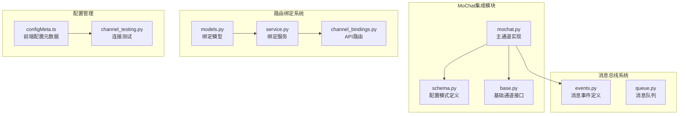

**图表来源**
- [mochat.py:1-897](file://nanobot/channels/mochat.py#L1-L897)
- [schema.py:140-165](file://nanobot/config/schema.py#L140-L165)
- [base.py:15-88](file://nanobot/channels/base.py#L15-L88)

**章节来源**
- [mochat.py:1-897](file://nanobot/channels/mochat.py#L1-L897)
- [schema.py:140-165](file://nanobot/config/schema.py#L140-L165)

## 核心组件

### MoChat通道实现

MoChat通道继承自基础通道类，实现了完整的消息处理生命周期：

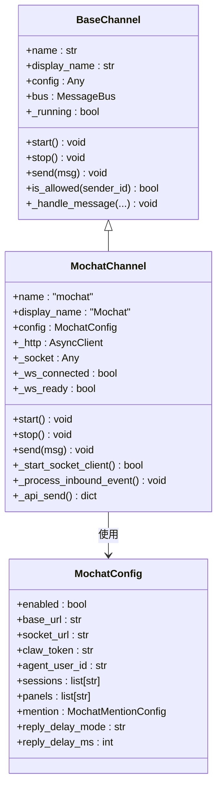

**图表来源**
- [base.py:15-88](file://nanobot/channels/base.py#L15-L88)
- [mochat.py:215-249](file://nanobot/channels/mochat.py#L215-L249)
- [schema.py:140-165](file://nanobot/config/schema.py#L140-L165)

### 消息处理流程

MoChat实现了复杂的消息处理机制，包括去重、缓冲和延迟回复：

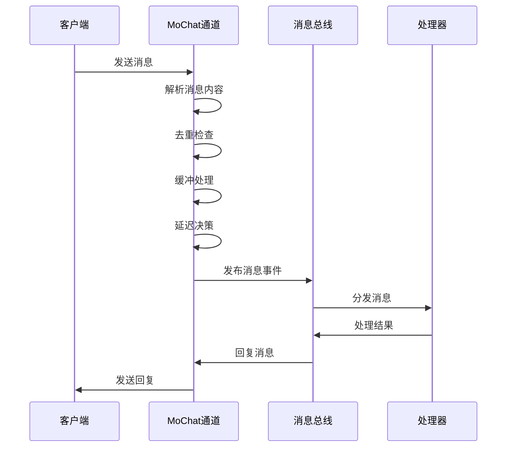

**图表来源**
- [mochat.py:664-764](file://nanobot/channels/mochat.py#L664-L764)
- [events.py:8-39](file://nanobot/bus/events.py#L8-L39)

**章节来源**
- [mochat.py:215-897](file://nanobot/channels/mochat.py#L215-L897)
- [base.py:15-135](file://nanobot/channels/base.py#L15-L135)

## 架构概览

### 系统架构图

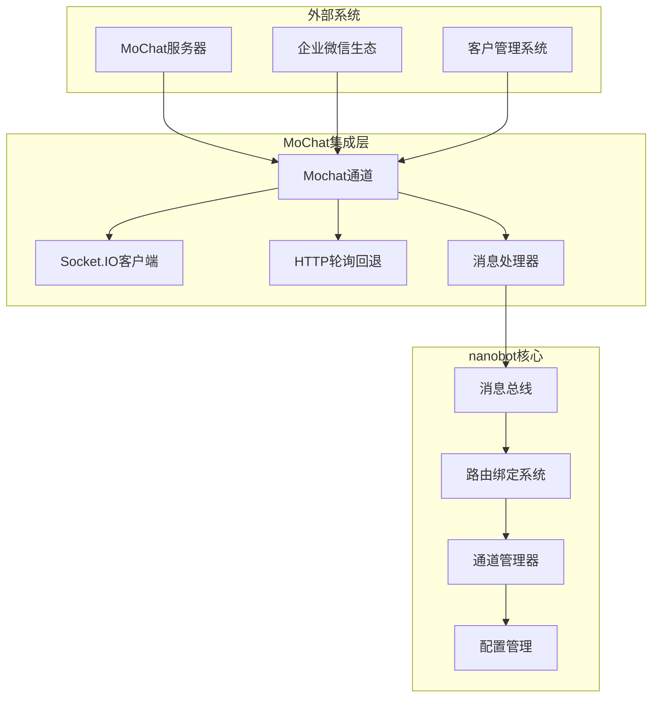

**图表来源**
- [mochat.py:346-417](file://nanobot/channels/mochat.py#L346-L417)
- [schema.py:140-165](file://nanobot/config/schema.py#L140-L165)

### 消息路由机制

MoChat实现了灵活的消息路由系统，支持多种目标类型：

```mermaid
flowchart TD
A[接收消息] --> B{消息类型判断}
B --> |会话消息| C[会话路由]
B --> |面板消息| D[面板路由]
C --> E{目标解析}
D --> E
E --> F{权限验证}
F --> |允许| G[消息处理]
F --> |拒绝| H[忽略消息]
G --> I{是否需要@提及}
I --> |是且未提及| J[延迟处理]
I --> |满足条件| K[立即处理]
J --> L[缓冲等待]
L --> M[检查提及状态]
M --> |已提及| K
M --> |超时| K
K --> N[发布到总线]
N --> O[等待响应]
O --> P[发送回复]
```

**图表来源**
- [mochat.py:664-708](file://nanobot/channels/mochat.py#L664-L708)
- [mochat.py:723-747](file://nanobot/channels/mochat.py#L723-L747)

## 详细组件分析

### 配置系统

MoChat配置系统提供了全面的企业级配置选项：

| 配置项 | 类型 | 默认值 | 描述 |
|--------|------|--------|------|
| enabled | bool | False | 是否启用MoChat通道 |
| base_url | str | "https://mochat.io" | MoChat服务器基础URL |
| socket_url | str | "" | Socket.IO服务器URL |
| socket_path | str | "/socket.io" | Socket.IO路径 |
| claw_token | str | "" | API访问令牌 |
| agent_user_id | str | "" | 代理用户ID |
| sessions | list[str] | [] | 会话ID列表 |
| panels | list[str] | [] | 面板ID列表 |
| reply_delay_mode | str | "non-mention" | 延迟回复模式 |
| reply_delay_ms | int | 120000 | 延迟时间(毫秒) |

**章节来源**
- [schema.py:140-165](file://nanobot/config/schema.py#L140-L165)

### 消息格式支持

MoChat支持多种消息格式和富文本内容：

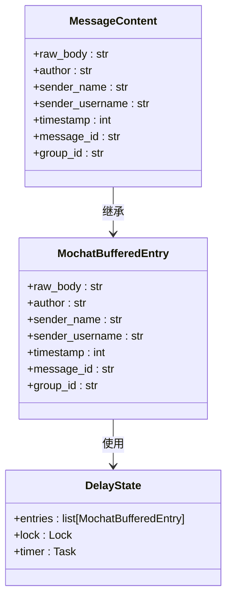

**图表来源**
- [mochat.py:42-60](file://nanobot/channels/mochat.py#L42-L60)
- [mochat.py:54-60](file://nanobot/channels/mochat.py#L54-L60)

### 企业级特性

#### 客户联系管理

MoChat集成了完整的企业客户联系管理功能：

- **会话管理**：支持动态会话发现和订阅
- **联系人识别**：通过用户ID和用户名识别联系人
- **权限控制**：基于白名单的访问控制
- **会话跟踪**：持久化的会话游标管理

#### 群聊自动化

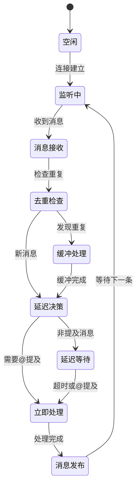

**图表来源**
- [mochat.py:689-708](file://nanobot/channels/mochat.py#L689-L708)
- [mochat.py:723-747](file://nanobot/channels/mochat.py#L723-L747)

**章节来源**
- [mochat.py:485-564](file://nanobot/channels/mochat.py#L485-L564)

### 路由绑定系统

MoChat集成了强大的路由绑定系统，支持将消息路由到特定的代理或团队：

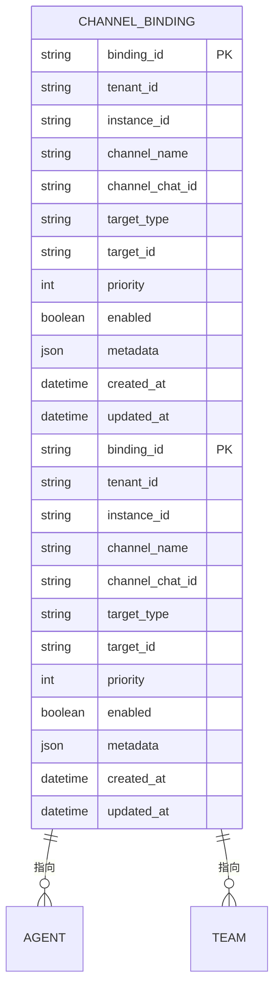

**图表来源**
- [models.py:15-69](file://nanobot/platform/channel_bindings/models.py#L15-L69)

**章节来源**
- [models.py:15-69](file://nanobot/platform/channel_bindings/models.py#L15-L69)
- [service.py:28-201](file://nanobot/platform/channel_bindings/service.py#L28-L201)

## 依赖关系分析

### 外部依赖

MoChat集成依赖以下外部库：

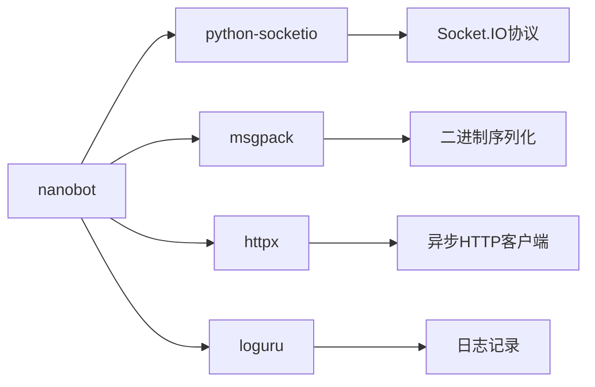

**图表来源**
- [mochat.py:21-32](file://nanobot/channels/mochat.py#L21-L32)

### 内部依赖关系

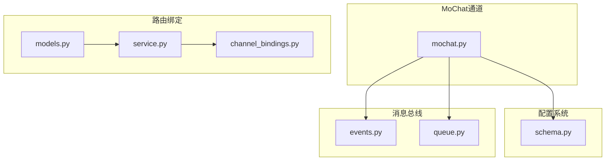

**图表来源**
- [mochat.py:15-19](file://nanobot/channels/mochat.py#L15-L19)
- [schema.py:6-8](file://nanobot/config/schema.py#L6-L8)

**章节来源**
- [mochat.py:15-32](file://nanobot/channels/mochat.py#L15-L32)

## 性能考虑

### 连接管理

MoChat实现了智能的连接管理策略：

- **WebSocket优先**：默认使用Socket.IO WebSocket协议
- **HTTP回退**：WebSocket失败时自动切换到HTTP轮询
- **重连机制**：支持可配置的重连延迟和最大重试次数
- **资源清理**：优雅关闭连接和清理临时资源

### 消息处理优化

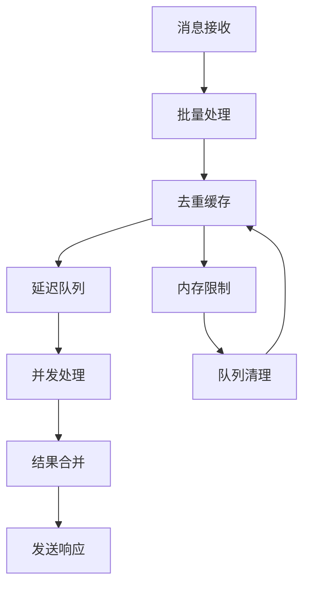

**图表来源**
- [mochat.py:712-722](file://nanobot/channels/mochat.py#L712-L722)
- [mochat.py:723-747](file://nanobot/channels/mochat.py#L723-L747)

## 故障排除指南

### 常见问题诊断

| 问题类型 | 症状 | 可能原因 | 解决方案 |
|----------|------|----------|----------|
| 连接失败 | WebSocket连接错误 | 网络问题或认证失败 | 检查网络连接和claw_token |
| 消息丢失 | 部分消息未收到 | 去重机制或延迟处理 | 检查会话游标和延迟设置 |
| 权限拒绝 | 访问被拒绝 | 未在allow_from列表中 | 添加用户ID到白名单 |
| 性能问题 | 处理延迟高 | 并发限制或资源不足 | 调整并发参数和系统资源 |

### 连接测试

系统提供了完整的连接测试功能：

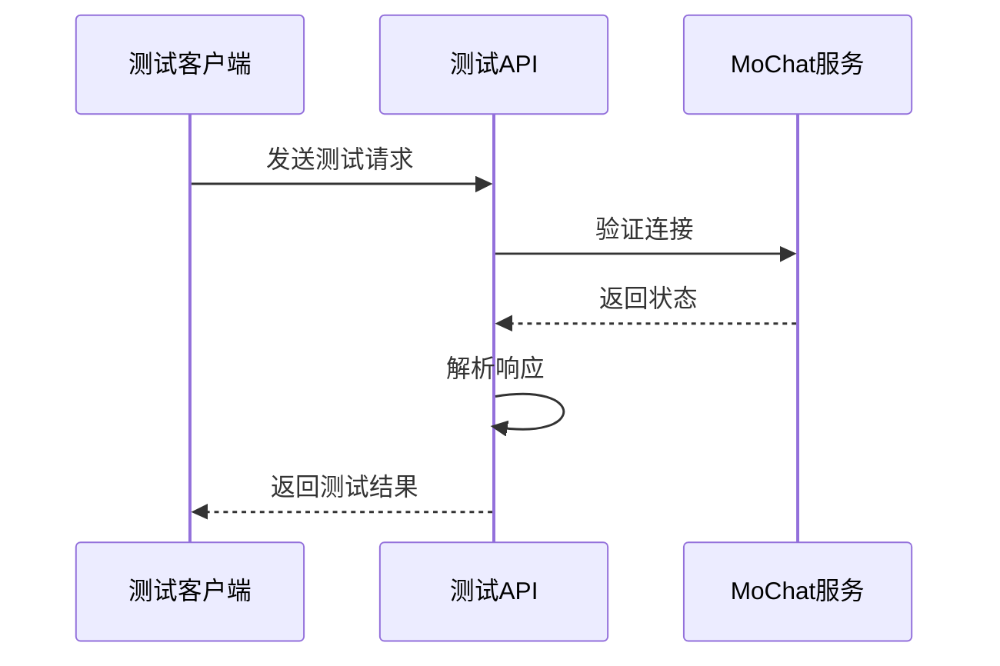

**图表来源**
- [channel_testing.py:517-545](file://nanobot/web/channel_testing.py#L517-L545)

**章节来源**
- [channel_testing.py:517-545](file://nanobot/web/channel_testing.py#L517-L545)

## 结论

MoChat渠道集成为nanobot提供了企业级的聊天平台集成能力。通过Socket.IO协议和HTTP轮询的双重保障，确保了消息传输的可靠性和实时性。集成的路由绑定系统使得企业能够灵活地将消息路由到合适的代理或团队，而智能的消息处理机制则保证了消息的准确传递和处理效率。

该集成支持丰富的消息格式和富文本内容，能够满足企业级应用的各种需求。同时，完善的配置管理和故障排除工具为企业部署和运维提供了便利。

对于企业用户而言，MoChat集成不仅提供了强大的客户联系管理功能，还支持群聊自动化和营销自动化等高级特性，是构建企业级智能客服系统的理想选择。