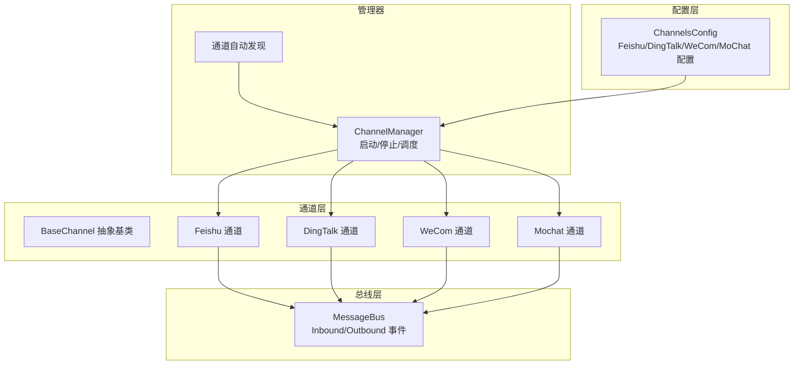
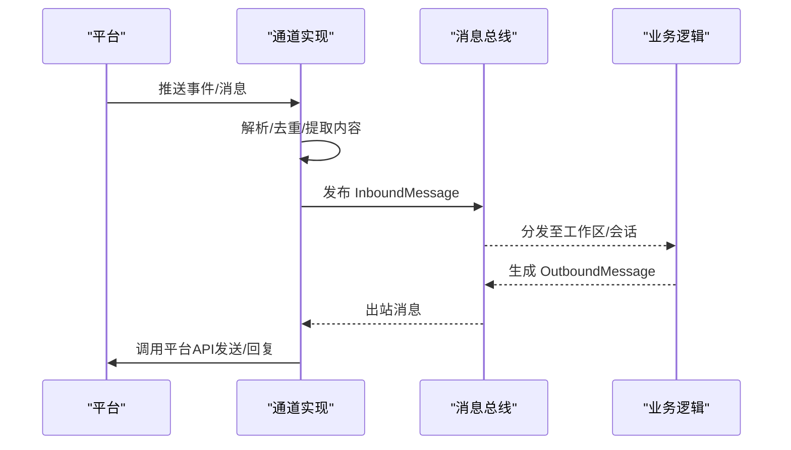
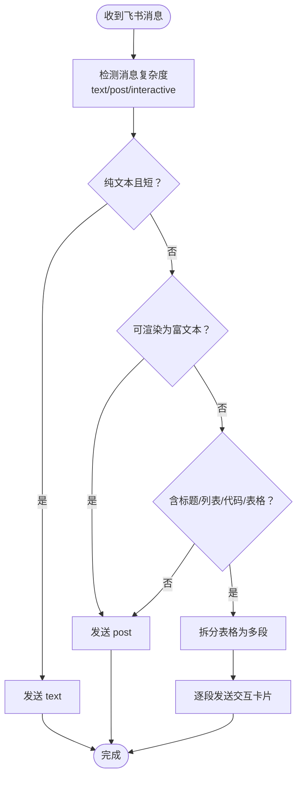
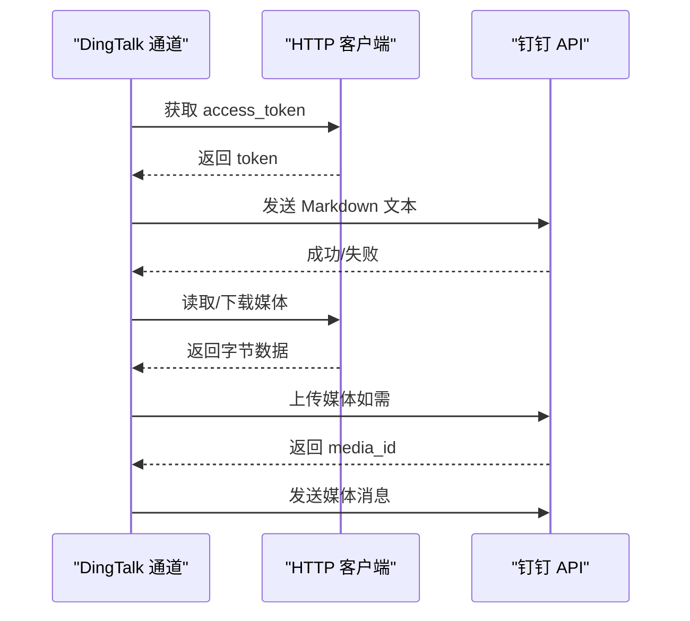
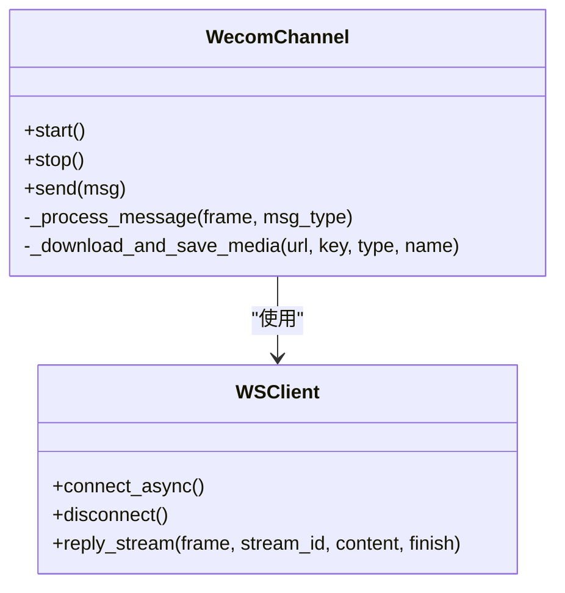
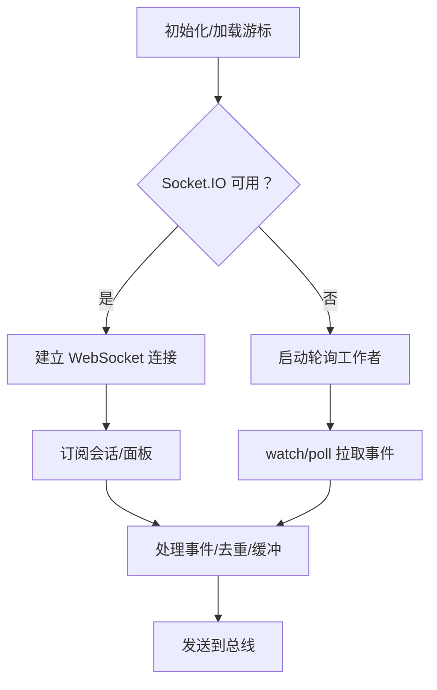
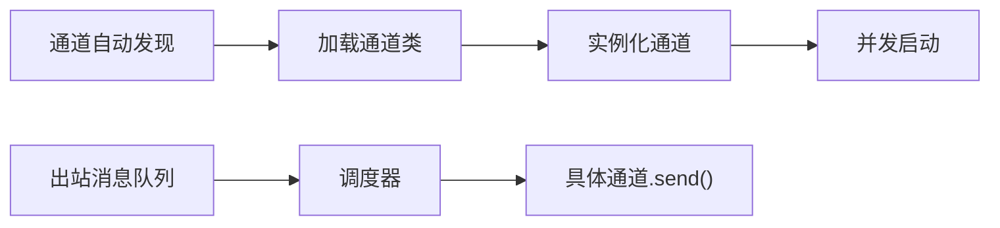

# 中文生态渠道

<cite>
**本文引用的文件**
- [channels/base.py](file://nanobot/channels/base.py)
- [channels/feishu.py](file://nanobot/channels/feishu.py)
- [channels/dingtalk.py](file://nanobot/channels/dingtalk.py)
- [channels/wecom.py](file://nanobot/channels/wecom.py)
- [channels/mochat.py](file://nanobot/channels/mochat.py)
- [channels/registry.py](file://nanobot/channels/registry.py)
- [channels/manager.py](file://nanobot/channels/manager.py)
- [config/schema.py](file://nanobot/config/schema.py)
- [bus/events.py](file://nanobot/bus/events.py)
- [test_feishu_post_content.py](file://tests/test_feishu_post_content.py)
- [test_feishu_table_split.py](file://tests/test_feishu_table_split.py)
- [test_dingtalk_channel.py](file://tests/test_dingtalk_channel.py)
</cite>

## 目录
1. [简介](#简介)
2. [项目结构](#项目结构)
3. [核心组件](#核心组件)
4. [架构总览](#架构总览)
5. [详细组件分析](#详细组件分析)
6. [依赖分析](#依赖分析)
7. [性能考量](#性能考量)
8. [故障排查指南](#故障排查指南)
9. [结论](#结论)
10. [附录](#附录)

## 简介
本文件面向中文生态中的主流企业级即时通讯渠道：飞书（Lark）、钉钉、企业微信（WeCom）、MoChat。文档聚焦以下方面：
- 企业级特性与认证流程：如何在各平台创建企业应用、配置事件订阅或流式连接、完成鉴权与权限控制。
- 组织架构与用户身份：如何基于平台提供的用户标识进行访问控制与会话路由。
- 消息格式适配：富文本、交互卡片、列表与表格等复杂内容的渲染策略。
- 多媒体内容处理：图片、音频、视频与文件的上传、下载与本地缓存。
- 企业部署最佳实践与安全注意事项。

## 项目结构
本项目采用“通道即插件”的设计：每个即时通讯平台以独立模块实现，统一继承自抽象基类，并通过自动发现机制加载启用的通道。消息总线负责入站/出站消息的分发与路由。

图表来源
- [channels/registry.py:15-36](file://nanobot/channels/registry.py#L15-L36)
- [channels/manager.py:86-104](file://nanobot/channels/manager.py#L86-L104)
- [channels/base.py:15-78](file://nanobot/channels/base.py#L15-L78)
- [config/schema.py:213-229](file://nanobot/config/schema.py#L213-L229)

章节来源
- [channels/registry.py:15-36](file://nanobot/channels/registry.py#L15-L36)
- [channels/manager.py:86-104](file://nanobot/channels/manager.py#L86-L104)
- [channels/base.py:15-78](file://nanobot/channels/base.py#L15-L78)
- [config/schema.py:213-229](file://nanobot/config/schema.py#L213-L229)

## 核心组件
- 抽象基类 BaseChannel：定义通道生命周期（start/stop）、发送接口（send）与入站消息处理（_handle_message），并提供通用的访问控制（allow_from）与语音转写能力。
- 通道实现：Feishu、DingTalk、WeCom、MoChat 分别对接平台的长连接/流式事件与HTTP API，完成消息收发与媒体处理。
- 通道管理器 ChannelManager：扫描已启用通道、实例化并并发启动；负责出站消息派发到对应通道。
- 配置模型 ChannelsConfig：集中管理各通道的开关、凭证与行为参数。
- 消息总线事件：InboundMessage/OutboundMessage 定义跨通道的消息载体。

章节来源
- [channels/base.py:15-135](file://nanobot/channels/base.py#L15-L135)
- [channels/manager.py:52-209](file://nanobot/channels/manager.py#L52-L209)
- [config/schema.py:213-229](file://nanobot/config/schema.py#L213-L229)
- [bus/events.py:8-39](file://nanobot/bus/events.py#L8-L39)

## 架构总览
下图展示从通道到总线再到业务处理的整体流程，以及各通道的关键差异点（长连接 vs 流式 vs HTTP 轮询）。

图表来源
- [channels/feishu.py:264-354](file://nanobot/channels/feishu.py#L264-L354)
- [channels/dingtalk.py:135-188](file://nanobot/channels/dingtalk.py#L135-L188)
- [channels/wecom.py:51-104](file://nanobot/channels/wecom.py#L51-L104)
- [channels/mochat.py:252-298](file://nanobot/channels/mochat.py#L252-L298)
- [bus/events.py:8-39](file://nanobot/bus/events.py#L8-L39)

## 详细组件分析

### 飞书（Feishu/Lark）
- 连接方式：WebSocket 长连接，无需公网IP或回调地址；支持事件订阅（im.message.receive_v1）。
- 认证与权限：
  - 使用 App ID/App Secret 初始化客户端。
  - 可选加密密钥与校验令牌用于事件解密与签名校验。
  - 基于 allow_from（open_id 列表）进行访问控制。
- 消息格式适配：
  - 自动检测内容复杂度，选择 text/post/interactive 三种格式之一。
  - 富文本（post）支持链接；复杂内容（标题、列表、代码块、表格）使用交互卡片。
  - 表格解析与拆分：限制每张卡片最多一张表格，多表时拆分为多条消息。
- 多媒体处理：
  - 支持图片、音频、文件上传与下载；图片与文件分别调用不同API。
  - 下载后保存到本地媒体目录，返回本地路径供后续工具链使用。
- 交互增强：
  - 可选添加消息反应（reaction）以提升交互体验。

图表来源
- [channels/feishu.py:526-563](file://nanobot/channels/feishu.py#L526-L563)
- [channels/feishu.py:417-458](file://nanobot/channels/feishu.py#L417-L458)

章节来源
- [channels/feishu.py:234-354](file://nanobot/channels/feishu.py#L234-L354)
- [channels/feishu.py:526-667](file://nanobot/channels/feishu.py#L526-L667)
- [channels/feishu.py:668-793](file://nanobot/channels/feishu.py#L668-L793)
- [config/schema.py:39-51](file://nanobot/config/schema.py#L39-L51)

### 钉钉（DingTalk）
- 连接方式：Stream Mode（WebSocket）接收事件，HTTP API 发送消息。
- 认证与权限：
  - 使用 AppKey/AppSecret 获取 access_token。
  - 基于 allow_from（staff_id 列表）进行访问控制。
- 消息格式与多媒体：
  - 文本采用 Markdown 格式发送。
  - 图片优先直传URL，否则尝试上传后发送；音频/视频/文件上传后以 media_id 发送。
  - 私聊与群聊区分：群聊以 group: 前缀标识，私聊直接使用用户ID。
- 错误回退：上传失败时发送可见的回退提示，保证用户可观测性。

图表来源
- [channels/dingtalk.py:189-215](file://nanobot/channels/dingtalk.py#L189-L215)
- [channels/dingtalk.py:231-307](file://nanobot/channels/dingtalk.py#L231-L307)
- [channels/dingtalk.py:424-445](file://nanobot/channels/dingtalk.py#L424-L445)

章节来源
- [channels/dingtalk.py:105-188](file://nanobot/channels/dingtalk.py#L105-L188)
- [channels/dingtalk.py:189-445](file://nanobot/channels/dingtalk.py#L189-L445)
- [config/schema.py:53-60](file://nanobot/config/schema.py#L53-L60)

### 企业微信（WeCom）
- 连接方式：WebSocket 长连接，无需公网IP。
- 认证与权限：
  - 使用 Bot ID/Secret 初始化客户端。
  - enter_chat 事件可触发欢迎语。
  - 基于 allow_from（用户ID列表）进行访问控制。
- 消息类型与多媒体：
  - 支持 text/image/voice/file/mixed 多种消息类型。
  - 媒体下载后本地保存，语音消息包含平台转写文本。
- 回复机制：存储聊天帧信息以便进行流式回复。

图表来源
- [channels/wecom.py:28-104](file://nanobot/channels/wecom.py#L28-L104)
- [channels/wecom.py:163-287](file://nanobot/channels/wecom.py#L163-L287)
- [channels/wecom.py:288-354](file://nanobot/channels/wecom.py#L288-L354)

章节来源
- [channels/wecom.py:28-104](file://nanobot/channels/wecom.py#L28-L104)
- [channels/wecom.py:163-354](file://nanobot/channels/wecom.py#L163-L354)
- [config/schema.py:203-211](file://nanobot/config/schema.py#L203-L211)

### MoChat
- 连接方式：Socket.IO（优先），若不可用则使用 HTTP 轮询回退。
- 认证与权限：
  - 使用 Claw Token 进行鉴权。
  - 支持按群组/面板规则控制是否需要被@才能触发回复。
- 会话与面板：
  - 会话（session）与面板（panel）两类目标，支持自动发现与订阅。
  - 内置延迟缓冲与去重机制，避免重复与抖动。
- 多媒体与内容：
  - 支持文本与媒体混合发送；媒体以字符串形式透传。

图表来源
- [channels/mochat.py:252-298](file://nanobot/channels/mochat.py#L252-L298)
- [channels/mochat.py:346-418](file://nanobot/channels/mochat.py#L346-L418)
- [channels/mochat.py:568-631](file://nanobot/channels/mochat.py#L568-L631)
- [channels/mochat.py:634-764](file://nanobot/channels/mochat.py#L634-L764)

章节来源
- [channels/mochat.py:215-298](file://nanobot/channels/mochat.py#L215-L298)
- [channels/mochat.py:346-764](file://nanobot/channels/mochat.py#L346-L764)
- [config/schema.py:140-165](file://nanobot/config/schema.py#L140-L165)

## 依赖分析
- 通道自动发现：通过扫描通道包自动发现模块名并加载其中的 BaseChannel 子类。
- 通道管理：ChannelManager 在启动时实例化启用的通道，并并发启动；出站消息由统一调度器派发。
- 配置耦合：各通道配置均位于 ChannelsConfig 下，便于集中管理与热更新。
- 总线契约：InboundMessage/OutboundMessage 作为跨通道的统一数据结构，确保路由与会话一致性。

图表来源
- [channels/registry.py:15-36](file://nanobot/channels/registry.py#L15-L36)
- [channels/manager.py:115-139](file://nanobot/channels/manager.py#L115-L139)
- [channels/manager.py:160-190](file://nanobot/channels/manager.py#L160-L190)

章节来源
- [channels/registry.py:15-36](file://nanobot/channels/registry.py#L15-L36)
- [channels/manager.py:86-104](file://nanobot/channels/manager.py#L86-L104)
- [channels/manager.py:160-190](file://nanobot/channels/manager.py#L160-L190)

## 性能考量
- 并发与去重：
  - 各通道内置去重集合与有序缓存，避免重复处理与内存膨胀。
  - MoChat 使用延迟缓冲与定时器合并多条消息，降低噪声与抖动。
- I/O 优化：
  - 飞书/钉钉/企业微信均采用异步HTTP客户端与线程池配合，避免阻塞事件循环。
  - 媒体下载后落盘，减少重复下载与带宽占用。
- 负载均衡：
  - ChannelManager 并发启动多个通道，充分利用多核资源。
- 渲染策略：
  - 飞书根据内容复杂度自动选择最优格式，避免超限与渲染失败。

## 故障排查指南
- 通道未启动或报错
  - 检查通道配置项（如 app_id/app_secret、client_id/client_secret、bot_id/secret、claw_token）是否正确填写。
  - 查看通道日志中关于 SDK 可用性与事件注册的错误提示。
- 访问被拒绝
  - 确认 allow_from 列表非空；如为空将拒绝所有请求。
  - 飞书使用 open_id，钉钉使用 staff_id，企业微信使用用户ID，MoChat使用作者ID。
- 媒体发送失败
  - 钉钉上传失败会回退为可见提示；检查网络与媒体URL可达性。
  - 企业微信语音消息包含平台转写文本，若为空可能是转写失败。
- 消息格式异常
  - 飞书复杂内容（标题/列表/代码/表格）将转换为交互卡片；如出现渲染问题，请简化格式或拆分内容。
- 会话/面板未响应
  - MoChat 若 WebSocket 不可用将回退轮询；检查网络连通性与 Socket.IO 依赖安装情况。

章节来源
- [channels/base.py:79-88](file://nanobot/channels/base.py#L79-L88)
- [channels/manager.py:107-114](file://nanobot/channels/manager.py#L107-L114)
- [channels/dingtalk.py:424-445](file://nanobot/channels/dingtalk.py#L424-L445)
- [channels/wecom.py:163-287](file://nanobot/channels/wecom.py#L163-L287)
- [channels/feishu.py:526-563](file://nanobot/channels/feishu.py#L526-L563)
- [channels/mochat.py:346-418](file://nanobot/channels/mochat.py#L346-L418)

## 结论
本项目通过统一的通道抽象与自动发现机制，实现了对飞书、钉钉、企业微信、MoChat 的企业级集成。通道层专注于平台差异与媒体处理，配置层集中管理凭证与行为，总线层保障消息一致性与路由。结合访问控制、去重与缓冲策略，可在企业环境中稳定运行并满足多样化的消息格式与多媒体需求。

## 附录

### 企业部署最佳实践
- 凭证管理
  - 将 app_id/app_secret、client_id/client_secret、bot_id/secret、claw_token 等敏感信息置于环境变量或密钥管理服务中。
- 网络与防火墙
  - 飞书/企业微信使用长连接，确保服务器可访问平台域名；MoChat 若使用 Socket.IO，需允许 WebSocket 协议与特定路径。
- 日志与监控
  - 开启通道日志级别，记录关键事件（连接、认证、发送/接收、错误）以便审计与排障。
- 速率与限流
  - 平台API通常有速率限制，建议在业务侧增加退避与重试策略。
- 多租户与路由
  - 使用 ChannelManager 的路由代理功能，将不同租户/团队的消息定向到对应通道与会话。

### 安全注意事项
- 入站消息必须经过 allow_from 校验，防止未授权访问。
- 事件订阅需配置加密密钥与校验令牌（飞书），确保事件来源可信。
- 媒体下载与本地落盘应限制目录与权限，避免敏感信息泄露。
- 对外暴露的通道（如 MoChat 轮询）需启用 TLS 与访问控制。

### 配置要点速查
- 飞书：启用开关、App ID/Secret、可选加密密钥与校验令牌、allow_from。
- 钉钉：启用开关、AppKey/AppSecret、allow_from。
- 企业微信：启用开关、Bot ID/Secret、可选欢迎语、allow_from。
- MoChat：启用开关、基础URL、Socket 参数、Claw Token、会话/面板白名单、@要求策略。

章节来源
- [config/schema.py:39-51](file://nanobot/config/schema.py#L39-L51)
- [config/schema.py:53-60](file://nanobot/config/schema.py#L53-L60)
- [config/schema.py:203-211](file://nanobot/config/schema.py#L203-L211)
- [config/schema.py:140-165](file://nanobot/config/schema.py#L140-L165)