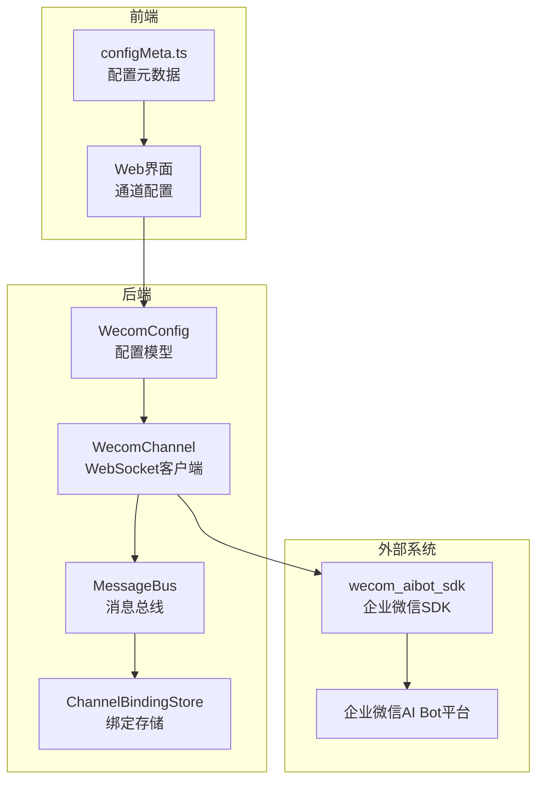
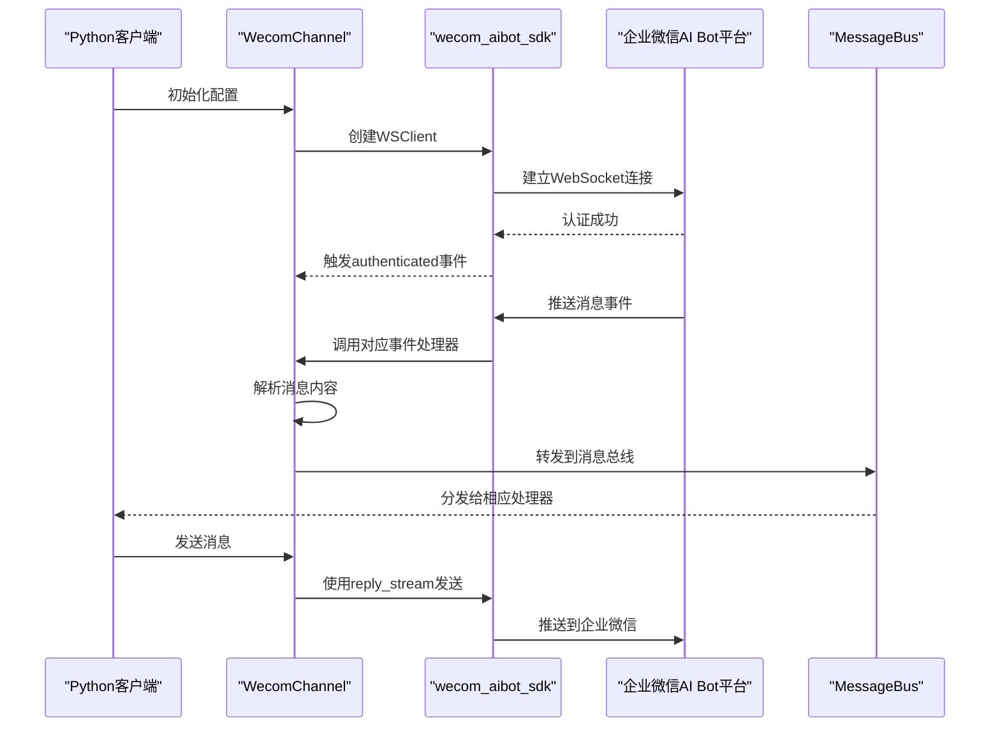
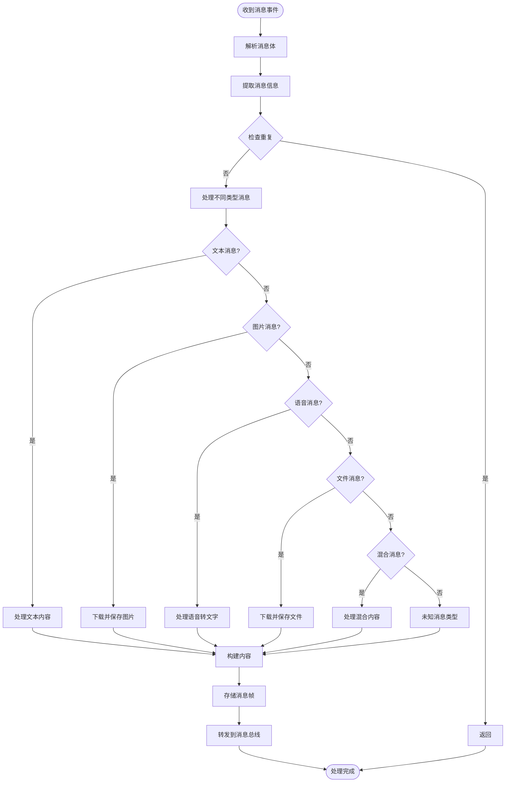
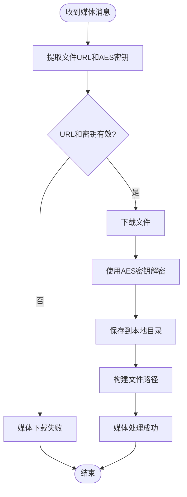
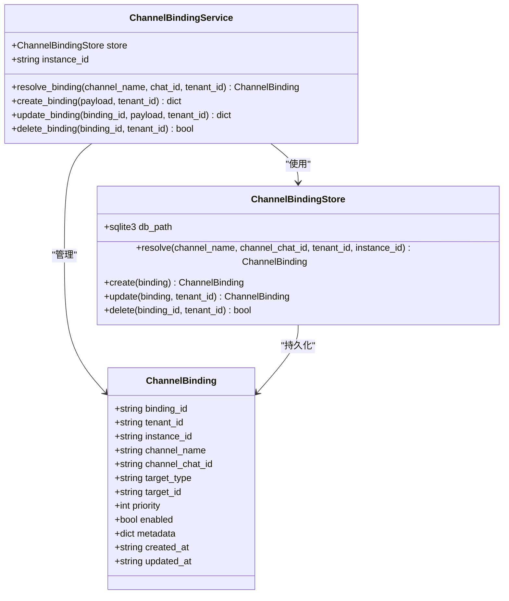
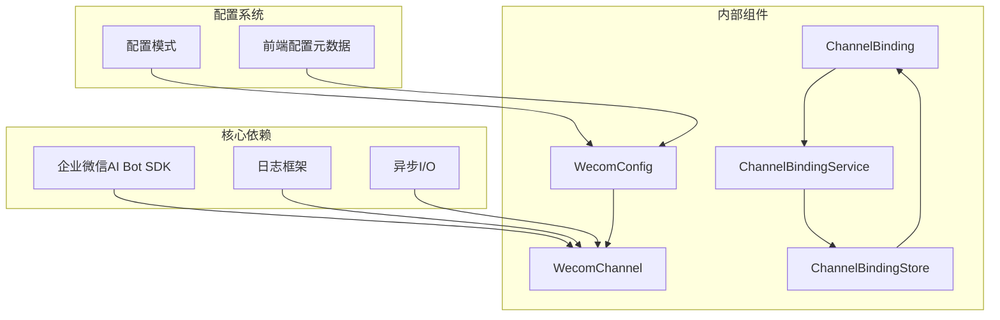

# 企业微信渠道集成

<cite>
**本文档引用的文件**
- [wecom.py](file://nanobot/channels/wecom.py)
- [schema.py](file://nanobot/config/schema.py)
- [models.py](file://nanobot/platform/channel_bindings/models.py)
- [service.py](file://nanobot/platform/channel_bindings/service.py)
- [store.py](file://nanobot/platform/channel_bindings/store.py)
- [configMeta.ts](file://web-ui/src/configMeta.ts)
- [channel_testing.py](file://nanobot/web/channel_testing.py)
- [channel_bindings.py](file://nanobot/web/channels.py)
- [channels.py](file://nanobot/web/channels.py)
</cite>

## 目录
1. [简介](#简介)
2. [项目结构](#项目结构)
3. [核心组件](#核心组件)
4. [架构概览](#架构概览)
5. [详细组件分析](#详细组件分析)
6. [依赖关系分析](#依赖关系分析)
7. [性能考虑](#性能考虑)
8. [故障排除指南](#故障排除指南)
9. [结论](#结论)

## 简介
本文件为企业微信（WeCom）渠道的完整集成文档。内容涵盖企业微信应用号的创建与配置、消息类型支持、组织架构集成、消息推送API调用示例以及安全机制实现细节。该集成基于WebSocket长连接，无需公网IP或Webhook，通过企业微信AI Bot平台进行消息收发。

## 项目结构
企业微信渠道位于`nanobot/channels/wecom.py`，配置定义在`nanobot/config/schema.py`中，前端配置元数据在`web-ui/src/configMeta.ts`中，通道测试逻辑在`nanobot/web/channel_testing.py`中。

**图表来源**
- [wecom.py:28-104](file://nanobot/channels/wecom.py#L28-L104)
- [schema.py:203-211](file://nanobot/config/schema.py#L203-L211)
- [configMeta.ts:205-216](file://web-ui/src/configMeta.ts#L205-L216)

**章节来源**
- [wecom.py:1-354](file://nanobot/channels/wecom.py#L1-L354)
- [schema.py:203-211](file://nanobot/config/schema.py#L203-L211)
- [configMeta.ts:205-216](file://web-ui/src/configMeta.ts#L205-L216)

## 核心组件
企业微信渠道的核心组件包括：

### WeCom配置模型
- **bot_id**: 企业微信AI Bot平台分配的Bot ID
- **secret**: 对应的密钥
- **allow_from**: 允许的用户ID列表（白名单）
- **welcome_message**: 新用户进入聊天时的欢迎语

### WeComChannel类
- 基于WebSocket的长连接实现
- 支持多种消息类型的处理
- 内置消息去重机制
- 媒体文件下载与解密功能

**章节来源**
- [schema.py:203-211](file://nanobot/config/schema.py#L203-L211)
- [wecom.py:28-104](file://nanobot/channels/wecom.py#L28-L104)

## 架构概览
企业微信集成采用事件驱动架构，通过WebSocket与企业微信AI Bot平台保持长连接。

**图表来源**
- [wecom.py:51-104](file://nanobot/channels/wecom.py#L51-L104)
- [wecom.py:322-354](file://nanobot/channels/wecom.py#L322-L354)

## 详细组件分析

### 消息处理组件
企业微信支持多种消息类型，每种类型都有专门的处理逻辑：

**图表来源**
- [wecom.py:163-287](file://nanobot/channels/wecom.py#L163-L287)

### 媒体文件处理
企业微信的媒体文件（图片、语音、文件）需要特殊的下载和解密处理：

**图表来源**
- [wecom.py:288-321](file://nanobot/channels/wecom.py#L288-L321)

### 通道绑定系统
企业微信支持将特定聊天绑定到指定的代理或团队：

**图表来源**
- [models.py:15-69](file://nanobot/platform/channel_bindings/models.py#L15-L69)
- [service.py:28-201](file://nanobot/platform/channel_bindings/service.py#L28-L201)
- [store.py:11-231](file://nanobot/platform/channel_bindings/store.py#L11-L231)

**章节来源**
- [wecom.py:163-321](file://nanobot/channels/wecom.py#L163-L321)
- [models.py:15-69](file://nanobot/platform/channel_bindings/models.py#L15-L69)
- [service.py:28-201](file://nanobot/platform/channel_bindings/service.py#L28-L201)
- [store.py:11-231](file://nanobot/platform/channel_bindings/store.py#L11-L231)

## 依赖关系分析
企业微信集成的关键依赖关系如下：

**图表来源**
- [wecom.py:3-17](file://nanobot/channels/wecom.py#L3-L17)
- [schema.py:203-211](file://nanobot/config/schema.py#L203-L211)
- [configMeta.ts:205-216](file://web-ui/src/configMeta.ts#L205-L216)

**章节来源**
- [wecom.py:3-17](file://nanobot/channels/wecom.py#L3-L17)
- [schema.py:203-211](file://nanobot/config/schema.py#L203-L211)
- [configMeta.ts:205-216](file://web-ui/src/configMeta.ts#L205-L216)

## 性能考虑
企业微信集成在性能方面有以下优化措施：

1. **消息去重缓存**: 使用有序字典维护最近处理的消息ID，限制缓存大小为1000条
2. **异步处理**: 所有网络操作采用异步I/O，避免阻塞
3. **增量更新**: 通道绑定系统使用优先级排序，提高查找效率
4. **内存管理**: 媒体文件下载后立即写入磁盘，避免长时间占用内存

## 故障排除指南

### 常见问题及解决方案

#### SDK依赖问题
- **症状**: 启动时显示SDK未安装
- **解决**: 安装企业微信SDK依赖
- **命令**: `pip install nanobot-ai[wecom]`

#### 配置参数缺失
- **症状**: 显示bot_id和secret未配置
- **解决**: 在配置文件中正确设置企业微信应用号参数
- **位置**: `channels.wecom.bot_id` 和 `channels.wecom.secret`

#### WebSocket连接问题
- **症状**: WebSocket连接断开或认证失败
- **解决**: 检查网络连接和企业微信平台状态
- **监控**: 查看日志中的连接状态信息

#### 媒体文件下载失败
- **症状**: 图片、语音或文件消息下载失败
- **解决**: 验证文件URL和AES密钥的有效性
- **检查**: 确认企业微信平台的媒体服务正常运行

**章节来源**
- [wecom.py:53-59](file://nanobot/channels/wecom.py#L53-L59)
- [wecom.py:105-121](file://nanobot/channels/wecom.py#L105-L121)
- [channel_testing.py:495-515](file://nanobot/web/channel_testing.py#L495-L515)

## 结论
企业微信渠道集成为企业级AI应用提供了完整的消息收发能力。通过WebSocket长连接和企业微信AI Bot平台，实现了无需公网IP的实时通信。系统支持多种消息类型，具备完善的媒体文件处理能力和灵活的通道绑定机制。配置简单，易于部署，在企业环境中具有良好的可扩展性和稳定性。