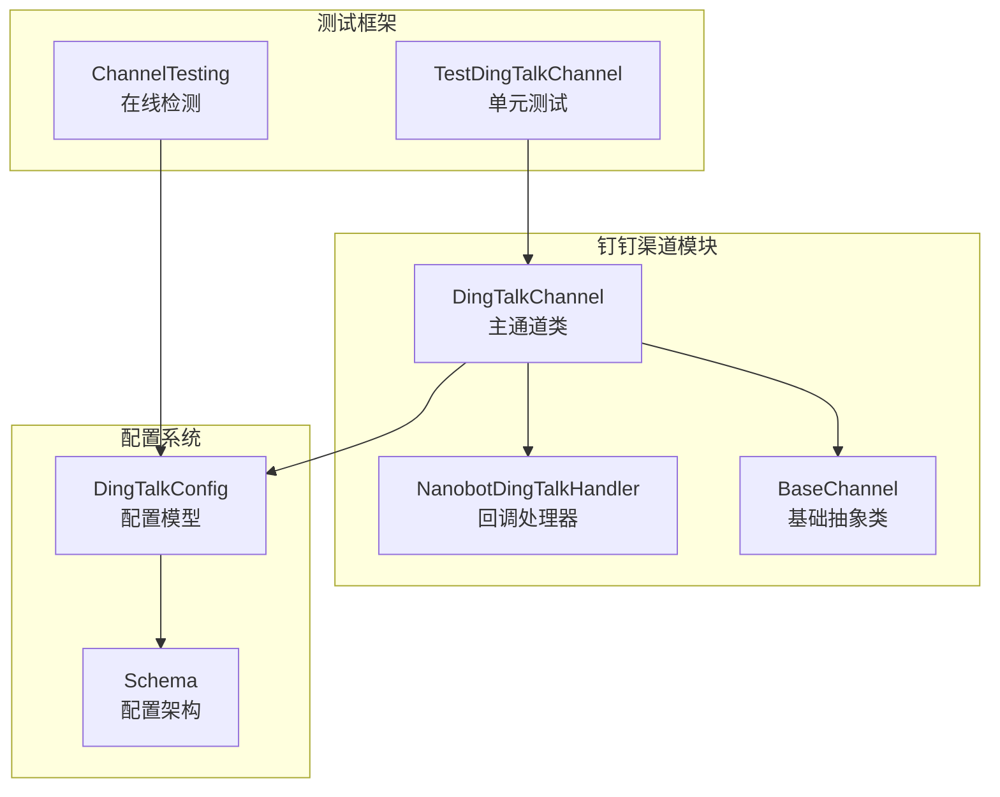
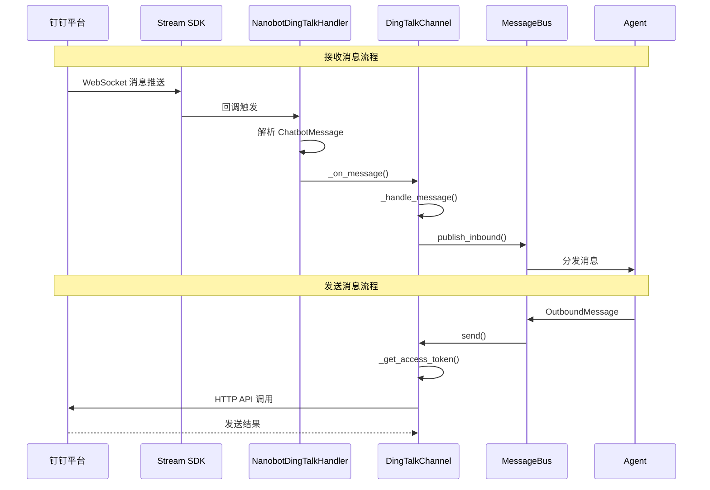
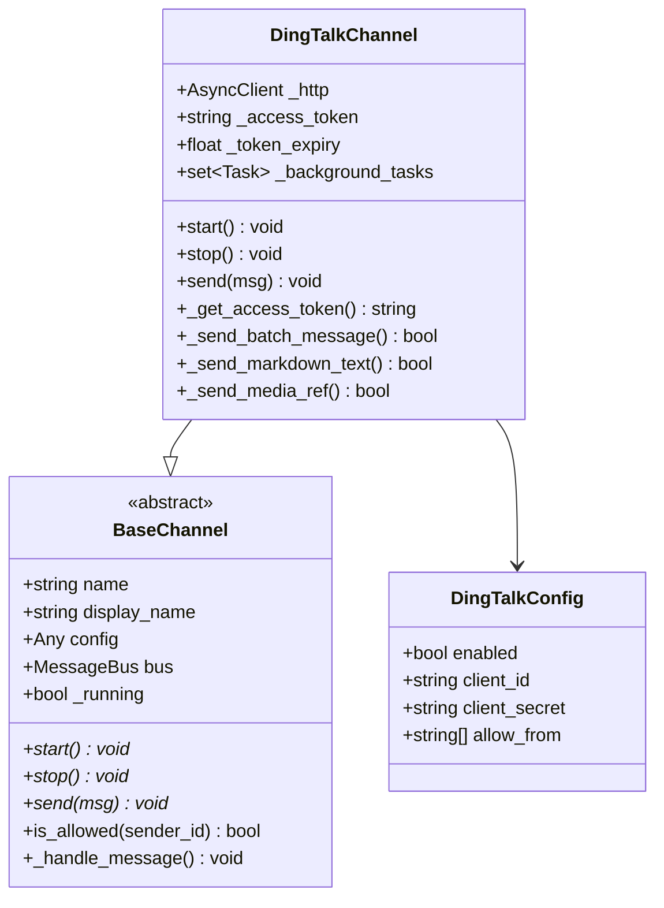
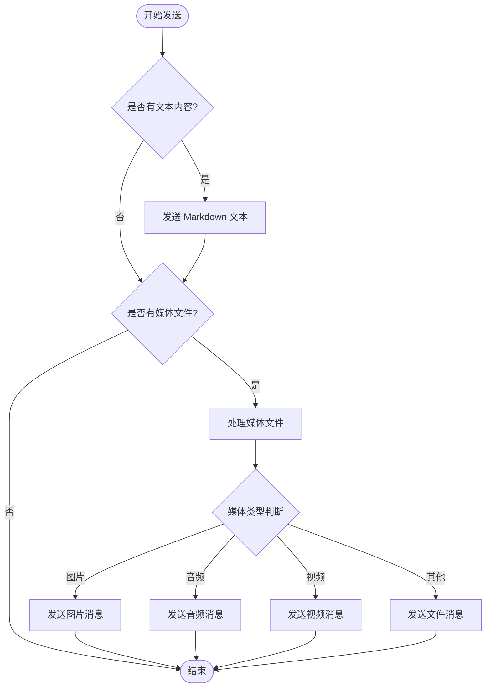
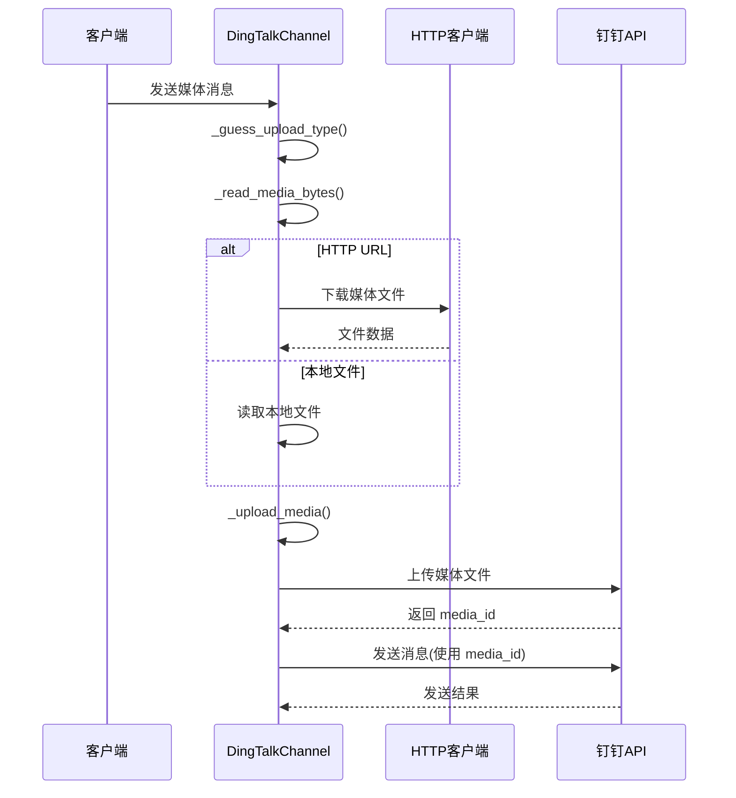
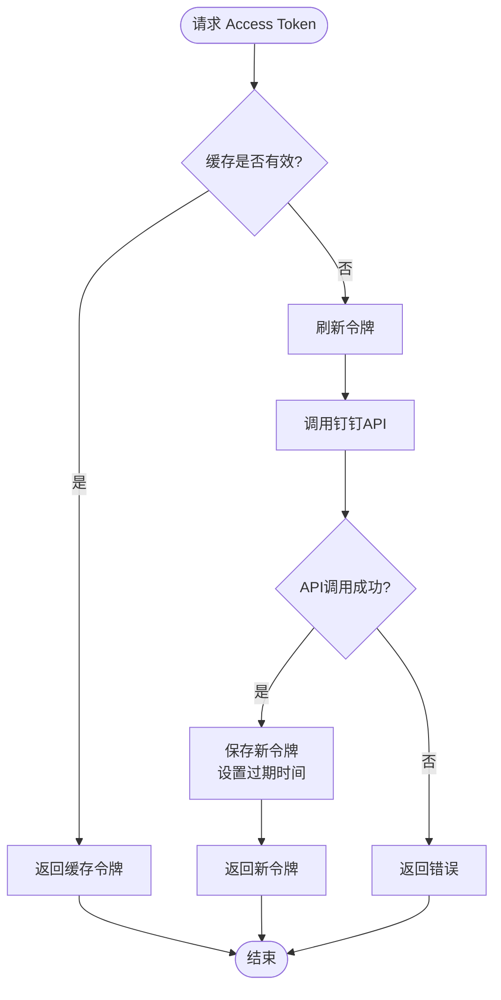
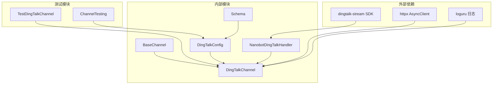

# 钉钉渠道集成

<cite>
**本文档引用的文件**
- [dingtalk.py](file://nanobot/channels/dingtalk.py)
- [schema.py](file://nanobot/config/schema.py)
- [test_dingtalk_channel.py](file://tests/test_dingtalk_channel.py)
- [channel_testing.py](file://nanobot/web/channel_testing.py)
- [base.py](file://nanobot/channels/base.py)
- [configMeta.ts](file://web-ui/src/configMeta.ts)
</cite>

## 目录
1. [简介](#简介)
2. [项目结构](#项目结构)
3. [核心组件](#核心组件)
4. [架构概览](#架构概览)
5. [详细组件分析](#详细组件分析)
6. [依赖关系分析](#依赖关系分析)
7. [性能考虑](#性能考虑)
8. [故障排除指南](#故障排除指南)
9. [结论](#结论)

## 简介

本文档为钉钉渠道创建专门的集成指南，详细说明了基于 Stream 模式的钉钉机器人集成方案。该实现支持钉钉企业应用的完整配置流程，包括应用ID、密钥获取和权限授权，以及丰富的消息推送机制。

钉钉渠道采用双模式架构：使用 WebSocket 的 Stream SDK 接收事件，使用 HTTP API 发送消息。系统支持私聊和群聊两种场景，并提供了完整的媒体文件上传和消息模板功能。

## 项目结构



**图表来源**
- [dingtalk.py:105-135](file://nanobot/channels/dingtalk.py#L105-L135)
- [schema.py:53-60](file://nanobot/config/schema.py#L53-L60)

**章节来源**
- [dingtalk.py:1-50](file://nanobot/channels/dingtalk.py#L1-L50)
- [schema.py:1-50](file://nanobot/config/schema.py#L1-L50)

## 核心组件

### DingTalkChannel 主通道类

DingTalkChannel 是钉钉渠道的核心实现，继承自 BaseChannel 抽象类，负责处理钉钉机器人的所有通信逻辑。

**主要特性：**
- 支持 Stream 模式接收消息（WebSocket）
- 支持 HTTP API 发送消息
- 自动管理 Access Token 生命周期
- 完整的媒体文件处理能力
- 群聊和私聊统一路由

**关键属性：**
- `_IMAGE_EXTS`: 图片文件扩展名集合
- `_AUDIO_EXTS`: 音频文件扩展名集合  
- `_VIDEO_EXTS`: 视频文件扩展名集合
- `_access_token`: 访问令牌缓存
- `_token_expiry`: 令牌过期时间戳

**章节来源**
- [dingtalk.py:105-135](file://nanobot/channels/dingtalk.py#L105-L135)
- [dingtalk.py:189-215](file://nanobot/channels/dingtalk.py#L189-L215)

### NanobotDingTalkHandler 回调处理器

NanobotDingTalkHandler 负责处理来自钉钉 Stream SDK 的回调消息，解析消息内容并转发给主通道。

**核心功能：**
- 解析 ChatbotMessage 对象
- 提取语音识别文本内容
- 处理空消息和不支持的消息类型
- 管理异步任务生命周期

**章节来源**
- [dingtalk.py:40-103](file://nanobot/channels/dingtalk.py#L40-L103)

## 架构概览



**图表来源**
- [dingtalk.py:50-98](file://nanobot/channels/dingtalk.py#L50-L98)
- [dingtalk.py:424-444](file://nanobot/channels/dingtalk.py#L424-L444)

## 详细组件分析

### 配置系统

钉钉渠道的配置完全基于 Pydantic 模型，提供了类型安全的配置管理。



**图表来源**
- [schema.py:53-60](file://nanobot/config/schema.py#L53-L60)
- [base.py:15-77](file://nanobot/channels/base.py#L15-L77)
- [dingtalk.py:105-135](file://nanobot/channels/dingtalk.py#L105-L135)

**配置参数详解：**

| 参数名称 | 类型 | 必填 | 描述 |
|---------|------|------|------|
| enabled | bool | 否 | 是否启用钉钉渠道 |
| client_id | string | 是 | 钉钉应用的 AppKey |
| client_secret | string | 是 | 钉钉应用的 AppSecret |
| allow_from | list[string] | 否 | 允许访问的员工ID列表 |

**章节来源**
- [schema.py:53-60](file://nanobot/config/schema.py#L53-L60)
- [configMeta.ts:199-203](file://web-ui/src/configMeta.ts#L199-L203)

### 消息发送机制

钉钉渠道实现了完整的消息发送流程，支持多种消息类型：



**图表来源**
- [dingtalk.py:424-444](file://nanobot/channels/dingtalk.py#L424-L444)
- [dingtalk.py:365-422](file://nanobot/channels/dingtalk.py#L365-L422)

**消息类型支持：**

1. **文本消息**：使用 `sampleMarkdown` 模板，支持基本的 Markdown 渲染
2. **图片消息**：支持 HTTP URL 和本地文件上传
3. **音频消息**：支持 AMR、MP3、WAV 等格式
4. **视频消息**：支持 MP4、MOV、AVI 等格式
5. **文件消息**：支持任意格式文件上传

**章节来源**
- [dingtalk.py:357-422](file://nanobot/channels/dingtalk.py#L357-L422)

### 媒体文件处理

钉钉渠道提供了完整的媒体文件处理能力，包括自动类型识别、上传和消息发送。



**图表来源**
- [dingtalk.py:220-306](file://nanobot/channels/dingtalk.py#L220-L306)
- [dingtalk.py:273-306](file://nanobot/channels/dingtalk.py#L273-L306)

**媒体类型支持：**

| 类型 | 扩展名 | MIME类型 |
|------|--------|----------|
| 图片 | jpg, jpeg, png, gif, bmp, webp | image/* |
| 音频 | amr, mp3, wav, ogg, m4a, aac | audio/* |
| 视频 | mp4, mov, avi, mkv, webm | video/* |

**章节来源**
- [dingtalk.py:118-121](file://nanobot/channels/dingtalk.py#L118-L121)
- [dingtalk.py:220-272](file://nanobot/channels/dingtalk.py#L220-L272)

### 访问令牌管理

钉钉渠道实现了智能的 Access Token 管理机制，确保 API 调用的可靠性和效率。



**图表来源**
- [dingtalk.py:189-214](file://nanobot/channels/dingtalk.py#L189-L214)

**令牌管理特性：**
- 自动检测令牌有效期
- 提前 60 秒刷新机制
- 异常情况下的降级处理
- 并发访问的安全保证

**章节来源**
- [dingtalk.py:189-214](file://nanobot/channels/dingtalk.py#L189-L214)

## 依赖关系分析



**图表来源**
- [dingtalk.py:20-37](file://nanobot/channels/dingtalk.py#L20-L37)
- [schema.py:53-60](file://nanobot/config/schema.py#L53-L60)

**依赖特性：**
- 可选依赖：dingtalk-stream SDK 缺失时提供降级支持
- 异步设计：全面使用 asyncio 和 httpx
- 类型安全：完整的 Pydantic 配置验证
- 测试友好：提供完整的单元测试覆盖

**章节来源**
- [dingtalk.py:20-37](file://nanobot/channels/dingtalk.py#L20-L37)
- [test_dingtalk_channel.py:1-29](file://tests/test_dingtalk_channel.py#L1-L29)

## 性能考虑

### 连接管理

钉钉渠道实现了智能的连接管理策略：

1. **自动重连机制**：Stream SDK 断开后自动重连
2. **资源清理**：优雅关闭 HTTP 客户端和取消后台任务
3. **内存管理**：防止后台任务被垃圾回收

### 并发处理

- 使用 asyncio Task 处理异步消息
- 独立的后台任务集合管理
- 异常情况下的任务清理

### 缓存策略

- Access Token 缓存减少 API 调用
- 提前刷新避免令牌过期
- 文件类型缓存提升处理效率

## 故障排除指南

### 常见问题诊断

**1. 应用凭据验证失败**
```python
# 检查点
- client_id 是否正确
- client_secret 是否正确  
- 网络连接是否正常
- 钉钉 API 是否可用
```

**2. 消息发送失败**
```python
# 检查点
- Access Token 是否有效
- 群聊 ID 或用户 ID 是否正确
- 网络连接状态
- 钉钉 API 限流情况
```

**3. 媒体文件上传失败**
```python
# 检查点
- 文件 URL 是否可达
- 文件大小是否超过限制
- 文件类型是否受支持
- 网络带宽情况
```

### 错误处理机制

钉钉渠道实现了多层次的错误处理：

1. **网络异常处理**：自动重试和降级
2. **API 错误处理**：详细的错误日志记录
3. **业务逻辑错误**：友好的错误提示
4. **资源清理**：异常情况下的资源释放

**章节来源**
- [dingtalk.py:138-176](file://nanobot/channels/dingtalk.py#L138-L176)
- [dingtalk.py:342-355](file://nanobot/channels/dingtalk.py#L342-L355)

## 结论

钉钉渠道集成为 nanobot 提供了完整的企业级即时通讯解决方案。通过 Stream 模式实现的双向通信、完善的媒体处理能力和智能的令牌管理机制，使得该集成既稳定又高效。

**主要优势：**
- 完整的企业应用支持
- 多种消息类型的统一处理
- 智能的资源管理和错误处理
- 类型安全的配置系统
- 全面的测试覆盖

**适用场景：**
- 企业内部机器人
- 即时通知系统
- 自动化工作流
- 团队协作工具

该集成方案为企业用户提供了一个可靠的钉钉机器人解决方案，支持从简单文本消息到复杂富文本内容的全方位通信需求。