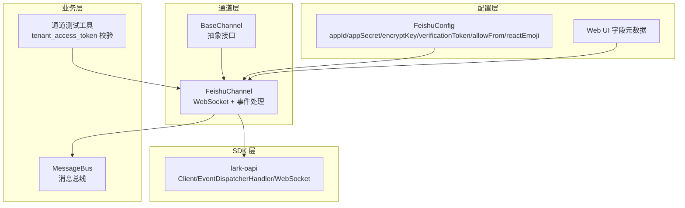
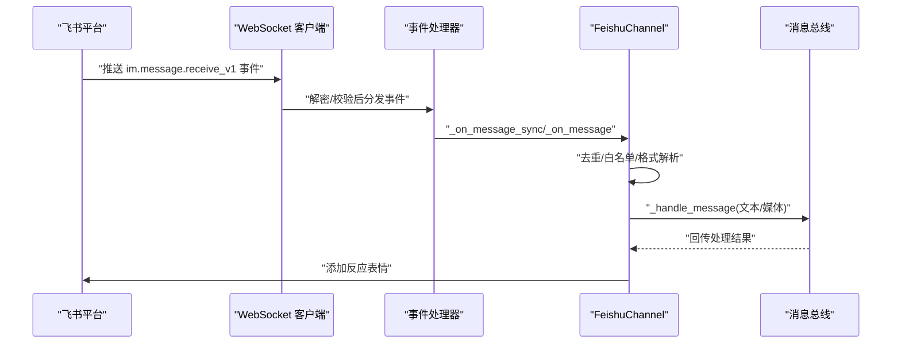
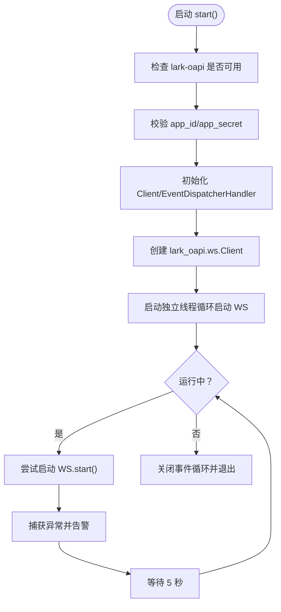
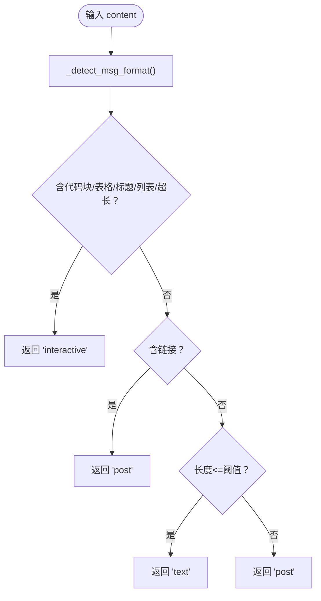
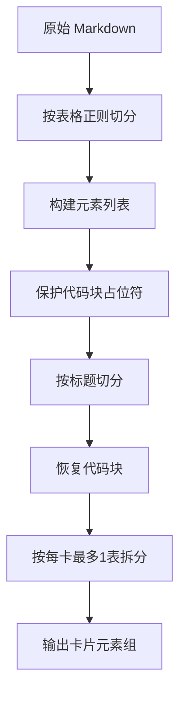
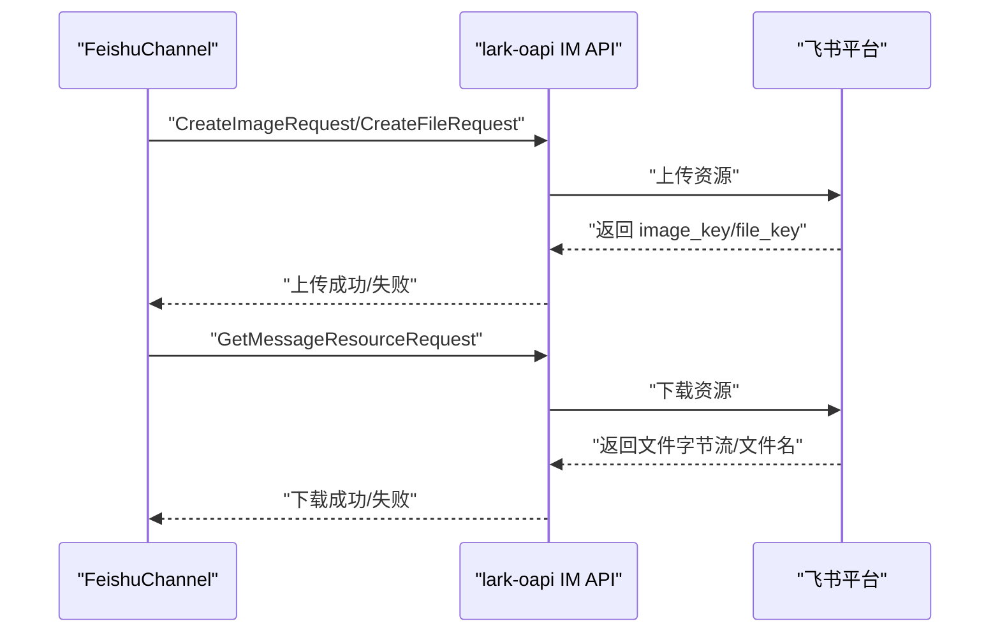
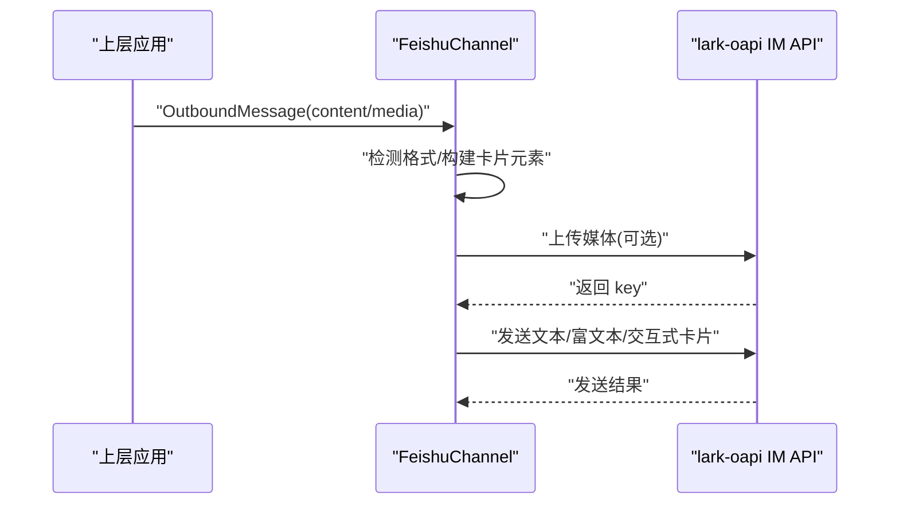
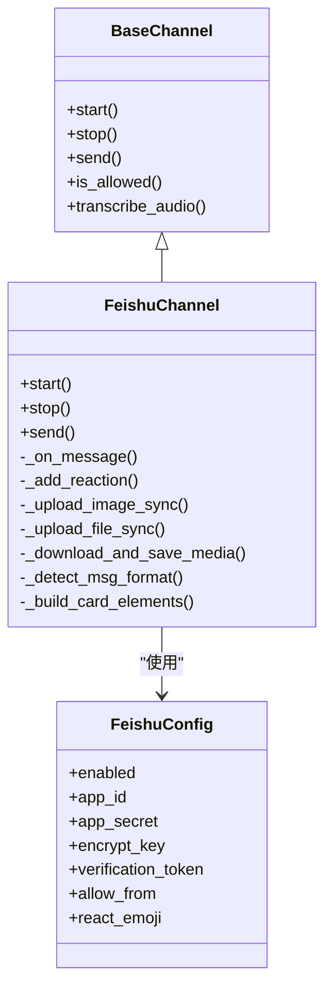

# 飞书渠道集成

<cite>
**本文档引用的文件**
- [nanobot/channels/feishu.py](file://nanobot/channels/feishu.py)
- [nanobot/config/schema.py](file://nanobot/config/schema.py)
- [nanobot/channels/base.py](file://nanobot/channels/base.py)
- [nanobot/web/channels.py](file://nanobot/web/channels.py)
- [nanobot/web/channel_testing.py](file://nanobot/web/channel_testing.py)
- [tests/test_feishu_post_content.py](file://tests/test_feishu_post_content.py)
- [tests/test_feishu_table_split.py](file://tests/test_feishu_table_split.py)
- [web-ui/src/configMeta.ts](file://web-ui/src/configMeta.ts)
</cite>

## 目录
1. [简介](#简介)
2. [项目结构](#项目结构)
3. [核心组件](#核心组件)
4. [架构总览](#架构总览)
5. [详细组件分析](#详细组件分析)
6. [依赖关系分析](#依赖关系分析)
7. [性能考虑](#性能考虑)
8. [故障排查指南](#故障排查指南)
9. [结论](#结论)
10. [附录](#附录)

## 简介
本文件面向飞书(Lark)渠道的集成与使用，基于 nanobot 代码库中的飞书实现，系统性阐述以下内容：
- 基于 lark-oapi SDK 的 WebSocket 长连接机制与事件订阅
- 消息格式检测与富文本渲染策略：文本、富文本(post)、交互式卡片(interactive)
- 飞书特有消息类型的处理：文本、图片、音频、文件、分享卡片、交互式卡片等
- Markdown 到飞书卡片的智能转换算法与表格拆分策略
- 企业级特性：加密密钥、验证令牌、事件订阅配置
- 完整的 API 调用示例：消息发送、媒体文件上传/下载、反应表情添加
- 错误处理策略与性能优化建议

## 项目结构
飞书渠道位于 nanobot/channels/feishu.py，采用继承 BaseChannel 的抽象接口，结合 lark-oapi SDK 实现 WebSocket 事件接收与消息发送。配置模型在 nanobot/config/schema.py 中定义，Web 管理界面在 web-ui/src/configMeta.ts 中展示字段，通道管理逻辑在 nanobot/web/channels.py 中。

图表来源
- [nanobot/channels/feishu.py:234-343](file://nanobot/channels/feishu.py#L234-L343)
- [nanobot/config/schema.py:39-51](file://nanobot/config/schema.py#L39-L51)
- [nanobot/web/channels.py:13-35](file://nanobot/web/channels.py#L13-L35)
- [web-ui/src/configMeta.ts:180-193](file://web-ui/src/configMeta.ts#L180-L193)
- [nanobot/web/channel_testing.py:401-427](file://nanobot/web/channel_testing.py#L401-L427)

章节来源
- [nanobot/channels/feishu.py:1-120](file://nanobot/channels/feishu.py#L1-L120)
- [nanobot/config/schema.py:39-51](file://nanobot/config/schema.py#L39-L51)
- [nanobot/web/channels.py:13-35](file://nanobot/web/channels.py#L13-L35)
- [web-ui/src/configMeta.ts:180-193](file://web-ui/src/configMeta.ts#L180-L193)

## 核心组件
- FeishuChannel：继承自 BaseChannel，负责：
  - 初始化 lark-oapi Client 与 EventDispatcherHandler
  - 启动独立线程的 WebSocket 客户端，持续重连
  - 注册事件回调（消息、反应、已读、进入单聊）
  - 消息格式检测与富文本/卡片渲染
  - 媒体文件上传/下载与本地存储
  - 反应表情添加
- FeishuConfig：飞书配置项，包含 appId、appSecret、encryptKey、verificationToken、allowFrom、reactEmoji 等
- BaseChannel：抽象基类，提供通用权限校验、消息转发、语音转写等能力
- Web 渠道管理：提供前端所需字段元数据与必填项校验

章节来源
- [nanobot/channels/feishu.py:234-343](file://nanobot/channels/feishu.py#L234-L343)
- [nanobot/config/schema.py:39-51](file://nanobot/config/schema.py#L39-L51)
- [nanobot/channels/base.py:15-135](file://nanobot/channels/base.py#L15-L135)
- [nanobot/web/channels.py:13-35](file://nanobot/web/channels.py#L13-L35)

## 架构总览
飞书渠道采用“WebSocket 长连接 + 事件订阅”的方式接收消息，无需公网 IP 或外网回调。消息到达后进行去重、白名单校验、格式解析与富文本渲染，再通过消息总线转发给上层业务。

图表来源
- [nanobot/channels/feishu.py:284-301](file://nanobot/channels/feishu.py#L284-L301)
- [nanobot/channels/feishu.py:862-967](file://nanobot/channels/feishu.py#L862-L967)

## 详细组件分析

### WebSocket 长连接与事件订阅
- 使用 lark_oapi.ws.Client 创建 WebSocket 客户端，独立线程中运行并自动重连
- 事件处理器通过 EventDispatcherHandler.builder 注册多种事件回调
- 支持可选事件：消息反应、消息已读、进入单聊等

图表来源
- [nanobot/channels/feishu.py:264-343](file://nanobot/channels/feishu.py#L264-L343)

章节来源
- [nanobot/channels/feishu.py:264-343](file://nanobot/channels/feishu.py#L264-L343)

### 企业级特性：加密密钥与验证令牌
- encrypt_key：用于事件订阅消息的解密
- verification_token：用于校验事件来源的真实性
- 两者在 EventDispatcherHandler.builder 中传入，确保消息安全

章节来源
- [nanobot/channels/feishu.py:284-301](file://nanobot/channels/feishu.py#L284-L301)
- [nanobot/config/schema.py:39-51](file://nanobot/config/schema.py#L39-L51)

### 消息格式检测与富文本渲染
- 文本：长度不超过阈值且无复杂 Markdown
- 富文本(post)：包含链接、适度长度
- 交互式卡片(interactive)：包含代码块、表格、标题、列表等复杂 Markdown，或超长内容
- 表格限制：每张卡片最多一个 table 元素，超过则拆分为多条卡片

图表来源
- [nanobot/channels/feishu.py:526-562](file://nanobot/channels/feishu.py#L526-L562)

章节来源
- [nanobot/channels/feishu.py:526-562](file://nanobot/channels/feishu.py#L526-L562)
- [tests/test_feishu_table_split.py:1-105](file://tests/test_feishu_table_split.py#L1-L105)

### Markdown 到飞书卡片的智能转换算法
- 将 Markdown 表格解析为卡片 table 元素
- 按标题分割为 div + markdown 组合
- 保护代码块，避免被错误解析
- 多表场景按“每卡最多一张表”拆分

图表来源
- [nanobot/channels/feishu.py:388-491](file://nanobot/channels/feishu.py#L388-L491)
- [nanobot/channels/feishu.py:417-458](file://nanobot/channels/feishu.py#L417-L458)

章节来源
- [nanobot/channels/feishu.py:388-491](file://nanobot/channels/feishu.py#L388-L491)
- [nanobot/channels/feishu.py:417-458](file://nanobot/channels/feishu.py#L417-L458)

### 飞书特有消息类型处理
- 文本：直接提取 text 字段
- 富文本(post)：解析多语言包装、标题与内容行，提取图片键
- 图片/音频/文件/媒体：下载到本地并保存，必要时进行语音转写
- 分享卡片/交互式卡片：递归提取标题、元素与链接
- 其他类型：映射为占位文本

章节来源
- [nanobot/channels/feishu.py:870-967](file://nanobot/channels/feishu.py#L870-L967)
- [nanobot/channels/feishu.py:33-164](file://nanobot/channels/feishu.py#L33-L164)
- [nanobot/channels/feishu.py:167-231](file://nanobot/channels/feishu.py#L167-L231)

### 媒体文件上传/下载与本地存储
- 上传：根据扩展名选择 image 或 file 类型；音频/视频使用 media 类型
- 下载：按消息类型转换为 image/file；音频统一按 file 类型下载
- 存储：统一写入媒体目录，文件名优先使用服务端返回名称

图表来源
- [nanobot/channels/feishu.py:616-721](file://nanobot/channels/feishu.py#L616-L721)

章节来源
- [nanobot/channels/feishu.py:616-721](file://nanobot/channels/feishu.py#L616-L721)

### 反应表情添加
- 在收到消息后，异步添加指定 emoji（默认 THUMBSUP）
- 支持多种 emoji 类型：THUMBSUP、OK、EYES、DONE、OnIt、HEART

章节来源
- [nanobot/channels/feishu.py:355-387](file://nanobot/channels/feishu.py#L355-L387)
- [nanobot/channels/feishu.py:896-897](file://nanobot/channels/feishu.py#L896-L897)

### 发送消息流程
- 根据 chat_id 前缀选择 receive_id_type（open_id 或 chat_id）
- 优先发送媒体文件（图片/音频/视频/文件），再发送文本/富文本/卡片
- 卡片按每卡最多一张表拆分发送

图表来源
- [nanobot/channels/feishu.py:794-861](file://nanobot/channels/feishu.py#L794-L861)

章节来源
- [nanobot/channels/feishu.py:794-861](file://nanobot/channels/feishu.py#L794-L861)

## 依赖关系分析
- FeishuChannel 依赖 lark-oapi SDK 的 Client、EventDispatcherHandler、WebSocket 客户端
- 依赖 BaseChannel 提供的权限校验与消息总线转发
- 依赖配置模型 FeishuConfig 提供的认证与行为参数
- Web 管理界面提供字段元数据与必填项校验

图表来源
- [nanobot/channels/base.py:15-135](file://nanobot/channels/base.py#L15-L135)
- [nanobot/channels/feishu.py:234-343](file://nanobot/channels/feishu.py#L234-L343)
- [nanobot/config/schema.py:39-51](file://nanobot/config/schema.py#L39-L51)

章节来源
- [nanobot/channels/base.py:15-135](file://nanobot/channels/base.py#L15-L135)
- [nanobot/channels/feishu.py:234-343](file://nanobot/channels/feishu.py#L234-L343)
- [nanobot/config/schema.py:39-51](file://nanobot/config/schema.py#L39-L51)

## 性能考虑
- WebSocket 独立线程 + 新事件循环：避免与主循环冲突，减少阻塞
- 去重缓存：维护有序字典记录已处理消息 ID，控制缓存大小
- 事件注册的可选适配：当 SDK 不支持某些事件时优雅降级
- 卡片拆分：每卡最多一张表，避免 API 错误并提升渲染稳定性
- 异步执行：上传/下载/发送均通过线程池执行，避免阻塞事件循环

章节来源
- [nanobot/channels/feishu.py:316-335](file://nanobot/channels/feishu.py#L316-L335)
- [nanobot/channels/feishu.py:877-886](file://nanobot/channels/feishu.py#L877-L886)
- [nanobot/channels/feishu.py:431-458](file://nanobot/channels/feishu.py#L431-L458)

## 故障排查指南
- 无法启动 WebSocket：检查 lark-oapi 是否安装、app_id/app_secret 是否配置
- 事件无法解密/校验失败：核对 encrypt_key 与 verification_token
- 发送失败：查看返回码与日志 ID，确认消息类型与内容格式
- 媒体上传/下载失败：检查文件类型映射与 API 返回状态
- 通道凭据校验：可通过内置探测接口获取 tenant_access_token 并判断凭据有效性

章节来源
- [nanobot/channels/feishu.py:264-273](file://nanobot/channels/feishu.py#L264-L273)
- [nanobot/channels/feishu.py:782-788](file://nanobot/channels/feishu.py#L782-L788)
- [nanobot/web/channel_testing.py:401-427](file://nanobot/web/channel_testing.py#L401-L427)

## 结论
飞书渠道通过 lark-oapi SDK 的 WebSocket 与事件订阅机制，实现了稳定的消息收发与富文本渲染。其智能格式检测与卡片拆分策略，有效解决了飞书卡片 API 的限制；媒体上传/下载与语音转写进一步完善了企业级消息处理能力。配合加密密钥与验证令牌，满足企业安全要求。

## 附录

### 配置项说明
- appId：飞书开放平台应用 ID
- appSecret：飞书开放平台应用密钥
- encryptKey：事件订阅消息加密密钥
- verificationToken：事件订阅校验令牌
- allowFrom：允许的用户 open_id 列表
- reactEmoji：默认反应表情类型

章节来源
- [nanobot/config/schema.py:39-51](file://nanobot/config/schema.py#L39-L51)
- [web-ui/src/configMeta.ts:180-193](file://web-ui/src/configMeta.ts#L180-L193)

### API 调用示例（路径参考）
- 获取 Tenant Access Token（凭据校验）
  - [POST /open-apis/auth/v3/tenant_access_token/internal:403-409](file://nanobot/web/channel_testing.py#L403-L409)
- 发送消息（文本/富文本/交互式卡片）
  - [CreateMessageRequest 构建与发送:770-781](file://nanobot/channels/feishu.py#L770-L781)
- 上传媒体（图片/文件/音频/视频）
  - [CreateImageRequest:618-631](file://nanobot/channels/feishu.py#L618-L631)
  - [CreateFileRequest:642-663](file://nanobot/channels/feishu.py#L642-L663)
- 下载媒体（图片/文件/音频）
  - [GetMessageResourceRequest:670-721](file://nanobot/channels/feishu.py#L670-L721)
- 添加反应表情
  - [CreateMessageReactionRequest:357-367](file://nanobot/channels/feishu.py#L357-L367)

### 测试用例（路径参考）
- 富文本内容提取（支持 post 包装形态）
  - [test_extract_post_content_supports_post_wrapper_shape:4-22](file://tests/test_feishu_post_content.py#L4-L22)
- 表格拆分策略（每卡最多一张表）
  - [test_split_elements_by_table_limit:28-105](file://tests/test_feishu_table_split.py#L28-L105)