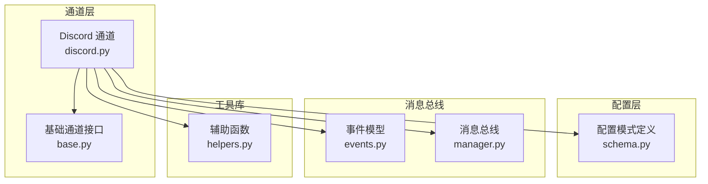
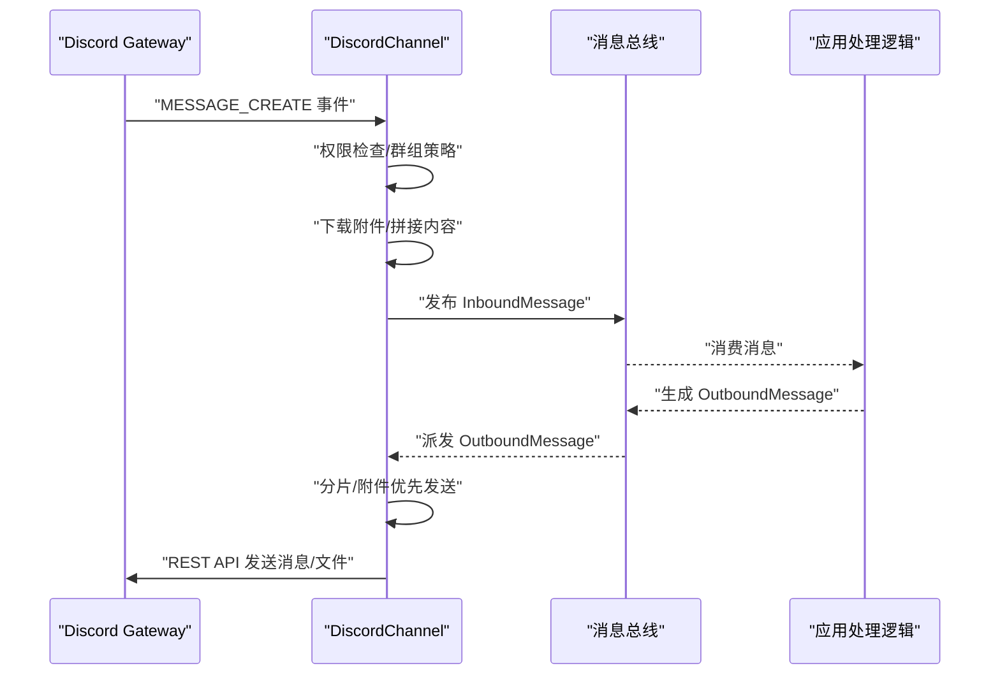
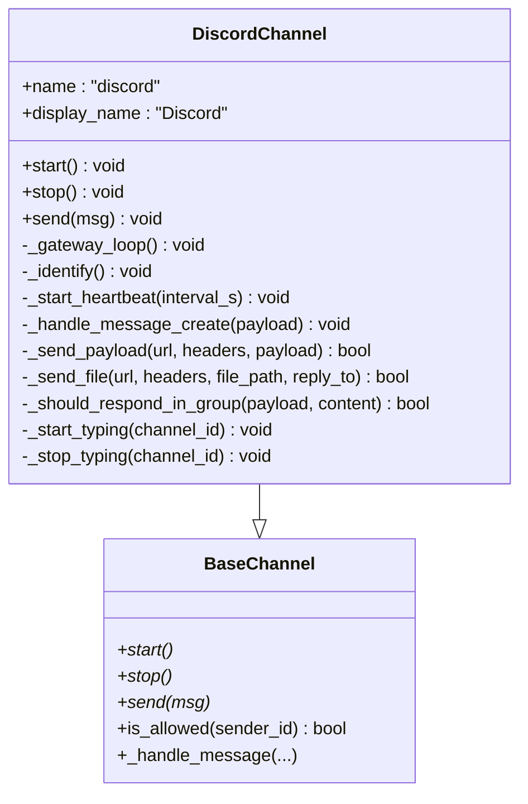
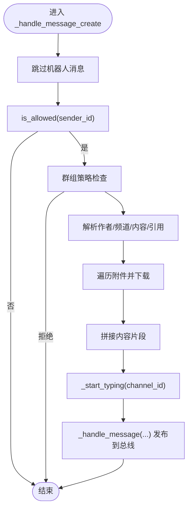
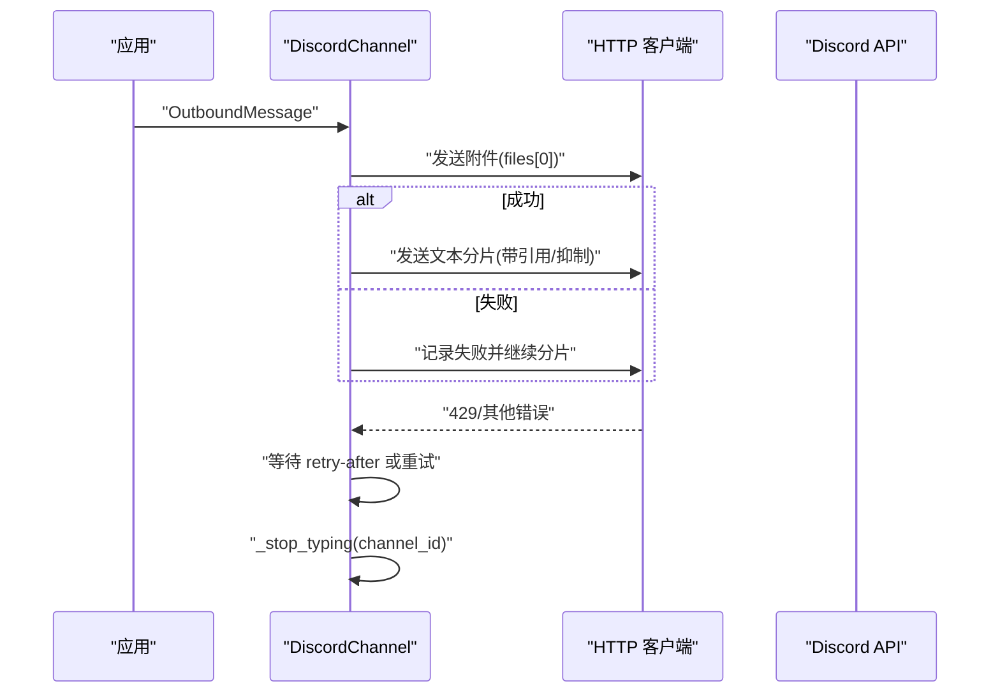
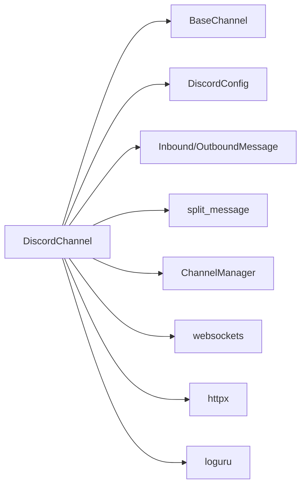

# Discord 渠道集成

<cite>
**本文引用的文件**
- [discord.py](file://nanobot/channels/discord.py)
- [base.py](file://nanobot/channels/base.py)
- [schema.py](file://nanobot/config/schema.py)
- [events.py](file://nanobot/bus/events.py)
- [helpers.py](file://nanobot/utils/helpers.py)
- [manager.py](file://nanobot/channels/manager.py)
- [channel_testing.py](file://nanobot/web/channel_testing.py)
- [configMeta.ts](file://web-ui/src/configMeta.ts)
- [README.md](file://README.md)
</cite>

## 目录
1. [简介](#简介)
2. [项目结构](#项目结构)
3. [核心组件](#核心组件)
4. [架构总览](#架构总览)
5. [详细组件分析](#详细组件分析)
6. [依赖关系分析](#依赖关系分析)
7. [性能考量](#性能考量)
8. [故障排查指南](#故障排查指南)
9. [结论](#结论)
10. [附录](#附录)

## 简介
本技术文档面向在 nanobot 中集成 Discord 渠道的开发者，系统性阐述 DiscordBot 的实现机制，包括：
- 事件驱动的消息处理流程
- 服务器与频道权限管理策略
- 消息解析与格式化（含分片与嵌入式消息）
- 配置参数详解（Bot Token、服务器 ID、频道 ID、Intents 等）
- 权限控制策略与用户提及检测
- 消息分片处理与嵌入式消息生成
- Discord 开发者门户注册流程、Bot 应用创建步骤、权限配置指南与 Webhook 设置
- 完整的代码示例路径，展示如何处理不同类型的 Discord 消息（文本、嵌入式消息、附件上传、用户提及）

## 项目结构
Discord 渠道集成位于 nanobot 的 channels 子模块中，采用“通道即插件”的设计，通过自动发现机制加载具体平台实现，并统一接入消息总线。

图表来源
- [discord.py:1-378](file://nanobot/channels/discord.py#L1-L378)
- [base.py:1-135](file://nanobot/channels/base.py#L1-L135)
- [schema.py:62-71](file://nanobot/config/schema.py#L62-L71)
- [events.py:8-39](file://nanobot/bus/events.py#L8-L39)
- [manager.py:52-209](file://nanobot/channels/manager.py#L52-L209)
- [helpers.py:43-73](file://nanobot/utils/helpers.py#L43-L73)

章节来源
- [discord.py:1-378](file://nanobot/channels/discord.py#L1-L378)
- [base.py:1-135](file://nanobot/channels/base.py#L1-L135)
- [schema.py:62-71](file://nanobot/config/schema.py#L62-L71)
- [events.py:8-39](file://nanobot/bus/events.py#L8-L39)
- [manager.py:52-209](file://nanobot/channels/manager.py#L52-L209)
- [helpers.py:43-73](file://nanobot/utils/helpers.py#L43-L73)

## 核心组件
- DiscordChannel：基于 Discord Gateway WebSocket 的事件驱动实现，负责连接、心跳、识别、消息接收与发送、权限检查、分片与附件处理等。
- BaseChannel：通道抽象接口，定义通用生命周期与权限检查逻辑。
- DiscordConfig：Discord 通道配置模型，包含 token、allow_from、gateway_url、intents、group_policy 等字段。
- InboundMessage/OutboundMessage：消息事件数据结构，贯穿通道与总线。
- split_message：文本分片工具，确保单条消息不超过 Discord 字符限制。

章节来源
- [discord.py:24-378](file://nanobot/channels/discord.py#L24-L378)
- [base.py:15-135](file://nanobot/channels/base.py#L15-L135)
- [schema.py:62-71](file://nanobot/config/schema.py#L62-L71)
- [events.py:8-39](file://nanobot/bus/events.py#L8-L39)
- [helpers.py:43-73](file://nanobot/utils/helpers.py#L43-L73)

## 架构总览
下图展示了从 Discord Gateway 接收消息到业务处理再到回复的完整链路。

图表来源
- [discord.py:192-378](file://nanobot/channels/discord.py#L192-L378)
- [events.py:8-39](file://nanobot/bus/events.py#L8-L39)
- [manager.py:160-190](file://nanobot/channels/manager.py#L160-L190)

## 详细组件分析

### DiscordChannel 类分析
- 连接与心跳
  - 使用 wss://gateway.discord.gg 连接，接收 HELLO 后启动心跳循环，随后发送 IDENTIFY 包含 token 与 intents。
- 事件处理
  - READY：记录 bot 用户 ID，用于后续提及判断。
  - MESSAGE_CREATE：解析消息作者、频道、内容、引用消息、附件；执行权限与群组策略检查；下载附件至本地媒体目录；触发打字指示；封装 InboundMessage 并发布到总线。
- 发送流程
  - 优先发送附件（multipart/form-data），再按最大长度分片发送文本；若首次成功附件存在，则将回复引用与提及抑制附加到首个文本块。
  - 对 429 进行重试等待；异常时记录错误并停止打字指示。
- 群组策略
  - open：所有消息均响应。
  - mention：仅当被 @ 或被回复时响应；支持内容中的 <@USER_ID> 与 <@!USER_ID> 格式匹配。
- 权限控制
  - is_allowed(sender_id)：allow_from 为空则拒绝所有；为 ["*"] 则放行；否则精确匹配。

图表来源
- [base.py:15-135](file://nanobot/channels/base.py#L15-L135)
- [discord.py:24-378](file://nanobot/channels/discord.py#L24-L378)

章节来源
- [discord.py:40-78](file://nanobot/channels/discord.py#L40-L78)
- [discord.py:192-233](file://nanobot/channels/discord.py#L192-L233)
- [discord.py:234-251](file://nanobot/channels/discord.py#L234-L251)
- [discord.py:253-268](file://nanobot/channels/discord.py#L253-L268)
- [discord.py:270-331](file://nanobot/channels/discord.py#L270-L331)
- [discord.py:333-352](file://nanobot/channels/discord.py#L333-L352)
- [discord.py:354-378](file://nanobot/channels/discord.py#L354-L378)

### 配置参数与权限策略
- 关键配置项
  - enabled：是否启用
  - token：来自 Discord 开发者门户的 Bot Token
  - allow_from：允许的用户 ID 列表；为空表示拒绝所有；["*"] 表示允许所有人
  - gateway_url：WebSocket 网关地址
  - intents：事件订阅权限位（默认包含 GUILD/GUILD_MESSAGES/DIRECT_MESSAGES/MESSAGE_CONTENT）
  - group_policy：群组策略，"mention" 或 "open"
- 权限控制策略
  - is_allowed(sender_id)：遵循 allow_from 规则
  - 群组策略：_should_respond_in_group() 支持 mention/open 两种模式
- 允许用户 ID 获取
  - 在 Discord 中开启开发者模式后，右键用户头像可复制用户 ID

章节来源
- [schema.py:62-71](file://nanobot/config/schema.py#L62-L71)
- [base.py:79-88](file://nanobot/channels/base.py#L79-L88)
- [discord.py:333-352](file://nanobot/channels/discord.py#L333-L352)

### 消息解析与格式化
- 文本分片
  - split_message(content, max_len=2000)：优先在换行或空格处分割，避免破坏单词
- 附件处理
  - 下载附件到本地媒体目录，超过 20MB 的附件会记录“过大”提示
  - 附件上传通过 multipart/form-data，支持携带 message_reference 与 allowed_mentions 抑制
- 引用回复
  - 若存在 referenced_message，将作为 reply_to 注入元数据；发送时在首个文本块携带 message_reference 与 replied_user=false

图表来源
- [discord.py:270-331](file://nanobot/channels/discord.py#L270-L331)
- [helpers.py:43-73](file://nanobot/utils/helpers.py#L43-L73)

章节来源
- [discord.py:292-319](file://nanobot/channels/discord.py#L292-L319)
- [helpers.py:43-73](file://nanobot/utils/helpers.py#L43-L73)

### 发送流程与错误处理
- 优先发送附件，再按分片发送文本
- 对 429 进行 retry-after 等待并重试
- 失败时记录错误并停止打字指示
- 打字指示周期性发送，避免阻塞

图表来源
- [discord.py:79-142](file://nanobot/channels/discord.py#L79-L142)
- [discord.py:144-190](file://nanobot/channels/discord.py#L144-L190)

章节来源
- [discord.py:79-142](file://nanobot/channels/discord.py#L79-L142)
- [discord.py:144-190](file://nanobot/channels/discord.py#L144-L190)

### 用户提及与群组策略
- 提及检测
  - 通过 payload.mentions 数组与内容中的 <@USER_ID>/<@!USER_ID> 格式进行匹配
- 群组策略
  - open：所有消息响应
  - mention：仅当被 @ 或被回复时响应

章节来源
- [discord.py:333-352](file://nanobot/channels/discord.py#L333-L352)

### 通道初始化与消息路由
- 自动发现通道模块并实例化
- 将通道注入消息总线，统一派发出站消息
- 出站消息派发前根据配置决定是否发送进度与工具提示

章节来源
- [manager.py:86-104](file://nanobot/channels/manager.py#L86-L104)
- [manager.py:160-190](file://nanobot/channels/manager.py#L160-L190)

## 依赖关系分析
- DiscordChannel 依赖
  - 基础通道接口：继承 BaseChannel
  - 配置模型：DiscordConfig
  - 事件模型：InboundMessage/OutboundMessage
  - 工具函数：split_message
  - 消息总线：ChannelManager 统一调度
- 外部依赖
  - WebSocket 客户端：websockets
  - HTTP 客户端：httpx
  - 日志：loguru

图表来源
- [discord.py:12-17](file://nanobot/channels/discord.py#L12-L17)
- [base.py:15-135](file://nanobot/channels/base.py#L15-L135)
- [schema.py:62-71](file://nanobot/config/schema.py#L62-L71)
- [events.py:8-39](file://nanobot/bus/events.py#L8-L39)
- [manager.py:52-209](file://nanobot/channels/manager.py#L52-L209)

章节来源
- [discord.py:12-17](file://nanobot/channels/discord.py#L12-L17)
- [base.py:15-135](file://nanobot/channels/base.py#L15-L135)
- [schema.py:62-71](file://nanobot/config/schema.py#L62-L71)
- [events.py:8-39](file://nanobot/bus/events.py#L8-L39)
- [manager.py:52-209](file://nanobot/channels/manager.py#L52-L209)

## 性能考量
- 分片策略：文本按 2000 字符上限分片，优先在换行/空格处分割，减少截断
- 附件优先：先发送附件，再发送文本，避免重复请求
- 速率限制：对 429 错误按 retry-after 等待，最多重试若干次
- 心跳与打字指示：心跳周期与 typing 循环均为异步任务，避免阻塞主循环
- I/O 优化：附件下载到本地缓存目录，减少重复下载

## 故障排查指南
- 连接问题
  - 确认 token 正确且具有 MESSAGE_CONTENT Intents
  - 检查 gateway_url 是否为最新版本
- 权限问题
  - allow_from 为空会导致拒绝所有；设置为 ["*"] 放行或添加具体用户 ID
  - 群组策略为 mention 时需确保消息中包含 bot 的提及
- 速率限制
  - 429 错误会自动等待 retry-after；如频繁出现，降低发送频率或合并消息
- 附件问题
  - 超过 20MB 的附件会被忽略并提示“过大”
  - 下载失败会记录警告并提示“下载失败”

章节来源
- [discord.py:42-44](file://nanobot/channels/discord.py#L42-L44)
- [discord.py:126-142](file://nanobot/channels/discord.py#L126-L142)
- [discord.py:157-159](file://nanobot/channels/discord.py#L157-L159)
- [discord.py:302-304](file://nanobot/channels/discord.py#L302-L304)
- [base.py:82-84](file://nanobot/channels/base.py#L82-L84)

## 结论
Discord 渠道集成以事件驱动为核心，结合严格的权限控制与稳健的错误处理，实现了高可用的消息收发能力。通过分片与附件优先策略，兼顾了性能与可靠性；通过 mention/open 策略满足不同场景下的交互需求。配合开发者门户的 Bot 应用创建与权限配置，可快速完成从零到一的集成落地。

## 附录

### Discord 开发者门户与 Bot 创建步骤
- 创建应用与 Bot
  - 登录 Discord 开发者门户，创建应用并添加 Bot
  - 在“Privileged Gateway Intents”中启用 Presence Intent 和 Server Members Intent（如需要）
  - 在“OAuth2 > URL Generator”中选择 bot 权限，生成邀请链接并加入服务器
- 获取 Token
  - 在 Bot 页面复制 Token 并填入配置
- 配置 Intents
  - 默认 intents 已包含 MESSAGE_CONTENT，确保能读取消息内容
- Webhook 设置
  - 若使用 Webhook 回调，请参考对应平台文档；当前通道实现主要基于 Gateway 与 REST API

章节来源
- [README.md:235](file://README.md#L235)
- [schema.py:69](file://nanobot/config/schema.py#L69)

### 配置参数与前端字段映射
- 配置模型字段
  - enabled、token、allow_from、gateway_url、intents、group_policy
- 前端配置界面字段
  - 机器人 Token、允许用户、网关地址、Intents、群聊策略

章节来源
- [schema.py:62-71](file://nanobot/config/schema.py#L62-L71)
- [configMeta.ts:105-119](file://web-ui/src/configMeta.ts#L105-L119)

### 代码示例路径（不直接展示代码内容）
- 文本消息处理
  - [discord.py:270-331](file://nanobot/channels/discord.py#L270-L331)
- 嵌入式消息与附件上传
  - [discord.py:85-121](file://nanobot/channels/discord.py#L85-L121)
  - [discord.py:144-190](file://nanobot/channels/discord.py#L144-L190)
- 用户提及与群组策略
  - [discord.py:333-352](file://nanobot/channels/discord.py#L333-L352)
- 权限控制
  - [base.py:79-88](file://nanobot/channels/base.py#L79-L88)
- 消息分片
  - [helpers.py:43-73](file://nanobot/utils/helpers.py#L43-L73)
- 网关连接与心跳
  - [discord.py:192-268](file://nanobot/channels/discord.py#L192-L268)
- 出站消息派发
  - [manager.py:160-190](file://nanobot/channels/manager.py#L160-L190)