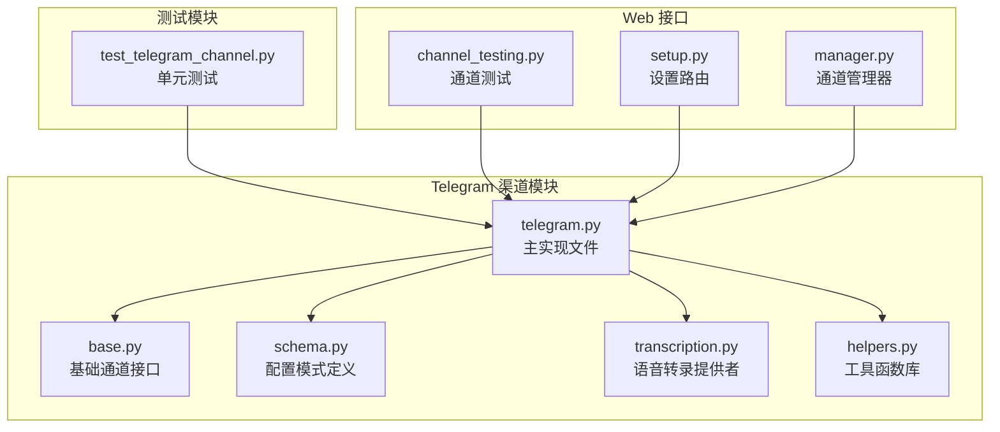
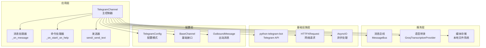
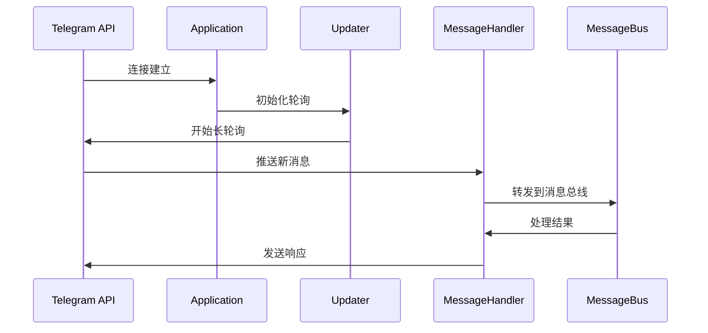
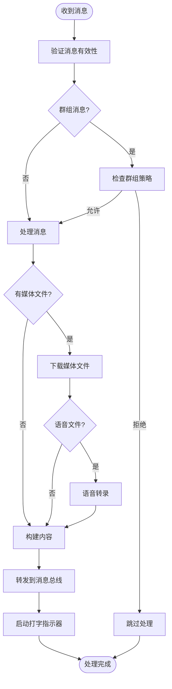
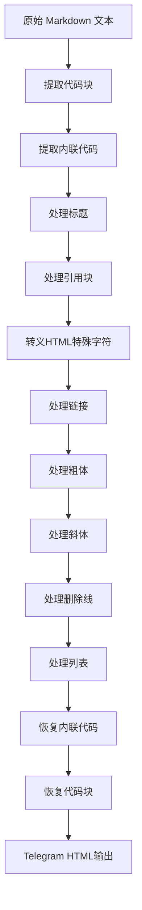
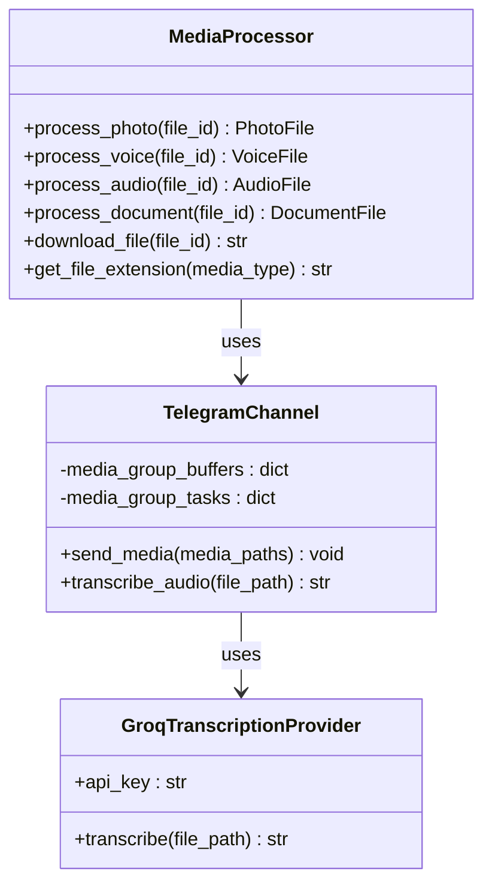
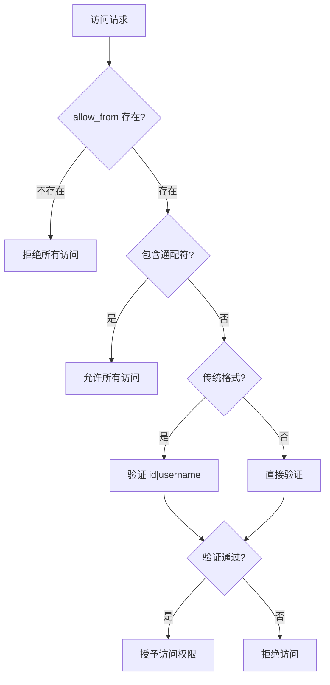
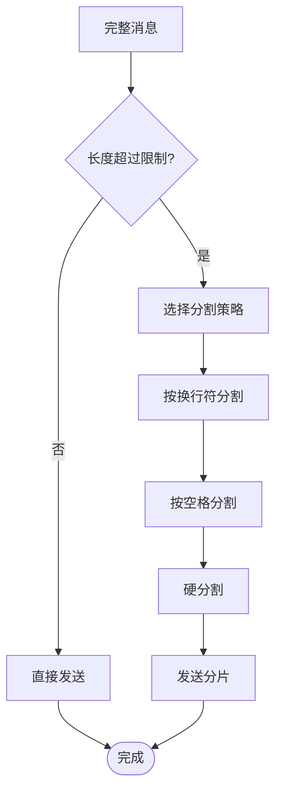
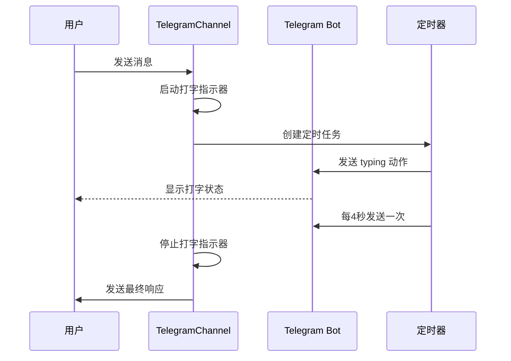
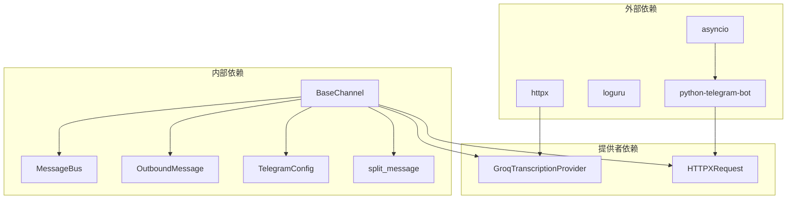

# Telegram 渠道集成

<cite>
**本文档引用的文件**
- [telegram.py](file://nanobot/channels/telegram.py)
- [base.py](file://nanobot/channels/base.py)
- [schema.py](file://nanobot/config/schema.py)
- [transcription.py](file://nanobot/providers/transcription.py)
- [helpers.py](file://nanobot/utils/helpers.py)
- [test_telegram_channel.py](file://tests/test_telegram_channel.py)
- [channel_testing.py](file://nanobot/web/channel_testing.py)
- [setup.py](file://nanobot/web/routers/setup.py)
- [manager.py](file://nanobot/channels/manager.py)
</cite>

## 目录
1. [简介](#简介)
2. [项目结构](#项目结构)
3. [核心组件](#核心组件)
4. [架构概览](#架构概览)
5. [详细组件分析](#详细组件分析)
6. [依赖关系分析](#依赖关系分析)
7. [性能考虑](#性能考虑)
8. [故障排除指南](#故障排除指南)
9. [结论](#结论)
10. [附录](#附录)

## 简介

Telegram 渠道集成为 nanobot 提供了与 Telegram 平台的完整集成能力，基于 python-telegram-bot 库实现了长轮询机制，支持多种消息类型处理、Markdown 到 HTML 的格式转换、媒体文件处理以及语音转录功能。该集成采用模块化设计，遵循统一的消息总线架构，确保与其他渠道的一致性和可扩展性。

## 项目结构

Telegram 渠道集成位于 nanobot 项目的 channels 目录中，采用标准的 Python 包结构：



**图表来源**
- [telegram.py:1-736](file://nanobot/channels/telegram.py#L1-L736)
- [base.py:1-135](file://nanobot/channels/base.py#L1-L135)
- [schema.py:26-37](file://nanobot/config/schema.py#L26-L37)

**章节来源**
- [telegram.py:1-736](file://nanobot/channels/telegram.py#L1-L736)
- [base.py:1-135](file://nanobot/channels/base.py#L1-L135)
- [schema.py:26-37](file://nanobot/config/schema.py#L26-L37)

## 核心组件

### TelegramChannel 类

TelegramChannel 是整个集成的核心类，继承自 BaseChannel 基础类，实现了 Telegram 平台的所有功能：

#### 主要特性
- **长轮询机制**：使用 python-telegram-bot 的长轮询模式，无需公网 IP
- **多类型消息支持**：文本、图片、语音、音频、文档
- **权限控制**：支持用户 ID 和用户名的双重验证
- **消息分片**：自动处理超长消息的分段发送
- **打字指示器**：实时显示机器人的输入状态
- **媒体组处理**：合并同一消息组中的多个媒体文件

#### 关键配置参数
- `token`：Telegram Bot API 访问令牌
- `allow_from`：允许访问的用户列表（支持通配符）
- `proxy`：HTTP/SOCKS5 代理服务器地址
- `reply_to_message`：是否回复引用原始消息
- `group_policy`：群组消息处理策略（"mention" 或 "open"）

**章节来源**
- [telegram.py:150-179](file://nanobot/channels/telegram.py#L150-L179)
- [schema.py:26-37](file://nanobot/config/schema.py#L26-L37)

## 架构概览

Telegram 渠道集成采用分层架构设计，确保了良好的模块化和可维护性：



**图表来源**
- [telegram.py:199-281](file://nanobot/channels/telegram.py#L199-L281)
- [base.py:15-77](file://nanobot/channels/base.py#L15-L77)
- [transcription.py:10-65](file://nanobot/providers/transcription.py#L10-L65)

## 详细组件分析

### 长轮询机制实现

TelegramChannel 使用 python-telegram-bot 的长轮询模式，实现了可靠的连接管理和消息接收：



**图表来源**
- [telegram.py:236-256](file://nanobot/channels/telegram.py#L236-L256)
- [telegram.py:225-232](file://nanobot/channels/telegram.py#L225-L232)

#### 连接池配置
- 连接池大小：16
- 连接超时：30秒
- 读取超时：30秒
- 池超时：5秒

**章节来源**
- [telegram.py:207-216](file://nanobot/channels/telegram.py#L207-L216)

### 消息处理流程

消息处理采用流水线模式，支持多种消息类型的统一处理：



**图表来源**
- [telegram.py:553-666](file://nanobot/channels/telegram.py#L553-L666)
- [telegram.py:580-627](file://nanobot/channels/telegram.py#L580-L627)

**章节来源**
- [telegram.py:553-666](file://nanobot/channels/telegram.py#L553-L666)

### Markdown 到 HTML 转换

TelegramChannel 实现了完整的 Markdown 到 Telegram HTML 的转换机制：



**图表来源**
- [telegram.py:66-147](file://nanobot/channels/telegram.py#L66-L147)

#### 支持的 Markdown 特性
- **标题**：`#` 到 `######`
- **粗体**：`**text**` 或 `__text__`
- **斜体**：`_text_`（避免单词内部匹配）
- **删除线**：`~~text~~`
- **代码块**：``` ````
- **内联代码**：`code`
- **链接**：`[text](url)`
- **引用块**：`> text`
- **无序列表**：`-` 或 `*`

**章节来源**
- [telegram.py](file://nanobot/channels/telegram.py#L66-L147)

### 媒体文件处理

TelegramChannel 支持多种媒体文件类型的处理和传输：



**图表来源**
- [telegram.py](file://nanobot/channels/telegram.py#L283-L293)
- [telegram.py](file://nanobot/channels/telegram.py#L613-L621)
- [transcription.py](file://nanobot/providers/transcription.py#L10-L65)

#### 媒体类型映射
- **图片**：`.jpg`（支持 jpeg、png、gif、webp）
- **语音**：`.ogg`（仅语音）
- **音频**：`.mp3`、`.m4a`、`.wav`、`.aac`
- **文档**：根据 MIME 类型或文件扩展名确定

**章节来源**
- [telegram.py](file://nanobot/channels/telegram.py#L283-L293)
- [telegram.py](file://nanobot/channels/telegram.py#L711-L735)

### 权限控制机制

TelegramChannel 实现了多层次的权限控制机制：



**图表来源**
- [telegram.py](file://nanobot/channels/telegram.py#L180-L197)
- [base.py](file://nanobot/channels/base.py#L79-L87)

#### 传统格式支持
TelegramChannel 支持传统的 `id|username` 格式，便于向后兼容：
- 格式：`12345|alice`
- 用户 ID 必须为数字
- 用户名必须非空

**章节来源**
- [telegram.py](file://nanobot/channels/telegram.py#L180-L197)

### 消息分片发送策略

为了处理超过 Telegram 限制的消息，TelegramChannel 实现了智能的消息分片策略：



**图表来源**
- [telegram.py](file://nanobot/channels/telegram.py#L356-L361)
- [helpers.py](file://nanobot/utils/helpers.py#L43-L72)

#### 分片参数
- **最大长度**：4000 字符（Telegram 限制）
- **分割优先级**：换行符 > 空格 > 硬分割
- **智能断点**：优先在语义边界处分割

**章节来源**
- [telegram.py](file://nanobot/channels/telegram.py#L356-L361)
- [helpers.py](file://nanobot/utils/helpers.py#L43-L72)

### 打字指示器实现

TelegramChannel 实现了实时的打字指示器功能，提升用户体验：



**图表来源**
- [telegram.py](file://nanobot/channels/telegram.py#L684-L705)

#### 指示器管理
- **启动时机**：消息到达时立即启动
- **停止条件**：最终响应发送完成后停止
- **更新频率**：每4秒发送一次
- **并发安全**：每个聊天 ID 维护独立的任务

**章节来源**
- [telegram.py](file://nanobot/channels/telegram.py#L684-L705)

## 依赖关系分析

Telegram 渠道集成的依赖关系清晰明确，遵循单一职责原则：



**图表来源**
- [telegram.py](file://nanobot/channels/telegram.py#L11-L20)
- [base.py](file://nanobot/channels/base.py#L11-L12)

### 核心依赖说明

#### 外部库依赖
- **python-telegram-bot**：Telegram API 客户端
- **loguru**：结构化日志记录
- **httpx**：异步 HTTP 客户端
- **asyncio**：异步编程框架

#### 内部模块依赖
- **BaseChannel**：基础通道接口
- **MessageBus**：消息总线通信
- **OutboundMessage**：出站消息封装
- **TelegramConfig**：配置模式定义
- **split_message**：消息分片工具

**章节来源**
- [telegram.py](file://nanobot/channels/telegram.py#L11-L20)
- [base.py](file://nanobot/channels/base.py#L11-L12)

## 性能考虑

### 连接池优化
TelegramChannel 使用了专门优化的连接池配置：
- **连接池大小**：16（避免长时间运行时的连接超时）
- **连接超时**：30秒（平衡响应速度和稳定性）
- **读取超时**：30秒（确保大文件传输的可靠性）
- **池超时**：5秒（快速检测连接问题）

### 异步处理策略
- **非阻塞 I/O**：所有网络操作都是异步的
- **并发任务管理**：使用 asyncio.Task 管理并发操作
- **内存优化**：及时清理临时缓冲区和任务

### 缓存机制
- **媒体组缓冲**：合并同一消息组中的多个媒体文件
- **线程上下文缓存**：缓存话题线程信息用于后续回复
- **机器人身份缓存**：避免重复查询机器人信息

## 故障排除指南

### 常见配置问题

#### Token 验证失败
**症状**：启动时报错 "Telegram bot token not configured"
**解决方案**：
1. 确认 Telegram Bot Token 已正确配置
2. 使用官方 API 测试 Token 有效性
3. 检查网络代理设置

#### 权限配置错误
**症状**：用户无法访问机器人
**解决方案**：
1. 检查 `allow_from` 配置
2. 确认使用正确的用户 ID 或用户名
3. 对于传统格式，确保格式为 `id|username`

#### 群组消息策略问题
**症状**：群组消息未被处理
**解决方案**：
1. 检查 `group_policy` 配置
2. 在 "mention" 模式下，确保消息包含 @提及或回复机器人
3. 在 "open" 模式下，机器人会响应所有消息

### 网络连接问题

#### 代理配置
**症状**：无法连接到 Telegram API
**解决方案**：
1. 检查代理服务器可达性
2. 确认代理认证信息正确
3. 测试代理连接

#### 超时问题
**症状**：连接超时或响应缓慢
**解决方案**：
1. 增加超时时间配置
2. 检查网络延迟
3. 考虑使用更稳定的网络环境

### 媒体处理问题

#### 语音转录失败
**症状**：语音消息无法转录
**解决方案**：
1. 检查 Groq API 密钥配置
2. 确认网络连接正常
3. 验证音频文件格式支持

#### 文件下载失败
**症状**：媒体文件无法下载
**解决方案**：
1. 检查磁盘空间
2. 确认文件权限正确
3. 验证文件路径有效性

**章节来源**
- [telegram.py](file://nanobot/channels/telegram.py#L201-L203)
- [telegram.py](file://nanobot/channels/telegram.py#L707-L709)

## 结论

Telegram 渠道集成为 nanobot 提供了完整、可靠且高性能的 Telegram 平台集成方案。通过采用长轮询机制、智能的消息处理流程、完善的权限控制和丰富的功能特性，该集成能够满足各种应用场景的需求。

### 主要优势
- **可靠性**：长轮询机制确保稳定的消息接收
- **易用性**：简洁的配置接口和自动化的功能
- **扩展性**：模块化设计便于功能扩展
- **安全性**：多层次的权限控制和错误处理

### 技术特点
- 支持多种消息类型和媒体文件
- 智能的 Markdown 到 HTML 转换
- 实时的打字指示器反馈
- 自动化的消息分片处理
- 完善的错误处理和日志记录

## 附录

### 配置示例

#### 基本配置
```yaml
channels:
  telegram:
    enabled: true
    token: "YOUR_TELEGRAM_BOT_TOKEN"
    allowFrom: ["123456789", "alice"]
    groupPolicy: "mention"
    replyToMessage: false
```

#### 高级配置
```yaml
channels:
  telegram:
    enabled: true
    token: "YOUR_TELEGRAM_BOT_TOKEN"
    allowFrom: ["*", "123456789|alice"]
    proxy: "http://127.0.0.1:7890"
    groupPolicy: "open"
    replyToMessage: true
```

### API 密钥获取步骤

#### 获取 Telegram Bot Token
1. 联系 [@BotFather](https://t.me/BotFather)
2. 发送 `/newbot` 命令
3. 按提示输入机器人名称和用户名
4. 复制生成的 Token

#### 配置语音转录
1. 访问 [Groq 官网](https://console.groq.com/)
2. 注册账户并获取 API Key
3. 在配置中设置 `providers.groq.api_key`

### Webhook 设置指南

虽然 TelegramChannel 默认使用长轮询模式，但也可以配置 Webhook：

```python
# Webhook 配置示例
webhook_config = {
    'url': 'https://your-domain.com/telegram/webhook',
    'certificate': '/path/to/certificate.pem',
    'max_connections': 40,
    'allowed_updates': ['message', 'edited_message']
}
```

### 常见问题解答

#### 如何添加新用户？
在 `allowFrom` 列表中添加用户的 Telegram ID 或用户名：
```yaml
allowFrom: ["123456789", "alice", "987654321|bob"]
```

#### 如何处理群组消息？
根据需要选择合适的 `groupPolicy`：
- `"mention"`：仅当 @提及或回复机器人时响应
- `"open"`：对所有消息都进行响应

#### 如何调试连接问题？
启用详细日志：
```bash
export LOGURU_LEVEL=DEBUG
```

**章节来源**
- [schema.py:26-37](file://nanobot/config/schema.py#L26-L37)
- [channel_testing.py:177-202](file://nanobot/web/channel_testing.py#L177-L202)
- [setup.py:98-123](file://nanobot/web/routers/setup.py#L98-L123)