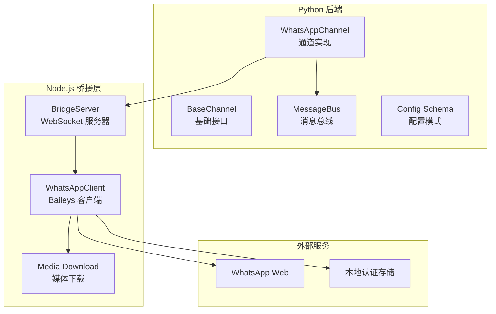
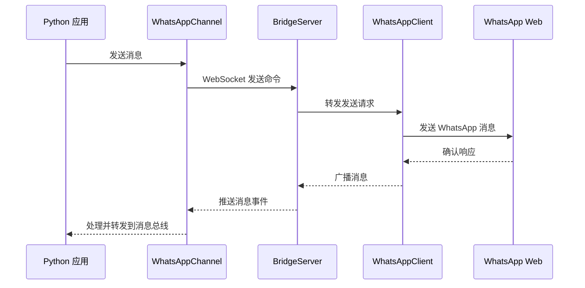
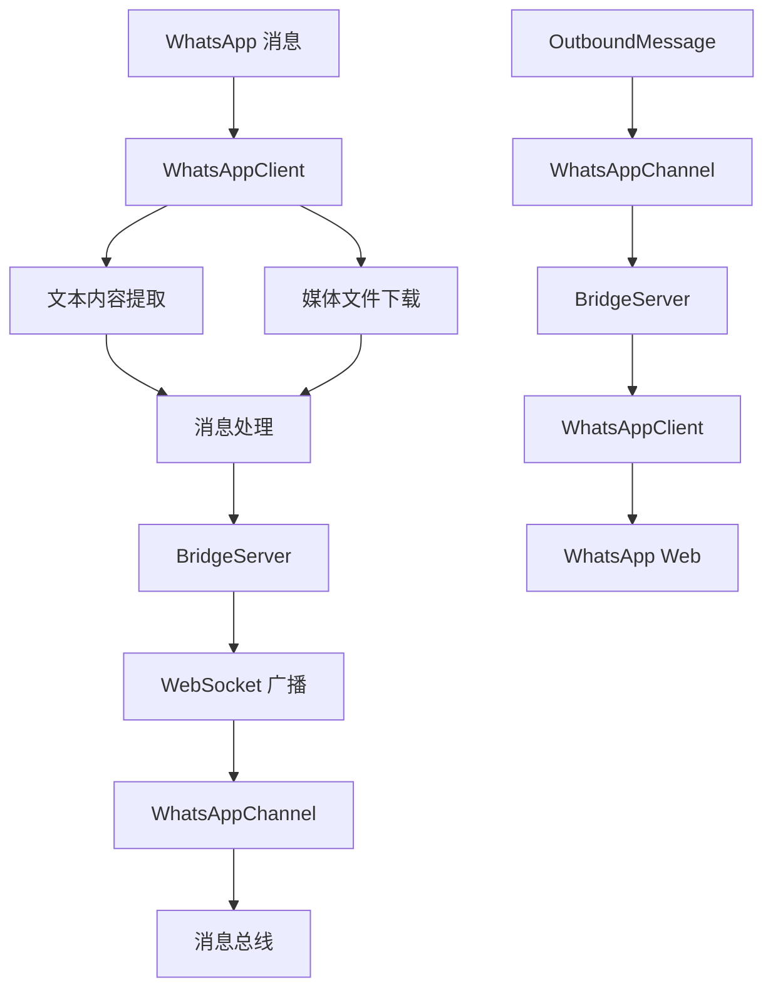
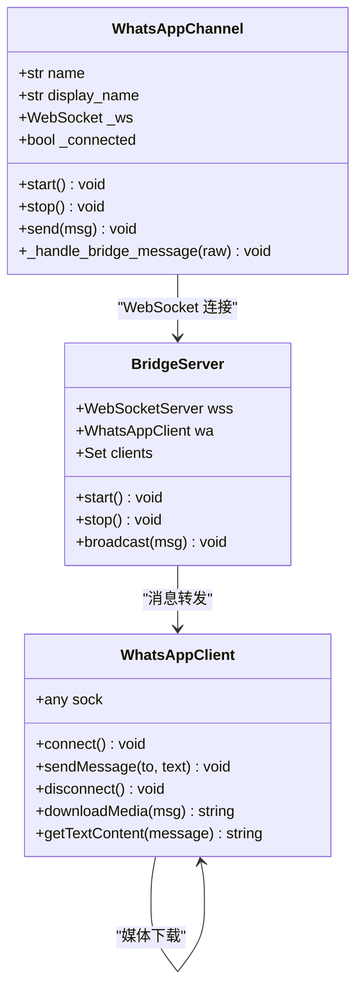
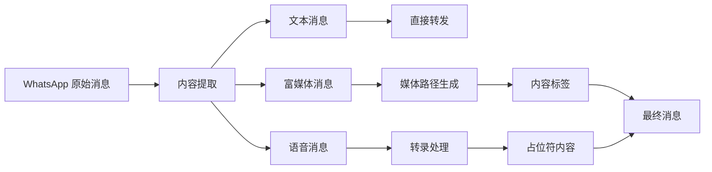
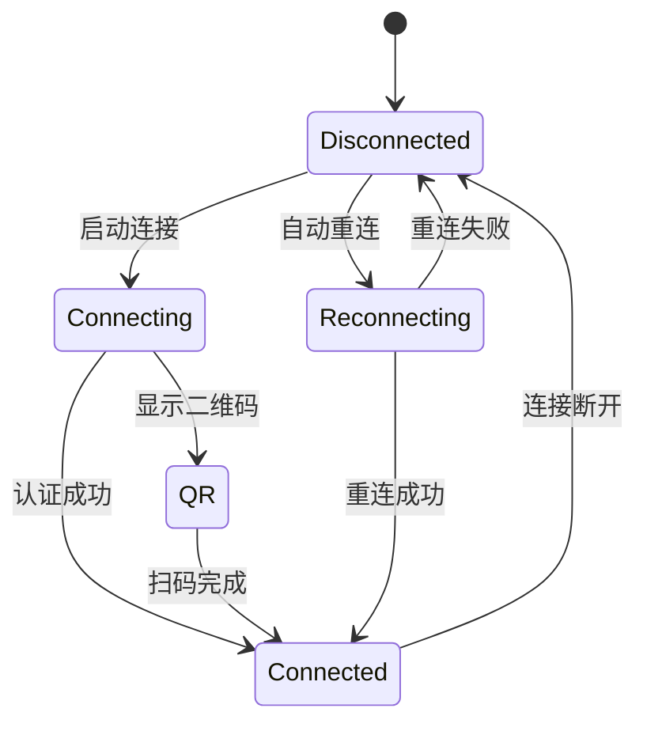
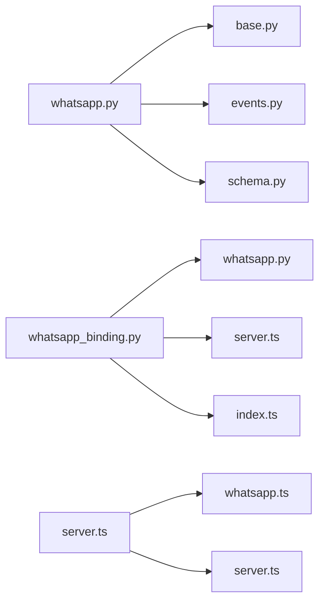
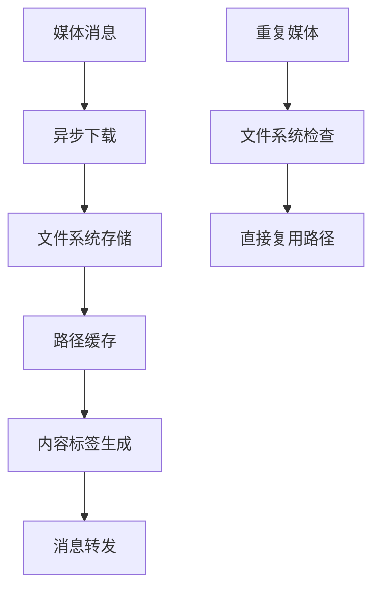
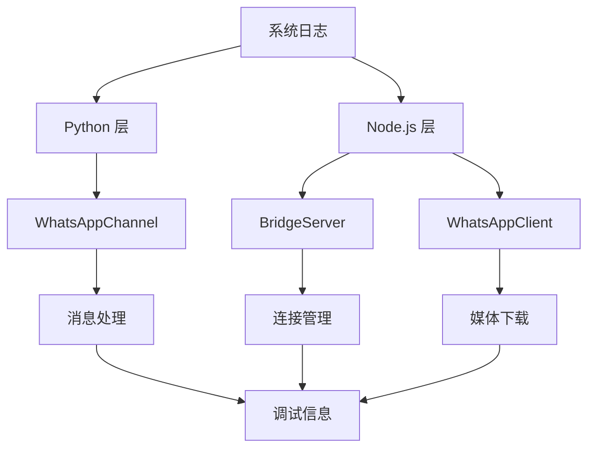

# WhatsApp 渠道集成

<cite>
**本文档引用的文件**
- [nanobot/channels/whatsapp.py](file://nanobot/channels/whatsapp.py)
- [bridge/src/whatsapp.ts](file://bridge/src/whatsapp.ts)
- [bridge/src/server.ts](file://bridge/src/server.ts)
- [bridge/src/index.ts](file://bridge/src/index.ts)
- [bridge/package.json](file://bridge/package.json)
- [nanobot/web/whatsapp_binding.py](file://nanobot/web/whatsapp_binding.py)
- [nanobot/config/schema.py](file://nanobot/config/schema.py)
- [nanobot/channels/base.py](file://nanobot/channels/base.py)
- [nanobot/bus/events.py](file://nanobot/bus/events.py)
- [README.md](file://README.md)
</cite>

## 目录
1. [简介](#简介)
2. [项目结构](#项目结构)
3. [核心组件](#核心组件)
4. [架构概览](#架构概览)
5. [详细组件分析](#详细组件分析)
6. [依赖关系分析](#依赖关系分析)
7. [性能考虑](#性能考虑)
8. [故障排除指南](#故障排除指南)
9. [结论](#结论)
10. [附录](#附录)

## 简介

本指南详细介绍了 nanobot 中 WhatsApp 渠道的完整集成方案。该系统采用 Node.js 桥接服务与 Python 后端通过 WebSocket 通信的方式，实现了 WhatsApp Business API 的本地化集成。系统支持富媒体消息处理、语音消息转录、群组消息识别以及完整的认证和安全机制。

## 项目结构

WhatsApp 集成涉及三个主要部分：



**图表来源**
- [nanobot/channels/whatsapp.py:16-172](file://nanobot/channels/whatsapp.py#L16-L172)
- [bridge/src/server.ts:20-130](file://bridge/src/server.ts#L20-L130)
- [bridge/src/whatsapp.ts:42-240](file://bridge/src/whatsapp.ts#L42-L240)

**章节来源**
- [nanobot/channels/whatsapp.py:1-172](file://nanobot/channels/whatsapp.py#L1-L172)
- [bridge/src/server.ts:1-130](file://bridge/src/server.ts#L1-L130)
- [bridge/src/whatsapp.ts:1-240](file://bridge/src/whatsapp.ts#L1-L240)

## 核心组件

### WhatsAppChannel 类

WhatsAppChannel 是 Python 后端的核心组件，继承自 BaseChannel，负责与 Node.js 桥接服务的通信。

**关键特性：**
- WebSocket 连接管理
- 消息去重机制（1000条消息缓存）
- 语音消息转录处理
- 富媒体消息标签生成

**章节来源**
- [nanobot/channels/whatsapp.py:16-172](file://nanobot/channels/whatsapp.py#L16-L172)

### BridgeServer 类

Node.js 桥接服务器，提供 WebSocket 服务端点，处理 Python 客户端连接和消息转发。

**核心功能：**
- 本地主机绑定（仅 127.0.0.1）
- 可选的共享令牌认证
- 多客户端连接支持
- 消息广播机制

**章节来源**
- [bridge/src/server.ts:20-130](file://bridge/src/server.ts#L20-L130)

### WhatsAppClient 类

基于 Baileys 库的 WhatsApp 客户端封装，处理实际的消息收发逻辑。

**主要能力：**
- QR 码认证流程
- 媒体文件自动下载
- 文本内容提取
- 群组消息识别

**章节来源**
- [bridge/src/whatsapp.ts:42-240](file://bridge/src/whatsapp.ts#L42-L240)

## 架构概览

系统采用分层架构设计，确保了良好的可维护性和扩展性：



**图表来源**
- [nanobot/channels/whatsapp.py:81-96](file://nanobot/channels/whatsapp.py#L81-L96)
- [bridge/src/server.ts:70-99](file://bridge/src/server.ts#L70-L99)
- [bridge/src/whatsapp.ts:225-231](file://bridge/src/whatsapp.ts#L225-L231)

## 详细组件分析

### 消息路由机制

系统实现了完整的双向消息路由：



**图表来源**
- [bridge/src/whatsapp.ts:114-159](file://bridge/src/whatsapp.ts#L114-L159)
- [bridge/src/server.ts:101-108](file://bridge/src/server.ts#L101-L108)
- [nanobot/channels/whatsapp.py:97-154](file://nanobot/channels/whatsapp.py#L97-L154)

### 实时通信实现

WebSocket 实现实时双向通信：



**图表来源**
- [nanobot/channels/whatsapp.py:27-80](file://nanobot/channels/whatsapp.py#L27-L80)
- [bridge/src/server.ts:20-40](file://bridge/src/server.ts#L20-L40)
- [bridge/src/whatsapp.ts:42-70](file://bridge/src/whatsapp.ts#L42-L70)

### 配置参数详解

系统支持以下关键配置参数：

| 参数名称 | 类型 | 默认值 | 描述 |
|---------|------|--------|------|
| enabled | bool | False | 是否启用 WhatsApp 渠道 |
| bridge_url | str | ws://localhost:3001 | 桥接服务 WebSocket 地址 |
| bridge_token | str | "" | 共享认证令牌 |
| allow_from | list[str] | [] | 允许访问的电话号码列表 |

**章节来源**
- [nanobot/config/schema.py:17-24](file://nanobot/config/schema.py#L17-L24)

### 消息格式转换

系统支持多种消息类型的转换：



**图表来源**
- [bridge/src/whatsapp.ts:191-223](file://bridge/src/whatsapp.ts#L191-L223)
- [nanobot/channels/whatsapp.py:128-142](file://nanobot/channels/whatsapp.py#L128-L142)

**章节来源**
- [bridge/src/whatsapp.ts:129-142](file://bridge/src/whatsapp.ts#L129-L142)
- [nanobot/channels/whatsapp.py:133-142](file://nanobot/channels/whatsapp.py#L133-L142)

### 富媒体消息处理

系统支持多种富媒体类型：

| 媒体类型 | MIME 类型前缀 | 处理方式 |
|---------|-------------|----------|
| 图片 | image/ | 下载并生成 [image: path] 标签 |
| 视频 | video/ | 下载并生成 [video: path] 标签 |
| 文档 | application/ | 下载并生成 [file: path] 标签 |
| 语音 | audio/ | 生成 [Voice Message] 占位符 |

**章节来源**
- [bridge/src/whatsapp.ts:162-189](file://bridge/src/whatsapp.ts#L162-L189)
- [nanobot/channels/whatsapp.py:137-142](file://nanobot/channels/whatsapp.py#L137-L142)

### 状态回调处理

系统提供完整的状态监控机制：



**图表来源**
- [bridge/src/whatsapp.ts:79-109](file://bridge/src/whatsapp.ts#L79-L109)
- [bridge/src/server.ts:42-64](file://bridge/src/server.ts#L42-L64)

**章节来源**
- [bridge/src/whatsapp.ts:80-108](file://bridge/src/whatsapp.ts#L80-L108)
- [nanobot/channels/whatsapp.py:156-172](file://nanobot/channels/whatsapp.py#L156-L172)

## 依赖关系分析

### 外部依赖

系统依赖的关键包：

```mermaid
graph TB
subgraph "Node.js 依赖"
A[@whiskeysockets/baileys] --> B[Baileys 核心]
C[ws] --> D[WebSocket 服务器]
E[qrcode-terminal] --> F[QR 码生成]
G[pino] --> H[日志记录]
end
subgraph "Python 依赖"
I[websockets] --> J[WebSocket 客户端]
K[loguru] --> L[日志记录]
M[mimetypes] --> N[文件类型检测]
end
```

**图表来源**
- [bridge/package.json:12-16](file://bridge/package.json#L12-L16)

**章节来源**
- [bridge/package.json:1-27](file://bridge/package.json#L1-L27)

### 内部模块依赖



**图表来源**
- [nanobot/channels/whatsapp.py:10-13](file://nanobot/channels/whatsapp.py#L10-L13)
- [nanobot/web/whatsapp_binding.py:18-20](file://nanobot/web/whatsapp_binding.py#L18-L20)

**章节来源**
- [nanobot/channels/whatsapp.py:1-14](file://nanobot/channels/whatsapp.py#L1-L14)
- [nanobot/web/whatsapp_binding.py:1-21](file://nanobot/web/whatsapp_binding.py#L1-L21)

## 性能考虑

### 连接管理

系统实现了智能的连接重试机制：
- 断线自动重连（5秒延迟）
- 最大重连次数限制
- 连接状态监控

### 内存管理

消息去重机制防止内存泄漏：
- 最多缓存 1000 条消息 ID
- 使用 OrderedDict 保持顺序
- 自动清理最旧的消息记录

### 媒体处理优化



**章节来源**
- [nanobot/channels/whatsapp.py:116-122](file://nanobot/channels/whatsapp.py#L116-L122)
- [bridge/src/whatsapp.ts:162-189](file://bridge/src/whatsapp.ts#L162-L189)

## 故障排除指南

### 常见问题及解决方案

#### 1. 连接问题

**症状：** 无法连接到 WhatsApp 服务
**可能原因：**
- 网络连接问题
- 代理设置错误
- 认证失败

**解决步骤：**
1. 检查 bridge_url 配置
2. 验证网络连通性
3. 查看最近日志输出

#### 2. 认证问题

**症状：** 显示 QR 码但无法登录
**可能原因：**
- 二维码过期
- 设备不兼容
- 网络不稳定

**解决步骤：**
1. 重新生成二维码
2. 确保使用受支持的设备
3. 检查网络稳定性

#### 3. 媒体下载失败

**症状：** 媒体消息无法下载
**可能原因：**
- 存储空间不足
- 文件权限问题
- 网络超时

**解决步骤：**
1. 检查磁盘空间
2. 验证认证目录权限
3. 增加超时时间

### 日志分析

系统提供了详细的日志记录机制：



**章节来源**
- [nanobot/web/whatsapp_binding.py:246-268](file://nanobot/web/whatsapp_binding.py#L246-L268)
- [bridge/src/server.ts:27-31](file://bridge/src/server.ts#L27-L31)

## 结论

nanobot 的 WhatsApp 渠道集成为开发者提供了一个完整、可靠的 WhatsApp 消息集成解决方案。通过 Node.js 桥接服务与 Python 后端的分离架构，系统实现了高性能的消息处理、完善的富媒体支持和灵活的安全控制机制。

该集成方案的主要优势包括：
- **高可靠性：** 自动重连和状态监控
- **安全性：** 本地主机绑定和可选令牌认证
- **扩展性：** 模块化设计便于功能扩展
- **易用性：** 完整的 Web UI 支持和自动化部署

## 附录

### 部署示例

#### 1. 基础部署

```bash
# 安装依赖
pip install -e .

# 初始化配置
nanobot onboard

# 启动桥接服务
npm start

# 启动主应用
nanobot run
```

#### 2. 配置示例

```json
{
  "channels": {
    "whatsapp": {
      "enabled": true,
      "bridgeUrl": "ws://localhost:3001",
      "bridgeToken": "your-shared-token",
      "allowFrom": ["1234567890"]
    }
  }
}
```

#### 3. 环境变量

| 变量名 | 默认值 | 描述 |
|-------|--------|------|
| BRIDGE_PORT | 3001 | 桥接服务端口 |
| AUTH_DIR | ~/.nanobot/whatsapp-auth | 认证数据目录 |
| BRIDGE_TOKEN | 无 | 共享认证令牌 |

**章节来源**
- [bridge/src/index.ts:26-28](file://bridge/src/index.ts#L26-L28)
- [README.md:162-167](file://README.md#L162-L167)