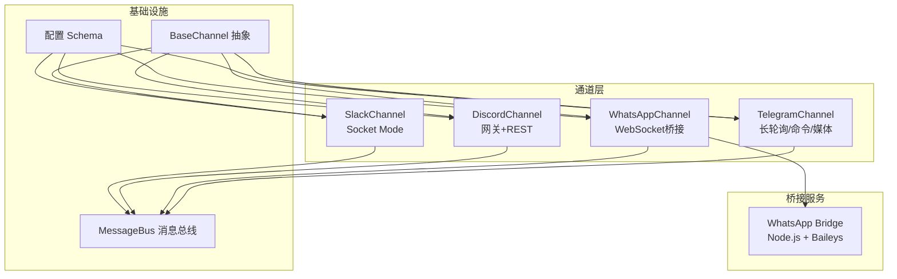
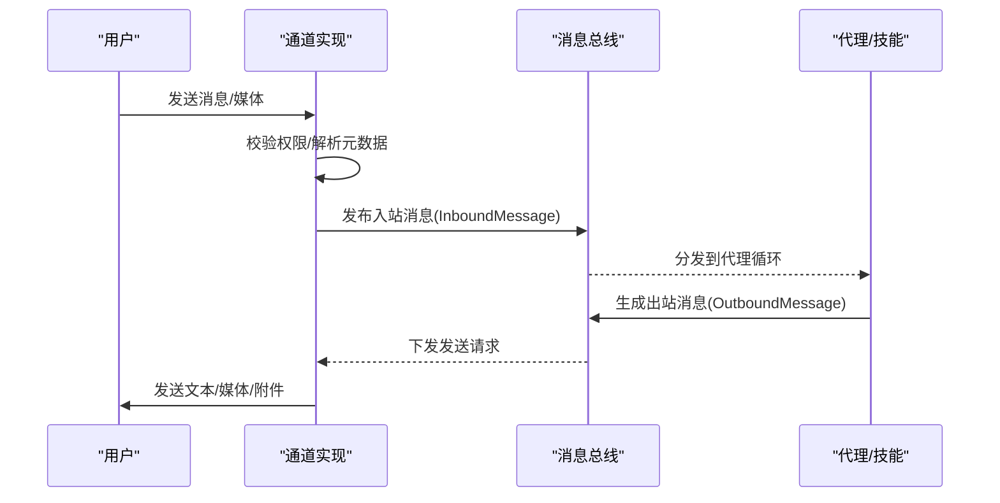
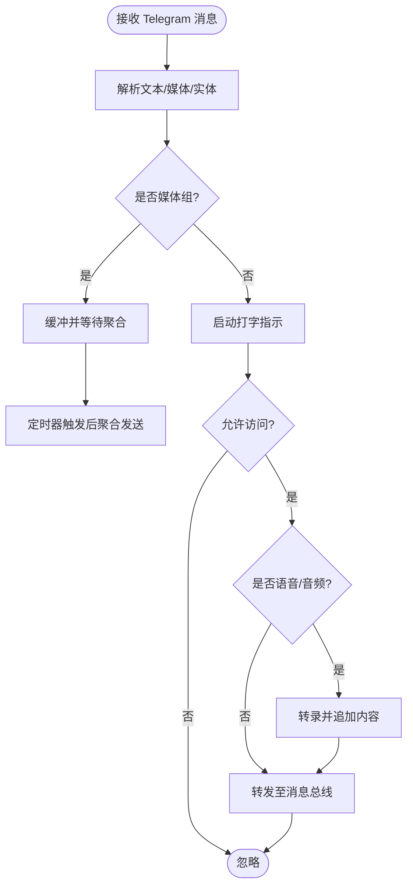
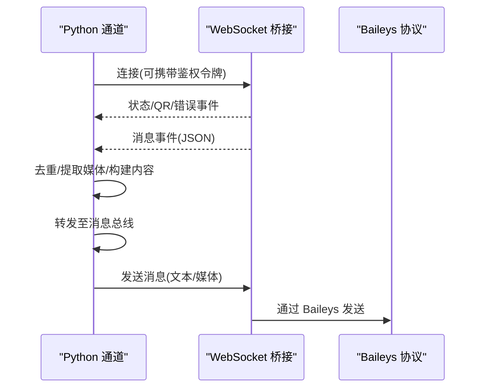
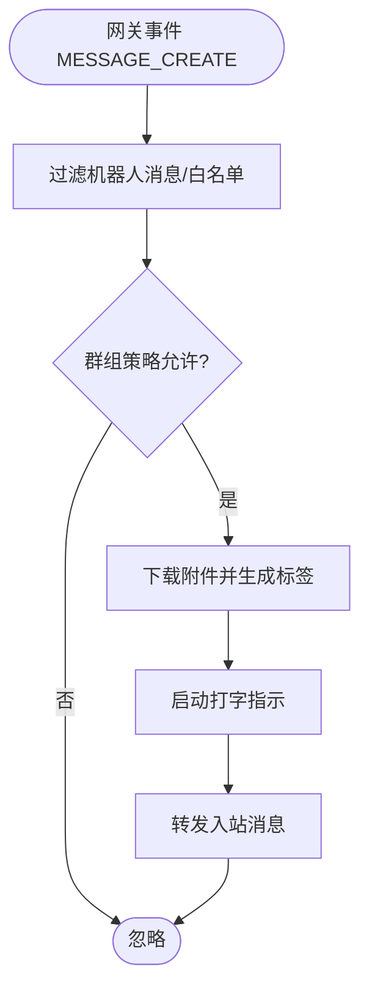
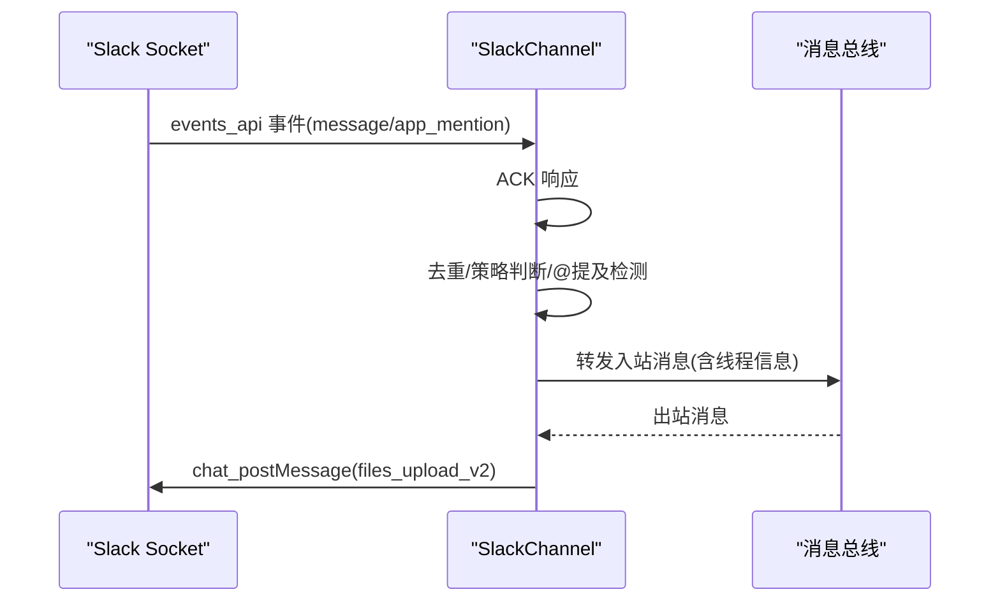
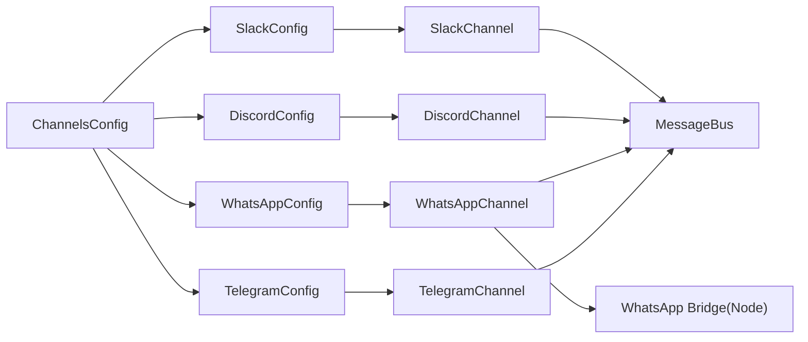

# 主流渠道集成

<cite>
**本文引用的文件**
- [telegram.py](file://nanobot/channels/telegram.py)
- [whatsapp.py](file://nanobot/channels/whatsapp.py)
- [discord.py](file://nanobot/channels/discord.py)
- [slack.py](file://nanobot/channels/slack.py)
- [schema.py](file://nanobot/config/schema.py)
- [base.py](file://nanobot/channels/base.py)
- [index.ts](file://bridge/src/index.ts)
- [package.json](file://bridge/package.json)
- [test_telegram_channel.py](file://tests/test_telegram_channel.py)
- [test_slack_channel.py](file://tests/test_slack_channel.py)
- [channels.py](file://nanobot/web/channels.py)
- [setup.py](file://nanobot/web/routers/setup.py)
- [channels.py](file://nanobot/web/routers/channels.py)
</cite>

## 目录
1. [简介](#简介)
2. [项目结构](#项目结构)
3. [核心组件](#核心组件)
4. [架构总览](#架构总览)
5. [详细组件分析](#详细组件分析)
6. [依赖分析](#依赖分析)
7. [性能考虑](#性能考虑)
8. [故障排除指南](#故障排除指南)
9. [结论](#结论)
10. [附录](#附录)

## 简介
本指南面向开发者，系统化介绍如何在 nanobot 中集成四大主流聊天渠道：Telegram、WhatsApp、Discord、Slack。内容涵盖：
- 认证机制与配置参数
- 消息处理流程与格式转换
- 特殊功能（如回复引用、话题线程、打字指示）
- 错误处理策略与重连机制
- 各渠道限制、性能优化与最佳实践
- 完整配置示例路径与故障排除步骤

## 项目结构
四个渠道均基于统一的通道抽象接口，通过消息总线与业务循环交互，形成“通道层 → 总线 → 代理/技能”的清晰分层。

图表来源
- [telegram.py:150-736](file://nanobot/channels/telegram.py#L150-L736)
- [whatsapp.py:16-172](file://nanobot/channels/whatsapp.py#L16-L172)
- [discord.py:24-378](file://nanobot/channels/discord.py#L24-L378)
- [slack.py:20-282](file://nanobot/channels/slack.py#L20-L282)
- [base.py:15-135](file://nanobot/channels/base.py#L15-L135)
- [schema.py:17-190](file://nanobot/config/schema.py#L17-L190)
- [index.ts:1-52](file://bridge/src/index.ts#L1-L52)

章节来源
- [base.py:15-135](file://nanobot/channels/base.py#L15-L135)
- [schema.py:17-190](file://nanobot/config/schema.py#L17-L190)

## 核心组件
- 通道抽象 BaseChannel：定义统一的 start/stop/send 接口，内置访问控制与消息转发逻辑。
- 四大通道实现：
  - TelegramChannel：长轮询、命令菜单、媒体下载与转录、话题线程、打字指示。
  - WhatsAppChannel：通过 WebSocket 桥接与 Baileys 协议交互，支持去重与状态事件。
  - DiscordChannel：网关鉴权与心跳、REST 发送带附件、速率限制重试。
  - SlackChannel：Socket Mode 事件监听、mrkdwn 转换、线程与反应标记。
- 配置模式 ChannelsConfig/各渠道 Config：集中管理令牌、白名单、策略等参数。
- 消息总线 MessageBus：在通道与代理循环之间传递入站/出站消息。

章节来源
- [base.py:15-135](file://nanobot/channels/base.py#L15-L135)
- [telegram.py:150-736](file://nanobot/channels/telegram.py#L150-L736)
- [whatsapp.py:16-172](file://nanobot/channels/whatsapp.py#L16-L172)
- [discord.py:24-378](file://nanobot/channels/discord.py#L24-L378)
- [slack.py:20-282](file://nanobot/channels/slack.py#L20-L282)
- [schema.py:17-190](file://nanobot/config/schema.py#L17-L190)

## 架构总览
下图展示通道到总线的消息流向与关键处理点。

图表来源
- [base.py:89-130](file://nanobot/channels/base.py#L89-L130)
- [telegram.py:553-666](file://nanobot/channels/telegram.py#L553-L666)
- [discord.py:79-121](file://nanobot/channels/discord.py#L79-L121)
- [slack.py:76-108](file://nanobot/channels/slack.py#L76-L108)
- [whatsapp.py:81-96](file://nanobot/channels/whatsapp.py#L81-L96)

## 详细组件分析

### Telegram 集成
- 认证与连接
  - 使用 Bot Token 进行长轮询，自动注册命令菜单。
  - 支持代理配置，避免长时间运行时连接池超时。
- 消息处理
  - 文本、图片、语音、音频、文档均支持；语音/音频可转录为文本。
  - 媒体组聚合：短时间窗口内多媒体合并为一次对话回合。
  - 话题线程：私聊与 forum 的 message_thread_id 用于会话隔离。
  - 打字指示：周期性发送 typing 动作，结束响应时停止。
- 特殊功能
  - 回复引用：可选按原消息引用回复。
  - 组策略：open 允许所有消息；mention 需 @提及或被回复。
  - 白名单兼容旧格式：id|username。
- 消息格式转换
  - 将 Markdown 转为 Telegram HTML，失败回退纯文本。
  - 表格渲染为等宽盒线表格，提升可读性。
- 错误处理
  - 轮询错误统一记录日志，不吞没异常。
  - 媒体下载失败时发送提示消息。
- 配置参数
  - token、allow_from、proxy、reply_to_message、group_policy、reply_to_message。
- 限制与优化
  - 单条消息最大字符数限制，超长自动切片。
  - 连接池大小与超时参数调优，避免长时间运行阻塞。
  - 话题线程缓存上限，避免内存膨胀。

图表来源
- [telegram.py:553-682](file://nanobot/channels/telegram.py#L553-L682)
- [telegram.py:668-682](file://nanobot/channels/telegram.py#L668-L682)
- [telegram.py:684-706](file://nanobot/channels/telegram.py#L684-L706)
- [telegram.py:69-147](file://nanobot/channels/telegram.py#L69-L147)

章节来源
- [telegram.py:150-736](file://nanobot/channels/telegram.py#L150-L736)
- [schema.py:26-37](file://nanobot/config/schema.py#L26-L37)
- [test_telegram_channel.py:124-339](file://tests/test_telegram_channel.py#L124-L339)

### WhatsApp 集成
- 认证与连接
  - 通过 WebSocket 桥接与 Baileys 协议交互。
  - 可选共享令牌进行桥接鉴权。
- 消息处理
  - 去重：维护最近处理过的消息 ID 队列，避免重复处理。
  - 语音消息：当前桥接不直接下载语音，保留占位提示。
  - 媒体：由桥接侧下载并返回本地路径，通道拼接为内容标签。
- 特殊功能
  - 状态事件：连接状态、QR 码、错误事件。
  - 白名单：手机号/登录 ID(LID) 列表。
- 错误处理
  - 连接断开自动重连；消息解码失败记录警告。
- 配置参数
  - bridge_url、bridge_token、allow_from。
- 限制与优化
  - 依赖桥接稳定性；建议在独立进程运行桥接服务。
  - 大量媒体时注意磁盘空间与 IO。

图表来源
- [whatsapp.py:34-96](file://nanobot/channels/whatsapp.py#L34-L96)
- [whatsapp.py:97-172](file://nanobot/channels/whatsapp.py#L97-L172)
- [index.ts:1-52](file://bridge/src/index.ts#L1-L52)
- [package.json:12-26](file://bridge/package.json#L12-L26)

章节来源
- [whatsapp.py:16-172](file://nanobot/channels/whatsapp.py#L16-L172)
- [schema.py:17-24](file://nanobot/config/schema.py#L17-L24)
- [index.ts:1-52](file://bridge/src/index.ts#L1-L52)
- [package.json:12-26](file://bridge/package.json#L12-L26)

### Discord 集成
- 认证与连接
  - 使用 Bot Token 通过网关 WebSocket 连接，发送 IDENTIFY 并启动心跳。
  - 支持自定义网关地址与意图(Intents)。
- 消息处理
  - 仅处理非机器人作者消息；支持群组/频道策略。
  - 附件下载并保存到本地，再在消息中以标签形式呈现。
  - 支持回复引用与线程上下文。
- 特殊功能
  - 打字指示：周期性向频道发送 typing。
  - 速率限制：对 429 自动等待并重试。
- 错误处理
  - 网关错误/无效会话触发重连；HTTP 请求异常记录并重试。
- 配置参数
  - token、allow_from、gateway_url、intents、group_policy。
- 限制与优化
  - 单次附件最大 20MB；超限跳过并提示。
  - 消息长度限制 2000 字符，自动切片发送。

图表来源
- [discord.py:270-331](file://nanobot/channels/discord.py#L270-L331)
- [discord.py:354-378](file://nanobot/channels/discord.py#L354-L378)

章节来源
- [discord.py:24-378](file://nanobot/channels/discord.py#L24-L378)
- [schema.py:62-71](file://nanobot/config/schema.py#L62-L71)

### Slack 集成
- 认证与连接
  - 使用 Socket Mode，需要 bot_token 与 app_token。
  - 连接后立即解析 bot 用户 ID，便于 @提及识别。
- 消息处理
  - 事件类型区分 message 与 app_mention，避免重复处理。
  - 支持 DM/群组/频道策略与线程上下文。
  - 可选在触发消息上添加反应标记。
- 特殊功能
  - mrkdwn 转换：Markdown 转 Slack 的 mrkdwn，含表格与代码块修复。
  - 线程回复：根据 channel_type 决定是否使用 thread_ts。
- 错误处理
  - Socket Mode 请求先 ACK，异常捕获并记录。
- 配置参数
  - mode、bot_token、app_token、reply_in_thread、react_emoji、group_policy、dm.*。
- 限制与优化
  - 空文本需发送空格占位；媒体优先上传，文本随后补充。
  - 线程策略与 DM 白名单分开配置。

图表来源
- [slack.py:109-202](file://nanobot/channels/slack.py#L109-L202)
- [slack.py:239-282](file://nanobot/channels/slack.py#L239-L282)

章节来源
- [slack.py:20-282](file://nanobot/channels/slack.py#L20-L282)
- [schema.py:175-190](file://nanobot/config/schema.py#L175-L190)

## 依赖分析
- 通道与配置
  - 各通道均继承 BaseChannel，依赖 ChannelsConfig 中对应子配置。
  - Telegram/Slack/Discord 依赖各自 SDK 或 HTTP/WebSocket 客户端。
  - WhatsApp 依赖 Node.js 桥接服务，通过 WebSocket 通信。
- 关键耦合点
  - 消息总线：通道与代理循环通过 InboundMessage/OutboundMessage 解耦。
  - 配置模式：统一的 Pydantic 模型确保字段一致性与别名兼容。
- 外部依赖
  - Telegram: python-telegram-bot
  - Discord: websockets + httpx
  - Slack: slack_sdk.socket_mode + slackify_markdown
  - WhatsApp: @whiskeysockets/baileys (Node 桥接)

图表来源
- [schema.py:213-229](file://nanobot/config/schema.py#L213-L229)
- [telegram.py:168-179](file://nanobot/channels/telegram.py#L168-L179)
- [whatsapp.py:27-32](file://nanobot/channels/whatsapp.py#L27-L32)
- [discord.py:30-38](file://nanobot/channels/discord.py#L30-L38)
- [slack.py:26-32](file://nanobot/channels/slack.py#L26-L32)

章节来源
- [schema.py:213-229](file://nanobot/config/schema.py#L213-L229)

## 性能考虑
- 连接与资源
  - Telegram：增大连接池大小与超时，避免长时间运行超时。
  - Discord：启用速率限制重试，合理拆分附件与文本。
  - Slack：避免空文本导致拒绝，媒体优先上传。
- 消息体积
  - Telegram/Discord：超过字符限制自动切片。
  - WhatsApp：媒体过大或下载失败时降级提示。
- 并发与去重
  - Telegram：媒体组聚合减少回合数。
  - WhatsApp：消息 ID 去重队列，避免重复处理。
- I/O 与存储
  - Discord/Telegram：附件下载到本地临时目录，注意磁盘空间与清理策略。

## 故障排除指南
- 通用检查
  - 确认配置项存在且非空：token、allow_from、必要时 bridge_url。
  - 使用 Web API 的通道探测接口验证连通性与凭据有效性。
- Telegram
  - 若命令未显示：确认已成功注册命令菜单。
  - 若媒体发送失败：检查文件路径与权限，查看下载失败提示。
  - 若群组消息无响应：检查 group_policy 与 @提及/回复判定。
- WhatsApp
  - 若无法连接：确认桥接服务已启动，端口与令牌正确。
  - 若重复消息：检查消息 ID 去重队列是否正常。
- Discord
  - 若 429：等待 retry_after 后重试；降低并发或拆分发送。
  - 若附件过大：调整为小于 20MB 的文件。
- Slack
  - 若空文本报错：发送空格占位；或仅发送媒体。
  - 若线程错乱：确认 thread_ts 来源与 channel_type 判断。

章节来源
- [channels.py:13-35](file://nanobot/web/channels.py#L13-L35)
- [channels.py:76-122](file://nanobot/web/routers/channels.py#L76-L122)
- [setup.py:98-123](file://nanobot/web/routers/setup.py#L98-L123)

## 结论
通过统一的通道抽象与消息总线，nanobot 实现了对 Telegram、WhatsApp、Discord、Slack 的一致接入。开发者只需关注各渠道的认证参数、策略配置与消息格式转换，即可快速完成集成。建议结合本文的限制与优化建议，在生产环境中稳定运行。

## 附录

### 配置参数速查（按渠道）
- Telegram
  - enabled、token、allow_from、proxy、reply_to_message、group_policy
  - 参考路径：[schema.py:26-37](file://nanobot/config/schema.py#L26-L37)
- WhatsApp
  - enabled、bridge_url、bridge_token、allow_from
  - 参考路径：[schema.py:17-24](file://nanobot/config/schema.py#L17-L24)
- Discord
  - enabled、token、allow_from、gateway_url、intents、group_policy
  - 参考路径：[schema.py:62-71](file://nanobot/config/schema.py#L62-L71)
- Slack
  - enabled、mode、bot_token、app_token、reply_in_thread、react_emoji、group_policy、dm.*
  - 参考路径：[schema.py:175-190](file://nanobot/config/schema.py#L175-L190)

### Web UI 配置示例路径
- 通道列表与详情：[channels.py:13-35](file://nanobot/web/channels.py#L13-L35)
- 设置页面更新 Telegram：[setup.py:98-123](file://nanobot/web/routers/setup.py#L98-L123)
- 通道探测接口：[channels.py:76-122](file://nanobot/web/routers/channels.py#L76-L122)