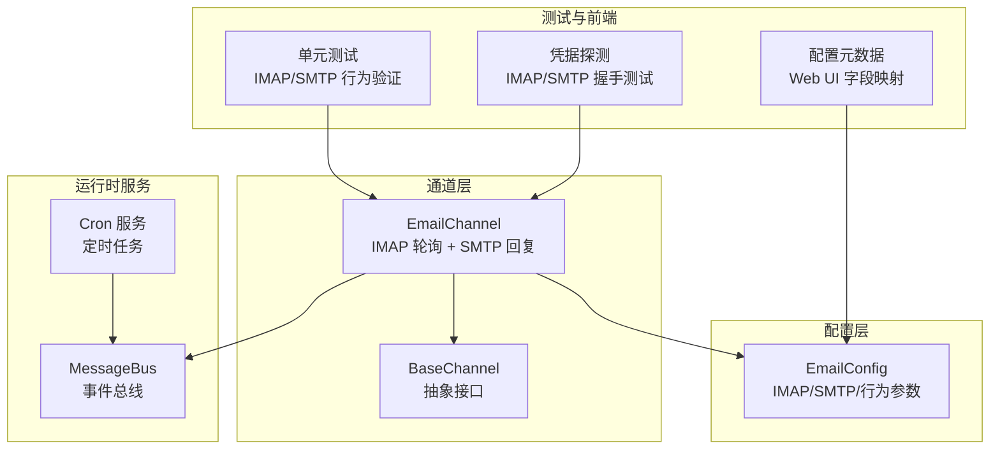
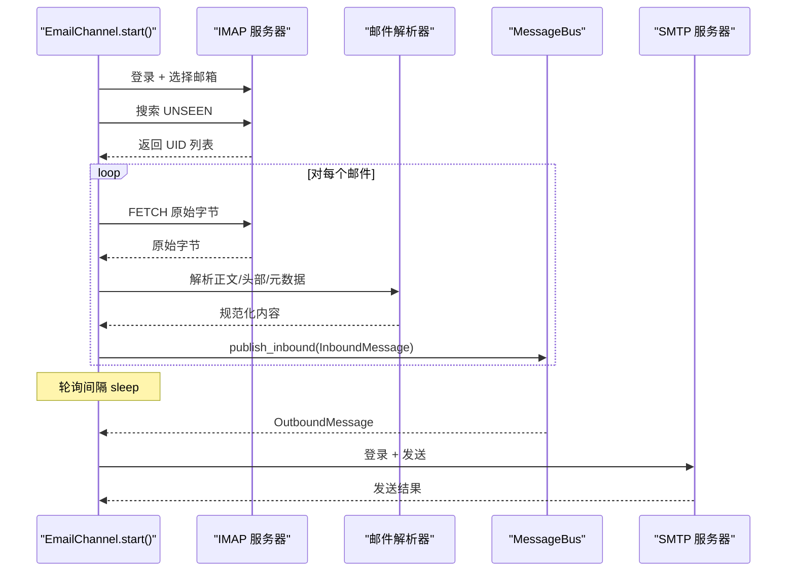
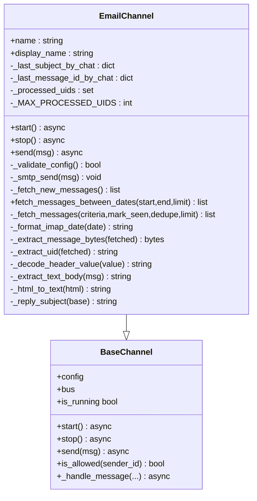
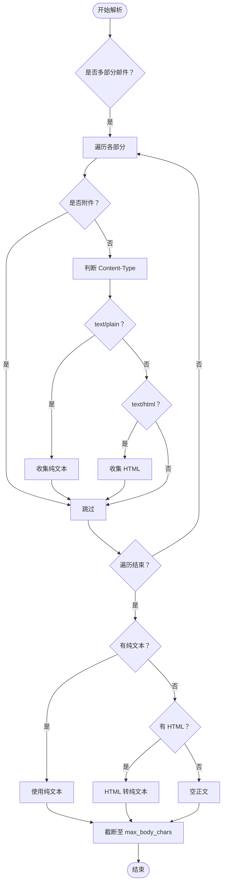
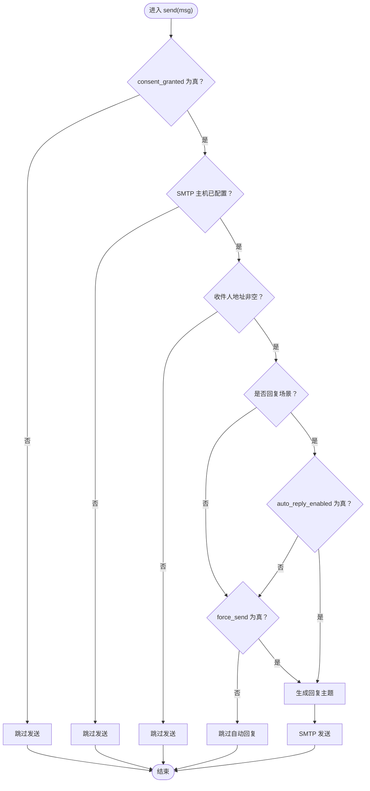
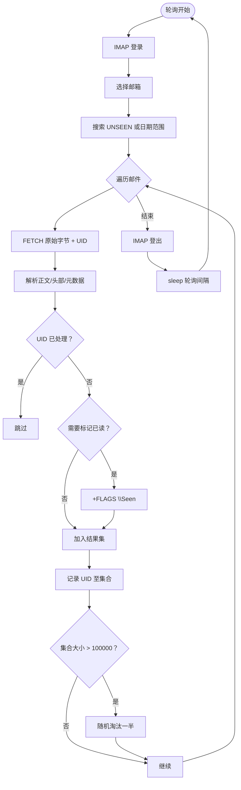
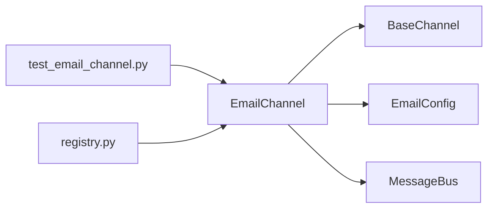

# Email 邮件系统

<cite>
**本文档引用的文件**
- [email.py](file://nanobot/channels/email.py)
- [base.py](file://nanobot/channels/base.py)
- [schema.py](file://nanobot/config/schema.py)
- [registry.py](file://nanobot/channels/registry.py)
- [test_email_channel.py](file://tests/test_email_channel.py)
- [README.md](file://README.md)
- [SECURITY.md](file://SECURITY.md)
- [schedule.py](file://nanobot/web/runtime_services/schedule.py)
- [types.py](file://nanobot/cron/types.py)
- [SKILL.md](file://nanobot/skills/cron/SKILL.md)
- [configMeta.ts](file://web-ui/src/configMeta.ts)
- [channel_testing.py](file://nanobot/web/channel_testing.py)
</cite>

## 目录
1. [简介](#简介)
2. [项目结构](#项目结构)
3. [核心组件](#核心组件)
4. [架构总览](#架构总览)
5. [详细组件分析](#详细组件分析)
6. [依赖关系分析](#依赖关系分析)
7. [性能考量](#性能考量)
8. [故障排除指南](#故障排除指南)
9. [结论](#结论)
10. [附录](#附录)

## 简介
本指南面向希望在 nanobot 中集成 Email 邮件系统的开发者与运维人员。文档覆盖以下主题：
- 邮件协议支持：IMAP 轮询接收、SMTP 发送
- 邮件解析机制：多部分正文提取、HTML 到纯文本转换、头部解码
- 自动回复处理：基于会话状态的智能回复、强制发送控制
- 内容提取与附件处理：正文长度限制、去重与已读标记
- 认证与服务器配置：IMAP/SMTP 主机、端口、SSL/TLS、用户名密码
- 连接管理：轮询间隔、超时、错误处理
- 模板与自定义字段映射：主题前缀、发件地址、允许发件人列表
- 邮件调度：基于 Cron 的定时任务与通道投递
- 安全与合规：访问控制、凭据存储、日志审计
- 完整配置示例与故障排除

## 项目结构
Email 邮件系统作为通道模块之一，位于 nanobot/channels/email.py，并通过配置 schema 定义参数。测试用例位于 tests/test_email_channel.py，用于验证 IMAP/SMTP 行为、自动回复策略与日期范围查询。

图表来源
- [email.py:25-410](file://nanobot/channels/email.py#L25-L410)
- [base.py:15-135](file://nanobot/channels/base.py#L15-L135)
- [schema.py:94-126](file://nanobot/config/schema.py#L94-L126)
- [schedule.py:122-398](file://nanobot/web/runtime_services/schedule.py#L122-L398)
- [configMeta.ts:240-260](file://web-ui/src/configMeta.ts#L240-L260)
- [channel_testing.py:318-353](file://nanobot/web/channel_testing.py#L318-L353)

章节来源
- [email.py:1-410](file://nanobot/channels/email.py#L1-L410)
- [base.py:1-135](file://nanobot/channels/base.py#L1-L135)
- [schema.py:94-126](file://nanobot/config/schema.py#L94-L126)

## 核心组件
- EmailChannel：实现 IMAP 轮询接收与 SMTP 发送，负责消息解析、自动回复、去重与已读标记。
- BaseChannel：通道抽象接口，提供权限检查、消息封装与发布到消息总线的能力。
- EmailConfig：定义 IMAP/SMTP 参数、行为开关（自动回复、轮询间隔、最大正文长度等）。
- MessageBus：通道与业务逻辑之间的事件总线，用于发布入站消息与接收出站指令。
- Cron 服务：提供定时任务能力，可将消息按计划投递给指定通道与目标。

章节来源
- [email.py:25-410](file://nanobot/channels/email.py#L25-L410)
- [base.py:15-135](file://nanobot/channels/base.py#L15-L135)
- [schema.py:94-126](file://nanobot/config/schema.py#L94-L126)
- [schedule.py:122-398](file://nanobot/web/runtime_services/schedule.py#L122-L398)

## 架构总览
Email 邮件系统采用“异步轮询 + 同步发送”的模式：
- 入站：EmailChannel 在启动后按配置的轮询间隔调用 IMAP 接口，拉取未读邮件，解析正文与元数据，封装为 InboundMessage 并发布到消息总线。
- 出站：当收到 OutboundMessage 时，根据是否为自动回复、是否强制发送、是否已获得许可等条件决定是否通过 SMTP 发送，并设置 In-Reply-To/References 头以形成回复链。

图表来源
- [email.py:62-101](file://nanobot/channels/email.py#L62-L101)
- [email.py:192-323](file://nanobot/channels/email.py#L192-L323)
- [email.py:106-152](file://nanobot/channels/email.py#L106-L152)

## 详细组件分析

### EmailChannel 组件
- 职责
  - 启动/停止：按轮询间隔持续拉取未读邮件。
  - 发送：根据自动回复策略与强制发送标志决定是否发送 SMTP 邮件。
  - 解析：从邮件中提取正文（优先纯文本，其次 HTML 转换），解码头部，提取 UID 与消息 ID。
  - 去重与已读：基于 UID 去重，支持 mark_seen 标记已读。
- 关键流程
  - 轮询：调用 _fetch_new_messages，内部通过 _fetch_messages 执行 IMAP 搜索与拉取。
  - 解析：_extract_text_body 支持多部分邮件，优先纯文本，否则将 HTML 转换为纯文本。
  - 回复：_reply_subject 生成回复主题，若已有 In-Reply-To 则设置 References。
  - 发送：_smtp_send 支持 SSL/TLS，登录后发送。

图表来源
- [email.py:25-410](file://nanobot/channels/email.py#L25-L410)
- [base.py:15-135](file://nanobot/channels/base.py#L15-L135)

章节来源
- [email.py:25-410](file://nanobot/channels/email.py#L25-L410)
- [base.py:15-135](file://nanobot/channels/base.py#L15-L135)

### 邮件解析与正文提取
- 多部分邮件处理：遍历 multipart 部分，跳过附件，优先 text/plain，其次 text/html。
- HTML 到纯文本：将换行标签替换为换行符，移除标签，再进行 HTML 实体解码。
- 正文长度限制：受 max_body_chars 控制，避免过大正文影响性能与存储。
- 头部解码：使用 decode_header + make_header 解码 Subject 等头部字段。

图表来源
- [email.py:357-396](file://nanobot/channels/email.py#L357-L396)
- [email.py:397-402](file://nanobot/channels/email.py#L397-L402)

章节来源
- [email.py:357-396](file://nanobot/channels/email.py#L357-L396)
- [email.py:397-402](file://nanobot/channels/email.py#L397-L402)

### 自动回复与强制发送
- 自动回复策略
  - 当收件人曾向邮箱发送过邮件（存在 last_subject_by_chat）时，视为“回复场景”。
  - 若 auto_reply_enabled 为 False，则跳过自动回复，除非显式设置 force_send=True。
- 强制发送
  - metadata.force_send=True 时，即使 auto_reply_enabled=False 也会发送。
- 发送前检查
  - consent_granted 必须为 True，否则跳过发送。
  - SMTP 主机必须配置，否则跳过发送。
  - 收件人地址不能为空，否则跳过发送。

图表来源
- [email.py:106-152](file://nanobot/channels/email.py#L106-L152)

章节来源
- [email.py:106-152](file://nanobot/channels/email.py#L106-L152)

### IMAP 轮询与去重
- 轮询策略
  - 默认轮询间隔为 poll_interval_seconds（最小 5 秒）。
  - 使用 UNSEEN 条件搜索未读邮件，FETCH 获取原始字节与 UID。
- 去重与已读
  - 基于 UID 去重，防止重复处理。
  - mark_seen 为 True 时，对邮件打上已读标记。
  - 内存中的 processed_uids 集合上限为 100000，超过则随机淘汰一半以控制内存增长。
- 日期范围查询
  - 提供 fetch_messages_between_dates 方法，使用 IMAP 的 SINCE/BEFORE 日期范围查询，用于历史摘要等场景。

图表来源
- [email.py:192-323](file://nanobot/channels/email.py#L192-L323)
- [email.py:308-314](file://nanobot/channels/email.py#L308-L314)

章节来源
- [email.py:192-323](file://nanobot/channels/email.py#L192-L323)
- [email.py:308-314](file://nanobot/channels/email.py#L308-L314)

### SMTP 发送与安全
- 发送流程
  - 构造 EmailMessage，设置 From/To/Subject/Content-Type。
  - 若存在 In-Reply-To，则设置 In-Reply-To 与 References。
  - 根据 smtp_use_ssl 与 smtp_use_tls 选择 SSL 或 STARTTLS。
  - 登录后发送，异常捕获并记录。
- 安全建议
  - 使用应用专用密码或 OAuth（如适用）。
  - 启用 TLS/SSL 并确保主机名验证。
  - 限制 allowFrom 列表，避免被滥用。

章节来源
- [email.py:137-191](file://nanobot/channels/email.py#L137-L191)
- [SECURITY.md:18-62](file://SECURITY.md#L18-L62)

### 配置与字段映射
- EmailConfig 关键字段
  - IMAP：host/port/username/password/mailbox/use_ssl
  - SMTP：host/port/username/password/use_tls/use_ssl/from_address
  - 行为：auto_reply_enabled/poll_interval_seconds/mark_seen/max_body_chars/subject_prefix/allow_from
- Web UI 字段映射
  - primaryFields 包含 IMAP/SMTP 主机、端口、用户名、密码、发件地址、允许发件人、自动回复开关等。
- 配置示例
  - README 提供了 Gmail 示例，强调 consent_granted、allowFrom、autoReplyEnabled 的正确设置。

章节来源
- [schema.py:94-126](file://nanobot/config/schema.py#L94-L126)
- [configMeta.ts:240-260](file://web-ui/src/configMeta.ts#L240-L260)
- [README.md:683-702](file://README.md#L683-L702)

### 邮件调度与模板
- Cron 服务
  - 支持 at/every/cron 三种调度模式，payload 支持 deliver、channel、to 等字段。
  - 可将消息按计划投递给任意通道（包括 email）。
- 技能文档
  - cron 技能文档描述了如何使用 cron 工具进行提醒、任务与一次性调度。
- 使用建议
  - 将需要周期性发送的邮件内容放入 message 字段，deliver 设为 True 时自动投递。
  - channel 设置为 "email"，to 设置为收件人邮箱地址。

章节来源
- [schedule.py:122-398](file://nanobot/web/runtime_services/schedule.py#L122-L398)
- [types.py:7-61](file://nanobot/cron/types.py#L7-L61)
- [SKILL.md:1-58](file://nanobot/skills/cron/SKILL.md#L1-L58)

## 依赖关系分析
- EmailChannel 依赖
  - BaseChannel：继承抽象接口，复用权限检查与消息发布。
  - EmailConfig：读取 IMAP/SMTP/行为参数。
  - MessageBus：发布入站消息、接收出站指令。
  - 测试依赖：tests/test_email_channel.py 验证 IMAP/SMTP 行为、自动回复策略与日期范围查询。
- 通道发现
  - registry.py 动态发现通道模块，EmailChannel 通过类名自动注册。

图表来源
- [email.py:25-410](file://nanobot/channels/email.py#L25-L410)
- [base.py:15-135](file://nanobot/channels/base.py#L15-L135)
- [schema.py:94-126](file://nanobot/config/schema.py#L94-L126)
- [registry.py:26-36](file://nanobot/channels/registry.py#L26-L36)
- [test_email_channel.py:1-369](file://tests/test_email_channel.py#L1-L369)

章节来源
- [email.py:25-410](file://nanobot/channels/email.py#L25-L410)
- [registry.py:26-36](file://nanobot/channels/registry.py#L26-L36)

## 性能考量
- 轮询间隔：默认 30 秒，可根据邮件量调整，最小 5 秒。
- 正文截断：max_body_chars 限制正文长度，避免内存与网络压力。
- 去重与内存：processed_uids 集合上限 100000，超过则随机淘汰一半，防止内存无限增长。
- IMAP 查询：UNSEEN 搜索 + UID 去重，mark_seen 标记已读，减少重复处理。
- 发送路径：SMTP 发送在独立线程执行，避免阻塞主循环。

章节来源
- [email.py:77-100](file://nanobot/channels/email.py#L77-L100)
- [email.py:282-289](file://nanobot/channels/email.py#L282-L289)
- [email.py:308-314](file://nanobot/channels/email.py#L308-L314)
- [email.py:174-191](file://nanobot/channels/email.py#L174-L191)

## 故障排除指南
- 无法登录 IMAP/SMTP
  - 检查 consent_granted 是否为 True。
  - 确认 IMAP/SMTP 主机、端口、用户名、密码正确。
  - 使用 channel_testing 的 _probe_email_sync 进行握手测试。
- 未收到邮件
  - 检查 allowFrom 列表是否包含发件人邮箱。
  - 确认 poll_interval_seconds 合理，且轮询循环正常运行。
  - 使用 fetch_messages_between_dates 指定日期范围验证 IMAP 查询。
- 未发送自动回复
  - auto_reply_enabled 是否为 True。
  - 收件人是否曾发送过邮件（存在 last_subject_by_chat）。
  - metadata.force_send 是否为 True。
- 发送失败
  - 检查 SMTP 主机配置与 TLS/SSL 设置。
  - 查看日志中的错误信息，确认异常类型。
- 安全与合规
  - 确保 allowFrom 列表配置，避免被滥用。
  - 使用应用专用密码或 OAuth，定期轮换凭据。
  - 审计日志，监控异常访问与发送行为。

章节来源
- [email.py:62-101](file://nanobot/channels/email.py#L62-L101)
- [email.py:106-152](file://nanobot/channels/email.py#L106-L152)
- [email.py:154-172](file://nanobot/channels/email.py#L154-L172)
- [channel_testing.py:318-353](file://nanobot/web/channel_testing.py#L318-L353)
- [SECURITY.md:18-62](file://SECURITY.md#L18-L62)

## 结论
Email 邮件系统在 nanobot 中提供了稳定、可扩展的 IMAP 轮询与 SMTP 发送能力。通过合理的配置、严格的权限控制与完善的测试覆盖，可以满足个人助理、自动化回复与邮件调度等多种场景。建议在生产环境中启用 TLS/SSL、严格 allowFrom 列表，并结合 Cron 服务实现定时邮件投递。

## 附录
- 完整配置示例（来自 README）
  - Gmail 示例：包含 consent_granted、imap/smtp 凭据、fromAddress、allowFrom 等字段。
- Web UI 字段映射
  - primaryFields 显示 IMAP/SMTP 主要配置项，便于可视化配置。
- 测试用例要点
  - 验证 IMAP 登录与 mark_seen、HTML 到纯文本转换、自动回复策略、强制发送、日期范围查询等。

章节来源
- [README.md:683-702](file://README.md#L683-L702)
- [configMeta.ts:240-260](file://web-ui/src/configMeta.ts#L240-L260)
- [test_email_channel.py:42-83](file://tests/test_email_channel.py#L42-L83)
- [test_email_channel.py:85-95](file://tests/test_email_channel.py#L85-L95)
- [test_email_channel.py:115-169](file://tests/test_email_channel.py#L115-L169)
- [test_email_channel.py:171-230](file://tests/test_email_channel.py#L171-L230)
- [test_email_channel.py:232-280](file://tests/test_email_channel.py#L232-L280)
- [test_email_channel.py:282-323](file://tests/test_email_channel.py#L282-L323)
- [test_email_channel.py:325-369](file://tests/test_email_channel.py#L325-L369)