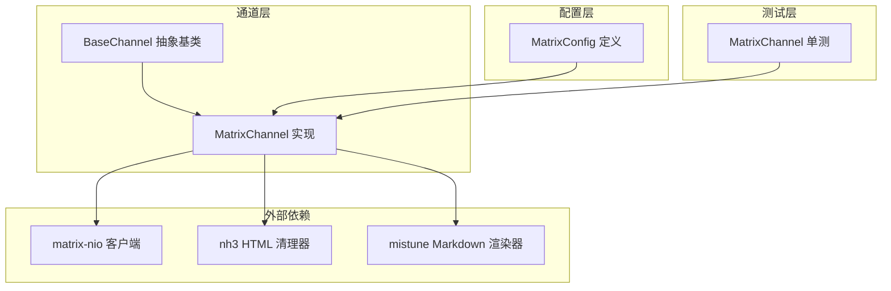
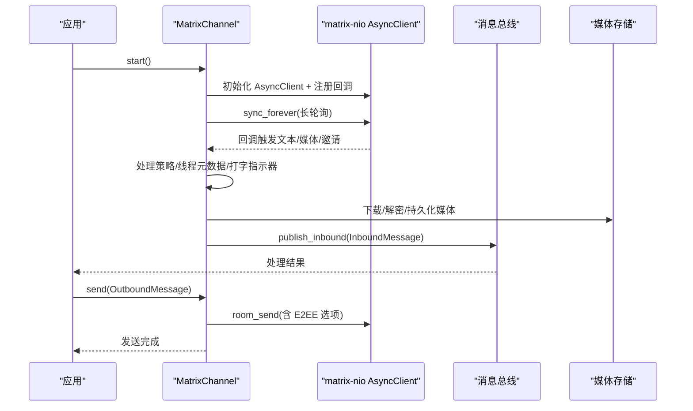
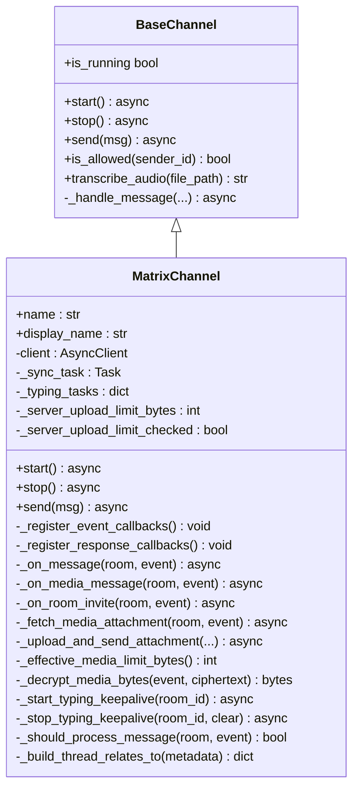
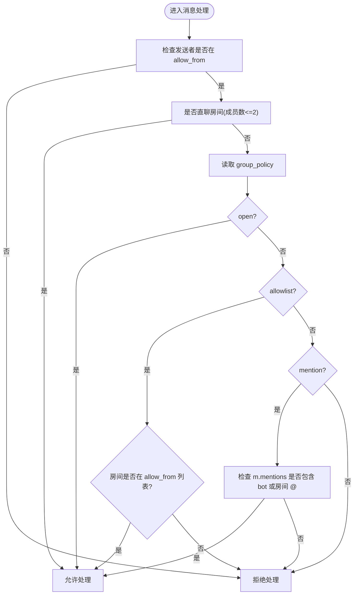
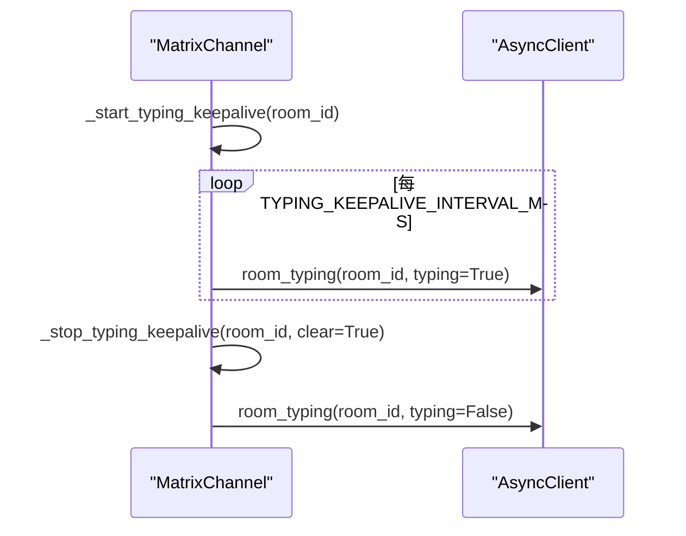
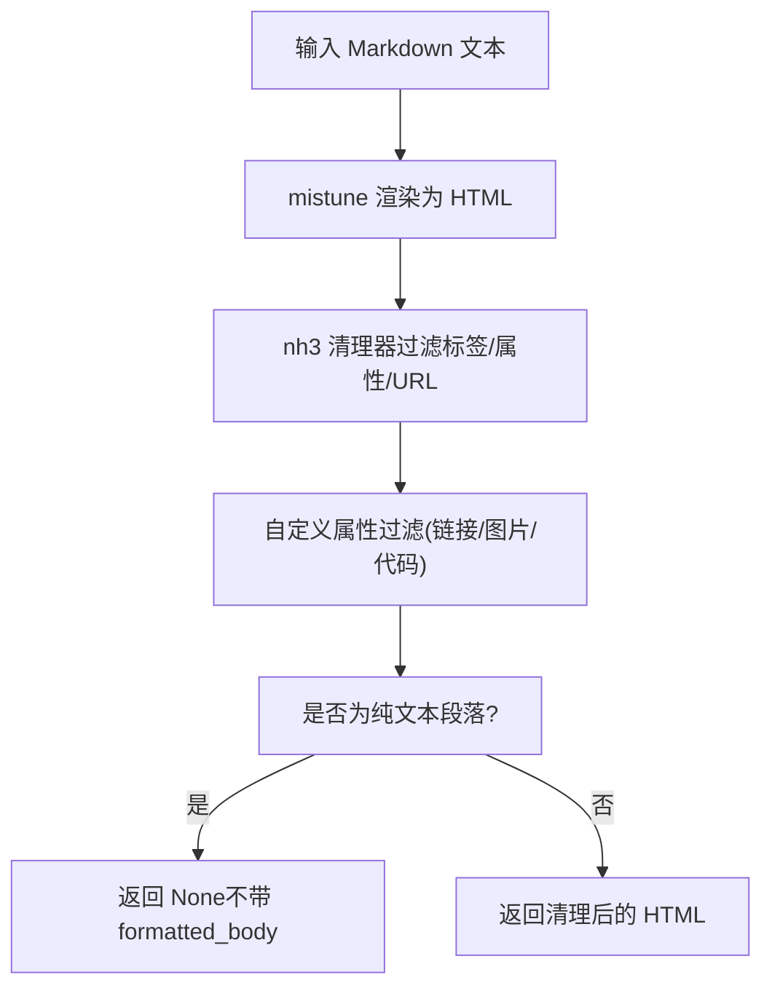
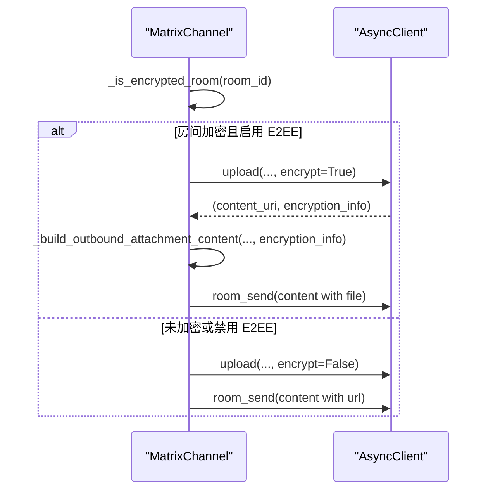
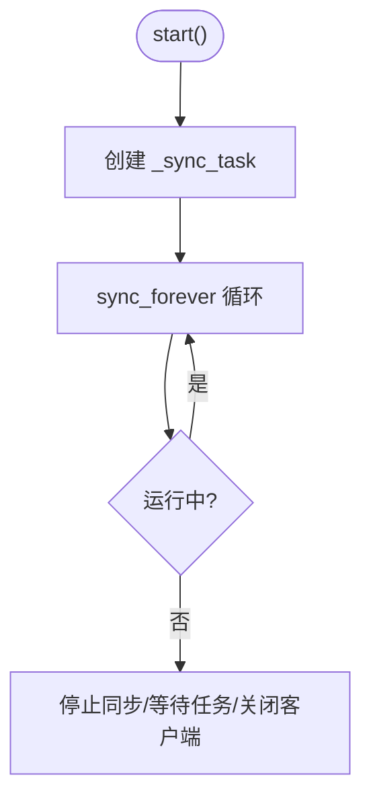
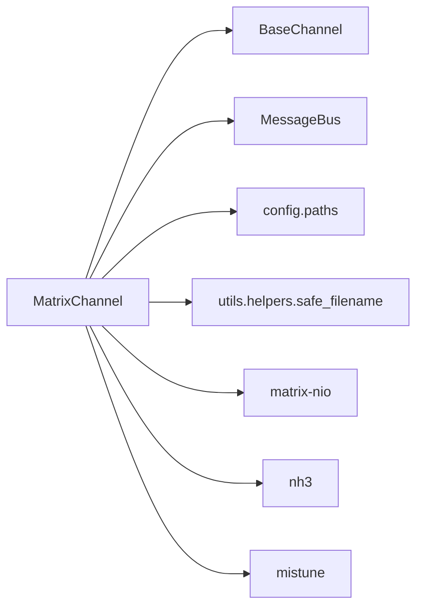

# Matrix 去中心化协议

<cite>
**本文档引用的文件**
- [matrix.py](file://nanobot/channels/matrix.py)
- [test_matrix_channel.py](file://tests/test_matrix_channel.py)
- [schema.py](file://nanobot/config/schema.py)
- [base.py](file://nanobot/channels/base.py)
- [README.md](file://README.md)
- [SECURITY.md](file://SECURITY.md)
</cite>

## 目录
1. [简介](#简介)
2. [项目结构](#项目结构)
3. [核心组件](#核心组件)
4. [架构总览](#架构总览)
5. [详细组件分析](#详细组件分析)
6. [依赖关系分析](#依赖关系分析)
7. [性能考量](#性能考量)
8. [故障排除指南](#故障排除指南)
9. [结论](#结论)
10. [附录](#附录)

## 简介
本指南面向希望在 nanobot 中集成 Matrix（Element）去中心化协议渠道的开发者与运维人员。文档围绕以下目标展开：
- 深入解释 Matrix 协议核心概念与 Element 客户端集成方式
- 端到端加密（E2EE）实现与长轮询同步机制
- MatrixChannel 类的架构设计：客户端初始化、事件回调注册、消息处理流程与媒体附件处理
- 房间策略配置（开放、白名单、提及）、打字指示器管理与错误处理
- Matrix 特有的 HTML 格式化、Markdown 渲染与安全过滤机制
- 提供完整的配置示例、API 使用方法与故障排除指南

## 项目结构
Matrix 集成位于 nanobot 的 channels 子系统中，核心文件如下：
- nanobot/channels/matrix.py：MatrixChannel 实现，负责与 matrix-nio 客户端交互、事件处理、媒体下载与上传、HTML/Markdown 渲染与安全过滤等
- tests/test_matrix_channel.py：针对 MatrixChannel 的单元测试，覆盖启动、回调注册、房间邀请、消息与媒体处理、线程元数据、媒体大小限制、服务器限制、加密媒体解密、错误处理等场景
- nanobot/config/schema.py：定义 MatrixConfig 字段，包括 homeserver、access_token、user_id、device_id、e2ee_enabled、max_media_bytes、group_policy、group_allow_from、allow_room_mentions 等
- nanobot/channels/base.py：所有通道的基础抽象类，定义通用接口与权限控制逻辑
- README.md、SECURITY.md：项目背景与安全策略，有助于理解部署与安全最佳实践

图表来源
- [matrix.py:146-194](file://nanobot/channels/matrix.py#L146-L194)
- [schema.py:73-92](file://nanobot/config/schema.py#L73-L92)
- [base.py:15-88](file://nanobot/channels/base.py#L15-L88)
- [test_matrix_channel.py:1-120](file://tests/test_matrix_channel.py#L1-L120)

章节来源
- [matrix.py:1-120](file://nanobot/channels/matrix.py#L1-L120)
- [schema.py:73-92](file://nanobot/config/schema.py#L73-L92)
- [base.py:15-88](file://nanobot/channels/base.py#L15-L88)
- [README.md:1-200](file://README.md#L1-L200)

## 核心组件
- MatrixChannel：基于 matrix-nio 的异步客户端，实现长轮询同步、事件回调注册、消息与媒体处理、线程元数据、打字指示器、HTML/Markdown 渲染与安全过滤、E2EE 加密与解密、媒体上传与下载、服务器限制查询与生效策略等
- MatrixConfig：定义 Matrix 渠道的配置项，如 homeserver、access_token、user_id、device_id、e2ee_enabled、max_media_bytes、group_policy、group_allow_from、allow_room_mentions 等
- BaseChannel：提供统一的 start/stop/send 接口与权限控制（allow_from）

章节来源
- [matrix.py:146-214](file://nanobot/channels/matrix.py#L146-L214)
- [schema.py:73-92](file://nanobot/config/schema.py#L73-L92)
- [base.py:15-88](file://nanobot/channels/base.py#L15-L88)

## 架构总览
MatrixChannel 通过 matrix-nio 的 AsyncClient 进行长轮询同步，注册多种事件回调以处理文本消息、媒体消息、房间邀请等；同时维护打字指示器任务，处理线程元数据，并在发送时进行 Markdown 渲染与 HTML 安全过滤，在接收时进行媒体下载与解密。

图表来源
- [matrix.py:162-194](file://nanobot/channels/matrix.py#L162-L194)
- [matrix.py:383-392](file://nanobot/channels/matrix.py#L383-L392)
- [matrix.py:661-705](file://nanobot/channels/matrix.py#L661-L705)
- [matrix.py:352-382](file://nanobot/channels/matrix.py#L352-L382)

## 详细组件分析

### MatrixChannel 类架构设计
- 客户端初始化
  - 创建 AsyncClient，设置 store_path、encryption_enabled、homeserver、user_id、access_token、device_id
  - 注册事件回调（文本消息、媒体消息、房间邀请）与响应回调（同步错误、加入错误、发送错误）
  - 若未启用 E2EE，记录警告；若 device_id 缺失，记录警告并跳过本地 store 加载
  - 启动长轮询同步任务
- 事件回调注册
  - 文本消息：_on_message
  - 媒体消息：_on_media_message
  - 房间邀请：_on_room_invite
  - 响应错误：_on_sync_error/_on_join_error/_on_send_error
- 消息处理流程
  - _should_process_message：根据 sender 允许列表、房间类型与策略（开放/白名单/提及）决定是否处理
  - _base_metadata/_thread_metadata/_build_thread_relates_to：构建线程元数据（根事件、回复事件）
  - _on_message：设置打字指示器，调用 _handle_message 将消息转发至消息总线
  - _on_media_message：下载/解密媒体，构建附件元数据，调用 _handle_message
- 媒体附件处理
  - _fetch_media_attachment：下载 mxc:// URL，必要时解密，写入本地媒体目录，返回附件信息与占位标记
  - _upload_and_send_attachment：上传本地文件，构建内容负载（含 E2EE 加密信息），发送消息
  - _effective_media_limit_bytes：取本地配置与服务器限制的最小值，0 则禁用上传
- 打字指示器管理
  - _start_typing_keepalive：周期刷新 typing 状态，避免超时
  - _stop_typing_keepalive：取消任务并清空 typing
- 错误处理机制
  - _log_response_error：区分认证错误与非认证错误，记录日志级别
  - _on_sync_error/_on_join_error/_on_send_error：统一错误上报
  - _decrypt_media_bytes：捕获解密异常并记录告警
- HTML/Markdown 渲染与安全过滤
  - _render_markdown_html：渲染 Markdown 并通过 nh3 清理，仅保留允许标签/属性/URL 方案
  - _build_matrix_text_content：构造 m.text 负载，包含 formatted_body 与 HTML 格式标识
  - _filter_matrix_html_attribute：自定义属性过滤（链接 scheme、图片 src、代码语言 class）

图表来源
- [base.py:15-135](file://nanobot/channels/base.py#L15-L135)
- [matrix.py:146-705](file://nanobot/channels/matrix.py#L146-L705)

章节来源
- [matrix.py:146-214](file://nanobot/channels/matrix.py#L146-L214)
- [matrix.py:383-407](file://nanobot/channels/matrix.py#L383-L407)
- [matrix.py:448-456](file://nanobot/channels/matrix.py#L448-L456)
- [matrix.py:478-491](file://nanobot/channels/matrix.py#L478-L491)
- [matrix.py:504-531](file://nanobot/channels/matrix.py#L504-L531)
- [matrix.py:607-650](file://nanobot/channels/matrix.py#L607-L650)
- [matrix.py:300-351](file://nanobot/channels/matrix.py#L300-L351)
- [matrix.py:421-447](file://nanobot/channels/matrix.py#L421-L447)
- [matrix.py:393-407](file://nanobot/channels/matrix.py#L393-L407)

### 房间策略配置与提及管理
- 策略类型
  - open：开放策略，允许所有消息
  - allowlist：白名单策略，仅允许指定房间
  - mention：提及策略，需被 @ 或房间提及或直聊
- 直聊判定：房间成员数 ≤ 2 视为直聊，无需提及即可处理
- 房间提及开关：allow_room_mentions 控制是否允许房间级 @（默认关闭）

图表来源
- [matrix.py:478-491](file://nanobot/channels/matrix.py#L478-L491)
- [matrix.py:461-464](file://nanobot/channels/matrix.py#L461-L464)
- [matrix.py:465-477](file://nanobot/channels/matrix.py#L465-L477)

章节来源
- [matrix.py:478-491](file://nanobot/channels/matrix.py#L478-L491)
- [matrix.py:461-477](file://nanobot/channels/matrix.py#L461-L477)

### 打字指示器管理
- 启动：收到消息后启动周期性 typing 刷新任务，间隔小于超时时间，避免指示器过期
- 停止：消息处理完成后清理 typing，或在停止通道时取消任务并清空 typing
- 超时与保活：超时时间与保活间隔均以毫秒计，保活间隔小于超时时间

图表来源
- [matrix.py:421-447](file://nanobot/channels/matrix.py#L421-L447)
- [matrix.py:409-420](file://nanobot/channels/matrix.py#L409-L420)

章节来源
- [matrix.py:421-447](file://nanobot/channels/matrix.py#L421-L447)
- [matrix.py:409-420](file://nanobot/channels/matrix.py#L409-L420)

### HTML/Markdown 渲染与安全过滤
- Markdown 渲染：使用 mistune 插件（表格、删除线、URL、上标、下标）
- HTML 清理：nh3 清理器，仅允许预定义标签、属性与 URL scheme，剥离注释与事件处理器
- 属性过滤：链接仅允许 https/http/matrix/mailto，图片 src 仅允许 mxc://，代码语言 class 仅允许以 language- 开头且不为 language-_ 的类名
- 输出策略：若渲染结果仅为纯文本段落，则不附加 formatted_body 以减少负载

图表来源
- [matrix.py:59-121](file://nanobot/channels/matrix.py#L59-L121)
- [matrix.py:77-96](file://nanobot/channels/matrix.py#L77-L96)
- [matrix.py:99-112](file://nanobot/channels/matrix.py#L99-L112)

章节来源
- [matrix.py:59-121](file://nanobot/channels/matrix.py#L59-L121)
- [matrix.py:77-96](file://nanobot/channels/matrix.py#L77-L96)
- [matrix.py:99-112](file://nanobot/channels/matrix.py#L99-L112)

### 端到端加密（E2EE）实现
- 启用条件：config.e2ee_enabled 决定 AsyncClientConfig.encryption_enabled
- 加密房间识别：通过 client.rooms[room_id].encrypted 判断
- 上传策略：当房间加密且启用 E2EE 时，上传时开启 encrypt
- 解密流程：下载得到密文后，使用 decrypt_attachment(key, sha256, iv) 解密
- 发送策略：发送时若启用 E2EE，忽略未验证设备

图表来源
- [matrix.py:260-273](file://nanobot/channels/matrix.py#L260-L273)
- [matrix.py:300-351](file://nanobot/channels/matrix.py#L300-L351)
- [matrix.py:595-605](file://nanobot/channels/matrix.py#L595-L605)

章节来源
- [matrix.py:260-273](file://nanobot/channels/matrix.py#L260-L273)
- [matrix.py:300-351](file://nanobot/channels/matrix.py#L300-L351)
- [matrix.py:595-605](file://nanobot/channels/matrix.py#L595-L605)

### 长轮询同步机制
- 启动：创建 _sync_task，循环执行 sync_forever(full_state=True, timeout=30000)
- 停止：先停止同步，再等待任务完成或取消，最后关闭客户端
- 错误处理：捕获异常并短暂休眠，避免崩溃退出

图表来源
- [matrix.py:162-194](file://nanobot/channels/matrix.py#L162-L194)
- [matrix.py:195-214](file://nanobot/channels/matrix.py#L195-L214)
- [matrix.py:448-456](file://nanobot/channels/matrix.py#L448-L456)

章节来源
- [matrix.py:162-194](file://nanobot/channels/matrix.py#L162-L194)
- [matrix.py:195-214](file://nanobot/channels/matrix.py#L195-L214)
- [matrix.py:448-456](file://nanobot/channels/matrix.py#L448-L456)

### API 使用方法与配置示例
- 配置项（MatrixConfig）
  - enabled：是否启用
  - homeserver：Matrix homeserver 地址
  - access_token：访问令牌
  - user_id：机器人用户 ID（@bot:domain）
  - device_id：设备 ID（用于加载本地 store）
  - e2ee_enabled：是否启用 E2EE
  - sync_stop_grace_seconds：停止同步的最大等待时间
  - max_media_bytes：媒体大小限制（字节）
  - allow_from：允许的发送者列表（支持 "*" 表示全部）
  - group_policy：房间策略（open/allowlist/mention）
  - group_allow_from：白名单房间列表
  - allow_room_mentions：是否允许房间级 @
- 基础使用步骤
  - 初始化 MessageBus
  - 构造 MatrixConfig
  - 实例化 MatrixChannel(config, bus)
  - 调用 start() 启动
  - 调用 send(OutboundMessage) 发送消息
  - 调用 stop() 停止

章节来源
- [schema.py:73-92](file://nanobot/config/schema.py#L73-L92)
- [matrix.py:162-194](file://nanobot/channels/matrix.py#L162-L194)
- [matrix.py:352-382](file://nanobot/channels/matrix.py#L352-L382)

## 依赖关系分析
- 内部依赖
  - BaseChannel：提供统一接口与权限控制
  - MessageBus：消息总线，用于发布入站消息
  - config.paths：数据目录与媒体目录路径解析
  - utils.helpers.safe_filename：安全文件名生成
- 外部依赖
  - matrix-nio：AsyncClient、事件类型、错误类型、加密工具
  - nh3：HTML 清理器
  - mistune：Markdown 渲染器

图表来源
- [matrix.py:39-43](file://nanobot/channels/matrix.py#L39-L43)
- [matrix.py:14-37](file://nanobot/channels/matrix.py#L14-L37)

章节来源
- [matrix.py:39-43](file://nanobot/channels/matrix.py#L39-L43)
- [matrix.py:14-37](file://nanobot/channels/matrix.py#L14-L37)

## 性能考量
- 长轮询超时：默认 30 秒，平衡实时性与资源占用
- 媒体大小限制：本地配置与服务器限制取较小值，避免超限导致失败
- 打字指示器保活：保活间隔小于超时，确保指示器持续有效
- 日志桥接：将 matrix-nio 标准日志桥接到 Loguru，便于统一观测
- Markdown 渲染：仅在有需要时生成 formatted_body，减少传输体积

## 故障排除指南
- 启动失败
  - 检查 homeserver、access_token、user_id、device_id 是否正确
  - 若 device_id 为空，将跳过本地 store 加载并记录警告
  - 若未启用 E2EE，将记录警告提示加密房间可能无法解密
- 同步异常
  - _on_sync_error 记录错误；若出现认证错误（M_UNKNOWN_TOKEN/M_FORBIDDEN/M_UNAUTHORIZED）或 soft_logout，记录为 ERROR
  - 建议检查 token 权限与有效期
- 加入房间失败
  - _on_join_error 记录错误；检查 allow_from 与邀请来源
- 发送失败
  - _on_send_error 记录错误；检查消息格式与权限
- 媒体处理失败
  - 下载失败：记录警告并返回占位符
  - 解密失败：记录告警并返回占位符
  - 超出大小限制：返回“过大”占位符
  - 服务器限制更严格：以服务器限制为准
- 线程与提及策略问题
  - 检查 group_policy 与 allow_room_mentions 设置
  - 直聊房间无需提及即可处理
- 安全与权限
  - allow_from 为空将拒绝所有访问；生产环境务必配置
  - 参考安全策略文档中的最佳实践

章节来源
- [matrix.py:182-191](file://nanobot/channels/matrix.py#L182-L191)
- [matrix.py:393-407](file://nanobot/channels/matrix.py#L393-L407)
- [matrix.py:617-637](file://nanobot/channels/matrix.py#L617-L637)
- [matrix.py:635-650](file://nanobot/channels/matrix.py#L635-L650)
- [SECURITY.md:37-62](file://SECURITY.md#L37-L62)

## 结论
MatrixChannel 在 nanobot 中提供了完整的 Matrix（Element）集成能力，涵盖长轮询同步、事件回调、消息与媒体处理、线程元数据、打字指示器、HTML/Markdown 渲染与安全过滤、以及 E2EE 支持。通过灵活的房间策略与严格的权限控制，可在生产环境中安全稳定地运行。配合完善的测试覆盖与错误处理机制，能够满足大多数去中心化通信场景的需求。

## 附录
- 测试覆盖要点
  - 启动与停止：设备 ID 缺失、E2EE 关闭、停止顺序
  - 回调注册：媒体事件过滤、文本事件过滤
  - 房间策略：开放/白名单/提及、直聊房间、房间 @ 开关
  - 线程元数据：根事件与回复事件映射
  - 媒体处理：下载/解密/大小限制/服务器限制/错误处理
  - HTML/Markdown：渲染与安全过滤、回退策略
  - 发送：E2EE 加密房间的加密媒体负载

章节来源
- [test_matrix_channel.py:176-262](file://tests/test_matrix_channel.py#L176-L262)
- [test_matrix_channel.py:213-224](file://tests/test_matrix_channel.py#L213-L224)
- [test_matrix_channel.py:281-320](file://tests/test_matrix_channel.py#L281-L320)
- [test_matrix_channel.py:400-498](file://tests/test_matrix_channel.py#L400-L498)
- [test_matrix_channel.py:531-566](file://tests/test_matrix_channel.py#L531-L566)
- [test_matrix_channel.py:568-735](file://tests/test_matrix_channel.py#L568-L735)
- [test_matrix_channel.py:737-831](file://tests/test_matrix_channel.py#L737-L831)
- [test_matrix_channel.py:1229-1295](file://tests/test_matrix_channel.py#L1229-L1295)