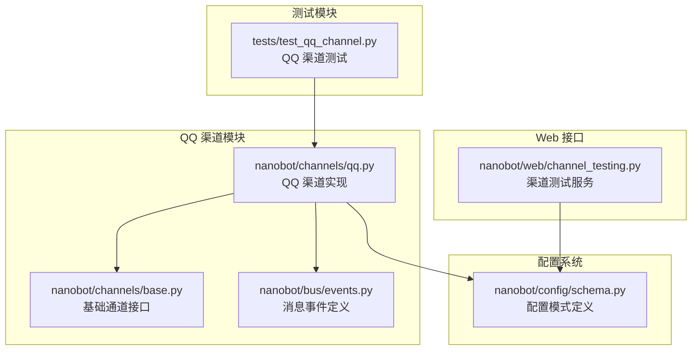
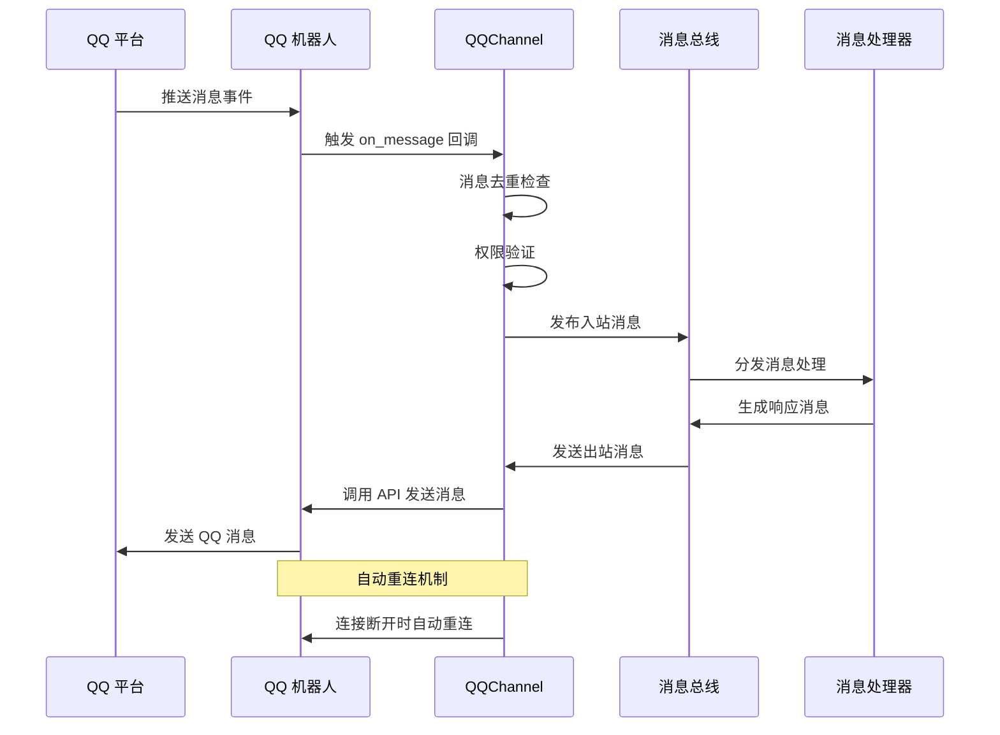
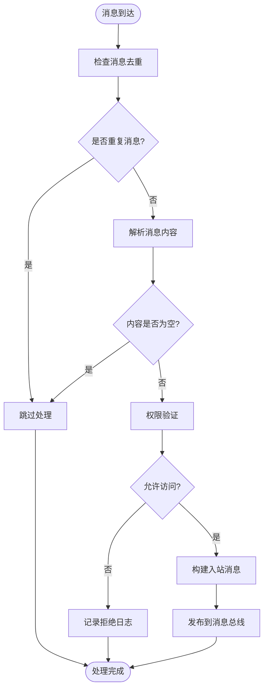
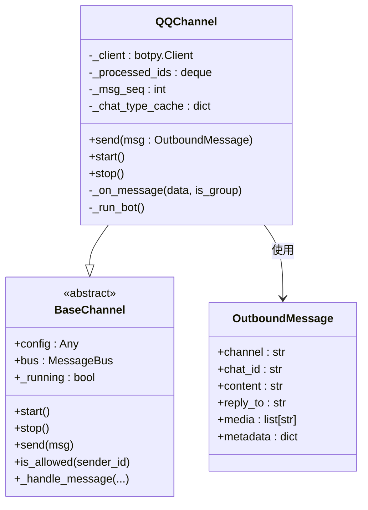
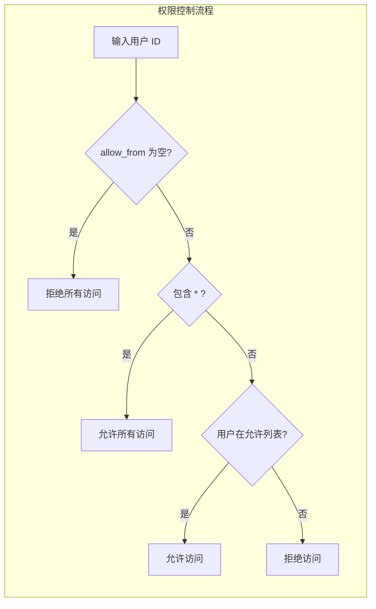
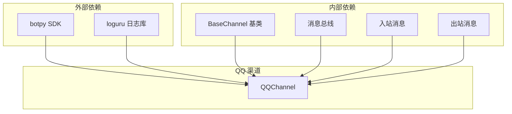

# QQ 传统即时通讯

<cite>
**本文档引用的文件**
- [nanobot/channels/qq.py](file://nanobot/channels/qq.py)
- [nanobot/config/schema.py](file://nanobot/config/schema.py)
- [nanobot/channels/base.py](file://nanobot/channels/base.py)
- [nanobot/bus/events.py](file://nanobot/bus/events.py)
- [tests/test_qq_channel.py](file://tests/test_qq_channel.py)
- [nanobot/web/channel_testing.py](file://nanobot/web/channel_testing.py)
</cite>

## 目录
1. [简介](#简介)
2. [项目结构](#项目结构)
3. [核心组件](#核心组件)
4. [架构概览](#架构概览)
5. [详细组件分析](#详细组件分析)
6. [依赖关系分析](#依赖关系分析)
7. [性能考虑](#性能考虑)
8. [故障排除指南](#故障排除指南)
9. [结论](#结论)
10. [附录](#附录)

## 简介

QQ 传统即时通讯渠道是基于 QQ 机器人的一个完整集成实现，使用 botpy SDK 提供 WebSocket 连接来处理 QQ 平台的消息通信。该实现支持私聊(C2C)和群组消息，并提供了完整的消息格式转换、去重机制和错误处理策略。

QQ 渠道的主要特点包括：
- 支持 QQ 机器人 API 的完整功能
- 实现了消息去重和序列号管理
- 提供了灵活的权限控制机制
- 具备自动重连和错误恢复能力
- 支持 Markdown 格式的消息发送

## 项目结构

QQ 渠道的实现遵循 nanobot 的模块化架构设计，主要涉及以下关键文件：



**图表来源**
- [nanobot/channels/qq.py:1-162](file://nanobot/channels/qq.py#L1-L162)
- [nanobot/channels/base.py:1-135](file://nanobot/channels/base.py#L1-L135)
- [nanobot/config/schema.py:192-201](file://nanobot/config/schema.py#L192-L201)

**章节来源**
- [nanobot/channels/qq.py:1-162](file://nanobot/channels/qq.py#L1-L162)
- [nanobot/config/schema.py:192-201](file://nanobot/config/schema.py#L192-L201)

## 核心组件

### QQChannel 类

QQChannel 是 QQ 渠道的主要实现类，继承自 BaseChannel 抽象基类。它负责处理 QQ 机器人的连接、消息接收和发送等功能。

核心特性：
- **WebSocket 连接管理**：使用 botpy SDK 建立持久化的 WebSocket 连接
- **消息去重机制**：维护消息 ID 缓存，防止重复处理
- **权限控制**：基于 allow_from 列表的访问控制
- **自动重连**：网络异常时自动重连机制
- **Markdown 支持**：支持富文本消息格式

### 配置系统

QQ 渠道使用 Pydantic 模型进行配置管理，提供类型安全的配置验证和默认值设置。

配置参数：
- `enabled`: 是否启用 QQ 渠道
- `app_id`: QQ 机器人应用 ID
- `secret`: QQ 机器人密钥
- `allow_from`: 允许访问的用户列表

**章节来源**
- [nanobot/channels/qq.py:53-162](file://nanobot/channels/qq.py#L53-L162)
- [nanobot/config/schema.py:192-201](file://nanobot/config/schema.py#L192-L201)

## 架构概览

QQ 渠道采用事件驱动的架构模式，通过消息总线实现解耦：



**图表来源**
- [nanobot/channels/qq.py:41-48](file://nanobot/channels/qq.py#L41-L48)
- [nanobot/channels/qq.py:133-162](file://nanobot/channels/qq.py#L133-L162)

## 详细组件分析

### 消息处理流程

QQ 渠道实现了完整的消息生命周期管理：



**图表来源**
- [nanobot/channels/qq.py:133-162](file://nanobot/channels/qq.py#L133-L162)
- [nanobot/channels/base.py:79-87](file://nanobot/channels/base.py#L79-L87)

### 消息发送机制

QQ 渠道支持两种消息发送模式：



**图表来源**
- [nanobot/channels/qq.py:53-162](file://nanobot/channels/qq.py#L53-L162)
- [nanobot/channels/base.py:15-135](file://nanobot/channels/base.py#L15-L135)
- [nanobot/bus/events.py:27-39](file://nanobot/bus/events.py#L27-L39)

### 权限控制系统

QQ 渠道实现了灵活的权限控制机制：



**图表来源**
- [nanobot/channels/base.py:79-87](file://nanobot/channels/base.py#L79-L87)

**章节来源**
- [nanobot/channels/qq.py:104-132](file://nanobot/channels/qq.py#L104-L132)
- [nanobot/channels/base.py:79-87](file://nanobot/channels/base.py#L79-L87)

## 依赖关系分析

QQ 渠道的依赖关系相对简单，主要依赖于外部 SDK 和内部框架组件：



**图表来源**
- [nanobot/channels/qq.py:14-26](file://nanobot/channels/qq.py#L14-L26)
- [nanobot/channels/base.py:15-135](file://nanobot/channels/base.py#L15-L135)

**章节来源**
- [nanobot/channels/qq.py:14-26](file://nanobot/channels/qq.py#L14-L26)
- [nanobot/channels/base.py:15-135](file://nanobot/channels/base.py#L15-L135)

## 性能考虑

### 内存管理

QQ 渠道实现了高效的内存管理策略：

- **消息去重缓存**：使用固定大小的双端队列存储最近处理的消息 ID，最大长度为 1000
- **消息序列号**：维护递增的消息序列号，用于避免 QQ API 的去重机制
- **聊天类型缓存**：缓存聊天类型信息，减少重复判断

### 连接管理

- **自动重连机制**：网络异常时自动重连，间隔 5 秒
- **优雅关闭**：停止时正确关闭连接，避免资源泄漏
- **异常处理**：捕获并记录所有异常，不影响整体运行

### 错误处理策略

- **客户端初始化检查**：确保 botpy 库正确安装
- **配置验证**：检查 app_id 和 secret 是否配置
- **API 调用保护**：捕获 API 调用异常并记录错误

**章节来源**
- [nanobot/channels/qq.py:63-65](file://nanobot/channels/qq.py#L63-L65)
- [nanobot/channels/qq.py:83-92](file://nanobot/channels/qq.py#L83-L92)
- [nanobot/channels/qq.py:130-131](file://nanobot/channels/qq.py#L130-L131)

## 故障排除指南

### 常见问题及解决方案

#### 1. 依赖库缺失

**问题**：QQ SDK 未安装
**症状**：启动时报错 "QQ SDK not installed"
**解决方案**：安装 botpy 库
```bash
pip install qq-botpy
```

#### 2. 凭据配置错误

**问题**：app_id 或 secret 未配置
**症状**：启动时报错 "QQ app_id and secret not configured"
**解决方案**：在配置文件中正确设置 QQ 机器人凭据

#### 3. 权限访问被拒绝

**问题**：用户不在允许列表中
**症状**：消息被拒绝，记录警告日志
**解决方案**：在配置中添加允许的用户 ID

#### 4. 消息重复处理

**问题**：同一消息被多次处理
**症状**：消息去重机制生效，重复消息被忽略
**解决方案**：这是正常行为，无需处理

### 调试技巧

1. **查看日志输出**：使用 loguru 记录详细的调试信息
2. **检查网络连接**：确认 WebSocket 连接正常
3. **验证 API 凭据**：使用内置的凭据验证功能
4. **监控内存使用**：关注消息缓存的大小

**章节来源**
- [nanobot/channels/qq.py:69-75](file://nanobot/channels/qq.py#L69-L75)
- [nanobot/web/channel_testing.py:457-493](file://nanobot/web/channel_testing.py#L457-L493)

## 结论

QQ 传统即时通讯渠道提供了一个完整、可靠的 QQ 机器人集成解决方案。其设计特点包括：

**优势**：
- 完整的消息处理生命周期管理
- 灵活的权限控制系统
- 高效的内存管理和去重机制
- 自动重连和错误恢复能力
- 类型安全的配置管理

**适用场景**：
- 企业内部 QQ 机器人应用
- 客服自动化系统
- 消息推送服务
- 智能助手集成

该实现为开发者提供了清晰的扩展点和良好的可维护性，是构建 QQ 平台应用的理想选择。

## 附录

### 配置参数参考

| 参数名 | 类型 | 必需 | 描述 |
|--------|------|------|------|
| enabled | bool | 否 | 是否启用 QQ 渠道，默认 false |
| app_id | str | 是 | QQ 机器人应用 ID |
| secret | str | 是 | QQ 机器人密钥 |
| allow_from | list[str] | 否 | 允许访问的用户列表，默认空列表 |

### API 调用示例

由于代码库中的实现使用了外部 SDK，具体的 API 调用示例请参考 botpy SDK 文档。QQ 渠道封装了以下核心 API：

- `post_group_message()`: 发送群组消息
- `post_c2c_message()`: 发送私聊消息
- `on_group_at_message_create()`: 处理群组 @ 消息
- `on_c2c_message_create()`: 处理私聊消息
- `on_direct_message_create()`: 处理直接消息

### 安全考虑

1. **凭据保护**：确保 app_id 和 secret 的安全存储
2. **权限控制**：合理配置 allow_from 列表
3. **日志安全**：避免在日志中记录敏感信息
4. **网络加密**：使用 HTTPS 和 WebSocket 加密连接