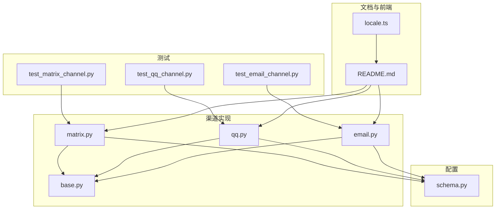
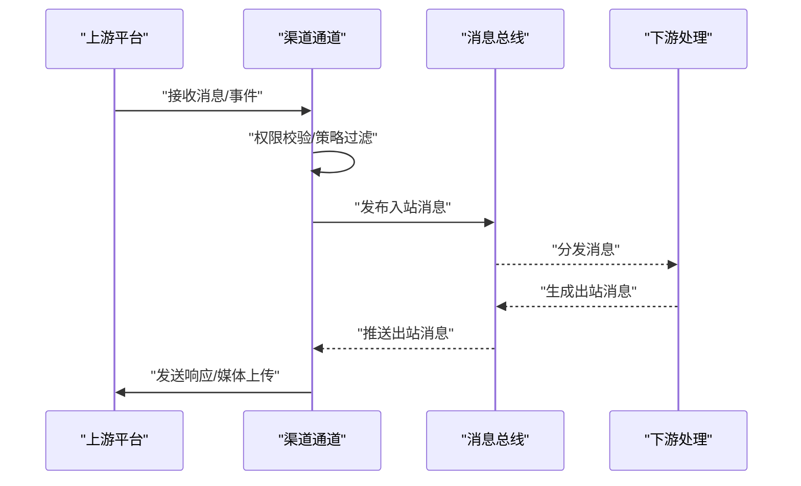
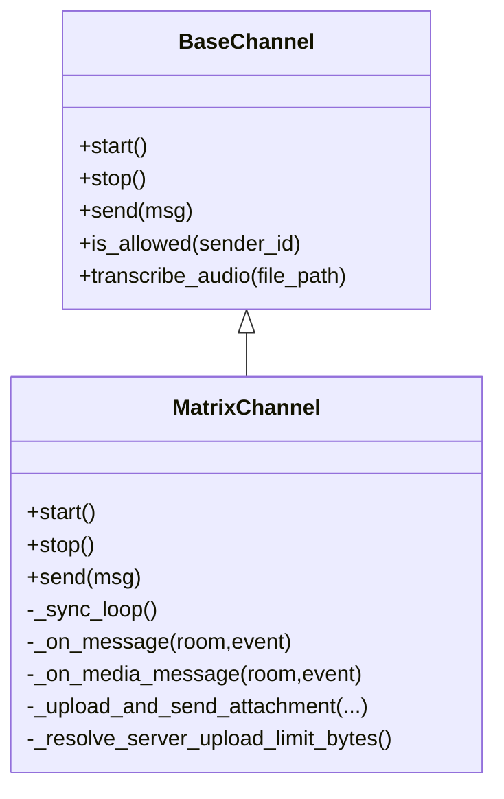
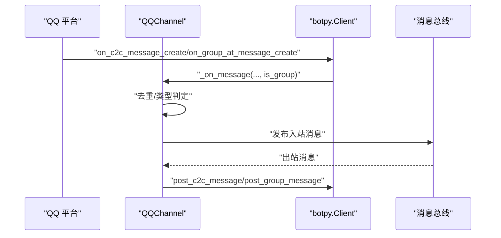
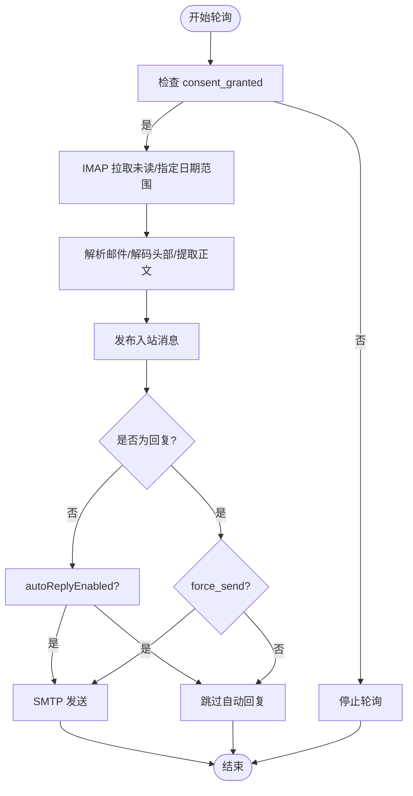
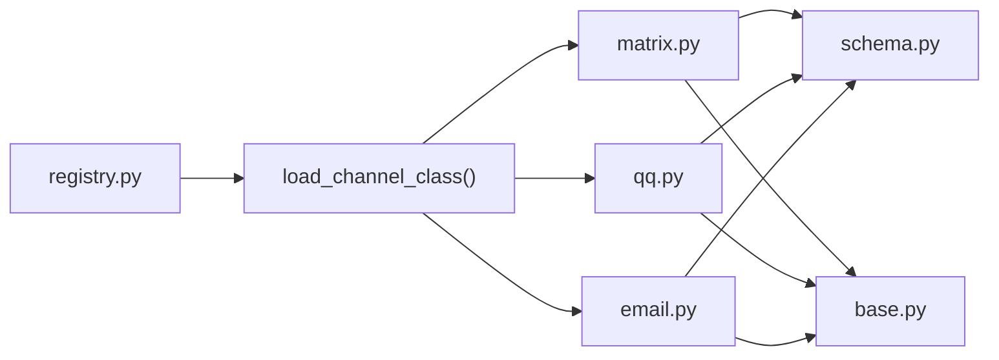

# 国际化渠道

<cite>
**本文引用的文件**
- [matrix.py](file://nanobot/channels/matrix.py)
- [qq.py](file://nanobot/channels/qq.py)
- [email.py](file://nanobot/channels/email.py)
- [base.py](file://nanobot/channels/base.py)
- [schema.py](file://nanobot/config/schema.py)
- [registry.py](file://nanobot/channels/registry.py)
- [test_matrix_channel.py](file://tests/test_matrix_channel.py)
- [test_qq_channel.py](file://tests/test_qq_channel.py)
- [test_email_channel.py](file://tests/test_email_channel.py)
- [README.md](file://README.md)
- [locale.ts](file://web-ui/src/locale.ts)
</cite>

## 目录
1. [简介](#简介)
2. [项目结构](#项目结构)
3. [核心组件](#核心组件)
4. [架构总览](#架构总览)
5. [详细组件分析](#详细组件分析)
6. [依赖分析](#依赖分析)
7. [性能考量](#性能考量)
8. [故障排查指南](#故障排查指南)
9. [结论](#结论)
10. [附录](#附录)

## 简介
本指南聚焦于国际化与传统渠道（Matrix、QQ、Email）的集成实践，涵盖以下要点：
- Matrix去中心化协议的实现方式：长轮询同步、E2EE支持、媒体附件处理、提及与房间策略。
- QQ平台的特殊要求：botpy SDK、私聊与群聊路由、消息去重与序列号、鉴权与自动重连。
- Email渠道的邮件处理机制：IMAP轮询、SMTP回复、主题继承与去重、正文提取与HTML转文本。
- 国际化支持与多语言处理：配置层的键名兼容（驼峰/蛇形）、前端本地化格式化函数、跨平台兼容性建议。
- 具体配置示例、API使用方法与错误处理策略，并提供不同地区与文化背景下的使用建议。

## 项目结构
- 渠道模块位于 nanobot/channels 下，每个渠道以独立文件实现，统一继承自 BaseChannel。
- 配置模型集中于 nanobot/config/schema.py，包含各渠道的配置项与默认值。
- 测试用例位于 tests/，覆盖各渠道的关键行为与边界条件。
- README.md 提供各渠道的安装与配置指引。

**图表来源**
- [matrix.py:146-706](file://nanobot/channels/matrix.py#L146-L706)
- [qq.py:53-162](file://nanobot/channels/qq.py#L53-L162)
- [email.py:25-410](file://nanobot/channels/email.py#L25-L410)
- [base.py:15-135](file://nanobot/channels/base.py#L15-L135)
- [schema.py:73-126](file://nanobot/config/schema.py#L73-L126)
- [test_matrix_channel.py:1-800](file://tests/test_matrix_channel.py#L1-L800)
- [test_qq_channel.py:1-67](file://tests/test_qq_channel.py#L1-L67)
- [test_email_channel.py:1-369](file://tests/test_email_channel.py#L1-L369)
- [README.md:386-711](file://README.md#L386-L711)
- [locale.ts:1-43](file://web-ui/src/locale.ts#L1-L43)

**章节来源**
- [matrix.py:146-706](file://nanobot/channels/matrix.py#L146-L706)
- [qq.py:53-162](file://nanobot/channels/qq.py#L53-L162)
- [email.py:25-410](file://nanobot/channels/email.py#L25-L410)
- [base.py:15-135](file://nanobot/channels/base.py#L15-L135)
- [schema.py:73-126](file://nanobot/config/schema.py#L73-L126)
- [README.md:386-711](file://README.md#L386-L711)

## 核心组件
- BaseChannel：定义所有渠道的统一接口，包括 start/stop/send、权限校验、消息入站转发到消息总线。
- 各渠道类：MatrixChannel、QQChannel、EmailChannel 分别实现对应平台的接入逻辑。
- 配置模型：MatrixConfig、QQConfig、EmailConfig 定义了各渠道的配置项与默认值。
- 自动发现：通过 registry 模块扫描 channels 包中的模块，动态加载渠道类。

**章节来源**
- [base.py:15-135](file://nanobot/channels/base.py#L15-L135)
- [matrix.py:146-161](file://nanobot/channels/matrix.py#L146-L161)
- [qq.py:53-66](file://nanobot/channels/qq.py#L53-L66)
- [email.py:25-61](file://nanobot/channels/email.py#L25-L61)
- [schema.py:73-126](file://nanobot/config/schema.py#L73-L126)
- [registry.py:15-36](file://nanobot/channels/registry.py#L15-L36)

## 架构总览
下图展示了消息从渠道到总线再到下游处理的整体流程，以及各渠道的关键处理点。

**图表来源**
- [base.py:89-130](file://nanobot/channels/base.py#L89-L130)
- [matrix.py:352-382](file://nanobot/channels/matrix.py#L352-L382)
- [qq.py:104-132](file://nanobot/channels/qq.py#L104-L132)
- [email.py:106-153](file://nanobot/channels/email.py#L106-L153)

## 详细组件分析

### Matrix 渠道（Element）
- 实现要点
  - 使用 matrix-nio 的长轮询同步，支持 E2EE 加密与加密房间处理。
  - 支持文本与媒体消息，媒体下载、解密、落地与标记提示。
  - 提及与房间策略：open/mention/allowlist；支持 @room 提及开关。
  - 服务器上传限制协商，取本地与服务器最小值作为最终限制。
  - Typing Indicator 保活刷新，避免指示器过期。
  - 错误回调：同步、加入房间、发送消息分别记录日志，区分认证错误与非致命错误。
- 关键配置
  - homeserver、access_token、user_id、device_id、e2ee_enabled、group_policy、allow_room_mentions、max_media_bytes。
- 国际化与多语言
  - Markdown 渲染与 HTML 白名单清理，确保跨平台显示一致性。
  - 附件命名与扩展名推断，避免跨系统路径差异。
- 跨平台兼容性
  - 通过 content_repo 配置查询服务器限制，适配不同 Homeserver 的大小限制。
  - 设备 ID 与 store_path 用于恢复会话，避免重启导致的消息重复。

**图表来源**
- [base.py:15-135](file://nanobot/channels/base.py#L15-L135)
- [matrix.py:146-706](file://nanobot/channels/matrix.py#L146-L706)

**章节来源**
- [matrix.py:146-706](file://nanobot/channels/matrix.py#L146-L706)
- [schema.py:73-92](file://nanobot/config/schema.py#L73-L92)
- [test_matrix_channel.py:1-800](file://tests/test_matrix_channel.py#L1-L800)

### QQ 渠道（C2C/Group）
- 实现要点
  - 使用 botpy SDK，WebSocket 连接，支持私聊与群聊。
  - 消息去重：基于消息 ID 的双端缓存队列。
  - 消息序列号：避免 QQ API 去重策略导致的消息丢失。
  - 自动重连：异常时等待 5 秒后重试。
  - 发送：根据聊天类型选择 C2C 或 Group API。
- 关键配置
  - app_id、secret、allow_from。
- 国际化与多语言
  - 平台侧为中文生态，消息内容按原文透传；建议在下游进行语言检测与翻译。
- 跨平台兼容性
  - 通过缓存聊天类型，减少 API 调用次数；支持沙箱环境测试。

**图表来源**
- [qq.py:29-103](file://nanobot/channels/qq.py#L29-L103)
- [qq.py:133-162](file://nanobot/channels/qq.py#L133-L162)

**章节来源**
- [qq.py:53-162](file://nanobot/channels/qq.py#L53-L162)
- [schema.py:192-201](file://nanobot/config/schema.py#L192-L201)
- [test_qq_channel.py:1-67](file://tests/test_qq_channel.py#L1-L67)

### Email 渠道（IMAP + SMTP）
- 实现要点
  - IMAP 轮询：支持 UNSEEN 查询、日期范围查询、UID 去重、标记已读。
  - SMTP 回复：自动继承主题、设置 In-Reply-To/References，支持强制发送。
  - 主题前缀与自动回复控制：可配置是否自动回复、主题前缀。
  - 正文提取：优先纯文本，其次 HTML 转文本，保留换行与段落。
- 关键配置
  - consent_granted、imap_*、smtp_*、auto_reply_enabled、poll_interval_seconds、subject_prefix。
- 国际化与多语言
  - 邮件头部编码解码，支持多语言主题与发件人地址解析。
  - IMAP 日期格式使用英文月份缩写，保证跨地域兼容。
- 跨平台兼容性
  - SSL/TLS 可选组合，适配不同邮箱服务商；UID 去重集合上限防止内存膨胀。

**图表来源**
- [email.py:62-153](file://nanobot/channels/email.py#L62-L153)
- [email.py:192-323](file://nanobot/channels/email.py#L192-L323)

**章节来源**
- [email.py:25-410](file://nanobot/channels/email.py#L25-L410)
- [schema.py:94-126](file://nanobot/config/schema.py#L94-L126)
- [test_email_channel.py:1-369](file://tests/test_email_channel.py#L1-L369)

## 依赖分析
- 渠道与配置
  - 各渠道类均依赖 BaseChannel 接口，统一通过 MessageBus 发布/订阅消息。
  - 配置模型集中于 schema.py，提供默认值与字段别名（驼峰/蛇形）兼容。
- 自动发现
  - registry 模块扫描 channels 包，动态导入并查找继承自 BaseChannel 的子类。
- 第三方依赖
  - Matrix：matrix-nio、nh3、mistune。
  - QQ：botpy。
  - Email：标准库 email、imaplib、smtplib。

**图表来源**
- [registry.py:15-36](file://nanobot/channels/registry.py#L15-L36)
- [matrix.py:146-161](file://nanobot/channels/matrix.py#L146-L161)
- [qq.py:53-66](file://nanobot/channels/qq.py#L53-L66)
- [email.py:25-61](file://nanobot/channels/email.py#L25-L61)
- [schema.py:73-126](file://nanobot/config/schema.py#L73-L126)
- [base.py:15-38](file://nanobot/channels/base.py#L15-L38)

**章节来源**
- [registry.py:15-36](file://nanobot/channels/registry.py#L15-L36)
- [schema.py:73-126](file://nanobot/config/schema.py#L73-L126)

## 性能考量
- Matrix
  - 服务器上传限制协商，避免不必要的上传失败与重试。
  - typing 保活周期与超时设置平衡用户体验与资源消耗。
  - 存储路径与设备 ID 稳定，减少重启后的重复消息处理。
- QQ
  - 去重队列与消息序列号降低重复与丢失风险。
  - 自动重连避免瞬时网络波动影响。
- Email
  - 轮询间隔与 UID 去重集合上限控制内存占用。
  - SSL/TLS 组合按需启用，兼顾安全与性能。

[本节为通用指导，无需特定文件引用]

## 故障排查指南
- Matrix
  - 认证错误（M_UNKNOWN_TOKEN/M_FORBIDDEN/M_UNAUTHORIZED）与软登出会被记录为 ERROR 级别，需检查 token、设备 ID 与服务器配置。
  - 无 device_id 或 store 加载失败可能导致消息重复，建议固定 device_id 并确保存储路径可写。
  - 上传失败或媒体过大：检查 max_media_bytes 与服务器 content_repo 限制。
- QQ
  - SDK 未安装：pip 安装 botpy；缺少 app_id/secret：完善配置。
  - 消息未到达：检查 allow_from 与去重缓存；确认 is_group 类型缓存正确。
- Email
  - 未授权访问：consent_granted 必须为 true；SMTP/TLS 配置需与邮箱服务商一致。
  - 未自动回复：auto_reply_enabled=false 时仅强制发送有效；检查 In-Reply-To/References 设置。

**章节来源**
- [matrix.py:393-407](file://nanobot/channels/matrix.py#L393-L407)
- [qq.py:67-81](file://nanobot/channels/qq.py#L67-L81)
- [email.py:62-101](file://nanobot/channels/email.py#L62-L101)

## 结论
- Matrix 提供去中心化、强隐私的通信能力，适合对数据主权有要求的场景；需关注 E2EE 与上传限制。
- QQ 适合中文生态的即时沟通，具备良好的私聊与群聊支持；注意去重与序列号策略。
- Email 作为传统渠道，适合需要长期归档与合规的场景；需合理配置轮询与自动回复策略。
- 配置层对键名的兼容设计与前端本地化函数，有助于提升多语言与多地区部署体验。

[本节为总结性内容，无需特定文件引用]

## 附录

### 配置示例与最佳实践
- Matrix
  - 安装依赖：pip install nanobot-ai[matrix]
  - 获取 userId/accessToken/deviceId 并填入配置；建议开启 e2ee_enabled；设置 groupPolicy 与 allowFrom。
  - 参考：[README 中的 Matrix 配置段落:386-450](file://README.md#L386-L450)
- QQ
  - 在 QQ 开放平台获取 AppID/Secret；在沙箱配置中添加测试账号；配置 allowFrom 与 appId/secret。
  - 参考：[README 中的 QQ 配置段落:539-579](file://README.md#L539-L579)
- Email
  - 使用专用邮箱账户，开启 IMAP/SMTP；配置 consent_granted、allowFrom、auto_reply_enabled；按需调整 subject_prefix。
  - 参考：[README 中的 Email 配置段落:666-711](file://README.md#L666-L711)

### API 使用方法
- 渠道启动与停止
  - start：建立连接、注册回调、进入主循环。
  - stop：优雅关闭、取消任务、释放资源。
- 发送消息
  - send：构建内容与媒体，调用平台 API；Matrix 支持媒体上传与 E2EE；QQ 根据聊天类型选择 API；Email 通过 SMTP 发送。
- 权限与策略
  - is_allowed：基于 allowFrom 列表；Matrix 支持 groupPolicy 与 @room 提及策略。

**章节来源**
- [base.py:52-77](file://nanobot/channels/base.py#L52-L77)
- [matrix.py:162-214](file://nanobot/channels/matrix.py#L162-L214)
- [qq.py:67-102](file://nanobot/channels/qq.py#L67-L102)
- [email.py:62-101](file://nanobot/channels/email.py#L62-L101)

### 错误处理策略
- Matrix：区分认证错误与一般错误，记录详细响应信息；同步/加入/发送错误分别处理。
- QQ：捕获 SDK 异常并自动重连；记录错误信息以便诊断。
- Email：IMAP/SMTP 异常统一记录；consent 与配置校验前置。

**章节来源**
- [matrix.py:393-407](file://nanobot/channels/matrix.py#L393-L407)
- [qq.py:83-102](file://nanobot/channels/qq.py#L83-L102)
- [email.py:97-101](file://nanobot/channels/email.py#L97-L101)

### 国际化与多语言处理
- 配置层
  - 支持驼峰与蛇形键名互换，便于多语言环境下的配置管理。
- 前端本地化
  - locale.ts 提供中文日期时间格式化与相对时间格式化函数，便于界面本地化展示。
- 跨平台兼容性建议
  - Matrix：统一 HTML 清洗与 Markdown 渲染，避免样式差异。
  - QQ：消息内容透传，建议在下游做语言检测与翻译。
  - Email：注意主题与正文编码，IMAP 日期使用英文缩写。

**章节来源**
- [schema.py:11-14](file://nanobot/config/schema.py#L11-L14)
- [locale.ts:1-43](file://web-ui/src/locale.ts#L1-L43)
- [matrix.py:99-122](file://nanobot/channels/matrix.py#L99-L122)
- [email.py:325-330](file://nanobot/channels/email.py#L325-L330)