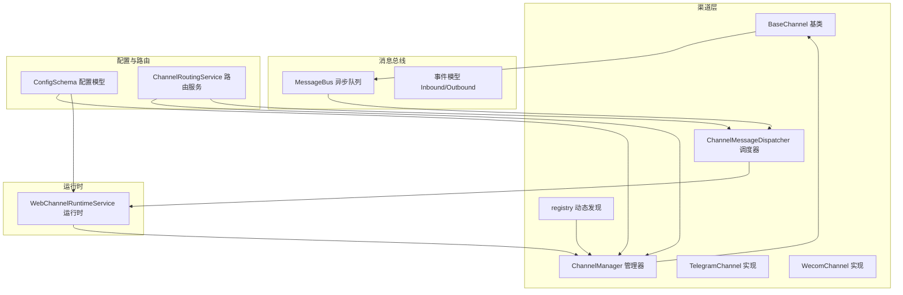
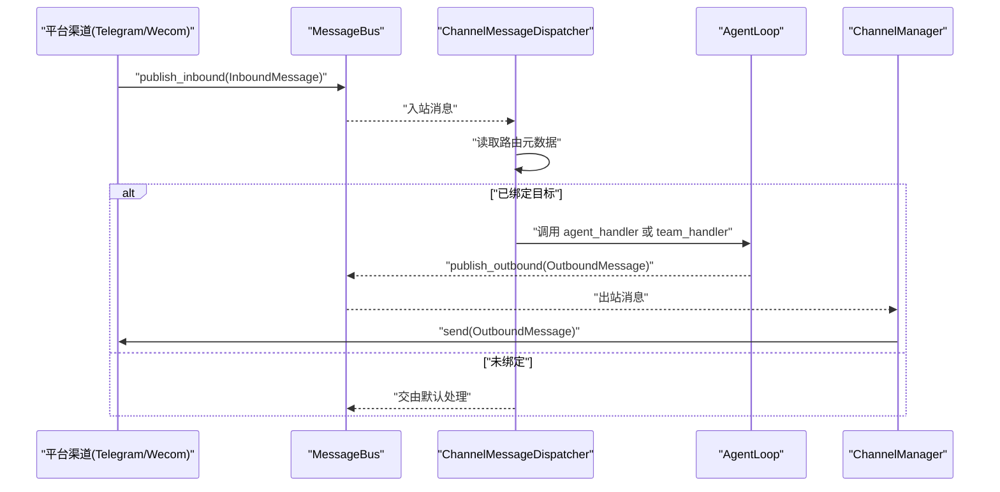
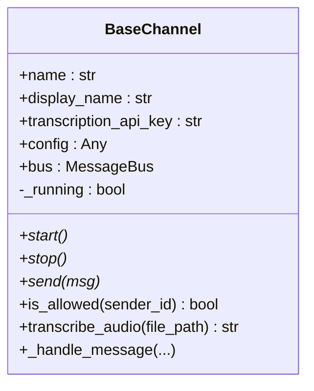
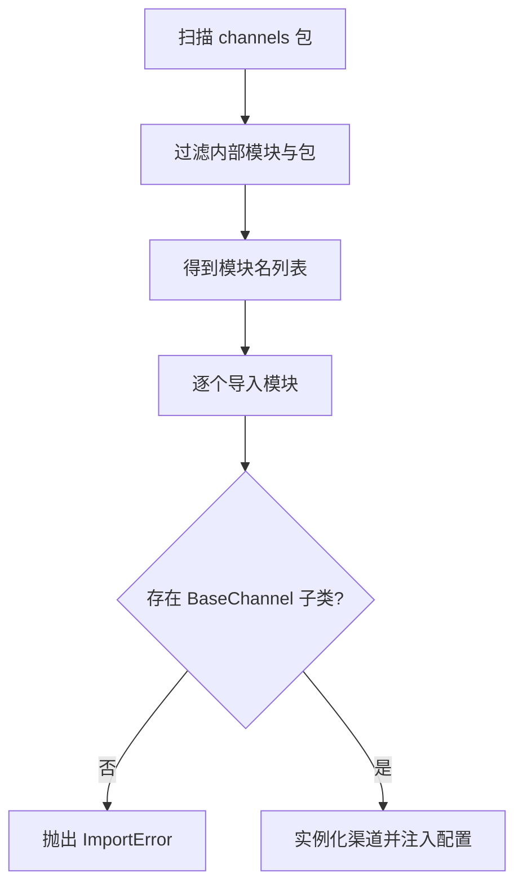
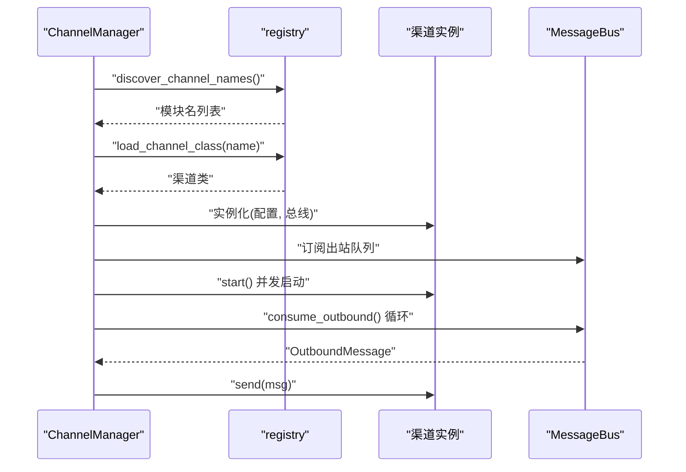
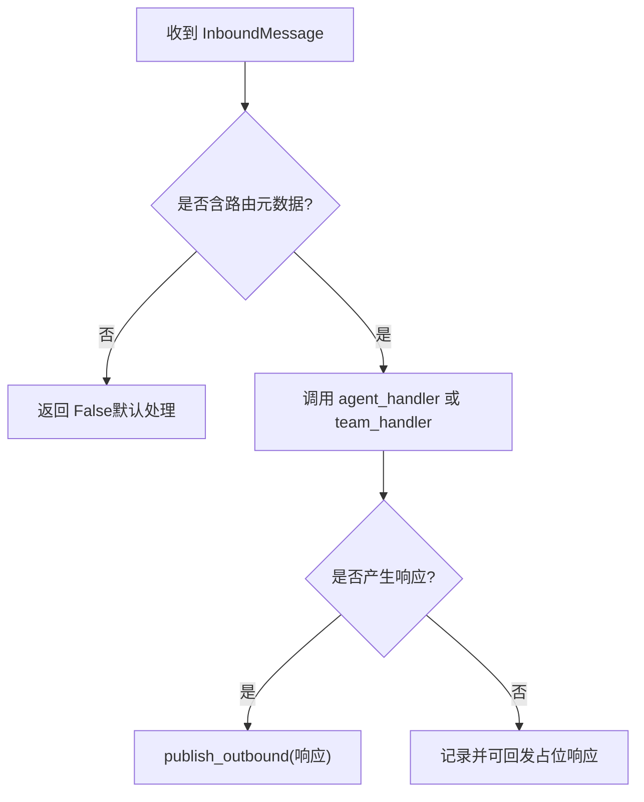
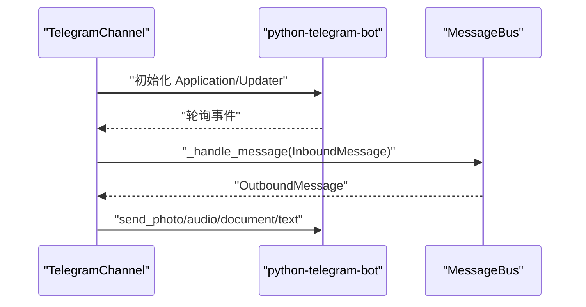
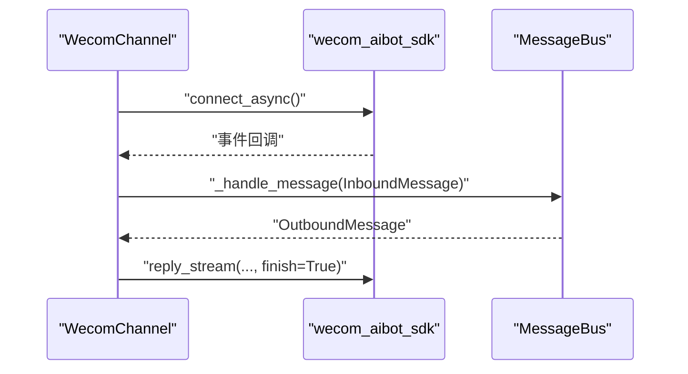
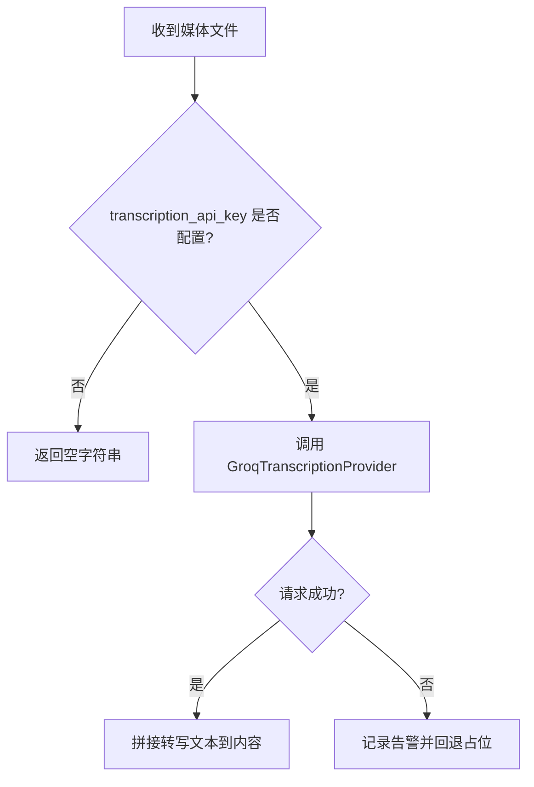
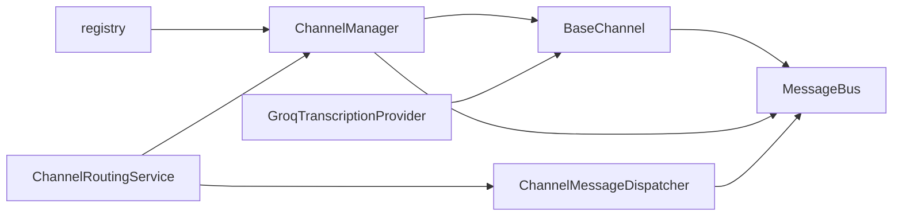

# 渠道基类架构

<cite>
**本文档引用的文件**
- [nanobot/channels/base.py](file://nanobot/channels/base.py)
- [nanobot/channels/registry.py](file://nanobot/channels/registry.py)
- [nanobot/channels/manager.py](file://nanobot/channels/manager.py)
- [nanobot/channels/dispatch.py](file://nanobot/channels/dispatch.py)
- [nanobot/channels/telegram.py](file://nanobot/channels/telegram.py)
- [nanobot/channels/wecom.py](file://nanobot/channels/wecom.py)
- [nanobot/bus/events.py](file://nanobot/bus/events.py)
- [nanobot/bus/queue.py](file://nanobot/bus/queue.py)
- [nanobot/config/schema.py](file://nanobot/config/schema.py)
- [nanobot/providers/transcription.py](file://nanobot/providers/transcription.py)
- [nanobot/web/runtime_services/channel_routing.py](file://nanobot/web/runtime_services/channel_routing.py)
- [nanobot/web/runtime_services/channel_runtime.py](file://nanobot/web/runtime_services/channel_runtime.py)
- [nanobot/channels/__init__.py](file://nanobot/channels/__init__.py)
- [tests/test_base_channel.py](file://tests/test_base_channel.py)
</cite>

## 目录
1. [简介](#简介)
2. [项目结构](#项目结构)
3. [核心组件](#核心组件)
4. [架构总览](#架构总览)
5. [详细组件分析](#详细组件分析)
6. [依赖分析](#依赖分析)
7. [性能考虑](#性能考虑)
8. [故障排查指南](#故障排查指南)
9. [结论](#结论)
10. [附录：扩展新渠道开发指南](#附录扩展新渠道开发指南)

## 简介
本文件系统性阐述 nanobot 渠道系统的基类架构，重点覆盖以下主题：
- BaseChannel 抽象基类的设计模式与通用接口
- 渠道注册机制与动态加载流程
- 统一配置管理与跨渠道共享能力（如语音转写）
- 渠道间共享功能实现（音频转写）、错误处理策略与性能监控机制
- 扩展新渠道的开发指南与最佳实践

## 项目结构
渠道系统位于 nanobot/channels 包中，采用“插件式”自动发现与动态加载机制，结合消息总线与路由服务，形成解耦的异步消息管道。

图表来源
- [nanobot/channels/base.py:15-135](file://nanobot/channels/base.py#L15-L135)
- [nanobot/channels/registry.py:15-36](file://nanobot/channels/registry.py#L15-L36)
- [nanobot/channels/manager.py:52-209](file://nanobot/channels/manager.py#L52-L209)
- [nanobot/channels/dispatch.py:13-93](file://nanobot/channels/dispatch.py#L13-L93)
- [nanobot/bus/queue.py:8-45](file://nanobot/bus/queue.py#L8-L45)
- [nanobot/bus/events.py:8-39](file://nanobot/bus/events.py#L8-L39)
- [nanobot/config/schema.py:213-229](file://nanobot/config/schema.py#L213-L229)
- [nanobot/web/runtime_services/channel_routing.py:23-73](file://nanobot/web/runtime_services/channel_routing.py#L23-L73)
- [nanobot/web/runtime_services/channel_runtime.py:31-382](file://nanobot/web/runtime_services/channel_runtime.py#L31-L382)

章节来源
- [nanobot/channels/__init__.py:1-7](file://nanobot/channels/__init__.py#L1-L7)

## 核心组件
- BaseChannel 抽象基类：定义渠道统一接口（启动、停止、发送），内置权限校验与消息封装入口；提供可选的音频转写能力。
- ChannelManager 渠道管理器：扫描可用渠道模块、按配置初始化实例、统一启动/停止、出站消息分发。
- ChannelMessageDispatcher 消息调度器：根据路由元数据将入站消息分派给具体代理或团队。
- MessageBus 异步消息总线：在渠道与代理之间解耦，提供入站/出站队列。
- ChannelRoutingService 路由服务：基于绑定规则解析目标（代理/团队）。
- 配置模型 ChannelsConfig/各渠道子配置：集中管理渠道开关、鉴权白名单、行为策略等。

章节来源
- [nanobot/channels/base.py:15-135](file://nanobot/channels/base.py#L15-L135)
- [nanobot/channels/manager.py:52-209](file://nanobot/channels/manager.py#L52-L209)
- [nanobot/channels/dispatch.py:13-93](file://nanobot/channels/dispatch.py#L13-L93)
- [nanobot/bus/queue.py:8-45](file://nanobot/bus/queue.py#L8-L45)
- [nanobot/bus/events.py:8-39](file://nanobot/bus/events.py#L8-L39)
- [nanobot/config/schema.py:213-229](file://nanobot/config/schema.py#L213-L229)
- [nanobot/web/runtime_services/channel_routing.py:23-73](file://nanobot/web/runtime_services/channel_routing.py#L23-L73)

## 架构总览
渠道系统通过“自动发现 + 动态导入”的方式加载各平台实现，所有渠道均继承自 BaseChannel 并遵循统一的消息契约。消息在 ChannelManager 的调度下进入 MessageBus，再由 ChannelMessageDispatcher 根据路由元数据分派到代理或团队执行，最终由对应渠道的 send 方法回传响应。

图表来源
- [nanobot/channels/telegram.py:553-666](file://nanobot/channels/telegram.py#L553-L666)
- [nanobot/channels/wecom.py:163-283](file://nanobot/channels/wecom.py#L163-L283)
- [nanobot/channels/dispatch.py:36-93](file://nanobot/channels/dispatch.py#L36-L93)
- [nanobot/channels/manager.py:160-190](file://nanobot/channels/manager.py#L160-L190)
- [nanobot/bus/events.py:8-39](file://nanobot/bus/events.py#L8-L39)

## 详细组件分析

### BaseChannel 抽象基类
- 设计要点
  - 使用抽象方法约束：start/stop/send，确保所有渠道具备一致生命周期与通信接口。
  - 内置权限控制：is_allowed 支持精确匹配与通配符策略，避免空白名单导致全拒。
  - 入站消息封装：_handle_message 将原始平台事件标准化为 InboundMessage，并注入会话键与元数据。
  - 可选音频转写：transcribe_audio 基于 Groq 提供的 Whisper 接口，失败时返回空字符串并记录告警。
- 生命周期
  - 初始化：接收配置与消息总线，标记运行状态。
  - 运行：start 作为长任务持续监听平台事件；stop 负责清理资源。
  - 发送：send 将 OutboundMessage 转换为平台特定格式并发送。
- 复杂度与性能
  - 权限检查为 O(n)（n 为允许列表长度），通常较小，影响可忽略。
  - 转写调用为外部同步 I/O，建议异步化或缓存结果以减少重复调用。

图表来源
- [nanobot/channels/base.py:15-135](file://nanobot/channels/base.py#L15-L135)

章节来源
- [nanobot/channels/base.py:15-135](file://nanobot/channels/base.py#L15-L135)

### 渠道注册机制与动态加载
- 自动发现
  - discover_channel_names 通过 pkgutil 遍历 channels 包，过滤内部模块与包，仅返回模块名。
- 动态导入
  - load_channel_class 导入模块后遍历属性，找到首个继承自 BaseChannel 的类并返回。
- 安全与健壮性
  - 若模块内无 BaseChannel 子类则抛出 ImportError，ChannelManager 在初始化阶段捕获并记录警告。
- 与配置联动
  - ChannelManager 按模块名查找对应配置段，若 enabled 为真才实例化该渠道。

图表来源
- [nanobot/channels/registry.py:15-36](file://nanobot/channels/registry.py#L15-L36)
- [nanobot/channels/manager.py:86-104](file://nanobot/channels/manager.py#L86-L104)

章节来源
- [nanobot/channels/registry.py:15-36](file://nanobot/channels/registry.py#L15-L36)
- [nanobot/channels/manager.py:86-104](file://nanobot/channels/manager.py#L86-L104)

### ChannelManager 渠道管理器
- 职责
  - 初始化：扫描并加载启用的渠道，注入统一的 Groq 转写密钥。
  - 启动：并发启动所有渠道，等待其成为守护进程。
  - 停止：取消出站分发任务并逐一停止渠道。
  - 出站分发：从总线消费出站消息，按 channel 字段路由至对应渠道实例。
  - 路由增强：当提供路由服务时，通过 _RoutingBusProxy 为入站消息注入路由元数据。
- 错误处理
  - 启动异常：捕获并记录错误，不中断其他渠道启动。
  - 发送异常：捕获并记录错误，继续处理后续消息。
  - 空 allowFrom 校验：若检测到空白名单直接终止启动流程，提示用户修正。
- 性能监控
  - 通过日志记录启动/停止、发送错误、未知渠道等关键事件，便于运维观察。

图表来源
- [nanobot/channels/manager.py:115-190](file://nanobot/channels/manager.py#L115-L190)
- [nanobot/channels/registry.py:26-36](file://nanobot/channels/registry.py#L26-L36)

章节来源
- [nanobot/channels/manager.py:52-209](file://nanobot/channels/manager.py#L52-L209)

### ChannelMessageDispatcher 消息调度器
- 功能
  - 从入站消息元数据提取目标类型与 ID，调用相应处理器（代理或团队）。
  - 若无目标元数据，返回 False 交由默认处理逻辑。
  - 异常时向消息总线回发错误提示。
- 与路由服务协作
  - 当 ChannelManager 使用 _RoutingBusProxy 时，消息已在进入总线前被增强，调度器直接执行。

图表来源
- [nanobot/channels/dispatch.py:36-93](file://nanobot/channels/dispatch.py#L36-L93)

章节来源
- [nanobot/channels/dispatch.py:13-93](file://nanobot/channels/dispatch.py#L13-L93)

### 渠道实现示例：TelegramChannel
- 特性
  - 长轮询模式，无需公网 IP；支持命令、文本、图片、语音、文档等多类型消息。
  - 消息拆分、Markdown 到 Telegram HTML 转换、媒体组聚合、打字指示、回复上下文维护。
  - 语音/音频转写：下载后调用 BaseChannel.transcribe_audio，失败时保留占位信息。
- 生命周期
  - start 初始化应用与连接池，注册命令与消息处理器，进入轮询循环。
  - stop 取消打字任务、关闭更新器与应用，释放资源。
- 安全与权限
  - is_allowed 支持“id|username”格式的兼容匹配，兼顾历史配置。

图表来源
- [nanobot/channels/telegram.py:199-281](file://nanobot/channels/telegram.py#L199-L281)
- [nanobot/channels/telegram.py:553-666](file://nanobot/channels/telegram.py#L553-L666)
- [nanobot/channels/telegram.py:294-413](file://nanobot/channels/telegram.py#L294-L413)

章节来源
- [nanobot/channels/telegram.py:150-736](file://nanobot/channels/telegram.py#L150-L736)

### 渠道实现示例：WecomChannel
- 特性
  - WebSocket 长连接，无需公网 IP；支持文本、图片、语音、文件、混合内容。
  - 去重缓存、欢迎语、帧头缓存用于回复；媒体下载与保存。
- 生命周期
  - start 建立客户端并注册事件回调，保持循环运行。
  - stop 断开连接并清理状态。
- 发送路径
  - 通过流式回复提升用户体验，完成后记录日志。

图表来源
- [nanobot/channels/wecom.py:51-97](file://nanobot/channels/wecom.py#L51-L97)
- [nanobot/channels/wecom.py:163-283](file://nanobot/channels/wecom.py#L163-L283)
- [nanobot/channels/wecom.py:322-354](file://nanobot/channels/wecom.py#L322-L354)

章节来源
- [nanobot/channels/wecom.py:28-354](file://nanobot/channels/wecom.py#L28-L354)

### 统一配置管理
- ChannelsConfig
  - 统一开关与行为参数：send_progress、send_tool_hints。
  - 各渠道子配置：token、allow_from、proxy、group_policy 等。
- ProviderConfig
  - 通用 API Key/Base/Headers 管理，ChannelManager 注入到渠道实例以支持转写。
- 配置验证
  - ChannelManager 在初始化阶段对空 allow_from 进行强制校验，防止误配置导致无法接收消息。

章节来源
- [nanobot/config/schema.py:213-229](file://nanobot/config/schema.py#L213-L229)
- [nanobot/config/schema.py:259-289](file://nanobot/config/schema.py#L259-L289)
- [nanobot/channels/manager.py:107-113](file://nanobot/channels/manager.py#L107-L113)

### 跨渠道共享功能：音频转写
- 共享点
  - BaseChannel.transcribe_audio 作为统一入口，使用 Groq Whisper API。
  - ChannelManager 将配置中的 Groq API Key 注入到每个渠道实例。
- 流程
  - 渠道在收到语音/音频媒体后触发转写，成功则将转写文本拼接到内容中，失败则记录告警并回退占位信息。
- 错误处理
  - API Key 缺失、文件不存在、网络异常均返回空字符串并记录日志，不影响主流程。

图表来源
- [nanobot/channels/base.py:39-50](file://nanobot/channels/base.py#L39-L50)
- [nanobot/providers/transcription.py:21-64](file://nanobot/providers/transcription.py#L21-L64)
- [nanobot/channels/manager.py:90-100](file://nanobot/channels/manager.py#L90-L100)

章节来源
- [nanobot/channels/base.py:39-50](file://nanobot/channels/base.py#L39-L50)
- [nanobot/providers/transcription.py:10-65](file://nanobot/providers/transcription.py#L10-L65)
- [nanobot/channels/manager.py:90-100](file://nanobot/channels/manager.py#L90-L100)

### 错误处理策略
- 渠道启动失败：ChannelManager 记录错误并继续启动其他渠道，避免单点故障。
- 发送失败：ChannelManager 捕获异常并记录，保证消息总线继续运转。
- 权限拒绝：BaseChannel._handle_message 记录告警并丢弃消息，提示用户在配置中添加 allow_from。
- 路由缺失：ChannelMessageDispatcher 返回 False，交由默认处理或回发错误提示。

章节来源
- [nanobot/channels/manager.py:115-121](file://nanobot/channels/manager.py#L115-L121)
- [nanobot/channels/manager.py:177-183](file://nanobot/channels/manager.py#L177-L183)
- [nanobot/channels/base.py:111-117](file://nanobot/channels/base.py#L111-L117)
- [nanobot/channels/dispatch.py:63-74](file://nanobot/channels/dispatch.py#L63-L74)

### 性能监控机制
- 日志驱动
  - 启动/停止、发送错误、未知渠道、转写失败等关键事件均通过日志输出，便于集中采集与分析。
- 队列指标
  - MessageBus 暴露入站/出站队列长度，可用于观测积压情况。
- 运行时隔离
  - WebChannelRuntimeService 在独立线程与事件循环中运行，避免阻塞 Web 服务器事件循环。

章节来源
- [nanobot/bus/queue.py:37-44](file://nanobot/bus/queue.py#L37-L44)
- [nanobot/web/runtime_services/channel_runtime.py:48-98](file://nanobot/web/runtime_services/channel_runtime.py#L48-L98)

## 依赖分析
- 组件耦合
  - BaseChannel 仅依赖消息总线与事件模型，耦合度低，便于扩展。
  - ChannelManager 依赖 registry、config、bus 与路由服务，承担协调职责。
  - 渠道实现依赖各自平台 SDK，但对外暴露统一接口。
- 外部依赖
  - 渠道实现依赖第三方 SDK（如 telegram、wecom_aibot_sdk）。
  - 转写依赖 Groq API，需配置 API Key。
- 循环依赖
  - 未见循环导入；模块间通过接口契约交互。

图表来源
- [nanobot/channels/base.py:15-135](file://nanobot/channels/base.py#L15-L135)
- [nanobot/channels/registry.py:26-36](file://nanobot/channels/registry.py#L26-L36)
- [nanobot/channels/manager.py:52-209](file://nanobot/channels/manager.py#L52-L209)
- [nanobot/channels/dispatch.py:13-93](file://nanobot/channels/dispatch.py#L13-L93)
- [nanobot/web/runtime_services/channel_routing.py:23-73](file://nanobot/web/runtime_services/channel_routing.py#L23-L73)
- [nanobot/providers/transcription.py:10-65](file://nanobot/providers/transcription.py#L10-L65)

章节来源
- [nanobot/channels/base.py:15-135](file://nanobot/channels/base.py#L15-L135)
- [nanobot/channels/registry.py:15-36](file://nanobot/channels/registry.py#L15-L36)
- [nanobot/channels/manager.py:52-209](file://nanobot/channels/manager.py#L52-L209)
- [nanobot/channels/dispatch.py:13-93](file://nanobot/channels/dispatch.py#L13-L93)
- [nanobot/web/runtime_services/channel_routing.py:23-73](file://nanobot/web/runtime_services/channel_routing.py#L23-L73)
- [nanobot/providers/transcription.py:10-65](file://nanobot/providers/transcription.py#L10-L65)

## 性能考虑
- 并发与异步
  - ChannelManager 并发启动渠道，出站分发使用超时轮询，避免阻塞。
  - WebChannelRuntimeService 在独立事件循环中运行，降低对主线程的影响。
- I/O 优化
  - 渠道实现中尽量复用连接池（如 Telegram 的 HTTPXRequest），减少连接建立开销。
  - 媒体下载后进行转写，避免重复下载与转写。
- 资源回收
  - stop 中取消任务、关闭连接、清理缓存，防止资源泄漏。
- 队列背压
  - 通过队列长度与日志观察积压，必要时增加消费者或降载。

## 故障排查指南
- 渠道无法启动
  - 检查配置 enabled 与必要字段（如 token、bot_id/secret）。
  - 查看 ChannelManager 启动日志中的错误堆栈。
- 无消息响应
  - 确认 allow_from 配置非空且包含有效值；BaseChannel 会在空白名单时拒绝所有访问。
  - 检查路由服务是否正确解析绑定，查看 _RoutingBusProxy 注入的元数据。
- 发送失败
  - 查看 ChannelManager 的发送异常日志；确认渠道 SDK 的认证与网络连通性。
- 转写失败
  - 确认 Groq API Key 已配置；检查音频文件是否存在与可读。

章节来源
- [nanobot/channels/manager.py:115-121](file://nanobot/channels/manager.py#L115-L121)
- [nanobot/channels/manager.py:177-183](file://nanobot/channels/manager.py#L177-L183)
- [nanobot/channels/base.py:80-87](file://nanobot/channels/base.py#L80-L87)
- [nanobot/providers/transcription.py:31-38](file://nanobot/providers/transcription.py#L31-L38)

## 结论
该架构以 BaseChannel 为核心，通过自动发现与动态加载实现渠道扩展，借助 ChannelManager 与 MessageBus 解耦渠道与代理，配合路由服务实现灵活的目标分派。统一的配置模型与跨渠道共享能力（如转写）提升了可维护性与一致性。建议在扩展新渠道时严格遵循统一接口、完善权限与错误处理，并关注并发与资源回收。

## 附录：扩展新渠道开发指南
- 开发步骤
  - 新建模块：在 nanobot/channels 下新增 mychannel.py。
  - 实现类：继承 BaseChannel，实现 start/stop/send，设置 name/display_name。
  - 配置：在 config/schema.py 中新增 MyChannelConfig，并加入 ChannelsConfig。
  - 注册：无需手动注册，registry 会自动发现模块并加载类。
  - 单测：参考 tests/test_base_channel.py，编写最小可运行用例。
- 最佳实践
  - 生命周期：start 应为长任务，stop 必须清理所有资源与任务。
  - 权限：遵循 BaseChannel.is_allowed 策略，避免空 allow_from。
  - 错误：捕获并记录异常，必要时回发错误消息。
  - 性能：复用连接池、限制并发、及时取消任务、避免阻塞。
  - 转写：如涉及语音/音频，优先复用 BaseChannel.transcribe_audio。
  - 路由：若需要绑定到代理/团队，确保消息元数据包含路由键，或使用 _RoutingBusProxy 增强。
- 参考实现
  - TelegramChannel：多类型消息、媒体组聚合、Markdown 转换、转写集成。
  - WecomChannel：WebSocket 长连接、去重与欢迎语、流式回复。

章节来源
- [nanobot/channels/telegram.py:150-736](file://nanobot/channels/telegram.py#L150-L736)
- [nanobot/channels/wecom.py:28-354](file://nanobot/channels/wecom.py#L28-L354)
- [nanobot/config/schema.py:213-229](file://nanobot/config/schema.py#L213-L229)
- [tests/test_base_channel.py:8-26](file://tests/test_base_channel.py#L8-L26)