# 渠道实现

<cite>
**本文档引用的文件**
- [channels/__init__.py](file://nanobot/channels/__init__.py)
- [channels/base.py](file://nanobot/channels/base.py)
- [channels/manager.py](file://nanobot/channels/manager.py)
- [channels/registry.py](file://nanobot/channels/registry.py)
- [channels/dispatch.py](file://nanobot/channels/dispatch.py)
- [channels/telegram.py](file://nanobot/channels/telegram.py)
- [channels/whatsapp.py](file://nanobot/channels/whatsapp.py)
- [channels/discord.py](file://nanobot/channels/discord.py)
- [channels/slack.py](file://nanobot/channels/slack.py)
- [channels/feishu.py](file://nanobot/channels/feishu.py)
- [channels/dingtalk.py](file://nanobot/channels/dingtalk.py)
- [channels/matrix.py](file://nanobot/channels/matrix.py)
- [channels/qq.py](file://nanobot/channels/qq.py)
- [channels/wecom.py](file://nanobot/channels/wecom.py)
- [channels/email.py](file://nanobot/channels/email.py)
</cite>

## 目录
1. [简介](#简介)
2. [项目结构](#项目结构)
3. [核心组件](#核心组件)
4. [架构总览](#架构总览)
5. [详细组件分析](#详细组件分析)
6. [依赖分析](#依赖分析)
7. [性能考虑](#性能考虑)
8. [故障排除指南](#故障排除指南)
9. [结论](#结论)

## 简介
本文件系统性梳理 nanobot 的多渠道聊天实现，覆盖 Telegram、WhatsApp、Discord、Slack、飞书（Feishu）、钉钉（DingTalk）、Matrix、QQ、企业微信（WeCom）、Email、Mochat 等渠道。文档从架构设计、消息处理机制、认证与配置、特殊功能、错误处理、性能与限制等方面进行深入解析，并提供可操作的集成步骤与排障建议。

## 项目结构
- 渠道模块采用插件化自动发现：通过包扫描动态加载各渠道类，无需硬编码注册表。
- 渠道统一继承自抽象基类，遵循一致的生命周期（start/stop/send）与消息入口（_handle_message）。
- ChannelManager 负责初始化、启动/停止所有启用的渠道，并驱动出站消息分发。
- 可选的路由增强：通过路由代理在入站消息中注入目标类型/ID等元数据，便于后续调度。

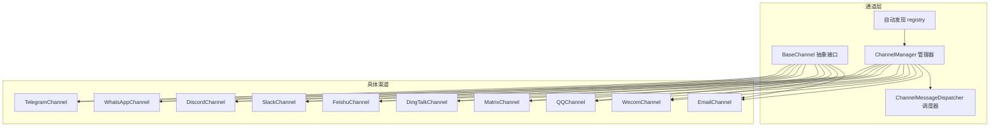

图表来源
- [channels/registry.py:15-36](file://nanobot/channels/registry.py#L15-L36)
- [channels/manager.py:86-105](file://nanobot/channels/manager.py#L86-L105)
- [channels/base.py:15-135](file://nanobot/channels/base.py#L15-L135)

章节来源
- [channels/__init__.py:1-7](file://nanobot/channels/__init__.py#L1-L7)
- [channels/registry.py:15-36](file://nanobot/channels/registry.py#L15-L36)
- [channels/manager.py:52-209](file://nanobot/channels/manager.py#L52-L209)
- [channels/dispatch.py:13-93](file://nanobot/channels/dispatch.py#L13-L93)

## 核心组件
- BaseChannel：定义统一接口与通用能力（权限校验、入站消息封装、音频转写、运行状态等）。
- ChannelManager：集中管理渠道生命周期、出站分发、可选路由增强。
- ChannelMessageDispatcher：基于路由元数据将入站消息分派到指定 Agent/Team。
- 自动发现：通过 pkgutil 扫描 channels 包中的模块，动态加载实现类。

章节来源
- [channels/base.py:15-135](file://nanobot/channels/base.py#L15-L135)
- [channels/manager.py:52-209](file://nanobot/channels/manager.py#L52-L209)
- [channels/dispatch.py:13-93](file://nanobot/channels/dispatch.py#L13-L93)
- [channels/registry.py:15-36](file://nanobot/channels/registry.py#L15-L36)

## 架构总览
下图展示从渠道到消息总线、再到调度与执行的整体链路，以及可选的路由增强与媒体处理。

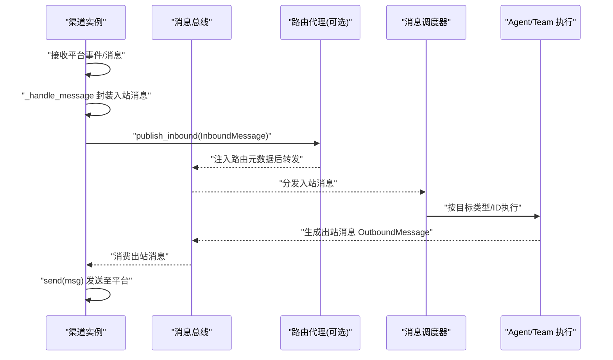

图表来源
- [channels/manager.py:38-47](file://nanobot/channels/manager.py#L38-L47)
- [channels/dispatch.py:36-93](file://nanobot/channels/dispatch.py#L36-L93)
- [channels/base.py:89-130](file://nanobot/channels/base.py#L89-L130)

## 详细组件分析

### Telegram 渠道
- 认证与连接
  - 使用长轮询模式，无需公网 IP；支持代理配置。
  - 注册 bot 命令菜单，提供 /start、/new、/stop、/help。
- 权限控制
  - 允许列表支持 legacy 格式“用户ID|用户名”匹配。
- 消息处理
  - 文本、图片、语音、音频、文档均支持；语音/音频可触发转写。
  - 支持话题线程（forum topic）会话键派生，实现主题级会话隔离。
  - 支持媒体组聚合（media group）延迟合并为一次对话回合。
  - 支持回复引用（reply_to_message），并维护消息线程映射。
- 出站发送
  - 文本以 HTML 安全渲染；支持进度流式模拟与最终持久化。
  - 多媒体按类型分别发送（photo/voice/audio/document）。
- 特殊功能
  - 群组策略：开放、提及或回复 bot 时响应；私聊始终响应。
  - 输入提示（typing）周期性发送，保持交互体验。
- 配置要点
  - 必填：bot token；可选：proxy、group_policy、reply_to_message。
  - 媒体目录由 get_media_dir 提供，用于下载/缓存媒体文件。
- 错误处理
  - 轮询错误统一记录；媒体下载失败时附加占位提示。
- 性能与限制
  - 连接池大小与超时参数优化长时间运行稳定性。
  - 单条消息最大长度限制，超出需切片发送。

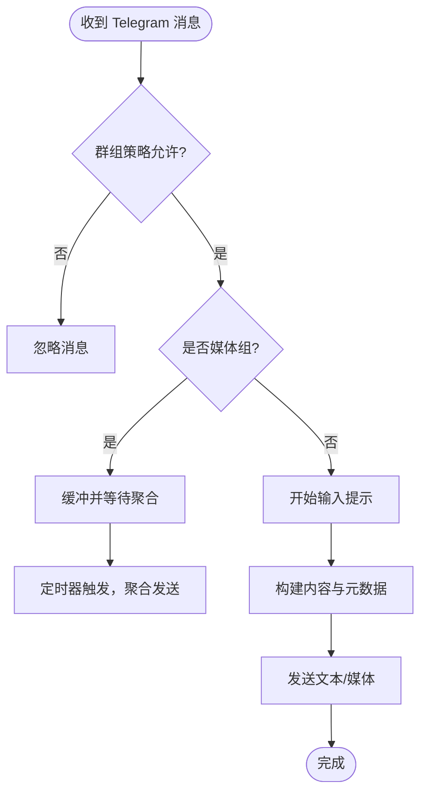

图表来源
- [channels/telegram.py:501-527](file://nanobot/channels/telegram.py#L501-L527)
- [channels/telegram.py:668-683](file://nanobot/channels/telegram.py#L668-L683)
- [channels/telegram.py:696-706](file://nanobot/channels/telegram.py#L696-L706)

章节来源
- [channels/telegram.py:150-736](file://nanobot/channels/telegram.py#L150-L736)

### WhatsApp 渠道（Node.js 桥）
- 认证与连接
  - 通过 WebSocket 与 Node.js 桥通信；可选鉴权 token。
  - 支持断线重连与连接状态上报。
- 消息处理
  - 解析桥侧 JSON 消息，提取 sender、content、id、时间戳、是否群聊等。
  - 去重队列防止重复处理；支持媒体路径标记（镜像/文件）。
  - 语音消息当前不直接下载，保留占位提示。
- 出站发送
  - 通过 WebSocket 发送“send”指令到桥侧。
- 配置要点
  - 必填：bridge_url；可选：bridge_token。
- 错误处理
  - 桥侧 JSON 解析失败、连接异常、状态变化均有日志记录。
- 性能与限制
  - 依赖桥侧协议栈；Python 侧仅负责消息编解码与转发。

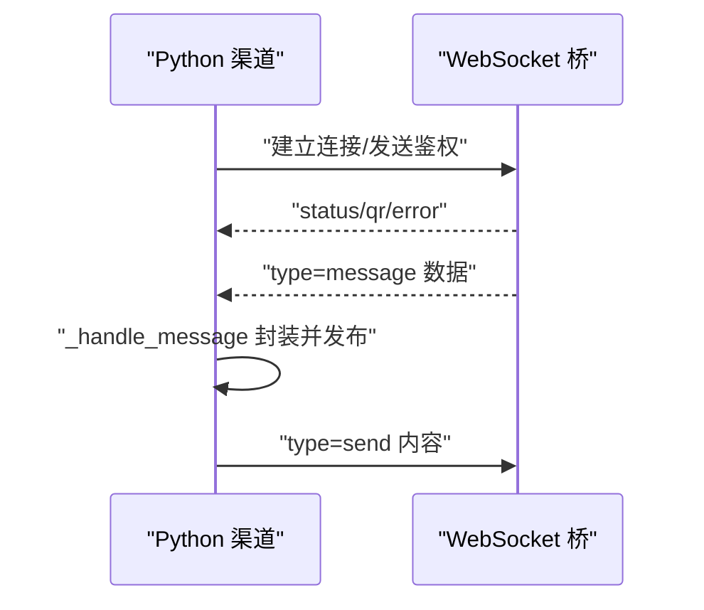

图表来源
- [channels/whatsapp.py:34-80](file://nanobot/channels/whatsapp.py#L34-L80)
- [channels/whatsapp.py:97-172](file://nanobot/channels/whatsapp.py#L97-L172)

章节来源
- [channels/whatsapp.py:16-172](file://nanobot/channels/whatsapp.py#L16-L172)

### Discord 渠道
- 认证与连接
  - 使用 Gateway WebSocket；鉴权后进入 READY，随后心跳与事件循环。
  - 支持意图（intents）配置，确保能接收所需事件。
- 消息处理
  - 过滤机器人自身消息；支持群组策略（开放/提及/白名单）。
  - 下载附件到本地媒体目录，超过大小限制则提示。
  - 支持回复引用（message_reference）与提及清理。
- 出站发送
  - 先上传附件（multipart/form-data），再发送文本；支持分片发送。
  - 速率限制自动重试（429 retry-after）。
- 配置要点
  - 必填：bot token、gateway_url；可选：intents、group_policy。
- 错误处理
  - 速率限制、网络异常、下载失败均有日志与降级提示。
- 性能与限制
  - 附件最大 20MB；消息最大 2000 字符；需注意带宽与并发。

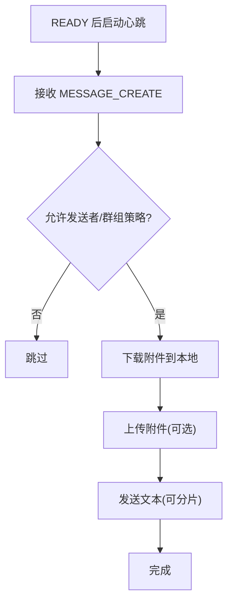

图表来源
- [channels/discord.py:192-234](file://nanobot/channels/discord.py#L192-L234)
- [channels/discord.py:270-332](file://nanobot/channels/discord.py#L270-L332)
- [channels/discord.py:79-143](file://nanobot/channels/discord.py#L79-L143)

章节来源
- [channels/discord.py:24-378](file://nanobot/channels/discord.py#L24-L378)

### Slack 渠道
- 认证与连接
  - 使用 Socket Mode；需要 bot_token 与 app_token。
  - 连接后立即解析 bot 用户 ID，用于提及识别。
- 消息处理
  - 避免重复事件（app_mention 与 message 同时到达）；优先 app_mention。
  - 支持 DM、群组、频道；群组策略支持开放、提及、白名单。
  - 可选在回复线程中继续对话（thread_ts）。
  - 添加反应（reactions_add）作为“已读”提示。
- 出站发送
  - 文本使用 mrkdwn；文件通过 files_upload_v2。
  - 支持线程回复与媒体上传。
- 配置要点
  - 必填：bot_token、app_token；可选：mode(socket)、group_policy、dm 策略。
- 错误处理
  - 连接关闭、发送失败、反应添加失败均有日志。
- 性能与限制
  - 依赖 Slack API 限额；线程与媒体上传需注意并发。

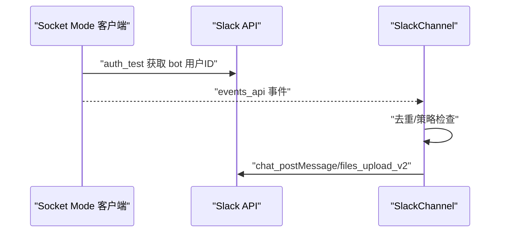

图表来源
- [channels/slack.py:33-65](file://nanobot/channels/slack.py#L33-L65)
- [channels/slack.py:109-202](file://nanobot/channels/slack.py#L109-L202)
- [channels/slack.py:76-108](file://nanobot/channels/slack.py#L76-L108)

章节来源
- [channels/slack.py:20-282](file://nanobot/channels/slack.py#L20-L282)

### 飞书（Feishu）渠道
- 认证与连接
  - 依赖 lark-oapi SDK；使用 WebSocket 长连接接收事件。
  - 支持事件订阅（im.message.receive_v1）与可选扩展事件。
- 消息处理
  - 支持富文本（post）、交互卡片（interactive）、图片、音频、文件等。
  - 交互卡片与富文本内容抽取与转换，支持表格、链接、标题等。
  - 媒体下载/上传（image/file），音频转写。
- 出站发送
  - 自动检测内容格式（text/post/interactive），选择最优发送方式。
  - 卡片内表格限制：每张卡片最多一个表格，必要时拆分为多条消息。
- 配置要点
  - 必填：app_id、app_secret；可选：encrypt_key、verification_token。
- 错误处理
  - SDK 事件回调、下载/上传失败均有日志与降级提示。
- 性能与限制
  - 卡片表格数量限制；富文本与交互卡片渲染成本较高。

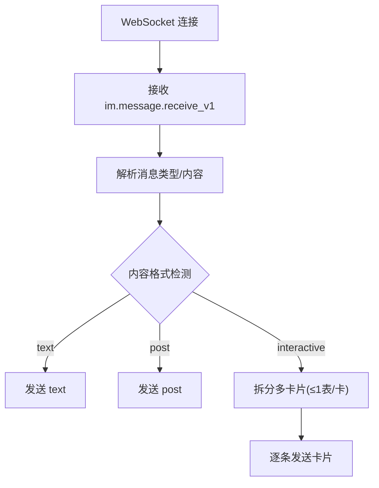

图表来源
- [channels/feishu.py:264-343](file://nanobot/channels/feishu.py#L264-L343)
- [channels/feishu.py:526-563](file://nanobot/channels/feishu.py#L526-L563)
- [channels/feishu.py:794-800](file://nanobot/channels/feishu.py#L794-L800)

章节来源
- [channels/feishu.py:234-981](file://nanobot/channels/feishu.py#L234-L981)

### 钉钉（DingTalk）渠道
- 认证与连接
  - 使用 Stream Mode；WebSocket 接收事件；HTTP API 发送消息。
  - 自动刷新 access_token；支持断线重连。
- 消息处理
  - 支持私聊与群聊；群聊 chat_id 带“group:”前缀以便回注。
  - 语音/图片/视频/文件等媒体下载与上传；AMR/MP3 等格式识别。
- 出站发送
  - Markdown/图片/文件三类消息模板；支持批量发送。
  - URL 直发优先，失败回退上传后再发。
- 配置要点
  - 必填：client_id、client_secret；可选：群组策略。
- 错误处理
  - 令牌刷新失败、上传/发送 API 返回非 0 错误码均有日志。
- 性能与限制
  - 上传大小与类型限制；并发发送需注意 API 限额。

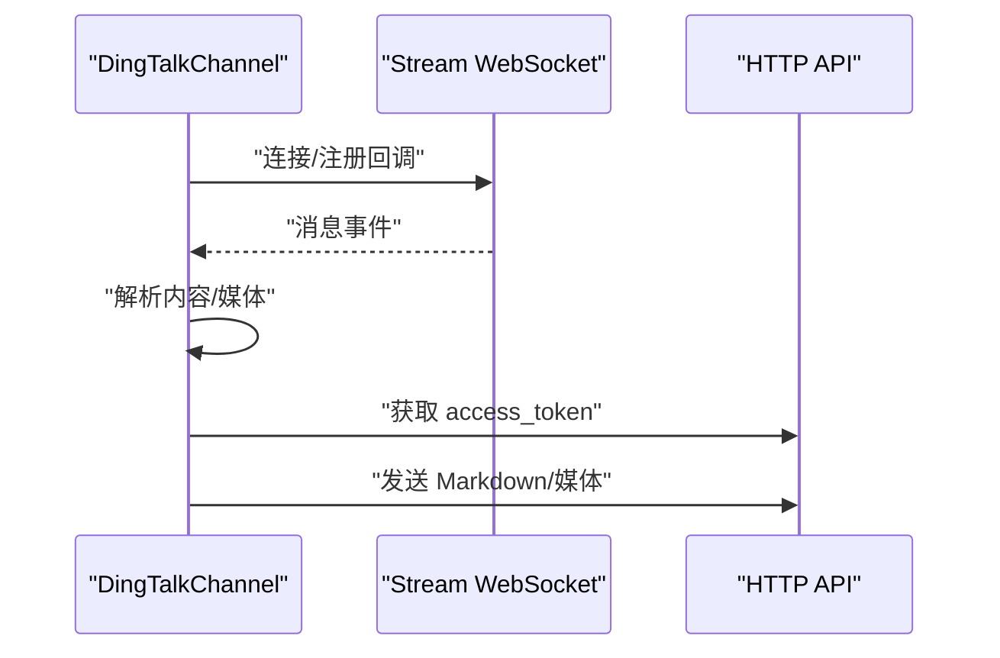

图表来源
- [channels/dingtalk.py:135-177](file://nanobot/channels/dingtalk.py#L135-L177)
- [channels/dingtalk.py:424-445](file://nanobot/channels/dingtalk.py#L424-L445)

章节来源
- [channels/dingtalk.py:105-475](file://nanobot/channels/dingtalk.py#L105-L475)

### Matrix 渠道
- 认证与连接
  - 使用 matrix-nio SDK；长轮询同步；支持 E2EE。
  - 自动桥接 nio 日志到 loguru。
- 消息处理
  - 支持明文与加密媒体；自动解密并落盘。
  - 支持线程回复（thread）元数据；安全清洗 HTML。
- 出站发送
  - 文本渲染为 HTML；媒体上传后发送；支持 relates_to 关联。
  - 输入提示周期刷新，避免过期。
- 配置要点
  - 必填：homeserver、user_id、access_token、device_id；可选：E2EE、上传限制。
- 错误处理
  - 同步/加入/发送错误分级记录；认证错误视为致命。
- 性能与限制
  - 服务器上传限制与本地配置取最小值；加密媒体传输成本高。

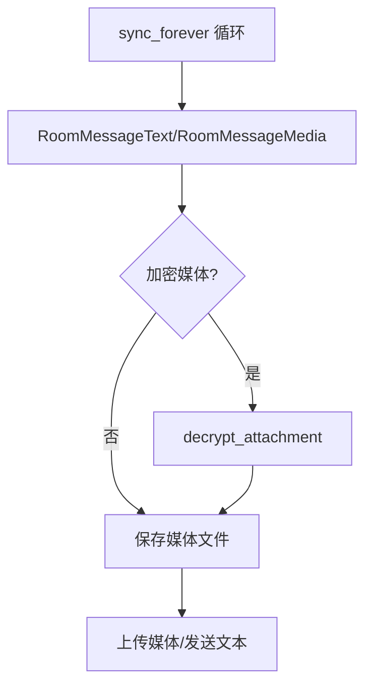

图表来源
- [channels/matrix.py:448-456](file://nanobot/channels/matrix.py#L448-L456)
- [channels/matrix.py:674-706](file://nanobot/channels/matrix.py#L674-L706)
- [channels/matrix.py:352-382](file://nanobot/channels/matrix.py#L352-L382)

章节来源
- [channels/matrix.py:146-706](file://nanobot/channels/matrix.py#L146-L706)

### QQ 渠道
- 认证与连接
  - 使用 botpy SDK；WebSocket 接收 C2C/群组/频道消息。
  - 自动重连；禁用 SDK 默认文件日志。
- 消息处理
  - 去重队列；区分群组与好友场景；缓存聊天类型。
- 出站发送
  - Markdown 内容通过群/好友接口发送；维护消息序号避免去重。
- 配置要点
  - 必填：app_id、secret；可选：群组策略。
- 错误处理
  - 连接异常与发送异常均有日志；自动重连。
- 性能与限制
  - 依赖 QQ 平台 API 限额；消息去重与序号管理重要。

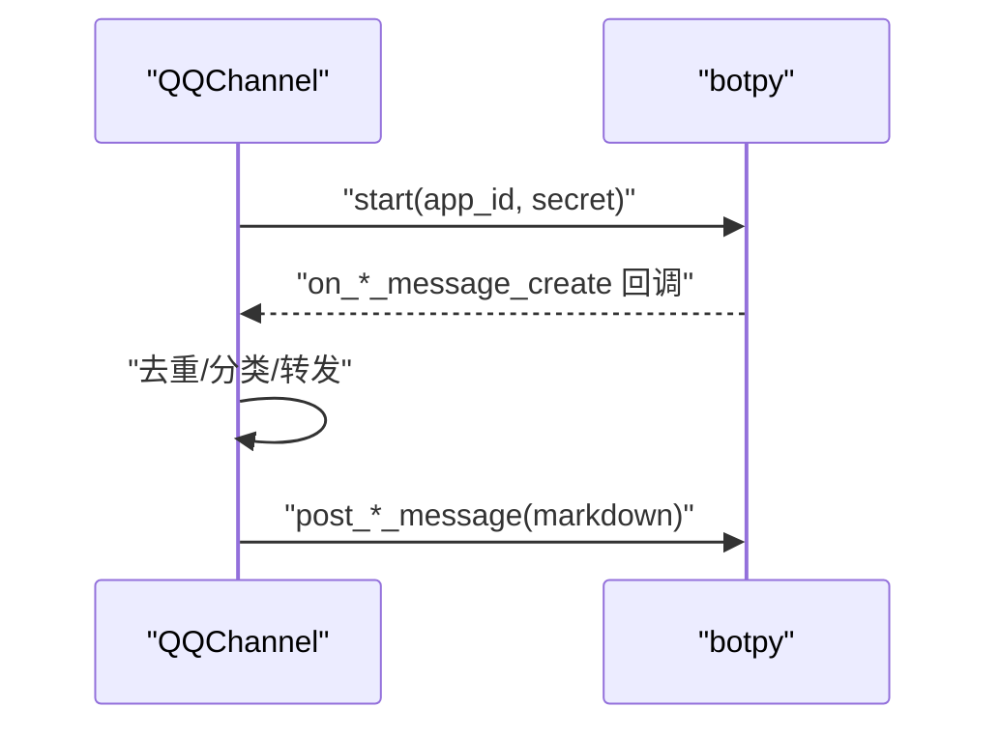

图表来源
- [channels/qq.py:67-103](file://nanobot/channels/qq.py#L67-L103)
- [channels/qq.py:133-162](file://nanobot/channels/qq.py#L133-L162)

章节来源
- [channels/qq.py:53-162](file://nanobot/channels/qq.py#L53-L162)

### 企业微信（WeCom）渠道
- 认证与连接
  - 使用 wecom_aibot_sdk；WebSocket 长连接；自动重连。
- 消息处理
  - 支持文本、图片、语音、文件、混合内容；AES 加密媒体下载。
  - 存储帧信息用于回复；去重缓存。
- 出站发送
  - 使用流式回复（reply_stream）提升交互体验。
- 配置要点
  - 必填：bot_id、secret；可选：欢迎语。
- 错误处理
  - 连接/认证/错误事件均有日志；下载失败有占位提示。
- 性能与限制
  - 流式回复适合长文本；媒体下载需注意带宽与存储。

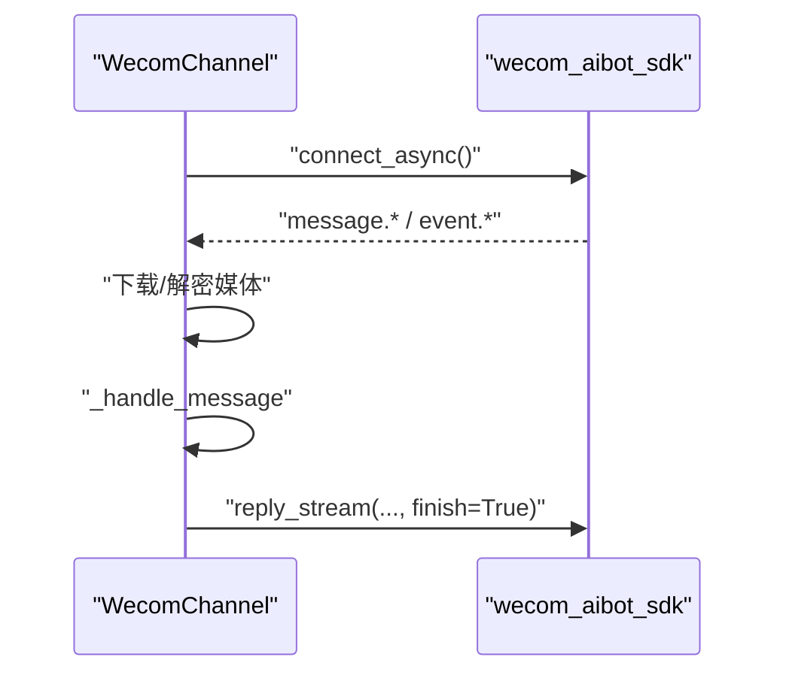

图表来源
- [channels/wecom.py:51-97](file://nanobot/channels/wecom.py#L51-L97)
- [channels/wecom.py:163-287](file://nanobot/channels/wecom.py#L163-L287)
- [channels/wecom.py:322-354](file://nanobot/channels/wecom.py#L322-L354)

章节来源
- [channels/wecom.py:28-354](file://nanobot/channels/wecom.py#L28-L354)

### Email 渠道
- 认证与连接
  - IMAP 轮询未读邮件；SMTP 发送回复。
  - 需显式同意（consent_granted）方可启用。
- 消息处理
  - 解析 From/Subject/Date/Message-ID；提取纯文本正文。
  - 维护最近主题与 Message-ID，用于智能回复。
- 出站发送
  - 自动设置 In-Reply-To/References；支持强制发送与主题覆盖。
  - 支持 SSL/TLS 与 STARTTLS。
- 配置要点
  - 必填：IMAP/SMTP 主机、用户名、密码；可选：自动回复开关、轮询间隔、最大正文长度。
- 错误处理
  - 轮询异常、发送异常均有日志；未授权/配置缺失明确提示。
- 性能与限制
  - 轮询频率受网络与服务端限制；历史查询支持日期范围检索。

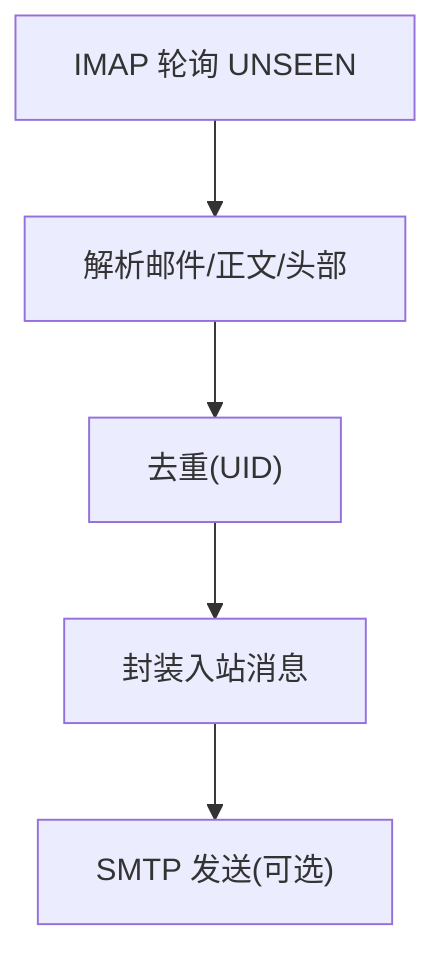

图表来源
- [channels/email.py:62-101](file://nanobot/channels/email.py#L62-L101)
- [channels/email.py:106-153](file://nanobot/channels/email.py#L106-L153)
- [channels/email.py:227-324](file://nanobot/channels/email.py#L227-L324)

章节来源
- [channels/email.py:25-410](file://nanobot/channels/email.py#L25-L410)

### Mochat 渠道
- 说明
  - 仓库中未发现独立的 mochat.py 实现文件；如需对接，请参考现有渠道实现模式，补充相应适配层与认证流程。
  - 建议复用 BaseChannel 接口，实现 start/stop/send 与消息封装逻辑。

[本节为概念性说明，不直接分析具体源码文件]

## 依赖分析
- 渠道与总线
  - 所有渠道通过 MessageBus 发布入站、消费出站；ChannelManager 统一调度。
- 路由增强
  - 当提供路由服务时，ChannelManager 注入路由代理，向入站消息注入目标类型/ID 等元数据。
- 自动发现
  - registry 动态扫描 channels 包，过滤内部模块与包，加载实现类。

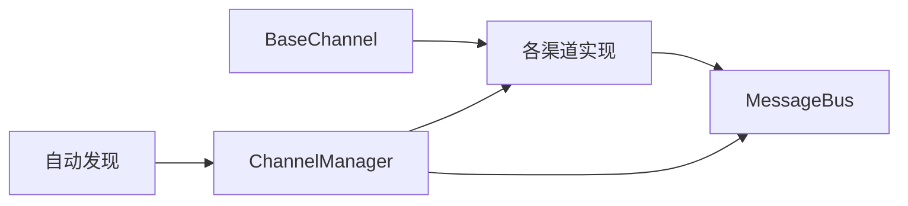

图表来源
- [channels/registry.py:15-36](file://nanobot/channels/registry.py#L15-L36)
- [channels/manager.py:86-105](file://nanobot/channels/manager.py#L86-L105)

章节来源
- [channels/registry.py:15-36](file://nanobot/channels/registry.py#L15-L36)
- [channels/manager.py:52-209](file://nanobot/channels/manager.py#L52-L209)

## 性能考虑
- 连接与轮询
  - 长连接（Telegram/WhatsApp/Discord/Slack/Feishu/Matrix/WeCom/QQ）优于轮询，减少延迟与资源消耗。
  - IMAP 轮询（Email）应合理设置间隔，避免频繁登录。
- 媒体处理
  - 下载/上传媒体需考虑带宽与存储；对大文件进行尺寸校验与分片发送。
  - 加密媒体（Matrix）解密与 IO 成本较高，建议缓存与复用。
- 速率限制
  - Discord/Slack/钉钉等平台存在速率限制，需实现指数退避与重试。
- 会话与线程
  - 利用线程/话题/会话键实现上下文连续性，减少重复信息传输。

[本节提供通用指导，不直接分析具体源码文件]

## 故障排除指南
- 渠道无法启动
  - 检查必填配置项（token/app_id/secret 等）与网络可达性。
  - 查看对应 SDK/依赖安装情况（如 Feishu、Matrix、DingTalk、QQ）。
- 消息未送达
  - 确认 allow_from 白名单配置；检查群组策略与提及/回复条件。
  - 对于 Discord/Slack/钉钉，关注 429 与 API 错误码。
- 媒体发送失败
  - 检查大小限制与类型映射；尝试直链/上传回退策略。
  - Matrix 加密媒体需确认 E2EE 开启与密钥可用。
- 重复消息/去重问题
  - 核对去重缓存与消息 ID；调整缓存容量与淘汰策略。
- 转写/翻译不可用
  - 确认 Groq API Key 已配置；检查网络与服务可用性。

章节来源
- [channels/telegram.py:180-198](file://nanobot/channels/telegram.py#L180-L198)
- [channels/discord.py:122-143](file://nanobot/channels/discord.py#L122-L143)
- [channels/slack.py:109-122](file://nanobot/channels/slack.py#L109-L122)
- [channels/dingtalk.py:189-215](file://nanobot/channels/dingtalk.py#L189-L215)
- [channels/matrix.py:595-606](file://nanobot/channels/matrix.py#L595-L606)
- [channels/wecom.py:288-321](file://nanobot/channels/wecom.py#L288-L321)
- [channels/email.py:106-153](file://nanobot/channels/email.py#L106-L153)

## 结论
本项目通过统一的抽象接口与插件化架构，实现了多平台聊天渠道的一致接入与扩展。各渠道在认证、消息处理、媒体与线程支持、错误处理与性能优化方面各有侧重，但共同遵循“入站封装—路由增强—执行—出站发送”的标准流程。建议在生产环境中结合平台限制与业务需求，合理配置策略与资源，持续监控与迭代。