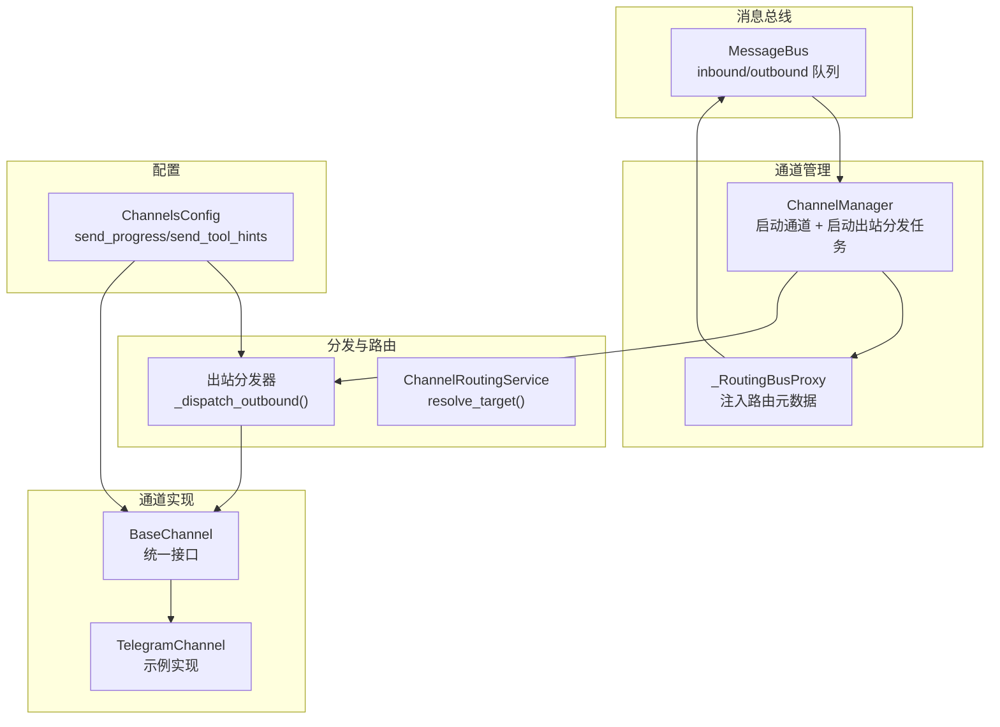
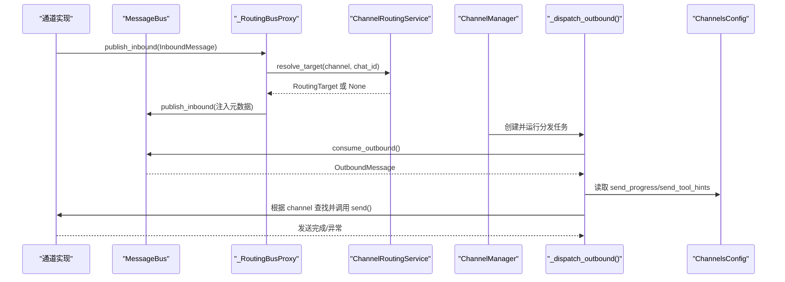
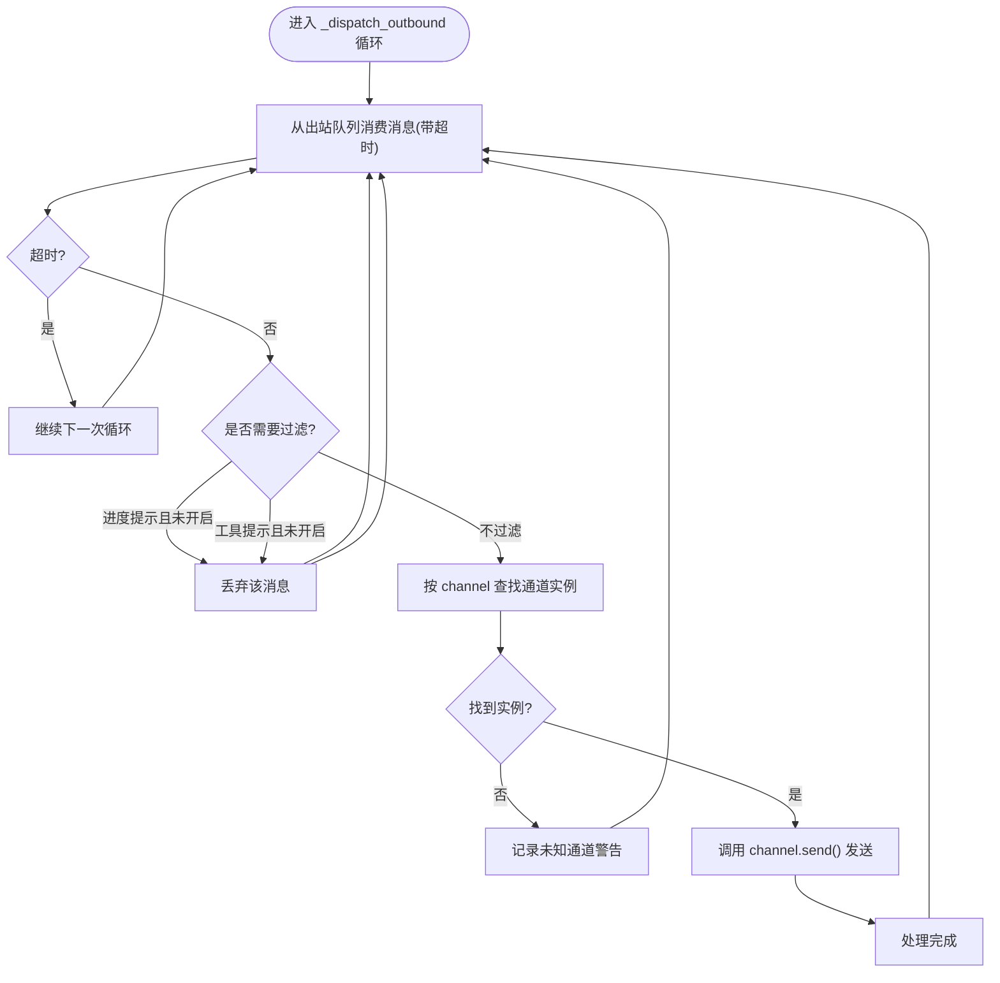
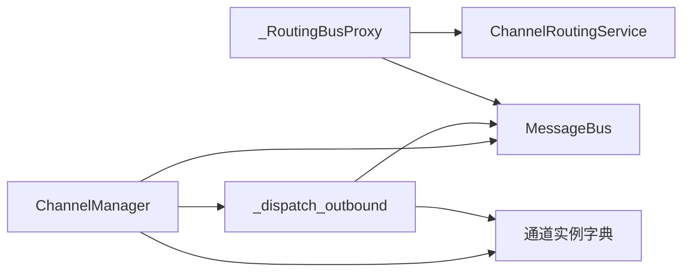
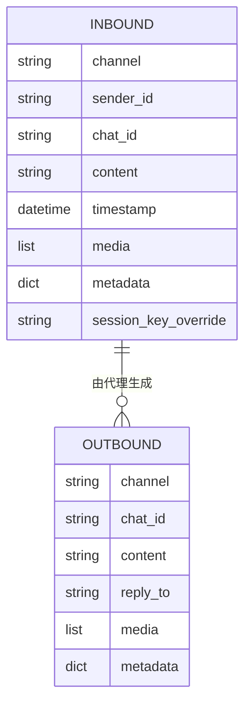
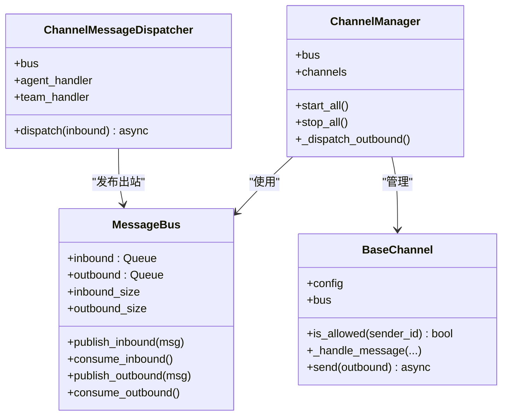

# 出站消息分发器

<cite>
**本文引用的文件**
- [nanobot/channels/dispatch.py](file://nanobot/channels/dispatch.py)
- [nanobot/channels/manager.py](file://nanobot/channels/manager.py)
- [nanobot/bus/queue.py](file://nanobot/bus/queue.py)
- [nanobot/bus/events.py](file://nanobot/bus/events.py)
- [nanobot/channels/base.py](file://nanobot/channels/base.py)
- [nanobot/web/runtime_services/channel_routing.py](file://nanobot/web/runtime_services/channel_routing.py)
- [nanobot/config/schema.py](file://nanobot/config/schema.py)
- [tests/test_channel_dispatch.py](file://tests/test_channel_dispatch.py)
- [tests/test_channel_routing_e2e.py](file://tests/test_channel_routing_e2e.py)
- [nanobot/channels/telegram.py](file://nanobot/channels/telegram.py)
- [nanobot/agent/tools/message.py](file://nanobot/agent/tools/message.py)
- [nanobot/web/channels.py](file://nanobot/web/channels.py)
</cite>

## 目录
1. [简介](#简介)
2. [项目结构](#项目结构)
3. [核心组件](#核心组件)
4. [架构总览](#架构总览)
5. [详细组件分析](#详细组件分析)
6. [依赖分析](#依赖分析)
7. [性能考虑](#性能考虑)
8. [故障排查指南](#故障排查指南)
9. [结论](#结论)
10. [附录](#附录)

## 简介
本文件聚焦 Nanobot 的“出站消息分发器”（Outbound Dispatcher），系统性阐述其工作原理与异步处理机制，包括：
- 消息过滤规则：进度提示与工具提示的开关控制
- 进度提示处理与工具提示控制
- 消息路由查找、通道验证与发送执行流程
- 错误处理策略、重试机制与失败通知
- 性能优化技巧与并发控制方法
- 消息队列管理与背压处理策略
- 高并发场景下的分发器优化方案与监控指标

## 项目结构
围绕出站分发器的关键模块与职责如下：
- 消息总线：提供入站/出站异步队列，解耦通道与代理核心
- 通道管理器：启动所有通道，并在启动时创建出站分发任务
- 出站分发器：从出站队列消费消息，按通道名路由到具体通道实例进行发送
- 路由服务：将入站消息解析为目标（代理或团队）
- 通道基类：统一的通道接口，负责权限校验与消息封装
- 配置模型：定义通道行为参数，如是否发送进度与工具提示

图表来源
- [nanobot/channels/manager.py:160-190](file://nanobot/channels/manager.py#L160-L190)
- [nanobot/bus/queue.py:8-45](file://nanobot/bus/queue.py#L8-L45)
- [nanobot/web/runtime_services/channel_routing.py:38-72](file://nanobot/web/runtime_services/channel_routing.py#L38-L72)
- [nanobot/channels/base.py:15-77](file://nanobot/channels/base.py#L15-L77)
- [nanobot/config/schema.py:213-228](file://nanobot/config/schema.py#L213-L228)

章节来源
- [nanobot/channels/manager.py:52-209](file://nanobot/channels/manager.py#L52-L209)
- [nanobot/bus/queue.py:8-45](file://nanobot/bus/queue.py#L8-L45)
- [nanobot/web/runtime_services/channel_routing.py:23-72](file://nanobot/web/runtime_services/channel_routing.py#L23-L72)
- [nanobot/channels/base.py:15-135](file://nanobot/channels/base.py#L15-L135)
- [nanobot/config/schema.py:213-228](file://nanobot/config/schema.py#L213-L228)

## 核心组件
- 出站分发器（ChannelManager._dispatch_outbound）：持续从出站队列消费消息，根据消息中的通道名选择对应通道实例发送；支持进度提示与工具提示过滤。
- 消息总线（MessageBus）：提供异步队列，承载入站/出站消息。
- 路由服务（ChannelRoutingService）：将入站消息解析为目标（代理/团队），并注入路由元数据。
- 通道基类（BaseChannel）：统一的通道接口，包含权限校验与消息封装。
- 配置模型（ChannelsConfig）：控制是否发送进度提示与工具提示。

章节来源
- [nanobot/channels/manager.py:160-190](file://nanobot/channels/manager.py#L160-L190)
- [nanobot/bus/queue.py:8-45](file://nanobot/bus/queue.py#L8-L45)
- [nanobot/web/runtime_services/channel_routing.py:38-72](file://nanobot/web/runtime_services/channel_routing.py#L38-L72)
- [nanobot/channels/base.py:79-129](file://nanobot/channels/base.py#L79-L129)
- [nanobot/config/schema.py:213-228](file://nanobot/config/schema.py#L213-L228)

## 架构总览
下图展示了从入站消息经路由注入到出站消息被发送的完整链路，以及出站分发器如何基于配置进行过滤与发送。

图表来源
- [nanobot/channels/manager.py:160-190](file://nanobot/channels/manager.py#L160-L190)
- [nanobot/web/runtime_services/channel_routing.py:38-72](file://nanobot/web/runtime_services/channel_routing.py#L38-L72)
- [nanobot/bus/queue.py:20-34](file://nanobot/bus/queue.py#L20-L34)
- [nanobot/config/schema.py:213-228](file://nanobot/config/schema.py#L213-L228)

## 详细组件分析

### 出站分发器：_dispatch_outbound 工作原理与异步处理
- 启动与生命周期
  - ChannelManager 在启动所有通道后，创建一个后台任务执行 _dispatch_outbound，持续监听出站队列。
  - 停止时取消该任务并等待其退出。
- 消费与超时
  - 使用带超时的消费方式，避免阻塞过久；超时则继续循环，实现“非阻塞轮询”。
- 过滤规则
  - 若消息携带进度提示标记且未开启进度发送，则丢弃。
  - 若消息携带工具提示标记且未开启工具提示发送，则丢弃。
- 路由与发送
  - 根据消息中的 channel 字段在已初始化的通道字典中查找实例。
  - 找到实例后调用其 send 方法；若通道不存在或发送异常，记录日志但不中断循环。
- 异常处理
  - 捕获发送异常并记录错误信息，不影响后续消息处理。

图表来源
- [nanobot/channels/manager.py:160-190](file://nanobot/channels/manager.py#L160-L190)
- [nanobot/config/schema.py:213-228](file://nanobot/config/schema.py#L213-L228)

章节来源
- [nanobot/channels/manager.py:122-190](file://nanobot/channels/manager.py#L122-L190)

### 消息过滤规则：进度提示与工具提示控制
- 进度提示过滤
  - 当消息元数据包含进度提示标记，且配置关闭了进度发送时，该消息会被丢弃。
- 工具提示过滤
  - 当消息元数据包含工具提示标记，且配置关闭了工具提示发送时，该消息会被丢弃。
- 配置项
  - ChannelsConfig 中的 send_progress 与 send_tool_hints 控制上述行为。
- 影响范围
  - 仅影响出站分发阶段的消息可见性，不影响入站路由与代理处理逻辑。

章节来源
- [nanobot/channels/manager.py:171-175](file://nanobot/channels/manager.py#L171-L175)
- [nanobot/config/schema.py:213-228](file://nanobot/config/schema.py#L213-L228)
- [nanobot/web/channels.py:98-115](file://nanobot/web/channels.py#L98-L115)

### 消息路由查找、通道验证与发送执行
- 路由查找
  - 入站消息经 _RoutingBusProxy 注入路由元数据（目标类型、目标ID、绑定ID）。
  - ChannelRoutingService 基于通道名与聊天ID解析目标，返回 RoutingTarget。
- 通道验证
  - BaseChannel 提供 is_allowed(sender_id) 以检查发送者是否在允许列表内；空列表默认拒绝。
- 发送执行
  - ChannelManager._dispatch_outbound 根据消息中的 channel 字段查找通道实例并调用其 send 方法。
  - 通道实现通常会先启动打字指示器等交互反馈，再转发消息。

章节来源
- [nanobot/web/runtime_services/channel_routing.py:38-72](file://nanobot/web/runtime_services/channel_routing.py#L38-L72)
- [nanobot/channels/base.py:79-129](file://nanobot/channels/base.py#L79-L129)
- [nanobot/channels/manager.py:177-184](file://nanobot/channels/manager.py#L177-L184)
- [nanobot/channels/telegram.py:655-656](file://nanobot/channels/telegram.py#L655-L656)

### 错误处理策略、重试机制与失败通知
- 错误处理策略
  - 出站分发器对单条消息发送异常进行捕获并记录错误日志，不影响整体循环。
  - 通道实现的权限校验失败会直接记录警告并丢弃消息。
- 重试机制
  - 当前实现未内置自动重试；建议在通道层或上游代理层实现幂等与重试策略。
- 失败通知
  - 出站分发器不会向用户发送失败通知；可在上游代理层通过工具调用返回值或错误消息实现失败反馈。

章节来源
- [nanobot/channels/manager.py:179-182](file://nanobot/channels/manager.py#L179-L182)
- [nanobot/channels/base.py:111-117](file://nanobot/channels/base.py#L111-L117)

### 消息队列管理与背压处理
- 队列结构
  - MessageBus 使用 asyncio.Queue 实现入站/出站队列，具备阻塞式入队与出队能力。
- 背压处理
  - 出站分发器采用“带超时消费 + 忙时短暂停滞”的策略，避免长时间阻塞。
  - 可通过增加并发消费者或拆分通道实例来缓解背压。
- 监控指标
  - MessageBus 提供队列长度属性，可用于观测积压情况。

章节来源
- [nanobot/bus/queue.py:16-44](file://nanobot/bus/queue.py#L16-L44)
- [nanobot/channels/manager.py:166-168](file://nanobot/channels/manager.py#L166-L168)

### 高并发场景下的分发器优化方案
- 并发控制
  - 将发送操作改为并发执行（例如批量发送或按通道分组并发），但需注意通道实现的并发限制。
- 背压与限流
  - 在上游代理层引入速率限制与队列上限，防止瞬时洪峰导致内存压力。
- 通道级缓冲
  - 对媒体组聚合、延迟回复等场景，通道可内部缓冲后再批量发送，减少频繁 IO。
- 监控与告警
  - 基于队列长度、发送耗时与错误率建立告警阈值，结合日志与指标平台进行可视化。

## 依赖分析
- 组件耦合
  - ChannelManager 依赖 MessageBus、通道注册表与路由服务；耦合度适中，职责清晰。
  - 出站分发器仅依赖 MessageBus 与通道字典，低耦合便于扩展新通道。
- 外部依赖
  - 通道实现依赖各自平台的 SDK/HTTP 客户端；应确保连接池与超时配置合理。
- 潜在风险
  - 通道字典查找失败会导致消息被忽略；应在启动阶段进行校验并记录。

图表来源
- [nanobot/channels/manager.py:72-84](file://nanobot/channels/manager.py#L72-L84)
- [nanobot/web/runtime_services/channel_routing.py:28-46](file://nanobot/web/runtime_services/channel_routing.py#L28-L46)

章节来源
- [nanobot/channels/manager.py:72-84](file://nanobot/channels/manager.py#L72-L84)
- [nanobot/web/runtime_services/channel_routing.py:28-46](file://nanobot/web/runtime_services/channel_routing.py#L28-L46)

## 性能考虑
- 队列与并发
  - 使用 asyncio.Queue 保证异步友好；在高并发场景下，建议将发送操作异步化并限制并发数。
- 超时与背压
  - 出站分发器已采用超时消费；可根据业务峰值调整超时时间与队列容量。
- 通道实现优化
  - 通道内部可采用缓冲、批处理与连接复用，降低网络往返与系统调用开销。
- 监控指标
  - 关键指标：入站/出站队列长度、消息处理耗时、错误率、通道发送成功率。

## 故障排查指南
- 常见问题
  - 未看到进度提示或工具提示：检查 ChannelsConfig 中 send_progress 与 send_tool_hints 是否开启。
  - 消息未送达：确认通道实例是否存在、通道是否运行、权限列表是否正确配置。
  - 出站分发器报错：查看日志中“发送异常”记录，定位具体通道实现的问题。
- 单元测试参考
  - 测试覆盖了无路由元数据、调用代理处理器、无处理器错误、处理器异常等场景，可作为行为验证依据。

章节来源
- [tests/test_channel_dispatch.py:23-143](file://tests/test_channel_dispatch.py#L23-L143)
- [tests/test_channel_routing_e2e.py:232-291](file://tests/test_channel_routing_e2e.py#L232-L291)

## 结论
出站消息分发器通过“带超时消费 + 条件过滤 + 通道字典查找 + 异常隔离”的设计，在保证稳定性的同时实现了良好的可扩展性。结合配置化的进度与工具提示控制，能够灵活适配不同渠道的用户体验需求。在高并发场景下，建议配合上游限流、通道内部缓冲与监控告警，进一步提升系统吞吐与可靠性。

## 附录

### 数据模型与事件

图表来源
- [nanobot/bus/events.py:8-39](file://nanobot/bus/events.py#L8-L39)

### 类关系图

图表来源
- [nanobot/bus/queue.py:8-45](file://nanobot/bus/queue.py#L8-L45)
- [nanobot/channels/manager.py:52-209](file://nanobot/channels/manager.py#L52-L209)
- [nanobot/channels/base.py:15-135](file://nanobot/channels/base.py#L15-L135)
- [nanobot/channels/dispatch.py:13-93](file://nanobot/channels/dispatch.py#L13-L93)