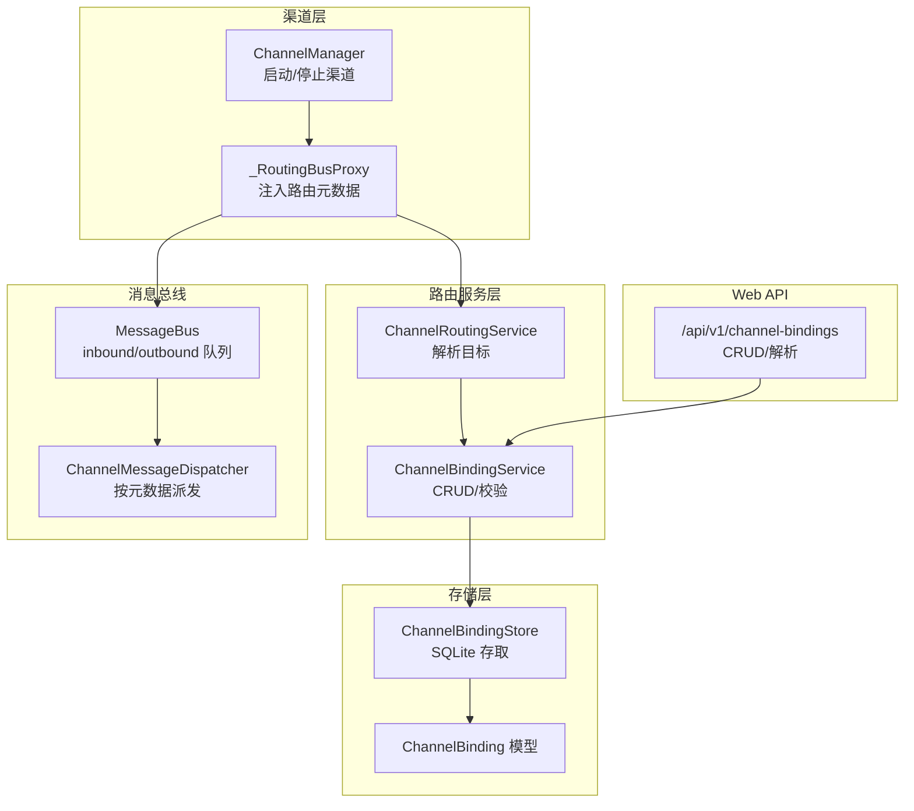
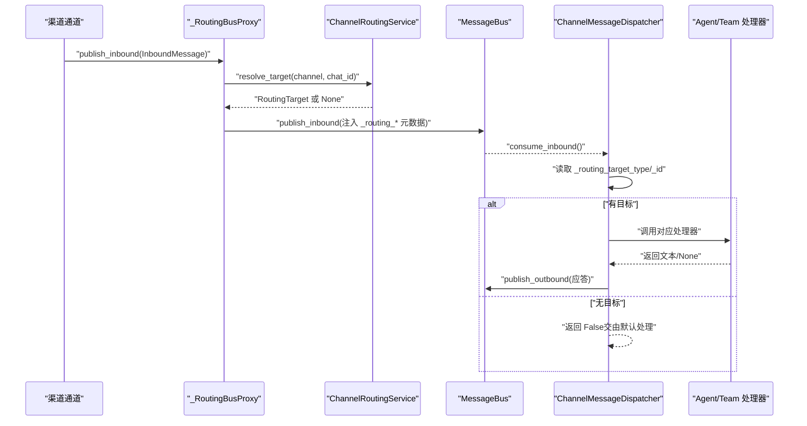
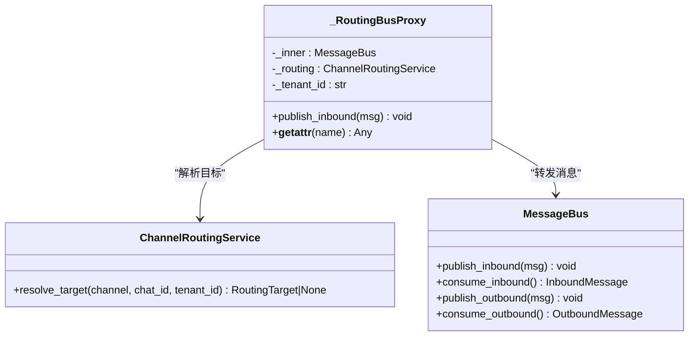
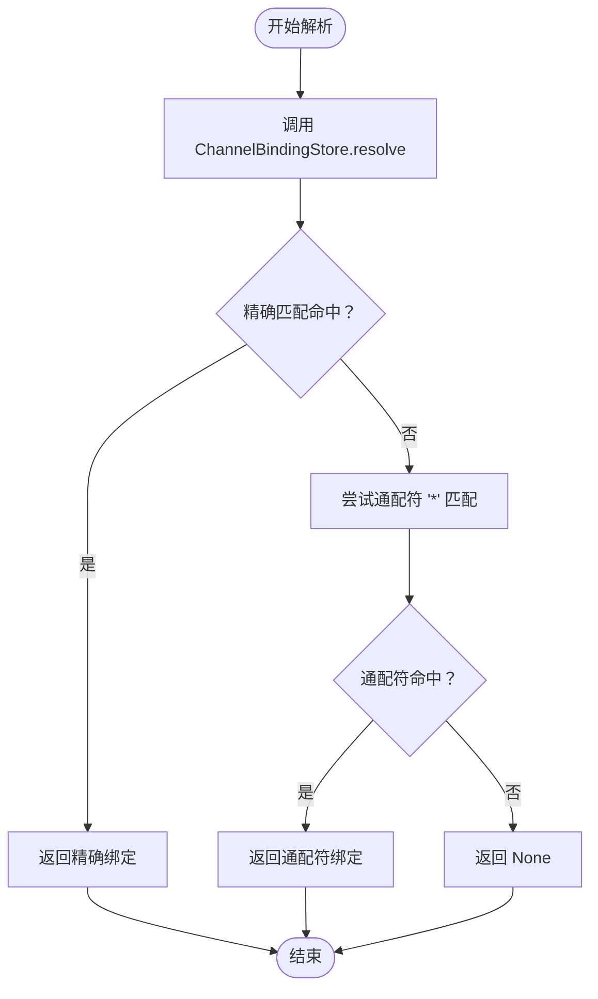
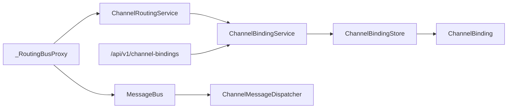

# 消息路由策略

<cite>
**本文引用的文件**   
- [nanobot/channels/manager.py](file://nanobot/channels/manager.py)
- [nanobot/web/runtime_services/channel_routing.py](file://nanobot/web/runtime_services/channel_routing.py)
- [nanobot/platform/channel_bindings/service.py](file://nanobot/platform/channel_bindings/service.py)
- [nanobot/platform/channel_bindings/store.py](file://nanobot/platform/channel_bindings/store.py)
- [nanobot/platform/channel_bindings/models.py](file://nanobot/platform/channel_bindings/models.py)
- [nanobot/channels/dispatch.py](file://nanobot/channels/dispatch.py)
- [nanobot/bus/queue.py](file://nanobot/bus/queue.py)
- [tests/test_channel_routing_e2e.py](file://tests/test_channel_routing_e2e.py)
- [nanobot/web/routers/channel_bindings.py](file://nanobot/web/routers/channel_bindings.py)
</cite>

## 目录
1. [简介](#简介)
2. [项目结构](#项目结构)
3. [核心组件](#核心组件)
4. [架构总览](#架构总览)
5. [详细组件分析](#详细组件分析)
6. [依赖分析](#依赖分析)
7. [性能考量](#性能考量)
8. [故障排查指南](#故障排查指南)
9. [结论](#结论)
10. [附录](#附录)

## 简介
本文件面向 Nanobot 的消息路由策略，聚焦于以下目标：
- 解释 _RoutingBusProxy 的工作原理与元数据注入机制
- 说明渠道绑定解析、目标类型识别与路由决策过程
- 记录消息分发策略、负载均衡与故障转移机制
- 解释路由缓存、性能优化与监控指标
- 提供路由配置的最佳实践与安全考虑
- 展示复杂路由场景的实现示例与调试方法

## 项目结构
围绕消息路由的关键代码分布在如下模块：
- 渠道管理与代理：channels/manager.py（含 _RoutingBusProxy）
- 路由服务：web/runtime_services/channel_routing.py
- 绑定模型与存储：platform/channel_bindings/models.py、store.py、service.py
- 分发器：channels/dispatch.py
- 消息总线：bus/queue.py
- 测试用例：tests/test_channel_routing_e2e.py
- Web API：web/routers/channel_bindings.py

图表来源
- [nanobot/channels/manager.py:52-84](file://nanobot/channels/manager.py#L52-L84)
- [nanobot/web/runtime_services/channel_routing.py:23-72](file://nanobot/web/runtime_services/channel_routing.py#L23-L72)
- [nanobot/platform/channel_bindings/service.py:28-85](file://nanobot/platform/channel_bindings/service.py#L28-L85)
- [nanobot/platform/channel_bindings/store.py:11-231](file://nanobot/platform/channel_bindings/store.py#L11-L231)
- [nanobot/channels/dispatch.py:13-93](file://nanobot/channels/dispatch.py#L13-L93)
- [nanobot/bus/queue.py:8-45](file://nanobot/bus/queue.py#L8-L45)
- [nanobot/web/routers/channel_bindings.py:1-102](file://nanobot/web/routers/channel_bindings.py#L1-L102)

章节来源
- [nanobot/channels/manager.py:52-84](file://nanobot/channels/manager.py#L52-L84)
- [nanobot/web/runtime_services/channel_routing.py:23-72](file://nanobot/web/runtime_services/channel_routing.py#L23-L72)
- [nanobot/platform/channel_bindings/service.py:28-85](file://nanobot/platform/channel_bindings/service.py#L28-L85)
- [nanobot/platform/channel_bindings/store.py:11-231](file://nanobot/platform/channel_bindings/store.py#L11-L231)
- [nanobot/channels/dispatch.py:13-93](file://nanobot/channels/dispatch.py#L13-L93)
- [nanobot/bus/queue.py:8-45](file://nanobot/bus/queue.py#L8-L45)
- [nanobot/web/routers/channel_bindings.py:1-102](file://nanobot/web/routers/channel_bindings.py#L1-L102)

## 核心组件
- _RoutingBusProxy：透明代理，将路由目标信息注入到入站消息的元数据中，随后转发至底层 MessageBus。
- ChannelRoutingService：根据渠道名与聊天 ID 解析绑定，返回目标类型、目标 ID、绑定 ID 与附加元数据。
- ChannelBindingService/Store/Model：负责绑定的创建、查询、更新、删除与解析逻辑；支持精确匹配与通配符回退，并按优先级排序。
- ChannelMessageDispatcher：从消息元数据中读取路由目标，调用对应处理器生成应答并写回出站队列。
- MessageBus：异步队列总线，解耦渠道与核心处理逻辑。
- Web 路由：提供绑定的 REST API，便于在运行时进行配置与解析验证。

章节来源
- [nanobot/channels/manager.py:19-49](file://nanobot/channels/manager.py#L19-L49)
- [nanobot/web/runtime_services/channel_routing.py:13-72](file://nanobot/web/runtime_services/channel_routing.py#L13-L72)
- [nanobot/platform/channel_bindings/service.py:28-201](file://nanobot/platform/channel_bindings/service.py#L28-L201)
- [nanobot/platform/channel_bindings/store.py:74-110](file://nanobot/platform/channel_bindings/store.py#L74-L110)
- [nanobot/channels/dispatch.py:13-93](file://nanobot/channels/dispatch.py#L13-L93)
- [nanobot/bus/queue.py:8-45](file://nanobot/bus/queue.py#L8-L45)
- [nanobot/web/routers/channel_bindings.py:21-102](file://nanobot/web/routers/channel_bindings.py#L21-L102)

## 架构总览
下图展示了从渠道入站消息到最终处理器执行与出站响应的完整链路，以及路由元数据注入点。

图表来源
- [nanobot/channels/manager.py:38-46](file://nanobot/channels/manager.py#L38-L46)
- [nanobot/web/runtime_services/channel_routing.py:38-72](file://nanobot/web/runtime_services/channel_routing.py#L38-L72)
- [nanobot/channels/dispatch.py:36-93](file://nanobot/channels/dispatch.py#L36-L93)
- [nanobot/bus/queue.py:20-34](file://nanobot/bus/queue.py#L20-L34)

## 详细组件分析

### _RoutingBusProxy：元数据注入与透明代理
- 角色定位：对渠道写入进行拦截，在转发前解析路由目标并将关键键值注入消息元数据。
- 注入键：
  - _routing_target_type：目标类型（如 agent 或 team）
  - _routing_target_id：目标标识
  - _routing_binding_id：绑定标识
- 行为特征：
  - 若解析成功，仅追加上述三项键；原有元数据保持不变
  - 若解析失败（无绑定），不注入路由键，保持原样转发
  - 对其他属性访问采用透传（__getattr__），确保与真实 MessageBus 一致

图表来源
- [nanobot/channels/manager.py:19-49](file://nanobot/channels/manager.py#L19-L49)
- [nanobot/web/runtime_services/channel_routing.py:23-72](file://nanobot/web/runtime_services/channel_routing.py#L23-L72)
- [nanobot/bus/queue.py:8-45](file://nanobot/bus/queue.py#L8-L45)

章节来源
- [nanobot/channels/manager.py:19-49](file://nanobot/channels/manager.py#L19-L49)
- [tests/test_channel_routing_e2e.py:235-290](file://tests/test_channel_routing_e2e.py#L235-L290)

### ChannelRoutingService：目标解析与优先级决策
- 决策流程：
  - 使用 ChannelBindingService.resolve_binding 执行精确匹配
  - 若未命中，回退到通配符绑定（chat_id 为 *）
  - 同一规则内按优先级降序选择
  - 仅启用的绑定参与解析
- 输出封装：返回 RoutingTarget，包含目标类型、目标 ID、绑定 ID 与附加元数据

图表来源
- [nanobot/web/runtime_services/channel_routing.py:38-72](file://nanobot/web/runtime_services/channel_routing.py#L38-L72)
- [nanobot/platform/channel_bindings/store.py:74-110](file://nanobot/platform/channel_bindings/store.py#L74-L110)

章节来源
- [nanobot/web/runtime_services/channel_routing.py:23-72](file://nanobot/web/runtime_services/channel_routing.py#L23-L72)
- [nanobot/platform/channel_bindings/store.py:74-110](file://nanobot/platform/channel_bindings/store.py#L74-L110)

### ChannelBindingService/Store/Model：绑定模型与解析
- 模型字段：binding_id、tenant_id、instance_id、channel_name、channel_chat_id、target_type、target_id、priority、enabled、metadata、created_at、updated_at
- 解析逻辑：
  - 精确匹配：channel_name + channel_chat_id
  - 通配符回退：channel_name + '*'
  - 仅启用（enabled=1）的绑定参与
  - 优先级降序，同一优先级按更新时间等排序
- 约束与校验：
  - target_type 限定为 agent 或 team
  - 创建/更新时对必填字段进行标准化与校验
  - 唯一索引约束：tenant_id + instance_id + channel_name + channel_chat_id

章节来源
- [nanobot/platform/channel_bindings/models.py:15-69](file://nanobot/platform/channel_bindings/models.py#L15-L69)
- [nanobot/platform/channel_bindings/store.py:14-35](file://nanobot/platform/channel_bindings/store.py#L14-L35)
- [nanobot/platform/channel_bindings/store.py:74-110](file://nanobot/platform/channel_bindings/store.py#L74-L110)
- [nanobot/platform/channel_bindings/service.py:54-72](file://nanobot/platform/channel_bindings/service.py#L54-L72)

### ChannelMessageDispatcher：基于元数据的分发
- 元数据读取：_routing_target_type、_routing_target_id
- 分发策略：
  - 若存在目标类型与 ID，调用对应处理器（agent_handler 或 team_handler）
  - 若无处理器或目标类型不受支持，发布错误提示出站消息
  - 异常捕获并统一转化为错误出站消息
- 返回值：若已处理返回 True，否则 False（交由上层默认处理）

章节来源
- [nanobot/channels/dispatch.py:13-93](file://nanobot/channels/dispatch.py#L13-L93)

### MessageBus：异步队列总线
- 功能：提供入站/出站异步队列，解耦渠道与核心处理
- 关键属性：inbound_size、outbound_size，便于监控与限流

章节来源
- [nanobot/bus/queue.py:8-45](file://nanobot/bus/queue.py#L8-L45)

### Web API：绑定管理与解析
- 路由概览：
  - GET/POST/PUT/DELETE /api/v1/channel-bindings：绑定 CRUD
  - POST /api/v1/channel-bindings/resolve：按渠道与聊天 ID 解析绑定
- 错误处理：针对冲突、校验失败、未找到等情况返回相应状态码与错误码

章节来源
- [nanobot/web/routers/channel_bindings.py:21-102](file://nanobot/web/routers/channel_bindings.py#L21-L102)

## 依赖分析
- 组件耦合：
  - _RoutingBusProxy 依赖 ChannelRoutingService 与 MessageBus
  - ChannelRoutingService 依赖 ChannelBindingService
  - ChannelBindingService 依赖 ChannelBindingStore 与 ChannelBinding 模型
  - ChannelMessageDispatcher 依赖 MessageBus 与处理器回调
- 外部依赖：
  - SQLite（ChannelBindingStore）
  - FastAPI（Web 路由）
- 可能的循环依赖：未发现直接循环；各方向单向依赖清晰

图表来源
- [nanobot/channels/manager.py:19-49](file://nanobot/channels/manager.py#L19-L49)
- [nanobot/web/runtime_services/channel_routing.py:23-72](file://nanobot/web/runtime_services/channel_routing.py#L23-L72)
- [nanobot/platform/channel_bindings/service.py:28-85](file://nanobot/platform/channel_bindings/service.py#L28-L85)
- [nanobot/platform/channel_bindings/store.py:11-231](file://nanobot/platform/channel_bindings/store.py#L11-L231)
- [nanobot/channels/dispatch.py:13-93](file://nanobot/channels/dispatch.py#L13-L93)
- [nanobot/web/routers/channel_bindings.py:1-102](file://nanobot/web/routers/channel_bindings.py#L1-L102)

## 性能考量
- 查询路径优化
  - 精确匹配优先：减少回退查询次数
  - 通配符回退仅在精确未命中时触发
  - 数据库索引：唯一索引与查询索引降低查找成本
- 并发与队列
  - 异步队列避免阻塞，适合高并发入站
  - 出站分发任务按需消费，超时控制防止忙轮询
- 缓存与热点
  - 当前实现未内置路由缓存；可在高频场景引入 LRU 缓存以降低重复解析开销
- 监控指标
  - 入/出站队列长度（inbound_size、outbound_size）
  - 路由命中率（命中绑定数/总入站数）、未命中比例
  - 处理耗时分布（解析、分发、处理器执行）
  - 错误率（解析失败、处理器异常、未知渠道）

[本节为通用性能讨论，不直接分析特定文件]

## 故障排查指南
- 无路由元数据
  - 现象：消息未被分发，dispatcher 返回 False
  - 排查：确认是否存在有效绑定；检查通配符与精确匹配优先级
- 绑定禁用
  - 现象：禁用绑定不会注入路由元数据
  - 排查：检查 enabled 字段
- 目标类型不匹配
  - 现象：无对应处理器时发布错误出站消息
  - 排查：确认注册的处理器类型与目标类型一致
- 解析优先级
  - 现象：精确匹配未生效
  - 排查：确认精确绑定优先级高于通配符绑定
- Web API 验证
  - 使用 /api/v1/channel-bindings/resolve 对渠道与聊天 ID 进行解析验证

章节来源
- [tests/test_channel_routing_e2e.py:255-264](file://tests/test_channel_routing_e2e.py#L255-L264)
- [tests/test_channel_routing_e2e.py:476-494](file://tests/test_channel_routing_e2e.py#L476-L494)
- [tests/test_channel_routing_e2e.py:391-420](file://tests/test_channel_routing_e2e.py#L391-L420)
- [nanobot/web/routers/channel_bindings.py:83-102](file://nanobot/web/routers/channel_bindings.py#L83-L102)

## 结论
Nanobot 的消息路由以“绑定 + 元数据注入 + 分发器”的模式实现，具备明确的优先级与回退策略，且通过异步队列实现渠道与核心的解耦。通过 Web API 可在线配置与验证路由绑定，测试用例覆盖了典型与边界场景。为进一步提升稳定性与性能，建议引入路由缓存、完善监控指标与告警，并在多租户/多实例环境下强化隔离与权限控制。

[本节为总结性内容，不直接分析特定文件]

## 附录

### 路由配置最佳实践
- 明确优先级：为不同聊天群组设置精确绑定，通配符作为兜底
- 启用禁用控制：变更路由策略时优先使用禁用而非删除，便于快速回滚
- 元数据扩展：利用绑定元数据承载业务上下文，分发器按需读取
- 多租户隔离：通过 tenant_id 与 instance_id 实现路由隔离
- 安全考虑：限制 allow_from 列表，避免未授权用户进入；对敏感元数据进行脱敏

[本节为通用指导，不直接分析特定文件]

### 复杂路由场景示例
- 场景一：VIP 群组优先接入专属代理，其余群组走默认代理
  - 策略：VIP 群组精确绑定到专属代理；其他群组通配符绑定到默认代理
- 场景二：多渠道隔离
  - 策略：QQ 与 Telegram 各自独立绑定，互不影响
- 场景三：团队协作路由
  - 策略：将特定群组绑定到 team，由团队处理器统一协调

章节来源
- [tests/test_channel_routing_e2e.py:391-420](file://tests/test_channel_routing_e2e.py#L391-L420)
- [tests/test_channel_routing_e2e.py:423-449](file://tests/test_channel_routing_e2e.py#L423-L449)
- [tests/test_channel_routing_e2e.py:341-370](file://tests/test_channel_routing_e2e.py#L341-L370)

### 调试与性能分析方法
- 单元测试验证：使用测试用例覆盖解析优先级、通配符回退、禁用绑定等
- Web API 验证：通过 /api/v1/channel-bindings/resolve 快速验证解析结果
- 日志与指标：关注路由命中日志、队列长度与处理耗时
- 回归测试：在变更绑定后执行端到端测试，确保分发链路正确

章节来源
- [tests/test_channel_routing_e2e.py:116-180](file://tests/test_channel_routing_e2e.py#L116-L180)
- [tests/test_channel_routing_e2e.py:297-494](file://tests/test_channel_routing_e2e.py#L297-L494)
- [nanobot/web/routers/channel_bindings.py:83-102](file://nanobot/web/routers/channel_bindings.py#L83-L102)