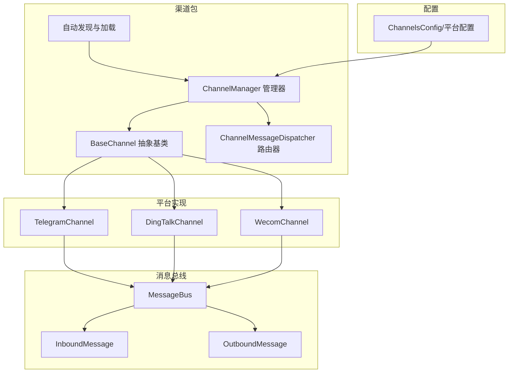
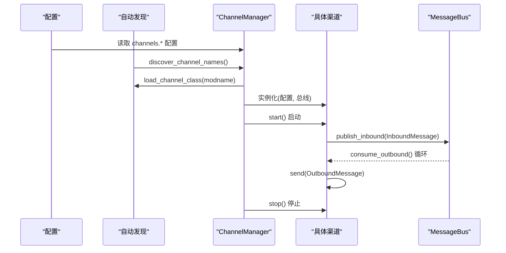
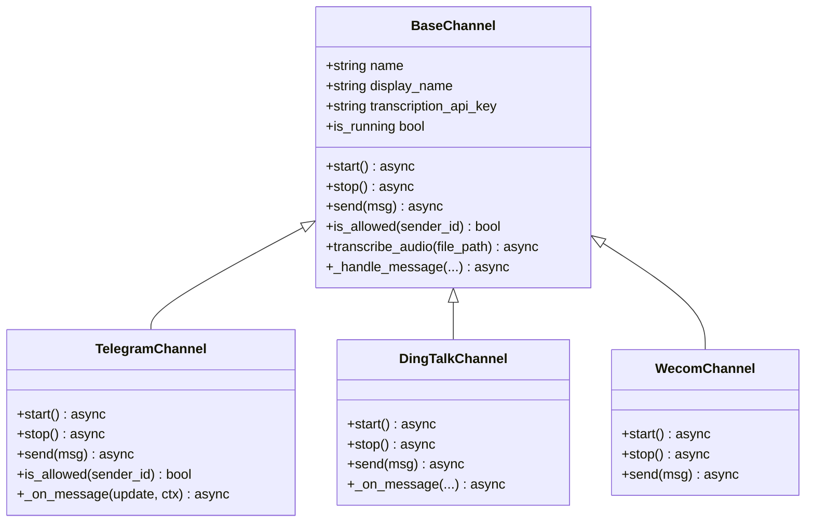
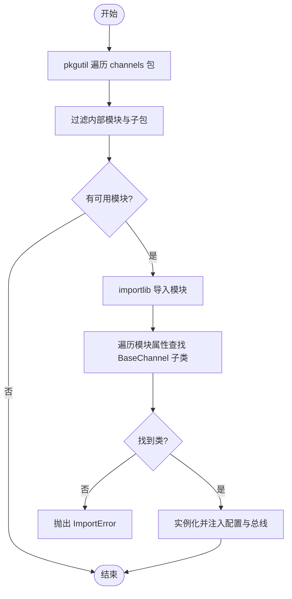
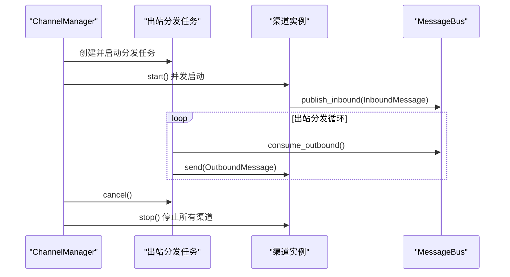
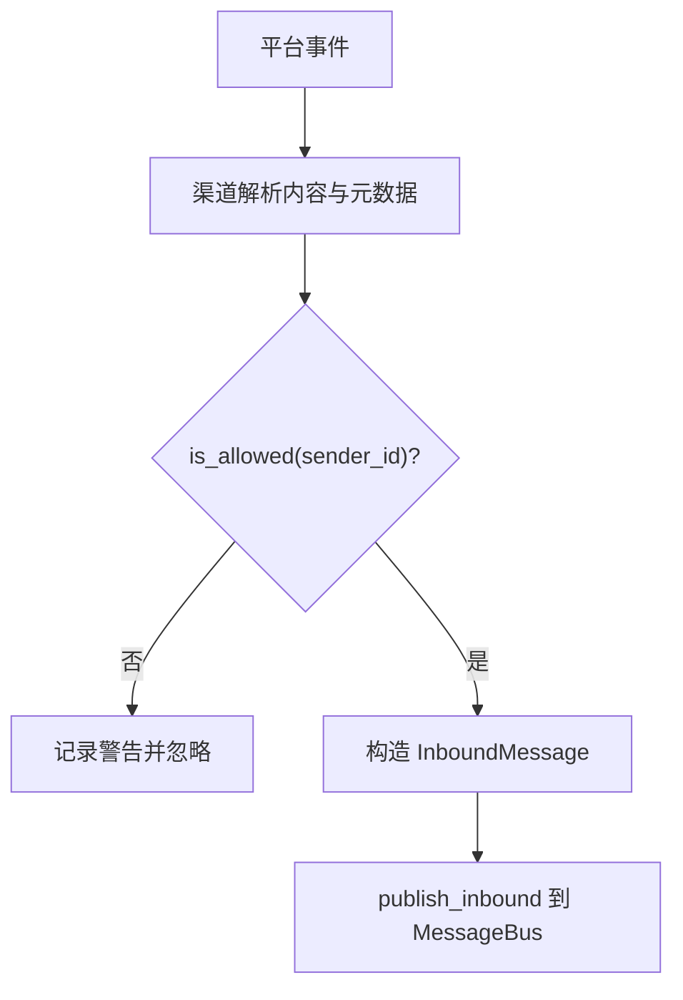
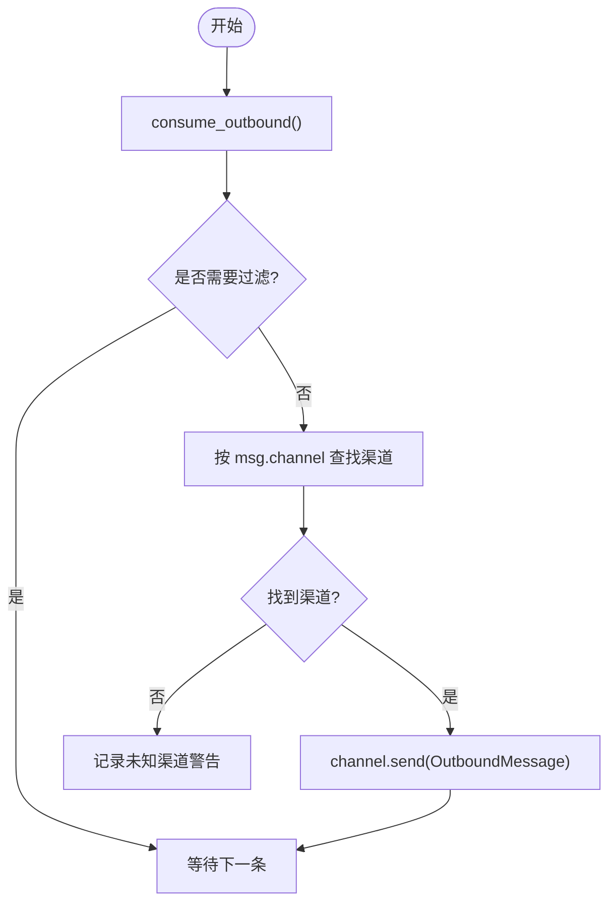
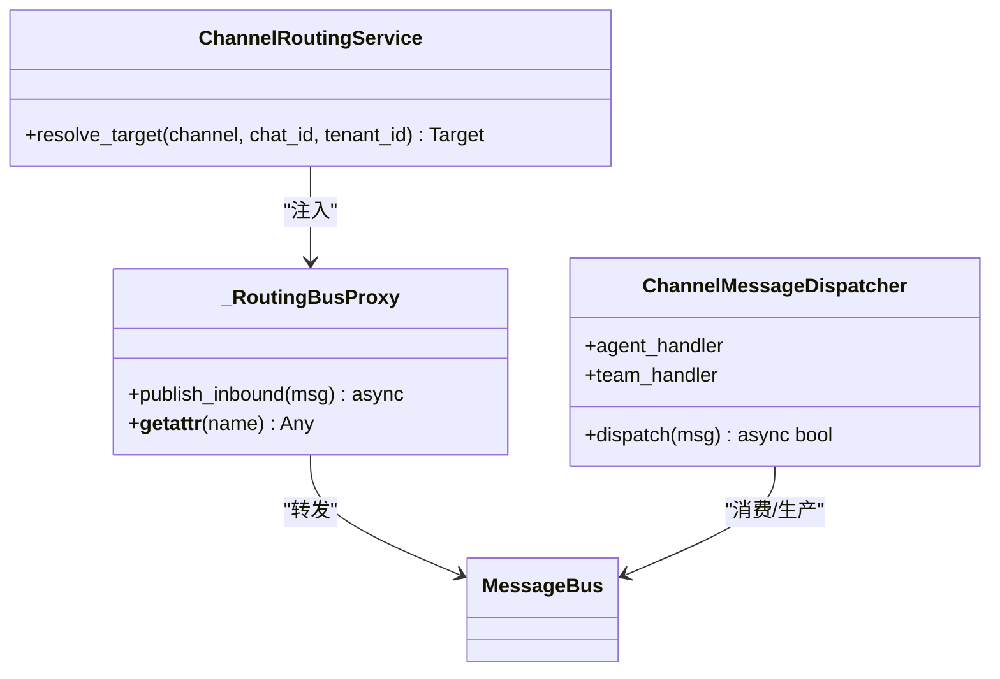
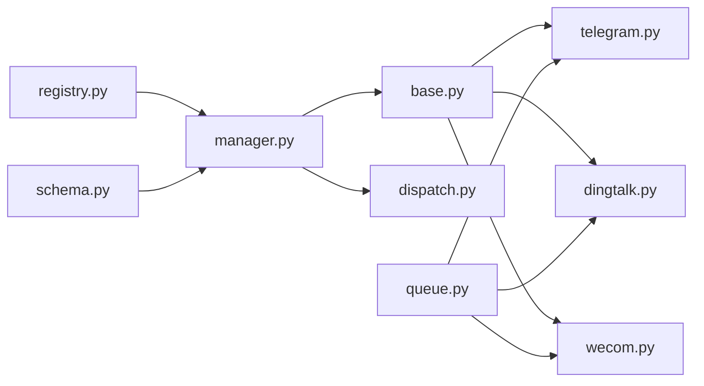

# 渠道架构设计

<cite>
**本文档引用的文件**
- [nanobot/channels/base.py](file://nanobot/channels/base.py)
- [nanobot/channels/registry.py](file://nanobot/channels/registry.py)
- [nanobot/channels/manager.py](file://nanobot/channels/manager.py)
- [nanobot/channels/__init__.py](file://nanobot/channels/__init__.py)
- [nanobot/channels/dingtalk.py](file://nanobot/channels/dingtalk.py)
- [nanobot/channels/telegram.py](file://nanobot/channels/telegram.py)
- [nanobot/channels/wecom.py](file://nanobot/channels/wecom.py)
- [nanobot/bus/events.py](file://nanobot/bus/events.py)
- [nanobot/bus/queue.py](file://nanobot/bus/queue.py)
- [nanobot/config/schema.py](file://nanobot/config/schema.py)
- [nanobot/channels/dispatch.py](file://nanobot/channels/dispatch.py)
- [tests/test_base_channel.py](file://tests/test_base_channel.py)
</cite>

## 目录
1. [简介](#简介)
2. [项目结构](#项目结构)
3. [核心组件](#核心组件)
4. [架构总览](#架构总览)
5. [详细组件分析](#详细组件分析)
6. [依赖关系分析](#依赖关系分析)
7. [性能考虑](#性能考虑)
8. [故障排除指南](#故障排除指南)
9. [结论](#结论)
10. [附录](#附录)

## 简介
本文件面向 Nanobot 的渠道（Channel）架构设计，系统性阐述 BaseChannel 抽象基类的设计原则、接口规范与继承模式；详解渠道注册机制（pkgutil 扫描、动态导入与类加载）；记录渠道生命周期管理（初始化、启动、运行、停止）；解释渠道配置系统的设计思路与最佳实践；并提供扩展指南与自定义实现示例，辅以架构图与组件交互关系说明，帮助开发者快速理解并扩展渠道能力。

## 项目结构
Nanobot 的渠道子系统位于 nanobot/channels 包中，采用“插件化 + 自动发现”的架构：
- 基类与管理器：BaseChannel、ChannelManager、ChannelMessageDispatcher
- 注册与发现：registry 模块通过 pkgutil 动态扫描可用渠道模块
- 平台实现：各平台（如 Telegram、DingTalk、WeCom 等）作为独立模块实现 BaseChannel 接口
- 消息总线：bus.events 与 bus.queue 提供入站/出站消息的解耦通信
- 配置模型：config.schema 定义各渠道的配置项与默认值

**图表来源**
- [nanobot/channels/base.py:15-135](file://nanobot/channels/base.py#L15-L135)
- [nanobot/channels/manager.py:52-209](file://nanobot/channels/manager.py#L52-L209)
- [nanobot/channels/registry.py:15-36](file://nanobot/channels/registry.py#L15-L36)
- [nanobot/channels/dispatch.py:13-93](file://nanobot/channels/dispatch.py#L13-L93)
- [nanobot/bus/events.py:8-39](file://nanobot/bus/events.py#L8-L39)
- [nanobot/bus/queue.py:8-45](file://nanobot/bus/queue.py#L8-L45)
- [nanobot/config/schema.py:213-229](file://nanobot/config/schema.py#L213-L229)

**章节来源**
- [nanobot/channels/__init__.py:1-7](file://nanobot/channels/__init__.py#L1-L7)
- [nanobot/channels/registry.py:1-36](file://nanobot/channels/registry.py#L1-L36)
- [nanobot/channels/manager.py:1-209](file://nanobot/channels/manager.py#L1-L209)

## 核心组件
- BaseChannel：定义渠道抽象接口（start/stop/send），提供权限控制与消息封装入口
- ChannelManager：负责渠道的自动发现、实例化、启动/停止与出站分发
- ChannelMessageDispatcher：基于路由元数据将入站消息分派到目标代理或团队
- MessageBus：异步队列总线，承载入站/出站消息
- 平台 Channel 实现：Telegram、DingTalk、WeCom 等具体平台的连接、收发与媒体处理逻辑

**章节来源**
- [nanobot/channels/base.py:15-135](file://nanobot/channels/base.py#L15-L135)
- [nanobot/channels/manager.py:52-209](file://nanobot/channels/manager.py#L52-L209)
- [nanobot/channels/dispatch.py:13-93](file://nanobot/channels/dispatch.py#L13-L93)
- [nanobot/bus/queue.py:8-45](file://nanobot/bus/queue.py#L8-L45)

## 架构总览
渠道架构采用“插件化 + 自动发现 + 消息总线”的解耦设计：
- 自动发现：通过 pkgutil 遍历 channels 包中的模块，过滤内部模块后得到可用渠道清单
- 动态导入：根据配置 section 决定启用哪些渠道，并动态 import 对应模块，查找首个 BaseChannel 子类
- 生命周期：ChannelManager 统一管理所有已启用渠道的启动、运行与停止
- 消息流：入站消息经渠道封装后进入 MessageBus 入站队列；出站消息由 ChannelManager 的分发任务从出站队列取出并调用对应渠道的 send 方法

**图表来源**
- [nanobot/channels/registry.py:15-36](file://nanobot/channels/registry.py#L15-L36)
- [nanobot/channels/manager.py:86-159](file://nanobot/channels/manager.py#L86-L159)
- [nanobot/bus/queue.py:20-34](file://nanobot/bus/queue.py#L20-L34)

## 详细组件分析

### BaseChannel 抽象基类
- 设计原则
  - 明确职责：每个渠道实现统一接口，屏蔽平台差异
  - 权限控制：is_allowed 支持通配符与白名单策略
  - 消息封装：_handle_message 将原始事件转换为 InboundMessage 并发布到总线
  - 可选能力：音频转写（Groq Whisper），在未配置时返回空字符串
- 接口规范
  - start/stop：长连接/轮询的生命周期管理
  - send：将 OutboundMessage 发送到平台
  - is_allowed：访问控制
  - _handle_message：入站消息统一封装与发布
- 继承模式
  - 子类需设置 name/display_name
  - 可覆盖 is_allowed 以适配平台特定的允许列表格式（如 Telegram 支持 id|username）

**图表来源**
- [nanobot/channels/base.py:15-135](file://nanobot/channels/base.py#L15-L135)
- [nanobot/channels/telegram.py:150-736](file://nanobot/channels/telegram.py#L150-L736)
- [nanobot/channels/dingtalk.py:105-475](file://nanobot/channels/dingtalk.py#L105-L475)
- [nanobot/channels/wecom.py:28-354](file://nanobot/channels/wecom.py#L28-L354)

**章节来源**
- [nanobot/channels/base.py:15-135](file://nanobot/channels/base.py#L15-L135)
- [tests/test_base_channel.py:21-26](file://tests/test_base_channel.py#L21-L26)

### 渠道注册机制
- pkgutil 扫描
  - discover_channel_names：遍历 channels 包路径，过滤内部模块（base/manager/registry）与子包，仅返回可导入的模块名
- 动态导入与类加载
  - load_channel_class：importlib.import_module 动态导入模块，遍历模块属性，找到第一个继承自 BaseChannel 的类（排除基类本身）
- 错误处理
  - 若模块内无 BaseChannel 子类，抛出 ImportError
  - ChannelManager 在初始化失败时记录警告并跳过该渠道

**图表来源**
- [nanobot/channels/registry.py:15-36](file://nanobot/channels/registry.py#L15-L36)
- [nanobot/channels/manager.py:86-104](file://nanobot/channels/manager.py#L86-L104)

**章节来源**
- [nanobot/channels/registry.py:15-36](file://nanobot/channels/registry.py#L15-L36)
- [nanobot/channels/manager.py:86-104](file://nanobot/channels/manager.py#L86-L104)

### 渠道生命周期管理
- 初始化
  - ChannelManager 读取配置 channels.*，对每个启用的模块调用 discover_channel_names 与 load_channel_class
  - 为每个渠道设置 transcription_api_key（来自 providers.groq.api_key）
- 启动
  - start_all 创建出站分发任务，随后并发启动所有渠道
  - 各渠道 start() 通常为长连接/轮询循环，保持运行状态
- 运行
  - 出站分发任务持续从 MessageBus 出站队列消费消息，按 msg.channel 查找对应渠道并调用 send
  - 分发前可根据配置过滤进度消息与工具提示
- 停止
  - stop_all 取消分发任务，逐个调用 channel.stop() 并清理资源

**图表来源**
- [nanobot/channels/manager.py:122-190](file://nanobot/channels/manager.py#L122-L190)

**章节来源**
- [nanobot/channels/manager.py:86-190](file://nanobot/channels/manager.py#L86-L190)

### 渠道配置系统
- 配置模型
  - ChannelsConfig：聚合各平台配置对象（enabled、allow_from 等）
  - 各平台配置类（如 TelegramConfig、DingTalkConfig、WecomConfig）定义平台特有参数
- 加载与验证
  - ChannelManager 在初始化时读取 config.channels 下的各平台 section，仅启用 enabled=True 的渠道
  - 校验 allow_from：若为空列表则直接终止进程，避免全拒绝
- 最佳实践
  - 明确 allow_from 列表，必要时使用通配符 "*" 开放
  - 为需要语音转写的渠道配置 transcription_api_key
  - 出站消息过滤：通过 channels.send_progress 与 send_tool_hints 控制进度与工具提示的发送

**章节来源**
- [nanobot/config/schema.py:213-229](file://nanobot/config/schema.py#L213-L229)
- [nanobot/channels/manager.py:86-114](file://nanobot/channels/manager.py#L86-L114)

### 入站消息处理流程
- 渠道收到平台事件后，调用 BaseChannel._handle_message
- 权限检查：is_allowed(sender_id)
- 构造 InboundMessage：包含 channel、sender_id、chat_id、content、media、metadata、session_key_override
- 发布到 MessageBus 入站队列

**图表来源**
- [nanobot/channels/base.py:89-130](file://nanobot/channels/base.py#L89-L130)
- [nanobot/bus/events.py:8-25](file://nanobot/bus/events.py#L8-L25)

**章节来源**
- [nanobot/channels/base.py:89-130](file://nanobot/channels/base.py#L89-L130)
- [nanobot/bus/events.py:8-25](file://nanobot/bus/events.py#L8-L25)

### 出站消息分发流程
- ChannelManager._dispatch_outbound 从 MessageBus 出站队列消费消息
- 过滤条件：根据 channels.send_progress 与 send_tool_hints 控制进度消息与工具提示
- 查找目标渠道：按 msg.channel 定位实例
- 调用 send 并捕获异常，记录错误日志

**图表来源**
- [nanobot/channels/manager.py:160-190](file://nanobot/channels/manager.py#L160-L190)

**章节来源**
- [nanobot/channels/manager.py:160-190](file://nanobot/channels/manager.py#L160-L190)

### 平台实现示例

#### TelegramChannel
- 特点
  - 使用长轮询（long polling）接收消息，无需公网 IP
  - 支持命令处理（/start、/new、/stop、/help）
  - 支持媒体组缓冲、打字指示、会话键派生（话题线程）
  - 文本转 Telegram HTML，必要时回退纯文本
- 关键方法
  - start/stop：初始化 Application，注册命令与消息处理器，维护轮询循环
  - send：按媒体类型发送图片/语音/音频/文档，支持回复原消息与话题线程
  - _on_message/_forward_command：解析消息、下载媒体、构建 InboundMessage 并发布

**章节来源**
- [nanobot/channels/telegram.py:150-736](file://nanobot/channels/telegram.py#L150-L736)

#### DingTalkChannel
- 特点
  - 使用 Stream Mode（WebSocket）接收事件
  - 通过 HTTP API 发送消息，支持私聊与群聊
  - 媒体上传与下载，支持图片/语音/视频/文件
  - 访问令牌管理与重连机制
- 关键方法
  - start/stop：建立与断开 Stream 客户端，管理后台任务
  - send：根据媒体类型选择发送策略，失败时发送可见回退消息
  - _on_message：解析回调消息，派生 chat_id（群聊带前缀），调用 _handle_message

**章节来源**
- [nanobot/channels/dingtalk.py:105-475](file://nanobot/channels/dingtalk.py#L105-L475)

#### WecomChannel
- 特点
  - 使用 WebSocket 长连接接收事件
  - 支持文本、图片、语音、文件与混合内容
  - 去重缓存、欢迎语、帧头保留用于回复
- 关键方法
  - start/stop：连接/断开 WebSocket，注册事件处理器
  - _process_message：统一处理各类消息，去重并发布入站消息

**章节来源**
- [nanobot/channels/wecom.py:28-354](file://nanobot/channels/wecom.py#L28-L354)

### 渠道路由与扩展指南
- 路由增强
  - ChannelManager 可注入 ChannelRoutingService，通过 _RoutingBusProxy 在入站消息中注入路由元数据（目标类型/ID/绑定ID）
  - ChannelMessageDispatcher 根据元数据将消息路由到指定代理或团队
- 扩展步骤
  1. 在 nanobot/channels 下新增模块 mychannel.py，实现 BaseChannel 子类
  2. 设置 name/display_name，实现 start/stop/send
  3. 在配置 schema 中添加 MyChannelConfig，并在 ChannelsConfig 中聚合
  4. 在配置文件中启用该渠道并填写必要参数
  5. 如需路由增强，在 ChannelManager 初始化时传入路由服务

**图表来源**
- [nanobot/channels/manager.py:19-50](file://nanobot/channels/manager.py#L19-L50)
- [nanobot/channels/dispatch.py:13-93](file://nanobot/channels/dispatch.py#L13-L93)

**章节来源**
- [nanobot/channels/manager.py:19-81](file://nanobot/channels/manager.py#L19-L81)
- [nanobot/channels/dispatch.py:13-93](file://nanobot/channels/dispatch.py#L13-L93)

## 依赖关系分析
- 模块耦合
  - ChannelManager 依赖 registry（自动发现）、config.schema（配置）、bus.queue（消息总线）
  - 各平台 Channel 依赖 BaseChannel 与 bus.events/queue
- 外部依赖
  - 平台 SDK（如 telegram、dingtalk-stream、wecom_aibot_sdk）按需安装
  - httpx 用于 HTTP 请求（如钉钉媒体上传）
- 循环依赖
  - 未见循环导入；通道与总线之间通过异步队列解耦

**图表来源**
- [nanobot/channels/registry.py:1-36](file://nanobot/channels/registry.py#L1-L36)
- [nanobot/channels/manager.py:1-209](file://nanobot/channels/manager.py#L1-L209)
- [nanobot/config/schema.py:1-450](file://nanobot/config/schema.py#L1-L450)
- [nanobot/bus/queue.py:1-45](file://nanobot/bus/queue.py#L1-L45)

**章节来源**
- [nanobot/channels/registry.py:1-36](file://nanobot/channels/registry.py#L1-L36)
- [nanobot/channels/manager.py:1-209](file://nanobot/channels/manager.py#L1-L209)
- [nanobot/config/schema.py:1-450](file://nanobot/config/schema.py#L1-L450)
- [nanobot/bus/queue.py:1-45](file://nanobot/bus/queue.py#L1-L45)

## 性能考虑
- 异步与并发
  - 渠道启动采用 asyncio.gather 并发等待，提高启动效率
  - 出站分发使用超时等待与取消机制，避免阻塞
- 资源管理
  - 渠道 stop 中显式关闭 HTTP 客户端、取消后台任务
  - Telegram 的媒体组缓冲与打字指示需限制缓存大小与任务数量
- I/O 优化
  - 媒体下载/上传采用异步 httpx，必要时进行本地缓存与去重
  - 针对长连接渠道（Telegram/DingTalk/WeCom）维持稳定连接与重连策略

[本节为通用指导，不涉及具体文件分析]

## 故障排除指南
- 渠道无法启动
  - 检查配置 enabled 与必要参数（如 token/client_id/secret）
  - 查看日志中的 ImportError 或初始化错误
- 权限问题
  - allow_from 为空会导致拒绝所有访问；请设置 ["*"] 或具体用户标识
  - Telegram 支持 id|username 格式的允许列表匹配
- 媒体发送失败
  - 检查媒体 URL/本地路径是否可达
  - 钉钉上传失败时会回退发送可见提示
- 出站消息未送达
  - 确认 channels.send_progress 与 send_tool_hints 配置
  - 检查 ChannelManager 的分发任务是否正常运行

**章节来源**
- [nanobot/channels/manager.py:107-114](file://nanobot/channels/manager.py#L107-L114)
- [nanobot/channels/telegram.py:180-198](file://nanobot/channels/telegram.py#L180-L198)
- [nanobot/channels/dingtalk.py:424-444](file://nanobot/channels/dingtalk.py#L424-L444)

## 结论
Nanobot 的渠道架构通过 BaseChannel 抽象、自动发现与动态导入、消息总线解耦以及生命周期统一管理，实现了高扩展性与低耦合的插件化设计。平台实现遵循统一接口，配置系统清晰可控，路由与分发机制灵活可扩展。开发者可按本文档的扩展指南快速添加新渠道，并结合路由服务实现更复杂的业务场景。

[本节为总结性内容，不涉及具体文件分析]

## 附录

### 配置项速查（部分）
- ChannelsConfig
  - send_progress：是否发送进度消息
  - send_tool_hints：是否发送工具提示
  - 各平台配置对象（如 telegram、dingtalk、wecom）均包含 enabled 与 allow_from
- ProviderConfig（用于音频转写）
  - groq.api_key：Groq API Key

**章节来源**
- [nanobot/config/schema.py:213-229](file://nanobot/config/schema.py#L213-L229)
- [nanobot/config/schema.py:259-289](file://nanobot/config/schema.py#L259-L289)