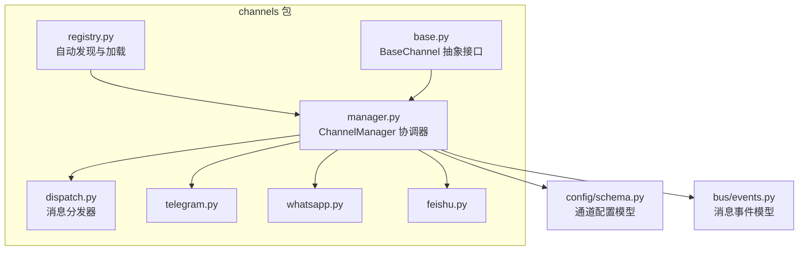
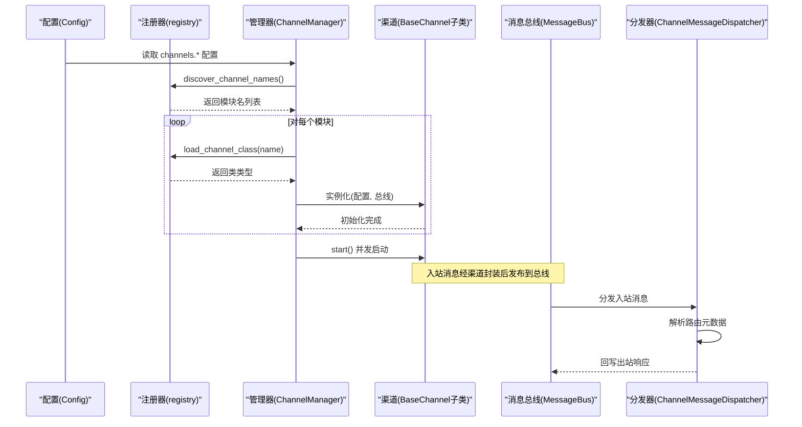
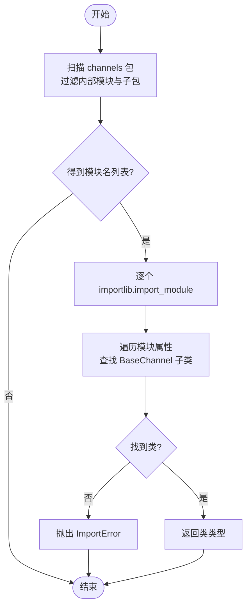
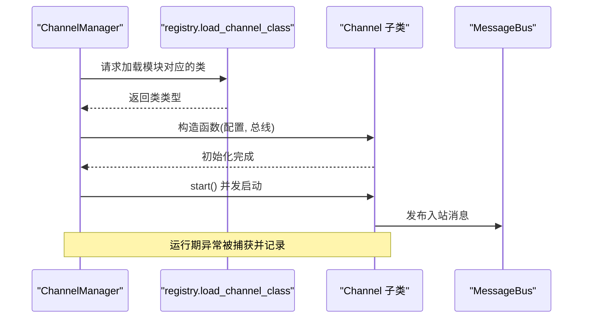
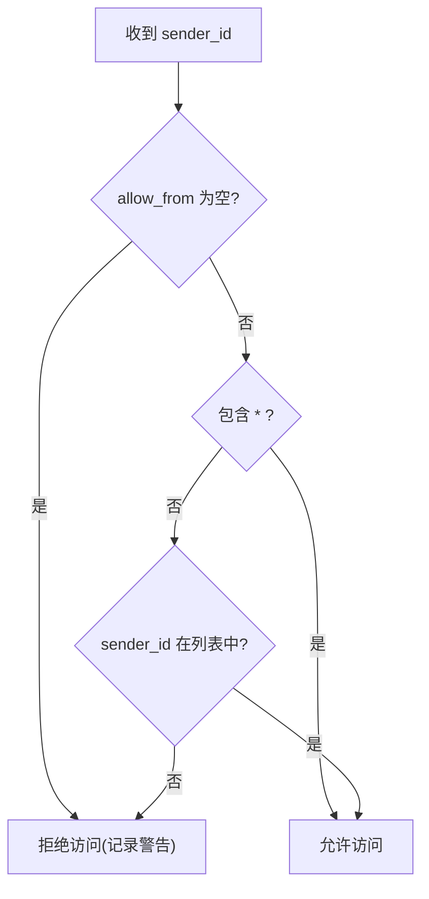
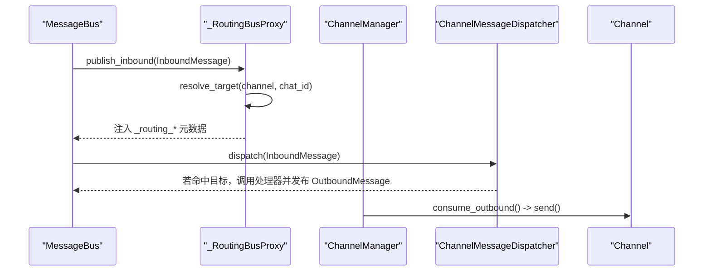
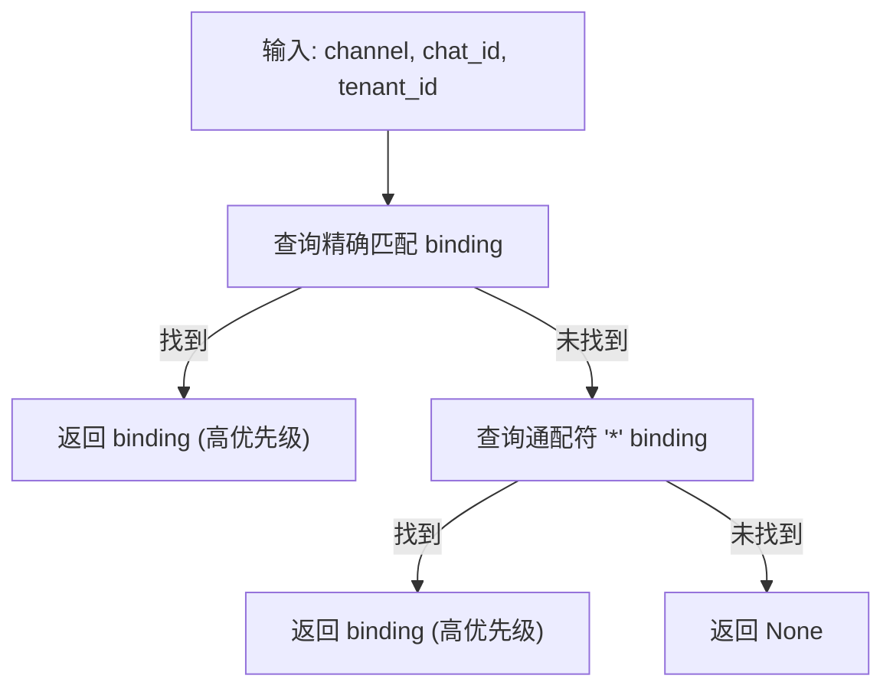
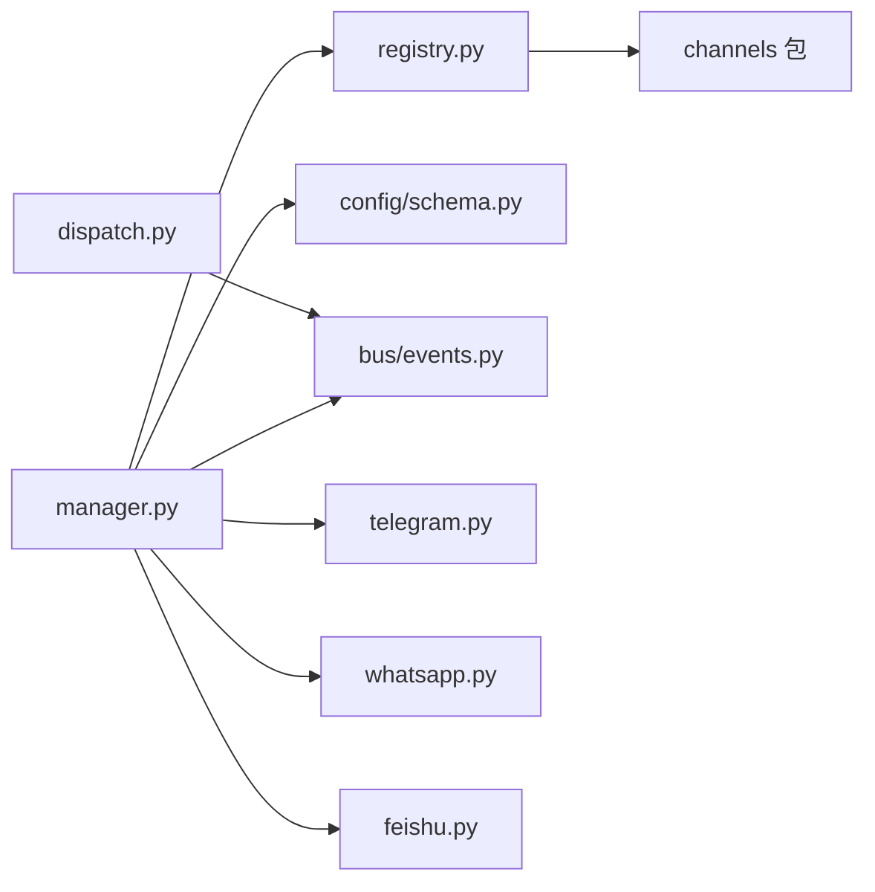

# 渠道注册机制

<cite>
**本文档引用的文件**
- [channels/__init__.py](file://nanobot/channels/__init__.py)
- [channels/registry.py](file://nanobot/channels/registry.py)
- [channels/base.py](file://nanobot/channels/base.py)
- [channels/manager.py](file://nanobot/channels/manager.py)
- [channels/dispatch.py](file://nanobot/channels/dispatch.py)
- [channels/telegram.py](file://nanobot/channels/telegram.py)
- [channels/whatsapp.py](file://nanobot/channels/whatsapp.py)
- [channels/feishu.py](file://nanobot/channels/feishu.py)
- [config/schema.py](file://nanobot/config/schema.py)
- [bus/events.py](file://nanobot/bus/events.py)
- [platform/channel_bindings/models.py](file://nanobot/platform/channel_bindings/models.py)
- [platform/channel_bindings/service.py](file://nanobot/platform/channel_bindings/service.py)
- [platform/channel_bindings/store.py](file://nanobot/platform/channel_bindings/store.py)
- [web/runtime_services/channel_routing.py](file://nanobot/web/runtime_services/channel_routing.py)
- [tests/test_channel_dispatch.py](file://tests/test_channel_dispatch.py)
- [tests/test_channel_routing_e2e.py](file://tests/test_channel_routing_e2e.py)
</cite>

## 目录
1. [引言](#引言)
2. [项目结构](#项目结构)
3. [核心组件](#核心组件)
4. [架构总览](#架构总览)
5. [详细组件分析](#详细组件分析)
6. [依赖关系分析](#依赖关系分析)
7. [性能考虑](#性能考虑)
8. [故障排除指南](#故障排除指南)
9. [结论](#结论)
10. [附录](#附录)

## 引言
本文件系统性阐述 Nanobot 的“渠道注册机制”，覆盖以下主题：
- 渠道发现算法与 pkgutil 扫描机制
- 动态模块加载流程与类加载校验
- 渠道类的初始化、启动与错误处理
- 渠道配置验证规则与安全检查
- 调试方法与故障排除
- 注册示例与扩展新渠道的实现步骤
- 渠道优先级排序与冲突解决策略

## 项目结构
Nanobot 的渠道体系采用“插件化 + 自动发现”的设计：在 nanobot/channels 包内，每个子模块代表一个具体渠道（如 telegram、whatsapp、feishu 等），通过统一的抽象基类 BaseChannel 实现接口一致性；ChannelManager 负责扫描、加载、实例化与运行时协调。

图表来源
- [channels/registry.py:15-35](file://nanobot/channels/registry.py#L15-L35)
- [channels/base.py:15-135](file://nanobot/channels/base.py#L15-L135)
- [channels/manager.py:52-209](file://nanobot/channels/manager.py#L52-L209)
- [channels/dispatch.py:13-93](file://nanobot/channels/dispatch.py#L13-L93)
- [channels/telegram.py:150-736](file://nanobot/channels/telegram.py#L150-L736)
- [channels/whatsapp.py:16-172](file://nanobot/channels/whatsapp.py#L16-L172)
- [channels/feishu.py:234-981](file://nanobot/channels/feishu.py#L234-L981)
- [config/schema.py:213-229](file://nanobot/config/schema.py#L213-L229)
- [bus/events.py:8-39](file://nanobot/bus/events.py#L8-L39)

章节来源
- [channels/__init__.py:1-7](file://nanobot/channels/__init__.py#L1-L7)
- [channels/registry.py:15-35](file://nanobot/channels/registry.py#L15-L35)
- [channels/base.py:15-135](file://nanobot/channels/base.py#L15-L135)
- [channels/manager.py:52-209](file://nanobot/channels/manager.py#L52-L209)
- [channels/dispatch.py:13-93](file://nanobot/channels/dispatch.py#L13-L93)
- [channels/telegram.py:150-736](file://nanobot/channels/telegram.py#L150-L736)
- [channels/whatsapp.py:16-172](file://nanobot/channels/whatsapp.py#L16-L172)
- [channels/feishu.py:234-981](file://nanobot/channels/feishu.py#L234-L981)
- [config/schema.py:213-229](file://nanobot/config/schema.py#L213-L229)
- [bus/events.py:8-39](file://nanobot/bus/events.py#L8-L39)

## 核心组件
- 渠道抽象基类 BaseChannel：定义统一接口（start/stop/send）与通用能力（权限控制、消息封装、音频转写等）
- 渠道注册器 registry：基于 pkgutil 自动发现模块名，并动态导入模块查找首个继承自 BaseChannel 的类
- 渠道管理器 ChannelManager：读取配置、扫描并初始化通道、启动/停止通道、出站消息派发、路由元数据注入
- 消息分发器 ChannelMessageDispatcher：根据路由元数据将入站消息分派到指定代理或团队处理器
- 渠道实现：Telegram、WhatsApp、Feishu 等均继承 BaseChannel 并实现各自平台特性
- 配置模型：ChannelsConfig 及各渠道子配置，用于启用/禁用与参数校验

章节来源
- [channels/base.py:15-135](file://nanobot/channels/base.py#L15-L135)
- [channels/registry.py:15-35](file://nanobot/channels/registry.py#L15-L35)
- [channels/manager.py:52-209](file://nanobot/channels/manager.py#L52-L209)
- [channels/dispatch.py:13-93](file://nanobot/channels/dispatch.py#L13-L93)
- [config/schema.py:213-229](file://nanobot/config/schema.py#L213-L229)

## 架构总览
下图展示从配置到运行时的消息流转路径，包括自动发现、类加载、实例化、启动、入站/出站处理与路由分发。

图表来源
- [channels/registry.py:15-35](file://nanobot/channels/registry.py#L15-L35)
- [channels/manager.py:86-105](file://nanobot/channels/manager.py#L86-L105)
- [channels/dispatch.py:36-93](file://nanobot/channels/dispatch.py#L36-L93)
- [bus/events.py:8-39](file://nanobot/bus/events.py#L8-L39)

## 详细组件分析

### 渠道发现与动态加载
- 发现算法：使用 pkgutil.iter_modules 遍历 channels 包路径，过滤内部模块与子包，得到模块名列表
- 类加载：importlib.import_module 动态导入模块，遍历模块属性，找到第一个继承自 BaseChannel 的具体类
- 安全与健壮性：若模块中未找到有效类，抛出 ImportError；ChannelManager 在初始化阶段捕获并记录警告

图表来源
- [channels/registry.py:15-35](file://nanobot/channels/registry.py#L15-L35)

章节来源
- [channels/registry.py:15-35](file://nanobot/channels/registry.py#L15-L35)
- [channels/manager.py:86-105](file://nanobot/channels/manager.py#L86-L105)

### 渠道类加载流程与错误处理
- 加载流程：ChannelManager 读取配置 section，判断 enabled 后调用 load_channel_class 获取类，再以配置与消息总线实例化
- 错误处理：
  - 导入失败：记录警告并跳过该模块
  - 运行期异常：start 阶段捕获并记录错误，不影响其他通道
  - ACL 校验：初始化阶段对 allow_from 进行严格校验，空列表直接触发系统退出

图表来源
- [channels/manager.py:86-105](file://nanobot/channels/manager.py#L86-L105)
- [channels/manager.py:115-121](file://nanobot/channels/manager.py#L115-L121)
- [channels/manager.py:107-114](file://nanobot/channels/manager.py#L107-L114)

章节来源
- [channels/manager.py:86-105](file://nanobot/channels/manager.py#L86-L105)
- [channels/manager.py:107-114](file://nanobot/channels/manager.py#L107-L114)
- [channels/manager.py:115-121](file://nanobot/channels/manager.py#L115-L121)

### 渠道配置验证与安全检查
- 配置模型：ChannelsConfig 下挂载各渠道配置对象（如 TelegramConfig、WhatsAppConfig 等），统一字段命名与默认值
- 安全检查：
  - BaseChannel.is_allowed 默认策略：allow_from 为空则拒绝所有；含 "*" 则允许所有；否则需精确匹配
  - TelegramChannel.is_allowed 支持历史格式“id|username”兼容
  - ChannelManager._validate_allow_from 在初始化阶段强制禁止 allow_from 为空（防止全拒）

图表来源
- [channels/base.py:79-87](file://nanobot/channels/base.py#L79-L87)
- [channels/telegram.py:180-197](file://nanobot/channels/telegram.py#L180-L197)
- [channels/manager.py:107-114](file://nanobot/channels/manager.py#L107-L114)

章节来源
- [channels/base.py:79-87](file://nanobot/channels/base.py#L79-L87)
- [channels/telegram.py:180-197](file://nanobot/channels/telegram.py#L180-L197)
- [channels/manager.py:107-114](file://nanobot/channels/manager.py#L107-L114)
- [config/schema.py:26-37](file://nanobot/config/schema.py#L26-L37)
- [config/schema.py:175-190](file://nanobot/config/schema.py#L175-L190)
- [config/schema.py:203-211](file://nanobot/config/schema.py#L203-L211)

### 出站消息派发与路由元数据注入
- 出站派发：ChannelManager._dispatch_outbound 从总线消费出站消息，按 msg.channel 查找对应 Channel 并调用其 send
- 路由元数据注入：当提供路由服务时，ChannelManager 使用 _RoutingBusProxy 将目标类型/ID/绑定ID注入 InboundMessage.metadata
- 分发器：ChannelMessageDispatcher 依据 metadata 中的目标信息调用相应处理器（代理或团队），并将结果回写到总线

图表来源
- [channels/manager.py:19-50](file://nanobot/channels/manager.py#L19-L50)
- [channels/manager.py:160-190](file://nanobot/channels/manager.py#L160-L190)
- [channels/dispatch.py:36-93](file://nanobot/channels/dispatch.py#L36-L93)

章节来源
- [channels/manager.py:19-50](file://nanobot/channels/manager.py#L19-L50)
- [channels/manager.py:160-190](file://nanobot/channels/manager.py#L160-L190)
- [channels/dispatch.py:36-93](file://nanobot/channels/dispatch.py#L36-L93)

### 渠道优先级排序与冲突解决策略
- 绑定解析顺序：先精确匹配 chat_id，再回退到通配符 "*"；两者均按 priority 降序取第一条
- 多租户隔离：store.resolve 基于 tenant_id 与 instance_id 进行隔离
- 测试验证：端到端测试覆盖了精确匹配优先于通配符、不同通道相互独立、禁用绑定不注入元数据等场景

图表来源
- [platform/channel_bindings/store.py:74-110](file://nanobot/platform/channel_bindings/store.py#L74-L110)
- [tests/test_channel_routing_e2e.py:195-225](file://tests/test_channel_routing_e2e.py#L195-L225)
- [tests/test_channel_routing_e2e.py:423-450](file://tests/test_channel_routing_e2e.py#L423-L450)

章节来源
- [platform/channel_bindings/store.py:74-110](file://nanobot/platform/channel_bindings/store.py#L74-L110)
- [platform/channel_bindings/models.py:15-69](file://nanobot/platform/channel_bindings/models.py#L15-L69)
- [platform/channel_bindings/service.py:73-86](file://nanobot/platform/channel_bindings/service.py#L73-L86)
- [tests/test_channel_routing_e2e.py:195-225](file://tests/test_channel_routing_e2e.py#L195-L225)
- [tests/test_channel_routing_e2e.py:423-450](file://tests/test_channel_routing_e2e.py#L423-L450)

### 典型渠道实现要点
- TelegramChannel：长轮询接入，支持媒体组聚合、语音转写、Markdown 渲染、会话主题等
- WhatsAppChannel：WebSocket 桥接，桥接负责协议细节，Python 侧负责消息转发与去重
- FeishuChannel：WebSocket 长连接 + lark-oapi SDK，支持富文本卡片渲染、资源下载上传、反应表情等

章节来源
- [channels/telegram.py:199-281](file://nanobot/channels/telegram.py#L199-L281)
- [channels/telegram.py:553-667](file://nanobot/channels/telegram.py#L553-L667)
- [channels/whatsapp.py:34-80](file://nanobot/channels/whatsapp.py#L34-L80)
- [channels/feishu.py:264-343](file://nanobot/channels/feishu.py#L264-L343)

## 依赖关系分析
- 低耦合：registry 仅依赖 channels 包路径与 importlib/pkgutil；manager 依赖 registry 与配置模型
- 松耦合：各渠道实现仅依赖 base 接口与 bus 事件；分发器与路由服务通过 metadata 解耦
- 外部依赖：Telegram 使用 python-telegram-bot；Feishu 使用 lark-oapi；WhatsApp 通过 WebSocket 桥接

图表来源
- [channels/registry.py:15-35](file://nanobot/channels/registry.py#L15-L35)
- [channels/manager.py:86-105](file://nanobot/channels/manager.py#L86-L105)
- [config/schema.py:213-229](file://nanobot/config/schema.py#L213-L229)
- [bus/events.py:8-39](file://nanobot/bus/events.py#L8-L39)

章节来源
- [channels/registry.py:15-35](file://nanobot/channels/registry.py#L15-L35)
- [channels/manager.py:86-105](file://nanobot/channels/manager.py#L86-L105)
- [config/schema.py:213-229](file://nanobot/config/schema.py#L213-L229)
- [bus/events.py:8-39](file://nanobot/bus/events.py#L8-L39)

## 性能考虑
- 并发启动：ChannelManager 使用 asyncio.gather 并发启动多个通道，提高冷启动效率
- 出站派发：基于队列的异步消费，避免阻塞；超时与取消处理确保稳定性
- 媒体处理：Telegram/Feishu 的媒体下载/上传采用异步执行器与本地缓存目录，减少重复 IO
- 路由元数据：仅在存在路由服务时注入，避免不必要的计算开销

## 故障排除指南
- 渠道未启用或未加载
  - 检查配置中对应通道的 enabled 字段是否为真
  - 查看初始化日志，确认是否出现“not available”警告
- 渠道启动失败
  - 关注 start 阶段的异常日志；通道启动失败不会影响其他通道
- 入站消息被拒绝
  - 检查 allow_from 是否为空（会被强制拒绝）；必要时设置为 ["*"] 或添加允许的用户标识
  - Telegram 历史格式“id|username”需同时满足 id 与 username 的匹配
- 出站消息未送达
  - 确认 msg.channel 与已启用通道名称一致
  - 检查 _dispatch_outbound 日志，关注 Unknown channel 提示
- 路由不生效
  - 确认绑定已启用且优先级正确
  - 不同通道之间相互隔离，确保绑定的 channelName 与实际一致
  - 精确匹配优先于通配符，若未命中精确，将回退到 "*"

章节来源
- [channels/manager.py:115-121](file://nanobot/channels/manager.py#L115-L121)
- [channels/manager.py:107-114](file://nanobot/channels/manager.py#L107-L114)
- [channels/telegram.py:180-197](file://nanobot/channels/telegram.py#L180-L197)
- [channels/manager.py:160-190](file://nanobot/channels/manager.py#L160-L190)
- [tests/test_channel_routing_e2e.py:195-225](file://tests/test_channel_routing_e2e.py#L195-L225)

## 结论
Nanobot 的渠道注册机制通过“零硬编码”的自动发现与动态加载，实现了高度可扩展的多渠道接入。结合严格的配置校验、安全的权限控制、灵活的路由元数据注入以及完善的错误处理，既保证了运行时的稳定性，也为后续扩展新渠道提供了清晰的实现路径。

## 附录

### 注册示例与扩展新渠道的实现步骤
- 新建模块：在 nanobot/channels 下新增 mychannel.py，实现继承 BaseChannel 的类，至少实现 start/stop/send
- 配置模型：在 config/schema.py 的 ChannelsConfig 下增加 MyChannelConfig 字段
- 启用配置：在配置文件中设置 channels.mychannel.enabled 为 true，并填写必要参数
- 启动验证：启动应用后查看日志，确认通道已启用并成功启动
- 路由绑定（可选）：通过 Web API 或管理界面创建绑定，设置 channelName、chatId、targetType/targetId 与 priority

章节来源
- [channels/base.py:52-77](file://nanobot/channels/base.py#L52-L77)
- [config/schema.py:213-229](file://nanobot/config/schema.py#L213-L229)
- [tests/test_channel_dispatch.py:23-68](file://tests/test_channel_dispatch.py#L23-L68)