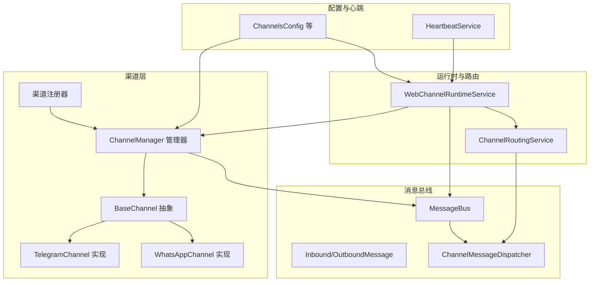
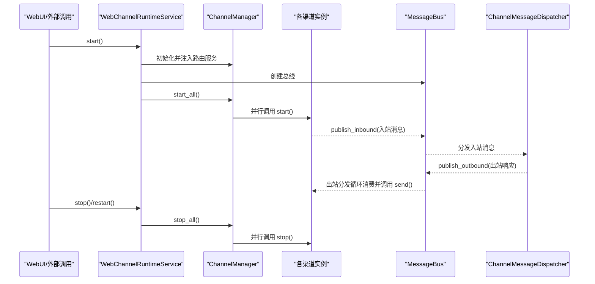
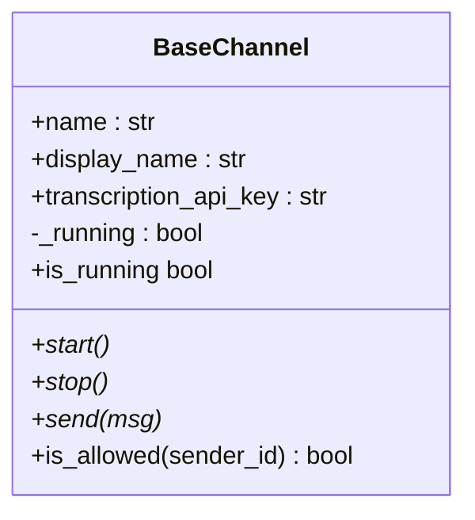
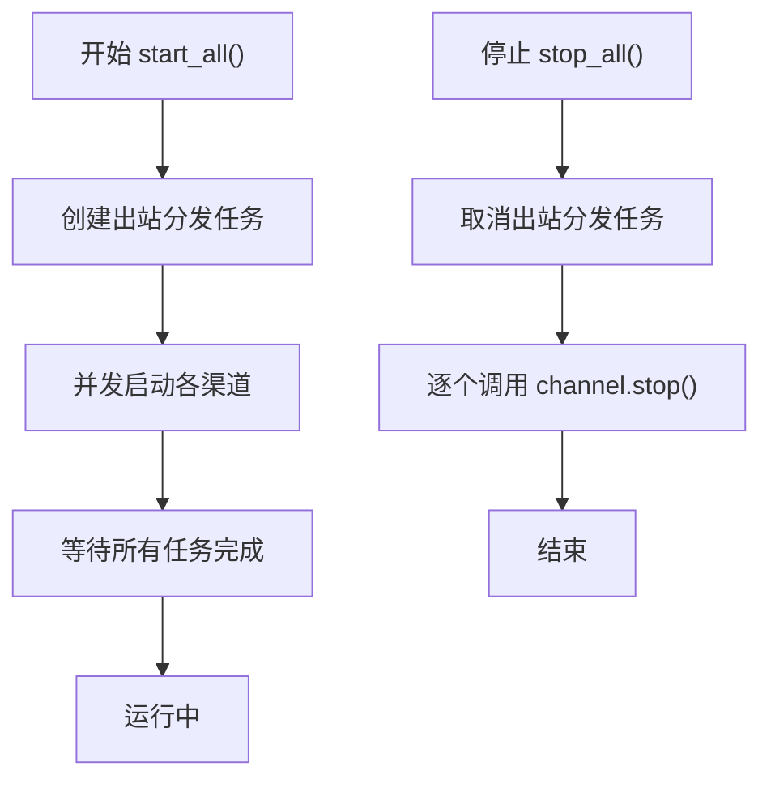
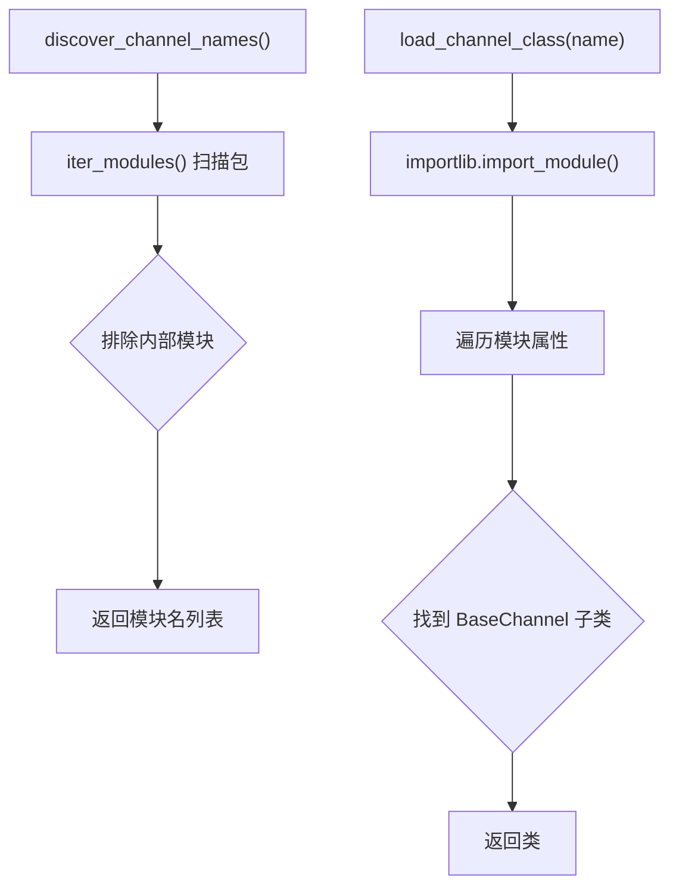
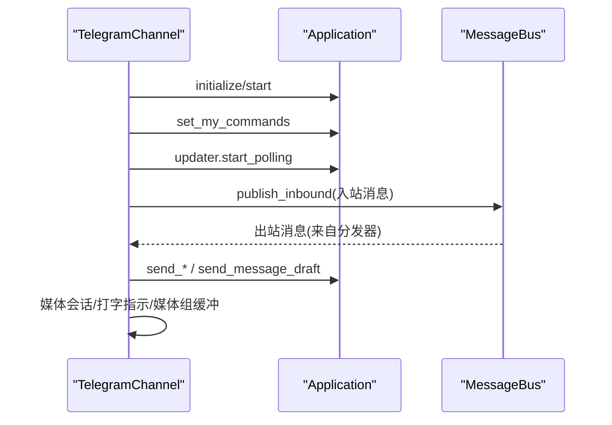
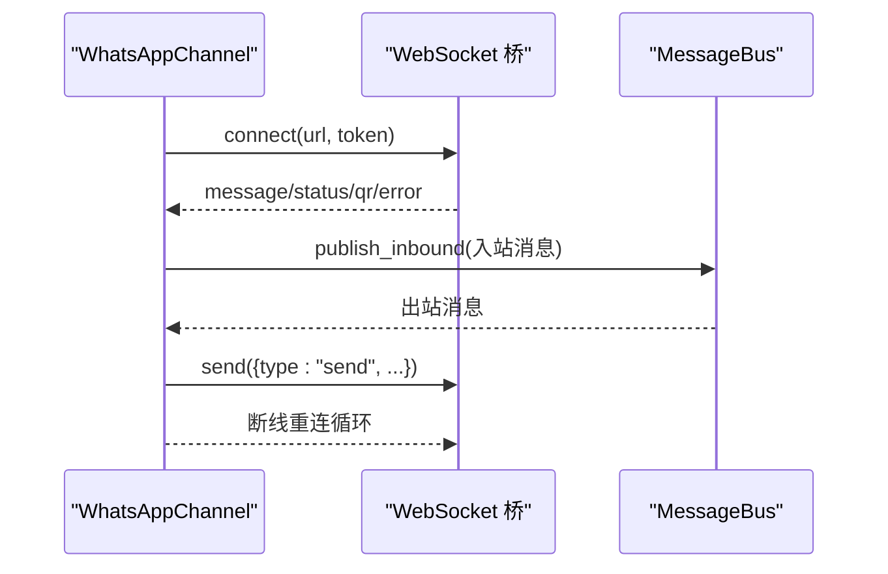
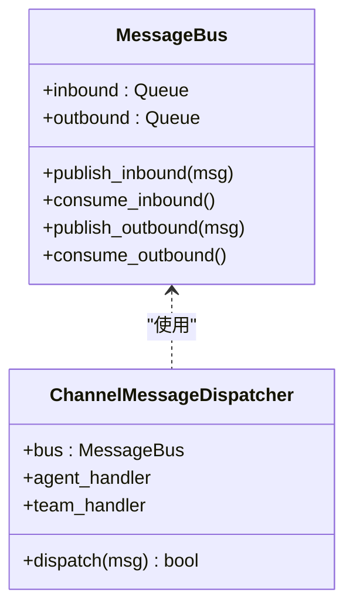
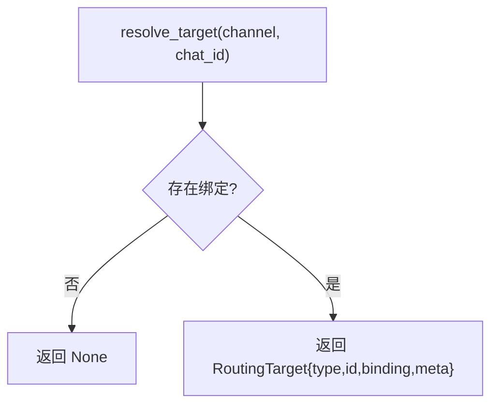
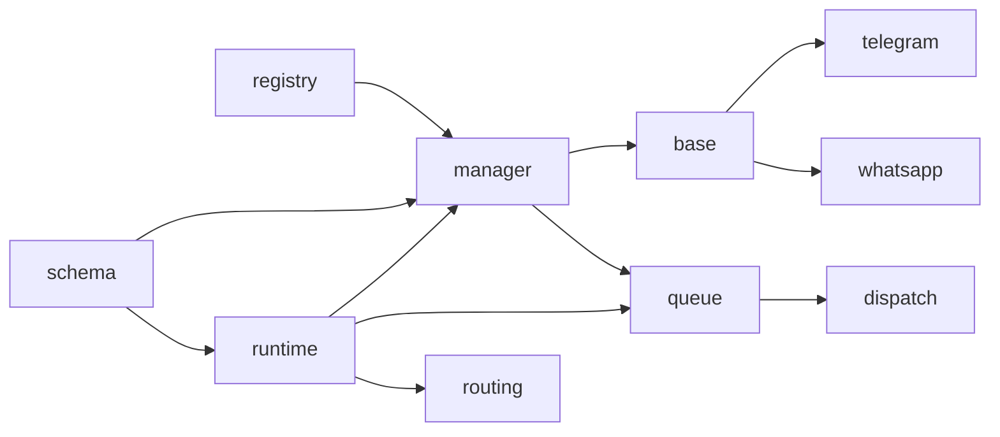

# 渠道生命周期管理

<cite>
**本文引用的文件**
- [nanobot/channels/base.py](file://nanobot/channels/base.py)
- [nanobot/channels/manager.py](file://nanobot/channels/manager.py)
- [nanobot/channels/registry.py](file://nanobot/channels/registry.py)
- [nanobot/channels/telegram.py](file://nanobot/channels/telegram.py)
- [nanobot/channels/whatsapp.py](file://nanobot/channels/whatsapp.py)
- [nanobot/channels/dispatch.py](file://nanobot/channels/dispatch.py)
- [nanobot/web/runtime_services/channel_runtime.py](file://nanobot/web/runtime_services/channel_runtime.py)
- [nanobot/web/runtime_services/channel_routing.py](file://nanobot/web/runtime_services/channel_routing.py)
- [nanobot/bus/events.py](file://nanobot/bus/events.py)
- [nanobot/bus/queue.py](file://nanobot/bus/queue.py)
- [nanobot/config/schema.py](file://nanobot/config/schema.py)
- [nanobot/heartbeat/service.py](file://nanobot/heartbeat/service.py)
</cite>

## 目录
1. [简介](#简介)
2. [项目结构](#项目结构)
3. [核心组件](#核心组件)
4. [架构总览](#架构总览)
5. [详细组件分析](#详细组件分析)
6. [依赖分析](#依赖分析)
7. [性能考虑](#性能考虑)
8. [故障排查指南](#故障排查指南)
9. [结论](#结论)
10. [附录](#附录)

## 简介
本文件系统化阐述 Nanobot 的“渠道生命周期管理”，覆盖从初始化、启动、运行、停止到销毁的全链路流程；解释资源分配、连接建立与状态同步；记录优雅关闭与异常处理；说明状态监控、健康检查与自动重启机制；给出故障恢复与降级策略；并展示不同渠道类型的生命周期差异与特殊处理。

## 项目结构
围绕渠道生命周期的关键模块包括：
- 渠道抽象与管理：channels/base.py、channels/manager.py、channels/registry.py
- 典型渠道实现：channels/telegram.py、channels/whatsapp.py
- 消息总线与分发：bus/events.py、bus/queue.py、channels/dispatch.py
- Web 运行时与路由：web/runtime_services/channel_runtime.py、web/runtime_services/channel_routing.py
- 配置模型：config/schema.py
- 健康心跳：heartbeat/service.py



图表来源
- [nanobot/channels/base.py:15-135](file://nanobot/channels/base.py#L15-L135)
- [nanobot/channels/manager.py:52-209](file://nanobot/channels/manager.py#L52-L209)
- [nanobot/channels/registry.py:15-36](file://nanobot/channels/registry.py#L15-L36)
- [nanobot/channels/telegram.py:150-736](file://nanobot/channels/telegram.py#L150-L736)
- [nanobot/channels/whatsapp.py:16-172](file://nanobot/channels/whatsapp.py#L16-L172)
- [nanobot/bus/events.py:8-39](file://nanobot/bus/events.py#L8-L39)
- [nanobot/bus/queue.py:8-45](file://nanobot/bus/queue.py#L8-L45)
- [nanobot/channels/dispatch.py:13-93](file://nanobot/channels/dispatch.py#L13-L93)
- [nanobot/web/runtime_services/channel_runtime.py:31-382](file://nanobot/web/runtime_services/channel_runtime.py#L31-L382)
- [nanobot/web/runtime_services/channel_routing.py:23-73](file://nanobot/web/runtime_services/channel_routing.py#L23-L73)
- [nanobot/config/schema.py:213-229](file://nanobot/config/schema.py#L213-L229)
- [nanobot/heartbeat/service.py:40-174](file://nanobot/heartbeat/service.py#L40-L174)

章节来源
- [nanobot/channels/base.py:15-135](file://nanobot/channels/base.py#L15-L135)
- [nanobot/channels/manager.py:52-209](file://nanobot/channels/manager.py#L52-L209)
- [nanobot/channels/registry.py:15-36](file://nanobot/channels/registry.py#L15-L36)
- [nanobot/web/runtime_services/channel_runtime.py:31-136](file://nanobot/web/runtime_services/channel_runtime.py#L31-L136)

## 核心组件
- BaseChannel 抽象类：定义渠道统一接口（start/stop/send）、权限校验、消息封装与运行态标记。
- ChannelManager 管理器：负责渠道发现、实例化、批量启动/停止、出站分发循环。
- 渠道实现（示例）：TelegramChannel（长轮询）、WhatsAppChannel（WebSocket）。
- MessageBus 总线：入站/出站队列解耦渠道与代理核心。
- ChannelMessageDispatcher 分发器：依据路由元数据将消息投递至目标代理或团队。
- WebChannelRuntimeService 运行时：在独立线程+事件循环中运行渠道与代理流水线。
- ChannelRoutingService 路由服务：基于绑定规则解析目标。
- 配置模型 ChannelsConfig：集中管理各渠道开关与行为参数。
- HeartbeatService 心跳：周期性触发任务决策与执行。

章节来源
- [nanobot/channels/base.py:15-135](file://nanobot/channels/base.py#L15-L135)
- [nanobot/channels/manager.py:52-209](file://nanobot/channels/manager.py#L52-L209)
- [nanobot/channels/telegram.py:150-736](file://nanobot/channels/telegram.py#L150-L736)
- [nanobot/channels/whatsapp.py:16-172](file://nanobot/channels/whatsapp.py#L16-L172)
- [nanobot/bus/queue.py:8-45](file://nanobot/bus/queue.py#L8-L45)
- [nanobot/channels/dispatch.py:13-93](file://nanobot/channels/dispatch.py#L13-L93)
- [nanobot/web/runtime_services/channel_runtime.py:31-136](file://nanobot/web/runtime_services/channel_runtime.py#L31-L136)
- [nanobot/web/runtime_services/channel_routing.py:23-73](file://nanobot/web/runtime_services/channel_routing.py#L23-L73)
- [nanobot/config/schema.py:213-229](file://nanobot/config/schema.py#L213-L229)
- [nanobot/heartbeat/service.py:40-174](file://nanobot/heartbeat/service.py#L40-L174)

## 架构总览
渠道生命周期贯穿“发现—实例化—启动—运行—停止—销毁”六个阶段。WebChannelRuntimeService 在专用事件循环中协调 ChannelManager 与 AgentLoop，ChannelManager 启动各渠道实现，渠道通过 MessageBus 将入站消息投递到分发器，分发器根据路由元数据将消息路由到具体代理或团队；出站消息由 ChannelManager 的出站分发循环取出并通过对应渠道发送。



图表来源
- [nanobot/web/runtime_services/channel_runtime.py:142-200](file://nanobot/web/runtime_services/channel_runtime.py#L142-L200)
- [nanobot/channels/manager.py:122-159](file://nanobot/channels/manager.py#L122-L159)
- [nanobot/bus/queue.py:20-34](file://nanobot/bus/queue.py#L20-L34)
- [nanobot/channels/dispatch.py:36-93](file://nanobot/channels/dispatch.py#L36-L93)

## 详细组件分析

### BaseChannel 抽象与权限控制
- 统一接口：start/stop/send；运行态标志；允许列表校验；入站消息封装与发布。
- 权限策略：默认空允许列表拒绝所有；支持通配符“*”放行；部分渠道可扩展为“id|username”匹配。
- 音频转写：可选 Groq Whisper 能力，失败时返回空字符串并告警。



图表来源
- [nanobot/channels/base.py:15-135](file://nanobot/channels/base.py#L15-L135)

章节来源
- [nanobot/channels/base.py:15-135](file://nanobot/channels/base.py#L15-L135)

### ChannelManager：渠道发现、启动与出站分发
- 发现与实例化：通过注册器扫描包内模块，按配置启用并实例化渠道，注入 Groq API Key。
- 启动：创建出站分发任务，再并发启动各渠道；等待所有任务完成（理论上永不返回）。
- 停止：取消出站分发任务，逐个调用渠道 stop 并捕获异常。
- 出站分发：从总线消费出站消息，按元数据过滤进度/工具提示，按渠道名选择发送。
- 状态查询：聚合各渠道 is_running 状态。



图表来源
- [nanobot/channels/manager.py:122-159](file://nanobot/channels/manager.py#L122-L159)

章节来源
- [nanobot/channels/manager.py:52-209](file://nanobot/channels/manager.py#L52-L209)

### 渠道注册器：零散列表的插件式发现
- 使用 pkgutil 扫描 channels 包，排除内部模块与子包，返回可用模块名。
- 动态导入模块并查找继承自 BaseChannel 的子类作为渠道实现。



图表来源
- [nanobot/channels/registry.py:15-36](file://nanobot/channels/registry.py#L15-L36)

章节来源
- [nanobot/channels/registry.py:15-36](file://nanobot/channels/registry.py#L15-L36)

### TelegramChannel：长轮询与媒体处理
- 启动：构建 Application（含连接池参数），注册命令与消息处理器，初始化/启动应用，设置命令菜单，开启轮询。
- 停止：置运行标志为 False，取消打字指示、媒体组任务，停止/关闭 updater/应用。
- 发送：区分最终响应与进度流式；支持图片/语音/音频/文档发送；支持回复原消息与话题线程。
- 入站：处理文本/媒体/语音；下载媒体并可触发转写；聚合媒体组消息；维护会话键（私聊/话题）。



图表来源
- [nanobot/channels/telegram.py:199-281](file://nanobot/channels/telegram.py#L199-L281)
- [nanobot/channels/telegram.py:294-413](file://nanobot/channels/telegram.py#L294-L413)
- [nanobot/channels/telegram.py:553-666](file://nanobot/channels/telegram.py#L553-L666)

章节来源
- [nanobot/channels/telegram.py:150-736](file://nanobot/channels/telegram.py#L150-L736)

### WhatsAppChannel：WebSocket 桥接与自动重连
- 启动：连接桥接 WebSocket，发送认证令牌（如配置），进入消息循环；断线自动重连。
- 停止：置运行/连接标志为 False，关闭 WS。
- 发送：向桥接发送 send 消息。
- 入站：解析桥接消息类型，去重、提取媒体路径、构建内容标签并转发入站。



图表来源
- [nanobot/channels/whatsapp.py:34-80](file://nanobot/channels/whatsapp.py#L34-L80)
- [nanobot/channels/whatsapp.py:97-172](file://nanobot/channels/whatsapp.py#L97-L172)

章节来源
- [nanobot/channels/whatsapp.py:16-172](file://nanobot/channels/whatsapp.py#L16-L172)

### 消息总线与分发
- MessageBus：入站/出站异步队列，提供发布/消费接口与队列长度查询。
- ChannelMessageDispatcher：读取消息元数据中的路由目标类型与 ID，调用相应处理器（代理/团队），并将响应回写到出站队列。



图表来源
- [nanobot/bus/queue.py:8-45](file://nanobot/bus/queue.py#L8-L45)
- [nanobot/channels/dispatch.py:13-93](file://nanobot/channels/dispatch.py#L13-L93)

章节来源
- [nanobot/bus/queue.py:8-45](file://nanobot/bus/queue.py#L8-L45)
- [nanobot/channels/dispatch.py:13-93](file://nanobot/channels/dispatch.py#L13-L93)

### WebChannelRuntimeService：后台线程与事件循环
- 在独立线程中创建 asyncio 事件循环，避免阻塞主 Web 服务。
- 启动：构建路由服务、消息总线、代理循环与渠道管理器，协程并发运行。
- 停止：停止代理、停止渠道管理器，取消并等待所有任务，关闭事件循环与线程。
- 状态：返回运行态、已启用渠道列表与各渠道运行状态。

```mermaid
sequenceDiagram
participant SVC as "WebChannelRuntimeService"
participant LOOP as "事件循环"
participant CM as "ChannelManager"
participant AG as "AgentLoop"
SVC->>LOOP : 新建事件循环并启动
SVC->>LOOP : 调度 _start_pipeline()
LOOP->>CM : start_all()
LOOP->>AG : run()
SVC->>LOOP : 调度 _stop_pipeline()
LOOP->>CM : stop_all()
LOOP->>AG : stop/close_mcp()
```

图表来源
- [nanobot/web/runtime_services/channel_runtime.py:48-136](file://nanobot/web/runtime_services/channel_runtime.py#L48-L136)
- [nanobot/web/runtime_services/channel_runtime.py:142-200](file://nanobot/web/runtime_services/channel_runtime.py#L142-L200)

章节来源
- [nanobot/web/runtime_services/channel_runtime.py:31-382](file://nanobot/web/runtime_services/channel_runtime.py#L31-L382)

### ChannelRoutingService：绑定驱动的路由
- 解析入站消息的渠道名与聊天 ID，定位绑定；若存在则返回目标类型/ID/绑定 ID 与元数据。
- 与 _RoutingBusProxy 协作，在入站消息上注入路由元数据，便于下游分发。



图表来源
- [nanobot/web/runtime_services/channel_routing.py:38-73](file://nanobot/web/runtime_services/channel_routing.py#L38-L73)

章节来源
- [nanobot/web/runtime_services/channel_routing.py:13-73](file://nanobot/web/runtime_services/channel_routing.py#L13-L73)

### 配置模型：ChannelsConfig 与各渠道参数
- ChannelsConfig：统一开关与行为参数（如是否发送进度/工具提示）。
- 各渠道配置类（TelegramConfig、WhatsAppConfig 等）：token/proxy/group_policy/allow_from 等。
- ChannelManager 在初始化时读取配置并注入渠道实例。

章节来源
- [nanobot/config/schema.py:213-229](file://nanobot/config/schema.py#L213-L229)
- [nanobot/config/schema.py:26-37](file://nanobot/config/schema.py#L26-L37)
- [nanobot/config/schema.py:17-24](file://nanobot/config/schema.py#L17-L24)
- [nanobot/channels/manager.py:86-105](file://nanobot/channels/manager.py#L86-L105)

### 健康检查与自动重启
- HeartbeatService：周期性读取工作区中的 HEARTBEAT.md，通过虚拟工具调用判定是否需要执行任务；当决定执行时回调 on_execute，并可通知 on_notify。
- WebChannelRuntimeService：提供 restart 接口，用于配置变更后重建整个渠道流水线。

章节来源
- [nanobot/heartbeat/service.py:40-174](file://nanobot/heartbeat/service.py#L40-L174)
- [nanobot/web/runtime_services/channel_runtime.py:124-128](file://nanobot/web/runtime_services/channel_runtime.py#L124-L128)

## 依赖分析
- 渠道层依赖：BaseChannel 为所有实现提供统一契约；ChannelManager 依赖注册器进行动态发现；各渠道实现依赖平台 SDK（如 telegram、websockets）。
- 总线与分发：MessageBus 作为解耦点；ChannelMessageDispatcher 依赖路由服务提供的目标信息。
- 运行时：WebChannelRuntimeService 依赖 ChannelManager 与 AgentLoop，二者均依赖 MessageBus。
- 配置：ChannelManager 与运行时均读取 ChannelsConfig 以决定行为。



图表来源
- [nanobot/channels/registry.py:26-36](file://nanobot/channels/registry.py#L26-L36)
- [nanobot/channels/manager.py:86-105](file://nanobot/channels/manager.py#L86-L105)
- [nanobot/bus/queue.py:8-45](file://nanobot/bus/queue.py#L8-L45)
- [nanobot/channels/dispatch.py:13-93](file://nanobot/channels/dispatch.py#L13-L93)
- [nanobot/web/runtime_services/channel_runtime.py:174-176](file://nanobot/web/runtime_services/channel_runtime.py#L174-L176)
- [nanobot/web/runtime_services/channel_routing.py:23-73](file://nanobot/web/runtime_services/channel_routing.py#L23-L73)
- [nanobot/config/schema.py:213-229](file://nanobot/config/schema.py#L213-L229)

章节来源
- [nanobot/channels/registry.py:15-36](file://nanobot/channels/registry.py#L15-L36)
- [nanobot/channels/manager.py:86-105](file://nanobot/channels/manager.py#L86-L105)
- [nanobot/bus/queue.py:8-45](file://nanobot/bus/queue.py#L8-L45)
- [nanobot/channels/dispatch.py:13-93](file://nanobot/channels/dispatch.py#L13-L93)
- [nanobot/web/runtime_services/channel_runtime.py:174-176](file://nanobot/web/runtime_services/channel_runtime.py#L174-L176)
- [nanobot/web/runtime_services/channel_routing.py:23-73](file://nanobot/web/runtime_services/channel_routing.py#L23-L73)
- [nanobot/config/schema.py:213-229](file://nanobot/config/schema.py#L213-L229)

## 性能考虑
- 连接池与超时：TelegramChannel 使用较大的连接池大小与较长的超时参数，降低长时间运行时的连接池耗尽风险。
- 出站分发循环：ChannelManager 的出站分发采用超时等待与取消保护，避免阻塞。
- 事件循环隔离：WebChannelRuntimeService 在独立线程中运行，防止阻塞主 Web 服务。
- 媒体处理：TelegramChannel 对媒体下载与转写进行异步处理与错误兜底，避免阻塞消息流转。
- 路由与分发：ChannelRoutingService 与 _RoutingBusProxy 将路由决策前置，减少下游重复计算。

章节来源
- [nanobot/channels/telegram.py:207-215](file://nanobot/channels/telegram.py#L207-L215)
- [nanobot/channels/manager.py:160-190](file://nanobot/channels/manager.py#L160-L190)
- [nanobot/web/runtime_services/channel_runtime.py:68-98](file://nanobot/web/runtime_services/channel_runtime.py#L68-L98)
- [nanobot/channels/telegram.py:600-627](file://nanobot/channels/telegram.py#L600-L627)

## 故障排查指南
- 渠道启动失败
  - 检查配置开关与必要字段（如 Telegram token、WhatsApp bridge_url）。
  - 查看 ChannelManager 的启动日志与异常捕获。
- 渠道停止异常
  - 确认 stop 流程是否被中断或抛出异常；确保出站分发任务被取消。
- 出站消息未送达
  - 检查 ChannelManager 出站分发循环是否运行；确认消息元数据过滤条件（进度/工具提示）。
- 路由不生效
  - 确认 ChannelRoutingService 是否解析到绑定；检查 _RoutingBusProxy 是否正确注入元数据。
- 健康检查未触发
  - 检查 HeartbeatService 是否启用、间隔是否合理、HEARTBEAT.md 是否存在且可读。
- 自动重启无效
  - 确认 WebChannelRuntimeService 的 restart 是否被调用；检查事件循环是否正常运行。

章节来源
- [nanobot/channels/manager.py:115-159](file://nanobot/channels/manager.py#L115-L159)
- [nanobot/web/runtime_services/channel_runtime.py:100-136](file://nanobot/web/runtime_services/channel_runtime.py#L100-L136)
- [nanobot/heartbeat/service.py:108-174](file://nanobot/heartbeat/service.py#L108-L174)

## 结论
Nanobot 的渠道生命周期管理以“插件式发现 + 统一抽象 + 异步总线 + 事件循环隔离”为核心设计，实现了高扩展、低耦合与可观测的渠道运行体系。通过 ChannelManager 与 WebChannelRuntimeService 的配合，渠道启动/停止具备良好的并发与优雅关闭能力；结合路由与分发机制，消息流转清晰可控；借助心跳与状态查询，系统具备健康检查与自动重启的基础能力。针对不同渠道（长轮询 vs WebSocket），在连接建立、资源清理与异常处理上各有侧重，但均遵循统一生命周期范式。

## 附录

### 生命周期阶段与关键动作
- 初始化
  - 注册器扫描渠道模块并加载实现类。
  - ChannelManager 读取配置，实例化渠道并注入公共资源（如 Groq API Key）。
- 启动
  - 创建出站分发任务；并发启动各渠道；渠道各自建立平台连接。
- 运行
  - 入站消息经渠道封装后发布到总线；分发器按路由目标投递；出站消息由分发循环取出并通过渠道发送。
- 停止
  - 取消出站分发任务；逐个渠道执行 stop（取消打字/媒体组任务、关闭连接等）。
- 销毁
  - 释放渠道对象与事件循环资源；线程安全退出。

章节来源
- [nanobot/channels/registry.py:15-36](file://nanobot/channels/registry.py#L15-L36)
- [nanobot/channels/manager.py:86-159](file://nanobot/channels/manager.py#L86-L159)
- [nanobot/web/runtime_services/channel_runtime.py:142-200](file://nanobot/web/runtime_services/channel_runtime.py#L142-L200)

### 不同渠道类型的生命周期差异
- TelegramChannel
  - 长轮询模式，启动时初始化/启动应用并设置命令菜单；停止时关闭 updater/应用。
  - 支持媒体组聚合、打字指示、会话键派生（私聊/话题）。
- WhatsAppChannel
  - WebSocket 桥接模式，启动时连接桥并自动重连；停止时关闭 WS。
  - 支持消息去重、媒体路径解析与内容标签拼接。

章节来源
- [nanobot/channels/telegram.py:199-281](file://nanobot/channels/telegram.py#L199-L281)
- [nanobot/channels/telegram.py:668-706](file://nanobot/channels/telegram.py#L668-L706)
- [nanobot/channels/whatsapp.py:34-80](file://nanobot/channels/whatsapp.py#L34-L80)
- [nanobot/channels/whatsapp.py:97-172](file://nanobot/channels/whatsapp.py#L97-L172)