# 渠道管理

<cite>
**本文引用的文件**
- [channels/__init__.py](file://nanobot/channels/__init__.py)
- [channels/base.py](file://nanobot/channels/base.py)
- [channels/manager.py](file://nanobot/channels/manager.py)
- [channels/dispatch.py](file://nanobot/channels/dispatch.py)
- [channels/registry.py](file://nanobot/channels/registry.py)
- [channels/telegram.py](file://nanobot/channels/telegram.py)
- [channels/whatsapp.py](file://nanobot/channels/whatsapp.py)
- [bus/events.py](file://nanobot/bus/events.py)
- [bus/queue.py](file://nanobot/bus/queue.py)
- [web/runtime_services/channel_routing.py](file://nanobot/web/runtime_services/channel_routing.py)
- [platform/channel_bindings/models.py](file://nanobot/platform/channel_bindings/models.py)
- [platform/channel_bindings/service.py](file://nanobot/platform/channel_bindings/service.py)
- [config/schema.py](file://nanobot/config/schema.py)
- [tests/test_channel_dispatch.py](file://tests/test_channel_dispatch.py)
- [tests/test_channel_routing_e2e.py](file://tests/test_channel_routing_e2e.py)
</cite>

## 目录
1. [引言](#引言)
2. [项目结构](#项目结构)
3. [核心组件](#核心组件)
4. [架构总览](#架构总览)
5. [详细组件分析](#详细组件分析)
6. [依赖分析](#依赖分析)
7. [性能考量](#性能考量)
8. [故障排查指南](#故障排查指南)
9. [结论](#结论)
10. [附录：实现与扩展指南](#附录实现与扩展指南)

## 引言
本文件系统性阐述 Nanobot 的渠道（Channel）管理体系，覆盖渠道架构设计、渠道注册机制、消息路由策略、事件处理与异步处理模式，并提供新增渠道的接口规范、配置要求、测试方法与最佳实践。文档同时解释渠道间的消息传递与状态同步策略，帮助开发者快速理解并扩展多平台消息通道。

## 项目结构
Nanobot 的渠道子系统位于 nanobot/channels 包中，采用“插件式自动发现 + 基类抽象 + 消息总线解耦”的架构：
- 渠道基类定义统一接口，具体平台（如 Telegram、WhatsApp）实现各自 start/stop/send 逻辑
- 渠道管理器负责初始化、启动/停止所有已启用渠道，并协调出站消息分发
- 消息总线在入站与出站方向解耦渠道与业务处理
- 路由服务通过绑定表将入站消息定向到指定代理或团队
- 配置模型集中定义各渠道参数与行为开关

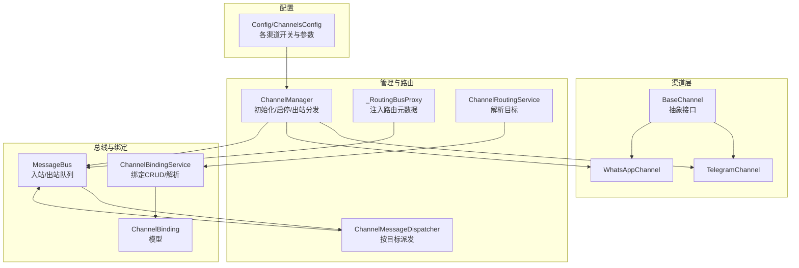

图表来源
- [channels/base.py:15-135](file://nanobot/channels/base.py#L15-L135)
- [channels/manager.py:52-209](file://nanobot/channels/manager.py#L52-L209)
- [channels/dispatch.py:13-93](file://nanobot/channels/dispatch.py#L13-L93)
- [web/runtime_services/channel_routing.py:23-73](file://nanobot/web/runtime_services/channel_routing.py#L23-L73)
- [platform/channel_bindings/service.py:28-201](file://nanobot/platform/channel_bindings/service.py#L28-L201)
- [platform/channel_bindings/models.py:15-69](file://nanobot/platform/channel_bindings/models.py#L15-L69)
- [bus/queue.py:8-45](file://nanobot/bus/queue.py#L8-L45)
- [config/schema.py:213-229](file://nanobot/config/schema.py#L213-L229)

章节来源
- [channels/__init__.py:1-7](file://nanobot/channels/__init__.py#L1-L7)
- [channels/registry.py:15-36](file://nanobot/channels/registry.py#L15-L36)

## 核心组件
- BaseChannel：定义渠道通用接口（start/stop/send）、权限校验、入站消息封装与转发至消息总线
- ChannelManager：自动发现并初始化已启用渠道；启动出站分发任务；统一启停
- ChannelMessageDispatcher：依据路由元数据将入站消息派发给代理或团队处理器
- _RoutingBusProxy：在入站消息上注入路由目标类型/ID/绑定ID等元数据
- ChannelRoutingService：根据频道名与聊天ID解析绑定目标
- MessageBus：入站/出站异步队列，解耦渠道与业务处理
- ChannelBindingService/ChannelBinding：绑定持久化与解析，支持精确匹配与通配符回退
- 配置模型：ChannelsConfig 及各平台配置类，控制渠道开关、行为与凭据

章节来源
- [channels/base.py:15-135](file://nanobot/channels/base.py#L15-L135)
- [channels/manager.py:52-209](file://nanobot/channels/manager.py#L52-L209)
- [channels/dispatch.py:13-93](file://nanobot/channels/dispatch.py#L13-L93)
- [web/runtime_services/channel_routing.py:23-73](file://nanobot/web/runtime_services/channel_routing.py#L23-L73)
- [platform/channel_bindings/service.py:28-201](file://nanobot/platform/channel_bindings/service.py#L28-L201)
- [platform/channel_bindings/models.py:15-69](file://nanobot/platform/channel_bindings/models.py#L15-L69)
- [bus/queue.py:8-45](file://nanobot/bus/queue.py#L8-L45)
- [config/schema.py:213-229](file://nanobot/config/schema.py#L213-L229)

## 架构总览
下图展示从入站消息到目标执行再到出站响应的完整链路，以及渠道管理器的出站分发循环。

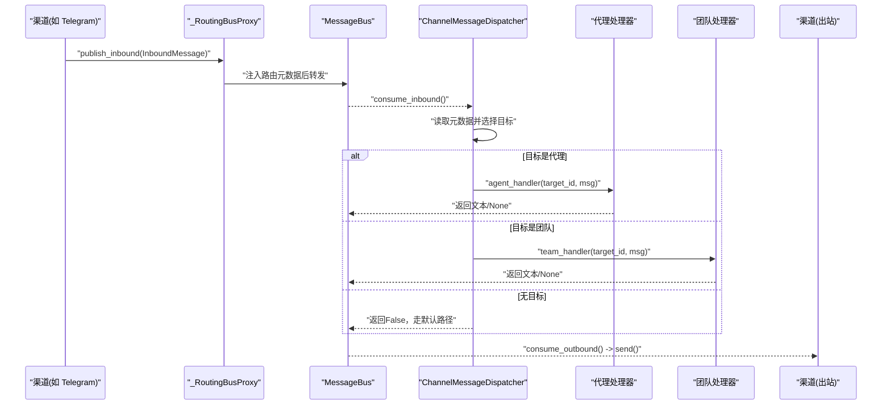

图表来源
- [channels/manager.py:160-190](file://nanobot/channels/manager.py#L160-L190)
- [channels/dispatch.py:36-93](file://nanobot/channels/dispatch.py#L36-L93)
- [web/runtime_services/channel_routing.py:38-73](file://nanobot/web/runtime_services/channel_routing.py#L38-L73)
- [bus/queue.py:20-34](file://nanobot/bus/queue.py#L20-L34)

## 详细组件分析

### BaseChannel 抽象与权限控制
- 统一接口：start（长连接/轮询）、stop、send
- 权限校验：is_allowed 支持空列表拒绝全部、星号允许全部、或白名单匹配
- 入站桥接：_handle_message 将原始内容封装为 InboundMessage 并发布到总线
- 音频转写：可选调用 Groq 提供的转写能力

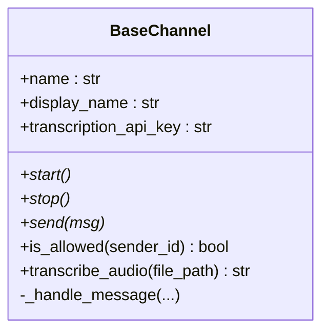

图表来源
- [channels/base.py:15-135](file://nanobot/channels/base.py#L15-L135)

章节来源
- [channels/base.py:15-135](file://nanobot/channels/base.py#L15-L135)

### ChannelManager 管理与出站分发
- 自动发现：通过包扫描发现可用渠道模块，按配置启用
- 初始化：为每个启用渠道实例化，注入统一的路由代理或直接使用总线
- 启停：并发启动所有渠道；停止时取消出站分发任务并逐个停止渠道
- 出站分发：持续从总线消费出站消息，按消息中的 channel 字段投递到对应渠道

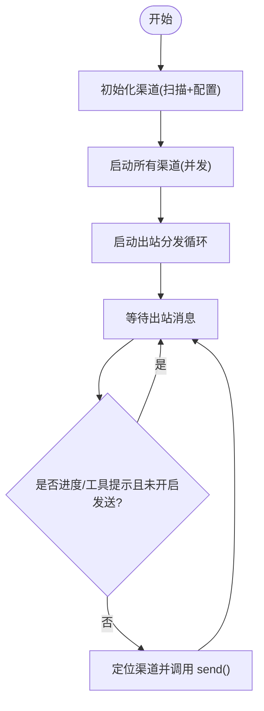

图表来源
- [channels/manager.py:122-190](file://nanobot/channels/manager.py#L122-L190)

章节来源
- [channels/manager.py:52-209](file://nanobot/channels/manager.py#L52-L209)

### ChannelMessageDispatcher 路由派发
- 依据消息元数据中的 _routing_target_type/_routing_target_id 决策
- 支持代理与团队两类目标；未配置处理器时回退错误提示
- 异常捕获并输出标准化错误消息

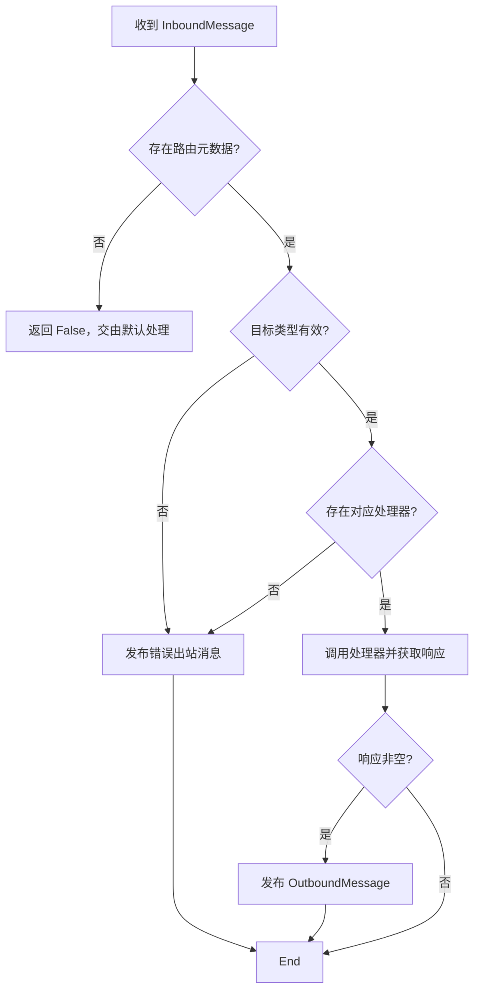

图表来源
- [channels/dispatch.py:36-93](file://nanobot/channels/dispatch.py#L36-L93)

章节来源
- [channels/dispatch.py:13-93](file://nanobot/channels/dispatch.py#L13-L93)

### _RoutingBusProxy 与 ChannelRoutingService
- _RoutingBusProxy 在 publish_inbound 时调用路由服务解析目标，向消息元数据注入 _routing_target_type/_routing_target_id/_routing_binding_id
- ChannelRoutingService 优先精确匹配，其次通配符回退；返回 None 表示无绑定

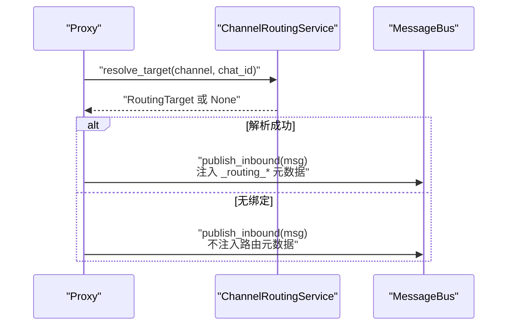

图表来源
- [channels/manager.py:38-47](file://nanobot/channels/manager.py#L38-L47)
- [web/runtime_services/channel_routing.py:38-73](file://nanobot/web/runtime_services/channel_routing.py#L38-L73)

章节来源
- [channels/manager.py:19-50](file://nanobot/channels/manager.py#L19-L50)
- [web/runtime_services/channel_routing.py:23-73](file://nanobot/web/runtime_services/channel_routing.py#L23-L73)

### ChannelBindingService 与 ChannelBinding
- 支持创建/查询/更新/删除绑定；解析时精确匹配优先于通配符
- 校验目标类型与目标存在性；生成唯一绑定ID；持久化元数据

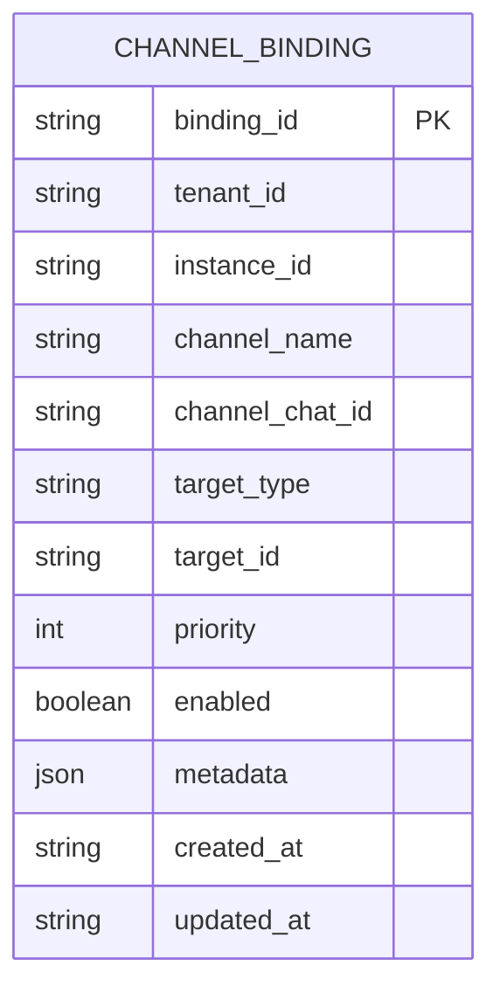

图表来源
- [platform/channel_bindings/models.py:15-69](file://nanobot/platform/channel_bindings/models.py#L15-L69)
- [platform/channel_bindings/service.py:28-201](file://nanobot/platform/channel_bindings/service.py#L28-L201)

章节来源
- [platform/channel_bindings/service.py:28-201](file://nanobot/platform/channel_bindings/service.py#L28-L201)
- [platform/channel_bindings/models.py:15-69](file://nanobot/platform/channel_bindings/models.py#L15-L69)

### 入站消息模型与总线
- InboundMessage：包含渠道、发送者、聊天ID、内容、时间戳、媒体列表、元数据与会话键
- OutboundMessage：包含目标渠道、聊天ID、内容、回复信息与媒体
- MessageBus：提供 publish/consume 的异步队列接口

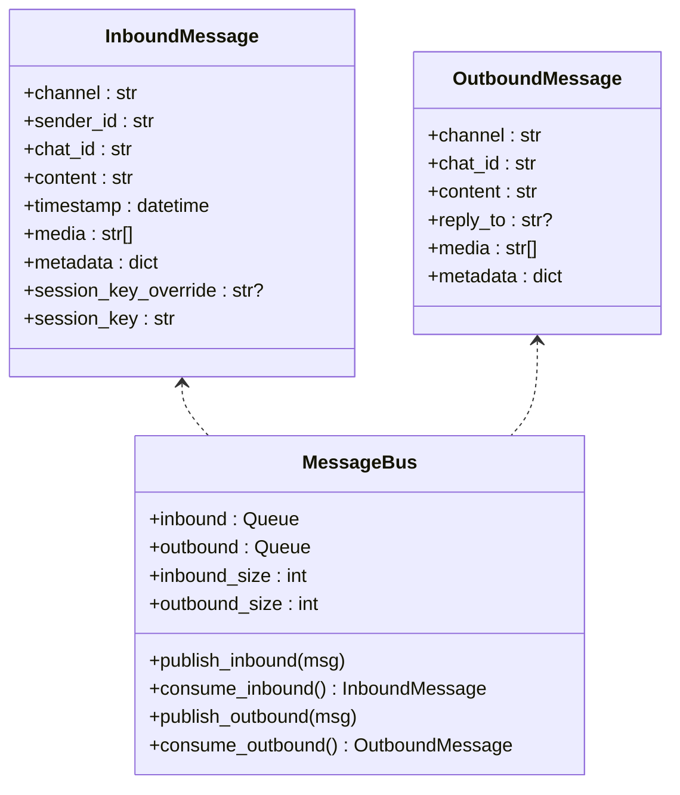

图表来源
- [bus/events.py:8-39](file://nanobot/bus/events.py#L8-L39)
- [bus/queue.py:8-45](file://nanobot/bus/queue.py#L8-L45)

章节来源
- [bus/events.py:8-39](file://nanobot/bus/events.py#L8-L39)
- [bus/queue.py:8-45](file://nanobot/bus/queue.py#L8-L45)

### 具体渠道实现示例

#### TelegramChannel
- 使用长轮询监听消息，支持命令、文本、图片、语音、音频、文档
- Markdown 到 Telegram HTML 转换，媒体组聚合，打字指示，话题线程上下文记忆
- 支持群组策略（提及/回复/开放），允许/拒绝访问控制
- 发送时拆分超长文本，支持进度流式模拟与最终持久化

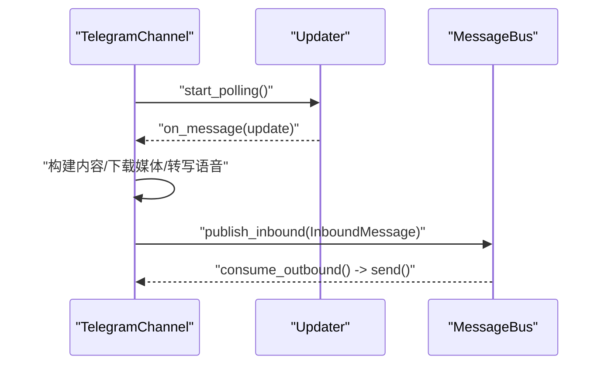

图表来源
- [channels/telegram.py:199-281](file://nanobot/channels/telegram.py#L199-L281)
- [channels/telegram.py:553-666](file://nanobot/channels/telegram.py#L553-L666)
- [channels/telegram.py:294-413](file://nanobot/channels/telegram.py#L294-L413)

章节来源
- [channels/telegram.py:150-736](file://nanobot/channels/telegram.py#L150-L736)

#### WhatsAppChannel（Node.js 桥）
- 通过 WebSocket 连接 Node.js 桥，认证令牌可选
- 接收消息时去重、提取媒体标签、注入元数据
- 发送时将文本消息推送到桥端

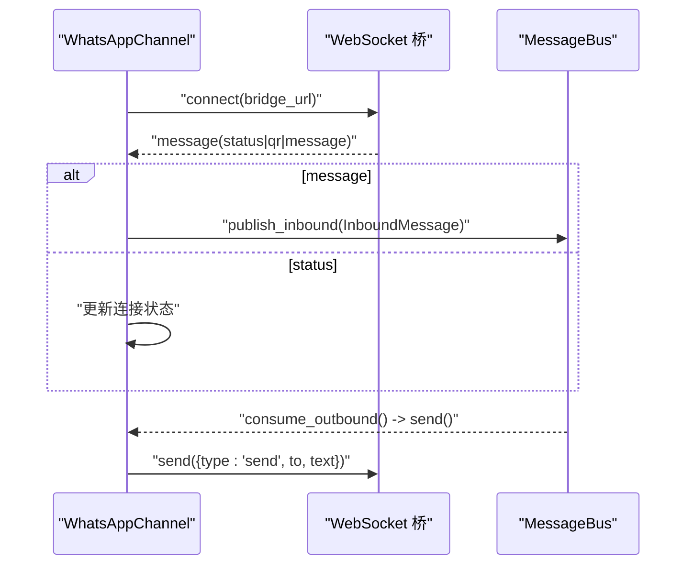

图表来源
- [channels/whatsapp.py:34-80](file://nanobot/channels/whatsapp.py#L34-L80)
- [channels/whatsapp.py:97-172](file://nanobot/channels/whatsapp.py#L97-L172)

章节来源
- [channels/whatsapp.py:16-172](file://nanobot/channels/whatsapp.py#L16-L172)

### 渠道注册机制
- 自动发现：通过包扫描枚举模块名，排除内部模块与子包
- 动态加载：导入模块并查找继承自 BaseChannel 的具体类
- 配置驱动：仅启用配置中 enabled=true 的渠道

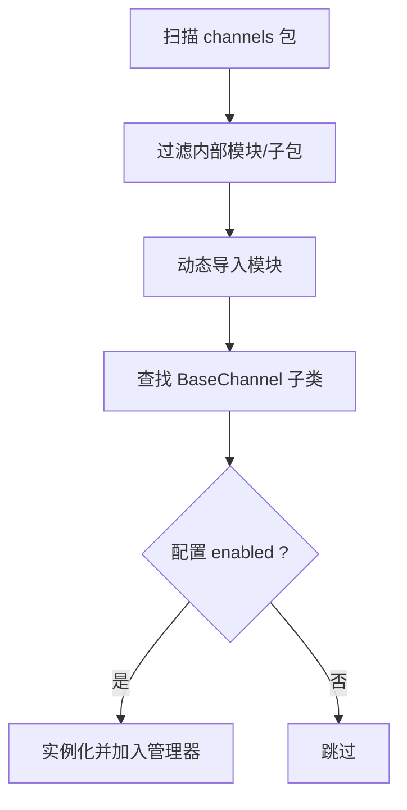

图表来源
- [channels/registry.py:15-36](file://nanobot/channels/registry.py#L15-L36)
- [channels/manager.py:86-105](file://nanobot/channels/manager.py#L86-L105)

章节来源
- [channels/registry.py:15-36](file://nanobot/channels/registry.py#L15-L36)
- [channels/manager.py:86-105](file://nanobot/channels/manager.py#L86-L105)

## 依赖分析
- 渠道层依赖消息总线进行解耦；部分渠道依赖外部 SDK（如 Telegram python-telegram-bot、Node.js 桥）
- 渠道管理器依赖配置模型与路由服务；路由服务依赖绑定存储
- 测试覆盖了路由元数据注入、派发逻辑、异常处理与端到端流水线

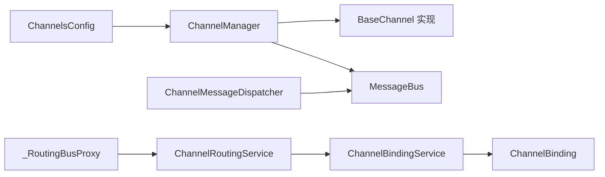

图表来源
- [config/schema.py:213-229](file://nanobot/config/schema.py#L213-L229)
- [channels/manager.py:62-84](file://nanobot/channels/manager.py#L62-L84)
- [web/runtime_services/channel_routing.py:23-73](file://nanobot/web/runtime_services/channel_routing.py#L23-L73)
- [platform/channel_bindings/service.py:28-201](file://nanobot/platform/channel_bindings/service.py#L28-L201)

章节来源
- [tests/test_channel_dispatch.py:20-144](file://tests/test_channel_dispatch.py#L20-L144)
- [tests/test_channel_routing_e2e.py:39-495](file://tests/test_channel_routing_e2e.py#L39-L495)

## 性能考量
- 异步与并发：ChannelManager 并发启动所有渠道；出站分发循环以超时等待避免阻塞
- 队列容量：MessageBus 使用 asyncio.Queue，建议结合上游渠道速率与下游处理器吞吐设置合理的缓冲
- 文本拆分：Telegram 发送侧对超长文本进行拆分，减少单次失败影响
- 资源回收：停止时取消打字任务、关闭媒体组任务、释放连接与句柄
- 路由开销：路由解析为内存操作，绑定数量增长时建议优化存储索引与缓存

## 故障排查指南
- 渠道无法启动
  - 检查配置中 enabled 与必要字段（如 Telegram token、WhatsApp bridge_url）
  - 查看启动日志中的错误堆栈
- 权限问题
  - allow_from 为空会导致全部拒绝；设置为 "*" 允许所有人
  - Telegram 支持旧格式 id|username 白名单匹配
- 路由未生效
  - 确认绑定是否存在且 enabled；精确匹配优先于通配符
  - 检查 _RoutingBusProxy 是否注入了 _routing_* 元数据
- 出站消息未送达
  - 检查 ChannelManager 的出站分发循环是否运行
  - 确认目标渠道名称与消息 channel 字段一致
- 单元与端到端测试参考
  - 路由派发行为与错误处理：见测试用例
  - 完整流水线（绑定创建/解析/派发/出站）：见端到端测试

章节来源
- [channels/manager.py:115-159](file://nanobot/channels/manager.py#L115-L159)
- [channels/base.py:79-87](file://nanobot/channels/base.py#L79-L87)
- [tests/test_channel_dispatch.py:20-144](file://tests/test_channel_dispatch.py#L20-L144)
- [tests/test_channel_routing_e2e.py:297-495](file://tests/test_channel_routing_e2e.py#L297-L495)

## 结论
Nanobot 的渠道体系通过“插件式注册 + 基类抽象 + 消息总线 + 绑定路由”实现了高内聚、低耦合的多平台消息通道管理。借助清晰的接口与完善的测试，开发者可以快速集成新渠道并稳定地进行消息路由与状态同步。

## 附录：实现与扩展指南

### 新增渠道集成步骤
- 创建文件 nanobot/channels/<your_channel>.py，实现继承 BaseChannel 的类
  - 必须实现 start/stop/send；在 start 中建立与平台的连接/监听
  - 在入站回调中调用 _handle_message 封装并发布消息
  - 在出站 send 中将 OutboundMessage 渲染为平台消息
- 在配置 schema 中添加对应配置类（参考 ChannelsConfig 与各平台配置）
- 如需路由绑定，请确保消息元数据包含必要的标识（如 message_id、thread_id 等）
- 编写单元测试，验证：
  - 渠道启停与错误处理
  - 权限控制与入站消息封装
  - 出站发送与媒体处理
  - 与路由系统的交互（可复用现有测试思路）

章节来源
- [channels/base.py:52-77](file://nanobot/channels/base.py#L52-L77)
- [config/schema.py:17-37](file://nanobot/config/schema.py#L17-L37)
- [tests/test_channel_dispatch.py:20-144](file://tests/test_channel_dispatch.py#L20-L144)
- [tests/test_channel_routing_e2e.py:297-495](file://tests/test_channel_routing_e2e.py#L297-L495)

### 接口规范与配置要点
- BaseChannel 接口
  - start/stop/send：生命周期与消息发送
  - is_allowed：访问控制
  - _handle_message：入站消息封装与发布
- 渠道配置
  - ChannelsConfig 控制 send_progress/send_tool_hints 等行为开关
  - 各平台配置类包含 token/URL/代理/策略等字段
- 路由绑定
  - ChannelBindingService 支持创建/更新/删除/解析
  - 精确匹配优先于通配符；禁用绑定不会注入路由元数据

章节来源
- [channels/base.py:79-130](file://nanobot/channels/base.py#L79-L130)
- [config/schema.py:213-229](file://nanobot/config/schema.py#L213-L229)
- [platform/channel_bindings/service.py:99-142](file://nanobot/platform/channel_bindings/service.py#L99-L142)
- [web/runtime_services/channel_routing.py:38-73](file://nanobot/web/runtime_services/channel_routing.py#L38-L73)

### 最佳实践与安全考虑
- 访问控制
  - 默认拒绝（allow_from 为空）；明确列出允许用户/号码
  - Telegram 支持 id|username 的兼容匹配
- 路由策略
  - 优先精确匹配；通配符作为兜底
  - 禁用绑定不参与路由，避免误触发
- 出站策略
  - 根据 ChannelsConfig 开关控制进度/工具提示的推送
  - 对超长文本进行拆分，避免平台限制
- 安全
  - 敏感凭据通过环境变量或配置文件管理
  - WhatsApp 桥建议启用认证令牌
  - Telegram 代理与网络超时参数合理配置，避免资源泄露

章节来源
- [channels/base.py:79-87](file://nanobot/channels/base.py#L79-L87)
- [channels/manager.py:171-176](file://nanobot/channels/manager.py#L171-L176)
- [config/schema.py:17-37](file://nanobot/config/schema.py#L17-L37)
- [channels/whatsapp.py:38-51](file://nanobot/channels/whatsapp.py#L38-L51)