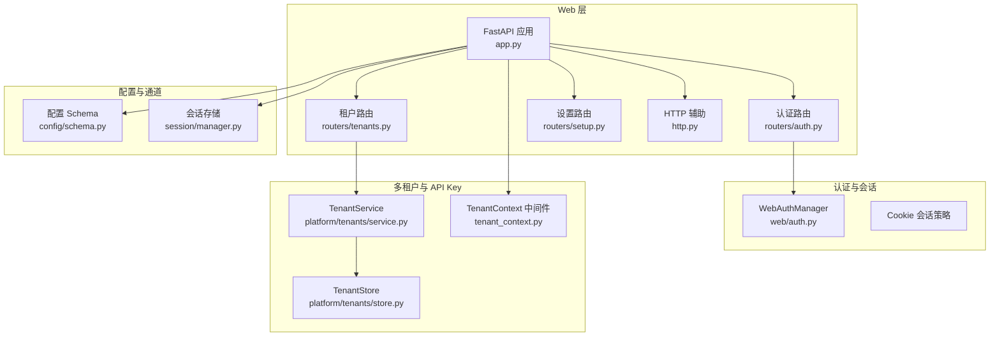
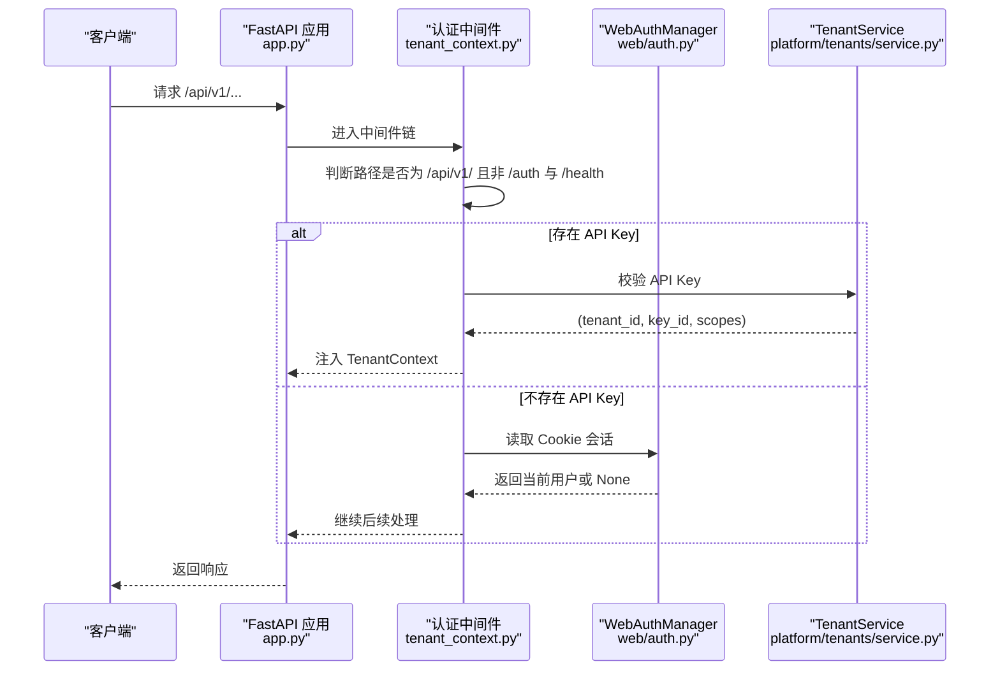
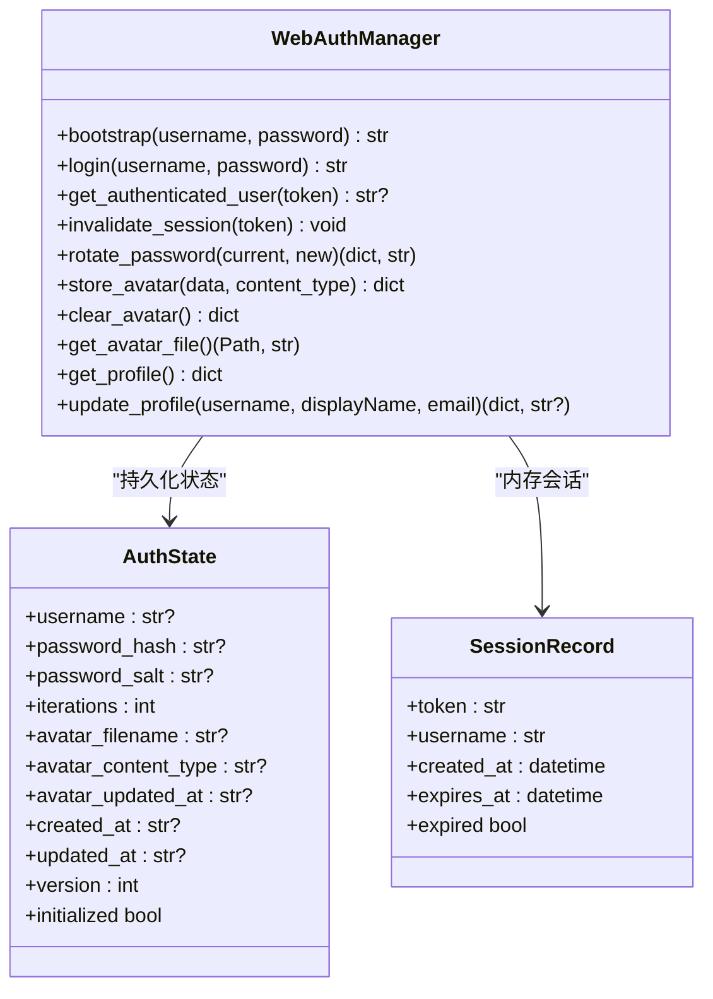
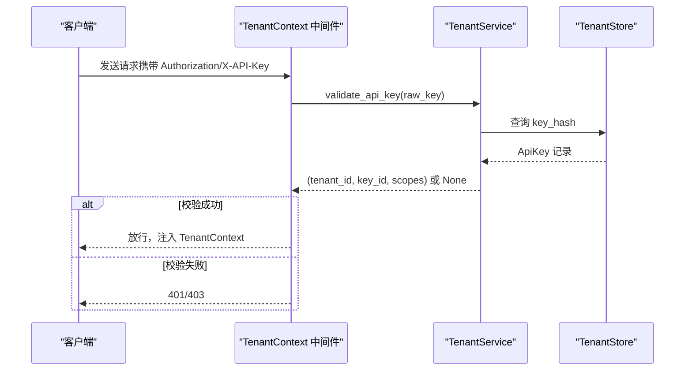
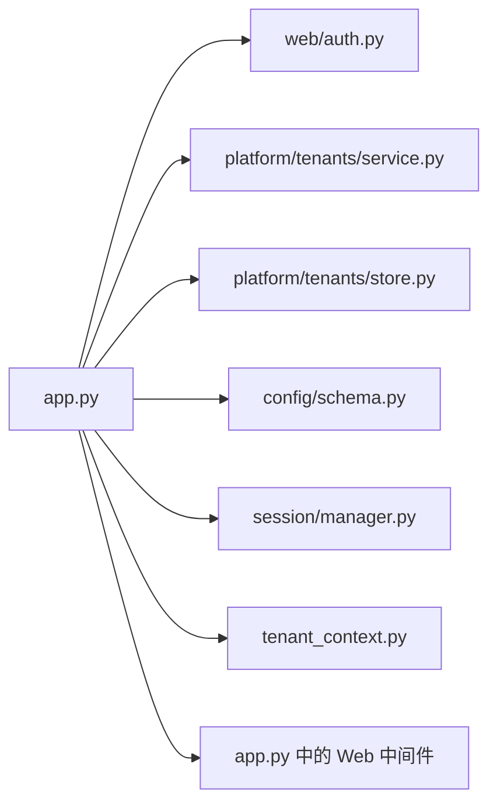

# 安全配置

<cite>
**本文引用的文件**
- [SECURITY.md](file://SECURITY.md)
- [nanobot/web/auth.py](file://nanobot/web/auth.py)
- [nanobot/web/app.py](file://nanobot/web/app.py)
- [nanobot/web/routers/auth.py](file://nanobot/web/routers/auth.py)
- [nanobot/web/tenant_context.py](file://nanobot/web/tenant_context.py)
- [nanobot/web/http.py](file://nanobot/web/http.py)
- [nanobot/web/routers/setup.py](file://nanobot/web/routers/setup.py)
- [nanobot/web/routers/tenants.py](file://nanobot/web/routers/tenants.py)
- [nanobot/web/routers/mcp.py](file://nanobot/web/routers/mcp.py)
- [nanobot/web/mcp_servers.py](file://nanobot/web/mcp_servers.py)
- [nanobot/web/operations.py](file://nanobot/web/operations.py)
- [nanobot/config/schema.py](file://nanobot/config/schema.py)
- [nanobot/session/manager.py](file://nanobot/session/manager.py)
- [nanobot/platform/tenants/store.py](file://nanobot/platform/tenants/store.py)
- [nanobot/platform/tenants/service.py](file://nanobot/platform/tenants/service.py)
- [nanobot/platform/teams/store.py](file://nanobot/platform/teams/store.py)
- [nanobot/providers/openai_codex_provider.py](file://nanobot/providers/openai_codex_provider.py)
- [README.md](file://README.md)
</cite>

## 目录
1. [简介](#简介)
2. [项目结构](#项目结构)
3. [核心组件](#核心组件)
4. [架构总览](#架构总览)
5. [详细组件分析](#详细组件分析)
6. [依赖分析](#依赖分析)
7. [性能考量](#性能考量)
8. [故障排查指南](#故障排查指南)
9. [结论](#结论)
10. [附录](#附录)

## 简介
本指南面向 Nanobot 的安全配置与运维，聚焦以下方面：
- 身份认证与授权：管理员 Web 登录、Cookie 会话、多租户 API Key 认证与作用域控制
- 用户管理与权限：管理员账户生命周期、密码轮换、头像上传与访问控制
- 会话管理：会话创建、过期与失效策略
- 网络安全：HTTPS 默认、通道访问白名单、WhatsApp 桥接本地绑定与令牌校验
- 数据安全：敏感信息存储、日志与凭据保护、聊天历史与工件存储
- API 安全：请求验证、速率限制建议、防攻击措施（命令执行、路径穿越）
- 安全审计与合规：漏洞扫描、安全更新、事件响应与检查清单
- 安全最佳实践：生产部署隔离、最小权限、定期轮换与监控

## 项目结构
Nanobot Web UI 基于 FastAPI 构建，安全相关能力主要分布在如下模块：
- Web 应用与中间件：应用工厂、全局异常处理、HTTP 中间件（Cookie 会话与 API Key 多重认证）
- 认证与会话：WebAuthManager 管理管理员账户、密码哈希、会话令牌与 Cookie 写入
- 多租户与 API Key：TenantService/Store 提供租户与 API Key 的创建、校验、撤销
- 配置模型：ChannelsConfig/ProviderConfig 等定义通道与提供商配置，含 allowFrom 白名单等
- 会话存储：JSONL 文件持久化对话历史，支持迁移与清理
- 运维与验证：系统健康检查、依赖审计、服务守护与日志

图表来源
- [nanobot/web/app.py](file://nanobot/web/app.py)
- [nanobot/web/routers/auth.py](file://nanobot/web/routers/auth.py)
- [nanobot/web/routers/tenants.py](file://nanobot/web/routers/tenants.py)
- [nanobot/web/tenant_context.py](file://nanobot/web/tenant_context.py)
- [nanobot/web/auth.py](file://nanobot/web/auth.py)
- [nanobot/platform/tenants/service.py](file://nanobot/platform/tenants/service.py)
- [nanobot/platform/tenants/store.py](file://nanobot/platform/tenants/store.py)
- [nanobot/config/schema.py](file://nanobot/config/schema.py)
- [nanobot/session/manager.py](file://nanobot/session/manager.py)
- [nanobot/web/http.py](file://nanobot/web/http.py)

章节来源
- [nanobot/web/app.py](file://nanobot/web/app.py)
- [nanobot/web/routers/auth.py](file://nanobot/web/routers/auth.py)
- [nanobot/web/routers/tenants.py](file://nanobot/web/routers/tenants.py)
- [nanobot/web/tenant_context.py](file://nanobot/web/tenant_context.py)
- [nanobot/web/auth.py](file://nanobot/web/auth.py)
- [nanobot/platform/tenants/service.py](file://nanobot/platform/tenants/service.py)
- [nanobot/platform/tenants/store.py](file://nanobot/platform/tenants/store.py)
- [nanobot/config/schema.py](file://nanobot/config/schema.py)
- [nanobot/session/manager.py](file://nanobot/session/manager.py)
- [nanobot/web/http.py](file://nanobot/web/http.py)

## 核心组件
- WebAuthManager：负责管理员账户初始化、登录校验、密码轮换、个人资料与头像管理；维护内存会话表与持久化状态文件
- TenantService/TenantStore：提供租户与 API Key 的 CRUD、哈希校验、过期与最后使用时间记录
- TenantContext 中间件：优先尝试 API Key 认证，否则回退到 Cookie 会话；排除 /api/v1/auth 与 /api/v1/health
- 配置 Schema：ChannelsConfig 支持各通道 allowFrom 白名单；GatewayConfig 控制监听地址与心跳
- 会话存储：以 JSONL 文件存储对话历史，支持迁移旧路径与缓存

章节来源
- [nanobot/web/auth.py](file://nanobot/web/auth.py)
- [nanobot/platform/tenants/service.py](file://nanobot/platform/tenants/service.py)
- [nanobot/platform/tenants/store.py](file://nanobot/platform/tenants/store.py)
- [nanobot/web/tenant_context.py](file://nanobot/web/tenant_context.py)
- [nanobot/config/schema.py](file://nanobot/config/schema.py)
- [nanobot/session/manager.py](file://nanobot/session/manager.py)

## 架构总览
Web 应用启动时装配认证、租户、通道、知识库、会话、团队、运行记录、设置与操作服务，并注册中间件与路由。Cookie 会话与 API Key 双重认证中间件确保 /api/v1/ 下受保护端点的安全访问。

图表来源
- [nanobot/web/app.py](file://nanobot/web/app.py)
- [nanobot/web/tenant_context.py](file://nanobot/web/tenant_context.py)
- [nanobot/web/auth.py](file://nanobot/web/auth.py)
- [nanobot/platform/tenants/service.py](file://nanobot/platform/tenants/service.py)

章节来源
- [nanobot/web/app.py](file://nanobot/web/app.py)
- [nanobot/web/tenant_context.py](file://nanobot/web/tenant_context.py)
- [nanobot/web/auth.py](file://nanobot/web/auth.py)
- [nanobot/platform/tenants/service.py](file://nanobot/platform/tenants/service.py)

## 详细组件分析

### 认证与会话（WebAuthManager）
- 密码安全：PBKDF2-HMAC-SHA256 哈希，带盐与迭代次数；登录使用常量时间比较
- 会话策略：内存会话表，令牌过期时间固定；Cookie 设置 HttpOnly、SameSite=Lax、Secure（仅 HTTPS）
- 管理员账户：初始化、登录、资料更新、密码轮换；头像上传限制大小与类型，持久化至配置目录
- 异常处理：未初始化、凭证无效、头像不存在等错误映射为结构化 API 错误

图表来源
- [nanobot/web/auth.py](file://nanobot/web/auth.py)

章节来源
- [nanobot/web/auth.py](file://nanobot/web/auth.py)
- [nanobot/web/routers/auth.py](file://nanobot/web/routers/auth.py)
- [nanobot/web/http.py](file://nanobot/web/http.py)

### 多租户与 API Key 认证
- API Key 规范：前缀 nk_，服务端以 SHA-256 哈希存储；支持过期时间与最后使用时间记录
- 中间件逻辑：优先 Authorization: Bearer 或 X-API-Key，校验通过后注入 TenantContext；支持 X-Tenant-Id 对比
- 租户与 API Key 生命周期：创建、查询、撤销；租户删除级联删除其 API Key

图表来源
- [nanobot/web/tenant_context.py](file://nanobot/web/tenant_context.py)
- [nanobot/platform/tenants/service.py](file://nanobot/platform/tenants/service.py)
- [nanobot/platform/tenants/store.py](file://nanobot/platform/tenants/store.py)

章节来源
- [nanobot/web/tenant_context.py](file://nanobot/web/tenant_context.py)
- [nanobot/platform/tenants/service.py](file://nanobot/platform/tenants/service.py)
- [nanobot/platform/tenants/store.py](file://nanobot/platform/tenants/store.py)
- [nanobot/web/routers/tenants.py](file://nanobot/web/routers/tenants.py)

### 配置与通道访问控制
- 允许列表（allowFrom）：各通道（Telegram、WhatsApp、Discord、Slack、Feishu、DingTalk、QQ、Wecom、Matrix）均支持 allowFrom 白名单
- 通道行为：代理、群组策略、消息回复策略等由配置项控制
- 网络安全：外部 API 默认 HTTPS；WhatsApp 桥接默认 localhost:3001 并可选共享令牌鉴权

章节来源
- [nanobot/config/schema.py](file://nanobot/config/schema.py)
- [SECURITY.md](file://SECURITY.md)

### 会话存储与数据持久化
- 会话文件：JSONL 格式，首行为元数据，其余为消息；支持迁移旧路径
- 缓存与失效：内存缓存 + 磁盘持久化；支持更新元数据、列出会话、删除会话
- 历史对齐：返回未合并消息，避免孤儿工具结果块

章节来源
- [nanobot/session/manager.py](file://nanobot/session/manager.py)

### API 安全与请求验证
- 结构化错误：统一 _err/_ok 包装，异常映射为 JSONResponse
- 路由层验证：setup 路由对提供商、通道、代理参数进行必填与格式校验
- 会话与认证：/api/v1/ 路径受中间件保护；/api/v1/auth 与 /api/v1/health 排除在外

章节来源
- [nanobot/web/http.py](file://nanobot/web/http.py)
- [nanobot/web/routers/setup.py](file://nanobot/web/routers/setup.py)
- [nanobot/web/app.py](file://nanobot/web/app.py)

### MCP 与工具安全
- MCP 服务器探测：记录探测结果、工具数量与缺失环境变量，便于诊断
- 工具使用约束：exec 工具有超时、危险命令阻断、输出截断与工作区限制选项
- MCP 仓库检查：对仓库源进行分析与错误提示

章节来源
- [nanobot/web/mcp_servers.py](file://nanobot/web/mcp_servers.py)
- [nanobot/web/routers/mcp.py](file://nanobot/web/routers/mcp.py)
- [nanobot/web/operations.py](file://nanobot/web/operations.py)
- [nanobot/config/schema.py](file://nanobot/config/schema.py)

## 依赖分析
- 应用装配：app.py 在 lifespan 中创建并注入认证、租户、通道、知识库、会话、团队、运行记录、设置与操作服务
- 中间件顺序：tenant_auth_middleware 先于 enforce_web_auth 执行，实现 API Key 优先策略
- 配置驱动：ChannelsConfig/ProviderConfig 决定通道行为与提供商凭据加载

图表来源
- [nanobot/web/app.py](file://nanobot/web/app.py)
- [nanobot/web/auth.py](file://nanobot/web/auth.py)
- [nanobot/platform/tenants/service.py](file://nanobot/platform/tenants/service.py)
- [nanobot/platform/tenants/store.py](file://nanobot/platform/tenants/store.py)
- [nanobot/config/schema.py](file://nanobot/config/schema.py)
- [nanobot/session/manager.py](file://nanobot/session/manager.py)
- [nanobot/web/tenant_context.py](file://nanobot/web/tenant_context.py)

章节来源
- [nanobot/web/app.py](file://nanobot/web/app.py)
- [nanobot/web/tenant_context.py](file://nanobot/web/tenant_context.py)
- [nanobot/web/auth.py](file://nanobot/web/auth.py)
- [nanobot/platform/tenants/service.py](file://nanobot/platform/tenants/service.py)
- [nanobot/platform/tenants/store.py](file://nanobot/platform/tenants/store.py)
- [nanobot/config/schema.py](file://nanobot/config/schema.py)
- [nanobot/session/manager.py](file://nanobot/session/manager.py)

## 性能考量
- 会话与缓存：内存会话表减少磁盘 IO；会话文件按需加载与持久化
- 超时与截断：exec 工具超时与输出截断降低资源占用与风险
- 配置解析：Pydantic 模型在运行时解析配置，建议在启动阶段完成配置校验

## 故障排查指南
- 认证失败
  - 检查管理员账户是否已初始化与密码是否正确
  - 查看 Cookie 是否包含有效会话令牌且未过期
- API Key 无效或过期
  - 校验前缀与哈希匹配；确认过期时间与启用状态
  - 若指定 X-Tenant-Id，请确保与 API Key 所属租户一致
- 通道访问被拒绝
  - 确认 allowFrom 列表中包含发送者标识；空列表在新版中默认拒绝
- 日志与审计
  - 使用系统日志与应用日志定位异常；结合健康检查端点与依赖审计工具
- 依赖漏洞
  - 定期运行 pip-audit 与 npm audit，及时更新依赖

章节来源
- [nanobot/web/routers/auth.py](file://nanobot/web/routers/auth.py)
- [nanobot/web/tenant_context.py](file://nanobot/web/tenant_context.py)
- [nanobot/platform/tenants/service.py](file://nanobot/platform/tenants/service.py)
- [SECURITY.md](file://SECURITY.md)
- [nanobot/web/app.py](file://nanobot/web/app.py)

## 结论
Nanobot 在 Web 层提供了基于 Cookie 的管理员会话与多租户 API Key 的双重认证机制，并通过配置模型实现了通道级访问白名单与网络通信安全。结合会话存储、工具安全限制与依赖审计，可在多数场景下满足基本安全要求。建议在生产环境中配合防火墙、速率限制、凭据轮换与持续监控，进一步强化整体安全态势。

## 附录

### 安全检查清单（摘自项目文档）
- [ ] API 密钥安全存放（不在代码中）
- [ ] 配置文件权限设置为 0600
- [ ] 各通道 allowFrom 列表已配置
- [ ] 以非 root 用户运行
- [ ] 文件系统权限受限
- [ ] 依赖更新至最新安全版本
- [ ] 日志监控安全事件
- [ ] 在提供商处配置速率限制
- [ ] 制定备份与灾难恢复计划
- [ ] 对自定义技能/工具进行安全审查

章节来源
- [SECURITY.md](file://SECURITY.md)

### 生产部署建议（摘自项目文档）
- 使用容器或虚拟机隔离环境
- 使用专用用户运行
- 设置目录与文件权限
- 启用日志监控
- 在提供商侧配置速率限制与消费上限
- 定期更新与订阅安全公告

章节来源
- [SECURITY.md](file://SECURITY.md)
- [README.md](file://README.md)