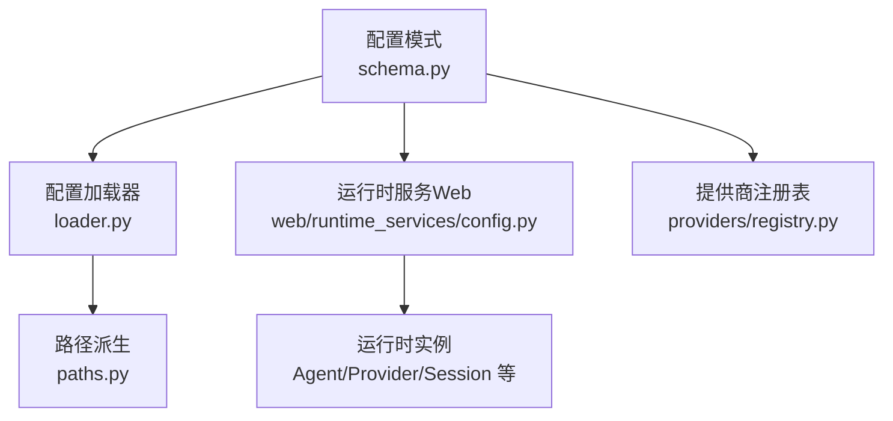
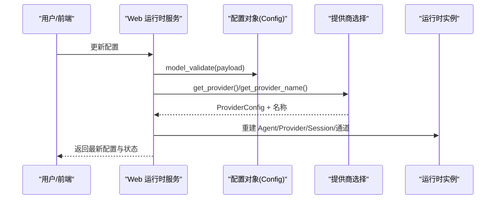
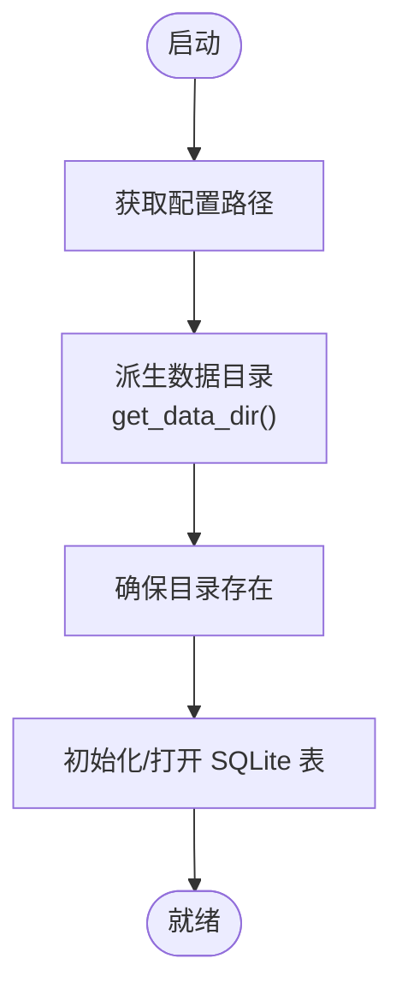
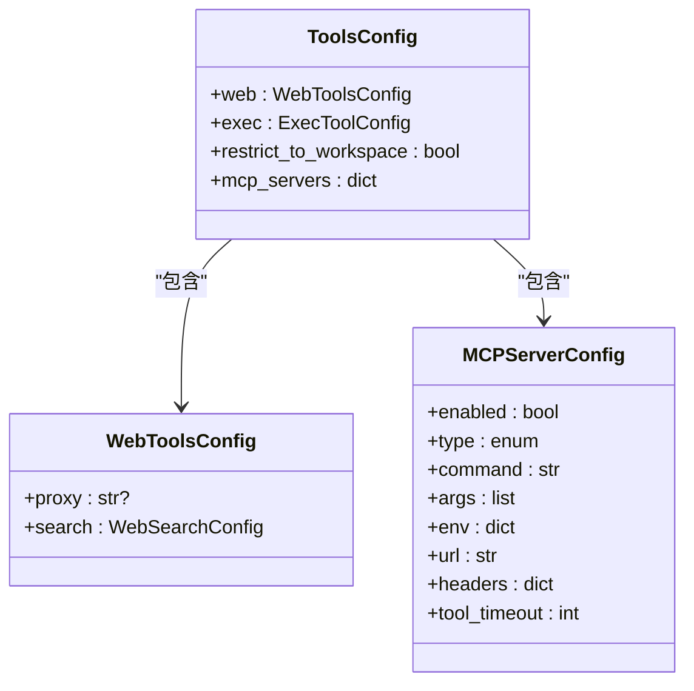
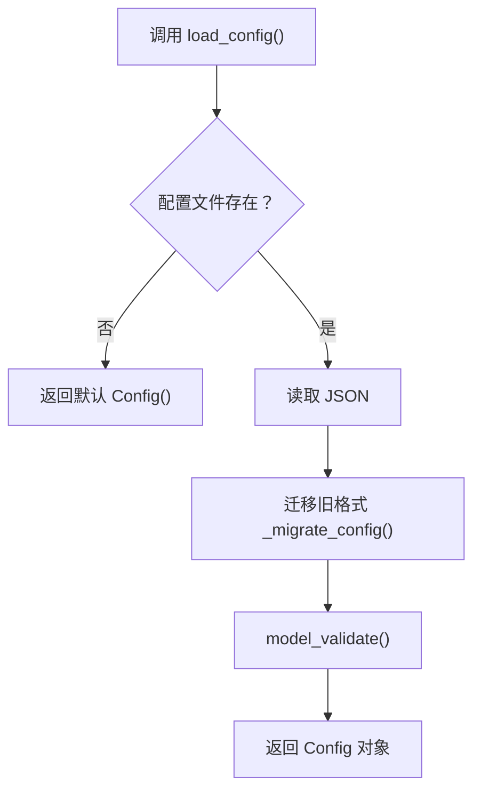
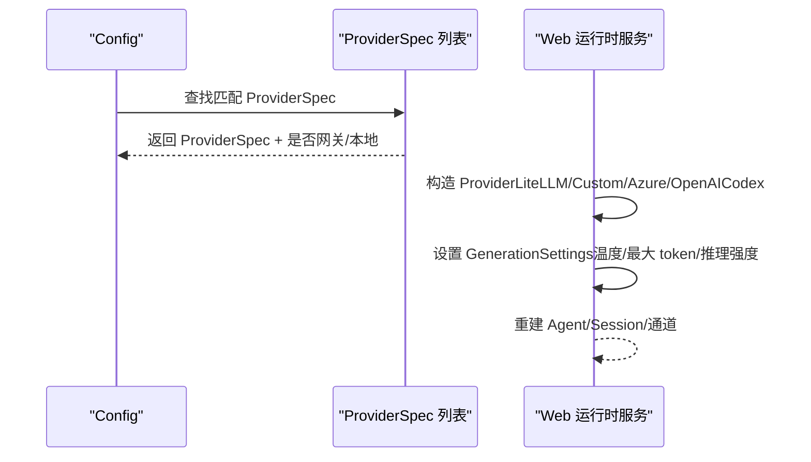
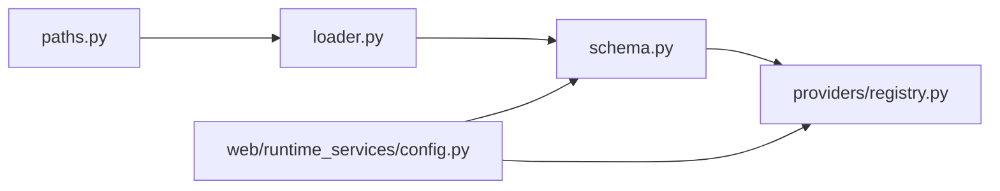

# 环境配置

<cite>
**本文引用的文件**   
- [nanobot/config/schema.py](file://nanobot/config/schema.py)
- [nanobot/config/loader.py](file://nanobot/config/loader.py)
- [nanobot/config/paths.py](file://nanobot/config/paths.py)
- [nanobot/providers/registry.py](file://nanobot/providers/registry.py)
- [nanobot/web/runtime_services/config.py](file://nanobot/web/runtime_services/config.py)
- [tmp/web-e2e-runtime/config.json](file://tmp/web-e2e-runtime/config.json)
- [nanobot/providers/base.py](file://nanobot/providers/base.py)
- [nanobot/web/mcp_servers.py](file://nanobot/web/mcp_servers.py)
</cite>

## 目录
1. [简介](#简介)
2. [项目结构](#项目结构)
3. [核心组件](#核心组件)
4. [架构总览](#架构总览)
5. [详细组件分析](#详细组件分析)
6. [依赖分析](#依赖分析)
7. [性能考虑](#性能考虑)
8. [故障排查指南](#故障排查指南)
9. [结论](#结论)
10. [附录](#附录)

## 简介
本指南面向 Nanobot 的环境配置与运行时行为，覆盖以下主题：
- 环境变量设置：LLM 提供商密钥、渠道配置参数、代理与安全设置
- 配置文件结构与字段含义：提供器、渠道、网关、工具等
- 完整配置示例与最佳实践：开发/测试/生产三类环境建议
- 数据库与持久化：实例级 SQLite 存储位置与迁移
- 网络代理与 MCP 工具：HTTP/SOCKS5 代理、MCP 服务器连接
- 配置验证与常见错误排查：加载失败、匹配优先级、OAuth 与本地模型

## 项目结构
Nanobot 的配置体系由“配置模式（Pydantic）+ 加载器 + 路径派生 + 运行时服务”构成，核心入口位于配置模块，并通过运行时服务注入到 Web 与 Agent 执行链路。

**图表来源**
- [nanobot/config/schema.py:351-450](file://nanobot/config/schema.py#L351-L450)
- [nanobot/config/loader.py:26-66](file://nanobot/config/loader.py#L26-L66)
- [nanobot/config/paths.py:11-56](file://nanobot/config/paths.py#L11-L56)
- [nanobot/web/runtime_services/config.py:79-109](file://nanobot/web/runtime_services/config.py#L79-L109)
- [nanobot/providers/registry.py:68-399](file://nanobot/providers/registry.py#L68-L399)

**章节来源**
- [nanobot/config/schema.py:11-450](file://nanobot/config/schema.py#L11-L450)
- [nanobot/config/loader.py:1-82](file://nanobot/config/loader.py#L1-L82)
- [nanobot/config/paths.py:1-56](file://nanobot/config/paths.py#L1-L56)
- [nanobot/web/runtime_services/config.py:1-190](file://nanobot/web/runtime_services/config.py#L1-L190)
- [nanobot/providers/registry.py:1-466](file://nanobot/providers/registry.py#L1-L466)

## 核心组件
- 配置模式（Config）：根对象，包含 agents、channels、providers、gateway、tools 等子配置
- 配置加载器（load_config/save_config）：从默认或指定路径读取/写入 JSON 配置，支持迁移
- 路径派生（get_data_dir/get_runtime_subdir 等）：基于配置上下文生成数据目录、媒体目录、日志目录等
- 运行时服务（WebConfigRuntimeService）：根据配置重建运行时（消息总线、会话管理、Agent 循环、Provider）
- 提供商注册表（ProviderSpec）：定义所有支持的 LLM 提供商、匹配规则、默认 API 基地址、是否网关/本地/OAuth 等

**章节来源**
- [nanobot/config/schema.py:351-450](file://nanobot/config/schema.py#L351-L450)
- [nanobot/config/loader.py:26-66](file://nanobot/config/loader.py#L26-L66)
- [nanobot/config/paths.py:11-56](file://nanobot/config/paths.py#L11-L56)
- [nanobot/web/runtime_services/config.py:27-109](file://nanobot/web/runtime_services/config.py#L27-L109)
- [nanobot/providers/registry.py:19-66](file://nanobot/providers/registry.py#L19-L66)

## 架构总览
下图展示配置如何驱动运行时初始化与提供商选择：

**图表来源**
- [nanobot/web/runtime_services/config.py:147-156](file://nanobot/web/runtime_services/config.py#L147-L156)
- [nanobot/config/schema.py:418-427](file://nanobot/config/schema.py#L418-L427)
- [nanobot/providers/registry.py:407-466](file://nanobot/providers/registry.py#L407-L466)

## 详细组件分析

### 配置文件结构与字段说明
- 根对象 Config：包含 agents、channels、providers、gateway、tools
- agents.defaults：工作区、默认模型、提供商、采样参数、最大工具迭代次数等
- channels.*：各渠道开关、鉴权令牌、白名单、代理、策略等
- providers.*：各类提供商的 apiKey、apiBase、额外请求头
- gateway：主机、端口、心跳
- tools.web.proxy/search：网络代理与搜索工具配置
- tools.exec：执行工具超时、PATH 追加
- tools.mcp_servers：MCP 服务器（stdio/sse/streamableHttp），含命令、参数、环境变量、请求头、超时

参考示例配置文件路径：
- [tmp/web-e2e-runtime/config.json:1-282](file://tmp/web-e2e-runtime/config.json#L1-L282)

**章节来源**
- [nanobot/config/schema.py:231-450](file://nanobot/config/schema.py#L231-L450)
- [tmp/web-e2e-runtime/config.json:1-282](file://tmp/web-e2e-runtime/config.json#L1-L282)

### 环境变量与提供商密钥
- 环境变量前缀：NANOBOT_
- 嵌套键分隔符：__
- 模型匹配与默认 API 基地址：由提供商注册表决定，部分网关/本地提供默认值
- OAuth 与本地模型：不使用 apiKey，需按提供商流程配置

环境变量映射示例（以注册表中字段为例）：
- OPENAI_API_KEY → providers.openai.apiKey
- ANTHROPIC_API_KEY → providers.anthropic.apiKey
- OPENROUTER_API_KEY → providers.openrouter.apiKey
- DASHSCOPE_API_KEY → providers.dashscope.apiKey
- GEMINI_API_KEY → providers.gemini.apiKey
- DEEPSEEK_API_KEY → providers.deepseek.apiKey
- GROQ_API_KEY → providers.groq.apiKey
- ZAI_API_KEY → providers.zhipu.apiKey
- MINIMAX_API_KEY → providers.minimax.apiKey
- MOONSHOT_API_KEY → providers.moonshot.apiKey
- HOSTED_VLLM_API_KEY → providers.vllm.apiKey
- OLLAMA_API_KEY → providers.ollama.apiKey
- SILICONFLOW_API_KEY → providers.siliconflow.apiKey
- VOLCES_API_KEY → providers.volcengine.apiKey
- OPENAI_API_KEY → providers.aihubmix.apiKey（AiHubMix 兼容 OpenAI 接口）

注意：
- 注册表中部分提供商会设置默认 api_base；若未显式配置，将使用注册表默认值
- OAuth 类提供商（如 openai_codex、github_copilot）不使用 apiKey 字段

**章节来源**
- [nanobot/config/schema.py:449](file://nanobot/config/schema.py#L449)
- [nanobot/providers/registry.py:68-399](file://nanobot/providers/registry.py#L68-L399)

### 渠道配置参数与安全设置
- 通用字段：enabled、allowFrom 白名单、代理 proxy（HTTP/SOCKS5）
- Telegram：token、回复策略、群组策略
- Discord：token、意图、群组策略
- Feishu：app_id/app_secret、事件订阅加密 key/校验 token
- DingTalk：client_id/client_secret
- Matrix：homeserver/access_token/user_id/device_id、E2EE 开关、媒体大小限制
- Email：IMAP/SMTP 凭据、轮询间隔、自动回复、发件人
- Slack：bot/app token、线程回复、表情、DM 政策
- WeCom：bot_id/secret、欢迎语
- WhatsApp：bridge_url/bridge_token、允许号码

安全建议：
- 尽可能使用桥接令牌或渠道侧回调校验
- 限制 allowFrom 白名单
- 使用 HTTPS/SSL 并最小化明文凭据暴露

**章节来源**
- [nanobot/config/schema.py:17-229](file://nanobot/config/schema.py#L17-L229)

### 数据库与持久化
- 实例级 SQLite 存储：租户、团队、知识库、会话等均以 SQLite 文件形式存储于实例数据目录
- 数据目录派生：基于配置路径父目录，生成 logs、media、cron 等子目录
- 迁移：历史 sessions 目录用于兼容性回退

**图表来源**
- [nanobot/config/paths.py:11-56](file://nanobot/config/paths.py#L11-L56)
- [nanobot/platform/tenants/store.py:15-43](file://nanobot/platform/tenants/store.py#L15-L43)
- [nanobot/platform/teams/store.py:15-33](file://nanobot/platform/teams/store.py#L15-L33)
- [nanobot/platform/agents/store.py:15-34](file://nanobot/platform/agents/store.py#L15-L34)
- [nanobot/platform/memory/store.py:46-55](file://nanobot/platform/memory/store.py#L46-L55)

**章节来源**
- [nanobot/config/paths.py:11-56](file://nanobot/config/paths.py#L11-L56)
- [nanobot/platform/tenants/store.py:1-79](file://nanobot/platform/tenants/store.py#L1-L79)
- [nanobot/platform/teams/store.py:1-82](file://nanobot/platform/teams/store.py#L1-L82)
- [nanobot/platform/agents/store.py:1-83](file://nanobot/platform/agents/store.py#L1-L83)
- [nanobot/platform/memory/store.py:1-61](file://nanobot/platform/memory/store.py#L1-L61)

### 网络代理与 MCP 工具
- Web 工具代理：tools.web.proxy 支持 HTTP/SOCKS5
- MCP 服务器：tools.mcp_servers 支持 stdio、sse、streamableHttp，可配置命令、参数、环境变量、请求头、超时
- 运行时注入：Web 运行时服务将代理与 MCP 配置传入 Agent/Provider

**图表来源**
- [nanobot/config/schema.py:342-350](file://nanobot/config/schema.py#L342-L350)
- [nanobot/config/schema.py:313-320](file://nanobot/config/schema.py#L313-L320)
- [nanobot/config/schema.py:329-340](file://nanobot/config/schema.py#L329-L340)

**章节来源**
- [nanobot/config/schema.py:313-350](file://nanobot/config/schema.py#L313-L350)
- [nanobot/web/runtime_services/config.py:92-98](file://nanobot/web/runtime_services/config.py#L92-L98)
- [nanobot/web/mcp_servers.py:503-524](file://nanobot/web/mcp_servers.py#L503-L524)

### 配置加载与迁移
- 默认配置文件：用户主目录下的 .nanobot/config.json
- 加载流程：存在则读取 JSON，迁移旧格式，再进行模型校验；否则返回默认配置
- 保存流程：确保目录存在，序列化为 JSON 写入

**图表来源**
- [nanobot/config/loader.py:26-66](file://nanobot/config/loader.py#L26-L66)
- [nanobot/config/loader.py:68-82](file://nanobot/config/loader.py#L68-L82)

**章节来源**
- [nanobot/config/loader.py:19-48](file://nanobot/config/loader.py#L19-L48)
- [nanobot/config/loader.py:68-82](file://nanobot/config/loader.py#L68-L82)

### 提供商匹配与运行时构建
- 匹配逻辑：优先显式前缀匹配，其次关键字匹配，再次网关/本地兜底
- 运行时构建：根据提供商类型构造 LiteLLMProvider 或自定义 Provider，注入温度、最大 token、推理强度等默认参数

**图表来源**
- [nanobot/config/schema.py:365-427](file://nanobot/config/schema.py#L365-L427)
- [nanobot/providers/registry.py:407-466](file://nanobot/providers/registry.py#L407-L466)
- [nanobot/web/runtime_services/config.py:33-77](file://nanobot/web/runtime_services/config.py#L33-L77)

**章节来源**
- [nanobot/config/schema.py:365-427](file://nanobot/config/schema.py#L365-L427)
- [nanobot/providers/registry.py:429-458](file://nanobot/providers/registry.py#L429-L458)
- [nanobot/web/runtime_services/config.py:33-77](file://nanobot/web/runtime_services/config.py#L33-L77)

## 依赖分析
- 配置模式对提供商注册表的依赖体现在“匹配优先级与默认 API 基地址”
- 运行时服务依赖配置对象与提供商注册表，动态选择 Provider 实现
- 路径派生依赖配置路径，确保实例级数据隔离

**图表来源**
- [nanobot/config/schema.py:351-450](file://nanobot/config/schema.py#L351-L450)
- [nanobot/providers/registry.py:68-399](file://nanobot/providers/registry.py#L68-L399)
- [nanobot/config/loader.py:26-66](file://nanobot/config/loader.py#L26-L66)
- [nanobot/config/paths.py:11-56](file://nanobot/config/paths.py#L11-L56)
- [nanobot/web/runtime_services/config.py:27-109](file://nanobot/web/runtime_services/config.py#L27-L109)

**章节来源**
- [nanobot/config/schema.py:351-450](file://nanobot/config/schema.py#L351-L450)
- [nanobot/providers/registry.py:68-399](file://nanobot/providers/registry.py#L68-L399)
- [nanobot/config/loader.py:26-66](file://nanobot/config/loader.py#L26-L66)
- [nanobot/config/paths.py:11-56](file://nanobot/config/paths.py#L11-L56)
- [nanobot/web/runtime_services/config.py:27-109](file://nanobot/web/runtime_services/config.py#L27-L109)

## 性能考虑
- 代理与网络：合理设置 tools.web.proxy，避免跨域与中间层延迟
- 工具限制：开启 tools.restrict_to_workspace 以减少文件系统扫描开销
- MCP 超时：为工具调用设置合理的 tool_timeout，防止阻塞
- 日志与媒体：控制日志级别与媒体大小上限，降低磁盘 IO 压力

[本节为通用建议，无需特定文件引用]

## 故障排查指南
- 配置加载失败
  - 现象：打印警告并使用默认配置
  - 排查：检查配置文件 JSON 语法、字段拼写、路径权限
  - 参考：[nanobot/config/loader.py:44-47](file://nanobot/config/loader.py#L44-L47)
- 提供商未匹配
  - 现象：fallback 未命中或返回空
  - 排查：确认模型名前缀、关键字是否正确；检查 providers.* 字段是否填写；确认网关/本地检测条件
  - 参考：[nanobot/config/schema.py:365-427](file://nanobot/config/schema.py#L365-L427)，[nanobot/providers/registry.py:429-458](file://nanobot/providers/registry.py#L429-L458)
- OAuth 与本地模型
  - 现象：apiKey 字段不生效
  - 排查：确认提供商类别（is_oauth/is_local），按提供商流程配置
  - 参考：[nanobot/providers/registry.py:201-236](file://nanobot/providers/registry.py#L201-L236)
- MCP 服务器问题
  - 现象：探测失败、工具不可用
  - 排查：补齐 env/headers，保存配置后重试探测
  - 参考：[nanobot/web/mcp_servers.py:503-524](file://nanobot/web/mcp_servers.py#L503-L524)
- 代理与网络
  - 现象：访问外部受限或超时
  - 排查：确认 HTTP/SOCKS5 代理格式与可达性；检查防火墙与 DNS
  - 参考：[nanobot/config/schema.py:316-318](file://nanobot/config/schema.py#L316-L318)

**章节来源**
- [nanobot/config/loader.py:44-47](file://nanobot/config/loader.py#L44-L47)
- [nanobot/config/schema.py:365-427](file://nanobot/config/schema.py#L365-L427)
- [nanobot/providers/registry.py:201-236](file://nanobot/providers/registry.py#L201-L236)
- [nanobot/web/mcp_servers.py:503-524](file://nanobot/web/mcp_servers.py#L503-L524)
- [nanobot/config/schema.py:316-318](file://nanobot/config/schema.py#L316-L318)

## 结论
- 使用 NANOBOT_ 前缀的环境变量统一注入提供商密钥与行为参数
- 通过 providers/* 字段与注册表规则实现灵活的提供商选择与默认基地址
- 配置文件采用 JSON 结构，具备迁移能力与默认回退
- 运行时服务负责将配置转化为实际的 Provider、Agent、通道与会话
- 在生产环境建议严格限制白名单、启用代理与必要的安全措施，并定期校验 MCP 与提供商连通性

[本节为总结，无需特定文件引用]

## 附录

### 环境变量与字段映射速查
- OPENAI_API_KEY → providers.openai.apiKey
- ANTHROPIC_API_KEY → providers.anthropic.apiKey
- OPENROUTER_API_KEY → providers.openrouter.apiKey
- DASHSCOPE_API_KEY → providers.dashscope.apiKey
- GEMINI_API_KEY → providers.gemini.apiKey
- DEEPSEEK_API_KEY → providers.deepseek.apiKey
- GROQ_API_KEY → providers.groq.apiKey
- ZAI_API_KEY → providers.zhipu.apiKey
- MINIMAX_API_KEY → providers.minimax.apiKey
- MOONSHOT_API_KEY → providers.moonshot.apiKey
- HOSTED_VLLM_API_KEY → providers.vllm.apiKey
- OLLAMA_API_KEY → providers.ollama.apiKey
- SILICONFLOW_API_KEY → providers.siliconflow.apiKey
- VOLCES_API_KEY → providers.volcengine.apiKey
- OPENAI_API_KEY → providers.aihubmix.apiKey（AiHubMix 兼容 OpenAI 接口）

**章节来源**
- [nanobot/providers/registry.py:68-399](file://nanobot/providers/registry.py#L68-L399)

### 不同环境的配置要点
- 开发环境
  - 使用本地/网关提供者，开启更宽松的日志与调试选项
  - 可临时关闭心跳或缩短轮询周期以便快速验证
- 测试环境
  - 使用稳定提供商与固定模型，确保结果可复现
  - 限制 allowFrom 与代理，避免跨环境干扰
- 生产环境
  - 明确提供商密钥与默认 API 基地址，启用代理与白名单
  - 关闭不必要的渠道与工具，开启 MCP 服务器健康探测
  - 定期备份配置与 SQLite 数据库

[本节为通用建议，无需特定文件引用]

### 配置验证清单
- 配置文件可读且 JSON 有效
- 所有必需提供商 apiKey 填写完整
- 模型名前缀与关键字匹配正确
- 代理与网络连通性测试通过
- MCP 服务器环境变量与请求头配置正确
- 通道白名单与安全策略符合预期

[本节为通用建议，无需特定文件引用]