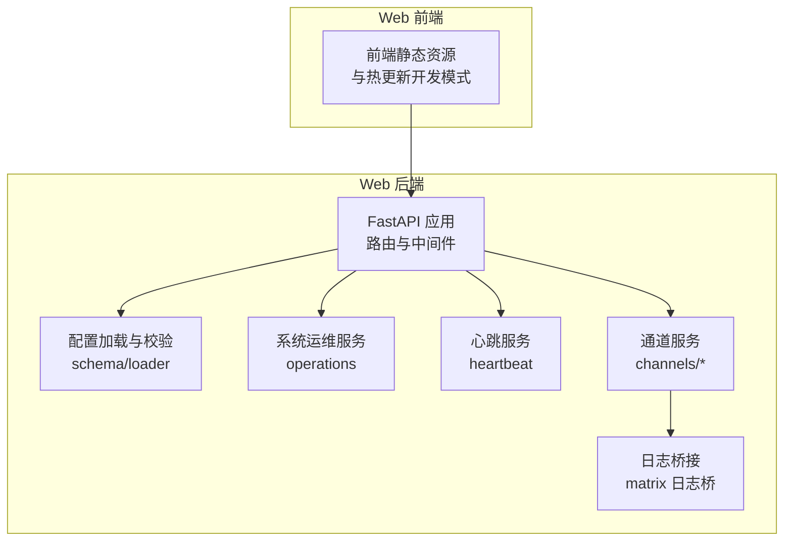
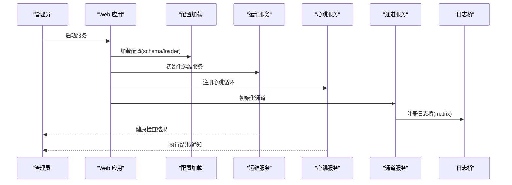
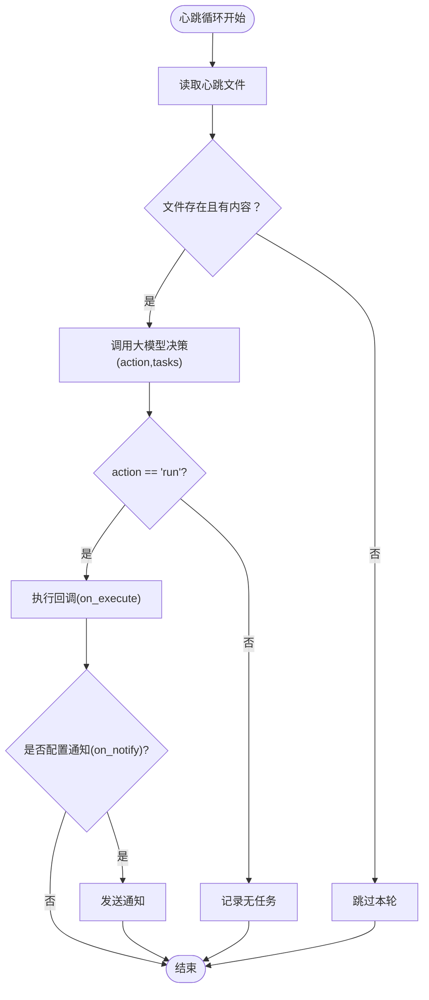
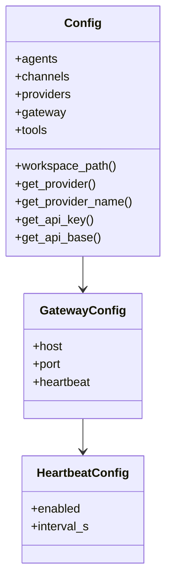
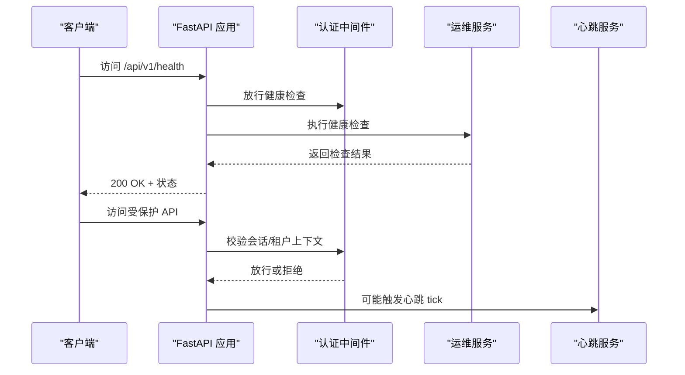
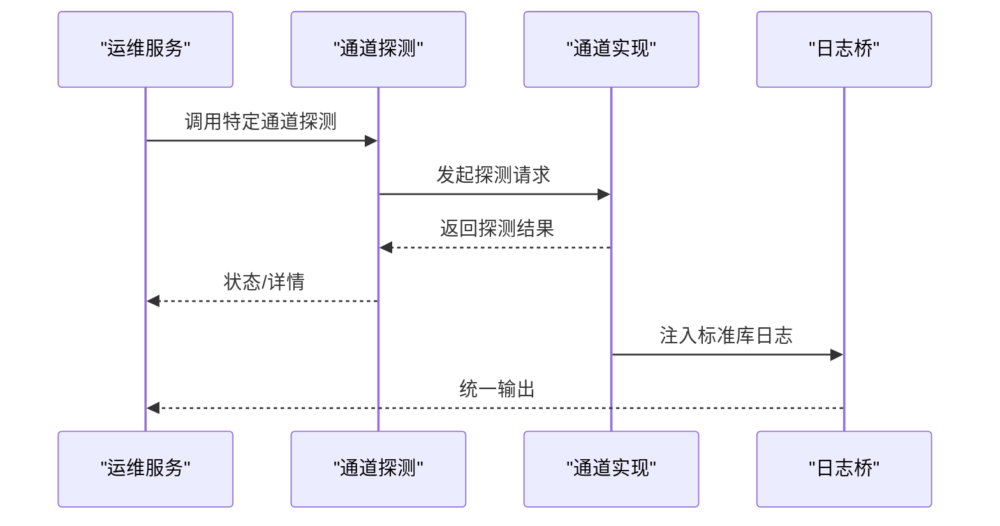
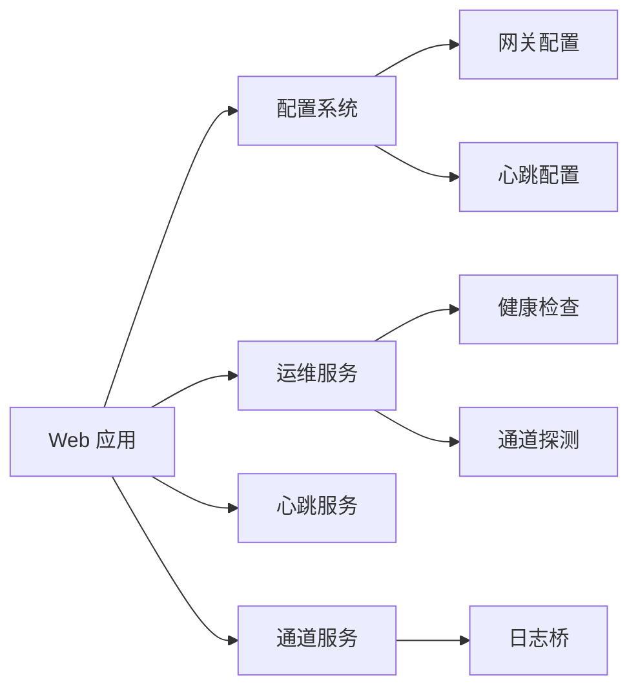

# 监控运维

<cite>
**本文引用的文件**
- [nanobot/heartbeat/service.py](file://nanobot/heartbeat/service.py)
- [HEARTBEAT.md](file://HEARTBEAT.md)
- [nanobot/templates/HEARTBEAT.md](file://nanobot/templates/HEARTBEAT.md)
- [nanobot/config/schema.py](file://nanobot/config/schema.py)
- [nanobot/config/loader.py](file://nanobot/config/loader.py)
- [nanobot/web/app.py](file://nanobot/web/app.py)
- [nanobot/web/operations.py](file://nanobot/web/operations.py)
- [nanobot/web/channel_testing.py](file://nanobot/web/channel_testing.py)
- [nanobot/channels/matrix.py](file://nanobot/channels/matrix.py)
- [Dockerfile](file://Dockerfile)
- [docker-compose.yml](file://docker-compose.yml)
</cite>

## 目录
1. [简介](#简介)
2. [项目结构](#项目结构)
3. [核心组件](#核心组件)
4. [架构总览](#架构总览)
5. [详细组件分析](#详细组件分析)
6. [依赖分析](#依赖分析)
7. [性能考虑](#性能考虑)
8. [故障排查指南](#故障排查指南)
9. [结论](#结论)
10. [附录](#附录)

## 简介
本运维指南面向 Nanobot 的系统管理员与平台工程师，聚焦于系统健康检查（心跳）、日志管理、性能监控、告警与通知、备份恢复与灾难恢复、以及运维工具与自动化脚本使用建议。文档基于仓库中的实际实现进行梳理，并提供可视化图示帮助快速定位问题与优化配置。

## 项目结构
Nanobot 采用分层架构：Web 前端通过 FastAPI 提供 API 与静态页面；后端由平台服务、通道服务、任务调度、心跳服务等模块组成；配置通过 JSON 文件与环境变量加载；日志统一由 loguru 管理；容器化部署支持 Docker 与 docker-compose。

图表来源
- [nanobot/web/app.py:70-332](file://nanobot/web/app.py#L70-L332)
- [nanobot/config/schema.py:351-450](file://nanobot/config/schema.py#L351-L450)
- [nanobot/config/loader.py:26-82](file://nanobot/config/loader.py#L26-L82)
- [nanobot/web/operations.py:233-268](file://nanobot/web/operations.py#L233-L268)
- [nanobot/heartbeat/service.py:40-174](file://nanobot/heartbeat/service.py#L40-L174)
- [nanobot/channels/matrix.py:124-144](file://nanobot/channels/matrix.py#L124-L144)

章节来源
- [nanobot/web/app.py:70-332](file://nanobot/web/app.py#L70-L332)
- [nanobot/config/schema.py:351-450](file://nanobot/config/schema.py#L351-L450)
- [nanobot/config/loader.py:26-82](file://nanobot/config/loader.py#L26-L82)
- [nanobot/web/operations.py:233-268](file://nanobot/web/operations.py#L233-L268)
- [nanobot/heartbeat/service.py:40-174](file://nanobot/heartbeat/service.py#L40-L174)
- [nanobot/channels/matrix.py:124-144](file://nanobot/channels/matrix.py#L124-L144)

## 核心组件
- 心跳服务：周期性读取工作区中的心跳任务文件，调用大模型决策是否执行任务，并在执行后可选通知。
- 配置系统：集中定义网关、通道、代理、工具等配置项，支持从文件与环境变量加载。
- Web 应用：提供认证、路由、中间件、生命周期管理与前端托管。
- 运维服务：提供系统健康检查、通道连通性探测、配置校验等能力。
- 日志桥接：将第三方库日志接入 loguru，统一输出与分析。

章节来源
- [nanobot/heartbeat/service.py:40-174](file://nanobot/heartbeat/service.py#L40-L174)
- [nanobot/config/schema.py:291-304](file://nanobot/config/schema.py#L291-L304)
- [nanobot/web/app.py:70-332](file://nanobot/web/app.py#L70-L332)
- [nanobot/web/operations.py:233-268](file://nanobot/web/operations.py#L233-L268)
- [nanobot/channels/matrix.py:124-144](file://nanobot/channels/matrix.py#L124-L144)

## 架构总览
下图展示 Web 应用启动、配置加载、心跳服务与通道服务之间的交互关系，以及日志桥接路径。

图表来源
- [nanobot/web/app.py:148-184](file://nanobot/web/app.py#L148-L184)
- [nanobot/config/schema.py:351-450](file://nanobot/config/schema.py#L351-L450)
- [nanobot/config/loader.py:26-82](file://nanobot/config/loader.py#L26-L82)
- [nanobot/web/operations.py:233-268](file://nanobot/web/operations.py#L233-L268)
- [nanobot/heartbeat/service.py:108-164](file://nanobot/heartbeat/service.py#L108-L164)
- [nanobot/channels/matrix.py:138-144](file://nanobot/channels/matrix.py#L138-L144)

## 详细组件分析

### 心跳服务（Health Check 与任务触发）
- 触发周期：默认每 30 分钟检查一次工作区中的心跳任务文件。
- 决策流程：通过虚拟工具调用让大模型判断“跳过/执行”，避免自由文本解析风险。
- 执行回调：当决策为“执行”时，调用外部回调执行完整代理流程，并可选通知。
- 手动触发：支持手动触发一次心跳以快速验证。

图表来源
- [nanobot/heartbeat/service.py:108-174](file://nanobot/heartbeat/service.py#L108-L174)
- [nanobot/heartbeat/service.py:85-107](file://nanobot/heartbeat/service.py#L85-L107)
- [nanobot/heartbeat/service.py:140-164](file://nanobot/heartbeat/service.py#L140-L164)

章节来源
- [nanobot/heartbeat/service.py:40-174](file://nanobot/heartbeat/service.py#L40-L174)
- [HEARTBEAT.md:1-17](file://HEARTBEAT.md#L1-L17)
- [nanobot/templates/HEARTBEAT.md:1-17](file://nanobot/templates/HEARTBEAT.md#L1-L17)
- [nanobot/config/schema.py:291-296](file://nanobot/config/schema.py#L291-L296)

### 配置系统（Schema 与加载）
- 配置项覆盖范围：网关、通道、代理、工具、MCP 等。
- 加载策略：优先从用户配置文件加载，失败则回退默认配置；支持环境变量前缀注入。
- 迁移兼容：对旧配置格式进行迁移，保证平滑升级。

图表来源
- [nanobot/config/schema.py:351-450](file://nanobot/config/schema.py#L351-L450)
- [nanobot/config/schema.py:298-304](file://nanobot/config/schema.py#L298-L304)
- [nanobot/config/schema.py:291-296](file://nanobot/config/schema.py#L291-L296)

章节来源
- [nanobot/config/schema.py:351-450](file://nanobot/config/schema.py#L351-L450)
- [nanobot/config/loader.py:26-82](file://nanobot/config/loader.py#L26-L82)

### Web 应用与中间件（健康检查与认证）
- 生命周期：应用启动时初始化平台服务、通道、MCP、知识库、记忆体等；关闭时释放资源。
- 中间件：对 API 路由进行认证拦截；健康检查与鉴权接口绕过认证。
- 健康检查：提供系统健康检查入口，结合运维服务返回状态。

图表来源
- [nanobot/web/app.py:225-246](file://nanobot/web/app.py#L225-L246)
- [nanobot/web/app.py:148-184](file://nanobot/web/app.py#L148-L184)
- [nanobot/web/operations.py:233-268](file://nanobot/web/operations.py#L233-L268)

章节来源
- [nanobot/web/app.py:70-332](file://nanobot/web/app.py#L70-L332)
- [nanobot/web/app.py:148-184](file://nanobot/web/app.py#L148-L184)
- [nanobot/web/operations.py:233-268](file://nanobot/web/operations.py#L233-L268)

### 通道连通性探测与日志桥接
- 探测：针对各通道提供探测函数，返回状态与详情，便于快速定位问题。
- 日志桥：将第三方库日志桥接到 loguru，统一级别与格式，便于集中分析。

图表来源
- [nanobot/web/channel_testing.py:113-138](file://nanobot/web/channel_testing.py#L113-L138)
- [nanobot/channels/matrix.py:124-144](file://nanobot/channels/matrix.py#L124-L144)

章节来源
- [nanobot/web/channel_testing.py:113-138](file://nanobot/web/channel_testing.py#L113-L138)
- [nanobot/channels/matrix.py:124-144](file://nanobot/channels/matrix.py#L124-L144)

## 依赖分析
- Web 应用依赖配置系统与运维服务；心跳服务独立运行但受配置控制；通道服务通过日志桥统一输出。
- 配置系统提供网关与心跳的强约束：网关 host/port 必须有效；心跳启用时间隔必须大于 0。

图表来源
- [nanobot/web/app.py:70-332](file://nanobot/web/app.py#L70-L332)
- [nanobot/config/schema.py:298-304](file://nanobot/config/schema.py#L298-L304)
- [nanobot/config/schema.py:291-296](file://nanobot/config/schema.py#L291-L296)
- [nanobot/web/operations.py:233-268](file://nanobot/web/operations.py#L233-L268)
- [nanobot/heartbeat/service.py:108-164](file://nanobot/heartbeat/service.py#L108-L164)
- [nanobot/channels/matrix.py:138-144](file://nanobot/channels/matrix.py#L138-L144)

章节来源
- [nanobot/web/app.py:70-332](file://nanobot/web/app.py#L70-L332)
- [nanobot/config/schema.py:291-304](file://nanobot/config/schema.py#L291-L304)
- [nanobot/web/operations.py:233-268](file://nanobot/web/operations.py#L233-L268)
- [nanobot/heartbeat/service.py:108-164](file://nanobot/heartbeat/service.py#L108-L164)
- [nanobot/channels/matrix.py:138-144](file://nanobot/channels/matrix.py#L138-L144)

## 性能考虑
- 心跳周期：默认 30 分钟，可根据业务负载与任务紧急度调整；过短会增加 LLM 调用频率与成本。
- 通道并发与重试：通道实现中包含超时、重试与序列化策略，建议结合网络质量与上游限流策略调优。
- 日志级别：生产环境建议使用 info 或更高级别，避免过多 I/O；必要时开启异步写入与轮转。
- 资源使用：容器化部署时建议设置 CPU/内存限制与探针，结合监控告警自动扩缩容。

## 故障排查指南
- 心跳未执行
  - 检查心跳文件是否存在且包含有效任务。
  - 确认心跳服务已启用且间隔有效。
  - 查看心跳循环错误日志，确认 LLM 调用与回调链路。
- 网关与服务地址无效
  - 校验 host/port 是否合法；若心跳启用需确保间隔大于 0。
- 通道连通性失败
  - 使用通道探测接口获取状态与详情；核对凭证与网络策略。
- 日志缺失或格式不一致
  - 确认日志桥已注册；检查第三方库日志级别映射。

章节来源
- [nanobot/heartbeat/service.py:108-164](file://nanobot/heartbeat/service.py#L108-L164)
- [nanobot/web/operations.py:233-268](file://nanobot/web/operations.py#L233-L268)
- [nanobot/web/channel_testing.py:113-138](file://nanobot/web/channel_testing.py#L113-L138)
- [nanobot/channels/matrix.py:124-144](file://nanobot/channels/matrix.py#L124-L144)

## 结论
通过心跳服务、统一配置、健康检查与通道探测，Nanobot 提供了完整的系统可观测性基础。配合容器化部署与日志桥接，可实现稳定高效的监控运维闭环。建议在生产环境中合理设置心跳周期、日志级别与轮转策略，并建立完善的告警与备份恢复流程。

## 附录

### 系统健康检查机制
- 心跳服务配置
  - 启用/禁用：通过心跳配置控制。
  - 间隔：单位秒，必须大于 0。
- 状态监控
  - 通过 Web 应用的健康检查接口与运维服务的系统检查，获取网关、心跳、通道等状态。
- 快速验证
  - 手动触发心跳以验证任务执行链路。

章节来源
- [nanobot/config/schema.py:291-296](file://nanobot/config/schema.py#L291-L296)
- [nanobot/web/operations.py:233-268](file://nanobot/web/operations.py#L233-L268)
- [nanobot/heartbeat/service.py:108-174](file://nanobot/heartbeat/service.py#L108-L174)

### 日志管理策略
- 日志级别：建议生产环境使用 info 或更高；调试阶段可临时降级至 debug。
- 日志轮转：建议使用系统自带轮转工具或容器日志驱动进行按大小/时间轮转。
- 日志分析：统一接入日志收集系统，按服务、通道、级别聚合分析；利用日志桥将第三方库日志统一到 loguru。

章节来源
- [nanobot/channels/matrix.py:124-144](file://nanobot/channels/matrix.py#L124-L144)

### 性能监控指标
- 响应时间：API 路由耗时、通道探测耗时、心跳决策耗时。
- 吞吐量：每分钟请求量、心跳执行次数、通道消息处理速率。
- 资源使用：CPU、内存、磁盘 I/O、网络带宽；容器资源配额与限制。
- 建议：结合探针与指标采集系统（如 Prometheus/Grafana）建立仪表盘。

### 告警配置与通知机制
- 告警维度：服务不可用、心跳失败、通道探测失败、日志异常峰值。
- 通知渠道：邮件、IM 通道（如 Telegram/Slack/WeCom）等。
- 建议：将通知与工单系统联动，实现自动派单与升级。

### 备份恢复与灾难恢复
- 配置备份：定期导出配置文件与数据库快照。
- 数据迁移：通过平台服务提供的存储接口进行跨实例迁移。
- 灾难恢复：容器编排中设置多副本与健康检查；结合外部存储实现持久化。

章节来源
- [nanobot/config/loader.py:51-66](file://nanobot/config/loader.py#L51-L66)

### 运维工具与自动化脚本
- 容器化部署
  - 使用 Dockerfile 构建镜像；使用 docker-compose 编排服务。
- 自动化脚本建议
  - 配置变更后自动执行健康检查与通道探测。
  - 定期巡检日志与资源使用，异常自动告警。
  - 心跳失败时自动重试与降级策略。

章节来源
- [Dockerfile](file://Dockerfile)
- [docker-compose.yml](file://docker-compose.yml)