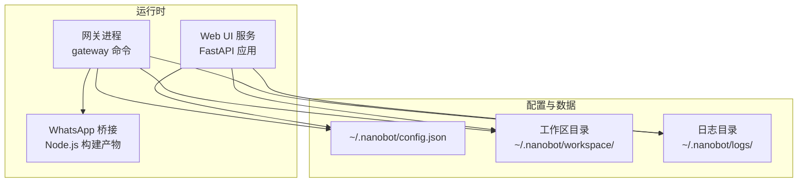
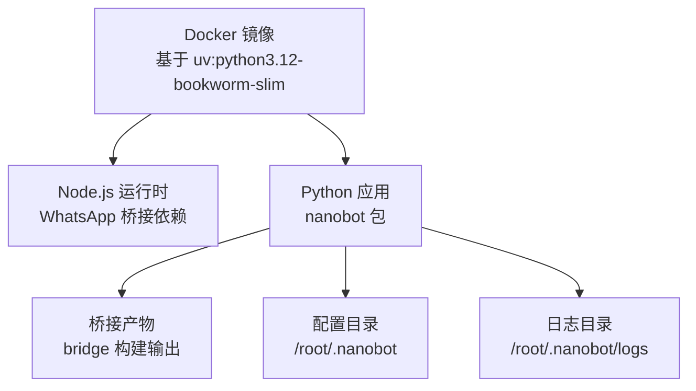
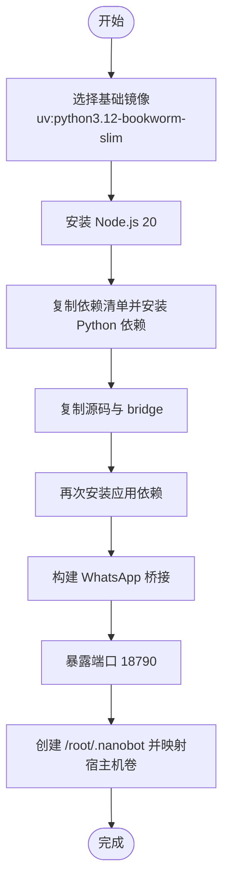
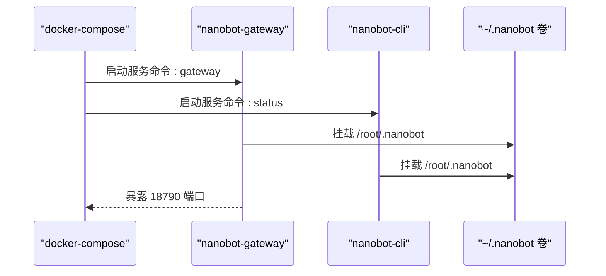
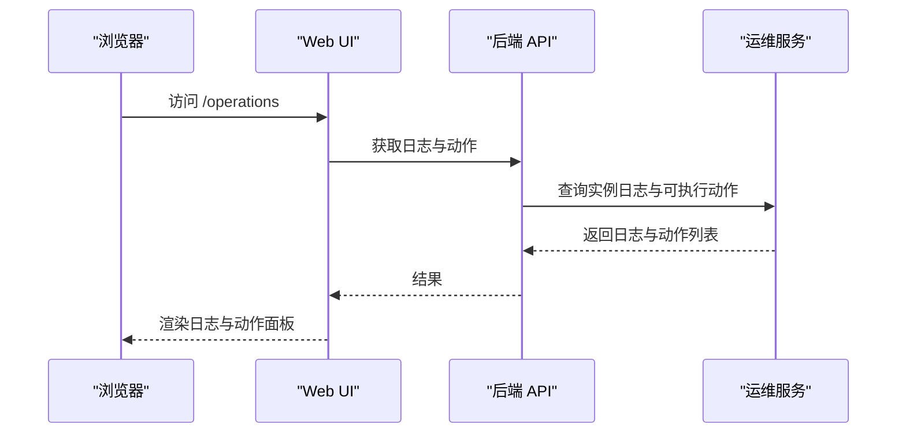
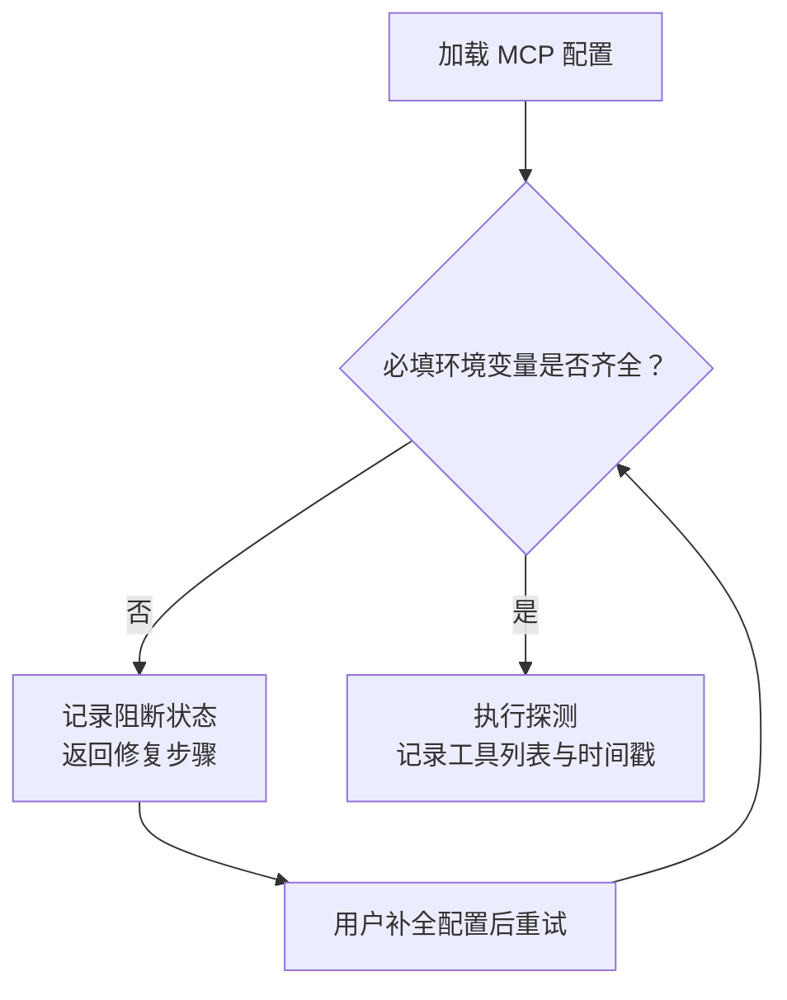
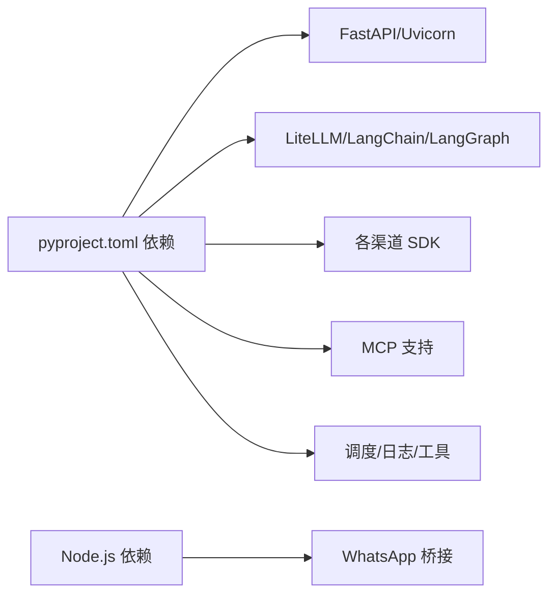

# 部署与运维

<cite>
**本文引用的文件**
- [Dockerfile](file://Dockerfile)
- [docker-compose.yml](file://docker-compose.yml)
- [pyproject.toml](file://pyproject.toml)
- [README.md](file://README.md)
- [.github/workflows/webgui-full.yml](file://.github/workflows/webgui-full.yml)
- [tests/test_docker.sh](file://tests/test_docker.sh)
- [SECURITY.md](file://SECURITY.md)
- [nanobot/cli/commands.py](file://nanobot/cli/commands.py)
- [nanobot/web/app.py](file://nanobot/web/app.py)
- [nanobot/web/mcp_servers.py](file://nanobot/web/mcp_servers.py)
- [nanobot/web/mcp_registry.py](file://nanobot/web/mcp_registry.py)
- [web-ui/src/pages/OperationsPage.tsx](file://web-ui/src/pages/OperationsPage.tsx)
- [web-ui/src/pages/McpServerDetailPage.tsx](file://web-ui/src/pages/McpServerDetailPage.tsx)
</cite>

## 目录
1. [简介](#简介)
2. [项目结构](#项目结构)
3. [核心组件](#核心组件)
4. [架构总览](#架构总览)
5. [详细组件分析](#详细组件分析)
6. [依赖分析](#依赖分析)
7. [性能考虑](#性能考虑)
8. [故障排查指南](#故障排查指南)
9. [结论](#结论)
10. [附录](#附录)

## 简介
本指南面向运维与平台工程团队，提供 Nanobot 在不同环境下的部署与运维操作手册，覆盖容器化（Docker）、编排（docker-compose）、传统服务器、以及云平台部署路径；同时给出环境准备、依赖安装、启动流程、性能调优、监控与日志、备份恢复、升级更新、故障处理、自动化与 CI/CD、安全与网络配置等全生命周期最佳实践。

## 项目结构
- 后端服务由 Python 包提供，通过命令入口启动网关、Web UI、CLI 交互等能力。
- 前端 Web UI 采用独立的 web-ui 存放，支持静态打包或开发热更新模式。
- 桥接层（bridge）用于 WhatsApp 等需要 Node.js 的通道，构建后随应用分发。
- 配置与工作区默认位于用户主目录下的隐藏目录 ~/.nanobot。

图表来源
- [nanobot/cli/commands.py](file://nanobot/cli/commands.py)
- [nanobot/web/app.py](file://nanobot/web/app.py)
- [Dockerfile](file://Dockerfile)

章节来源
- [Dockerfile:1-41](file://Dockerfile#L1-L41)
- [docker-compose.yml:1-32](file://docker-compose.yml#L1-L32)
- [pyproject.toml:1-122](file://pyproject.toml#L1-L122)
- [nanobot/cli/commands.py:308-678](file://nanobot/cli/commands.py#L308-L678)
- [nanobot/web/app.py:70-332](file://nanobot/web/app.py#L70-L332)

## 核心组件
- 命令行入口与子命令：onboard 初始化配置与工作区；gateway 启动多通道网关；agent 提供 CLI 对话；web-ui 启动 Web UI。
- Web 应用：FastAPI 应用工厂，注册路由、中间件与生命周期钩子，支持静态与开发两种前端模式。
- 桥接层：Node.js 依赖用于 WhatsApp 等通道，Dockerfile 中完成安装与构建。
- 配置与存储：默认配置与工作区位于 ~/.nanobot，日志输出到该目录下的 logs 子目录。

章节来源
- [nanobot/cli/commands.py:170-211](file://nanobot/cli/commands.py#L170-L211)
- [nanobot/cli/commands.py:308-678](file://nanobot/cli/commands.py#L308-L678)
- [nanobot/web/app.py:70-332](file://nanobot/web/app.py#L70-L332)
- [Dockerfile:1-41](file://Dockerfile#L1-L41)

## 架构总览
下图展示了从容器镜像到运行态服务、配置与桥接层的关系，以及 Web UI 与后端 API 的交互。

图表来源
- [Dockerfile:1-41](file://Dockerfile#L1-L41)
- [pyproject.toml:19-55](file://pyproject.toml#L19-L55)

章节来源
- [Dockerfile:1-41](file://Dockerfile#L1-L41)
- [pyproject.toml:19-55](file://pyproject.toml#L19-L55)

## 详细组件分析

### 容器化部署（Docker）
- 基础镜像：使用 uv 官方 Python 3.12 slim 镜像，预装 Node.js 以满足 WhatsApp 桥接需求。
- 依赖安装：先复制项目清单与 README，安装 Python 依赖；再复制源码并二次安装，确保缓存层命中。
- 构建桥接：进入 bridge 目录执行 npm install 与 npm run build，产出桥接产物。
- 默认暴露端口：18790（网关），入口命令默认为 status，可通过命令覆盖。
- 卷挂载：建议将 ~/.nanobot 映射到容器内 /root/.nanobot，持久化配置与日志。

图表来源
- [Dockerfile:1-41](file://Dockerfile#L1-L41)

章节来源
- [Dockerfile:1-41](file://Dockerfile#L1-L41)
- [tests/test_docker.sh:1-57](file://tests/test_docker.sh#L1-L57)

### 编排部署（docker-compose）
- 服务定义：提供 nanobot-gateway 与 nanobot-cli 两个服务，均复用公共配置模板。
- 资源限制：对网关服务设置 CPU 与内存上限与预留，保障稳定运行。
- 端口映射：将宿主机 18790 映射到容器 18790。
- 卷挂载：将宿主机 ~/.nanobot 挂载到容器 /root/.nanobot，实现配置与日志持久化。
- 命令覆盖：gateway 服务以 gateway 命令启动，其他服务可按需覆盖。

图表来源
- [docker-compose.yml:8-32](file://docker-compose.yml#L8-L32)

章节来源
- [docker-compose.yml:1-32](file://docker-compose.yml#L1-L32)

### 传统服务器部署
- 环境要求：Python 3.11+，Node.js 20（用于 WhatsApp 桥接）。
- 安装方式：推荐使用 uv 工具链进行安装，或直接从 PyPI 安装；如需 Matrix/Wecom 等可选依赖，按需安装。
- 初始化与配置：使用 onboard 初始化配置与工作区；在 ~/.nanobot/config.json 中填写 API Key 与模型配置。
- 启动服务：
  - 网关：nanobot gateway
  - Web UI：nanobot web-ui（默认监听 127.0.0.1:6788）
  - CLI 交互：nanobot agent 或 nanobot onboard
- 日志：默认输出到 ~/.nanobot/logs/nanobot.log，可结合系统日志服务集中收集。

章节来源
- [README.md:124-161](file://README.md#L124-L161)
- [README.md:169-214](file://README.md#L169-L214)
- [nanobot/cli/commands.py:308-710](file://nanobot/cli/commands.py#L308-L710)
- [nanobot/web/app.py:283-332](file://nanobot/web/app.py#L283-L332)

### 云平台部署（通用建议）
- 容器镜像：优先使用已构建的 Docker 镜像，或在云厂商的容器服务中基于仓库构建。
- 配置管理：通过密钥管理服务注入敏感配置（如 API Key），避免硬编码；将 ~/.nanobot 映射为持久化存储卷。
- 网络与安全：仅暴露必要端口（18790 网关），启用防火墙策略；为 Web UI 设置反向代理与访问控制。
- 自动化：结合 CI/CD 流水线自动构建镜像与发布，配合健康检查与滚动更新策略。

（本节为通用实践说明，不直接分析具体文件）

### Web UI 与运维页面
- Web UI 支持静态打包与开发热更新两种模式，自动检测前端源码与依赖。
- 运维页面提供日志尾部查看与可用运维动作列表，便于快速定位问题。

图表来源
- [nanobot/web/app.py:70-115](file://nanobot/web/app.py#L70-L115)
- [web-ui/src/pages/OperationsPage.tsx:67-138](file://web-ui/src/pages/OperationsPage.tsx#L67-L138)

章节来源
- [nanobot/web/app.py:70-115](file://nanobot/web/app.py#L70-L115)
- [web-ui/src/pages/OperationsPage.tsx:67-138](file://web-ui/src/pages/OperationsPage.tsx#L67-L138)

### MCP 服务器配置与诊断
- MCP 服务器需要声明必填环境变量，若缺失会在探测阶段阻断并提示修复步骤。
- Web UI 提供 MCP 服务器详情页，支持探测、启停、环境变量与请求头配置编辑。

图表来源
- [nanobot/web/mcp_servers.py:144-167](file://nanobot/web/mcp_servers.py#L144-L167)
- [nanobot/web/mcp_servers.py:399-420](file://nanobot/web/mcp_servers.py#L399-L420)
- [nanobot/web/mcp_registry.py:223-256](file://nanobot/web/mcp_registry.py#L223-L256)
- [web-ui/src/pages/McpServerDetailPage.tsx:277-305](file://web-ui/src/pages/McpServerDetailPage.tsx#L277-L305)
- [web-ui/src/pages/McpServerDetailPage.tsx:432-461](file://web-ui/src/pages/McpServerDetailPage.tsx#L432-L461)

章节来源
- [nanobot/web/mcp_servers.py:144-167](file://nanobot/web/mcp_servers.py#L144-L167)
- [nanobot/web/mcp_servers.py:399-420](file://nanobot/web/mcp_servers.py#L399-L420)
- [nanobot/web/mcp_registry.py:223-256](file://nanobot/web/mcp_registry.py#L223-L256)
- [web-ui/src/pages/McpServerDetailPage.tsx:277-305](file://web-ui/src/pages/McpServerDetailPage.tsx#L277-L305)
- [web-ui/src/pages/McpServerDetailPage.tsx:432-461](file://web-ui/src/pages/McpServerDetailPage.tsx#L432-L461)

## 依赖分析
- Python 依赖：通过 pyproject.toml 声明，包含 FastAPI、Uvicorn、LiteLLM、LangChain/LangGraph、各类渠道 SDK、MCP、调度与日志等。
- 可选依赖：Matrix、Wecom 等通道的额外依赖，按需安装。
- Node.js 依赖：WhatsApp 桥接所需，Dockerfile 中统一安装与构建。

图表来源
- [pyproject.toml:19-55](file://pyproject.toml#L19-L55)
- [Dockerfile:3-13](file://Dockerfile#L3-L13)

章节来源
- [pyproject.toml:19-55](file://pyproject.toml#L19-L55)
- [pyproject.toml:57-73](file://pyproject.toml#L57-L73)
- [Dockerfile:3-13](file://Dockerfile#L3-L13)

## 性能考虑
- 资源限制：在容器或编排环境中为网关设置 CPU 与内存上限与预留，避免突发占用影响稳定性。
- 日志级别：生产环境建议使用默认日志级别，必要时通过 CLI 选项开启调试日志，但注意性能开销。
- 外部 API 超时：默认使用 HTTPS 与超时配置，避免阻塞；如需更高吞吐，可在上游提供方侧配置速率限制与并发。
- Web UI 模式：生产建议使用静态打包模式，减少前端热更新带来的资源消耗。

章节来源
- [docker-compose.yml:16-23](file://docker-compose.yml#L16-L23)
- [nanobot/cli/commands.py:332-334](file://nanobot/cli/commands.py#L332-L334)
- [nanobot/web/app.py:283-332](file://nanobot/web/app.py#L283-L332)

## 故障排查指南
- 容器启动验证：使用测试脚本构建镜像并执行 onboard/status，校验关键模块是否就绪。
- 配置与权限：确保 ~/.nanobot 目录与 config.json 权限正确，API Key 配置无误。
- 通道接入：参考 README 中各通道配置示例，逐项核对令牌、ID、白名单等。
- 日志查看：通过 Web UI 运维页面查看日志尾部，或直接读取 ~/.nanobot/logs/nanobot.log。
- 安全检查：定期审计依赖版本，使用 pip-audit/npm audit；更新至最新版本以修复已知漏洞。
- WhatsApp 桥接：升级后需重建本地桥接，按 README 提示清理并重新登录。

章节来源
- [tests/test_docker.sh:1-57](file://tests/test_docker.sh#L1-L57)
- [SECURITY.md:102-127](file://SECURITY.md#L102-L127)
- [README.md:169-168](file://README.md#L169-L168)
- [web-ui/src/pages/OperationsPage.tsx:107-129](file://web-ui/src/pages/OperationsPage.tsx#L107-L129)

## 结论
通过容器化与编排，Nanobot 可在多环境下实现一致的部署体验；结合 Web UI 的运维面板与 MCP 诊断能力，可高效完成配置、监控与故障定位。建议在生产环境遵循最小权限、资源限制、依赖审计与定期升级的安全与运维策略。

## 附录

### A. 环境配置与依赖安装
- Python：3.11+，推荐使用 uv 工具链加速安装。
- Node.js：20（WhatsApp 桥接），Dockerfile 已内置安装与构建。
- 可选依赖：Matrix、Wecom 等通道按需安装。

章节来源
- [pyproject.toml:5-6](file://pyproject.toml#L5-L6)
- [pyproject.toml:57-73](file://pyproject.toml#L57-L73)
- [Dockerfile:3-13](file://Dockerfile#L3-L13)

### B. 启动流程
- 容器：docker build -> docker run（命令覆盖为 gateway/status）。
- 编排：docker-compose up，映射 ~/.nanobot 卷，暴露 18790 端口。
- 传统：pip 安装 -> nanobot onboard -> nanobot gateway/web-ui/agent。

章节来源
- [Dockerfile:15-41](file://Dockerfile#L15-L41)
- [docker-compose.yml:8-32](file://docker-compose.yml#L8-L32)
- [README.md:124-161](file://README.md#L124-L161)

### C. 生产环境性能调优
- 资源配额：为网关设置 CPU/内存上限与预留。
- 日志与监控：集中采集 ~/.nanobot/logs，结合系统监控指标。
- Web UI：生产使用静态打包模式，减少前端热更新开销。

章节来源
- [docker-compose.yml:16-23](file://docker-compose.yml#L16-L23)
- [nanobot/web/app.py:283-332](file://nanobot/web/app.py#L283-L332)

### D. 监控与日志管理
- 日志位置：~/.nanobot/logs/nanobot.log。
- 运维页面：Operations 页面提供日志尾部与可执行动作，便于快速诊断。

章节来源
- [SECURITY.md:152-156](file://SECURITY.md#L152-L156)
- [web-ui/src/pages/OperationsPage.tsx:107-129](file://web-ui/src/pages/OperationsPage.tsx#L107-L129)

### E. 备份与恢复
- 备份对象：~/.nanobot 下的 config.json、workspace、logs、数据库文件（如存在）。
- 恢复流程：停止服务 -> 恢复卷 -> 启动服务 -> 验证网关与通道连通性。

（本节为通用实践说明，不直接分析具体文件）

### F. 升级与更新
- 版本升级：pip 升级或 uv 工具链升级；升级后如涉及 WhatsApp 桥接需重建本地桥接。
- 依赖审计：定期执行 pip-audit 与 npm audit，修复高危漏洞。

章节来源
- [README.md:146-161](file://README.md#L146-L161)
- [SECURITY.md:102-127](file://SECURITY.md#L102-L127)

### G. 故障处理流程
- 快速自检：onboard/status 输出是否包含关键模块；检查配置文件权限与内容。
- 通道问题：核对令牌与 allowFrom 白名单；查看对应通道日志。
- MCP 问题：检查必填环境变量与探测结果，按修复步骤补齐后重试。

章节来源
- [tests/test_docker.sh:25-48](file://tests/test_docker.sh#L25-L48)
- [SECURITY.md:19-36](file://SECURITY.md#L19-L36)
- [nanobot/web/mcp_servers.py:144-167](file://nanobot/web/mcp_servers.py#L144-L167)

### H. 自动化与 CI/CD
- CI 流程：使用 GitHub Actions 执行后端与前端测试、类型检查、Smoke 测试与端到端测试，并上传报告。
- 建议：在流水线中集成镜像构建、安全扫描与部署任务。

章节来源
- [.github/workflows/webgui-full.yml:1-75](file://.github/workflows/webgui-full.yml#L1-L75)

### I. 安全配置与网络设置
- API Key 管理：配置文件权限 0600，生产环境建议使用系统密钥环。
- 访问控制：为各通道配置 allowFrom 白名单，避免未授权访问。
- 网络安全：外部 API 使用 HTTPS，WhatsApp 桥接本地绑定并可启用共享密钥认证。
- 依赖安全：定期更新依赖，关注安全公告。

章节来源
- [SECURITY.md:19-62](file://SECURITY.md#L19-L62)
- [SECURITY.md:90-127](file://SECURITY.md#L90-L127)