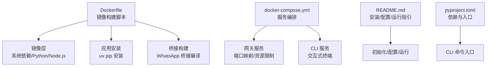
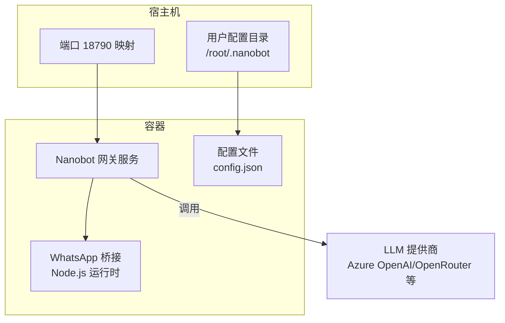
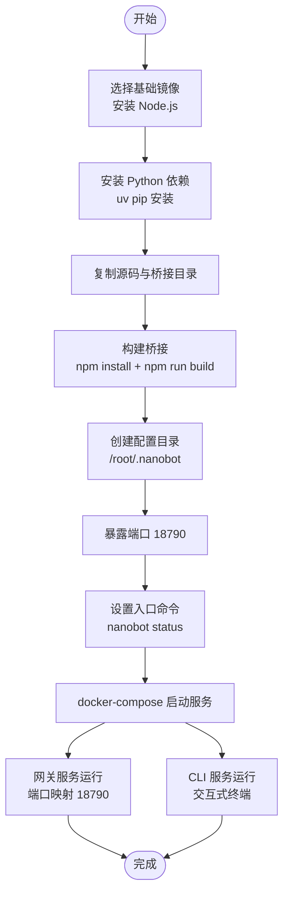
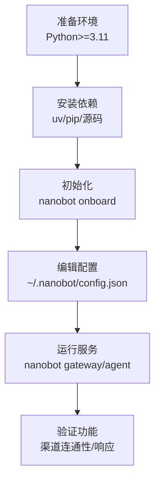
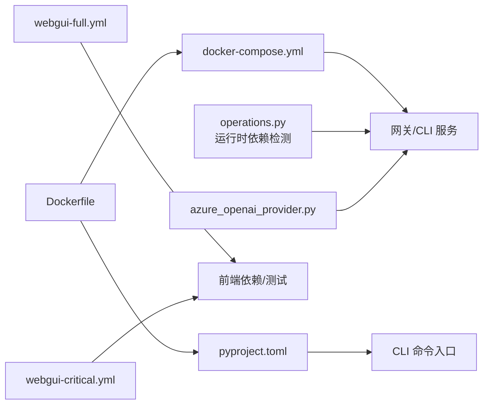
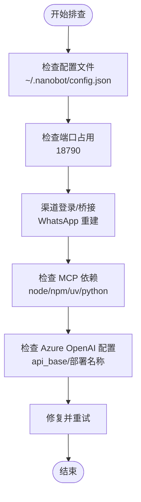

# 部署方式

<cite>
**本文引用的文件**
- [Dockerfile](file://Dockerfile)
- [docker-compose.yml](file://docker-compose.yml)
- [README.md](file://README.md)
- [pyproject.toml](file://pyproject.toml)
- [webgui-full.yml](file://.github/workflows/webgui-full.yml)
- [webgui-critical.yml](file://.github/workflows/webgui-critical.yml)
- [operations.py](file://nanobot/web/operations.py)
- [azure_openai_provider.py](file://nanobot/providers/azure_openai_provider.py)
</cite>

## 目录
1. [简介](#简介)
2. [项目结构](#项目结构)
3. [核心组件](#核心组件)
4. [架构总览](#架构总览)
5. [详细组件分析](#详细组件分析)
6. [依赖关系分析](#依赖关系分析)
7. [性能考量](#性能考量)
8. [故障排查指南](#故障排查指南)
9. [结论](#结论)
10. [附录](#附录)

## 简介
本文件面向运维与开发者，系统性阐述 Nanobot 的多种部署方式：Docker 容器化部署（含镜像构建与编排）、传统服务器部署（环境准备、依赖安装与配置）、以及云平台部署（AWS、GCP、Azure）的实践要点。同时给出部署前检查清单、部署后验证步骤与常见问题的定位与修复建议，并对不同部署方式的优缺点、适用场景与性能差异进行对比。

## 项目结构
Nanobot 提供了完整的容器化与本地部署支持，关键部署相关文件如下：
- Dockerfile：定义基础镜像、系统依赖、Python/Node.js 安装、依赖安装与构建流程、暴露端口与入口命令。
- docker-compose.yml：定义服务编排（网关服务与 CLI 服务），挂载用户配置目录，设置资源限制与端口映射。
- README.md：提供安装、初始化、配置与运行的通用指引，覆盖多渠道接入与运行模式。
- pyproject.toml：声明 Python 依赖与可选依赖（如矩阵、企业微信等），并定义 CLI 入口。
- GitHub Actions 工作流：webgui-full.yml 与 webgui-critical.yml 展示前端与后端测试、类型检查与端到端测试流程，间接反映部署与集成测试的参考路径。

**图表来源**
- [Dockerfile:1-41](file://Dockerfile#L1-L41)
- [docker-compose.yml:1-32](file://docker-compose.yml#L1-L32)
- [README.md:124-214](file://README.md#L124-L214)
- [pyproject.toml:19-77](file://pyproject.toml#L19-L77)

**章节来源**
- [Dockerfile:1-41](file://Dockerfile#L1-L41)
- [docker-compose.yml:1-32](file://docker-compose.yml#L1-L32)
- [README.md:124-214](file://README.md#L124-L214)
- [pyproject.toml:19-77](file://pyproject.toml#L19-L77)

## 核心组件
- 容器镜像构建
  - 基础镜像采用带 uv 的 Python slim 镜像；安装 Node.js 以支持 WhatsApp 桥接；分层安装 Python 依赖并复制源码；构建桥接模块；创建用户配置目录；暴露默认网关端口；设置入口命令。
- 服务编排
  - 定义网关服务与 CLI 服务，挂载用户配置目录至 /root/.nanobot；网关服务映射宿主端口 18790；设置 CPU/内存资源上限与预留；CLI 服务开启交互式终端。
- 运行模式
  - 默认入口命令为 status；可通过命令参数切换为 gateway 或其他子命令。
- 依赖与工具链
  - Python 依赖通过 uv pip 安装；Node.js 用于桥接构建；GitHub Actions 中包含前端依赖安装、类型检查与端到端测试流程，体现端到端验证思路。

**章节来源**
- [Dockerfile:1-41](file://Dockerfile#L1-L41)
- [docker-compose.yml:8-32](file://docker-compose.yml#L8-L32)
- [pyproject.toml:19-77](file://pyproject.toml#L19-L77)
- [webgui-full.yml:15-55](file://.github/workflows/webgui-full.yml#L15-L55)
- [webgui-critical.yml:12-47](file://.github/workflows/webgui-critical.yml#L12-L47)

## 架构总览
下图展示容器化部署的典型拓扑：宿主机通过端口映射访问网关服务，网关服务读取用户配置目录中的配置文件与桥接产物，按需调用各渠道通道与 LLM 提供商。

**图表来源**
- [docker-compose.yml:14-15](file://docker-compose.yml#L14-L15)
- [Dockerfile:33-37](file://Dockerfile#L33-L37)
- [azure_openai_provider.py:50-70](file://nanobot/providers/azure_openai_provider.py#L50-L70)

## 详细组件分析

### Docker 容器化部署
- 镜像构建流程
  - 安装 Node.js 以支持 WhatsApp 桥接；使用 uv pip 安装 Python 依赖；复制源码并再次安装；进入 bridge 目录执行 npm install 与 npm run build；创建 /root/.nanobot 目录；暴露 18790 端口；入口命令为 nanobot status。
- 容器运行与网络
  - docker-compose 定义两个服务：网关服务与 CLI 服务；网关服务将宿主机 18790 映射到容器 18790；CLI 服务启用交互式终端以便调试；两者均挂载 ~/.nanobot 至 /root/.nanobot，实现持久化配置。
- 入口命令与模式
  - 默认命令为 status；可通过 command 覆盖为 gateway 或其他子命令；README 提供了 gateway 的运行方式与多渠道接入指引。

**图表来源**
- [Dockerfile:1-41](file://Dockerfile#L1-L41)
- [docker-compose.yml:8-32](file://docker-compose.yml#L8-L32)

**章节来源**
- [Dockerfile:1-41](file://Dockerfile#L1-L41)
- [docker-compose.yml:8-32](file://docker-compose.yml#L8-L32)
- [README.md:169-214](file://README.md#L169-L214)

### 传统服务器部署
- 环境准备
  - Python 版本要求：README 明确 Python >= 3.11；pyproject.toml 也声明了 Python 3.11/3.12 支持。
  - 可选依赖：如需要矩阵或企业微信等渠道，需安装对应可选依赖。
- 依赖安装
  - 推荐使用 uv 工具安装（稳定、快速）；也可从源码安装或从 PyPI 安装。
- 配置文件设置
  - 配置文件位于 ~/.nanobot/config.json；README 提供了初始化、配置 API Key 与模型、以及多渠道接入的步骤与示例片段路径。
- 运行方式
  - 使用 nanobot 命令启动不同模式（如 gateway、agent 等）；README 提供了 gateway 的运行示例。

**图表来源**
- [README.md:124-214](file://README.md#L124-L214)
- [pyproject.toml:19-55](file://pyproject.toml#L19-L55)

**章节来源**
- [README.md:124-214](file://README.md#L124-L214)
- [pyproject.toml:19-55](file://pyproject.toml#L19-L55)

### 云平台部署指南（AWS/GCP/Azure）
- 通用步骤
  - 在目标云上创建虚拟机实例（推荐 Ubuntu/CentOS 等 Linux 发行版），开放必要入站端口（如 18790）。
  - 安装 Python 与 uv，拉取源码并安装依赖。
  - 准备 ~/.nanobot/config.json 并初始化配置。
  - 以 systemd 或 Docker 方式运行网关服务。
- AWS
  - 使用 EC2 实例，配置安全组放行 18790；可结合 EBS 卷挂载持久化配置目录。
- GCP
  - 使用 Compute Engine 实例，配置防火墙规则放行 18790；可结合 Persistent Disk 挂载配置。
- Azure
  - 使用虚拟机，配置网络安全组放行 18790；可结合托管磁盘挂载配置目录。
- 注意事项
  - 不同云厂商的镜像源与包管理器可能不同，需根据发行版调整依赖安装步骤。
  - 如使用云厂商提供的托管 LLM 服务（如 Azure OpenAI），请在配置中正确填写 API Key 与端点信息。

**章节来源**
- [README.md:169-214](file://README.md#L169-L214)
- [azure_openai_provider.py:50-70](file://nanobot/providers/azure_openai_provider.py#L50-L70)

### 不同部署方式的优缺点与适用场景
- Docker 容器化
  - 优点：环境隔离、依赖一致、易于迁移与扩展；支持多服务编排；便于 CI/CD 集成。
  - 缺点：需要掌握 Docker 与 compose；资源开销略高于裸机。
  - 适用：生产环境、多环境一致性要求高、团队具备容器运维能力。
- 传统服务器部署
  - 优点：部署简单、资源占用低、便于本地调试。
  - 缺点：环境差异大、依赖管理复杂、升级与回滚困难。
  - 适用：开发测试、小规模部署、无容器运维能力的团队。
- 云平台部署
  - 优点：弹性伸缩、高可用、与云服务深度集成。
  - 缺点：成本较高、涉及多云厂商差异、合规与数据主权考虑。
  - 适用：生产级高可用、需要弹性与灾备能力的企业场景。

**章节来源**
- [Dockerfile:1-41](file://Dockerfile#L1-L41)
- [docker-compose.yml:8-32](file://docker-compose.yml#L8-L32)
- [README.md:124-214](file://README.md#L124-L214)

### 性能差异
- 容器化部署受镜像大小与启动时间影响，但启动后资源占用与性能与裸机接近。
- 传统服务器部署启动更快，但受系统环境与依赖版本影响较大。
- 云平台部署可结合弹性与负载均衡，提升整体吞吐与可用性，但需关注网络延迟与成本。

**章节来源**
- [docker-compose.yml:16-23](file://docker-compose.yml#L16-L23)
- [Dockerfile:33-37](file://Dockerfile#L33-L37)

## 依赖关系分析
- 组件耦合
  - Dockerfile 与 docker-compose.yml 联动：前者负责镜像构建，后者负责服务编排与端口映射。
  - README.md 与 pyproject.toml 联动：前者提供安装与运行指引，后者定义依赖与 CLI 入口。
  - operations.py 与 GitHub Actions 工作流：前者在运行时检测 MCP 依赖工具链（如 node/npm/uv/python），后者在 CI 中安装前端依赖并执行测试，体现端到端验证思路。
- 外部依赖
  - Azure OpenAI 提供商需要正确的 API Base 与部署名称，URL 构建遵循特定格式。

**图表来源**
- [Dockerfile:1-41](file://Dockerfile#L1-L41)
- [docker-compose.yml:1-32](file://docker-compose.yml#L1-L32)
- [pyproject.toml:19-77](file://pyproject.toml#L19-L77)
- [operations.py:188-208](file://nanobot/web/operations.py#L188-L208)
- [webgui-full.yml:15-55](file://.github/workflows/webgui-full.yml#L15-L55)
- [webgui-critical.yml:12-47](file://.github/workflows/webgui-critical.yml#L12-L47)
- [azure_openai_provider.py:50-70](file://nanobot/providers/azure_openai_provider.py#L50-L70)

**章节来源**
- [operations.py:188-208](file://nanobot/web/operations.py#L188-L208)
- [webgui-full.yml:15-55](file://.github/workflows/webgui-full.yml#L15-L55)
- [webgui-critical.yml:12-47](file://.github/workflows/webgui-critical.yml#L12-L47)
- [azure_openai_provider.py:50-70](file://nanobot/providers/azure_openai_provider.py#L50-L70)

## 性能考量
- 资源限制
  - docker-compose 为网关服务设置了 CPU/内存上限与预留，有助于在共享环境中稳定运行。
- 端口与网络
  - 默认暴露 18790 端口，确保外部访问；在云平台部署时需配合安全组/防火墙策略。
- 依赖安装
  - 使用 uv pip 安装依赖，可减少安装时间与缓存命中率；桥接构建在镜像构建阶段完成，避免运行时等待。

**章节来源**
- [docker-compose.yml:16-23](file://docker-compose.yml#L16-L23)
- [Dockerfile:33-37](file://Dockerfile#L33-L37)
- [pyproject.toml:19-55](file://pyproject.toml#L19-L55)

## 故障排查指南
- 配置文件缺失或权限问题
  - 确认 ~/.nanobot/config.json 存在且可读；容器部署时检查卷挂载是否正确。
- 端口冲突
  - 若宿主机 18790 已被占用，修改 docker-compose 的端口映射或释放端口。
- 渠道登录失败（如 WhatsApp）
  - README 提示升级后需重建桥接；删除桥接缓存目录并重新登录。
- MCP 依赖缺失
  - operations.py 会检测运行所需的工具链（如 node/npm/uv/python），若缺失会导致运行异常；请按需安装。
- Azure OpenAI URL 构建错误
  - 确保 api_base 正确且不以斜杠结尾，部署名称与实际一致。

**图表来源**
- [README.md:162-167](file://README.md#L162-L167)
- [operations.py:188-208](file://nanobot/web/operations.py#L188-L208)
- [azure_openai_provider.py:50-70](file://nanobot/providers/azure_openai_provider.py#L50-L70)

**章节来源**
- [README.md:162-167](file://README.md#L162-L167)
- [operations.py:188-208](file://nanobot/web/operations.py#L188-L208)
- [azure_openai_provider.py:50-70](file://nanobot/providers/azure_openai_provider.py#L50-L70)

## 结论
Nanobot 提供了从本地到容器再到云平台的全栈部署方案。容器化部署强调一致性与可移植性，适合生产与规模化场景；传统服务器部署适合快速验证与本地开发；云平台部署则提供弹性与高可用能力。结合本文的检查清单、验证步骤与故障排查建议，可在不同环境下稳定落地 Nanobot。

## 附录

### 部署前环境检查清单
- 系统与语言
  - Python 版本满足要求（>=3.11）。
  - 容器部署：Docker 与 docker-compose 已安装。
- 网络与端口
  - 18790 端口未被占用；防火墙/安全组已放行。
- 配置与密钥
  - ~/.nanobot/config.json 已生成并包含必要的 API Key 与模型配置。
- 可选依赖
  - 如需矩阵/企业微信等渠道，已安装对应可选依赖。
- 渠道桥接
  - WhatsApp 等渠道需桥接支持，容器镜像已内置 Node.js；首次使用或升级后需重建桥接。

**章节来源**
- [pyproject.toml:19-65](file://pyproject.toml#L19-L65)
- [Dockerfile:3-13](file://Dockerfile#L3-L13)
- [README.md:162-167](file://README.md#L162-L167)

### 部署后验证步骤
- 基础连通性
  - 访问宿主机 18790 端口，确认网关服务正常返回状态。
- 配置生效
  - 通过 CLI 查看状态与配置加载情况。
- 渠道连通性
  - 按 README 的渠道接入指引发送测试消息，确认回复正常。
- 端到端测试（CI 参考）
  - 可参考 webgui-full.yml 与 webgui-critical.yml 中的前端与后端测试流程，作为端到端验证的参考。

**章节来源**
- [README.md:169-214](file://README.md#L169-L214)
- [webgui-full.yml:42-51](file://.github/workflows/webgui-full.yml#L42-L51)
- [webgui-critical.yml:38-47](file://.github/workflows/webgui-critical.yml#L38-L47)