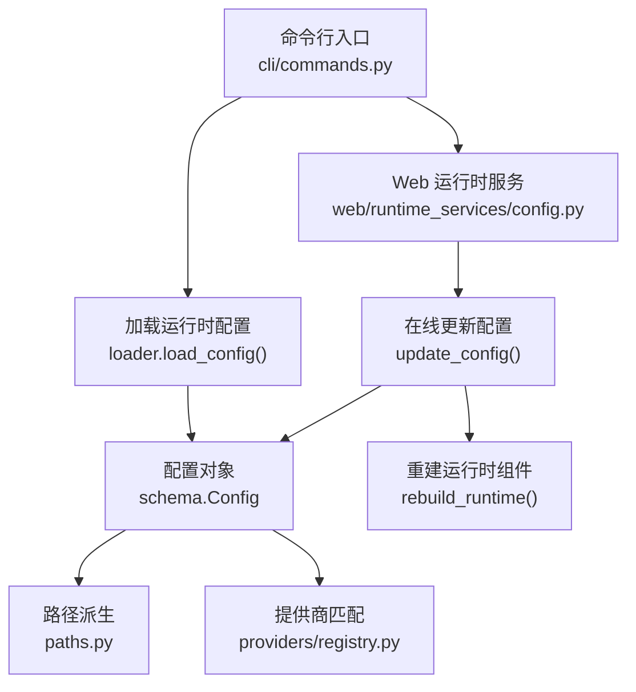
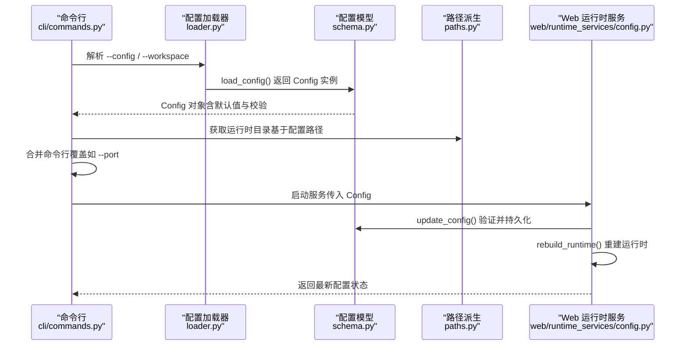
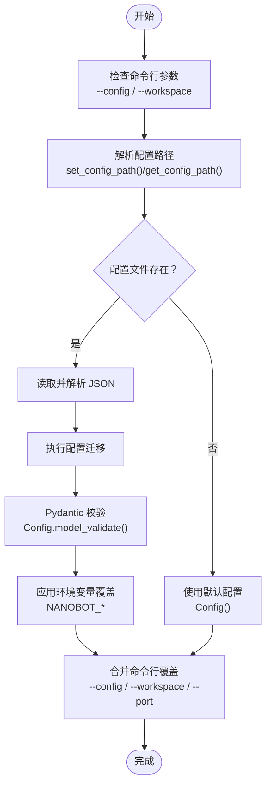
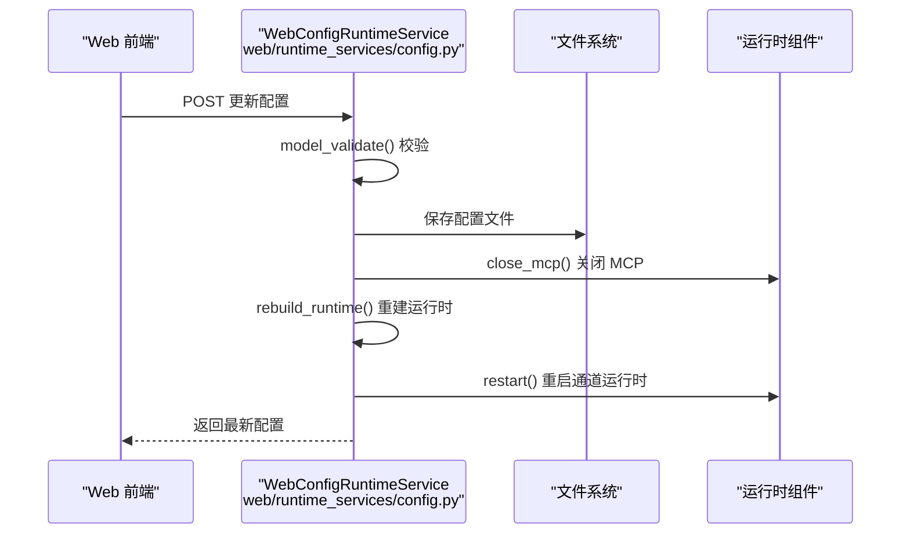
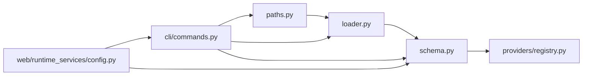

# 动态配置加载

<cite>
**本文引用的文件**
- [nanobot/config/__init__.py](file://nanobot/config/__init__.py)
- [nanobot/config/loader.py](file://nanobot/config/loader.py)
- [nanobot/config/schema.py](file://nanobot/config/schema.py)
- [nanobot/config/paths.py](file://nanobot/config/paths.py)
- [nanobot/cli/commands.py](file://nanobot/cli/commands.py)
- [nanobot/web/runtime_services/config.py](file://nanobot/web/runtime_services/config.py)
- [nanobot/providers/registry.py](file://nanobot/providers/registry.py)
- [tests/test_config_paths.py](file://tests/test_config_paths.py)
- [tests/test_config_migration.py](file://tests/test_config_migration.py)
</cite>

## 目录
1. [简介](#简介)
2. [项目结构](#项目结构)
3. [核心组件](#核心组件)
4. [架构总览](#架构总览)
5. [详细组件分析](#详细组件分析)
6. [依赖分析](#依赖分析)
7. [性能考虑](#性能考虑)
8. [故障排查指南](#故障排查指南)
9. [结论](#结论)
10. [附录](#附录)

## 简介
本文件系统性阐述 Nanobot 的动态配置加载机制，包括：
- 配置文件的加载顺序与优先级
- 配置合并与迁移策略
- 环境变量覆盖与命令行参数影响
- 配置验证、错误处理与回退机制
- 完整的配置加载流程图与代码示例路径
- 热重载与配置更新在 Web 运行时中的实现方式

## 项目结构
围绕配置加载的关键模块与职责如下：
- 配置定义与校验：schema.py（Pydantic 模型 + 环境变量前缀）
- 配置加载与保存：loader.py（文件读取、迁移、默认值回退）
- 路径派生：paths.py（基于当前配置路径派生运行时目录）
- 命令行入口与覆盖：cli/commands.py（--config、--workspace、--port 等）
- Web 运行时服务：web/runtime_services/config.py（在线更新配置并重建运行时）
- 提供商匹配：providers/registry.py（模型到提供商的匹配逻辑）

图表来源
- [nanobot/cli/commands.py:274-291](file://nanobot/cli/commands.py#L274-L291)
- [nanobot/config/loader.py:26-66](file://nanobot/config/loader.py#L26-L66)
- [nanobot/config/schema.py:351-449](file://nanobot/config/schema.py#L351-L449)
- [nanobot/config/paths.py:11-56](file://nanobot/config/paths.py#L11-L56)
- [nanobot/providers/registry.py:407-466](file://nanobot/providers/registry.py#L407-L466)
- [nanobot/web/runtime_services/config.py:79-156](file://nanobot/web/runtime_services/config.py#L79-L156)

章节来源
- [nanobot/config/__init__.py:1-31](file://nanobot/config/__init__.py#L1-L31)
- [nanobot/config/loader.py:1-82](file://nanobot/config/loader.py#L1-L82)
- [nanobot/config/schema.py:1-450](file://nanobot/config/schema.py#L1-L450)
- [nanobot/config/paths.py:1-56](file://nanobot/config/paths.py#L1-L56)
- [nanobot/cli/commands.py:1-800](file://nanobot/cli/commands.py#L1-L800)
- [nanobot/web/runtime_services/config.py:1-190](file://nanobot/web/runtime_services/config.py#L1-L190)
- [nanobot/providers/registry.py:1-466](file://nanobot/providers/registry.py#L1-L466)

## 核心组件
- 配置对象与环境变量映射
  - 使用 Pydantic Settings，支持环境变量前缀与嵌套分隔符，键名可同时接受 camelCase 与 snake_case。
  - 关键点：env_prefix="NANOBOT_"、env_nested_delimiter="__"。
- 配置加载器
  - 默认配置文件路径：用户主目录下的 .nanobot/config.json。
  - 支持设置当前配置路径（多实例支持）。
  - 加载失败或格式错误时回退到默认配置。
  - 内置配置迁移逻辑，兼容旧字段。
- 路径派生
  - 所有运行时数据目录均基于当前配置文件所在目录派生，保证多实例隔离。
- 命令行覆盖
  - 支持 --config 指定配置文件；--workspace 覆盖工作空间；--port 覆盖网关端口等。
- Web 在线更新
  - 提供 update_config 接口，验证后持久化并重建运行时，触发通道运行时重启。

章节来源
- [nanobot/config/schema.py:448-449](file://nanobot/config/schema.py#L448-L449)
- [nanobot/config/loader.py:13-66](file://nanobot/config/loader.py#L13-L66)
- [nanobot/config/paths.py:11-56](file://nanobot/config/paths.py#L11-L56)
- [nanobot/cli/commands.py:274-291](file://nanobot/cli/commands.py#L274-L291)
- [nanobot/web/runtime_services/config.py:147-156](file://nanobot/web/runtime_services/config.py#L147-L156)

## 架构总览
下图展示从命令行到运行时的配置加载与覆盖链路，以及 Web 在线更新的热重载路径。

图表来源
- [nanobot/cli/commands.py:274-291](file://nanobot/cli/commands.py#L274-L291)
- [nanobot/config/loader.py:26-66](file://nanobot/config/loader.py#L26-L66)
- [nanobot/config/schema.py:351-449](file://nanobot/config/schema.py#L351-L449)
- [nanobot/config/paths.py:11-56](file://nanobot/config/paths.py#L11-L56)
- [nanobot/web/runtime_services/config.py:79-156](file://nanobot/web/runtime_services/config.py#L79-L156)

## 详细组件分析

### 配置加载与优先级
- 文件加载优先级
  - 显式指定的 --config 路径优先于默认路径。
  - 若文件存在且可解析，则使用其内容；否则回退到默认配置。
- 环境变量覆盖
  - 通过 env_prefix="NANOBOT_" 与 env_nested_delimiter="__"，可将环境变量映射到 Config 的嵌套字段。
  - 例如：NANOBOT_agents_defaults_model 可覆盖 agents.defaults.model。
- 命令行参数覆盖
  - gateway/web-ui/agent 子命令支持 --config、--workspace、--port 等选项，直接覆盖配置对象对应字段。
- 回退与默认值
  - 当配置文件缺失或解析失败时，返回 Config() 的默认值集合。
  - 提供商匹配中存在多层回退（显式前缀、关键词、本地网关、通用网关）。

图表来源
- [nanobot/config/loader.py:26-66](file://nanobot/config/loader.py#L26-L66)
- [nanobot/config/schema.py:351-449](file://nanobot/config/schema.py#L351-L449)
- [nanobot/cli/commands.py:274-291](file://nanobot/cli/commands.py#L274-L291)

章节来源
- [nanobot/config/loader.py:26-66](file://nanobot/config/loader.py#L26-L66)
- [nanobot/config/schema.py:351-449](file://nanobot/config/schema.py#L351-L449)
- [nanobot/cli/commands.py:308-340](file://nanobot/cli/commands.py#L308-L340)

### 配置迁移与兼容性
- 迁移规则
  - 将 tools.exec.restrictToWorkspace 迁移到 tools.restrictToWorkspace。
  - 规范 mcpServers 字典项的 enabled 字段（若缺失则设为 True）。
- 测试验证
  - 旧配置包含 memoryWindow 时，加载后会保留 maxTokens 并提示 contextWindowTokens 的警告。
  - 保存配置时，不再写入已废弃的 memoryWindow 字段。

章节来源
- [nanobot/config/loader.py:68-82](file://nanobot/config/loader.py#L68-L82)
- [tests/test_config_migration.py:11-89](file://tests/test_config_migration.py#L11-L89)

### 环境变量覆盖机制
- 映射规则
  - env_prefix="NANOBOT_"：所有以 NANOBOT_ 开头的环境变量参与覆盖。
  - env_nested_delimiter="__"：双下划线用于分隔嵌套层级（如 NANOBOT_agents_defaults_model）。
- 应用时机
  - 在 Config.model_validate() 之后生效，因此不会影响模型校验阶段的字段命名。
- 典型用途
  - 覆盖提供商密钥、模型名称、代理设置、工具开关等。

章节来源
- [nanobot/config/schema.py:448-449](file://nanobot/config/schema.py#L448-L449)

### 命令行参数对配置的影响
- gateway/web-ui/agent 子命令
  - --config：设置配置文件路径（并调用 set_config_path），随后 load_config。
  - --workspace：覆盖 agents.defaults.workspace。
  - --port：覆盖 gateway.port。
- CLI 调用链
  - _load_runtime_config() 统一处理参数解析与覆盖。
  - 未找到配置文件时，会提示错误并退出。

章节来源
- [nanobot/cli/commands.py:274-291](file://nanobot/cli/commands.py#L274-L291)
- [nanobot/cli/commands.py:308-340](file://nanobot/cli/commands.py#L308-L340)

### 配置验证、错误处理与回退
- 验证
  - 使用 Pydantic Settings 的 model_validate() 进行严格类型与字段校验。
- 错误处理
  - JSON 解析失败或值校验失败时，打印警告并回退到默认配置。
- 回退策略
  - 默认配置提供安全的最小可用集（如 gateway.host/port、agents.defaults 等）。
  - 提供商匹配存在多级回退，确保在缺少密钥时仍能选择合适的路由或本地部署。

章节来源
- [nanobot/config/loader.py:44-48](file://nanobot/config/loader.py#L44-L48)
- [nanobot/config/schema.py:365-417](file://nanobot/config/schema.py#L365-L417)

### 热重载与配置更新实现
- Web 在线更新流程
  - update_config() 接收前端提交的新配置，进行 model_validate() 校验。
  - 保存到磁盘并重建运行时（消息总线、会话管理、AgentLoop、模板管理等）。
  - 重启通道运行时，使新配置立即生效。
- 重启范围
  - 仅影响运行时状态，不中断外部通道连接（由通道运行时负责重启）。
- 适用场景
  - 修改提供商密钥、工具开关、代理设置、通道启用状态等。

图表来源
- [nanobot/web/runtime_services/config.py:147-156](file://nanobot/web/runtime_services/config.py#L147-L156)
- [nanobot/web/runtime_services/config.py:79-109](file://nanobot/web/runtime_services/config.py#L79-L109)

章节来源
- [nanobot/web/runtime_services/config.py:79-156](file://nanobot/web/runtime_services/config.py#L79-L156)

### 多实例与路径隔离
- 多实例支持
  - set_config_path() 可为不同实例设置独立配置路径。
  - 所有运行时目录（cron、logs、media 等）均基于当前配置路径派生，确保数据隔离。
- 共享与遗留路径
  - CLI 历史、桥接安装目录、遗留 sessions 目录保持全局共享，不受当前配置路径影响。

章节来源
- [nanobot/config/loader.py:13-23](file://nanobot/config/loader.py#L13-L23)
- [nanobot/config/paths.py:11-56](file://nanobot/config/paths.py#L11-L56)
- [tests/test_config_paths.py:16-43](file://tests/test_config_paths.py#L16-L43)

### 提供商匹配与配置联动
- 匹配逻辑
  - 优先按显式前缀（如 "openrouter/"）匹配；
  - 其次按关键词匹配（如 "claude"、"gpt"）；
  - 最后按网关/本地检测（api_key 前缀、api_base 关键词）回退。
- 与配置的关系
  - Config.get_provider()/get_api_base() 基于当前配置与匹配结果决定最终路由与默认 API 基地址。
  - 环境变量可用于注入额外头部或覆盖默认网关地址。

章节来源
- [nanobot/config/schema.py:365-448](file://nanobot/config/schema.py#L365-L448)
- [nanobot/providers/registry.py:429-458](file://nanobot/providers/registry.py#L429-L458)

## 依赖分析
- 组件耦合
  - loader.py 与 schema.py 强耦合（前者依赖后者模型进行校验与默认值）。
  - paths.py 依赖 loader.get_config_path()，形成“配置路径 → 运行时目录”的单向依赖。
  - cli/commands.py 与 loader/paths/schema 协作，完成命令行覆盖与运行时初始化。
  - web/runtime_services/config.py 依赖 schema 与各运行时组件，负责在线更新。
- 外部依赖
  - Pydantic Settings 用于环境变量映射与校验。
  - providers/registry.py 作为单一事实源，驱动模型到提供商的匹配。

图表来源
- [nanobot/config/loader.py:1-82](file://nanobot/config/loader.py#L1-L82)
- [nanobot/config/schema.py:1-450](file://nanobot/config/schema.py#L1-L450)
- [nanobot/config/paths.py:1-56](file://nanobot/config/paths.py#L1-L56)
- [nanobot/cli/commands.py:1-800](file://nanobot/cli/commands.py#L1-L800)
- [nanobot/web/runtime_services/config.py:1-190](file://nanobot/web/runtime_services/config.py#L1-L190)
- [nanobot/providers/registry.py:1-466](file://nanobot/providers/registry.py#L1-L466)

章节来源
- [nanobot/config/loader.py:1-82](file://nanobot/config/loader.py#L1-L82)
- [nanobot/config/schema.py:1-450](file://nanobot/config/schema.py#L1-L450)
- [nanobot/config/paths.py:1-56](file://nanobot/config/paths.py#L1-L56)
- [nanobot/cli/commands.py:1-800](file://nanobot/cli/commands.py#L1-L800)
- [nanobot/web/runtime_services/config.py:1-190](file://nanobot/web/runtime_services/config.py#L1-L190)
- [nanobot/providers/registry.py:1-466](file://nanobot/providers/registry.py#L1-L466)

## 性能考虑
- 配置加载
  - JSON 解析与 Pydantic 校验开销较小，通常在毫秒级；建议避免频繁重复加载。
- 热重载
  - rebuild_runtime() 会重建多个运行时组件，建议在低频变更场景使用，避免高频更新导致抖动。
- 路径派生
  - 基于文件系统路径的派生操作简单高效，注意避免在热路径中频繁创建父目录。

## 故障排查指南
- 配置文件无法加载
  - 症状：出现警告并使用默认配置。
  - 排查：检查文件权限、JSON 格式、字段拼写；确认是否被命令行覆盖。
- 环境变量未生效
  - 症状：期望的覆盖未发生。
  - 排查：确认环境变量名符合 NANOBOT_ 前缀与双下划线分隔规则；检查嵌套层级是否正确。
- 命令行覆盖无效
  - 症状：--config 或 --workspace 未生效。
  - 排查：确认子命令支持该选项；检查路径是否存在且可访问。
- Web 在线更新失败
  - 症状：update_config() 抛错或未生效。
  - 排查：查看校验错误信息；确认配置文件可写；观察运行时重建日志。

章节来源
- [nanobot/config/loader.py:44-48](file://nanobot/config/loader.py#L44-L48)
- [nanobot/config/schema.py:448-449](file://nanobot/config/schema.py#L448-L449)
- [nanobot/cli/commands.py:274-291](file://nanobot/cli/commands.py#L274-L291)
- [nanobot/web/runtime_services/config.py:147-156](file://nanobot/web/runtime_services/config.py#L147-L156)

## 结论
Nanobot 的配置加载机制以 Pydantic Settings 为核心，结合文件加载、环境变量覆盖与命令行参数，实现了清晰的优先级与强校验。迁移逻辑保障了历史配置的平滑演进；多实例路径派生确保了运行时隔离。Web 在线更新提供了热重载能力，使关键配置可在不重启服务的情况下生效。整体设计兼顾易用性与可靠性，适合在生产环境中稳定运行。

## 附录
- 关键实现路径参考
  - 配置加载与保存：[nanobot/config/loader.py:26-66](file://nanobot/config/loader.py#L26-L66)
  - 配置模型与环境变量映射：[nanobot/config/schema.py:351-449](file://nanobot/config/schema.py#L351-L449)
  - 路径派生（多实例隔离）：[nanobot/config/paths.py:11-56](file://nanobot/config/paths.py#L11-L56)
  - 命令行覆盖（gateway/web-ui/agent）：[nanobot/cli/commands.py:274-291](file://nanobot/cli/commands.py#L274-L291)
  - Web 在线更新与热重载：[nanobot/web/runtime_services/config.py:79-156](file://nanobot/web/runtime_services/config.py#L79-L156)
  - 提供商匹配与回退：[nanobot/providers/registry.py:429-458](file://nanobot/providers/registry.py#L429-L458)
  - 多实例路径测试：[tests/test_config_paths.py:16-43](file://tests/test_config_paths.py#L16-L43)
  - 配置迁移与兼容性测试：[tests/test_config_migration.py:11-89](file://tests/test_config_migration.py#L11-L89)