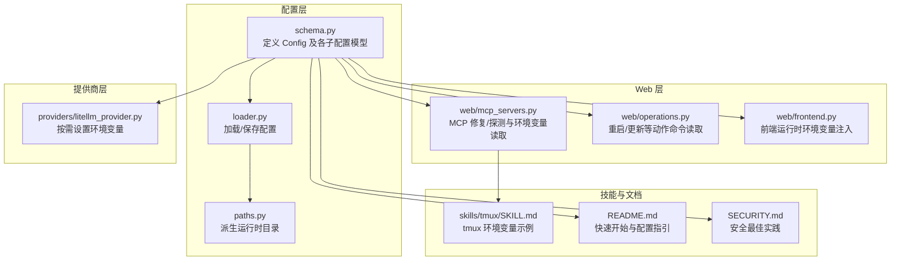
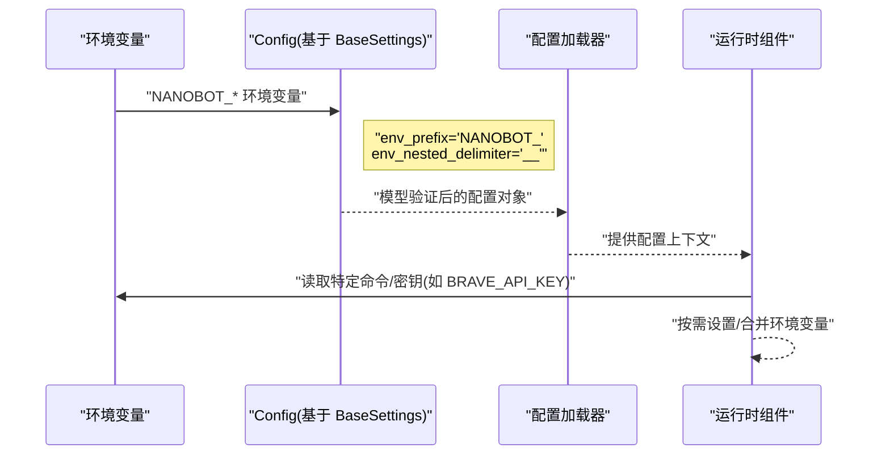
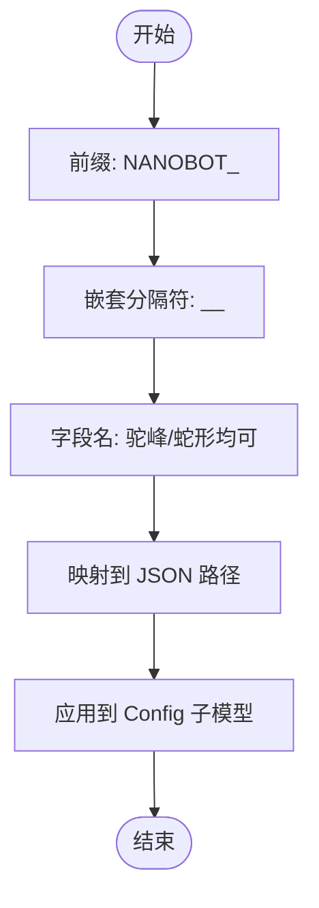
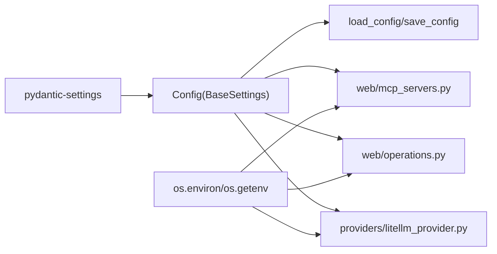

# 环境变量支持

<cite>
**本文引用的文件**
- [nanobot/config/schema.py](file://nanobot/config/schema.py)
- [nanobot/config/loader.py](file://nanobot/config/loader.py)
- [nanobot/config/paths.py](file://nanobot/config/paths.py)
- [nanobot/web/mcp_servers.py](file://nanobot/web/mcp_servers.py)
- [nanobot/web/operations.py](file://nanobot/web/operations.py)
- [nanobot/web/frontend.py](file://nanobot/web/frontend.py)
- [nanobot/providers/litellm_provider.py](file://nanobot/providers/litellm_provider.py)
- [nanobot/skills/tmux/SKILL.md](file://nanobot/skills/tmux/SKILL.md)
- [SECURITY.md](file://SECURITY.md)
- [README.md](file://README.md)
</cite>

## 目录
1. [简介](#简介)
2. [项目结构](#项目结构)
3. [核心组件](#核心组件)
4. [架构总览](#架构总览)
5. [详细组件分析](#详细组件分析)
6. [依赖分析](#依赖分析)
7. [性能考虑](#性能考虑)
8. [故障排查指南](#故障排查指南)
9. [结论](#结论)
10. [附录](#附录)

## 简介
本文件系统性阐述 Nanobot 的环境变量支持机制，重点包括：
- 环境变量前缀 NANOBOT_ 的使用规则与嵌套分隔符的作用
- 如何通过环境变量覆盖配置文件中的设置
- 敏感信息（如 API 密钥）的安全存储与访问方式
- 完整的配置示例与常见使用场景
- 环境变量与配置文件的优先级关系与冲突处理策略

## 项目结构
围绕环境变量支持的相关模块主要分布在以下位置：
- 配置定义与加载：nanobot/config/schema.py、nanobot/config/loader.py、nanobot/config/paths.py
- Web 平台与运维操作：nanobot/web/mcp_servers.py、nanobot/web/operations.py、nanobot/web/frontend.py
- 提供商适配与密钥注入：nanobot/providers/litellm_provider.py
- 技能与脚本中的环境变量使用示例：nanobot/skills/tmux/SKILL.md
- 安全最佳实践：SECURITY.md
- 快速开始与配置指引：README.md

图表来源
- [nanobot/config/schema.py:351-449](file://nanobot/config/schema.py#L351-L449)
- [nanobot/config/loader.py:26-48](file://nanobot/config/loader.py#L26-L48)
- [nanobot/config/paths.py:11-56](file://nanobot/config/paths.py#L11-L56)
- [nanobot/web/mcp_servers.py:250-287](file://nanobot/web/mcp_servers.py#L250-L287)
- [nanobot/web/operations.py:19-32](file://nanobot/web/operations.py#L19-L32)
- [nanobot/web/frontend.py:167-168](file://nanobot/web/frontend.py#L167-L168)
- [nanobot/providers/litellm_provider.py:75-86](file://nanobot/providers/litellm_provider.py#L75-L86)
- [nanobot/skills/tmux/SKILL.md:13-45](file://nanobot/skills/tmux/SKILL.md#L13-L45)
- [README.md:169-200](file://README.md#L169-L200)
- [SECURITY.md:19-36](file://SECURITY.md#L19-L36)

章节来源
- [nanobot/config/schema.py:351-449](file://nanobot/config/schema.py#L351-L449)
- [nanobot/config/loader.py:26-48](file://nanobot/config/loader.py#L26-L48)
- [nanobot/config/paths.py:11-56](file://nanobot/config/paths.py#L11-L56)
- [nanobot/web/mcp_servers.py:250-287](file://nanobot/web/mcp_servers.py#L250-L287)
- [nanobot/web/operations.py:19-32](file://nanobot/web/operations.py#L19-L32)
- [nanobot/web/frontend.py:167-168](file://nanobot/web/frontend.py#L167-L168)
- [nanobot/providers/litellm_provider.py:75-86](file://nanobot/providers/litellm_provider.py#L75-L86)
- [nanobot/skills/tmux/SKILL.md:13-45](file://nanobot/skills/tmux/SKILL.md#L13-L45)
- [README.md:169-200](file://README.md#L169-L200)
- [SECURITY.md:19-36](file://SECURITY.md#L19-L36)

## 核心组件
- 配置模型与环境变量绑定
  - 根配置类 Config 继承自 pydantic-settings 的 BaseSettings，并通过 model_config 设置 env_prefix 与 env_nested_delimiter，从而启用基于环境变量的自动注入。
  - 各子配置模型（如 ProvidersConfig、ChannelsConfig、GatewayConfig 等）均继承统一的命名与别名规则，确保 JSON 键与环境变量键的一致映射。

- 配置加载与保存
  - 加载：从用户家目录下的默认配置路径读取 JSON；若文件不存在或解析失败则回退到默认配置对象。
  - 保存：将配置对象序列化为 JSON 并写入指定路径，保留别名以便与环境变量映射一致。

- 运行时路径与数据目录
  - 基于当前配置路径推导实例级数据目录、媒体目录、日志目录等，便于多实例隔离。

章节来源
- [nanobot/config/schema.py:351-449](file://nanobot/config/schema.py#L351-L449)
- [nanobot/config/loader.py:26-66](file://nanobot/config/loader.py#L26-L66)
- [nanobot/config/paths.py:11-56](file://nanobot/config/paths.py#L11-L56)

## 架构总览
下图展示了环境变量在配置生命周期中的作用：从环境变量注入到配置对象，再到运行时消费（如提供商密钥注入、Web 动作命令读取、前端运行时注入）。

图表来源
- [nanobot/config/schema.py:448-449](file://nanobot/config/schema.py#L448-L449)
- [nanobot/config/loader.py:26-48](file://nanobot/config/loader.py#L26-L48)
- [nanobot/providers/litellm_provider.py:75-86](file://nanobot/providers/litellm_provider.py#L75-L86)
- [nanobot/web/operations.py:124-126](file://nanobot/web/operations.py#L124-L126)
- [nanobot/web/mcp_servers.py:355-356](file://nanobot/web/mcp_servers.py#L355-L356)

## 详细组件分析

### 环境变量前缀与嵌套分隔符
- 前缀规则
  - 所有环境变量均以 NANOBOT_ 作为前缀，确保与系统其他变量隔离。
- 嵌套分隔符
  - 使用双下划线 __ 作为嵌套层级分隔符，例如 agents__defaults__provider 对应 JSON 路径 agents.defaults.provider。
- 名称转换
  - 配置模型采用驼峰命名生成别名，同时允许 snake_case 键传入，保证与 JSON 文件键一致。

图表来源
- [nanobot/config/schema.py:11-15](file://nanobot/config/schema.py#L11-L15)
- [nanobot/config/schema.py:448-449](file://nanobot/config/schema.py#L448-L449)

章节来源
- [nanobot/config/schema.py:11-15](file://nanobot/config/schema.py#L11-L15)
- [nanobot/config/schema.py:448-449](file://nanobot/config/schema.py#L448-L449)

### 通过环境变量覆盖配置文件
- 覆盖机制
  - Config 继承 BaseSettings，环境变量优先于默认值生效；当配置文件存在时，JSON 解析后仍会被环境变量覆盖对应字段。
- 典型场景
  - 覆盖提供商密钥：NANOBOT_PROVIDERS__OPENROUTER__API_KEY
  - 覆盖网关端口：NANOBOT_GATEWAY__PORT
  - 覆盖工具限制：NANOBOT_TOOLS__RESTRICT_TO_WORKSPACE
- 注意事项
  - 字段类型需与期望一致（如布尔、整数），否则可能解析失败。
  - 嵌套层级必须与 JSON 结构严格匹配。

章节来源
- [nanobot/config/schema.py:351-449](file://nanobot/config/schema.py#L351-L449)
- [nanobot/config/loader.py:26-48](file://nanobot/config/loader.py#L26-L48)

### 敏感信息的安全存储与访问
- 存储建议
  - 将敏感信息（如 API 密钥）存放在配置文件中，并设置严格的文件权限（例如 0600）。
  - 在生产环境中，优先使用操作系统密钥环或凭证管理器存储密钥。
- 访问方式
  - 通过环境变量注入：NANOBOT_PROVIDERS__OPENROUTER__API_KEY
  - 通过提供商适配器动态设置：例如 litellm_provider 在运行时将密钥写入 os.environ。
  - Web 平台动作命令：NANOBOT_WEB_RESTART_COMMAND、NANOBOT_WEB_UPDATE_COMMAND
  - MCP 修复命令：NANOBOT_WEB_MCP_REPAIR_COMMAND、NANOBOT_WEB_MCP_REPAIR_ALLOW_DANGEROUS
- 最佳实践
  - 避免在代码或版本控制中提交密钥。
  - 定期轮换密钥，区分开发与生产密钥。
  - 仅授予最小必要权限，定期审计访问日志。

章节来源
- [SECURITY.md:19-36](file://SECURITY.md#L19-L36)
- [nanobot/providers/litellm_provider.py:75-86](file://nanobot/providers/litellm_provider.py#L75-L86)
- [nanobot/web/operations.py:19-32](file://nanobot/web/operations.py#L19-L32)
- [nanobot/web/mcp_servers.py:250-287](file://nanobot/web/mcp_servers.py#L250-L287)
- [nanobot/web/mcp_servers.py:355-356](file://nanobot/web/mcp_servers.py#L355-L356)

### 完整示例与常见使用场景
- 示例一：覆盖提供商密钥
  - 环境变量：NANOBOT_PROVIDERS__OPENROUTER__API_KEY
  - 说明：将覆盖配置文件中的 providers.openrouter.apiKey。
- 示例二：修改网关端口
  - 环境变量：NANOBOT_GATEWAY__PORT
  - 说明：覆盖 gateway.port。
- 示例三：启用工作区限制
  - 环境变量：NANOBOT_TOOLS__RESTRICT_TO_WORKSPACE
  - 说明：覆盖 tools.restrictToWorkspace。
- 示例四：Web 平台动作命令
  - 环境变量：NANOBOT_WEB_RESTART_COMMAND、NANOBOT_WEB_UPDATE_COMMAND
  - 说明：用于触发重启或更新动作。
- 示例五：MCP 修复命令
  - 环境变量：NANOBOT_WEB_MCP_REPAIR_COMMAND、NANOBOT_WEB_MCP_REPAIR_ALLOW_DANGEROUS
  - 说明：用于 MCP 修复流程的命令与危险模式开关。
- 示例六：tmux 技能环境变量
  - 环境变量：NANOBOT_TMUX_SOCKET_DIR
  - 说明：用于 tmux 会话目录的覆盖。

章节来源
- [nanobot/web/operations.py:19-32](file://nanobot/web/operations.py#L19-L32)
- [nanobot/web/mcp_servers.py:250-287](file://nanobot/web/mcp_servers.py#L250-L287)
- [nanobot/web/mcp_servers.py:355-356](file://nanobot/web/mcp_servers.py#L355-L356)
- [nanobot/skills/tmux/SKILL.md:13-45](file://nanobot/skills/tmux/SKILL.md#L13-L45)

### 环境变量与配置文件的优先级关系与冲突处理
- 优先级
  - 环境变量 > 配置文件（JSON）> 默认值
  - 当同一字段同时出现在环境变量与配置文件中时，环境变量优先。
- 冲突处理
  - 若环境变量类型不匹配（如布尔/整数），可能导致解析失败，应修正环境变量值。
  - 嵌套层级不一致会导致字段未被识别，需确保使用双下划线分隔符与 JSON 结构一致。
- 回退策略
  - 若配置文件损坏或缺失，系统将回退到默认配置对象，此时环境变量成为唯一来源。

章节来源
- [nanobot/config/schema.py:351-449](file://nanobot/config/schema.py#L351-L449)
- [nanobot/config/loader.py:26-48](file://nanobot/config/loader.py#L26-L48)

## 依赖分析
- 配置模型对 pydantic-settings 的依赖决定了环境变量注入的实现方式。
- Web 层组件通过 os.getenv 或 os.environ 访问特定环境变量，形成对运行时环境的耦合。
- 提供商适配器在运行时将密钥写入 os.environ，实现对第三方库（如 litellm）的密钥注入。

图表来源
- [nanobot/config/schema.py:351-449](file://nanobot/config/schema.py#L351-L449)
- [nanobot/web/mcp_servers.py:355-356](file://nanobot/web/mcp_servers.py#L355-L356)
- [nanobot/web/operations.py:124-126](file://nanobot/web/operations.py#L124-L126)
- [nanobot/providers/litellm_provider.py:75-86](file://nanobot/providers/litellm_provider.py#L75-L86)

章节来源
- [nanobot/config/schema.py:351-449](file://nanobot/config/schema.py#L351-L449)
- [nanobot/web/mcp_servers.py:355-356](file://nanobot/web/mcp_servers.py#L355-L356)
- [nanobot/web/operations.py:124-126](file://nanobot/web/operations.py#L124-L126)
- [nanobot/providers/litellm_provider.py:75-86](file://nanobot/providers/litellm_provider.py#L75-L86)

## 性能考虑
- 环境变量注入发生在配置对象构建阶段，开销极低，几乎不影响启动时间。
- 大量嵌套层级的环境变量解析遵循双下划线分隔规则，建议保持层级简洁以提升可维护性。
- 对于频繁读取的命令/密钥（如 Web 动作命令、MCP 修复命令），建议在进程启动时一次性读取并缓存，避免重复调用 os.getenv。

## 故障排查指南
- 环境变量未生效
  - 检查前缀与嵌套分隔符是否正确（NANOBOT_ 与 __）。
  - 确认字段类型与期望一致（布尔/整数/字符串）。
- 配置文件与环境变量冲突
  - 确认环境变量优先级高于配置文件。
  - 若解析失败，检查 JSON 文件格式与字段名称。
- 敏感信息泄露风险
  - 确保配置文件权限为 0600。
  - 生产环境使用系统密钥环或凭证管理器。
- Web 动作命令未执行
  - 检查 NANOBOT_WEB_RESTART_COMMAND/NANOBOT_WEB_UPDATE_COMMAND 是否已设置且具备执行权限。
- MCP 修复命令异常
  - 检查 NANOBOT_WEB_MCP_REPAIR_COMMAND 与 NANOBOT_WEB_MCP_REPAIR_ALLOW_DANGEROUS 的设置。
  - 确认所需环境变量已在 MCP 配置中补齐。

章节来源
- [nanobot/web/operations.py:19-32](file://nanobot/web/operations.py#L19-L32)
- [nanobot/web/mcp_servers.py:250-287](file://nanobot/web/mcp_servers.py#L250-L287)
- [nanobot/web/mcp_servers.py:355-356](file://nanobot/web/mcp_servers.py#L355-L356)
- [SECURITY.md:19-36](file://SECURITY.md#L19-L36)

## 结论
Nanobot 的环境变量支持通过统一的前缀与嵌套分隔符规则，实现了对配置文件的灵活覆盖与运行时动态注入。结合安全最佳实践与清晰的优先级策略，可在多实例、多平台环境下稳定地管理敏感信息与运行参数。建议在生产环境中优先使用系统密钥环与严格的文件权限，并通过环境变量实现最小暴露面与最大灵活性。

## 附录
- 快速开始与配置指引
  - 参考快速开始章节，了解如何在配置文件中设置提供商密钥与模型。
- 安全最佳实践
  - 参考安全策略，了解 API 密钥管理、通道访问控制、Shell 与文件系统访问等安全要点。

章节来源
- [README.md:169-200](file://README.md#L169-L200)
- [SECURITY.md:19-36](file://SECURITY.md#L19-L36)