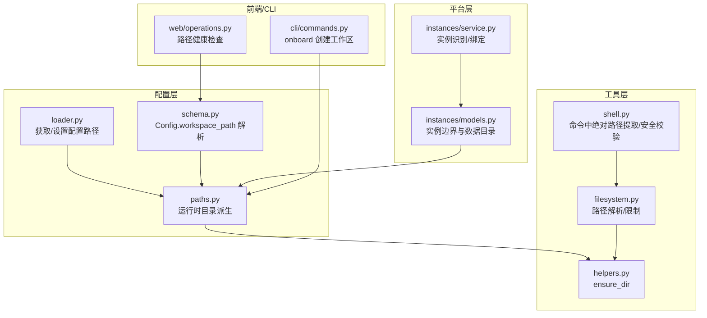
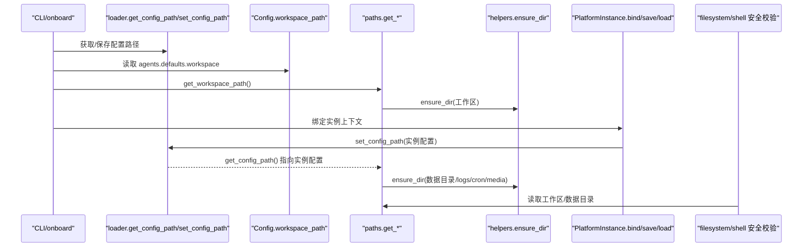
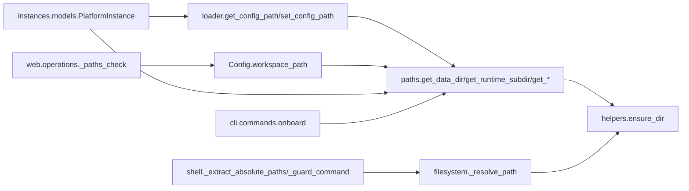
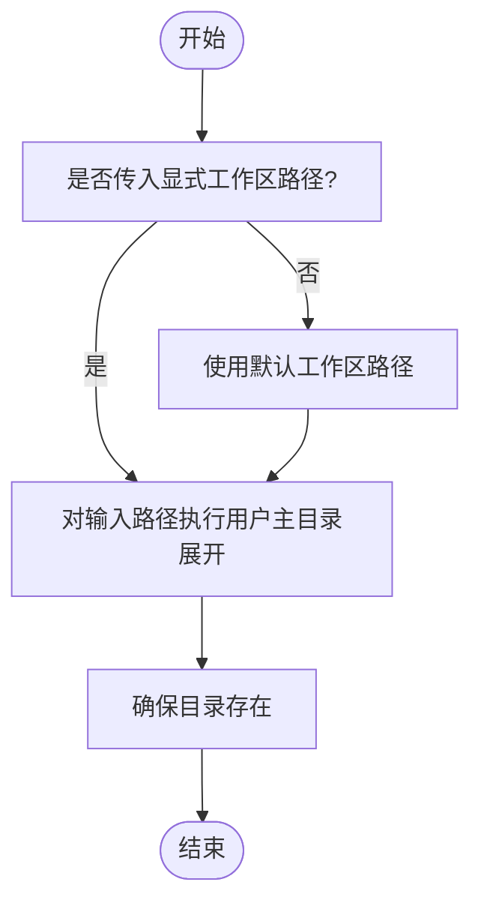

# 路径管理

<cite>
**本文引用的文件列表**
- [nanobot/config/paths.py](file://nanobot/config/paths.py)
- [nanobot/config/loader.py](file://nanobot/config/loader.py)
- [nanobot/config/schema.py](file://nanobot/config/schema.py)
- [nanobot/utils/helpers.py](file://nanobot/utils/helpers.py)
- [nanobot/agent/tools/filesystem.py](file://nanobot/agent/tools/filesystem.py)
- [nanobot/agent/tools/shell.py](file://nanobot/agent/tools/shell.py)
- [nanobot/platform/instances/models.py](file://nanobot/platform/instances/models.py)
- [nanobot/platform/instances/service.py](file://nanobot/platform/instances/service.py)
- [nanobot/web/operations.py](file://nanobot/web/operations.py)
- [nanobot/cli/commands.py](file://nanobot/cli/commands.py)
- [tests/test_config_paths.py](file://tests/test_config_paths.py)
</cite>

## 目录
1. [简介](#简介)
2. [项目结构](#项目结构)
3. [核心组件](#核心组件)
4. [架构总览](#架构总览)
5. [详细组件分析](#详细组件分析)
6. [依赖关系分析](#依赖关系分析)
7. [性能考量](#性能考量)
8. [故障排查指南](#故障排查指南)
9. [结论](#结论)
10. [附录](#附录)

## 简介
本文件面向 Nanobot 的路径管理系统，系统性阐述工作空间路径的解析与扩展机制（含用户主目录展开与相对路径处理）、配置文件的默认位置与搜索顺序、数据/缓存/日志等运行时目录的组织方式、最佳实践与安全注意事项，以及在多实例环境下的路径隔离策略。文档同时提供可视化图示与测试用例来源，帮助读者从高层到代码级全面理解路径体系。

## 项目结构
围绕路径管理的关键模块与文件如下：
- 配置加载与路径派生：loader、schema、paths
- 实用工具：helpers（确保目录存在）
- 文件系统与安全：filesystem 工具、shell 安全校验
- 多实例边界：platform.instances
- 前端系统检查：web/operations
- CLI 初始化：cli/commands
- 测试用例：tests/test_config_paths.py

图表来源
- [nanobot/config/loader.py:13-24](file://nanobot/config/loader.py#L13-L24)
- [nanobot/config/schema.py:361-363](file://nanobot/config/schema.py#L361-L363)
- [nanobot/config/paths.py:11-40](file://nanobot/config/paths.py#L11-L40)
- [nanobot/utils/helpers.py:25-28](file://nanobot/utils/helpers.py#L25-L28)
- [nanobot/agent/tools/filesystem.py:10-24](file://nanobot/agent/tools/filesystem.py#L10-L24)
- [nanobot/agent/tools/shell.py:161-179](file://nanobot/agent/tools/shell.py#L161-L179)
- [nanobot/platform/instances/models.py:22-56](file://nanobot/platform/instances/models.py#L22-L56)
- [nanobot/platform/instances/service.py:20-35](file://nanobot/platform/instances/service.py#L20-L35)
- [nanobot/web/operations.py:270-304](file://nanobot/web/operations.py#L270-L304)
- [nanobot/cli/commands.py:170-200](file://nanobot/cli/commands.py#L170-L200)

章节来源
- [nanobot/config/paths.py:1-56](file://nanobot/config/paths.py#L1-L56)
- [nanobot/config/loader.py:1-82](file://nanobot/config/loader.py#L1-L82)
- [nanobot/config/schema.py:351-364](file://nanobot/config/schema.py#L351-L364)
- [nanobot/utils/helpers.py:25-28](file://nanobot/utils/helpers.py#L25-L28)
- [nanobot/agent/tools/filesystem.py:10-35](file://nanobot/agent/tools/filesystem.py#L10-L35)
- [nanobot/agent/tools/shell.py:161-179](file://nanobot/agent/tools/shell.py#L161-L179)
- [nanobot/platform/instances/models.py:14-111](file://nanobot/platform/instances/models.py#L14-L111)
- [nanobot/platform/instances/service.py:17-43](file://nanobot/platform/instances/service.py#L17-L43)
- [nanobot/web/operations.py:270-304](file://nanobot/web/operations.py#L270-L304)
- [nanobot/cli/commands.py:170-200](file://nanobot/cli/commands.py#L170-L200)
- [tests/test_config_paths.py:1-43](file://tests/test_config_paths.py#L1-L43)

## 核心组件
- 配置路径与派生
  - 默认配置文件路径：用户主目录下的隐藏目录中，文件名为 config.json
  - 运行时数据目录：以配置文件所在目录为根，派生出 logs、cron、media 等子目录
  - 工作空间路径：支持传入显式路径或使用默认值，并对用户主目录进行展开
- 工具与安全
  - 文件系统工具：统一解析相对路径并限制在指定工作区或允许目录内
  - Shell 工具：从命令中提取绝对路径，结合工作目录进行安全校验
- 多实例隔离
  - 通过实例绑定将全局配置上下文切换到特定配置文件，从而实现“每个实例一个数据域”的隔离
- 健康检查与 CLI
  - 前端系统检查会验证工作区、配置文件与日志目录的存在与可访问性
  - CLI onboard 初始化配置与工作区

章节来源
- [nanobot/config/loader.py:19-24](file://nanobot/config/loader.py#L19-L24)
- [nanobot/config/paths.py:11-40](file://nanobot/config/paths.py#L11-L40)
- [nanobot/config/schema.py:361-363](file://nanobot/config/schema.py#L361-L363)
- [nanobot/agent/tools/filesystem.py:10-35](file://nanobot/agent/tools/filesystem.py#L10-L35)
- [nanobot/agent/tools/shell.py:161-179](file://nanobot/agent/tools/shell.py#L161-L179)
- [nanobot/platform/instances/models.py:22-56](file://nanobot/platform/instances/models.py#L22-L56)
- [nanobot/web/operations.py:270-304](file://nanobot/web/operations.py#L270-L304)
- [nanobot/cli/commands.py:170-200](file://nanobot/cli/commands.py#L170-L200)

## 架构总览
下图展示了从配置加载到运行时目录派生、再到多实例隔离的整体流程。

图表来源
- [nanobot/cli/commands.py:170-200](file://nanobot/cli/commands.py#L170-L200)
- [nanobot/config/loader.py:13-24](file://nanobot/config/loader.py#L13-L24)
- [nanobot/config/schema.py:361-363](file://nanobot/config/schema.py#L361-L363)
- [nanobot/config/paths.py:11-40](file://nanobot/config/paths.py#L11-L40)
- [nanobot/utils/helpers.py:25-28](file://nanobot/utils/helpers.py#L25-L28)
- [nanobot/platform/instances/models.py:22-56](file://nanobot/platform/instances/models.py#L22-L56)
- [nanobot/agent/tools/filesystem.py:10-35](file://nanobot/agent/tools/filesystem.py#L10-L35)
- [nanobot/agent/tools/shell.py:161-179](file://nanobot/agent/tools/shell.py#L161-L179)

## 详细组件分析

### 配置文件默认位置与搜索顺序
- 默认位置
  - 配置文件默认位于用户主目录下的隐藏目录中，文件名为 config.json
- 搜索顺序
  - 若已通过实例绑定设置了当前配置路径，则优先使用该路径
  - 否则回退到默认路径
- 加载与迁移
  - 存在时读取 JSON 并进行格式迁移，失败则回退到默认配置对象

章节来源
- [nanobot/config/loader.py:19-24](file://nanobot/config/loader.py#L19-L24)
- [nanobot/config/loader.py:26-48](file://nanobot/config/loader.py#L26-L48)
- [nanobot/config/loader.py:68-81](file://nanobot/config/loader.py#L68-L81)

### 工作空间路径解析与扩展
- 解析规则
  - 支持传入显式路径；若未提供，则使用默认路径
  - 对传入路径执行用户主目录展开
  - 确保目录存在
- 默认值
  - 默认工作空间位于用户主目录下的隐藏目录中，文件夹名为 workspace
- 测试验证
  - 测试覆盖了默认路径与显式路径的行为

章节来源
- [nanobot/config/paths.py:37-40](file://nanobot/config/paths.py#L37-L40)
- [nanobot/config/schema.py:234-235](file://nanobot/config/schema.py#L234-L235)
- [tests/test_config_paths.py:40-42](file://tests/test_config_paths.py#L40-L42)

### 数据目录、缓存目录与日志目录的组织
- 数据目录
  - 以配置文件所在目录为根，所有运行时数据均在此根下组织
- 子目录
  - 日志目录：logs
  - 计划任务存储：cron
  - 媒体资源：media（可按通道命名空间细分）
- 共享与遗留路径
  - CLI 历史：位于用户主目录下的历史文件
  - WhatsApp 桥接安装目录：位于用户主目录下的共享目录
  - 旧版全局会话目录：用于迁移回退

章节来源
- [nanobot/config/paths.py:11-34](file://nanobot/config/paths.py#L11-L34)
- [nanobot/config/paths.py:43-55](file://nanobot/config/paths.py#L43-L55)
- [tests/test_config_paths.py:16-37](file://tests/test_config_paths.py#L16-L37)

### 相对路径与用户主目录展开
- 相对路径处理
  - 文件系统工具在解析相对路径时，会基于工作区路径进行拼接
  - 最终解析为绝对路径，并可进一步限制在允许目录内
- 用户主目录展开
  - 工作区路径与配置路径均支持波浪号展开
  - 命令行工具与文件系统工具均对用户主目录进行展开

章节来源
- [nanobot/agent/tools/filesystem.py:10-24](file://nanobot/agent/tools/filesystem.py#L10-L24)
- [nanobot/config/paths.py:37-40](file://nanobot/config/paths.py#L37-L40)
- [nanobot/config/loader.py:19-24](file://nanobot/config/loader.py#L19-L24)

### 多实例环境下的路径隔离机制
- 实例绑定
  - 通过实例模型绑定当前配置路径，使后续路径派生均基于该实例配置
- 实例识别
  - 默认配置指向用户主目录下的默认路径；非默认路径会生成稳定的实例标识
- 实例范围内的目录
  - 数据目录、日志、媒体、知识库、数据库等均位于实例配置目录之下
- 测试验证
  - 测试覆盖了实例绑定后运行时目录与工作区路径的行为

章节来源
- [nanobot/platform/instances/models.py:22-56](file://nanobot/platform/instances/models.py#L22-L56)
- [nanobot/platform/instances/service.py:20-35](file://nanobot/platform/instances/service.py#L20-L35)
- [tests/test_platform_instances.py:8-30](file://tests/test_platform_instances.py#L8-L30)

### 安全与权限控制
- 文件系统工具的安全约束
  - 解析路径时可强制限制在工作区或指定允许目录内
  - 发现越界访问时抛出权限错误
- Shell 工具的安全校验
  - 从命令中提取绝对路径（包含 Windows 与 POSIX 路径、用户主目录缩写）
  - 将路径展开并解析为绝对路径，与当前工作目录比较，越界则阻断
- 工作区限制
  - 部分渠道支持仅允许工作区内路径访问

章节来源
- [nanobot/agent/tools/filesystem.py:10-35](file://nanobot/agent/tools/filesystem.py#L10-L35)
- [nanobot/agent/tools/shell.py:161-179](file://nanobot/agent/tools/shell.py#L161-L179)
- [nanobot/channels/matrix.py:215-224](file://nanobot/channels/matrix.py#L215-L224)

### 健康检查与 CLI 初始化
- 健康检查
  - 前端系统检查会验证工作区、配置文件与日志目录的存在与可访问性
- CLI 初始化
  - onboard 命令会创建默认配置与工作区目录

章节来源
- [nanobot/web/operations.py:270-304](file://nanobot/web/operations.py#L270-L304)
- [nanobot/cli/commands.py:170-200](file://nanobot/cli/commands.py#L170-L200)

## 依赖关系分析

图表来源
- [nanobot/config/loader.py:13-24](file://nanobot/config/loader.py#L13-L24)
- [nanobot/config/paths.py:11-40](file://nanobot/config/paths.py#L11-L40)
- [nanobot/config/schema.py:361-363](file://nanobot/config/schema.py#L361-L363)
- [nanobot/utils/helpers.py:25-28](file://nanobot/utils/helpers.py#L25-L28)
- [nanobot/agent/tools/filesystem.py:10-35](file://nanobot/agent/tools/filesystem.py#L10-L35)
- [nanobot/agent/tools/shell.py:161-179](file://nanobot/agent/tools/shell.py#L161-L179)
- [nanobot/platform/instances/models.py:22-56](file://nanobot/platform/instances/models.py#L22-L56)
- [nanobot/cli/commands.py:170-200](file://nanobot/cli/commands.py#L170-L200)
- [nanobot/web/operations.py:270-304](file://nanobot/web/operations.py#L270-L304)

## 性能考量
- 目录创建与解析
  - ensure_dir 在路径不存在时一次性创建父目录树，避免重复 IO
- 路径解析复杂度
  - 相对路径拼接与绝对化解析为 O(n)（n 为路径段数），通常开销较小
- 多实例绑定
  - 通过全局变量切换配置路径，避免频繁磁盘查询，提升路径派生效率

[本节为通用建议，不直接分析具体文件]

## 故障排查指南
- 工作区/日志目录不可访问
  - 前端系统检查会报告工作区、配置文件与日志目录的问题
  - 建议检查权限与磁盘空间
- 配置文件损坏或格式错误
  - 加载失败时会回退到默认配置
  - 建议备份并修复配置文件
- Shell 命令被阻断
  - 当命令中出现越界绝对路径或用户主目录路径超出工作区时会被阻断
  - 请调整命令或工作区设置
- 文件系统工具报权限错误
  - 可能越界访问或目标不在允许目录内
  - 请检查工具调用参数与工作区限制

章节来源
- [nanobot/web/operations.py:270-304](file://nanobot/web/operations.py#L270-L304)
- [nanobot/config/loader.py:38-48](file://nanobot/config/loader.py#L38-L48)
- [nanobot/agent/tools/shell.py:161-179](file://nanobot/agent/tools/shell.py#L161-L179)
- [nanobot/agent/tools/filesystem.py:116-119](file://nanobot/agent/tools/filesystem.py#L116-L119)

## 结论
Nanobot 的路径管理以“配置文件为中心”构建，通过实例绑定实现多实例隔离，配合工具层的安全校验与目录确保机制，形成清晰、可维护且安全的运行时路径体系。默认路径遵循用户主目录约定，同时保留灵活的自定义能力；测试覆盖关键行为，保障路径解析与隔离的正确性。

[本节为总结性内容，不直接分析具体文件]

## 附录

### 路径配置最佳实践
- 显式指定工作空间路径，便于审计与迁移
- 在多实例场景下，为每个实例单独配置文件与数据目录
- 启用工作区限制，防止工具访问越界
- 定期清理日志与媒体目录，避免占用过多磁盘空间

[本节为通用建议，不直接分析具体文件]

### 关键流程图：工作区路径解析

图表来源
- [nanobot/config/paths.py:37-40](file://nanobot/config/paths.py#L37-L40)
- [nanobot/utils/helpers.py:25-28](file://nanobot/utils/helpers.py#L25-L28)