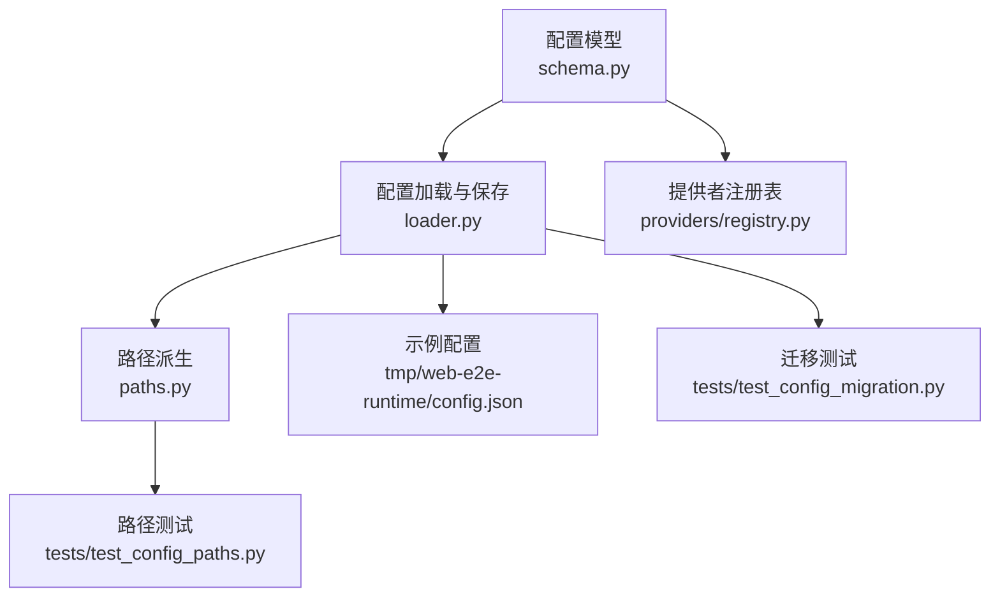
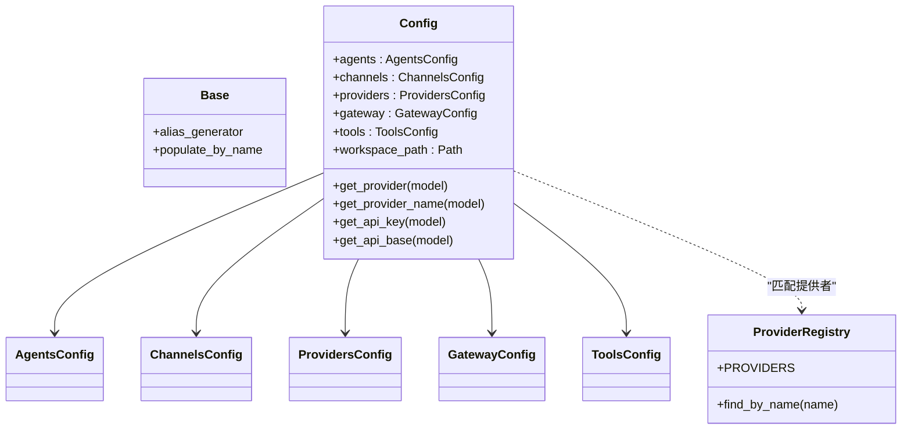
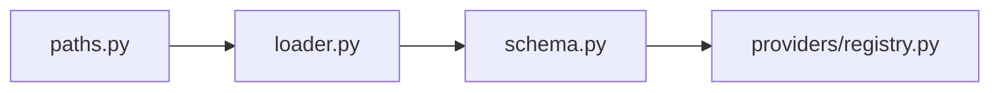

# 配置文件结构

<cite>
**本文引用的文件**
- [nanobot/config/schema.py](file://nanobot/config/schema.py)
- [nanobot/config/loader.py](file://nanobot/config/loader.py)
- [nanobot/config/paths.py](file://nanobot/config/paths.py)
- [nanobot/providers/registry.py](file://nanobot/providers/registry.py)
- [tmp/web-e2e-runtime/config.json](file://tmp/web-e2e-runtime/config.json)
- [tests/test_config_migration.py](file://tests/test_config_migration.py)
- [tests/test_config_paths.py](file://tests/test_config_paths.py)
</cite>

## 目录
1. [简介](#简介)
2. [项目结构](#项目结构)
3. [核心组件](#核心组件)
4. [架构总览](#架构总览)
5. [详细组件分析](#详细组件分析)
6. [依赖分析](#依赖分析)
7. [性能考虑](#性能考虑)
8. [故障排查指南](#故障排查指南)
9. [结论](#结论)
10. [附录](#附录)

## 简介
本文件系统性阐述 Nanobot 的配置文件结构与 Pydantic 模型设计，覆盖根配置 Config 的各配置域（agents、channels、providers、gateway、tools）及其相互关系；逐项说明各配置类的字段定义、默认值与验证规则；给出配置文件的完整示例与最佳实践；解释驼峰命名与蛇形命名的转换机制，以及环境变量前缀的使用方式。

## 项目结构
Nanobot 的配置体系由三部分组成：
- 配置模型层：基于 Pydantic 的类型安全模型，统一定义配置结构与校验逻辑。
- 加载与持久化层：负责从 JSON 文件读取配置、进行迁移与保存。
- 路径派生层：根据当前配置路径推导运行时数据目录、媒体目录等。

图表来源
- [nanobot/config/schema.py:351-450](file://nanobot/config/schema.py#L351-L450)
- [nanobot/config/loader.py:26-82](file://nanobot/config/loader.py#L26-L82)
- [nanobot/config/paths.py:11-56](file://nanobot/config/paths.py#L11-L56)
- [nanobot/providers/registry.py:19-200](file://nanobot/providers/registry.py#L19-L200)
- [tmp/web-e2e-runtime/config.json:1-282](file://tmp/web-e2e-runtime/config.json#L1-L282)
- [tests/test_config_migration.py:11-89](file://tests/test_config_migration.py#L11-L89)
- [tests/test_config_paths.py:16-43](file://tests/test_config_paths.py#L16-L43)

章节来源
- [nanobot/config/schema.py:1-450](file://nanobot/config/schema.py#L1-L450)
- [nanobot/config/loader.py:1-82](file://nanobot/config/loader.py#L1-L82)
- [nanobot/config/paths.py:1-56](file://nanobot/config/paths.py#L1-L56)
- [nanobot/providers/registry.py:1-200](file://nanobot/providers/registry.py#L1-L200)
- [tmp/web-e2e-runtime/config.json:1-282](file://tmp/web-e2e-runtime/config.json#L1-L282)
- [tests/test_config_migration.py:1-89](file://tests/test_config_migration.py#L1-L89)
- [tests/test_config_paths.py:1-43](file://tests/test_config_paths.py#L1-L43)

## 核心组件
- 根配置 Config：聚合 agents、channels、providers、gateway、tools 五个配置域，并提供工作空间路径解析与提供者匹配能力。
- 基类 Base：统一启用驼峰/蛇形互转与名称回填，确保 JSON 键名与 Python 字段名的双向兼容。
- 提供者匹配策略：按显式前缀、关键词、网关/本地兜底顺序匹配，支持环境变量前缀与嵌套分隔符。

章节来源
- [nanobot/config/schema.py:11-14](file://nanobot/config/schema.py#L11-L14)
- [nanobot/config/schema.py:351-450](file://nanobot/config/schema.py#L351-L450)

## 架构总览
下图展示配置模型、加载器与提供者注册表之间的交互关系：

图表来源
- [nanobot/config/schema.py:11-14](file://nanobot/config/schema.py#L11-L14)
- [nanobot/config/schema.py:351-450](file://nanobot/config/schema.py#L351-L450)
- [nanobot/providers/registry.py:19-200](file://nanobot/providers/registry.py#L19-L200)

## 详细组件分析

### 根配置 Config
- 组成部分
  - agents：代理默认参数与工作空间路径。
  - channels：通道开关与行为控制，包含多种即时通讯平台的子配置。
  - providers：多提供者配置集合，涵盖标准、网关、本地与直连提供者。
  - gateway：服务端网关主机与心跳配置。
  - tools：工具集配置，含网络搜索、执行工具、MCP 服务器等。
- 关键方法
  - workspace_path：展开用户工作空间路径。
  - 提供者匹配：get_provider、get_provider_name、get_api_key、get_api_base。
- 环境变量前缀
  - env_prefix="NANOBOT_"，env_nested_delimiter="__"，用于从环境变量注入配置。

章节来源
- [nanobot/config/schema.py:351-450](file://nanobot/config/schema.py#L351-L450)

### 代理与工作空间（AgentsConfig 与 AgentDefaults）
- 默认工作空间：用户家目录下的 .nanobot/workspace。
- 默认模型与提供者：自动检测或显式指定。
- 上下文窗口与采样参数：max_tokens、context_window_tokens、temperature、max_tool_iterations、reasoning_effort。
- 兼容字段：memory_window 已弃用，迁移后以 context_window_tokens 存储。

章节来源
- [nanobot/config/schema.py:231-251](file://nanobot/config/schema.py#L231-L251)
- [nanobot/config/schema.py:253-257](file://nanobot/config/schema.py#L253-L257)
- [tests/test_config_migration.py:11-32](file://tests/test_config_migration.py#L11-L32)

### 通道配置（ChannelsConfig 及子通道）
- 通用行为
  - send_progress：是否向通道流式发送文本进度。
  - send_tool_hints：是否流式发送工具调用提示。
- 子通道（示例字段）
  - WhatsApp：enabled、bridge_url、bridge_token、allow_from。
  - Telegram：enabled、token、allow_from、proxy、reply_to_message、group_policy。
  - Discord：enabled、token、allow_from、gateway_url、intents、group_policy。
  - Feishu：enabled、app_id、app_secret、encrypt_key、verification_token、allow_from、react_emoji。
  - DingTalk：enabled、client_id、client_secret、allow_from。
  - Email：enabled、consent_granted、IMAP/SMTP 参数、行为选项如 auto_reply_enabled、poll_interval_seconds、mark_seen、max_body_chars、subject_prefix、allow_from。
  - Slack：enabled、mode、webhook_path、bot_token、app_token、user_token_read_only、reply_in_thread、react_emoji、allow_from、group_policy、group_allow_from、dm（DM 策略）。
  - QQ：enabled、app_id、secret、allow_from。
  - Matrix：enabled、homeserver、access_token、user_id、device_id、e2ee_enabled、sync_stop_grace_seconds、max_media_bytes、allow_from、group_policy、group_allow_from、allow_room_mentions。
  - Wecom：enabled、bot_id、secret、allow_from、welcome_message。
  - Mochat：enabled、base_url、socket_*、refresh_interval_ms、watch_*、retry_delay_ms、max_retry_attempts、claw_token、agent_user_id、sessions、panels、allow_from、mention、groups、reply_delay_mode、reply_delay_ms。

章节来源
- [nanobot/config/schema.py:213-229](file://nanobot/config/schema.py#L213-L229)
- [nanobot/config/schema.py:17-24](file://nanobot/config/schema.py#L17-L24)
- [nanobot/config/schema.py:26-37](file://nanobot/config/schema.py#L26-L37)
- [nanobot/config/schema.py:39-51](file://nanobot/config/schema.py#L39-L51)
- [nanobot/config/schema.py:53-61](file://nanobot/config/schema.py#L53-L61)
- [nanobot/config/schema.py:62-71](file://nanobot/config/schema.py#L62-L71)
- [nanobot/config/schema.py:73-92](file://nanobot/config/schema.py#L73-L92)
- [nanobot/config/schema.py:94-126](file://nanobot/config/schema.py#L94-L126)
- [nanobot/config/schema.py:128-165](file://nanobot/config/schema.py#L128-L165)
- [nanobot/config/schema.py:167-190](file://nanobot/config/schema.py#L167-L190)
- [nanobot/config/schema.py:192-201](file://nanobot/config/schema.py#L192-L201)
- [nanobot/config/schema.py:203-212](file://nanobot/config/schema.py#L203-L212)
- [nanobot/config/schema.py:140-165](file://nanobot/config/schema.py#L140-L165)

### 提供者配置（ProvidersConfig 与 ProviderConfig）
- ProviderConfig 字段
  - api_key：提供者 API 密钥。
  - api_base：自定义 API 基础地址（可选）。
  - extra_headers：额外请求头（例如 AiHubMix 的 APP-Code）。
- ProvidersConfig 字段
  - custom、azure_openai、anthropic、openai、openrouter、deepseek、groq、zhipu、dashscope、vllm、gemini、moonshot、minimax、aihubmix、ollama、siliconflow、volcengine、openai_codex、github_copilot。
- 提供者匹配流程
  - 显式前缀优先（避免冲突，如 github-copilot 匹配 openai_codex）。
  - 关键词匹配（遵循 PROVIDERS 注册表顺序）。
  - 本地提供者兜底（如 Ollama）。
  - 网关优先兜底（OpenRouter、AiHubMix 等），非 OAuth 提供者兜底。

章节来源
- [nanobot/config/schema.py:259-289](file://nanobot/config/schema.py#L259-L289)
- [nanobot/config/schema.py:267-289](file://nanobot/config/schema.py#L267-L289)
- [nanobot/config/schema.py:365-417](file://nanobot/config/schema.py#L365-L417)
- [nanobot/providers/registry.py:19-200](file://nanobot/providers/registry.py#L19-L200)

### 网关与心跳（GatewayConfig 与 HeartbeatConfig）
- GatewayConfig
  - host：监听地址，默认 0.0.0.0。
  - port：监听端口，默认 18790。
  - heartbeat：心跳配置。
- HeartbeatConfig
  - enabled：是否启用心跳。
  - interval_s：心跳间隔秒数，默认 1800（30 分钟）。

章节来源
- [nanobot/config/schema.py:298-304](file://nanobot/config/schema.py#L298-L304)
- [nanobot/config/schema.py:291-297](file://nanobot/config/schema.py#L291-L297)

### 工具配置（ToolsConfig）
- web：网络搜索与代理设置。
  - proxy：HTTP/SOCKS5 代理 URL。
  - search：Brave Search API key、最大结果数。
- exec：Shell 执行工具配置。
  - timeout：超时秒数。
  - path_append：追加到 PATH 的目录。
- restrict_to_workspace：限制所有工具仅在工作空间内访问，防止越权。
- mcp_servers：MCP 服务器连接配置（stdio、sse、streamableHttp），支持命令、参数、环境变量、URL、头部与工具超时。

章节来源
- [nanobot/config/schema.py:306-321](file://nanobot/config/schema.py#L306-L321)
- [nanobot/config/schema.py:322-328](file://nanobot/config/schema.py#L322-L328)
- [nanobot/config/schema.py:342-349](file://nanobot/config/schema.py#L342-L349)

### 驼峰命名与蛇形命名转换机制
- Base 类启用 alias_generator=to_camel 与 populate_by_name=True，允许 JSON 中使用 camelCase 键名，同时保留 Python 字段名（snake_case）。
- 保存配置时通过 model_dump(by_alias=True) 输出 camelCase 键名，确保与前端与 JSON 文件一致。

章节来源
- [nanobot/config/schema.py:11-14](file://nanobot/config/schema.py#L11-L14)
- [nanobot/config/loader.py:62-65](file://nanobot/config/loader.py#L62-L65)

### 环境变量前缀与嵌套分隔符
- 环境变量前缀：NANOBOT_
- 嵌套分隔符：__（双下划线）
- 示例：NANOBOT__providers__openai__apiKey 对应配置中的 providers.openai.apiKey。
- 该机制由 Config.model_config(env_prefix, env_nested_delimiter) 控制。

章节来源
- [nanobot/config/schema.py:449-449](file://nanobot/config/schema.py#L449-L449)

### 配置加载、迁移与保存
- 加载流程
  - 若存在配置文件则读取 JSON，执行迁移，再通过 model_validate 校验。
  - 失败时回退到默认配置。
- 迁移策略
  - 将 tools.exec.restrictToWorkspace 迁移到 tools.restrictToWorkspace。
  - 规范 mcp_servers 的 enabled 字段。
- 保存流程
  - 以 camelCase 写入 JSON 文件，确保与前端一致。

章节来源
- [nanobot/config/loader.py:26-82](file://nanobot/config/loader.py#L26-L82)
- [tests/test_config_migration.py:68-89](file://tests/test_config_migration.py#L68-L89)

### 路径派生与多实例支持
- 数据目录与运行时子目录均基于配置文件所在路径推导。
- 媒体目录支持按通道命名空间隔离。
- CLI 历史、桥接安装目录与历史会话目录保持全局共享。

章节来源
- [nanobot/config/paths.py:11-56](file://nanobot/config/paths.py#L11-L56)
- [tests/test_config_paths.py:16-43](file://tests/test_config_paths.py#L16-L43)

## 依赖分析
- Config 依赖 ProvidersConfig 与 ProviderRegistry 进行提供者匹配。
- 加载器依赖 Config 进行校验与迁移。
- 路径模块依赖配置路径推导运行时目录。

图表来源
- [nanobot/config/loader.py:26-82](file://nanobot/config/loader.py#L26-L82)
- [nanobot/config/schema.py:351-450](file://nanobot/config/schema.py#L351-L450)
- [nanobot/providers/registry.py:19-200](file://nanobot/providers/registry.py#L19-L200)
- [nanobot/config/paths.py:11-56](file://nanobot/config/paths.py#L11-L56)

章节来源
- [nanobot/config/loader.py:1-82](file://nanobot/config/loader.py#L1-L82)
- [nanobot/config/schema.py:1-450](file://nanobot/config/schema.py#L1-L450)
- [nanobot/providers/registry.py:1-200](file://nanobot/providers/registry.py#L1-L200)
- [nanobot/config/paths.py:1-56](file://nanobot/config/paths.py#L1-L56)

## 性能考虑
- 提供者匹配采用短路优先策略（显式前缀→关键词→本地→网关），减少不必要的遍历。
- 心跳间隔默认较长（30 分钟），降低网络压力。
- 工具限制 restrict_to_workspace 可有效避免文件系统扫描开销与安全风险。

## 故障排查指南
- 配置加载失败
  - 现象：打印警告并使用默认配置。
  - 排查：检查 JSON 语法、字段拼写与类型。
- 提供者未生效
  - 现象：get_provider 返回空。
  - 排查：确认 providers 下对应提供者字段已配置 api_key 或 api_base；若使用网关，请确认关键字匹配或显式前缀正确。
- 通道无法接收消息
  - 现象：allow_from 列表为空导致拒绝所有人。
  - 排查：将 allow_from 设为 ["*"] 开放或添加具体允许 ID。
- 工作空间访问受限
  - 现象：工具报路径越权。
  - 排查：开启 tools.restrict_to_workspace 并确保存储在 agents.defaults.workspace 下。
- 环境变量未注入
  - 现象：配置未从环境变量读取。
  - 排查：确认前缀与嵌套分隔符格式：NANOBOT__providers__openai__apiKey。

章节来源
- [nanobot/config/loader.py:38-48](file://nanobot/config/loader.py#L38-L48)
- [nanobot/config/schema.py:365-417](file://nanobot/config/schema.py#L365-L417)
- [nanobot/config/schema.py:449-449](file://nanobot/config/schema.py#L449-L449)

## 结论
Nanobot 的配置体系以 Pydantic 为核心，结合环境变量注入、驼峰/蛇形互转与提供者注册表，实现了强类型、可扩展且易维护的配置管理。通过清晰的配置域划分与完善的加载/迁移/保存流程，用户可以快速搭建多实例、多通道、多提供者的自动化系统。

## 附录

### 完整配置示例（字段映射）
以下为示例配置中关键字段与其含义（来源于示例文件）：
- agents.defaults
  - workspace：工作空间路径。
  - model：默认模型标识。
  - provider：提供者名称或“auto”。
  - maxTokens：最大生成长度。
  - contextWindowTokens：上下文窗口大小。
  - temperature：采样温度。
  - maxToolIterations：工具迭代上限。
  - reasoningEffort：推理强度（low/medium/high）。
- channels.sendProgress/sendToolHints：通道行为控制。
- channels.*：各通道 enabled、令牌/密钥、白名单 allowFrom、策略 groupPolicy/groupAllowFrom 等。
- providers.*：各提供者 apiKey、apiBase、extraHeaders。
- gateway.host/port/heartbeat：网关监听与心跳。
- tools.web.proxy/search：网络工具代理与搜索配置。
- tools.exec.timeout/pathAppend：执行工具超时与 PATH 追加。
- tools.restrictToWorkspace：工作空间限制。
- tools.mcpServers：MCP 服务器列表及连接参数。

章节来源
- [tmp/web-e2e-runtime/config.json:1-282](file://tmp/web-e2e-runtime/config.json#L1-L282)

### 最佳实践
- 使用“auto”提供者并配合模型关键字，让系统自动匹配最合适的提供者。
- 在生产环境通过环境变量注入敏感信息（NANOBOT__providers__openai__apiKey）。
- 启用 tools.restrict_to_workspace 以提升安全性。
- 为不同实例准备独立配置文件与数据目录，避免资源冲突。
- 使用 channels.*.allowFrom 精准控制消息来源，必要时设为 ["*"] 开放测试。