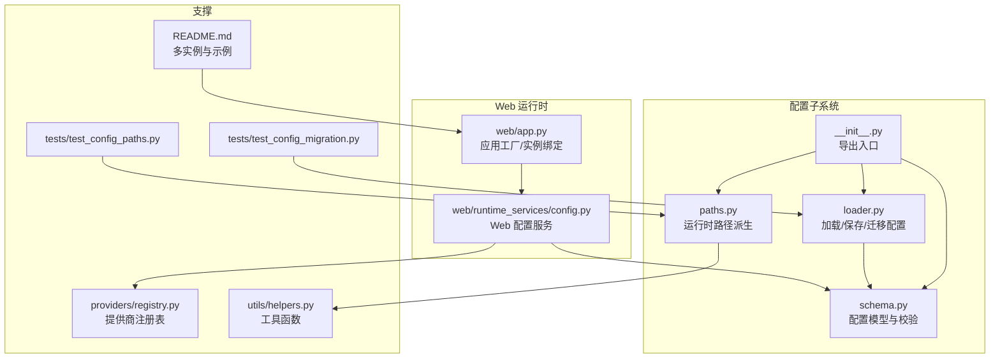
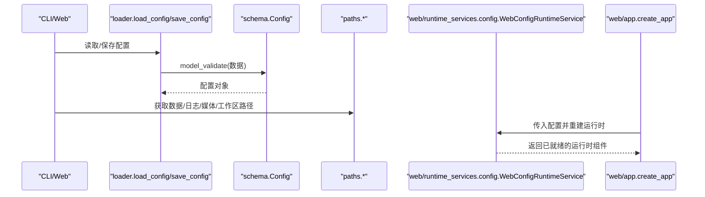
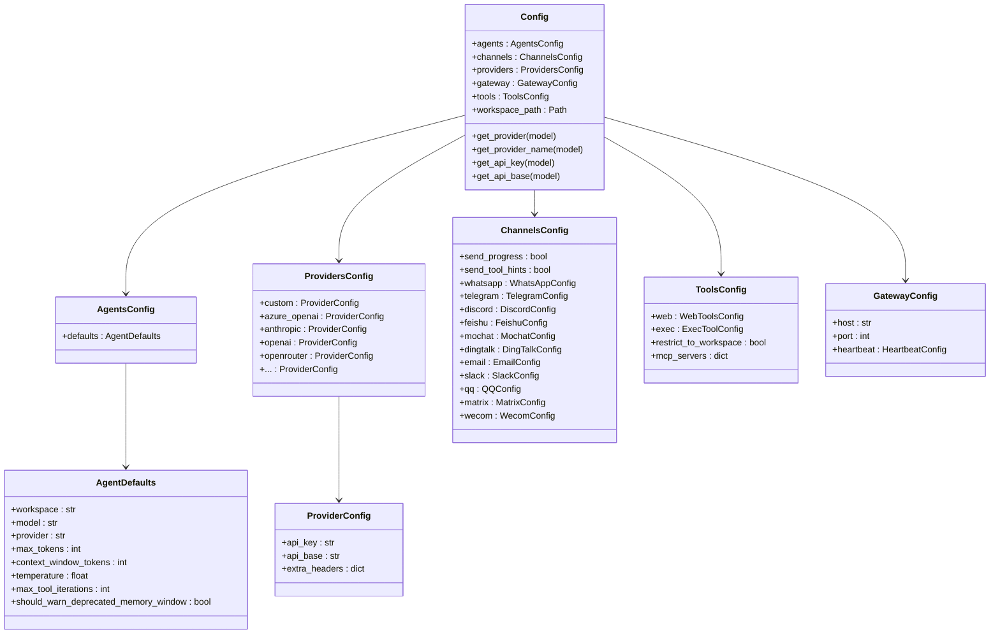
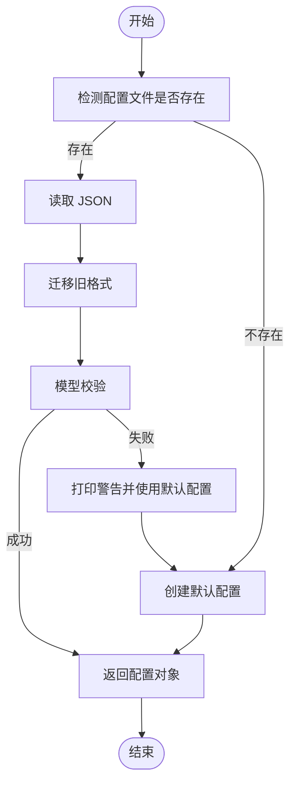
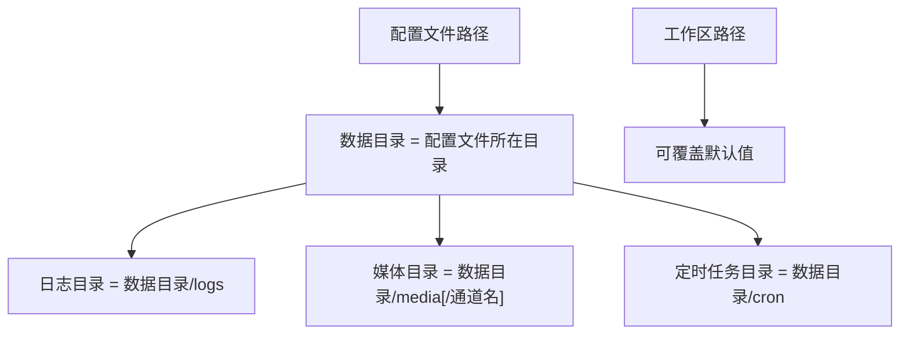
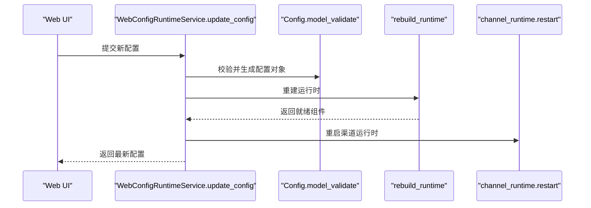
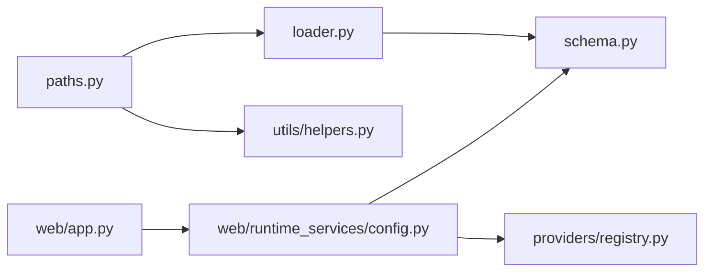

# 配置管理

<cite>
**本文引用的文件**
- [nanobot/config/__init__.py](file://nanobot/config/__init__.py)
- [nanobot/config/loader.py](file://nanobot/config/loader.py)
- [nanobot/config/schema.py](file://nanobot/config/schema.py)
- [nanobot/config/paths.py](file://nanobot/config/paths.py)
- [nanobot/web/runtime_services/config.py](file://nanobot/web/runtime_services/config.py)
- [nanobot/web/app.py](file://nanobot/web/app.py)
- [nanobot/providers/registry.py](file://nanobot/providers/registry.py)
- [nanobot/utils/helpers.py](file://nanobot/utils/helpers.py)
- [tests/test_config_migration.py](file://tests/test_config_migration.py)
- [tests/test_config_paths.py](file://tests/test_config_paths.py)
- [README.md](file://README.md)
</cite>

## 目录
1. [简介](#简介)
2. [项目结构](#项目结构)
3. [核心组件](#核心组件)
4. [架构总览](#架构总览)
5. [详细组件分析](#详细组件分析)
6. [依赖分析](#依赖分析)
7. [性能考量](#性能考量)
8. [故障排查指南](#故障排查指南)
9. [结论](#结论)
10. [附录](#附录)

## 简介
本文件面向 Nanobot 配置管理系统，系统性阐述配置文件结构、动态加载与迁移机制、配置项语义与默认值、环境变量支持、安全与隔离策略、验证与回退机制，并给出多实例与环境隔离的实现方式与最佳实践。

## 项目结构
配置子系统由以下模块组成：
- 配置加载与路径：loader、paths
- 配置模型与校验：schema（基于 Pydantic）
- Web 运行时服务：web/runtime_services/config.py
- 提供商注册表：providers/registry.py
- 工具函数：utils/helpers.py
- 测试用例：tests/test_config_migration.py、tests/test_config_paths.py
- 文档与示例：README.md

**图表来源**
- [nanobot/config/__init__.py:1-31](file://nanobot/config/__init__.py#L1-L31)
- [nanobot/config/loader.py:1-82](file://nanobot/config/loader.py#L1-L82)
- [nanobot/config/schema.py:1-450](file://nanobot/config/schema.py#L1-L450)
- [nanobot/config/paths.py:1-56](file://nanobot/config/paths.py#L1-L56)
- [nanobot/web/runtime_services/config.py:1-190](file://nanobot/web/runtime_services/config.py#L1-L190)
- [nanobot/web/app.py:1-200](file://nanobot/web/app.py#L1-L200)
- [nanobot/providers/registry.py:1-200](file://nanobot/providers/registry.py#L1-L200)
- [nanobot/utils/helpers.py:1-200](file://nanobot/utils/helpers.py#L1-L200)
- [tests/test_config_migration.py:1-89](file://tests/test_config_migration.py#L1-L89)
- [tests/test_config_paths.py:1-43](file://tests/test_config_paths.py#L1-L43)
- [README.md:1034-1272](file://README.md#L1034-L1272)

**章节来源**
- [nanobot/config/__init__.py:1-31](file://nanobot/config/__init__.py#L1-L31)
- [nanobot/config/loader.py:1-82](file://nanobot/config/loader.py#L1-L82)
- [nanobot/config/schema.py:1-450](file://nanobot/config/schema.py#L1-L450)
- [nanobot/config/paths.py:1-56](file://nanobot/config/paths.py#L1-L56)
- [nanobot/web/runtime_services/config.py:1-190](file://nanobot/web/runtime_services/config.py#L1-L190)
- [nanobot/web/app.py:1-200](file://nanobot/web/app.py#L1-L200)
- [nanobot/providers/registry.py:1-200](file://nanobot/providers/registry.py#L1-L200)
- [nanobot/utils/helpers.py:1-200](file://nanobot/utils/helpers.py#L1-L200)
- [tests/test_config_migration.py:1-89](file://tests/test_config_migration.py#L1-L89)
- [tests/test_config_paths.py:1-43](file://tests/test_config_paths.py#L1-L43)
- [README.md:1034-1272](file://README.md#L1034-L1272)

## 核心组件
- 配置模型与校验：通过 Pydantic 定义根配置对象，支持驼峰/蛇形字段互换、别名序列化、环境变量前缀映射等。
- 动态加载与保存：从用户家目录默认位置读取 JSON 配置，支持迁移旧格式、失败回退默认配置；保存时按别名写出。
- 路径派生：根据当前配置路径推导实例级数据目录、日志、媒体、定时任务等子目录；工作区路径可覆盖。
- Web 运行时服务：负责将配置转换为运行时对象（消息总线、会话管理、代理循环、渠道运行时等），并支持在线更新。
- 提供商匹配：根据模型名与关键字自动匹配提供商，支持网关、本地与标准提供商的优先级与回退。
- 多实例与隔离：通过设置配置路径，使数据目录、日志、媒体等与配置文件同目录，实现完全隔离；共享历史与桥接安装目录保持全局一致。

**章节来源**
- [nanobot/config/schema.py:351-450](file://nanobot/config/schema.py#L351-L450)
- [nanobot/config/loader.py:26-82](file://nanobot/config/loader.py#L26-L82)
- [nanobot/config/paths.py:11-56](file://nanobot/config/paths.py#L11-L56)
- [nanobot/web/runtime_services/config.py:79-156](file://nanobot/web/runtime_services/config.py#L79-L156)
- [nanobot/providers/registry.py:68-200](file://nanobot/providers/registry.py#L68-L200)
- [README.md:1041-1070](file://README.md#L1041-L1070)

## 架构总览
配置系统围绕“模型-加载-路径-运行时”四层展开，Web 应用通过平台实例绑定配置，运行时服务按需重建运行环境。

**图表来源**
- [nanobot/config/loader.py:26-82](file://nanobot/config/loader.py#L26-L82)
- [nanobot/config/schema.py:351-450](file://nanobot/config/schema.py#L351-L450)
- [nanobot/config/paths.py:11-56](file://nanobot/config/paths.py#L11-L56)
- [nanobot/web/runtime_services/config.py:79-156](file://nanobot/web/runtime_services/config.py#L79-L156)
- [nanobot/web/app.py:70-186](file://nanobot/web/app.py#L70-L186)

## 详细组件分析

### 配置模型与字段语义
- 根配置 Config：包含 agents、channels、providers、gateway、tools 等子配置。
- agents.defaults：工作区、模型、提供商、上下文窗口、温度、最大工具迭代次数等。
- providers.*：为各提供商（如 openai、anthropic、azure_openai、openrouter 等）提供统一的 API Key、基础地址与额外头部。
- channels.*：各聊天通道的开关、鉴权、白名单、行为策略等（如 Telegram、Discord、Feishu、Slack、Matrix、Email 等）。
- tools.*：网络工具代理、执行工具超时与 PATH 扩展、是否限制到工作区、MCP 服务器连接参数等。
- gateway.*：监听主机与端口、心跳间隔等。
- 环境变量映射：通过 env_prefix 与 env_nested_delimiter 将配置映射到环境变量（例如 NANOBOT_agents__defaults__model）。

**图表来源**
- [nanobot/config/schema.py:11-450](file://nanobot/config/schema.py#L11-L450)

**章节来源**
- [nanobot/config/schema.py:11-450](file://nanobot/config/schema.py#L11-L450)

### 配置加载与保存流程
- 加载：若存在配置文件则解析 JSON 并迁移旧格式，随后进行模型校验；失败或不存在则回退到默认配置。
- 保存：确保父目录存在，按别名序列化并写入 JSON 文件。
- 迁移：对旧字段（如 tools.exec.restrictToWorkspace 向上合并至 tools.restrictTo_workspace）、MCP 服务器启用标志补全等进行兼容处理。

**图表来源**
- [nanobot/config/loader.py:26-82](file://nanobot/config/loader.py#L26-L82)

**章节来源**
- [nanobot/config/loader.py:26-82](file://nanobot/config/loader.py#L26-L82)
- [tests/test_config_migration.py:11-89](file://tests/test_config_migration.py#L11-L89)

### 路径派生与多实例隔离
- 数据目录：从配置文件所在目录派生，保证每个实例的数据完全隔离。
- 日志、媒体、定时任务等子目录均位于数据目录之下。
- 工作区路径可覆盖，默认位于用户家目录下的工作区。
- 共享与遗留路径：CLI 历史、WhatsApp 桥接安装目录、旧会话目录保持全局一致，便于跨实例共享与迁移。

**图表来源**
- [nanobot/config/paths.py:11-56](file://nanobot/config/paths.py#L11-L56)
- [tests/test_config_paths.py:16-43](file://tests/test_config_paths.py#L16-L43)

**章节来源**
- [nanobot/config/paths.py:11-56](file://nanobot/config/paths.py#L11-L56)
- [tests/test_config_paths.py:16-43](file://tests/test_config_paths.py#L16-L43)
- [README.md:1041-1070](file://README.md#L1041-L1070)

### Web 运行时服务与动态更新
- 从配置构建运行时：消息总线、会话管理、代理循环、日历仓库、模板同步、MCP 服务器等。
- 提供器选择：根据模型名与关键字匹配提供商，支持网关、本地与标准提供商的优先级与回退。
- 在线更新：接收前端提交的新配置，校验后重建运行时并重启渠道运行时。

**图表来源**
- [nanobot/web/runtime_services/config.py:147-156](file://nanobot/web/runtime_services/config.py#L147-L156)

**章节来源**
- [nanobot/web/runtime_services/config.py:79-156](file://nanobot/web/runtime_services/config.py#L79-L156)
- [nanobot/providers/registry.py:68-200](file://nanobot/providers/registry.py#L68-L200)

### 环境变量支持与安全考虑
- 环境变量映射：通过配置模型的 env_prefix 与 env_nested_delimiter，将配置键映射到环境变量（如 NANOBOT_agents__defaults__model）。
- 安全建议：
  - 不要在配置中直接存储敏感信息；优先使用环境变量或外部密钥管理。
  - 使用 restrict_to_workspace 限制工具访问范围，防止路径穿越。
  - 对外暴露的通道应配置 allow_from 白名单，避免未授权访问。
  - 网关与本地提供商的基础地址可通过环境变量注入，避免污染全局配置。

**章节来源**
- [nanobot/config/schema.py:449-450](file://nanobot/config/schema.py#L449-L450)
- [nanobot/providers/registry.py:19-66](file://nanobot/providers/registry.py#L19-L66)
- [README.md:1034-1040](file://README.md#L1034-L1040)

### 验证规则、错误处理与回退机制
- 验证规则：Pydantic 模型校验，字段类型与默认值约束。
- 错误处理：
  - 配置文件损坏或格式错误：打印警告并回退默认配置。
  - 提供商匹配失败：按优先级回退到可用的网关或本地提供商。
- 回退机制：
  - 加载失败回退默认配置。
  - 提供商匹配失败回退到第一个可用的非 OAuth 提供商。
  - MCP 服务器缺失必要环境变量时，提供修复步骤提示。

**章节来源**
- [nanobot/config/loader.py:44-48](file://nanobot/config/loader.py#L44-L48)
- [nanobot/web/runtime_services/config.py:147-156](file://nanobot/web/runtime_services/config.py#L147-L156)
- [nanobot/web/mcp_servers.py:503-524](file://nanobot/web/mcp_servers.py#L503-L524)

### 多实例配置与环境隔离
- 通过 --config 指定不同配置文件，即可启动多个实例，彼此数据目录完全隔离。
- 可选 --workspace 覆盖工作区路径，实现更细粒度的隔离。
- README 提供了多实例快速启动示例与路径解析说明。

**章节来源**
- [README.md:1041-1070](file://README.md#L1041-L1070)

## 依赖分析
- 组件耦合：
  - loader 依赖 schema 进行模型校验。
  - paths 依赖 loader 的配置路径与工具函数 ensure_dir。
  - web/runtime_services/config 依赖 schema、providers/registry 与运行时组件。
  - web/app 依赖平台实例服务与运行时服务，完成实例绑定与生命周期管理。
- 外部依赖：
  - Pydantic 用于模型定义与校验。
  - providers/registry 提供提供商元数据与匹配逻辑。

**图表来源**
- [nanobot/config/loader.py:1-82](file://nanobot/config/loader.py#L1-L82)
- [nanobot/config/schema.py:1-450](file://nanobot/config/schema.py#L1-L450)
- [nanobot/config/paths.py:1-56](file://nanobot/config/paths.py#L1-L56)
- [nanobot/utils/helpers.py:25-29](file://nanobot/utils/helpers.py#L25-L29)
- [nanobot/web/runtime_services/config.py:1-190](file://nanobot/web/runtime_services/config.py#L1-L190)
- [nanobot/providers/registry.py:1-200](file://nanobot/providers/registry.py#L1-L200)
- [nanobot/web/app.py:1-200](file://nanobot/web/app.py#L1-L200)

**章节来源**
- [nanobot/config/loader.py:1-82](file://nanobot/config/loader.py#L1-L82)
- [nanobot/config/schema.py:1-450](file://nanobot/config/schema.py#L1-L450)
- [nanobot/config/paths.py:1-56](file://nanobot/config/paths.py#L1-L56)
- [nanobot/web/runtime_services/config.py:1-190](file://nanobot/web/runtime_services/config.py#L1-L190)
- [nanobot/web/app.py:1-200](file://nanobot/web/app.py#L1-L200)

## 性能考量
- 配置加载：仅在启动或更新时进行，开销极小。
- 路径派生：基于 pathlib 的轻量操作，影响可忽略。
- 提供商匹配：按注册表顺序匹配，复杂度与注册表长度线性相关，通常可忽略。
- 建议：避免频繁变更配置；批量更新后再触发运行时重建。

## 故障排查指南
- 配置文件损坏：
  - 现象：加载失败并回退默认配置。
  - 处理：备份原文件，使用默认配置作为起点，逐步恢复关键字段。
- 提供商匹配失败：
  - 现象：无法解析模型对应的提供商。
  - 处理：检查 providers.* 字段是否正确配置；必要时显式指定 provider 或使用网关/本地提供商。
- MCP 服务器环境变量缺失：
  - 现象：工具探测失败或调用超时。
  - 处理：根据修复步骤提示补齐环境变量并保存配置，然后重新探测。
- 多实例冲突：
  - 现象：端口占用或路径冲突。
  - 处理：为每个实例指定独立的配置文件与端口；确保数据目录不重叠。

**章节来源**
- [nanobot/config/loader.py:44-48](file://nanobot/config/loader.py#L44-L48)
- [nanobot/web/runtime_services/config.py:147-156](file://nanobot/web/runtime_services/config.py#L147-L156)
- [nanobot/web/mcp_servers.py:503-524](file://nanobot/web/mcp_servers.py#L503-L524)
- [README.md:1041-1070](file://README.md#L1041-L1070)

## 结论
Nanobot 的配置系统以 Pydantic 模型为核心，结合动态加载、路径派生与 Web 运行时服务，实现了灵活、可扩展且安全的配置管理。通过迁移机制与回退策略，系统在版本演进与异常情况下仍能保持稳定；多实例与环境隔离设计满足生产部署需求。建议在实际使用中遵循最小权限原则、优先使用环境变量、严格控制通道白名单，并定期备份配置文件。

## 附录

### 配置项速查与默认值
- agents.defaults
  - workspace: 默认工作区路径（可覆盖）
  - model: 默认模型标识
  - provider: 默认提供商名称或 "auto"
  - max_tokens: 默认最大输出 token
  - context_window_tokens: 上下文窗口 token 数
  - temperature: 采样温度
  - max_tool_iterations: 最大工具迭代次数
- tools
  - restrict_to_workspace: 是否限制工具访问到工作区
  - exec.timeout: 执行工具超时秒数
  - exec.path_append: 追加到 PATH 的目录
  - web.proxy: 网络工具代理
  - web.search.api_key: 搜索 API Key
  - web.search.max_results: 最大结果数
  - mcp_servers: MCP 服务器连接配置字典
- gateway
  - host: 监听地址
  - port: 监听端口
  - heartbeat.enabled: 心跳开关
  - heartbeat.interval_s: 心跳间隔秒数
- channels.*
  - enabled: 通道开关
  - allow_from: 白名单列表
  - 其他行为与鉴权参数依通道而异

**章节来源**
- [nanobot/config/schema.py:17-450](file://nanobot/config/schema.py#L17-L450)

### 环境变量映射示例
- 命名规范：NANOBOT_ + 逐级字段名（驼峰转蛇形）+ 双下划线分隔。
- 示例：NANOBOT_agents__defaults__model 映射到 agents.defaults.model。

**章节来源**
- [nanobot/config/schema.py:449-450](file://nanobot/config/schema.py#L449-L450)

### 多实例与路径解析示例
- 使用 --config 指定实例配置文件，数据目录与日志、媒体等均位于该文件所在目录。
- README 提供了 Telegram、Discord、Feishu 等实例的启动示例与路径解析说明。

**章节来源**
- [README.md:1041-1070](file://README.md#L1041-L1070)