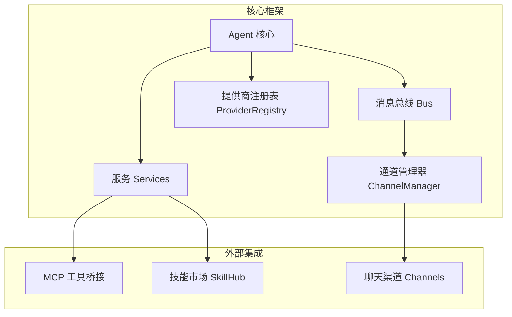
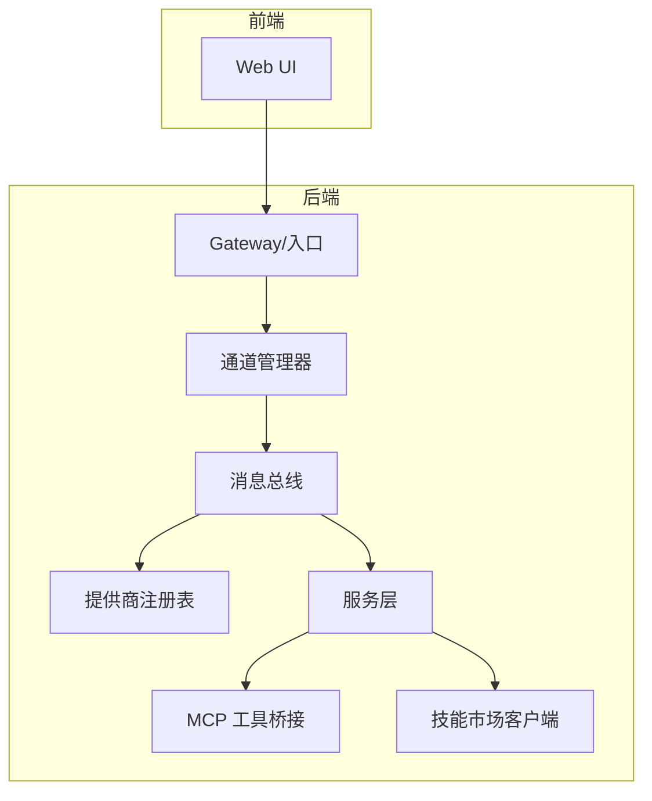
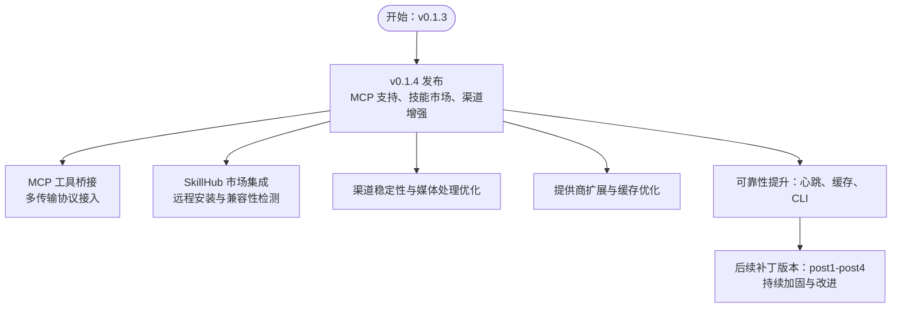
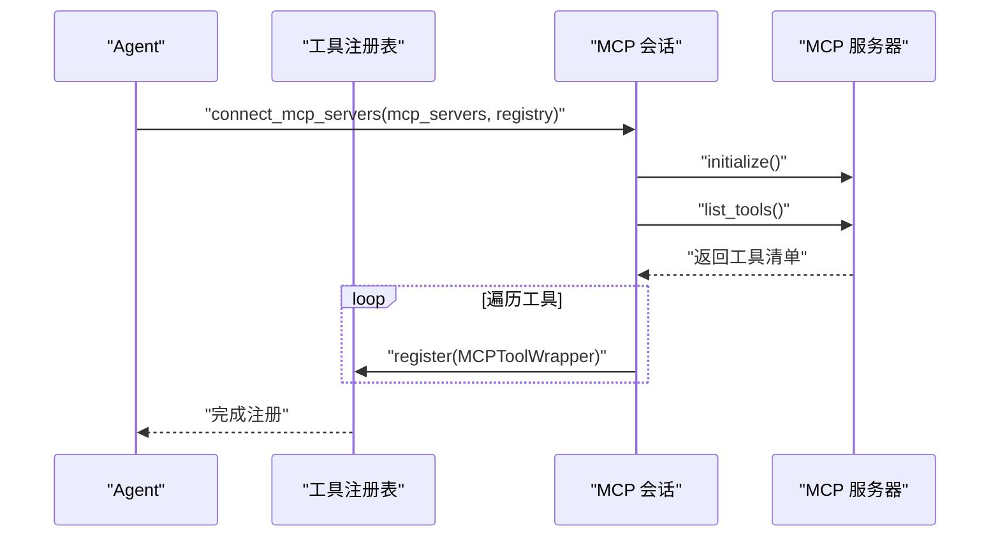
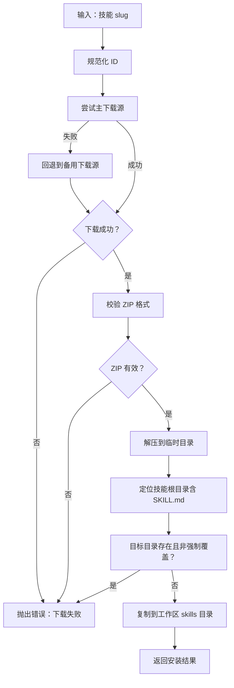
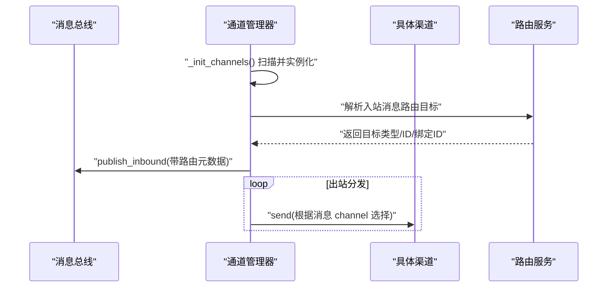
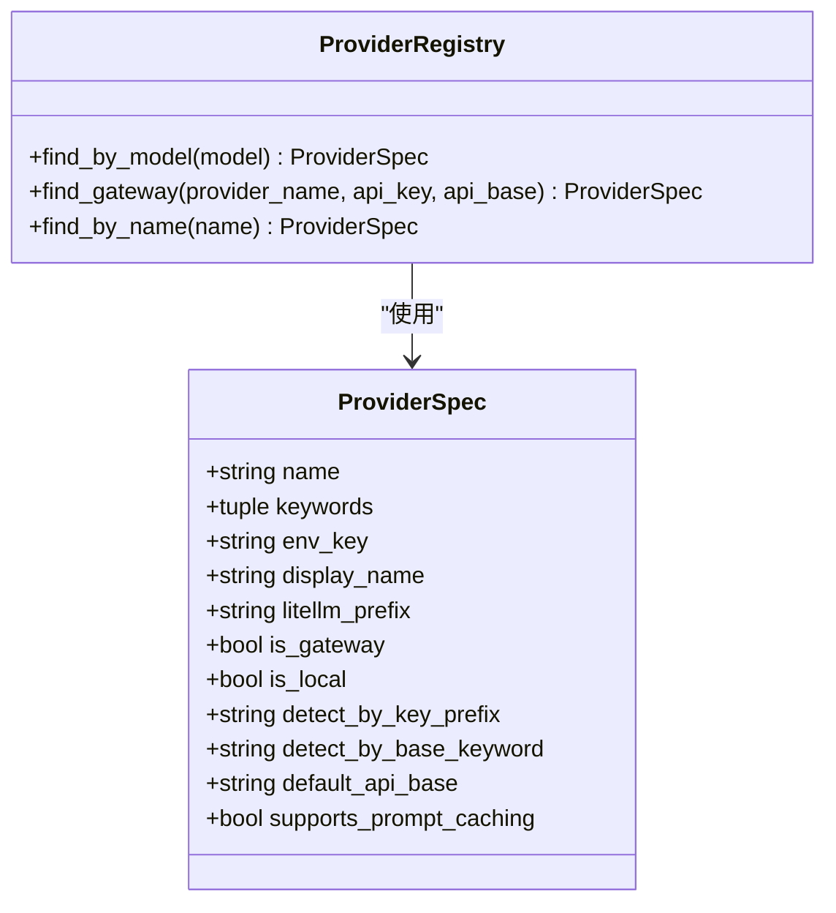
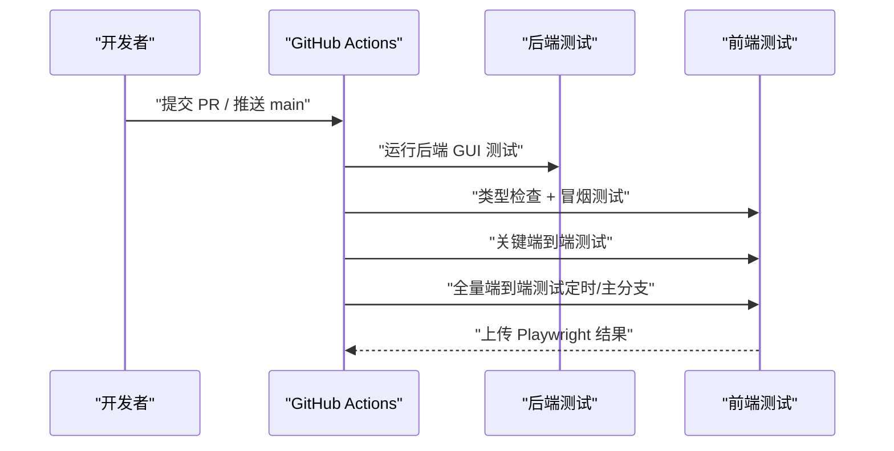
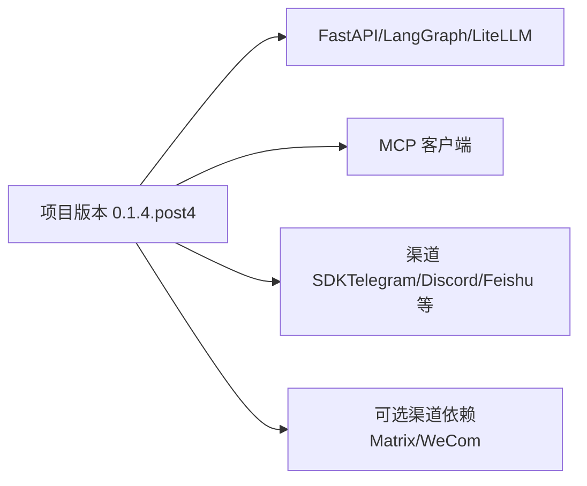

# 发展历程与未来规划

<cite>
**本文引用的文件**
- [README.md](file://README.md)
- [pyproject.toml](file://pyproject.toml)
- [nanobot/agent/tools/mcp.py](file://nanobot/agent/tools/mcp.py)
- [nanobot/services/skillhub_marketplace.py](file://nanobot/services/skillhub_marketplace.py)
- [nanobot/channels/manager.py](file://nanobot/channels/manager.py)
- [.github/workflows/webgui-critical.yml](file://.github/workflows/webgui-critical.yml)
- [.github/workflows/webgui-full.yml](file://.github/workflows/webgui-full.yml)
- [nanobot/providers/registry.py](file://nanobot/providers/registry.py)
</cite>

## 目录
1. [引言](#引言)
2. [项目结构](#项目结构)
3. [核心组件](#核心组件)
4. [架构总览](#架构总览)
5. [详细组件分析](#详细组件分析)
6. [依赖关系分析](#依赖关系分析)
7. [性能考量](#性能考量)
8. [故障排查指南](#故障排查指南)
9. [结论](#结论)
10. [附录](#附录)

## 引言
本文件面向 Nanobot 项目的发展历程与未来规划，基于仓库中的 README 新闻更新、版本元数据与关键实现模块，系统梳理从 0.1.3 到 0.1.4 的重要里程碑与技术演进，并总结项目采用的敏捷开发与持续集成策略。同时，结合现有代码能力，对后续功能方向（新渠道支持、性能优化、生态建设）、社区贡献机制、发布周期与质量保障进行展望，帮助读者快速理解项目现状与发展方向。

## 项目结构
Nanobot 采用分层清晰的模块化组织方式：
- 核心框架与运行时：agent、bus、channels、providers、services、web 等子系统协同工作
- 渠道适配：通过统一的通道管理器对接多种聊天平台
- 提供商注册表：集中管理 LLM 提供商元数据与匹配逻辑
- MCP 工具桥接：将外部 MCP 服务器工具无缝注入为本地工具
- 技能市场集成：远程技能发现与安装，兼容性检测与降级策略
- 持续集成：前端与后端测试流水线，确保关键路径质量

**图表来源**
- [nanobot/channels/manager.py:52-209](file://nanobot/channels/manager.py#L52-L209)
- [nanobot/providers/registry.py:1-466](file://nanobot/providers/registry.py#L1-L466)
- [nanobot/agent/tools/mcp.py:1-153](file://nanobot/agent/tools/mcp.py#L1-L153)
- [nanobot/services/skillhub_marketplace.py:1-465](file://nanobot/services/skillhub_marketplace.py#L1-L465)

**章节来源**
- [README.md:1-1335](file://README.md#L1-L1335)
- [pyproject.toml:1-122](file://pyproject.toml#L1-L122)

## 核心组件
- 版本与发布：当前版本为 0.1.4.post4，遵循语义化版本扩展，强调“可靠性优先”的迭代节奏
- 新闻与里程碑：README 的新闻条目记录了从 0.1.3 到 0.1.4 的关键改进，包括 MCP 支持、技能市场集成、多渠道增强等
- 架构与特性：README 展示了整体架构图，强调轻量、易用与研究友好

**章节来源**
- [README.md:1-1335](file://README.md#L1-L1335)
- [pyproject.toml:1-122](file://pyproject.toml#L1-L122)

## 架构总览
下图展示 Nanobot 的关键交互：通道管理器负责启动与路由消息；提供商注册表决定模型路由与参数；服务层集成 MCP 与技能市场；Web 前端通过 API 与后端交互。

**图表来源**
- [nanobot/channels/manager.py:52-209](file://nanobot/channels/manager.py#L52-L209)
- [nanobot/providers/registry.py:1-466](file://nanobot/providers/registry.py#L1-L466)
- [nanobot/agent/tools/mcp.py:1-153](file://nanobot/agent/tools/mcp.py#L1-L153)
- [nanobot/services/skillhub_marketplace.py:1-465](file://nanobot/services/skillhub_marketplace.py#L1-L465)

## 详细组件分析

### 从 0.1.3 到 0.1.4 的关键演进
- v0.1.4 发布日期：2026-02-17
- 关键改进：
  - MCP 协议支持：新增 MCP 工具桥接，支持多种传输方式（stdio、SSE、HTTP），将外部工具注册为本地工具
  - 技能市场集成：官方 SkillHub 市场客户端，支持远程索引、搜索、下载与兼容性检测
  - 多渠道增强：各渠道稳定性修复、媒体处理优化、消息流式传输与进度提示
  - 提供商扩展：新增 Azure OpenAI 提供商，增强模型缓存与多实例支持
  - 可靠性提升：心跳重设计、提示缓存优化、CLI 兼容性加固

**图表来源**
- [README.md:21-64](file://README.md#L21-L64)
- [nanobot/agent/tools/mcp.py:74-153](file://nanobot/agent/tools/mcp.py#L74-L153)
- [nanobot/services/skillhub_marketplace.py:87-465](file://nanobot/services/skillhub_marketplace.py#L87-L465)

**章节来源**
- [README.md:21-64](file://README.md#L21-L64)

### MCP 协议支持
- 功能概述：通过 MCP 客户端会话连接到本地或远端 MCP 服务器，动态注册其工具为本地工具，支持超时与取消处理
- 传输方式：支持 stdio、SSE、可流式 HTTP 三种传输，自动推断 URL 类型
- 注册流程：初始化会话、列举工具、包装为本地工具并注册到工具注册表

**图表来源**
- [nanobot/agent/tools/mcp.py:74-153](file://nanobot/agent/tools/mcp.py#L74-L153)

**章节来源**
- [nanobot/agent/tools/mcp.py:1-153](file://nanobot/agent/tools/mcp.py#L1-L153)

### 技能市场集成
- 功能概述：远程索引与搜索、ZIP 下载与解压、兼容性检测（原生/部分兼容/不建议安装）
- 兼容性规则：基于技能包内容与说明文本的正则匹配，避免引入不兼容依赖
- 安装流程：规范化技能 ID、下载归档、校验 ZIP、提取并定位技能根目录、复制到工作区

**图表来源**
- [nanobot/services/skillhub_marketplace.py:142-161](file://nanobot/services/skillhub_marketplace.py#L142-L161)
- [nanobot/services/skillhub_marketplace.py:207-232](file://nanobot/services/skillhub_marketplace.py#L207-L232)
- [nanobot/services/skillhub_marketplace.py:347-414](file://nanobot/services/skillhub_marketplace.py#L347-L414)

**章节来源**
- [nanobot/services/skillhub_marketplace.py:1-465](file://nanobot/services/skillhub_marketplace.py#L1-L465)

### 多渠道增强与路由
- 统一管理：通道管理器扫描已启用的渠道，按配置实例化并启动
- 路由增强：在提供路由服务时，入站消息会被注入路由元数据，便于后续处理
- 出站分发：统一出站队列，根据消息目标通道选择对应渠道发送

**图表来源**
- [nanobot/channels/manager.py:19-50](file://nanobot/channels/manager.py#L19-L50)
- [nanobot/channels/manager.py:160-190](file://nanobot/channels/manager.py#L160-L190)

**章节来源**
- [nanobot/channels/manager.py:1-209](file://nanobot/channels/manager.py#L1-L209)

### 提供商注册与匹配
- 注册表：集中定义提供商元数据（名称、关键词、环境变量、是否网关/本地、默认 API Base 等）
- 匹配策略：按模型关键字、API Key 前缀、API Base 关键词进行自动检测，控制优先级与回退
- 扩展便捷：新增提供商只需在注册表中添加条目并补充配置字段

**图表来源**
- [nanobot/providers/registry.py:19-66](file://nanobot/providers/registry.py#L19-L66)
- [nanobot/providers/registry.py:407-466](file://nanobot/providers/registry.py#L407-L466)

**章节来源**
- [nanobot/providers/registry.py:1-466](file://nanobot/providers/registry.py#L1-L466)

### 敏捷开发与持续集成
- 测试覆盖：后端 GUI 测试、前端类型检查、冒烟测试与关键端到端测试
- 触发策略：PR 触发关键套件，push 到 main 与定时任务触发全量套件
- 质量保障：Playwright 浏览器测试产物上传，便于问题复盘与回归

**图表来源**
- [.github/workflows/webgui-critical.yml:1-63](file://.github/workflows/webgui-critical.yml#L1-L63)
- [.github/workflows/webgui-full.yml:1-75](file://.github/workflows/webgui-full.yml#L1-L75)

**章节来源**
- [.github/workflows/webgui-critical.yml:1-63](file://.github/workflows/webgui-critical.yml#L1-L63)
- [.github/workflows/webgui-full.yml:1-75](file://.github/workflows/webgui-full.yml#L1-L75)

## 依赖关系分析
- 版本与依赖：项目以 0.1.4.post4 作为当前版本，核心依赖包括 FastAPI、LiteLLM、LangGraph、MCP 客户端等
- 可选依赖：针对特定渠道（如 Matrix、WeCom）提供可选安装项
- 依赖演进：随着功能扩展（MCP、技能市场、多渠道），依赖数量与复杂度逐步增加，但仍保持轻量化原则

**图表来源**
- [pyproject.toml:1-122](file://pyproject.toml#L1-L122)

**章节来源**
- [pyproject.toml:1-122](file://pyproject.toml#L1-L122)

## 性能考量
- 启动与资源占用：项目强调“超轻量”，通过最小化核心代码与模块化设计降低启动与运行开销
- 缓存与路由：提供商注册表支持提示缓存（如 Anthropic），减少重复计算
- I/O 与并发：通道管理器与消息总线采用异步并发模型，提升吞吐与响应速度
- 建议优化方向：进一步细化工具调用超时与重试策略、优化技能包安装与兼容性检测的缓存命中率

[本节为通用性能讨论，无需列出具体文件来源]

## 故障排查指南
- 渠道启动失败：检查通道配置的 enabled 字段与 allowFrom 设置，避免空列表导致拒绝所有消息
- MCP 工具超时/取消：关注工具超时时间与服务器取消信号，必要时调整 tool_timeout 或排查上游服务
- 技能安装冲突：当目标目录已存在且未启用强制覆盖时会报错，可通过 force 参数或清理后重试
- 前端测试失败：查看 Playwright 产物与日志，定位 UI 交互或网络请求异常

**章节来源**
- [nanobot/channels/manager.py:107-113](file://nanobot/channels/manager.py#L107-L113)
- [nanobot/agent/tools/mcp.py:37-71](file://nanobot/agent/tools/mcp.py#L37-L71)
- [nanobot/services/skillhub_marketplace.py:142-161](file://nanobot/services/skillhub_marketplace.py#L142-L161)
- [.github/workflows/webgui-critical.yml:53-61](file://.github/workflows/webgui-critical.yml#L53-L61)

## 结论
Nanobot 在 v0.1.4 版本实现了从“工具与技能生态”到“多渠道与可靠性”的关键跃迁：MCP 协议支持打通外部工具生态，SkillHub 市场集成强化了技能分发与兼容性治理，多渠道增强与提供商扩展提升了跨平台一致性与稳定性。配合持续集成流水线与模块化架构，项目形成了敏捷迭代与质量保障的闭环。未来可在新渠道接入、性能优化与生态建设方面持续深耕，进一步扩大影响力与用户价值。

[本节为总结性内容，无需列出具体文件来源]

## 附录

### 版本与发布时间线（摘要）
- v0.1.4：2026-02-17，MCP 支持、进度流式传输、新提供商、渠道改进
- v0.1.4.post1：2026-02-21，新提供商、媒体支持、稳定性改进
- v0.1.4.post2：2026-02-24，可靠性聚焦，心跳重设计、提示缓存优化
- v0.1.4.post3：2026-02-28，上下文清理、会话历史加固、智能代理
- v0.1.4.post4：2026-03-08，更安全默认值、多实例支持、更强健的 MCP 与渠道改进

**章节来源**
- [README.md:21-64](file://README.md#L21-L64)