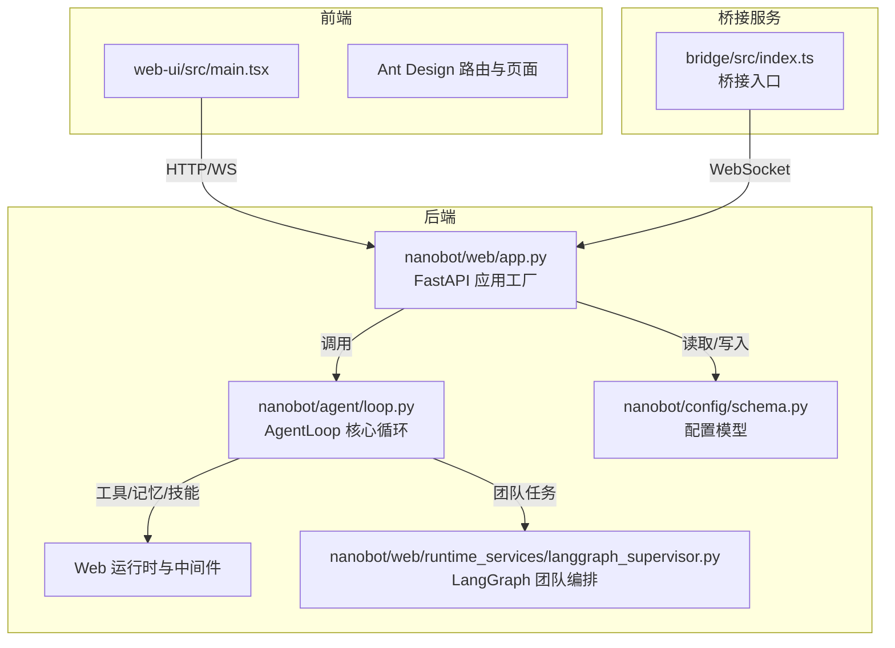
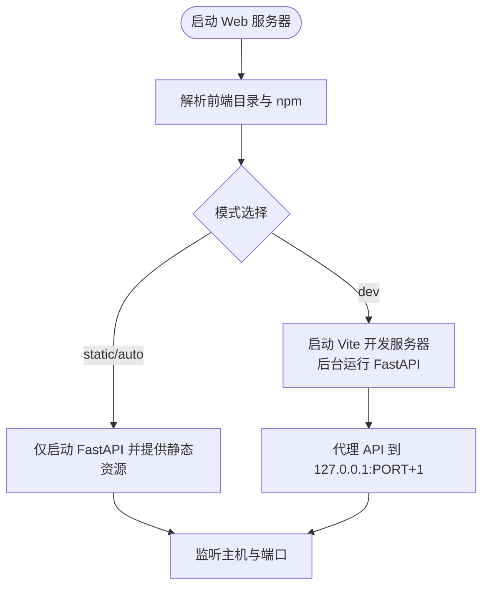
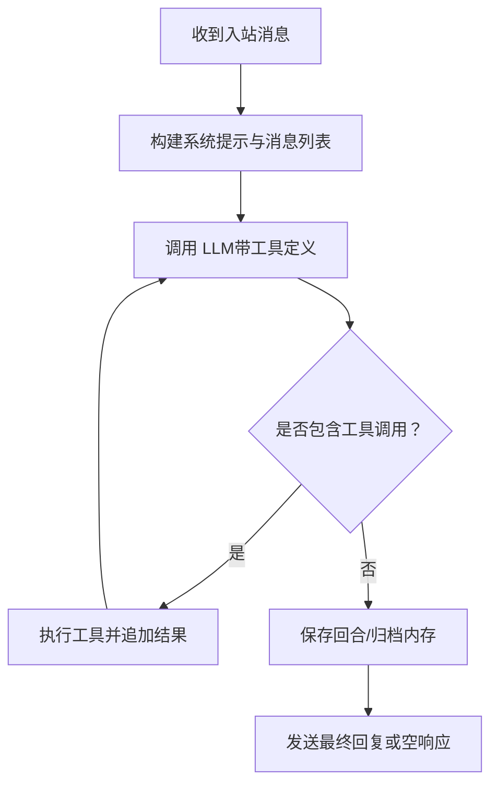
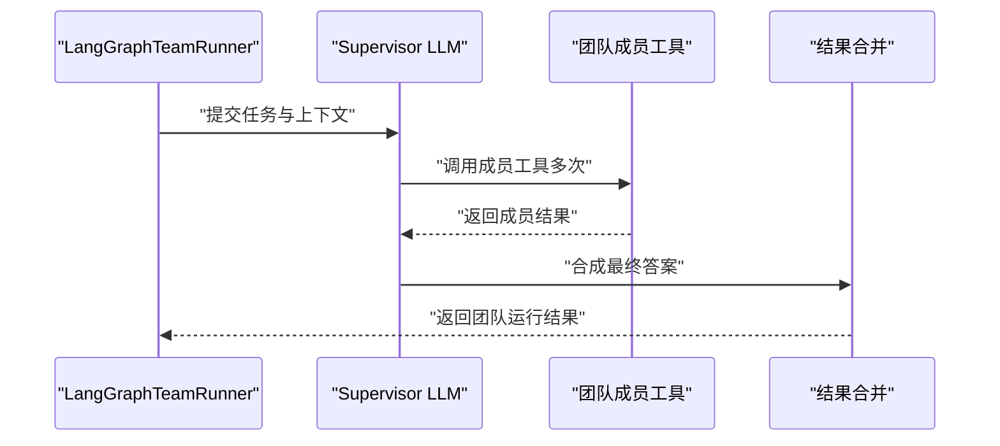
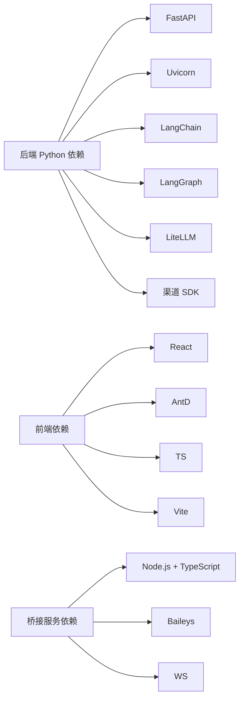

# 技术栈说明

<cite>
**本文引用的文件**
- [README.md](file://README.md)
- [pyproject.toml](file://pyproject.toml)
- [nanobot/web/app.py](file://nanobot/web/app.py)
- [nanobot/web/api.py](file://nanobot/web/api.py)
- [nanobot/web/frontend.py](file://nanobot/web/frontend.py)
- [nanobot/config/schema.py](file://nanobot/config/schema.py)
- [nanobot/agent/loop.py](file://nanobot/agent/loop.py)
- [nanobot/agent/context.py](file://nanobot/agent/context.py)
- [nanobot/web/runtime_services/langgraph_supervisor.py](file://nanobot/web/runtime_services/langgraph_supervisor.py)
- [bridge/src/index.ts](file://bridge/src/index.ts)
- [bridge/package.json](file://bridge/package.json)
- [web-ui/package.json](file://web-ui/package.json)
- [web-ui/src/main.tsx](file://web-ui/src/main.tsx)
- [nanobot/__main__.py](file://nanobot/__main__.py)
- [nanobot/__init__.py](file://nanobot/__init__.py)
</cite>

## 目录
1. [引言](#引言)
2. [项目结构](#项目结构)
3. [核心组件](#核心组件)
4. [架构总览](#架构总览)
5. [详细组件分析](#详细组件分析)
6. [依赖关系分析](#依赖关系分析)
7. [性能考量](#性能考量)
8. [故障排查指南](#故障排查指南)
9. [结论](#结论)
10. [附录](#附录)

## 引言
本文件面向 Nanobot 项目的开发者与维护者，系统性阐述其三层技术架构：后端 Python 核心（FastAPI、LangChain/LangGraph）、前端 React + TypeScript UI，以及 TypeScript 桥接服务。我们将解释各技术选型的原因、优势、在项目中的职责边界、模块间的协作关系与数据流，并给出版本兼容性与安全注意事项、最佳实践与扩展建议。

## 项目结构
Nanobot 采用“后端 Python + 前端 React + 桥接服务”的分层架构：
- 后端 Python 核心：基于 FastAPI 提供 Web API 与内部运行时；集成 LangChain/LangGraph 实现多智能体编排与对话循环；通过工具注册与会话管理实现可扩展的执行管线。
- 前端 React + TypeScript：使用 Vite 构建，Ant Design 与 Framer Motion 提供交互与主题；通过 API 路由与状态管理访问后端能力。
- 桥接服务（Bridge）：以 Node.js + TypeScript 实现，负责与特定渠道（如 WhatsApp）建立长连接与消息桥接，通过 WebSocket 将消息转发给后端。



图表来源
- [nanobot/web/app.py:70-280](file://nanobot/web/app.py#L70-L280)
- [nanobot/agent/loop.py:35-130](file://nanobot/agent/loop.py#L35-L130)
- [nanobot/web/runtime_services/langgraph_supervisor.py:447-483](file://nanobot/web/runtime_services/langgraph_supervisor.py#L447-L483)
- [nanobot/config/schema.py:351-450](file://nanobot/config/schema.py#L351-L450)
- [bridge/src/index.ts:1-52](file://bridge/src/index.ts#L1-L52)

章节来源
- [README.md:76-80](file://README.md#L76-L80)
- [nanobot/web/app.py:70-280](file://nanobot/web/app.py#L70-L280)
- [nanobot/web/frontend.py:1-226](file://nanobot/web/frontend.py#L1-L226)
- [bridge/src/index.ts:1-52](file://bridge/src/index.ts#L1-L52)

## 核心组件
- 后端 Web API（FastAPI）
  - 负责路由组织、认证中间件、异常处理、静态资源与前端热更新支持。
  - 在生命周期中初始化平台实例、认证、MCP 管理、渠道服务、知识库、团队与运行记录等子系统。
- Agent 核心（AgentLoop）
  - 负责接收消息、构建上下文、调用 LLM、执行工具、发送响应。
  - 支持会话管理、内存归档、MCP 工具接入、进度回调与停止控制。
- LangGraph 编排
  - 基于 LangGraph 的 Supervisor 模式，动态调度团队成员完成复杂任务。
- 配置系统（Pydantic）
  - 统一的配置模型，涵盖提供商、渠道、工具、网关等，支持环境变量前缀与驼峰/蛇形字段互转。
- 前端 UI（React + TypeScript）
  - 使用 Ant Design 与 Framer Motion 构建主题化界面，提供页面级功能与交互。
- 桥接服务（TypeScript）
  - 以 Node.js 实现，负责与外部渠道（如 WhatsApp）建立连接并通过 WebSocket 与后端通信。

章节来源
- [nanobot/web/app.py:70-280](file://nanobot/web/app.py#L70-L280)
- [nanobot/agent/loop.py:35-130](file://nanobot/agent/loop.py#L35-L130)
- [nanobot/web/runtime_services/langgraph_supervisor.py:1-120](file://nanobot/web/runtime_services/langgraph_supervisor.py#L1-L120)
- [nanobot/config/schema.py:351-450](file://nanobot/config/schema.py#L351-L450)
- [web-ui/src/main.tsx:1-130](file://web-ui/src/main.tsx#L1-L130)
- [bridge/src/index.ts:1-52](file://bridge/src/index.ts#L1-L52)

## 架构总览
下图展示三层技术栈的交互路径：前端通过 HTTP/WS 访问后端 API；后端通过消息总线与 Agent 循环交互；Agent 循环调用工具与 LLM；LangGraph 用于团队任务编排；桥接服务负责外部渠道的消息桥接。

```mermaid
sequenceDiagram
participant Browser as "浏览器/前端"
participant API as "FastAPI 应用"
participant Loop as "AgentLoop"
participant Tools as "工具注册中心"
participant LLM as "LLM 提供商"
participant Graph as "LangGraph 编排"
participant Bridge as "桥接服务"
Browser->>API : "HTTP 请求 /api/v1/*"
API->>Loop : "派发消息处理"
Loop->>Loop : "构建上下文/会话"
Loop->>LLM : "聊天/函数调用"
LLM-->>Loop : "返回文本/工具调用"
Loop->>Tools : "执行工具"
Tools-->>Loop : "工具结果"
Loop-->>Browser : "响应/进度事件"
Note over Loop,Graph : "团队任务走 LangGraph 调度"
Loop->>Graph : "提交团队任务"
Graph-->>Loop : "成员调用与合成结果"
Bridge->>API : "WebSocket 推送渠道消息"
API->>Loop : "注入到消息总线"
```

图表来源
- [nanobot/web/app.py:225-262](file://nanobot/web/app.py#L225-L262)
- [nanobot/agent/loop.py:218-287](file://nanobot/agent/loop.py#L218-L287)
- [nanobot/web/runtime_services/langgraph_supervisor.py:447-483](file://nanobot/web/runtime_services/langgraph_supervisor.py#L447-L483)
- [bridge/src/index.ts:30-52](file://bridge/src/index.ts#L30-L52)

## 详细组件分析

### 后端 Web API（FastAPI）与运行时
- 应用工厂与生命周期
  - 创建 FastAPI 实例，注册中间件（租户认证优先于 Cookie 认证）、异常处理器、路由集合。
  - 生命周期内初始化平台实例、认证、MCP 管理、渠道测试、WhatsApp 绑定、操作与运行记录等。
- 前端资源与开发模式
  - 自动检测前端源码与 npm 可用性，支持静态打包与 Vite 热重载开发模式。
- 路由组织
  - 按功能模块拆分路由（agents、auth、channels、knowledge、memory、runs、teams、tenants、workspace 等），统一挂载到应用。



图表来源
- [nanobot/web/frontend.py:197-226](file://nanobot/web/frontend.py#L197-L226)
- [nanobot/web/app.py:283-325](file://nanobot/web/app.py#L283-L325)

章节来源
- [nanobot/web/app.py:70-280](file://nanobot/web/app.py#L70-L280)
- [nanobot/web/frontend.py:1-226](file://nanobot/web/frontend.py#L1-L226)

### Agent 核心（AgentLoop）与上下文构建
- 处理流程
  - 接收消息 → 构建系统提示与历史消息 → 调用 LLM → 执行工具 → 发送响应 → 保存回合与归档内存。
- 上下文构建
  - 合并运行时元信息、用户输入与媒体内容；支持多模态图片；避免连续相同角色消息导致的兼容性问题。
- 工具与 MCP
  - 注册文件系统、网络搜索、命令执行、消息发送、子代理、定时任务等工具；按需连接 MCP 服务器。
- 进度与停止
  - 支持进度回调（含工具提示）；/stop 命令取消当前会话下的所有任务与子代理。



图表来源
- [nanobot/agent/loop.py:218-287](file://nanobot/agent/loop.py#L218-L287)
- [nanobot/agent/context.py:145-181](file://nanobot/agent/context.py#L145-L181)

章节来源
- [nanobot/agent/loop.py:35-130](file://nanobot/agent/loop.py#L35-L130)
- [nanobot/agent/context.py:16-80](file://nanobot/agent/context.py#L16-L80)

### LangGraph 团队编排
- 设计目标
  - 在不改变单智能体执行路径的前提下，使用 LangGraph 作为调度/编排层，动态决定成员调用顺序与时机。
- 关键点
  - Supervisor LLM 生成成员调用计划；将成员结果汇总并产出最终答案；支持递归限制、最大成员调用次数与响应模式。
- 数据流
  - 从 Agent 运行时获取成员定义与配置，构建 Supervisor LLM，驱动 create_react_agent 执行团队任务。



图表来源
- [nanobot/web/runtime_services/langgraph_supervisor.py:447-483](file://nanobot/web/runtime_services/langgraph_supervisor.py#L447-L483)

章节来源
- [nanobot/web/runtime_services/langgraph_supervisor.py:1-120](file://nanobot/web/runtime_services/langgraph_supervisor.py#L1-L120)

### 配置系统（Pydantic Schema）
- 配置范围
  - 渠道配置（Telegram、Discord、Feishu、Slack、QQ、Wecom、Matrix、Email、DingTalk、Mochat、WhatsApp 等）、提供商配置（OpenRouter、Anthropic、Azure OpenAI、Ollama、vLLM 等）、工具配置（Web 搜索、执行、MCP 服务器）、网关与心跳、工作区与默认模型等。
- 特性
  - 支持驼峰/蛇形字段互转；提供默认值与环境变量前缀；自动匹配提供商与模型前缀；支持本地/网关默认 API Base。
- 安全注意
  - API Key 与敏感字段应通过环境变量或受控配置文件管理；避免明文存储。

章节来源
- [nanobot/config/schema.py:17-229](file://nanobot/config/schema.py#L17-L229)
- [nanobot/config/schema.py:259-449](file://nanobot/config/schema.py#L259-L449)

### 前端 UI（React + TypeScript）
- 技术栈
  - React 18、Ant Design、Framer Motion、Vite、TypeScript；页面按功能模块组织。
- 主题与国际化
  - Ant Design 主题配置与暗/亮模式切换；中文本地化。
- 启动与构建
  - 开发模式通过 Vite 热重载；生产构建生成静态资源，由后端统一提供。

章节来源
- [web-ui/package.json:1-43](file://web-ui/package.json#L1-L43)
- [web-ui/src/main.tsx:1-130](file://web-ui/src/main.tsx#L1-L130)

### 桥接服务（TypeScript）
- 目标
  - 以 Node.js 实现与外部渠道（如 WhatsApp）的桥接，通过 WebSocket 将消息转发至后端。
- 入口与生命周期
  - 入口脚本设置端口、认证目录与令牌；优雅关闭；启动桥接服务器。
- 依赖与运行时
  - 使用 Baileys、ws、qrcode-terminal、pino 等；要求 Node.js ≥20。

章节来源
- [bridge/src/index.ts:1-52](file://bridge/src/index.ts#L1-L52)
- [bridge/package.json:1-27](file://bridge/package.json#L1-L27)

## 依赖关系分析
- 后端依赖
  - FastAPI、Uvicorn、Loguru、Pydantic/Settings、LiteLLM、LangChain Core、LangGraph、Typer、OAuth 工具包、各类渠道 SDK（Telegram、Discord、Slack、Feishu、QQ、Wecom、Matrix、DingTalk）等。
- 前端依赖
  - React、Ant Design、Framer Motion、React Router、TypeScript、Vite、Playwright/Vitest 测试工具链。
- 桥接服务依赖
  - Baileys、ws、qrcode-terminal、pino；Node.js ≥20。



图表来源
- [pyproject.toml:19-55](file://pyproject.toml#L19-L55)
- [web-ui/package.json:16-41](file://web-ui/package.json#L16-L41)
- [bridge/package.json:12-22](file://bridge/package.json#L12-L22)

章节来源
- [pyproject.toml:1-122](file://pyproject.toml#L1-L122)
- [web-ui/package.json:1-43](file://web-ui/package.json#L1-L43)
- [bridge/package.json:1-27](file://bridge/package.json#L1-L27)

## 性能考量
- 启动与并发
  - FastAPI/Uvicorn 提供高性能异步服务；前端开发模式通过 Vite 热重载提升迭代效率。
- 内存与上下文窗口
  - AgentLoop 支持上下文窗口与令牌归档；LangGraph 编排限制递归与成员调用次数，避免过深嵌套。
- 工具调用与超时
  - 执行工具配置包含超时与工作目录限制；Web 搜索与抓取支持代理与超时控制。
- I/O 与网络
  - 渠道 SDK 与 MCP 服务器连接采用异步与连接池策略；桥接服务通过 WebSocket 低延迟转发消息。

## 故障排查指南
- Web UI 无法加载前端
  - 若未构建前端或缺少依赖，后端会返回引导页面；请先在 web-ui 目录执行安装与构建。
- 前端开发模式不可用
  - 需要存在源码、npm 可用且已安装依赖；否则回退到静态打包。
- 认证失败
  - Web 中间件对 /api/v1/* 路径进行 Cookie 认证；若使用 API Key 租户上下文则跳过 Cookie 校验。
- Agent 循环卡住或无响应
  - 检查工具执行日志与 LLM 返回；/stop 命令可取消当前会话任务；关注工具结果截断与会话清理。
- LangGraph 编排异常
  - 检查 Supervisor 配置（递归限制、成员调用上限、响应模式）与成员工具可用性。
- 桥接服务连接问题
  - 确认端口与认证目录配置；检查 Node.js 版本与依赖安装；查看桥接服务日志。

章节来源
- [nanobot/web/frontend.py:51-78](file://nanobot/web/frontend.py#L51-L78)
- [nanobot/web/app.py:225-246](file://nanobot/web/app.py#L225-L246)
- [nanobot/agent/loop.py:308-323](file://nanobot/agent/loop.py#L308-L323)
- [nanobot/web/runtime_services/langgraph_supervisor.py:447-483](file://nanobot/web/runtime_services/langgraph_supervisor.py#L447-L483)
- [bridge/src/index.ts:30-52](file://bridge/src/index.ts#L30-L52)

## 结论
Nanobot 的三层技术栈清晰分工：后端以 FastAPI 为核心，结合 LangChain/LangGraph 实现强大的对话与团队编排；前端以 React + Ant Design 提供一致的用户体验；桥接服务以 TypeScript 保障与外部渠道的稳定连接。通过统一的配置模型与中间件体系，系统在易用性、可扩展性与安全性方面取得平衡。建议在生产部署中严格管理密钥与网络访问，合理设置工具与编排参数，并持续优化上下文窗口与工具超时策略。

## 附录
- 入口与版本
  - 后端入口模块与版本常量位于根模块与入口文件。
- 快速启动参考
  - 参考 README 的安装与快速开始章节，按需配置提供商与渠道。

章节来源
- [nanobot/__main__.py:1-9](file://nanobot/__main__.py#L1-L9)
- [nanobot/__init__.py:1-7](file://nanobot/__init__.py#L1-L7)
- [README.md:124-214](file://README.md#L124-L214)