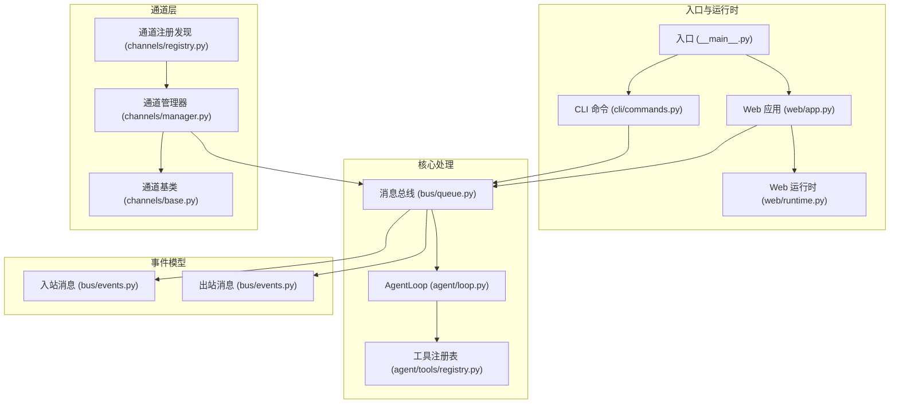
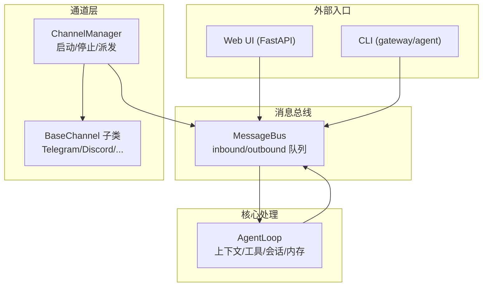
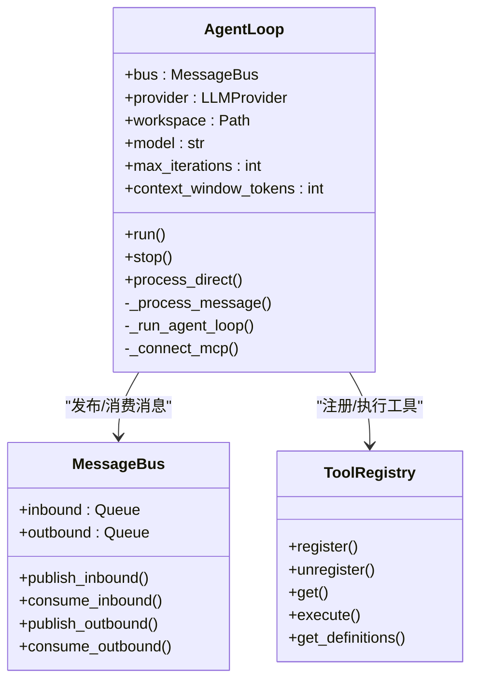
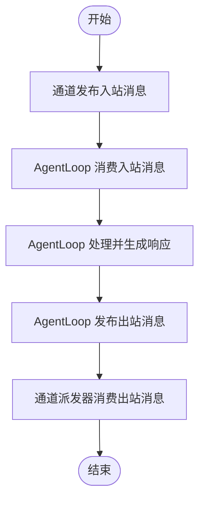
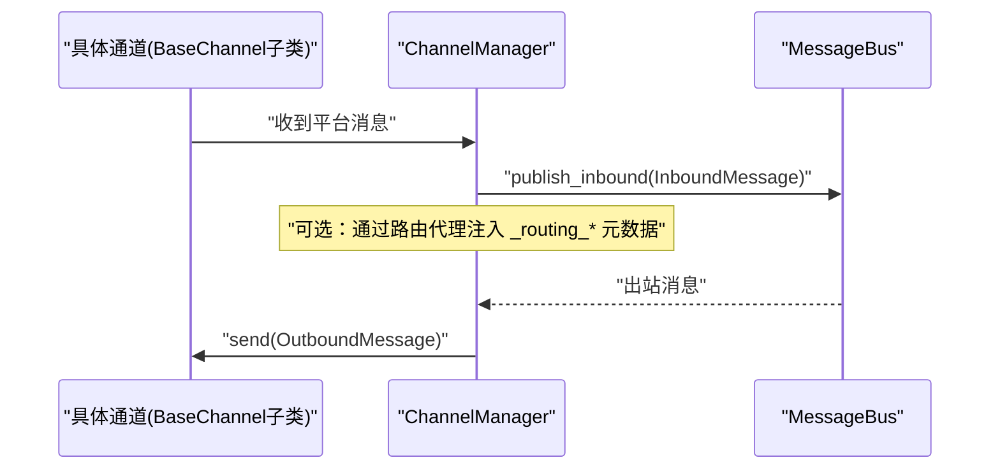
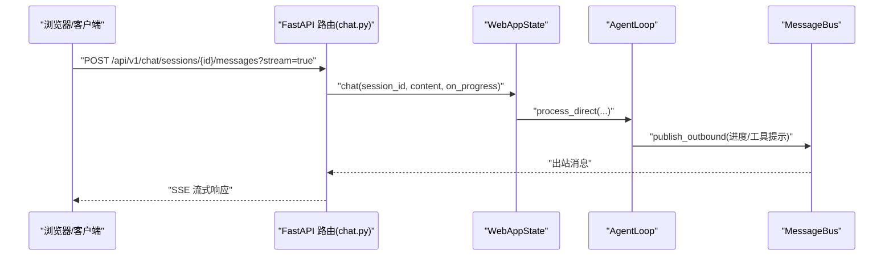
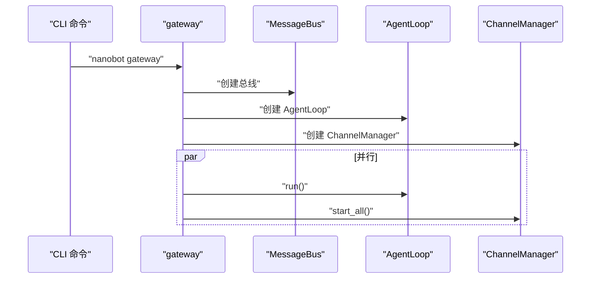
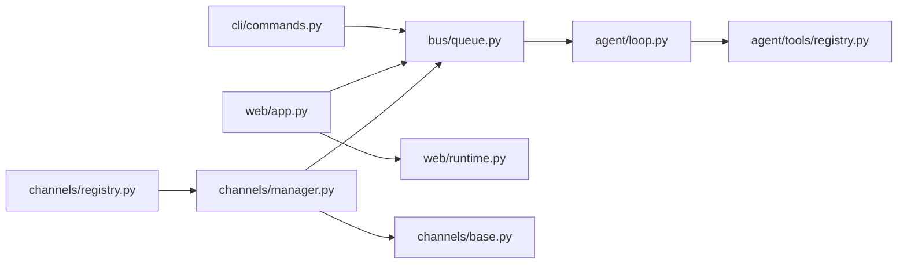

# 架构设计概览

<cite>
**本文档引用的文件**
- [README.md](file://README.md)
- [nanobot/__main__.py](file://nanobot/__main__.py)
- [nanobot/web/app.py](file://nanobot/web/app.py)
- [nanobot/agent/loop.py](file://nanobot/agent/loop.py)
- [nanobot/bus/events.py](file://nanobot/bus/events.py)
- [nanobot/bus/queue.py](file://nanobot/bus/queue.py)
- [nanobot/channels/manager.py](file://nanobot/channels/manager.py)
- [nanobot/channels/base.py](file://nanobot/channels/base.py)
- [nanobot/channels/registry.py](file://nanobot/channels/registry.py)
- [nanobot/web/routers/chat.py](file://nanobot/web/routers/chat.py)
- [nanobot/cli/commands.py](file://nanobot/cli/commands.py)
- [nanobot/web/runtime.py](file://nanobot/web/runtime.py)
- [nanobot/agent/tools/registry.py](file://nanobot/agent/tools/registry.py)
</cite>

## 目录
1. [简介](#简介)
2. [项目结构](#项目结构)
3. [核心组件](#核心组件)
4. [架构总览](#架构总览)
5. [详细组件分析](#详细组件分析)
6. [依赖关系分析](#依赖关系分析)
7. [性能考虑](#性能考虑)
8. [故障排除指南](#故障排除指南)
9. [结论](#结论)

## 简介
本文件面向 Nanobot 项目的架构设计与实现进行系统化解读，围绕 README 中的架构图，深入阐释事件驱动架构、插件化设计与分层架构在代码中的具体落地方式。重点解析 AgentLoop、MessageBus、ChannelManager 以及 Web 服务之间的交互模式，梳理从用户输入到响应输出的完整处理链路，并总结架构决策的技术考量、性能优化策略与可扩展性设计。

## 项目结构
Nanobot 采用模块化与分层组织：核心处理引擎位于 agent 子包，消息总线位于 bus 子包，多聊天渠道通过 channels 插件化接入，Web UI 通过 web 子包提供 HTTP API 与前端界面。CLI 作为入口命令行工具，负责启动网关（gateway）与 Web UI。

**图表来源**
- [nanobot/__main__.py:1-9](file://nanobot/__main__.py#L1-L9)
- [nanobot/cli/commands.py:308-678](file://nanobot/cli/commands.py#L308-L678)
- [nanobot/web/app.py:70-280](file://nanobot/web/app.py#L70-L280)
- [nanobot/web/runtime.py:72-301](file://nanobot/web/runtime.py#L72-L301)
- [nanobot/agent/loop.py:35-129](file://nanobot/agent/loop.py#L35-L129)
- [nanobot/agent/tools/registry.py:8-71](file://nanobot/agent/tools/registry.py#L8-L71)
- [nanobot/bus/queue.py:8-45](file://nanobot/bus/queue.py#L8-L45)
- [nanobot/bus/events.py:8-39](file://nanobot/bus/events.py#L8-L39)
- [nanobot/channels/manager.py:52-209](file://nanobot/channels/manager.py#L52-L209)
- [nanobot/channels/base.py:15-135](file://nanobot/channels/base.py#L15-L135)
- [nanobot/channels/registry.py:15-36](file://nanobot/channels/registry.py#L15-L36)

**章节来源**
- [nanobot/__main__.py:1-9](file://nanobot/__main__.py#L1-L9)
- [nanobot/cli/commands.py:308-678](file://nanobot/cli/commands.py#L308-L678)
- [nanobot/web/app.py:70-280](file://nanobot/web/app.py#L70-L280)
- [nanobot/web/runtime.py:72-301](file://nanobot/web/runtime.py#L72-L301)
- [nanobot/agent/loop.py:35-129](file://nanobot/agent/loop.py#L35-L129)
- [nanobot/agent/tools/registry.py:8-71](file://nanobot/agent/tools/registry.py#L8-L71)
- [nanobot/bus/queue.py:8-45](file://nanobot/bus/queue.py#L8-L45)
- [nanobot/bus/events.py:8-39](file://nanobot/bus/events.py#L8-L39)
- [nanobot/channels/manager.py:52-209](file://nanobot/channels/manager.py#L52-L209)
- [nanobot/channels/base.py:15-135](file://nanobot/channels/base.py#L15-L135)
- [nanobot/channels/registry.py:15-36](file://nanobot/channels/registry.py#L15-L36)

## 核心组件
- AgentLoop：核心处理引擎，负责接收入站消息、构建上下文、调用 LLM、执行工具、发送出站消息。支持会话管理、内存整理、MCP 连接延迟建立等。
- MessageBus：异步消息总线，解耦通道与 AgentLoop，提供入站/出站队列与尺寸查询。
- ChannelManager：通道管理器，动态发现并初始化启用的聊天通道，统一启动/停止与出站消息派发。
- Web 应用与运行时：FastAPI 应用工厂，提供 Web UI 路由、认证、操作服务与运行时状态管理；WebAppState 统一持有运行时服务与生命周期管理。
- 工具注册表：动态注册与执行工具，支持参数校验、类型转换与错误提示。

**章节来源**
- [nanobot/agent/loop.py:35-129](file://nanobot/agent/loop.py#L35-L129)
- [nanobot/bus/queue.py:8-45](file://nanobot/bus/queue.py#L8-L45)
- [nanobot/channels/manager.py:52-209](file://nanobot/channels/manager.py#L52-L209)
- [nanobot/web/app.py:70-280](file://nanobot/web/app.py#L70-L280)
- [nanobot/web/runtime.py:72-301](file://nanobot/web/runtime.py#L72-L301)
- [nanobot/agent/tools/registry.py:8-71](file://nanobot/agent/tools/registry.py#L8-L71)

## 架构总览
Nanobot 的整体架构以事件驱动为核心，通过消息总线实现通道与 AgentLoop 的解耦。Web UI 与 CLI 同时作为入口，分别通过 FastAPI 或 asyncio 协程驱动 AgentLoop 与 ChannelManager 并行运行。通道层采用插件化设计，通过自动发现机制加载各聊天平台适配器，支持 Telegram、Discord、WhatsApp 等多平台。

**图表来源**
- [nanobot/web/app.py:70-280](file://nanobot/web/app.py#L70-L280)
- [nanobot/cli/commands.py:308-678](file://nanobot/cli/commands.py#L308-L678)
- [nanobot/agent/loop.py:35-129](file://nanobot/agent/loop.py#L35-L129)
- [nanobot/bus/queue.py:8-45](file://nanobot/bus/queue.py#L8-L45)
- [nanobot/channels/manager.py:52-209](file://nanobot/channels/manager.py#L52-L209)
- [nanobot/channels/base.py:15-135](file://nanobot/channels/base.py#L15-L135)

## 详细组件分析

### AgentLoop：事件驱动的核心处理引擎
- 职责：接收入站消息、构建上下文、调用 LLM、执行工具、发送出站消息；支持 /new、/help、/stop 等系统命令；会话隔离与历史截断；内存整理策略。
- 关键特性：
  - 异步循环消费入站消息，使用全局锁保证同一会话内串行处理。
  - 工具注册表按需加载，支持文件系统、网络搜索、消息转发、子代理、定时任务等工具。
  - 支持 MCP 服务器延迟连接，失败重试与安全关闭。
  - 进度回调通过出站消息流式返回，支持“思考/工具提示”两类元数据。
- 性能要点：最大迭代次数限制、工具结果截断、内存按令牌阈值整理、会话消息去噪（空助手消息、运行时上下文前缀剥离）。

**图表来源**
- [nanobot/agent/loop.py:35-129](file://nanobot/agent/loop.py#L35-L129)
- [nanobot/bus/queue.py:8-45](file://nanobot/bus/queue.py#L8-L45)
- [nanobot/agent/tools/registry.py:8-71](file://nanobot/agent/tools/registry.py#L8-L71)

**章节来源**
- [nanobot/agent/loop.py:218-485](file://nanobot/agent/loop.py#L218-L485)
- [nanobot/agent/loop.py:487-541](file://nanobot/agent/loop.py#L487-L541)

### MessageBus：异步消息总线
- 职责：提供入站/出站异步队列，屏蔽通道与 AgentLoop 的耦合；暴露队列长度查询接口。
- 设计要点：基于 asyncio.Queue 的阻塞式读取，确保高并发下的有序处理。

**图表来源**
- [nanobot/bus/queue.py:8-45](file://nanobot/bus/queue.py#L8-L45)

**章节来源**
- [nanobot/bus/queue.py:8-45](file://nanobot/bus/queue.py#L8-L45)
- [nanobot/bus/events.py:8-39](file://nanobot/bus/events.py#L8-L39)

### ChannelManager：插件化通道协调器
- 职责：动态发现并初始化启用的通道；启动/停止通道；统一出站消息派发；支持路由增强（通过代理注入路由元数据）。
- 插件化设计：通过通道注册发现机制扫描 channels 包内的模块，过滤内部模块后导入对应通道类，实例化后启动协程监听消息。
- 出站派发：根据出站消息的 channel 字段选择对应通道实例发送，支持进度/工具提示开关。

**图表来源**
- [nanobot/channels/manager.py:19-50](file://nanobot/channels/manager.py#L19-L50)
- [nanobot/channels/manager.py:160-190](file://nanobot/channels/manager.py#L160-L190)
- [nanobot/channels/base.py:89-135](file://nanobot/channels/base.py#L89-L135)
- [nanobot/bus/queue.py:20-34](file://nanobot/bus/queue.py#L20-L34)

**章节来源**
- [nanobot/channels/manager.py:52-209](file://nanobot/channels/manager.py#L52-L209)
- [nanobot/channels/registry.py:15-36](file://nanobot/channels/registry.py#L15-L36)
- [nanobot/channels/base.py:15-135](file://nanobot/channels/base.py#L15-L135)

### Web 服务：FastAPI 应用与运行时
- 应用工厂：创建 FastAPI 实例，注册中间件与异常处理器，挂载各类路由（agents、auth、channels、chat、knowledge、memory、runs、schedule、teams、tenants、workspace），并注入 WebAppState。
- WebAppState：统一管理运行时服务（聊天、配置、日程、工作区、团队、代理、频道运行时等），并在 lifespan 中启动频道运行时与绑定运行时源。
- 路由示例：聊天路由支持上传文件、列出/创建/重命名/删除会话、获取消息、流式/非流式发送消息。

**图表来源**
- [nanobot/web/app.py:70-280](file://nanobot/web/app.py#L70-L280)
- [nanobot/web/runtime.py:72-301](file://nanobot/web/runtime.py#L72-L301)
- [nanobot/web/routers/chat.py:105-187](file://nanobot/web/routers/chat.py#L105-L187)
- [nanobot/agent/loop.py:466-485](file://nanobot/agent/loop.py#L466-L485)

**章节来源**
- [nanobot/web/app.py:70-280](file://nanobot/web/app.py#L70-L280)
- [nanobot/web/runtime.py:72-301](file://nanobot/web/runtime.py#L72-L301)
- [nanobot/web/routers/chat.py:105-187](file://nanobot/web/routers/chat.py#L105-L187)

### CLI 启动流程：gateway 与 agent
- gateway：创建 MessageBus、LLM Provider、SessionManager、CronService、HeartbeatService，构建 AgentLoop 与 ChannelManager，并行启动 AgentLoop 与所有启用的通道。
- agent：单次交互或交互式模式，直接通过 AgentLoop.process_direct 处理消息，支持进度回调与 Markdown 渲染。

**图表来源**
- [nanobot/cli/commands.py:308-678](file://nanobot/cli/commands.py#L308-L678)
- [nanobot/agent/loop.py:289-370](file://nanobot/agent/loop.py#L289-L370)
- [nanobot/channels/manager.py:122-139](file://nanobot/channels/manager.py#L122-L139)

**章节来源**
- [nanobot/cli/commands.py:308-678](file://nanobot/cli/commands.py#L308-L678)

## 依赖关系分析
- 组件耦合：AgentLoop 依赖 MessageBus 与 ToolRegistry；ChannelManager 依赖 MessageBus 与通道基类；Web 应用依赖运行时服务与路由模块。
- 插件发现：通道模块通过 pkgutil 自动发现，避免硬编码注册，提升可扩展性。
- 外部依赖：FastAPI、Starlette、loguru、prompt_toolkit、rich 等。

**图表来源**
- [nanobot/cli/commands.py:308-678](file://nanobot/cli/commands.py#L308-L678)
- [nanobot/web/app.py:70-280](file://nanobot/web/app.py#L70-L280)
- [nanobot/web/runtime.py:72-301](file://nanobot/web/runtime.py#L72-L301)
- [nanobot/agent/loop.py:35-129](file://nanobot/agent/loop.py#L35-L129)
- [nanobot/agent/tools/registry.py:8-71](file://nanobot/agent/tools/registry.py#L8-L71)
- [nanobot/channels/manager.py:52-209](file://nanobot/channels/manager.py#L52-L209)
- [nanobot/channels/base.py:15-135](file://nanobot/channels/base.py#L15-L135)
- [nanobot/channels/registry.py:15-36](file://nanobot/channels/registry.py#L15-L36)

**章节来源**
- [nanobot/cli/commands.py:308-678](file://nanobot/cli/commands.py#L308-L678)
- [nanobot/web/app.py:70-280](file://nanobot/web/app.py#L70-L280)
- [nanobot/web/runtime.py:72-301](file://nanobot/web/runtime.py#L72-L301)
- [nanobot/agent/loop.py:35-129](file://nanobot/agent/loop.py#L35-L129)
- [nanobot/agent/tools/registry.py:8-71](file://nanobot/agent/tools/registry.py#L8-L71)
- [nanobot/channels/manager.py:52-209](file://nanobot/channels/manager.py#L52-L209)
- [nanobot/channels/base.py:15-135](file://nanobot/channels/base.py#L15-L135)
- [nanobot/channels/registry.py:15-36](file://nanobot/channels/registry.py#L15-L36)

## 性能考虑
- 事件驱动与异步：通过 asyncio 队列与任务调度，降低阻塞开销，提高并发吞吐。
- 内存与上下文窗口：MemoryConsolidator 基于令牌阈值进行会话历史归档与压缩，避免上下文膨胀导致的性能与成本问题。
- 工具结果截断：对工具返回文本进行长度限制，防止大结果污染会话历史。
- 进度流式输出：通过 SSE 将“思考/工具提示”逐步返回，改善用户体验与感知延迟。
- MCP 延迟连接：仅在首次需要时连接 MCP 服务器，失败重试且可安全关闭，减少启动时长与资源占用。
- 通道派发过滤：根据配置开关过滤进度/工具提示消息，减少无效消息派发。

[本节为通用性能建议，不直接分析具体文件]

## 故障排除指南
- 认证与权限：Web 应用对 API 请求进行认证拦截，未登录返回 401；通道允许列表为空会导致访问被拒绝，需在配置中设置 allowFrom。
- 通道启动失败：ChannelManager 在启动通道时捕获异常并记录错误，检查对应平台的凭据与网络配置。
- AgentLoop 错误处理：在处理消息过程中抛出异常会返回“抱歉，遇到错误”的默认响应；/stop 可取消当前会话的活动任务。
- MCP 连接失败：AgentLoop 对 MCP 连接失败进行日志记录与清理，等待下次消息触发重试。

**章节来源**
- [nanobot/web/app.py:205-243](file://nanobot/web/app.py#L205-L243)
- [nanobot/channels/base.py:79-88](file://nanobot/channels/base.py#L79-L88)
- [nanobot/channels/manager.py:115-121](file://nanobot/channels/manager.py#L115-L121)
- [nanobot/agent/loop.py:308-356](file://nanobot/agent/loop.py#L308-L356)

## 结论
Nanobot 通过事件驱动与消息总线实现了通道与核心处理引擎的解耦，结合插件化的通道发现机制与分层架构，提供了清晰、可扩展且高性能的个人 AI 助手框架。AgentLoop 作为核心处理单元，配合工具注册表、会话与内存管理，支撑多平台、多场景的智能对话与自动化任务执行。Web UI 与 CLI 提供一致的交互体验，便于部署与运维。未来可在以下方向持续演进：更细粒度的并发控制、可配置的内存整理策略、MCP 连接池与健康检查、以及更丰富的路由与编排能力。