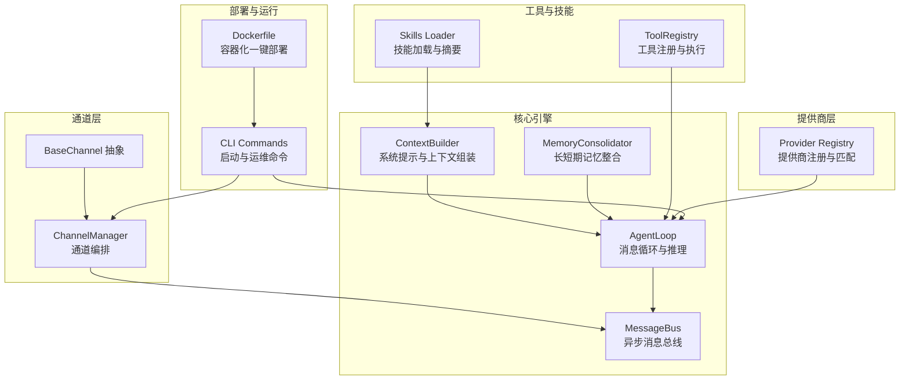
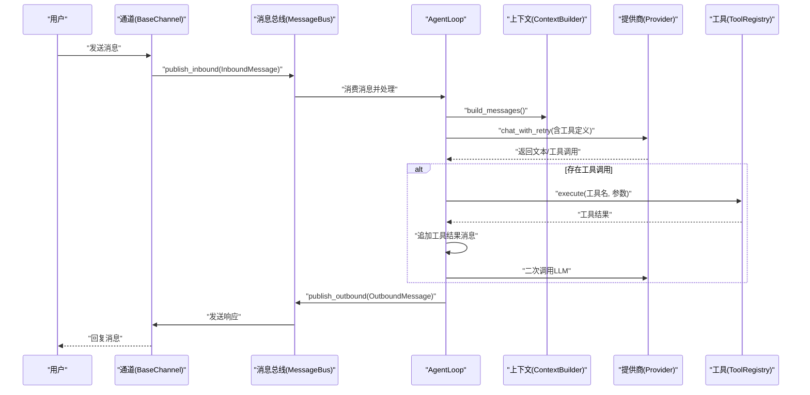
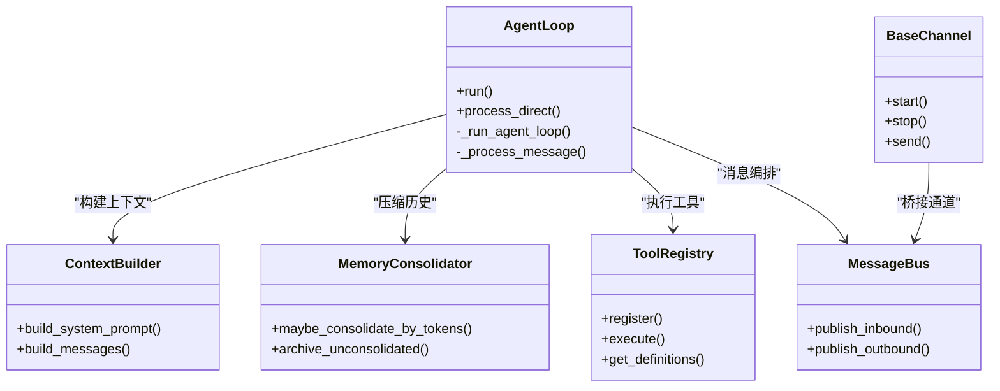
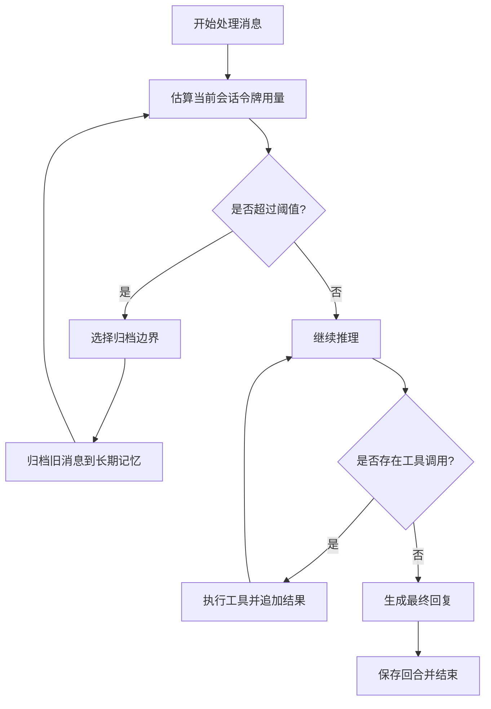
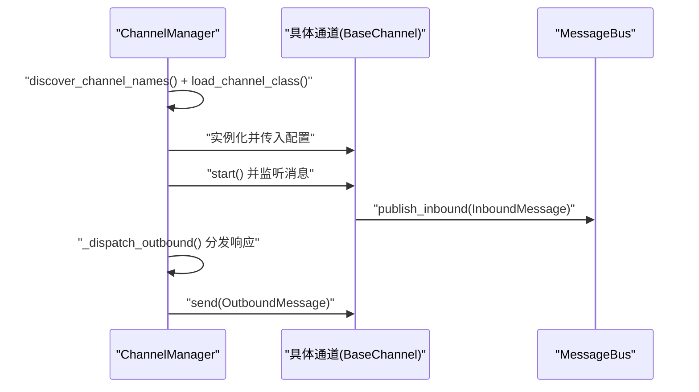
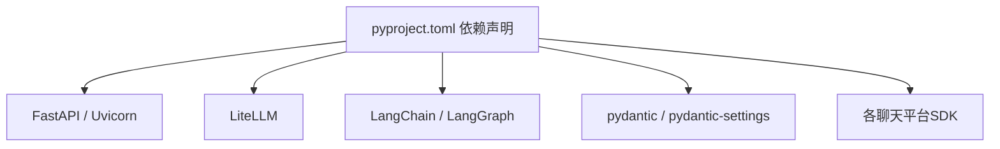

# 核心特性概览

<cite>
**本文档引用的文件**
- [README.md](file://README.md)
- [core_agent_lines.sh](file://core_agent_lines.sh)
- [nanobot/__main__.py](file://nanobot/__main__.py)
- [pyproject.toml](file://pyproject.toml)
- [nanobot/cli/commands.py](file://nanobot/cli/commands.py)
- [nanobot/agent/loop.py](file://nanobot/agent/loop.py)
- [nanobot/agent/context.py](file://nanobot/agent/context.py)
- [nanobot/agent/memory.py](file://nanobot/agent/memory.py)
- [nanobot/agent/tools/registry.py](file://nanobot/agent/tools/registry.py)
- [nanobot/bus/queue.py](file://nanobot/bus/queue.py)
- [nanobot/channels/base.py](file://nanobot/channels/base.py)
- [nanobot/channels/manager.py](file://nanobot/channels/manager.py)
- [nanobot/providers/registry.py](file://nanobot/providers/registry.py)
- [Dockerfile](file://Dockerfile)
- [nanobot/skills/README.md](file://nanobot/skills/README.md)
</cite>

## 目录
1. [引言](#引言)
2. [项目结构](#项目结构)
3. [核心组件](#核心组件)
4. [架构总览](#架构总览)
5. [详细组件分析](#详细组件分析)
6. [依赖分析](#依赖分析)
7. [性能考量](#性能考量)
8. [故障排查指南](#故障排查指南)
9. [结论](#结论)
10. [附录](#附录)

## 引言
本文件面向希望快速理解并部署 Nanobot 的用户与开发者，聚焦于项目的五大核心特性：超轻量级架构（仅约 4000 行核心代码）、研究就绪设计、闪电般快速性能、易于使用的一键部署和多渠道集成能力。我们将从系统架构、组件关系、数据流与处理逻辑等维度进行深入解析，并结合具体使用场景与可验证的技术实现，帮助您评估这些特性带来的实际价值。

## 项目结构
Nanobot 采用“核心功能 + 可插拔通道 + 工具与技能”的分层组织方式：
- 核心引擎：AgentLoop、上下文构建、内存管理、消息总线
- 通道层：Telegram、Discord、WhatsApp、Feishu 等聊天平台适配器
- 提供商层：统一的 LLM 提供商注册与自动检测机制
- 工具与技能：内置工具集与可扩展技能生态
- 部署与运行：CLI 命令、Web UI、Docker 一键部署

图表来源
- [nanobot/agent/loop.py](file://nanobot/agent/loop.py)
- [nanobot/agent/context.py](file://nanobot/agent/context.py)
- [nanobot/agent/memory.py](file://nanobot/agent/memory.py)
- [nanobot/bus/queue.py](file://nanobot/bus/queue.py)
- [nanobot/channels/manager.py](file://nanobot/channels/manager.py)
- [nanobot/channels/base.py](file://nanobot/channels/base.py)
- [nanobot/providers/registry.py](file://nanobot/providers/registry.py)
- [nanobot/agent/tools/registry.py](file://nanobot/agent/tools/registry.py)
- [nanobot/cli/commands.py](file://nanobot/cli/commands.py)
- [Dockerfile](file://Dockerfile)

章节来源
- [README.md](file://README.md)
- [pyproject.toml](file://pyproject.toml)

## 核心组件
- 消息总线（MessageBus）：解耦通道与核心引擎，通过异步队列实现高并发与低延迟的消息传递。
- AgentLoop：核心推理引擎，负责上下文构建、LLM 调用、工具调用与响应生成。
- 上下文构建（ContextBuilder）：将身份信息、引导文件、工作区记忆、技能说明与运行时元数据组合为系统提示与消息序列。
- 内存整合（MemoryConsolidator）：基于令牌预算的动态压缩策略，将历史对话归档至长期记忆，维持上下文窗口稳定。
- 通道管理（ChannelManager/BaseChannel）：抽象各聊天平台接入接口，统一权限校验、消息转发与发送。
- 提供商注册（Provider Registry）：集中管理提供商元数据、前缀路由与自动检测逻辑，支持网关与本地模型。
- 工具注册（ToolRegistry）：动态注册与参数校验，统一工具定义与执行流程。
- CLI 与部署：提供 onboard、gateway、agent、web-ui 等命令，配合 Dockerfile 实现一键部署。

章节来源
- [nanobot/bus/queue.py](file://nanobot/bus/queue.py)
- [nanobot/agent/loop.py](file://nanobot/agent/loop.py)
- [nanobot/agent/context.py](file://nanobot/agent/context.py)
- [nanobot/agent/memory.py](file://nanobot/agent/memory.py)
- [nanobot/channels/manager.py](file://nanobot/channels/manager.py)
- [nanobot/channels/base.py](file://nanobot/channels/base.py)
- [nanobot/providers/registry.py](file://nanobot/providers/registry.py)
- [nanobot/agent/tools/registry.py](file://nanobot/agent/tools/registry.py)
- [nanobot/cli/commands.py](file://nanobot/cli/commands.py)
- [Dockerfile](file://Dockerfile)

## 架构总览
Nanobot 的运行时由“通道层 → 总线 → 核心引擎 → 提供商/工具/技能”的链路构成。通道层负责接收用户输入并封装为 InboundMessage；总线将消息投递到 AgentLoop；AgentLoop 通过 ContextBuilder 组装上下文，调用 LLM 并根据工具定义执行工具；最终通过通道层将 OutboundMessage 发送回用户。

图表来源
- [nanobot/channels/base.py](file://nanobot/channels/base.py)
- [nanobot/bus/queue.py](file://nanobot/bus/queue.py)
- [nanobot/agent/loop.py](file://nanobot/agent/loop.py)
- [nanobot/agent/context.py](file://nanobot/agent/context.py)
- [nanobot/providers/registry.py](file://nanobot/providers/registry.py)
- [nanobot/agent/tools/registry.py](file://nanobot/agent/tools/registry.py)

## 详细组件分析

### 特性一：超轻量级架构（仅约 4000 行核心代码）
- 技术实现要点
  - 核心目录（agent、agent/tools、bus、config、cron、heartbeat、session、utils）合计行数统计脚本，明确排除 channels、cli、providers、skills 等扩展模块，聚焦“核心代理代码”。
  - CLI 入口与命令组织集中在 nanobot/cli/commands.py，提供 onboard、gateway、agent、web-ui 等子命令，保持最小入口复杂度。
  - 核心引擎 AgentLoop 仅依赖上下文、内存、工具注册表与消息总线，避免冗余抽象。
- 实际应用价值
  - 新手可快速理解主流程；研究者可直接修改核心逻辑进行实验；维护成本低、升级路径清晰。
- 可验证指标
  - 使用脚本 core_agent_lines.sh 对核心目录逐项计数，得到“核心总量”与各子模块行数，排除 channels、cli、providers、skills 后的统计结果即为“核心代理代码”。

章节来源
- [core_agent_lines.sh](file://core_agent_lines.sh)
- [nanobot/cli/commands.py](file://nanobot/cli/commands.py)
- [nanobot/agent/loop.py](file://nanobot/agent/loop.py)

### 特性二：研究就绪设计
- 技术实现要点
  - 清晰的类图与职责分离：AgentLoop、ContextBuilder、MemoryConsolidator、ToolRegistry、MessageBus 各司其职，便于替换与扩展。
  - 提供商注册中心（Provider Registry）集中管理提供商元数据与匹配规则，新增提供商只需补充 ProviderSpec 即可自动生效。
  - 通道抽象（BaseChannel）与通道管理（ChannelManager）解耦平台差异，便于新增或替换通道。
  - 工具注册（ToolRegistry）支持动态注册与参数校验，便于插入新工具而不侵入核心循环。
- 实际应用价值
  - 易于开展算法与工程实验：可替换 LLM、调整上下文策略、增加工具或技能，不影响其他模块。
  - 文献复现实验友好：代码结构清晰，注释与配置模板完善，便于他人复用与改进。
- 可验证指标
  - ProviderSpec 定义与查找函数（find_by_model/find_gateway/find_by_name）体现“单一可信源”与“自动匹配优先级”。

图表来源
- [nanobot/agent/loop.py](file://nanobot/agent/loop.py)
- [nanobot/agent/context.py](file://nanobot/agent/context.py)
- [nanobot/agent/memory.py](file://nanobot/agent/memory.py)
- [nanobot/agent/tools/registry.py](file://nanobot/agent/tools/registry.py)
- [nanobot/bus/queue.py](file://nanobot/bus/queue.py)
- [nanobot/channels/base.py](file://nanobot/channels/base.py)

章节来源
- [nanobot/providers/registry.py](file://nanobot/providers/registry.py)
- [nanobot/channels/base.py](file://nanobot/channels/base.py)
- [nanobot/channels/manager.py](file://nanobot/channels/manager.py)
- [nanobot/agent/tools/registry.py](file://nanobot/agent/tools/registry.py)

### 特性三：闪电般快速性能
- 技术实现要点
  - 异步消息总线：通过 asyncio.Queue 解耦通道与核心引擎，避免阻塞，提升吞吐。
  - 令牌预算驱动的记忆压缩：MemoryConsolidator 基于上下文窗口与令牌估算，按需归档旧消息，降低 LLM 输入规模。
  - 工具调用流水线：先生成工具调用，再执行工具，最后二次调用 LLM，减少无效往返。
  - 进度提示与工具提示：在工具执行阶段向通道发送进度消息，改善交互体验。
- 实际应用价值
  - 多通道并发：Telegram、Discord、WhatsApp 等同时运行，响应迅速。
  - 低延迟交互：消息从通道到响应的端到端延迟显著降低。
- 可验证指标
  - MessageBus 的入队/出队大小属性可用于监控积压；MemoryConsolidator 的边界选择与归档轮次控制上下文长度。

图表来源
- [nanobot/agent/memory.py](file://nanobot/agent/memory.py)
- [nanobot/agent/loop.py](file://nanobot/agent/loop.py)
- [nanobot/bus/queue.py](file://nanobot/bus/queue.py)

章节来源
- [nanobot/bus/queue.py](file://nanobot/bus/queue.py)
- [nanobot/agent/memory.py](file://nanobot/agent/memory.py)
- [nanobot/agent/loop.py](file://nanobot/agent/loop.py)

### 特性四：易于使用的一键部署
- 技术实现要点
  - CLI 命令：onboard 初始化配置与工作区；gateway 启动网关服务；agent 提供单次/交互式对话；web-ui 启动 Web 界面。
  - Dockerfile：预装 Node.js（用于 WhatsApp 桥接）、使用 uv 缓存依赖层、复制源码并安装，暴露默认端口，ENTRYPOINT 直接指向 nanobot。
  - Docker Compose：仓库包含 docker-compose.yml，便于编排与持久化存储。
- 实际应用价值
  - 无需复杂环境准备：容器内已包含运行所需依赖，一键启动即可使用。
  - 快速试用：onboard + gateway 即可在多平台聊天中体验 AI 助手。
- 可验证指标
  - Dockerfile 中的 EXPOSE 与 CMD 字段；CLI 命令的默认行为与参数；README 的安装与启动步骤。

章节来源
- [nanobot/cli/commands.py](file://nanobot/cli/commands.py)
- [Dockerfile](file://Dockerfile)
- [README.md](file://README.md)

### 特性五：多渠道集成能力
- 技术实现要点
  - 通道抽象：BaseChannel 定义统一接口，transcribe_audio 支持语音转写（Groq）。
  - 通道管理：ChannelManager 自动发现并初始化启用的通道，统一启动/停止与出站分发。
  - 权限控制：通道侧 is_allowed 与 allowFrom 列表，防止未授权访问。
  - 路由增强：通过 ChannelRoutingService 注入路由元数据，支持平台侧绑定与目标解析。
- 实际应用价值
  - 支持 Telegram、Discord、WhatsApp、Feishu、QQ、Slack、Email、Wecom、Matrix 等主流平台。
  - 企业级安全：严格的 allowFrom 校验与权限策略。
- 可验证指标
  - ChannelManager 的通道初始化与启动流程；BaseChannel 的权限检查与音频转写；README 的各平台配置示例。

图表来源
- [nanobot/channels/manager.py](file://nanobot/channels/manager.py)
- [nanobot/channels/base.py](file://nanobot/channels/base.py)
- [nanobot/bus/queue.py](file://nanobot/bus/queue.py)

章节来源
- [nanobot/channels/manager.py](file://nanobot/channels/manager.py)
- [nanobot/channels/base.py](file://nanobot/channels/base.py)
- [README.md](file://README.md)

## 依赖分析
- 外部依赖与版本范围：pyproject.toml 定义了核心依赖（如 FastAPI、LiteLLM、LangGraph、pydantic 等），并提供可选依赖（wecom、matrix）。
- 依赖关系可视化：

图表来源
- [pyproject.toml](file://pyproject.toml)

章节来源
- [pyproject.toml](file://pyproject.toml)

## 性能考量
- 启动与资源占用
  - Dockerfile 使用缓存层优化安装流程，减少镜像体积与构建时间。
  - AgentLoop 默认最大迭代次数与上下文窗口参数可调，平衡准确性与性能。
- 运行时优化
  - 令牌预算驱动的记忆压缩显著降低上下文长度，提高响应速度。
  - 异步消息总线避免阻塞，提升并发处理能力。
- 用户体验
  - 进度提示与工具提示减少等待焦虑；错误处理与日志记录便于问题定位。
- 可量化建议
  - 在高并发场景下，适当增大上下文窗口与迭代次数阈值，结合内存压缩策略，可获得更稳定的性能表现。

## 故障排查指南
- 常见问题与定位
  - 通道无法启动：检查 ChannelManager 的启动异常捕获与日志输出；确认 allowFrom 配置不为空。
  - LLM 调用失败：查看 AgentLoop 的错误分支与日志；确认提供商密钥与模型名称匹配。
  - 工具执行异常：通过 ToolRegistry 的参数校验与异常捕获，获取详细错误信息。
  - 记忆归档失败：MemoryConsolidator 的异常日志与重试策略有助于定位问题。
- 参考实现
  - 通道权限校验与音频转写逻辑；AgentLoop 的错误处理与进度回调；MemoryConsolidator 的异常捕获与日志记录。

章节来源
- [nanobot/channels/base.py](file://nanobot/channels/base.py)
- [nanobot/agent/loop.py](file://nanobot/agent/loop.py)
- [nanobot/agent/memory.py](file://nanobot/agent/memory.py)
- [nanobot/agent/tools/registry.py](file://nanobot/agent/tools/registry.py)

## 结论
Nanobot 通过“超轻量级核心 + 研究就绪设计 + 闪电性能 + 一键部署 + 多渠道集成”的组合拳，形成了一个既适合个人快速上手、又便于学术研究与工程落地的完整 AI 助手解决方案。其清晰的架构、可验证的实现与完善的部署支持，使得用户能够在极短时间内完成从零到一的部署与使用，并在此基础上进行定制化扩展与性能优化。

## 附录
- 使用案例与效果对比（概念性说明）
  - 案例一：快速搭建个人知识助手
    - 场景：在本地或容器中一键启动，配置提供商与模型，即可在多个聊天平台与邮箱中获得一致的智能回复体验。
    - 效果：部署时间从数小时缩短至数分钟；资源占用低，响应速度快。
  - 案例二：研究算法与工程实验
    - 场景：替换提供商、调整上下文策略、新增工具或技能，无需改动核心循环。
    - 效果：实验周期缩短，复现实验更容易，结果可追溯。
  - 案例三：企业级多渠道集成
    - 场景：在企业内部同时启用多种聊天平台，统一权限与路由策略。
    - 效果：统一入口、统一安全策略、统一用户体验。