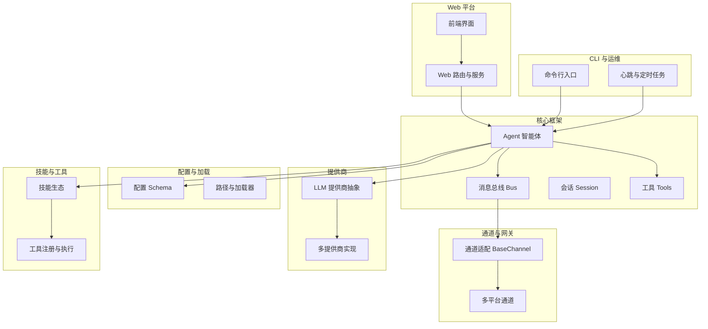
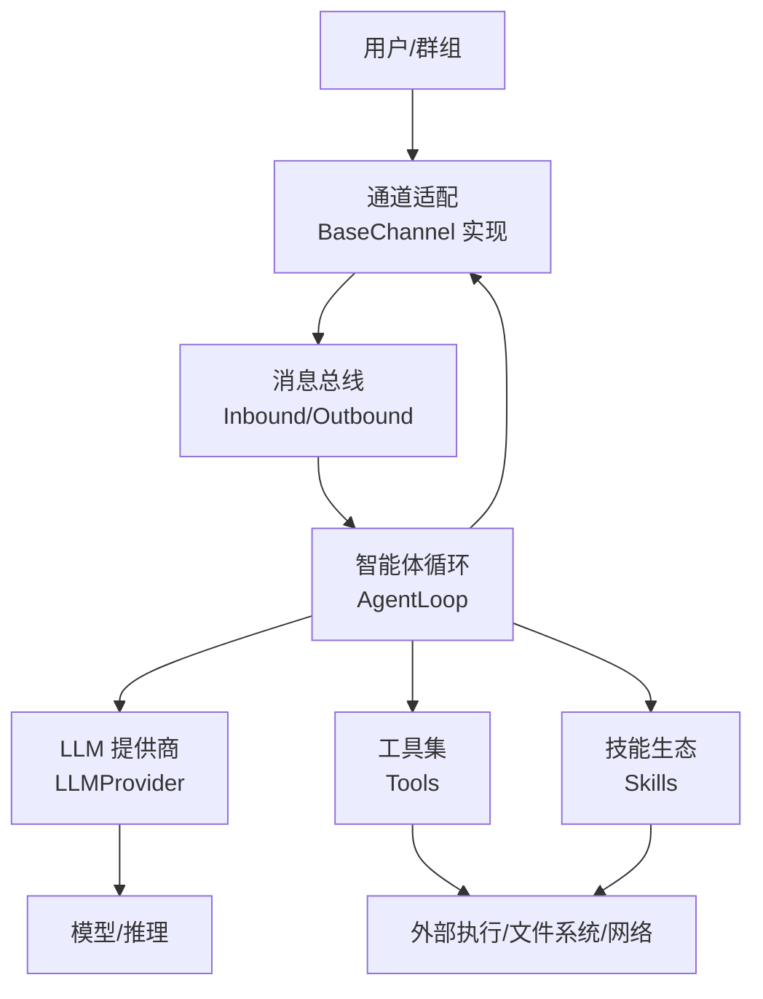
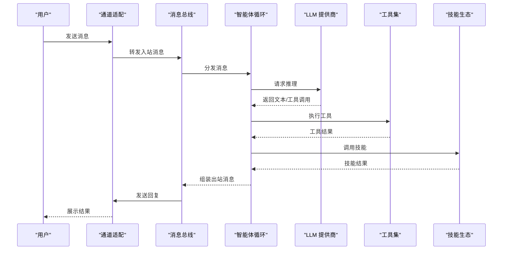
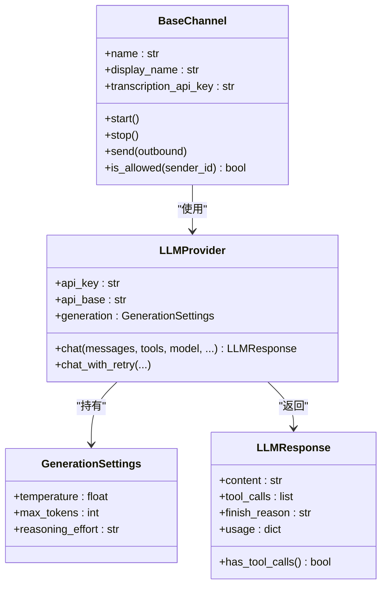
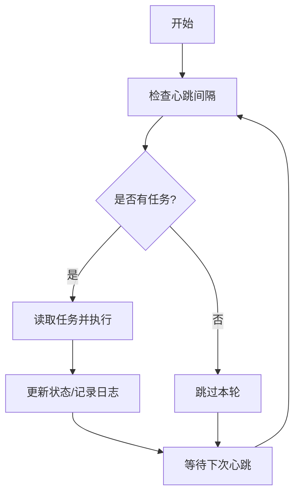
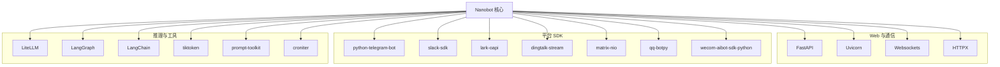

# 项目介绍与愿景

<cite>
**本文引用的文件**
- [README.md](file://README.md)
- [SOUL.md](file://SOUL.md)
- [HEARTBEAT.md](file://HEARTBEAT.md)
- [AGENTS.md](file://AGENTS.md)
- [TOOLS.md](file://TOOLS.md)
- [nanobot/__main__.py](file://nanobot/__main__.py)
- [nanobot/__init__.py](file://nanobot/__init__.py)
- [pyproject.toml](file://pyproject.toml)
- [core_agent_lines.sh](file://core_agent_lines.sh)
- [nanobot/cli/commands.py](file://nanobot/cli/commands.py)
- [nanobot/config/schema.py](file://nanobot/config/schema.py)
- [nanobot/providers/base.py](file://nanobot/providers/base.py)
- [nanobot/channels/base.py](file://nanobot/channels/base.py)
</cite>

## 目录
1. [引言](#引言)
2. [项目结构](#项目结构)
3. [核心组件](#核心组件)
4. [架构总览](#架构总览)
5. [详细组件分析](#详细组件分析)
6. [依赖分析](#依赖分析)
7. [性能考量](#性能考量)
8. [故障排查指南](#故障排查指南)
9. [结论](#结论)
10. [附录](#附录)

## 引言
Nanobot 是一个“超轻量级”的个人 AI 助手框架，旨在以极小的代码体量提供强大的智能体能力。项目的核心使命是“用最少的代码做最多的事”，目标是让开发者能快速上手、轻松扩展，并将精力集中在创造性工作上。项目强调“研究友好性”和“易用性优先”，通过清晰的架构与最小化的依赖，帮助研究者与工程师在真实场景中验证想法、迭代方案。

项目愿景是构建一个“可读、可改、可扩展”的个人智能体平台：既能作为日常助手，也能作为研究工具箱，支持多渠道接入、多模型提供商适配、工具调用与技能生态，同时保持低心智负担与高可维护性。

**章节来源**
- [README.md:15-20](file://README.md#L15-L20)
- [README.md:66-75](file://README.md#L66-L75)

## 项目结构
从仓库组织看，Nanobot 采用“按功能域分层”的模块化结构：
- 核心运行时与框架：agent、bus、session、utils 等
- 配置与加载：config、loader、paths、schema
- 通道与网关：channels（多平台适配）、gateway 运行入口
- 提供商与推理：providers（多 LLM 提供商抽象）
- 技能与工具：skills、tools（工具注册与执行）
- Web 平台与前端：web（FastAPI 路由、运行时服务）、web-ui（React 前端）
- CLI 与运维：cli、runtime、heartbeat、cron 等
- 文档与模板：各领域说明文档（如 SOUL、HEARTBEAT、AGENTS、TOOLS）

下图给出一个概念性的项目结构视图（不映射具体源码文件）：

**章节来源**
- [README.md:76-80](file://README.md#L76-L80)

## 核心组件
- 入口与版本：模块入口负责启动 CLI 应用；包元信息包含版本与标识。
- CLI 交互：提供引导、配置初始化、交互式聊天、历史记录等能力。
- 配置系统：使用 Pydantic 定义各类通道与提供商的配置模型，支持驼峰/蛇形字段兼容。
- 通道抽象：统一的 BaseChannel 接口，屏蔽不同平台差异，便于扩展新渠道。
- 提供商抽象：统一的 LLMProvider 接口，封装请求、重试、消息清洗与工具调用解析。
- 心跳与定时：内置心跳任务与 Cron 服务，支持周期性任务与提醒。
- Web 平台：基于 FastAPI 的路由与运行时服务，支撑 Web UI 与远程管理。

**章节来源**
- [nanobot/__main__.py:1-9](file://nanobot/__main__.py#L1-L9)
- [nanobot/__init__.py:1-7](file://nanobot/__init__.py#L1-L7)
- [nanobot/cli/commands.py:1-200](file://nanobot/cli/commands.py#L1-L200)
- [nanobot/config/schema.py:1-200](file://nanobot/config/schema.py#L1-L200)
- [nanobot/channels/base.py:1-135](file://nanobot/channels/base.py#L1-L135)
- [nanobot/providers/base.py:1-200](file://nanobot/providers/base.py#L1-L200)

## 架构总览
Nanobot 的整体架构围绕“智能体 + 总线 + 通道 + 提供商 + 技能”的组合展开。消息从各聊天通道进入，经通道适配后进入消息总线，再由智能体循环处理，结合工具与技能完成推理与执行，并通过通道回传给用户。提供商抽象统一了多模型供应商的接入方式，配置系统确保可插拔与可维护性。

**图表来源**
- [nanobot/channels/base.py:15-135](file://nanobot/channels/base.py#L15-L135)
- [nanobot/providers/base.py:69-200](file://nanobot/providers/base.py#L69-L200)
- [nanobot/cli/commands.py:1-200](file://nanobot/cli/commands.py#L1-L200)

## 详细组件分析

### 设计理念与价值主张
- 99% 更少代码：通过核心智能体代码的精简与模块化，大幅降低学习与维护成本，同时保留强大功能。
- 研究友好：清晰的接口、可替换的提供商与通道、可扩展的技能体系，便于实验与验证。
- 易用优先：一键部署、默认安全策略、丰富的通道与提供商示例，降低上手门槛。
- 开源与社区：公开透明的路线图、开放的技能市场、持续的版本迭代与问题修复。

这些理念在 README 与项目脚本中有明确体现。

**章节来源**
- [README.md:17-19](file://README.md#L17-L19)
- [README.md:66-75](file://README.md#L66-L75)
- [core_agent_lines.sh:1-22](file://core_agent_lines.sh#L1-L22)

### 智能体与消息总线
智能体通过循环处理消息，结合上下文构建、工具调用与技能执行，最终生成回复并通过通道发送。消息总线负责解耦输入输出与处理逻辑，提升可扩展性与可测试性。

**图表来源**
- [nanobot/channels/base.py:89-135](file://nanobot/channels/base.py#L89-L135)
- [nanobot/providers/base.py:160-200](file://nanobot/providers/base.py#L160-L200)
- [nanobot/cli/commands.py:129-146](file://nanobot/cli/commands.py#L129-L146)

**章节来源**
- [nanobot/channels/base.py:15-135](file://nanobot/channels/base.py#L15-L135)
- [nanobot/providers/base.py:69-200](file://nanobot/providers/base.py#L69-L200)
- [nanobot/cli/commands.py:1-200](file://nanobot/cli/commands.py#L1-L200)

### 配置与提供商抽象
配置系统使用 Pydantic 定义各类通道与提供商参数，支持驼峰/蛇形字段互换，便于与平台 API 对齐。提供商抽象统一了聊天接口、重试机制、消息清洗与工具调用解析，使新增提供商变得简单。

**图表来源**
- [nanobot/channels/base.py:15-135](file://nanobot/channels/base.py#L15-L135)
- [nanobot/providers/base.py:69-200](file://nanobot/providers/base.py#L69-L200)

**章节来源**
- [nanobot/config/schema.py:1-200](file://nanobot/config/schema.py#L1-L200)
- [nanobot/providers/base.py:12-200](file://nanobot/providers/base.py#L12-L200)

### 心跳与定时任务
项目内置心跳任务与 Cron 服务，支持周期性任务与提醒。用户可通过特定文件进行任务管理，或使用内置工具进行调度。

**图表来源**
- [HEARTBEAT.md:1-17](file://HEARTBEAT.md#L1-L17)
- [AGENTS.md:13-22](file://AGENTS.md#L13-L22)

**章节来源**
- [HEARTBEAT.md:1-17](file://HEARTBEAT.md#L1-L17)
- [AGENTS.md:13-22](file://AGENTS.md#L13-L22)

### 个性化与沟通风格
项目提供了“灵魂”（SOUL）与“沟通风格”等指导，帮助用户在使用过程中形成一致、友好且高效的交互体验。

- 个性：乐于助人、友善、简洁、好奇
- 价值观：准确优先、隐私与安全、行动透明
- 沟通风格：清晰直接、必要时解释理由、需要时提出澄清问题

**章节来源**
- [SOUL.md:1-22](file://SOUL.md#L1-L22)

## 依赖分析
Nanobot 的依赖主要分为三类：
- 核心运行时：FastAPI、Uvicorn、Websockets、HTTPX 等，用于 Web 服务与异步通信
- 平台适配：Telegram、Discord、Slack、Feishu、DingTalk、Matrix、QQ、Wecom 等 SDK
- 推理与工具：LiteLLM、LangGraph、LangChain、tiktoken、prompt-toolkit、croniter 等

下图展示部分关键依赖关系（概念图，非精确映射）：

**章节来源**
- [pyproject.toml:19-55](file://pyproject.toml#L19-L55)
- [pyproject.toml:57-73](file://pyproject.toml#L57-L73)

## 性能考量
- 启动与资源占用：通过“超轻量级”设计与最小依赖，实现更快的启动速度与更低的资源占用，适合个人与边缘场景。
- 可扩展性：模块化架构与抽象接口（通道、提供商）便于按需裁剪与替换，避免不必要的功能开销。
- 可靠性：提供商层内置重试与错误标记，通道层具备权限控制与媒体处理能力，减少异常对系统的影响。
- 可维护性：清晰的职责划分与文档化流程（如工具使用约束、心跳任务规范），降低维护成本。

**章节来源**
- [README.md:68-72](file://README.md#L68-L72)
- [nanobot/providers/base.py:77-91](file://nanobot/providers/base.py#L77-L91)
- [nanobot/channels/base.py:79-87](file://nanobot/channels/base.py#L79-L87)

## 故障排查指南
- 权限与白名单：若消息未被响应，请检查通道配置中的允许列表设置，确保发送者 ID 已加入 allowFrom。
- 音频转写：若启用音频转写但无结果，请确认提供商已配置正确的转写 API 密钥。
- 工具安全限制：工具执行存在超时、危险命令阻断与输出截断等安全限制，必要时调整配置。
- 心跳任务：若心跳未触发，请检查任务文件是否为空或格式是否正确。

**章节来源**
- [nanobot/channels/base.py:79-87](file://nanobot/channels/base.py#L79-L87)
- [nanobot/channels/base.py:39-50](file://nanobot/channels/base.py#L39-L50)
- [TOOLS.md:6-16](file://TOOLS.md#L6-L16)
- [HEARTBEAT.md:8-16](file://HEARTBEAT.md#L8-L16)

## 结论
Nanobot 以“99% 更少代码”为目标，构建了一个研究友好、易用优先、可扩展的个人 AI 助手框架。通过清晰的架构、抽象的提供商与通道、完善的配置与工具体系，它既适合快速落地，也适合深入研究与二次开发。项目坚持开源与社区驱动，持续演进，面向未来提供更强的生态能力与用户体验。

## 附录

### 版本与入口
- 包版本与标识：通过包元信息暴露版本号与表情标识，便于 CLI 输出与识别。
- 模块入口：通过模块入口启动 CLI 应用，统一命令行交互。

**章节来源**
- [nanobot/__init__.py:1-7](file://nanobot/__init__.py#L1-L7)
- [nanobot/__main__.py:1-9](file://nanobot/__main__.py#L1-L9)

### 核心代码行统计
- 使用提供的脚本可统计核心智能体相关目录的代码行数，直观反映“更少代码”的成果。

**章节来源**
- [core_agent_lines.sh:1-22](file://core_agent_lines.sh#L1-L22)