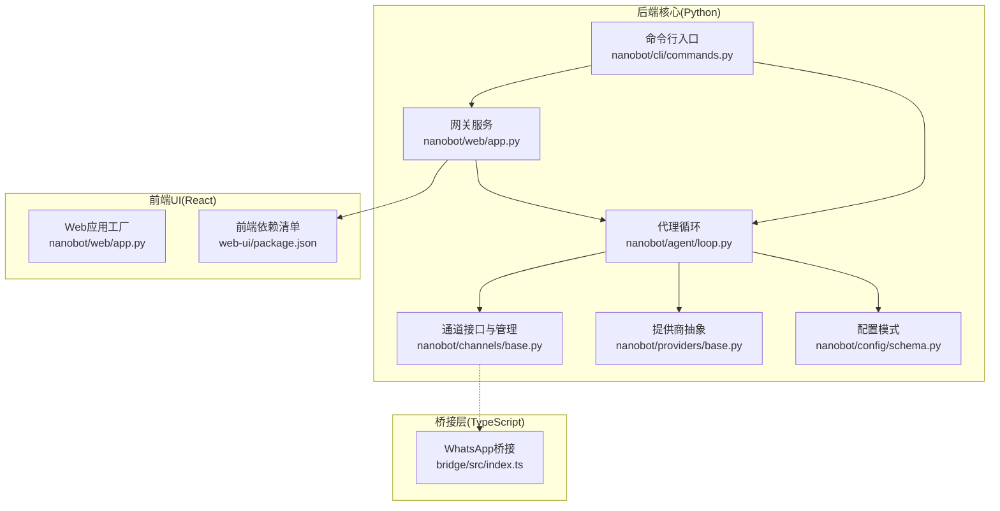
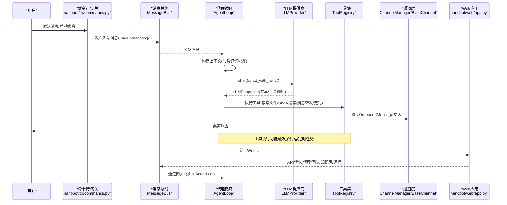
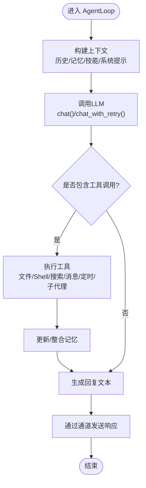
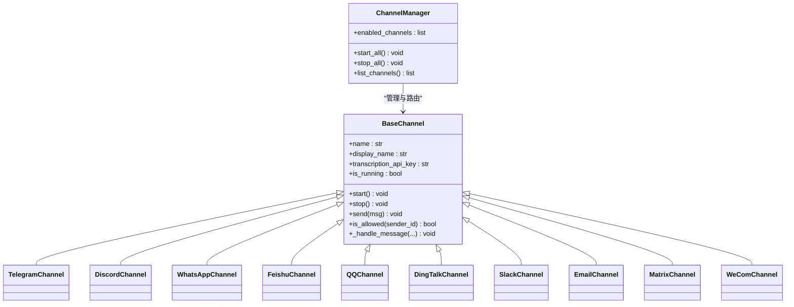
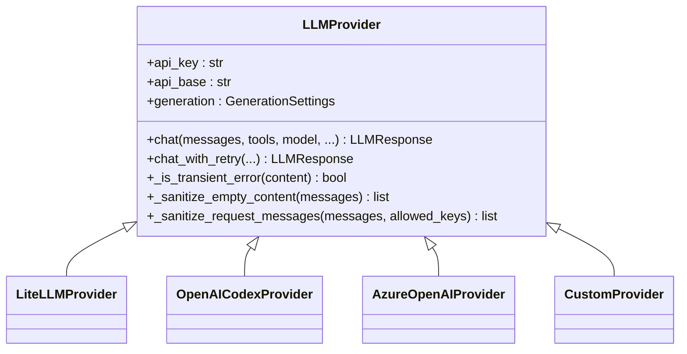
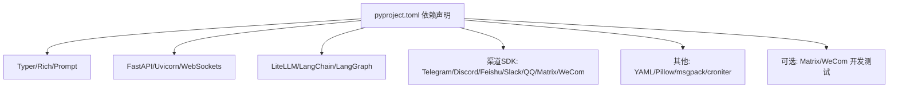

# 项目概述

<cite>
**本文引用的文件**
- [README.md](file://README.md)
- [pyproject.toml](file://pyproject.toml)
- [nanobot/__main__.py](file://nanobot/__main__.py)
- [nanobot/__init__.py](file://nanobot/__init__.py)
- [nanobot/cli/commands.py](file://nanobot/cli/commands.py)
- [nanobot/web/app.py](file://nanobot/web/app.py)
- [nanobot/agent/__init__.py](file://nanobot/agent/__init__.py)
- [nanobot/agent/loop.py](file://nanobot/agent/loop.py)
- [nanobot/channels/__init__.py](file://nanobot/channels/__init__.py)
- [nanobot/channels/base.py](file://nanobot/channels/base.py)
- [nanobot/providers/__init__.py](file://nanobot/providers/__init__.py)
- [nanobot/providers/base.py](file://nanobot/providers/base.py)
- [nanobot/config/schema.py](file://nanobot/config/schema.py)
- [web-ui/package.json](file://web-ui/package.json)
</cite>

## 目录
1. [引言](#引言)
2. [项目结构](#项目结构)
3. [核心组件](#核心组件)
4. [架构总览](#架构总览)
5. [详细组件分析](#详细组件分析)
6. [依赖关系分析](#依赖关系分析)
7. [性能考量](#性能考量)
8. [故障排查指南](#故障排查指南)
9. [结论](#结论)
10. [附录](#附录)

## 引言
Nanobot 是一个“超轻量级”的个人 AI 助手框架，旨在以极小的代码体量提供强大的智能体能力：核心代理代码约 4000 行，相较同类方案减少 99%；同时保持研究友好、易用、高性能与多渠道集成能力。它通过统一的消息总线、可插拔通道、抽象化的 LLM 提供商层以及可扩展的工具与技能系统，实现从命令行交互到 Web 界面管理、从本地模型到云端大模型的无缝衔接。

项目强调：
- 轻量化：核心代理代码体量极小，便于理解、修改与扩展
- 研究友好：清晰的模块边界与数据流，适合教学与实验
- 易用性：一键部署、开箱即用，支持多平台聊天渠道
- 多模态与多渠道：支持 Telegram、Discord、WhatsApp、飞书、QQ、钉钉、Slack、Email、Matrix、WeCom 等
- 可扩展：通过工具、技能、MCP（模型上下文协议）与平台化服务扩展能力

## 项目结构
项目采用“后端 Python 核心 + 前端 React UI + 多渠道桥接”的分层组织方式：
- 后端核心（Python）：命令行入口、网关服务、代理循环、通道管理、提供商抽象、配置与平台化服务
- 前端 UI（React/Vite）：Web 控制台，提供代理、团队、知识库、运行记录、频道绑定等管理界面
- 桥接层（TypeScript）：如 WhatsApp 桥接，负责与外部平台的长连接或扫码登录等

图表来源
- [nanobot/cli/commands.py](file://nanobot/cli/commands.py)
- [nanobot/web/app.py](file://nanobot/web/app.py)
- [nanobot/agent/loop.py](file://nanobot/agent/loop.py)
- [nanobot/channels/base.py](file://nanobot/channels/base.py)
- [nanobot/providers/base.py](file://nanobot/providers/base.py)
- [nanobot/config/schema.py](file://nanobot/config/schema.py)
- [web-ui/package.json](file://web-ui/package.json)
- [bridge/src/index.ts](file://bridge/src/index.ts)

章节来源
- [README.md](file://README.md)
- [pyproject.toml](file://pyproject.toml)
- [nanobot/cli/commands.py](file://nanobot/cli/commands.py)
- [nanobot/web/app.py](file://nanobot/web/app.py)
- [web-ui/package.json](file://web-ui/package.json)

## 核心组件
- 命令行与入口
  - 入口模块与脚本：通过模块入口与命令行脚本启动 CLI/Web 服务
  - CLI 子命令：onboard 初始化、agent 单次/交互式对话、gateway 启动网关、web-ui 启动 Web UI
- 代理循环（AgentLoop）
  - 统一的消息处理循环：接收消息、构建上下文、调用 LLM、执行工具、发送响应
  - 工具注册与子代理管理：文件系统、Shell 执行、网页搜索/抓取、定时任务、消息转发、子代理派生
  - 内存整合与上下文窗口控制：基于令牌数的上下文压缩与记忆合并
- 通道系统（Channels）
  - 抽象通道接口：统一 start/stop/send 生命周期与权限校验
  - 多平台适配：Telegram、Discord、WhatsApp、飞书、QQ、钉钉、Slack、Email、Matrix、WeCom
- 提供商抽象（Providers）
  - 统一的 LLMProvider 接口与 LLMResponse 数据结构
  - 支持重试、空内容清洗、工具调用请求序列化等通用逻辑
- 配置系统（Config）
  - 使用 Pydantic 定义的强类型配置：代理默认参数、提供商、通道、网关、工具（Web/Exec/MCP）、心跳等
  - 自动匹配提供商与默认 API Base，支持环境变量前缀
- Web 应用（FastAPI）
  - 应用工厂与生命周期管理，路由聚合，认证中间件，静态/热更新前端托管
- 前端 UI（React）
  - Ant Design + Vite 构建，覆盖代理、团队、知识库、运行、频道绑定、技能市场等页面

章节来源
- [nanobot/__main__.py](file://nanobot/__main__.py)
- [nanobot/__init__.py](file://nanobot/__init__.py)
- [nanobot/cli/commands.py](file://nanobot/cli/commands.py)
- [nanobot/agent/loop.py](file://nanobot/agent/loop.py)
- [nanobot/channels/base.py](file://nanobot/channels/base.py)
- [nanobot/providers/base.py](file://nanobot/providers/base.py)
- [nanobot/config/schema.py](file://nanobot/config/schema.py)
- [nanobot/web/app.py](file://nanobot/web/app.py)
- [web-ui/package.json](file://web-ui/package.json)

## 架构总览
下图展示从用户输入到响应输出的关键路径，以及 Web UI 与后端服务的协作关系：

图表来源
- [nanobot/cli/commands.py](file://nanobot/cli/commands.py)
- [nanobot/agent/loop.py](file://nanobot/agent/loop.py)
- [nanobot/providers/base.py](file://nanobot/providers/base.py)
- [nanobot/channels/base.py](file://nanobot/channels/base.py)
- [nanobot/web/app.py](file://nanobot/web/app.py)

## 详细组件分析

### 代理循环（AgentLoop）
- 角色与职责
  - 接收来自消息总线的入站消息
  - 构建上下文（历史、记忆、技能、系统提示）
  - 调用 LLM 并解析工具调用
  - 注册并执行工具（文件系统、Shell、网络、消息转发、定时、子代理）
  - 管理会话、内存整合、MCP 连接（按需懒加载）
- 关键流程
  - 输入校验与会话键生成
  - 上下文构建与令牌窗口控制
  - LLM 推理与工具调用解析
  - 工具执行与结果回传
  - 输出标准化与进度提示（根据通道配置）

图表来源
- [nanobot/agent/loop.py](file://nanobot/agent/loop.py)
- [nanobot/providers/base.py](file://nanobot/providers/base.py)

章节来源
- [nanobot/agent/loop.py](file://nanobot/agent/loop.py)

### 通道系统（ChannelManager/BaseChannel）
- 设计要点
  - 统一抽象：所有渠道实现相同接口，支持 start/stop/send
  - 权限控制：allowFrom 列表与通配符策略
  - 音频转写：Groq Whisper 集成（可选）
  - 多平台适配：Telegram、Discord、WhatsApp、飞书、QQ、钉钉、Slack、Email、Matrix、WeCom
- 运行机制
  - ChannelManager 负责启停与路由
  - BaseChannel 将入站消息封装为 InboundMessage 并发布到总线
  - 出站消息由 OutboundMessage 经通道发送

图表来源
- [nanobot/channels/base.py](file://nanobot/channels/base.py)
- [nanobot/channels/__init__.py](file://nanobot/channels/__init__.py)

章节来源
- [nanobot/channels/base.py](file://nanobot/channels/base.py)
- [nanobot/channels/__init__.py](file://nanobot/channels/__init__.py)

### 提供商抽象（LLMProvider）
- 统一接口
  - chat()/chat_with_retry()：支持重试、错误标记、消息清洗
  - LLMResponse：内容、工具调用、完成原因、用量统计、推理内容/思维块
  - GenerationSettings：温度、最大令牌、推理强度等默认参数
- 通用能力
  - 空内容清洗：避免因空字符串导致的 400 错误
  - 请求消息键安全过滤：仅保留提供商允许的字段
  - 工具调用请求序列化：兼容 OpenAI 风格

图表来源
- [nanobot/providers/base.py](file://nanobot/providers/base.py)
- [nanobot/providers/__init__.py](file://nanobot/providers/__init__.py)

章节来源
- [nanobot/providers/base.py](file://nanobot/providers/base.py)
- [nanobot/providers/__init__.py](file://nanobot/providers/__init__.py)

### 配置系统（Pydantic Schema）
- 配置层次
  - AgentsConfig/AgentDefaults：工作空间、模型、温度、上下文窗口、工具迭代上限、推理强度
  - ProvidersConfig：多提供商配置（含自定义、Azure OpenAI、OpenRouter、Anthropic、Groq、Gemini、MiniMax、VolcEngine、DashScope、Moonshot、DeepSeek、Ollama、vLLM、OpenAI Codex、GitHub Copilot）
  - ChannelsConfig：各渠道开关与参数（如 Telegram 的 allowFrom、群组策略；Discord 的 intents；Matrix 的 E2EE、媒体大小限制；Email 的 IMAP/SMTP；WeCom 的 WebSocket；QQ 的 AppID/Secret；飞书的事件订阅；Slack 的 Socket Mode；DingTalk 的 Stream Mode）
  - ToolsConfig：Web 搜索/代理、Shell 执行、工作区限制、MCP 服务器
  - GatewayConfig/HeartbeatConfig：网关主机/端口、心跳间隔
- 自动匹配与默认值
  - 根据模型名自动匹配提供商，支持关键字匹配与本地/网关默认 API Base
  - 环境变量前缀支持（NANOBOT_）

章节来源
- [nanobot/config/schema.py](file://nanobot/config/schema.py)

### Web 应用与前端 UI
- Web 应用（FastAPI）
  - 应用工厂：创建路由、注册中间件、异常处理、生命周期管理
  - 中间件：租户上下文、Web Cookie 认证
  - 前端托管：静态打包或开发热更新
- 前端 UI（React）
  - 页面覆盖：代理、团队、知识库、运行、频道绑定、技能市场、日程、操作、设置等
  - 依赖：Ant Design、Framer Motion、React Router、Remark/GFM 等

章节来源
- [nanobot/web/app.py](file://nanobot/web/app.py)
- [web-ui/package.json](file://web-ui/package.json)

## 依赖关系分析
- 后端依赖（关键库）
  - CLI 与终端：Typer、prompt-toolkit、Rich
  - Web 服务：FastAPI、Uvicorn、WebSockets、websocket-client
  - 通信与渠道：python-telegram-bot、lark-oapi、slack-sdk、qq-botpy、matrix-nio、websockets
  - LLM 与工具：LiteLLM、LangChain/LangGraph、tiktoken、openai
  - 其他：croniter、PyYAML、Pillow、msgpack、oauth-cli-kit、loguru、readability-lxml
- 可选依赖
  - WeCom：wecom-aibot-sdk-python
  - Matrix：e2e 加解密与渲染
  - 开发测试：pytest、ruff、Playwright、Vitest

图表来源
- [pyproject.toml](file://pyproject.toml)

章节来源
- [pyproject.toml](file://pyproject.toml)

## 性能考量
- 轻量化设计
  - 核心代理代码量极小，启动快、资源占用低
- 上下文窗口与令牌控制
  - 通过上下文窗口令牌数限制与记忆整合器，避免上下文溢出
- 工具执行与 I/O
  - Shell 执行超时、工作区限制、网络代理与搜索缓存可降低延迟与资源消耗
- 并发与异步
  - 代理循环、通道、定时任务均采用异步并发，提升吞吐
- 前端体验
  - Vite 热更新开发模式与静态打包生产模式，兼顾开发效率与运行性能

## 故障排查指南
- 常见问题定位
  - 提供商未配置或 API Key 缺失：检查 providers.* 配置与环境变量
  - 渠道未启用或权限不足：确认 channels.*.enabled 与 allowFrom 列表
  - 心跳/定时任务未触发：检查 gateway.heartbeat 与 cron 服务状态
  - MCP 连接失败：查看 MCP 服务器命令/URL/认证头配置
- 日志与调试
  - CLI 支持 --logs 输出运行时日志
  - Web UI 提供健康检查与认证中间件，返回明确的错误码与消息
- 版本与升级
  - 使用 uv 或 pip 安装最新版本，必要时重建 WhatsApp 桥接目录

章节来源
- [nanobot/cli/commands.py](file://nanobot/cli/commands.py)
- [nanobot/web/app.py](file://nanobot/web/app.py)
- [nanobot/config/schema.py](file://nanobot/config/schema.py)

## 结论
Nanobot 以“超轻量、研究友好、易用、高性能、多渠道”为核心理念，通过清晰的模块化设计与抽象层，实现了从命令行到 Web 管理、从本地到云端的全栈能力。其简洁的代码体量与强大的扩展性，使其既适合初学者快速上手，也适合研究者深入定制与二次开发。随着多渠道与平台化能力的持续演进，Nanobot 正逐步成为个人与小团队的智能体基础设施首选。

## 附录
- 快速开始
  - 初始化：nanobot onboard
  - 配置 API Key 与模型
  - 交互式对话：nanobot agent
  - 启动网关：nanobot gateway
  - 启动 Web UI：nanobot web-ui
- 多渠道接入
  - Telegram、Discord、WhatsApp、飞书、QQ、钉钉、Slack、Email、Matrix、WeCom 均有详细配置说明与示例
- 社区与生态
  - 技能市场（SkillHub）支持远程安装与兼容性提示
  - 定期发布与新闻动态，涵盖稳定性修复与新功能

章节来源
- [README.md](file://README.md)
- [nanobot/cli/commands.py](file://nanobot/cli/commands.py)
- [nanobot/web/app.py](file://nanobot/web/app.py)