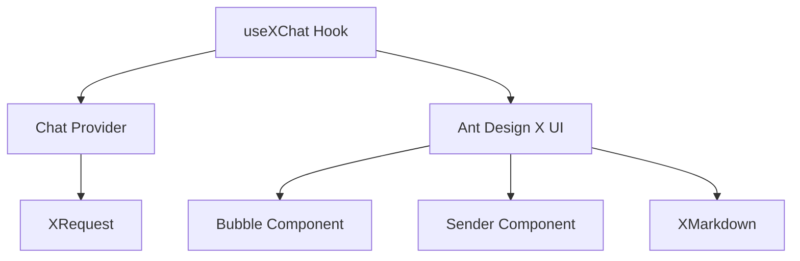

<oneliner>
使用 Ant Design X 构建专业的 AI 对话应用。涵盖 useXChat Hook、自定义 Chat Provider、XRequest 网络请求和 Markdown 流式渲染。
</oneliner>

# 🎯 Skill 定位

本技能专为 **Ant Design X** 打造，帮助快速开发 AI 对话应用。

## 核心模块

| 模块 | 功能定位 | 使用场景 |
| --- | --- | --- |
| **use-x-chat** | React Hook | 管理对话状态、消息流、请求控制 |
| **x-chat-provider** | 数据适配器 | 适配任意接口到 Ant Design X 标准格式 |
| **x-request** | 请求工具 | 统一网络请求、认证、流式处理 |
| **x-markdown** | 渲染器 | Markdown 解析、流式渲染、自定义组件 |

## 🏗️ 技术栈架构



| 层级 | 包名 | 核心职责 |
| --- | --- | --- |
| **UI 层** | `@ant-design/x` | React UI 组件库，构建聊天界面 |
| **逻辑层** | `@ant-design/x-sdk` | 开发工具包，数据流管理、Provider、Hook |
| **渲染层** | `@ant-design/x-markdown` | Markdown 渲染器，内容展示 |

# 📦 依赖安装

```bash
# 安装核心依赖
npm install @ant-design/x @ant-design/x-sdk @ant-design/x-markdown

# 版本要求
# @ant-design/x-sdk: ≥2.2.2
```

# 🚀 快速开始

## 完整示例：三步集成

### Step 1: 准备 Provider

```ts
import { MyChatProvider } from './MyChatProvider';
import { XRequest } from '@ant-design/x-sdk';

const provider = new MyChatProvider({
  request: XRequest('https://your-api.com/chat'),
  requestPlaceholder: {
    content: '思考中...',
    role: 'assistant',
    timestamp: Date.now(),
  },
  requestFallback: (_, { error, errorInfo, messageInfo }) => {
    if (error.name === 'AbortError') {
      return {
        content: messageInfo?.message?.content || '回复已取消',
        role: 'assistant' as const,
        timestamp: Date.now(),
      };
    }
    return {
      content: errorInfo?.error?.message || '网络错误，请稍后重试',
      role: 'assistant' as const,
      timestamp: Date.now(),
    };
  },
});
```

### Step 2: 使用 useXChat Hook

```tsx
import { useXChat } from '@ant-design/x-sdk';

const ChatComponent = () => {
  const { messages, onRequest, isRequesting } = useXChat({ provider });

  return (
    <div>
      {messages.map((msg) => (
        <div key={msg.id}>
          {msg.message.role}: {msg.message.content}
        </div>
      ))}
      <button onClick={() => onRequest({ query: 'Hello' })}>发送</button>
    </div>
  );
};
```

### Step 3: 集成 UI 组件

```tsx
import { Bubble, Sender } from '@ant-design/x';

const ChatUI = () => {
  const { messages, onRequest, isRequesting, abort } = useXChat({ provider });

  return (
    <div style={{ height: 600 }}>
      <Bubble.List items={messages} />
      <Sender
        loading={isRequesting}
        onSubmit={(content) => onRequest({ query: content })}
        onCancel={abort}
      />
    </div>
  );
};
```

# 🔧 use-x-chat 详解

详细文档参考 [USE-X-CHAT.md](reference/USE-X-CHAT.md)

## 核心 API

### XChatConfig 配置

| 属性 | 说明 | 类型 |
| --- | --- | --- |
| provider | 数据提供者 | AbstractChatProvider |
| conversationKey | 会话唯一标识 | string |
| defaultMessages | 默认显示消息 | MessageInfo[] |
| parser | 消息转换器 | (message) => BubbleMessage |
| requestFallback | 请求失败回退消息 | ChatMessage \| Function |
| requestPlaceholder | 请求中占位消息 | ChatMessage \| Function |

### 返回值

| 属性 | 说明 | 类型 |
| --- | --- | --- |
| messages | 当前消息列表 | MessageInfo[] |
| isRequesting | 是否请求中 | boolean |
| onRequest | 发送消息 | (params) => void |
| abort | 取消请求 | () => void |
| onReload | 重新生成 | (id, params) => void |
| setMessages | 设置消息 | (messages) => void |

### MessageInfo 数据结构

```ts
interface MessageInfo<Message> {
  id: number | string;      // 消息唯一标识
  message: Message;         // 实际消息内容
  status: MessageStatus;    // 发送状态
  extraInfo?: AnyObject;    // 扩展信息
}

type MessageStatus = 'local' | 'loading' | 'updating' | 'success' | 'error' | 'abort';
```

# 🔄 x-chat-provider 详解

详细文档参考 [X-CHAT-PROVIDER.md](reference/X-CHAT-PROVIDER.md)

## 自定义 Provider 模板

```ts
import { AbstractChatProvider } from '@ant-design/x-sdk';

interface MyInput {
  query: string;
  context?: string;
  model?: string;
  stream?: boolean;
}

interface MyOutput {
  content: string;
  finish_reason?: string;
}

interface MyMessage {
  content: string;
  role: 'user' | 'assistant';
  timestamp: number;
}

export class MyChatProvider extends AbstractChatProvider<MyMessage, MyInput, MyOutput> {
  // 参数转换：将 useXChat 参数转换为你的 API 参数
  transformParams(requestParams: Partial<MyInput>, options): MyInput {
    return {
      query: requestParams.query || '',
      context: requestParams.context,
      model: 'gpt-3.5-turbo',
      stream: true,
      ...(options?.params || {}),
    };
  }

  // 本地消息：用户发送的消息格式
  transformLocalMessage(requestParams: Partial<MyInput>): MyMessage {
    return {
      content: requestParams.query || '',
      role: 'user',
      timestamp: Date.now(),
    };
  }

  // 响应数据转换
  transformMessage(info: { originMessage: MyMessage; chunk: MyOutput }): MyMessage {
    const { originMessage, chunk } = info;
    
    if (!chunk?.content || chunk.content === '[DONE]') {
      return { ...originMessage, status: 'success' as const };
    }

    return {
      ...originMessage,
      content: `${originMessage.content || ''}${chunk.content || ''}`,
      role: 'assistant' as const,
      status: 'loading' as const,
    };
  }
}
```

# 🌐 x-request 详解

详细文档参考 [X-REQUEST.md](reference/X-REQUEST.md)

## 基础配置

```typescript
import { XRequest } from '@ant-design/x-sdk';

// 最简配置：只需提供 API URL
const request = XRequest('https://api.example.com/chat');

// Provider 场景使用
const providerRequest = XRequest('https://api.example.com/chat', {
  manual: true,  // Provider 场景需设为 true
});
```

## 安全配置

| 运行环境 | 安全级别 | 配置方式 |
| --- | --- | --- |
| **浏览器前端** | 🔴 高风险 | ❌ 禁止配置密钥 |
| **Node.js 后端** | 🟢 安全 | ✅ 环境变量配置 |
| **代理服务** | 🟢 安全 | ✅ 同源代理转发 |

```typescript
// ✅ 前端安全配置：使用代理服务
const safeRequest = XRequest('/api/proxy/openai', {
  params: { model: 'gpt-3.5-turbo', stream: true },
  manual: true,
});

// ✅ Node.js 安全配置
const nodeRequest = XRequest('https://api.openai.com/v1/chat', {
  headers: {
    Authorization: `Bearer ${process.env.OPENAI_API_KEY}`,
  },
});
```

# 📝 x-markdown 详解

详细文档参考 [X-MARKDOWN.md](reference/X-MARKDOWN.md)

## 基础使用

```tsx
import { XMarkdown } from '@ant-design/x-markdown';

export default () => <XMarkdown content="# Hello World" />;
```

## 流式渲染

```tsx
import { XMarkdown } from '@ant-design/x-markdown';

const StreamingMarkdown = ({ content, isStreaming }) => (
  <XMarkdown
    content={content}
    streaming={{
      hasNextChunk: isStreaming,  // 最后一块时设为 false
    }}
  />
);
```

## 自定义组件映射

```tsx
const components = {
  code: ({ children, className }) => (
    <CodeBlock language={className?.replace('language-', '')}>{children}</CodeBlock>
  ),
  img: ({ src, alt }) => <ZoomableImage src={src} alt={alt} />,
};

<XMarkdown content={content} components={components} />
```

# 📋 完整示例项目

## 带会话管理的聊天应用

```tsx
import React, { useRef, useState } from 'react';
import { useXChat } from '@ant-design/x-sdk';
import { Bubble, Sender, Conversations } from '@ant-design/x';

const App = () => {
  const [conversations, setConversations] = useState([
    { key: '1', label: '新对话' }
  ]);
  const [activeKey, setActiveKey] = useState('1');
  const senderRef = useRef(null);

  const { messages, onRequest, isRequesting, abort } = useXChat({
    provider: chatProvider,
    conversationKey: activeKey,
    requestFallback: (_, { error }) => {
      if (error.name === 'AbortError') {
        return { content: '已取消', role: 'assistant', timestamp: Date.now() };
      }
      return { content: '请求失败', role: 'assistant', timestamp: Date.now() };
    },
  });

  return (
    <div style={{ display: 'flex', height: '100vh' }}>
      {/* 会话列表 */}
      <Conversations
        items={conversations}
        activeKey={activeKey}
        onActiveChange={setActiveKey}
      />
      
      {/* 聊天区域 */}
      <div style={{ flex: 1, display: 'flex', flexDirection: 'column' }}>
        <Bubble.List
          role={{
            assistant: { placement: 'start' },
            user: { placement: 'end' },
          }}
          items={messages.map(msg => ({
            key: msg.id,
            content: msg.message.content,
            role: msg.message.role,
            loading: msg.status === 'loading',
          }))}
        />
        <Sender
          loading={isRequesting}
          ref={senderRef}
          onSubmit={(content) => {
            onRequest({ query: content });
            senderRef.current?.clear?.();
          }}
          onCancel={abort}
        />
      </div>
    </div>
  );
};
```

# 🚨 开发规范

## 必须遵守的规则

- ✅ **正确导入**: UI 组件从 `@ant-design/x`，逻辑从 `@ant-design/x-sdk`
- ✅ **类型安全**: 使用 TypeScript 严格模式
- ✅ **禁止在前端配置密钥**: 使用代理服务
- ✅ **稳定的 components 对象**: 不要在每次渲染时创建新的内联组件映射

## 测试用例规则

- 如果用户没有明确需要测试用例，不要添加测试文件
- 只有在用户明确要求时才创建测试用例

## 代码质量规则

- 完成后必须检查类型：运行 `tsc --noEmit` 确保无类型错误
- 保持代码整洁：删除所有未使用的变量和导入

# 🔗 参考资源

## 官方文档

- [useXChat 官方文档](https://github.com/ant-design/x/blob/main/packages/x/docs/x-sdk/use-x-chat.en-US.md)
- [XRequest 官方文档](https://github.com/ant-design/x/blob/main/packages/x/docs/x-sdk/x-request.en-US.md)
- [Chat Provider 官方文档](https://github.com/ant-design/x/blob/main/packages/x/docs/x-sdk/chat-provider.en-US.md)
- [XMarkdown 官方文档](https://github.com/ant-design/x/blob/main/packages/x/docs/x-markdown/introduce.en-US.md)

## 详细参考

- [USE-X-CHAT.md](reference/USE-X-CHAT.md) - useXChat 完整 API 参考
- [X-CHAT-PROVIDER.md](reference/X-CHAT-PROVIDER.md) - 自定义 Provider 实现指南
- [X-REQUEST.md](reference/X-REQUEST.md) - XRequest 配置详解
- [X-MARKDOWN.md](reference/X-MARKDOWN.md) - Markdown 渲染指南
