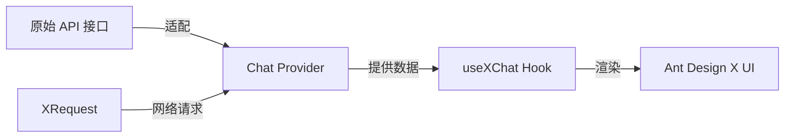
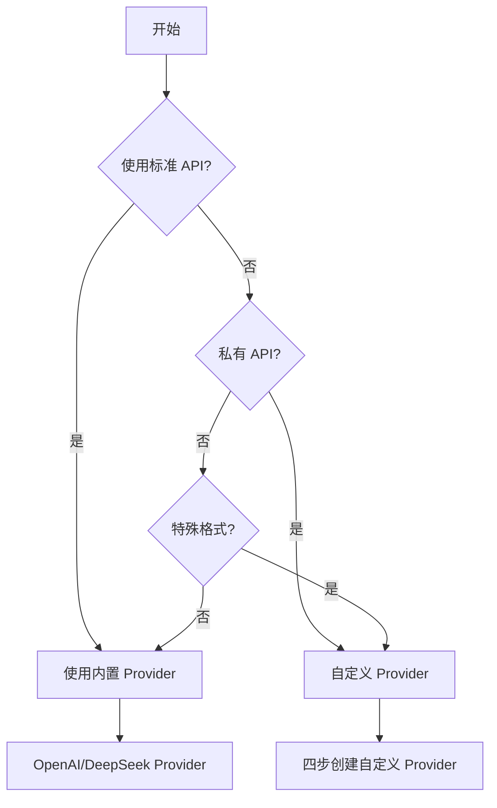
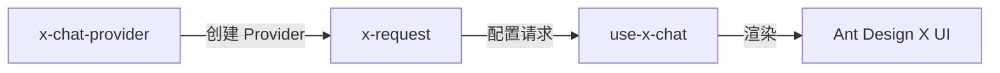

# x-chat-provider 完整参考文档

## Skill 定位

**专注解决一个问题**: 如何快速将你的流式接口适配到 Ant Design X 的 Chat Provider。

## 技术栈架构



| 概念 | 角色定位 | 核心职责 | 使用场景 |
| --- | --- | --- | --- |
| **Chat Provider** | 🔄 数据适配器 | 将任意接口格式转换为 Ant Design X 标准格式 | 私有 API 适配、格式转换 |
| **useXChat** | ⚛️ React Hook | 管理对话状态、消息流、请求控制 | 构建 AI 对话界面 |
| **XRequest** | 🌐 请求工具 | 处理所有网络通信、认证、错误处理 | 统一请求管理 |

## Provider 选择决策树



## 内置 Provider

| Provider 类型 | 适用场景 | 使用方式 |
| --- | --- | --- |
| **OpenAI Provider** | 标准 OpenAI API | 直接导入使用 |
| **DeepSeek Provider** | 标准 DeepSeek API | 直接导入使用 |

## 四步实现自定义 Provider

### Step 1: 分析接口格式 ⏱️ 2分钟

#### 接口信息收集表

| 信息类型 | 示例值 | 你的接口 |
| --- | --- | --- |
| **接口 URL** | `https://your-api.com/chat` | `_____________` |
| **请求方式** | POST | `_____________` |
| **请求格式** | JSON | `_____________` |
| **响应格式** | Server-Sent Events | `_____________` |
| **认证方式** | Bearer Token | `_____________` |

#### 请求格式示例

```ts
// 你的实际请求格式
interface MyAPIRequest {
  query: string;           // 用户问题
  context?: string;        // 对话历史（可选）
  model?: string;          // 模型选择（可选）
  stream?: boolean;        // 是否流式（可选）
}
```

#### 响应格式示例

```ts
// 流式响应格式
// 实际响应: data: {"content": "回答内容"}
interface MyAPIResponse {
  content: string;          // 回答片段
  finish_reason?: string;   // 结束标记
}

// 结束标记: data: [DONE]
```

### Step 2: 创建 Provider 类 ⏱️ 5分钟

```ts
// MyChatProvider.ts
import { AbstractChatProvider } from '@ant-design/x-sdk';
import type { XRequestOptions } from '@ant-design/x-sdk';

// ====== 第1处修改: 定义你的接口类型 ======
interface MyInput {
  query: string;
  context?: string;
  model?: string;
  stream?: boolean;
}

interface MyOutput {
  content: string;
  finish_reason?: string;
}

interface MyMessage {
  content: string;
  role: 'user' | 'assistant';
  timestamp: number;
}

// ====== 第2处修改: 修改类名 ======
export class MyChatProvider extends AbstractChatProvider<MyMessage, MyInput, MyOutput> {
  // 参数转换：将 useXChat 参数转换为你的 API 参数
  transformParams(
    requestParams: Partial<MyInput>,
    options: XRequestOptions<MyInput, MyOutput, MyMessage>,
  ): MyInput {
    if (typeof requestParams !== 'object') {
      throw new Error('requestParams must be an object');
    }

    return {
      query: requestParams.query || '',
      context: requestParams.context,
      model: 'gpt-3.5-turbo',  // 根据你的 API 调整
      stream: true,
      ...(options?.params || {}),
    };
  }

  // 本地消息：用户发送的消息格式
  transformLocalMessage(requestParams: Partial<MyInput>): MyMessage {
    return {
      content: requestParams.query || '',
      role: 'user',
      timestamp: Date.now(),
    };
  }

  // ====== 第3处修改: 响应数据转换 ======
  transformMessage(info: { originMessage: MyMessage; chunk: MyOutput }): MyMessage {
    const { originMessage, chunk } = info;

    // 处理结束标记
    if (!chunk?.content || chunk.content === '[DONE]') {
      return { ...originMessage, status: 'success' as const };
    }

    // 累积响应内容
    return {
      ...originMessage,
      content: `${originMessage.content || ''}${chunk.content || ''}`,
      role: 'assistant' as const,
      status: 'loading' as const,
    };
  }
}
```

### Step 3: 检查验证 ⏱️ 1分钟

#### 快速检查清单

| 检查项 | 状态 | 说明 |
| --- | --- | --- |
| **类名正确** | ⏳ | `MyChatProvider` → 你的类名 |
| **类型匹配** | ⏳ | 输入/输出类型与 API 一致 |
| **转换逻辑** | ⏳ | transformMessage 正确处理流式数据 |
| **无 request 方法** | ⏳ | 网络请求由 XRequest 处理 |

### Step 4: 使用 Provider ⏱️ 1分钟

```tsx
import { MyChatProvider } from './MyChatProvider';
import { XRequest } from '@ant-design/x-sdk';
import { useXChat } from '@ant-design/x-sdk';

// 创建 Provider 实例
const provider = new MyChatProvider({
  request: XRequest('https://your-api.com/chat', { manual: true }),
});

// 在组件中使用
const ChatComponent = () => {
  const { messages, onRequest } = useXChat({ provider });
  
  return (
    <div>
      {messages.map(msg => (
        <div key={msg.id}>{msg.message.content}</div>
      ))}
      <button onClick={() => onRequest({ query: 'Hello' })}>发送</button>
    </div>
  );
};
```

## 常见场景适配

### OpenAI 兼容格式

```ts
interface OpenAIInput {
  messages: Array<{ role: string; content: string }>;
  model: string;
  stream: boolean;
}

interface OpenAIOutput {
  choices: Array<{
    delta: { content?: string };
    finish_reason?: string;
  }>;
}

export class OpenAICompatProvider extends AbstractChatProvider<MyMessage, OpenAIInput, OpenAIOutput> {
  transformParams(requestParams: Partial<{ query: string }>): OpenAIInput {
    return {
      messages: [{ role: 'user', content: requestParams.query || '' }],
      model: 'gpt-3.5-turbo',
      stream: true,
    };
  }

  transformLocalMessage(requestParams: Partial<{ query: string }>): MyMessage {
    return {
      content: requestParams.query || '',
      role: 'user',
      timestamp: Date.now(),
    };
  }

  transformMessage(info: { originMessage: MyMessage; chunk: OpenAIOutput }): MyMessage {
    const { originMessage, chunk } = info;
    const delta = chunk?.choices?.[0]?.delta;
    const finishReason = chunk?.choices?.[0]?.finish_reason;

    if (finishReason === 'stop' || !delta?.content) {
      return { ...originMessage, status: 'success' as const };
    }

    return {
      ...originMessage,
      content: `${originMessage.content || ''}${delta.content}`,
      role: 'assistant' as const,
      status: 'loading' as const,
    };
  }
}
```

### SSE 格式处理

```ts
// SSE 响应格式: data: {"text": "内容"}
interface SSEOutput {
  text: string;
  done?: boolean;
}

transformMessage(info: { originMessage: MyMessage; chunk: SSEOutput }): MyMessage {
  const { originMessage, chunk } = info;

  if (chunk?.done || !chunk?.text) {
    return { ...originMessage, status: 'success' as const };
  }

  return {
    ...originMessage,
    content: `${originMessage.content || ''}${chunk.text}`,
    role: 'assistant' as const,
    status: 'loading' as const,
  };
}
```

## 开发注意事项

### ⚠️ 强制规则：禁止编写 request 方法

- ✅ 只修改 3 处：接口类型、类名、响应转换逻辑
- ✅ 禁止实现 request 方法：网络请求由 XRequest 处理
- ✅ 保持类型安全：使用 TypeScript 严格模式

### 快速检查清单

| 检查项 | 状态 | 说明 |
| --- | --- | --- |
| **正确类名** | ⏳ | 使用有意义的类名 |
| **类型匹配** | ⏳ | Input/Output 类型与 API 一致 |
| **无 request 方法** | ⏳ | 网络请求由 XRequest 处理 |
| **正确导入** | ⏳ | 从 `@ant-design/x-sdk` 导入 |

## 技能协作

### 场景1: 完整 AI 对话应用



### 场景2: 仅创建 Provider

```ts
// 仅使用 x-chat-provider + x-request
import { MyChatProvider } from './MyChatProvider';
import { XRequest } from '@ant-design/x-sdk';

const provider = new MyChatProvider({
  request: XRequest('https://your-api.com/chat', { manual: true }),
});

// 后续可在任意地方使用这个 provider
export { provider };
```

### 场景3: 使用内置 Provider

```ts
// 直接使用内置的 OpenAI Provider
import { OpenAIChatProvider } from '@ant-design/x-sdk';
import { XRequest } from '@ant-design/x-sdk';

const provider = new OpenAIChatProvider({
  request: XRequest('/api/proxy/openai', { manual: true }),
});
```
