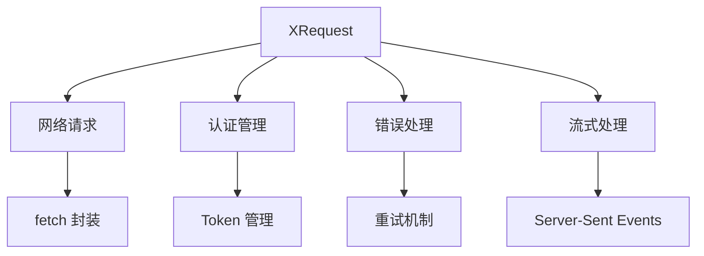
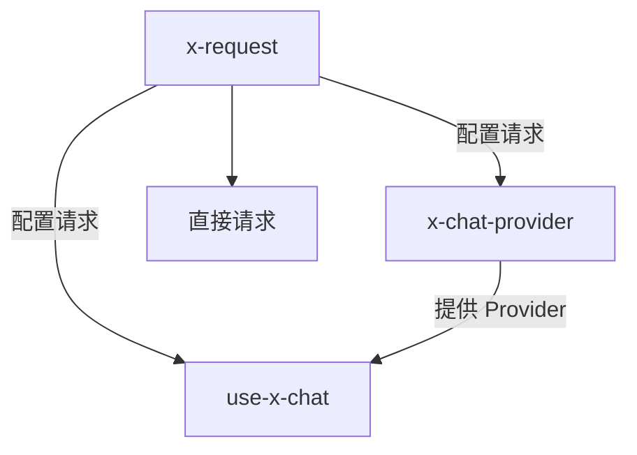

# x-request 完整参考文档

## Skill 定位

**专注解决**: 如何正确配置 XRequest 以适应各种流式接口需求。

## 技术栈架构



| 概念 | 角色定位 | 核心职责 | 使用场景 |
| --- | --- | --- | --- |
| **XRequest** | 🌐 请求工具 | 处理所有网络通信、认证、错误处理 | 统一请求管理 |
| **全局配置** | ⚙️ 配置中心 | 配置一次，处处使用 | 减少重复代码 |
| **流式配置** | 🔄 流式处理 | 支持 SSE 和 JSON 响应格式 | AI 对话场景 |

## 快速开始

### 依赖安装

```bash
# 推荐使用 tnpm
tnpm install @ant-design/x-sdk

# 或使用 npm
npm add @ant-design/x-sdk

# 检查版本
npm ls @ant-design/x-sdk
```

### 基础配置

```typescript
import { XRequest } from '@ant-design/x-sdk';

// 最简配置：只需提供 API URL
const request = XRequest('https://api.example.com/chat');

// Provider 场景使用（需要手动控制）
const providerRequest = XRequest('https://api.example.com/chat', {
  manual: true,  // 通常只需要显式配置这个
});
```

> 💡 **提示**: XRequest 内置了合理的默认配置，大多数情况下只需提供 API URL 即可使用。

## 核心配置详解

### 1. 全局配置

```typescript
import { XRequest } from '@ant-design/x-sdk';

// 全局配置（Node.js 环境）
const globalConfig = {
  headers: {
    'Content-Type': 'application/json',
    Authorization: `Bearer ${process.env.API_KEY}`,
  },
  timeout: 30000,
};

const request = XRequest('https://api.example.com/chat', globalConfig);
```

### 2. 安全配置

#### 不同环境的安全策略

| 运行环境 | 安全级别 | 配置方式 | 风险说明 |
| --- | --- | --- | --- |
| **浏览器前端** | 🔴 高风险 | ❌ 禁止密钥配置 | 密钥会直接暴露给用户 |
| **Node.js 后端** | 🟢 安全 | ✅ 环境变量配置 | 密钥存储在服务器端 |
| **代理服务** | 🟢 安全 | ✅ 同源代理转发 | 密钥由代理服务管理 |

#### 认证方式对比

| 认证方式 | 适用环境 | 配置示例 | 安全性 |
| --- | --- | --- | --- |
| **Bearer Token** | Node.js | `Bearer ${process.env.API_KEY}` | ✅ 安全 |
| **API Key Header** | Node.js | `X-API-Key: ${process.env.KEY}` | ✅ 安全 |
| **代理转发** | 浏览器 | `/api/proxy/service` | ✅ 安全 |
| **直接配置** | 浏览器 | `Bearer sk-xxx` | ❌ 危险 |

### 3. 流式配置

```typescript
import { XRequest } from '@ant-design/x-sdk';

// SSE 流式配置
const streamRequest = XRequest('https://api.example.com/chat', {
  params: {
    stream: true,
  },
  manual: true,
});
```

## 安全指南

### 环境安全配置

#### 🔐 前端安全配置

```typescript
// ✅ 正确配置（安全）: 使用代理服务
const safeRequest = XRequest('/api/proxy/openai', {
  params: {
    model: 'gpt-3.5-turbo',
    stream: true,
  },
  manual: true,
});
```

#### ❌ 危险配置示例

```typescript
// ❌ 极其危险: 密钥会直接暴露给浏览器
const unsafeRequest = XRequest('https://api.openai.com/v1/chat/completions', {
  headers: {
    Authorization: 'Bearer sk-xxxxxxxxxxxxxx',  // ❌ 危险!
  },
  manual: true,
});
```

#### ✅ Node.js 安全配置

```typescript
// Node.js 安全配置
const nodeRequest = XRequest('https://api.openai.com/v1/chat/completions', {
  headers: {
    Authorization: `Bearer ${process.env.OPENAI_API_KEY}`,
  },
});
```

### 安全检查工具

```typescript
// 安全配置验证函数
const validateSecurity = (config: any) => {
  const isBrowser = typeof window !== 'undefined';
  const hasAuth = config.headers?.Authorization || config.headers?.authorization;

  if (isBrowser && hasAuth) {
    throw new Error(
      '❌ 前端环境禁止配置 Authorization，存在密钥泄露风险！'
    );
  }

  console.log('✅ 安全配置检查通过');
  return true;
};

// 使用示例
validateSecurity({
  headers: {
    // 不包含 Authorization
  },
});
```

## 调试和测试

### 调试配置

#### Node.js 调试配置

```typescript
// 安全的调试配置（Node.js 环境）
const debugRequest = XRequest('https://your-api.com/chat', {
  headers: {
    Authorization: `Bearer ${process.env.DEBUG_API_KEY}`,
  },
  params: { query: 'test message' },
});
```

#### 前端调试配置

```typescript
// 安全的调试配置（前端环境）
const debugRequest = XRequest('/api/debug/chat', {
  params: { query: 'test message' },
});
```

### 配置验证

```typescript
// 检查配置后再运行
const checkConfig = () => {
  const checks = [
    {
      name: '全局配置',
      test: () => {
        // 检查是否已设置全局配置
        return true;  // 根据实际情况检查
      },
    },
    {
      name: '安全配置',
      test: () => validateSecurity(globalConfig),
    },
    {
      name: '类型检查',
      test: () => {
        // 运行 tsc --noEmit
        return true;
      },
    },
  ];

  checks.forEach((check) => {
    console.log(`${check.name}: ${check.test() ? '✅' : '❌'}`);
  });
};
```

## 使用场景

### 独立使用

```typescript
import { XRequest } from '@ant-design/x-sdk';

// 测试接口可用性
const testRequest = XRequest('https://httpbin.org/post', {
  params: { test: 'data' },
});

// 立即发送请求
const response = await testRequest();
console.log(response);
```

### 与其他技能集成



| 使用方式 | 配合技能 | 用途 | 示例 |
| --- | --- | --- | --- |
| **独立使用** | 无 | 直接发起网络请求 | 测试接口可用性 |
| **配合 x-chat-provider** | x-chat-provider | 为自定义 Provider 配置请求 | 配置私有 API |
| **配合 use-x-chat** | use-x-chat | 为内置 Provider 配置请求 | 配置 OpenAI API |
| **完整 AI 应用** | x-request → x-chat-provider → use-x-chat | 为整个系统配置请求 | 完整 AI 对话应用 |

## 配置检查清单

### ✅ 使用前确认

| 检查项 | 状态 | 说明 |
| --- | --- | --- |
| **API URL** | ✅ 必须配置 | `XRequest('https://api.xxx.com')` |
| **认证信息** | ⚠️ 环境相关 | 前端❌禁止，Node.js✅可用 |
| **manual 配置** | ✅ Provider 场景 | Provider 中需设为 `true` |
| **其他配置** | ❌ 无需配置 | 内置合理默认值 |
| **接口可用性** | ✅ 建议测试 | 使用调试配置验证 |

## 完整示例

### 与 Provider 集成

```typescript
import { XRequest } from '@ant-design/x-sdk';
import { MyChatProvider } from './MyChatProvider';

// 创建配置好的请求
const chatRequest = XRequest('https://your-api.com/chat', {
  headers: {
    'Content-Type': 'application/json',
  },
  params: {
    model: 'gpt-3.5-turbo',
    stream: true,
  },
  manual: true,  // Provider 场景必须设为 true
});

// 创建 Provider
const provider = new MyChatProvider({
  request: chatRequest,
});

export { provider };
```

### 代理服务配置

```typescript
// 前端通过代理服务调用 API
const proxyRequest = XRequest('/api/chat', {
  params: {
    model: 'gpt-3.5-turbo',
    stream: true,
  },
  manual: true,
});

// 后端代理服务示例 (Express)
app.post('/api/chat', async (req, res) => {
  const response = await fetch('https://api.openai.com/v1/chat/completions', {
    method: 'POST',
    headers: {
      'Content-Type': 'application/json',
      Authorization: `Bearer ${process.env.OPENAI_API_KEY}`,
    },
    body: JSON.stringify(req.body),
  });
  
  // 转发流式响应
  response.body.pipe(res);
});
```
