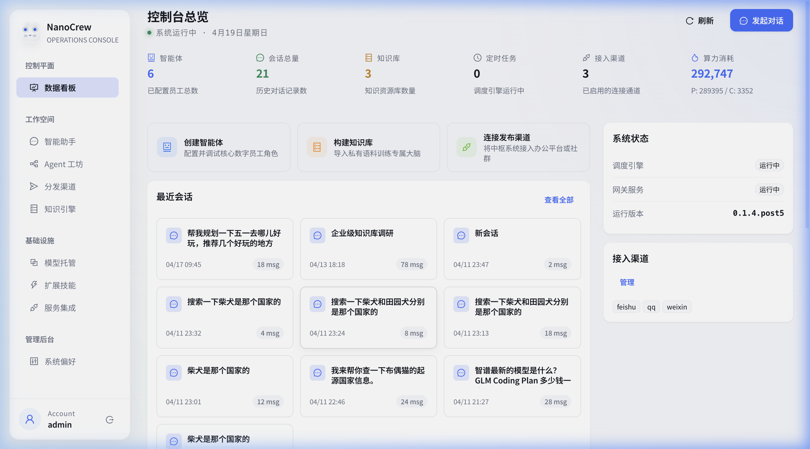
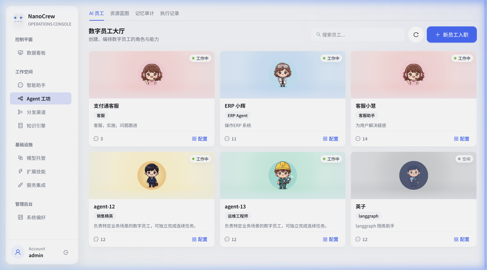
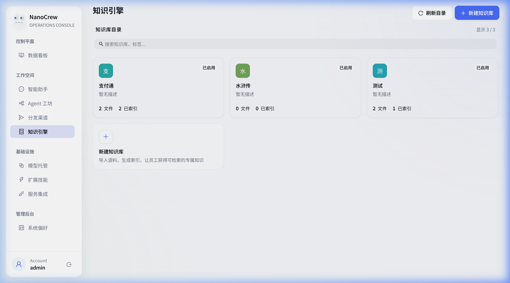
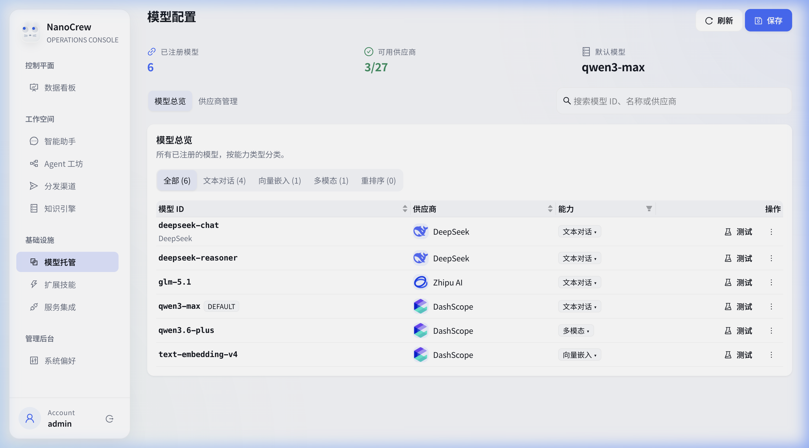

<div align="center">
  
  <h1>Nanobot | 多智能体管理面板</h1>
  <p>
    
    
  </p>
</div>

## 🙏 Acknowledgements / 致谢

This project is a secondary development based on [HKUDS/nanobot](https://github.com/HKUDS/nanobot). We sincerely thank the original author and the HKUDS team for their incredible work on the `nanobot` ultra-lightweight personal AI agent framework.

本项目基于 [HKUDS/nanobot](https://github.com/HKUDS/nanobot) 进行了二次开发。我们由衷感谢原作者及 HKUDS 团队提供的开源且轻量级的 `nanobot` 框架。本次二次开发在原有架构思路上，重构了多智能体管理面板，实现了 “Tech Luxury” 风格的现代化 UI，并优化了核心控制逻辑。

## ✨ Features / 核心功能

我们对 Nanobot 进行了深度的定制化与二次开发，着重强化了多智能体管理与控制面板的用户体验，引入了全新的 **Tech Luxury** 语言设计。

<table align="center">
  <tr align="center">
    <th><p align="center">🎛️ 现代化监控仪表盘 (Dashboard)</p></th>
    <th><p align="center">🤖 智能体工坊 (Agent Workshop)</p></th>
  </tr>
  <tr>
    <td align="center"><p align="center"></p></td>
    <td align="center"><p align="center"></p></td>
  </tr>
  <tr align="center">
    <th><p align="center">🧠 知识引擎 (Knowledge Engine)</p></th>
    <th><p align="center">🔌 模型托管 (Model Hosting)</p></th>
  </tr>
  <tr>
    <td align="center"><p align="center"></p></td>
    <td align="center"><p align="center"></p></td>
  </tr>
</table>

### 🚀 二次开发核心亮点 (Secondary Development Highlights)

- **Tech Luxury 视觉与面板体验升级**: 全新定制的管理仪表盘与 UI 组件，采用极简高效、响应迅速且高度专业化的视觉设计，移除无关的干扰布局，使运营状态及智能体管理数据一目了然。
- **Agent Usage Analytics (详细执行与用量监控)**: 实现了多维度的智能体执行监控，包括实时统计 Token 的消耗和模型效能，从而精准定位并解决平台或应用负载瓶颈。
- **可靠稳定的 Agent Loop 及执行控制**: 补全并重构了工具调用陷入无限死循环的问题。为工具执行链路添加了全局的安全屏障，大幅度提升了高复杂度任务下的系统强健性与鲁棒性。
- **集成化 Template 与 Agent 管理体系**: 新增模板引擎生态管理系统，在创建智能体的同时灵活挂载系统级预设模板（如深度调研、代码生成等），加速智能体孵化周期。

## 📦 快速启动 (Quick Start)

### 1. 启动后端服务

```bash
# 安装 Python 依赖
pip install -r requirements.txt # 或使用 uv
# 启动后端服务
python -m nanobot server
```

### 2. 启动前端控制台

```bash
cd web-ui
npm install
npm run dev
```

启动后，访问 `http://localhost:6788`，使用默认测试账号 `admin` / `admin123` 登录系统。

## 📖 技术栈 (Tech Stack)

- **前端**: React 18 + Vite + Ant Design X + Framer Motion
- **后端**: Python 3.11+
