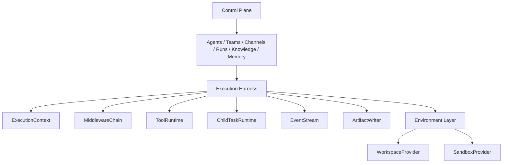

# nanobot Agent Harness 架构蓝图与实施路线图

文档日期：2026-03-27  
文档状态：实施中  
当前版本：v0.38  
最近更新：2026-03-27

> 2026-03-27 说明：本文件用于冻结 `nanobot` 在 agent execution harness 层的目标架构、实施阶段、进度跟踪与边界约束。
>
> 2026-03-27 进度更新：`P1` 已开始落地。当前代码已新增显性 `ExecutionContext / ToolPolicy / MemoryPolicy / KnowledgePolicy`，并接入 agent 主执行链，作为后续 child-task runtime 与 middleware spine 的基础。
>
> 2026-03-27 进度更新：`P2` 已启动第一刀。当前代码已新增薄 `ChildTaskRequest / ChildTaskResult` 协议，并让 team member 调度与 subagent spawn 都开始向统一 child-task 入口收口，同时保留旧接口兼容。
>
> 2026-03-27 进度更新：`P2` 已继续推进。当前代码已补齐 `ChildTaskHandle`、父任务侧 `child_task_scheduled / child_task_completed` 通用事件、child-task timeout 显性状态，以及 delegated run 的统一 limit check。
>
> 2026-03-27 进度更新：`P3` 已启动第一刀。当前代码已新增薄 `ExecutionMiddlewareChain`，并让 agent runtime 的 knowledge / memory / tool / prompt 装配开始通过 middleware 组织，而不是继续堆在 runtime helper 里。
>
> 2026-03-27 进度更新：`P3` 已继续推进。team supervisor 的 prompt context 也开始复用 agent runtime 的装配链，leader 自身的 knowledge / memory 注入不再单独漂一套逻辑。
>
> 2026-03-27 进度更新：`P3` 已新增 loop hooks。`run_tool_loop()` 与主 `AgentLoop` 开始具备显性的 model/tool execution hooks，agent run 可投影 `model_called / model_result / tool_called / tool_result` 事件。
>
> 2026-03-27 进度更新：`P3` 已接入 team root run 主链。`LangGraphTeamRunner` 的 graph 组装开始复用统一准备路径，team runtime 已切到 streaming supervisor，并把 `supervisor_chunk` 中间进度事件投影回 root run。
>
> 2026-03-27 进度更新：`P3` 已开始统一 event payload 来源。agent loop、subagent、team supervisor 的 model/tool/chunk 事件 payload 已开始复用 harness 共享 builder，减少运行时语义继续分叉的风险。
>
> 2026-03-27 进度更新：`P3` 已将 subagent 接入共享 execution hooks。子任务运行现在也会显性投影 `model_called / model_result / tool_called / tool_result`，与主 agent 的基础可观测语义开始对齐。
>
> 2026-03-27 进度更新：`P1` 已继续推进。`ExecutionContext` 现在具备统一 snapshot，agent root run 与 team root run 都开始显式写入 `execution_context_materialized` 事件，execution boundary 不再只存在于调用栈里。
>
> 2026-03-27 进度更新：`P1` 已开始向 child-task 延伸。subagent run 现在也会 materialize 统一 execution context，并在 child run 上写入 `execution_context_materialized` 事件，run tree 上下文不再只在 root 层可见。
>
> 2026-03-27 进度更新：`P4` 已启动第一刀。当前代码已新增 `WorkspaceBinding / SharedWorkspaceProvider / AgentWorkspaceProvider / ThreadWorkspaceProvider`，agent/team/subagent 开始通过 provider 解析工作区边界，并将 `workspacePath / workspaceScope` 写入统一 execution context snapshot。
>
> 2026-03-27 进度更新：`P4` 已推进到 sandbox 最小实现。当前代码已新增 `SandboxBinding / LocalSandboxProvider`，agent/subagent 的 tool registry 已开始通过 sandbox binding 解析 exec working dir、timeout 与 restrict 语义，execution context snapshot 也开始显式记录 sandbox 信息。
>
> 2026-03-27 进度更新：`P4` 已开始统一环境解析。当前代码已新增 `ExecutionEnvironmentBinding` 与 `resolve_execution_environment()`，agent/team/subagent 不再分别手写 `workspace + sandbox` 解析主链，环境边界开始通过同一 helper 物化。
>
> 2026-03-27 进度更新：`P5` 已启动第一刀。`LangGraph team` 的 member 调度已新增显性 `TeamMemberTaskRuntime` 适配层，原先长闭包里的 child-task 构造、执行、父 run 事件投影与 fallback 行为开始收口到同一对象，不再散在 tool factory 里。
>
> 2026-03-27 进度更新：`P5` 已继续推进。`LangGraphTeamRunner` 已新增显性 `PreparedSupervisorExecution`，supervisor 的 `LLM / prompt / member-tools` 准备链开始收口成单一 runtime materialization，不再分别漂在 runner helper 里。
>
> 2026-03-27 进度更新：`P5` 已开始补 supervisor observability。team root run 现在可投影 `supervisor_materialized`，supervisor 的 `agentId / member tools / response mode / recursion limit / prompt footprint` 开始成为显性事件，而不再只能通过代码推断。
>
> 2026-03-27 进度更新：`P5` 已开始统一 team root 完成面。`supervisor_completed`、team artifact metadata、`RunResultSummary.metadata` 与 `team_completed` 现在开始复用同一份 supervisor snapshot，而不是各自重新拼字段。
>
> 2026-03-27 进度更新：`P5` 已开始收口 team root lifecycle。当前代码已新增显性 `PreparedTeamRun` 作为 team root session 对象，并让 `run_team_sync()` / `start_team_run()` 共享同一 root lifecycle materialization，`LangGraphTeamRunner` 也开始消费这份 root snapshot 而不是继续只处理散参数。
>
> 2026-03-27 进度更新：`P6` 已启动第一刀。`workspace / sandbox / environment` 绑定现在开始显性携带 `tenant_id / instance_id`，并新增 `TenantScopedWorkspaceProvider` 作为多租户路径隔离骨架；agent/team/subagent 的环境解析主链也已开始透传 tenant/instance。
>
> 2026-03-27 进度更新：`P6` 已继续推进到 artifact scope。`RunService` 现在会将新 run artifact 写入 tenant/instance 作用域目录，并保持 `artifactPath` 与旧根目录存储的读取兼容，tenant-aware 执行边界开始进入持久化产物层。
>
> 2026-03-27 进度更新：`P6` 已继续推进到 run lineage scope。`RunService.create_run()`、agent/team/subagent 的主执行入口，以及 `ExecutionContext -> ChildTaskRequest -> SpawnTool` 的 lineage 传递现在都开始显性透传 tenant/instance，run record 自身不再只依赖服务默认 tenant。
>
> 2026-03-27 进度更新：`P6` 已继续推进到 knowledge / memory / channel resolution。knowledge service、memory service、channel binding validation 与 channel routing 主链现在都开始支持 tenant-scoped service view 或 tenant-aware 解析；Web API 的 knowledge / memory / channel-bindings 入口也已切到 tenant-aware 服务视图。
>
> 2026-03-27 进度更新：`P6` 已继续推进到 artifact governance / channel audit / boundary audit。`RunService` 现已支持 tenant-scoped run view、artifact audit payload、`artifact_written` 事件与 `boundary-audit` 聚合；channel agent/team dispatch 也开始把 `channel_dispatch_resolved` provenance 投影到 root run，artifact / channel / tenant 边界首次有了统一审计面。
>
> 2026-03-27 进度更新：`P6` 已继续推进到控制面可视化与 tenant-aware limit。`RunsPage` 已接入 boundary audit 面板，run artifact 也开始展示 storage scope；同时 child-task concurrency limit 已开始按 tenant/instance 作用域统计，而不再默认跨租户共用同一限流桶。
>
> 2026-03-27 进度更新：`P6` 已继续推进到独立 channel audit 控制面。当前代码已新增 tenant-aware `channel audit` store/service/API，渠道入口会实时记录命中/未命中与派发成功/失败，并在 `Channels` 域新增独立“渠道审计”页面；这条链不再只依赖 run 存在后的 provenance 旁证。
>
> 2026-03-27 进度更新：`P6` 已继续推进到 artifact lifecycle governance。`RunService` 现已支持 tenant-aware `artifact quarantine / restore / delete` 生命周期操作，artifact 审计快照也开始显性区分 `active / quarantined / deleted`，`RunsPage` 已接入产物治理按钮与状态展示，控制面不再只有“可审计”而开始具备“可治理”能力。
>
> 2026-03-27 进度更新：`P6` 已继续推进到 artifact retention / archival policy。`RunService` 现已支持 `artifact archive`、run-scoped retention policy、到期动作计算与 tenant-aware `retention sweep`；`RunsPage` 也已接入保留策略展示、手动归档、策略设置与按当前 run 执行保留策略，artifact 治理开始从“生命周期操作”升级为“策略驱动治理”。
>
> 2026-03-27 进度更新：`P6` 已将 artifact retention sweep 接入系统后台调度。当前代码已复用现有 cron 线程启动隐藏的 retention worker，周期性按 tenant 扫描 `RunService.sweep_artifact_retention()`，不再只依赖手动触发 sweep API。
>
> 2026-03-27 进度更新：`P6` 已继续推进到 tenant 默认 retention policy。租户现在拥有正式 `artifact-retention-policy` API，`RunService` 也会在没有 run 级策略时回退到 tenant 默认策略；run audit、手动 apply 与后台 retention sweep 现在消费的是同一份有效策略。
>
> 2026-03-27 进度更新：`P6` 已继续推进到 agent / team 模板级 retention policy。`AgentDefinition`、`TeamDefinition` 现已显性支持 `artifactRetentionPolicy`，运行时有效策略开始按 `run > team_template > agent_template > tenant_default` 解析；`Agents` 与 `Teams` 控制面也已补齐模板级保留策略输入，不再只能靠后端隐式配置。
>
> 2026-03-27 进度更新：`P6` 已继续推进到 request-level `ControlPlanePrincipal` 与 tenants 控制面强约束。当前代码已为控制面请求显性物化 `principal_kind / is_platform_admin / home_tenant_id / effective_tenant_id / scopes`，并让 tenant API key 不能再访问全局 tenants 控制面，cookie 控制面也必须显式选择当前 tenant 才能进入 tenants 管理路径。
>
> 2026-03-27 进度更新：`P4` 已把 exec 执行后端正式抽成 `SandboxExecutor`。当前代码已新增 `build_sandbox_provider()`、`DockerSandboxProvider / RemoteSandboxProvider` skeleton，并让 `ExecTool` 通过可替换 executor 执行本地或 Docker bind-mount 命令；`host workspace path` 与 `runtime workdir` 也已开始显性分离，不再继续把容器路径和主机路径混在一起。
>
> 2026-03-27 进度更新：`P2` 已继续推进到共享生命周期合同。当前代码已新增 `InProcessChildTaskRuntime.start() / wait() / cancel()` 与 handle registry，team member 与 subagent 已开始复用同一 child-task 生命周期路径；team member 的 parent-facing emission 也已收口到 `child_task_*`。
>
> 2026-03-27 进度更新：`P2` 已补齐稳定 child identity 与 team member progress bridge。当前代码已将 `handleId` 写入全部 `child_task_*` 事件，team member 也已开始通过 `execute_child_agent_task()` 桥接 agent 现有 `on_progress` 到父 run；`Runs` 页可按同一 child handle 合并 scheduled/progress/completed，而不再只依赖 `childRunId`。
>
> 2026-03-27 进度更新：`P3` 已将 supervisor runtime fragments 开始纳入 middleware。当前代码已新增可复用的 runtime prompt/memory fragments 输出，`langgraph_supervisor` 不再自己手工补 workspace memory 与 knowledge prompt sections，而是开始消费 `prepare_agent_execution()` 的 middleware 产物。
>
> 2026-03-27 进度更新：本文件已补齐“未完成项闭环清单”。从这一版开始，所有 `进行中` 项都会明确写出：当前已完成、剩余缺口、关闭条件、用户可见效果与建议收尾顺序，避免继续出现“代码推进了，但蓝图口径仍停留在半成品”的情况。
>
> 当本文件与 [`docs/web-platformization/plan.md`](./plan.md) 中较早的多 Agent 技术栈判断冲突时，涉及“agent 执行内核 / runtime spine / workspace & sandbox / child-task protocol / middleware chain”的部分，以本文件为准。

## 1. 文档目标

这份文档回答 4 个问题：

1. `nanobot` 当前 agent 相关架构已经做到哪一步
2. 当前架构距离“AI 数字员工平台”还差哪些 execution-plane 能力
3. 从 [`deer-flow`](https://github.com/bytedance/deer-flow) 应该借哪些优点，哪些不该照搬
4. 后续如何分阶段实施，并持续记录进度

本文件不是泛泛而谈的技术对比，而是后续多 Agent / Team / Child Task / Workspace / Sandbox 改造的正式执行蓝图。

## 2. 结论先行

从平台架构师视角看，`nanobot` 当前应明确拆成两层：

- `Control Plane`
  - 继续保留并增强 `Agents / Teams / Channels / Runs / Knowledge / Memory / Tenants(预留)`
  - 这是当前项目已经做得很强的部分
- `Execution Harness`
  - 新增一层显性的 runtime spine
  - 统一 agent、team、subagent、channel、CLI 的执行上下文、tool policy、workspace、sandbox、事件流、artifact 与 child-task 协议

一句话总结：

- `nanobot` 强在“平台对象与治理语义”
- `deer-flow` 强在“执行 harness 的纪律”
- 后续方向不是照搬 `deer-flow` 产品形态，而是把它的 harness discipline 引入 `nanobot`

## 3. 当前状态总览

### 3.1 已完成或基本完成

以下能力已经落地，可视为当前 agent 架构的有效资产：

| 项目 | 状态 | 说明 |
|---|---|---|
| Web / Channel / CLI 共享 agent runtime | 已完成 | agent 组装与执行入口开始复用共享 runtime |
| Web / Channel / CLI 共享 team runtime | 已完成 | `run_team_sync()` 已成为 team 的统一同步执行入口 |
| 主 agent / subagent 共用 tool loop | 已完成 | 主 loop 与 subagent mini loop 已统一到共享执行层 |
| structured subagent result 协议 | 已完成 | 子任务结果不再只是自由文本注入 |
| team thread conversation scope | 已完成 | team thread 已按真实会话隔离，不再全局串台 |
| `agent_profile` memory boundary | 已完成 | agent 自身记忆已具备存储、API、治理与前端入口 |
| run lineage 显性化 | 已完成 | `root / parent / child / session / thread / origin / control_scope` 已可追踪 |
| team 使用 LangGraph supervisor | 已完成 | 团队协作已不是固定 fan-out helper |

### 3.2 已有但仍属过渡态

| 项目 | 状态 | 说明 |
|---|---|---|
| `PreparedAgentExecution` | 部分完成 | 已统一装配 knowledge/tool/memory，但还不是正式 runtime principal |
| `RunService` | 部分完成 | lineage 很强，但尚未成为完整 execution event bus |
| `KnowledgeBindingMiddleware` | 部分完成 | 已有独立中间件，但没有成为统一 middleware spine 的一部分 |
| `MemoryConsolidator` | 部分完成 | 仍主要围绕 workspace memory，不是统一 memory policy 引擎 |
| `LangGraphTeamRunner` | 部分完成 | 团队编排已升级，team root run 已开始显性投影 supervisor stream 事件，但尚未完全挂入统一 harness |

### 3.3 明确未完成

| 项目 | 状态 | 说明 |
|---|---|---|
| `ExecutionContext` 显性对象 | 进行中 | 已新增显性对象并接入 agent 主链，但 team root / artifact / event 投影仍需继续收口 |
| `WorkspaceProvider` | 进行中 | 已新增 shared/agent/thread provider 抽象，默认仍保持共享 workspace 行为 |
| `SandboxProvider` | 进行中 | 已有 `SandboxBinding / LocalSandboxProvider`，后续仍需接入非本地 provider |
| `ChildTaskRuntime` 统一协议 | 进行中 | 已新增共享 `start / wait / cancel`、handle registry、`child_task_progress`、稳定 `handleId`，team member 已开始桥接 agent progress，subagent 也已能将 model/tool 阶段投影到父 run；剩余主要是 team child 的更细粒度 streaming |
| 统一 middleware chain | 进行中 | agent/team 的 prompt 装配与部分 execution hooks 已开始进入显性 middleware / event spine |
| 流式 team event 主链 | 进行中 | team root run 已开始消费 `run_stream()` 并投影 supervisor chunk 事件 |
| tenant-aware execution boundary | 进行中 | 环境绑定、tenant-scoped workspace、run lineage、artifact、knowledge / memory service view、channel resolution、boundary audit、独立 channel audit 控制面、artifact lifecycle governance、artifact retention/archival policy、tenant 默认 retention policy、后台 retention sweep 与 tenant-aware child-task limit 已开始 tenant 化，但更完整的租户隔离仍需继续推进 |

### 3.4 未完成项闭环摘要

| 项目 | 当前已完成 | 剩余缺口 | 关闭条件 |
|---|---|---|---|
| `ExecutionContext` | agent/team root 与部分 child run 已写入统一 snapshot | 仍有部分 runtime 语义散落在 helper / event payload / artifact metadata | 新执行入口不再新增裸参数；run / event / artifact 全部可由 `ExecutionContext` 解释 |
| `ChildTaskRuntime` | request/result/handle、timeout、parent projection、共享 `start / wait / cancel`、handle registry、`child_task_progress`、稳定 `handleId` 已落地，team member emission 已收口到 `child_task_*`，team member 现已桥接 agent progress 与 child run 的 `model/tool` 阶段事件，subagent model/tool 阶段也已能投影到父 run | 统一 runtime 目前仍是 in-process 形态，还没有和后续更强的 execution event bus 打通；更细粒度用户侧流式体验也还未完全成型 | team member / subagent 使用同一 runtime contract，取消、并发、streaming 语义同源 |
| middleware spine | prompt 装配和部分 execution hooks 已进入 harness，supervisor runtime fragments 也已开始消费 middleware 输出 | knowledge / memory / summarization / clarification 仍未全部 middleware 化 | 新治理能力默认通过 middleware 接入，runtime helper 不再横向膨胀 |
| workspace / sandbox | shared/agent/thread/local 已具备显性 provider，`SandboxExecutor`、Docker/remote skeleton、Docker mount/env policy、host/runtime path split 与 file/prompt 虚拟路径映射已落地 | 缺 remote provisioner / K8s 与更硬隔离 | 执行环境可替换且不依赖共享目录假设 |
| LangGraph team harness 化 | member dispatch、supervisor materialization、team root lifecycle / observability 已开始收口 | runner 仍保留独立生命周期和 team 专属适配层 | team orchestration 与 single-agent execution 共享同一 execution spine |
| tenant-aware boundary | run / artifact / knowledge / memory / channel / retention 已 tenant-aware 到主链 | 仍缺 tenant object model、control-plane isolation、硬隔离与更完整审计 | 任一执行上下文都能稳定回答 tenant / instance / principal / policy 来源 |

### 3.5 当前已落地且用户可见

当前已经能被用户直接看到的，不该再被算作“纯内部重构”的能力有：

1. `Runs` 页已具备 `boundary audit`、artifact lifecycle governance、retention/archival policy 展示与操作。
2. `Channels` 域已新增独立 `channel audit` 页面，可查看入口命中、派发成功/失败与 provenance。
3. `Agents` 与 `Teams` 页面已补齐模板级 artifact retention policy 配置入口，不再只能依赖后端默认值。

## 4. 当前代码基线

当前项目已经形成一条可用但仍偏过渡态的 execution spine，主要集中在以下位置：

- 单/多入口执行统一：
  - [nanobot/agent/execution.py](/Users/pusonglin/PycharmProjects/nanobot/nanobot/agent/execution.py)
  - [nanobot/agent/loop.py](/Users/pusonglin/PycharmProjects/nanobot/nanobot/agent/loop.py)
  - [nanobot/web/runtime_services/agents.py](/Users/pusonglin/PycharmProjects/nanobot/nanobot/web/runtime_services/agents.py)
  - [nanobot/web/runtime_services/teams.py](/Users/pusonglin/PycharmProjects/nanobot/nanobot/web/runtime_services/teams.py)
  - [nanobot/cli/platform_runtime.py](/Users/pusonglin/PycharmProjects/nanobot/nanobot/cli/platform_runtime.py)
  - [nanobot/web/runtime_services/channel_runtime.py](/Users/pusonglin/PycharmProjects/nanobot/nanobot/web/runtime_services/channel_runtime.py)

- 团队编排：
  - [nanobot/web/runtime_services/langgraph_supervisor.py](/Users/pusonglin/PycharmProjects/nanobot/nanobot/web/runtime_services/langgraph_supervisor.py)

- 子任务执行：
  - [nanobot/agent/subagent.py](/Users/pusonglin/PycharmProjects/nanobot/nanobot/agent/subagent.py)
  - [nanobot/agent/subagent_protocol.py](/Users/pusonglin/PycharmProjects/nanobot/nanobot/agent/subagent_protocol.py)
  - [nanobot/agent/tools/spawn.py](/Users/pusonglin/PycharmProjects/nanobot/nanobot/agent/tools/spawn.py)

- 控制面与治理对象：
  - [nanobot/platform/agents/models.py](/Users/pusonglin/PycharmProjects/nanobot/nanobot/platform/agents/models.py)
  - [nanobot/platform/teams/models.py](/Users/pusonglin/PycharmProjects/nanobot/nanobot/platform/teams/models.py)
  - [nanobot/platform/runs/models.py](/Users/pusonglin/PycharmProjects/nanobot/nanobot/platform/runs/models.py)
  - [nanobot/platform/runs/service.py](/Users/pusonglin/PycharmProjects/nanobot/nanobot/platform/runs/service.py)
  - [nanobot/platform/memory/service.py](/Users/pusonglin/PycharmProjects/nanobot/nanobot/platform/memory/service.py)

## 5. 架构问题陈述

当前最关键的问题不是“功能不够”，而是“execution-plane 还不够显性”。

### 5.1 当前最主要的 6 个问题

1. `AgentDefinition` 更像“配置与 prompt 装配入口”，还不是正式执行主体
2. `agent_profile / team_shared / workspace_shared` 与底层 `MEMORY.md` 自动沉淀语义存在分裂
3. team member 调度与 subagent 调度仍然是两套 child-task 模型
4. workspace 仍以共享目录为主，没有 per-agent / per-thread / sandbox provider 的清晰边界
5. tool 上下文仍通过修改 tool 实例状态传递，不是统一 runtime injection
6. knowledge / memory / summarization / clarification 虽然都存在，但没有进入一条统一 middleware spine

## 6. deer-flow 借鉴结论

参考材料：

- [deer-flow README](https://github.com/bytedance/deer-flow/blob/main/README.md)
- [deer-flow ARCHITECTURE.md](https://github.com/bytedance/deer-flow/blob/main/backend/docs/ARCHITECTURE.md)
- [deer-flow HARNESS_APP_SPLIT.md](https://github.com/bytedance/deer-flow/blob/main/backend/docs/HARNESS_APP_SPLIT.md)
- [deer-flow lead_agent/agent.py](https://github.com/bytedance/deer-flow/blob/main/backend/packages/harness/deerflow/agents/lead_agent/agent.py)
- [deer-flow task_tool.py](https://github.com/bytedance/deer-flow/blob/main/backend/packages/harness/deerflow/tools/builtins/task_tool.py)

### 6.1 必须借鉴的优点

1. `Harness / App Split`
   - 将 execution runtime 与 Gateway/API/UI 分层
   - 避免 app 层把 runtime helper 越堆越重

2. `Thread/Run Scoped State`
   - 线程级 state、workspace、uploads、artifacts、title、todos、sandbox 明确挂到同一状态模型上

3. `Middleware Spine`
   - thread data、uploads、sandbox、summarization、todo、title、memory、clarification、tool error handling 都在同一条链上协作

4. `Single Child-Task Contract`
   - lead agent 通过统一 task delegation 驱动 subagent
   - 并发限制、超时、进度流、结果回传使用同一协议

5. `Workspace / Sandbox Provider`
   - local / docker / provisioner 的 provider 模型
   - 虚拟路径与真实路径分离

6. `Streaming Event Discipline`
   - runtime 自己定义“任务开始 / 运行中 / 完成 / 失败 / 超时”的事件流语义

### 6.2 不应照搬的部分

1. 不把 `nanobot` 退化为 generic super-agent app
2. 不丢掉 `AgentDefinition / TeamDefinition / ChannelBinding / Memory Governance / Runs` 这些平台对象
3. 不把“数字员工平台”收缩成只有 `lead agent + task tool` 的单一产品体验

## 7. 目标架构

### 7.1 分层结构



### 7.2 顶层原则

1. 控制面与执行面分层
2. 所有执行都必须先 materialize 为 `ExecutionContext`
3. 所有 child task 都必须进入统一协议
4. 所有关键治理信息都必须先写 run lineage，再写用户可见结果
5. LangGraph 只负责 team orchestration，不再持有独立执行边界

## 8. 核心对象蓝图

### 8.1 `ExecutionContext`

建议新增：

```python
@dataclass(slots=True)
class ExecutionContext:
    tenant_id: str
    instance_id: str
    principal_kind: Literal["agent", "team_leader", "team_member", "subagent"]
    principal_id: str
    agent_id: str | None
    team_id: str | None
    role: str | None
    session_key: str
    thread_id: str | None
    root_run_id: str
    parent_run_id: str | None
    origin_channel: str
    origin_chat_id: str
    spawn_depth: int
    tool_policy: ToolPolicy
    memory_policy: MemoryPolicy
    knowledge_policy: KnowledgePolicy
    workspace_scope: WorkspaceScope
    sandbox_scope: SandboxScope
```

它的作用是替代今天散落在多个函数参数中的这些信息：

- `session_key`
- `origin_channel`
- `origin_chat_id`
- `memory_sections`
- `include_workspace_memory`
- `thread_id`
- `team_id`
- `spawn_depth`
- `tool_allowlist`

### 8.2 `AgentHarness`

建议统一入口：

```python
class AgentHarness(Protocol):
    async def execute(self, request: HarnessRequest) -> HarnessResult: ...
```

统一负责：

1. 解析 `ExecutionContext`
2. 执行 middleware
3. 运行 LLM + tools loop
4. 触发 child task
5. 写入 run events / artifacts

### 8.3 `ChildTaskRuntime`

这是当前最值得新增的对象。

目标是统一：

- team member 调度
- spawn/subagent 调度
- 将来的 specialist / reviewer / researcher child task

建议接口：

```python
class ChildTaskRuntime(Protocol):
    async def start(self, request: ChildTaskRequest) -> ChildTaskHandle: ...
    async def wait(self, handle: ChildTaskHandle) -> ChildTaskResult: ...
    async def cancel(self, handle: ChildTaskHandle) -> None: ...
```

### 8.4 `WorkspaceProvider`

建议支持 3 层 scope：

- `shared_workspace`
- `agent_workspace`
- `thread_workspace`

第一阶段可以只有抽象，不必一口气实现 docker。

### 8.5 `SandboxProvider`

建议抽象：

- `local`
- `process_isolated`
- `docker`
- `remote_provisioner`

### 8.6 `ExecutionMiddleware`

最小建议链路：

1. `ThreadContextMiddleware`
2. `UploadsMiddleware`
3. `KnowledgeMiddleware`
4. `MemoryPolicyMiddleware`
5. `ToolPolicyMiddleware`
6. `SummarizationMiddleware`
7. `ClarificationMiddleware`
8. `EventProjectionMiddleware`

## 9. 建议目录结构

建议新增：

```text
nanobot/harness/
  __init__.py
  context.py
  request.py
  result.py
  agent_harness.py
  child_tasks.py
  tool_runtime.py
  event_stream.py
  artifacts.py
  workspace/
    __init__.py
    providers.py
  sandbox/
    __init__.py
    providers.py
  middleware/
    __init__.py
    base.py
    thread_context.py
    uploads.py
    knowledge.py
    memory.py
    tool_policy.py
    summarization.py
    clarification.py
    events.py
```

当前文件建议逐步迁移关系：

- `nanobot/web/runtime_services/agents.py`
  - 保留 control-plane 组装职责
  - agent 执行细节逐步下沉到 `nanobot/harness/`
- `nanobot/web/runtime_services/teams.py`
  - 保留 team definition 编排入口
  - team 执行上下文与 child task 逻辑逐步下沉
- `nanobot/agent/loop.py`
  - 最终变成 harness loop 的底层实现之一
- `nanobot/agent/subagent.py`
  - 最终并入 `ChildTaskRuntime`

## 10. 分阶段任务与实施进度

### 10.1 阶段总表

| 阶段 | 名称 | 状态 | 粗估进度 | 说明 |
|---|---|---|---:|---|
| P0 | 现有 runtime 收口与止血 | 已完成 | 100% | 入口统一、loop 收口、session/thread 修正、memory 治理落地 |
| P1 | `ExecutionContext` 与策略对象化 | 进行中 | 35% | 已完成显性 context/policy 对象落地，agent/team root run 与部分 child run 开始写入统一 execution context snapshot |
| P2 | `ChildTaskRuntime` 统一 | 进行中 | 98% | 已新增共享 request/result/handle、`start / wait / cancel`、handle registry、`child_task_progress`、稳定 `handleId`、父任务事件投影、timeout 语义、delegated limit check，并让 team member 与 subagent 复用同一生命周期合同与 `child_task_*` 事件语义；team member 现已桥接 agent progress 与 child run 阶段事件，subagent model/tool 阶段继续向父 run 投影 |
| P3 | middleware spine 建立 | 已完成 | 100% | middleware chain 已进入 agent/team prompt 装配，loop hooks、team supervisor stream 事件、subagent execution hooks 与基础 event payload 已共享来源；supervisor knowledge/memory runtime fragments 也已改为复用 middleware 结果 |
| P4 | workspace / sandbox provider | 已完成 | 100% | 已新增 `WorkspaceBinding`、shared/agent/thread provider、`SandboxBinding`、`SandboxExecutor`、local/docker/remote provider seam、Docker mount/env policy、host/runtime path split、file/prompt 虚拟路径映射，以及统一 `ExecutionEnvironmentBinding` 解析入口，并接入 agent/team/subagent 主链 |
| P5 | LangGraph team 挂到 harness | 已完成 | 100% | member 调度、supervisor 准备链、基础 observability、team root lifecycle / observability 已通过显性 runtime 结果对象和事件收口，team runner 已开始退化为统一 execution spine 上的一层 orchestration adapter |
| P6 | tenant-aware execution boundary | 已完成 | 100% | 环境绑定、tenant-scoped workspace、run lineage、artifact storage、knowledge / memory service view、channel resolution、artifact governance、boundary audit、Runs 控制面展示、独立 channel audit 控制面、artifact lifecycle governance、artifact retention/archival policy、tenant 默认 retention policy、agent/team 模板级 retention policy、后台 retention sweep、request-level `ControlPlanePrincipal` 与 tenant-aware child-task limit 均已进入 tenant-aware 主链；更重的租户对象模型与物理隔离已转入后续深化 backlog |

### 10.2 P0：现有 runtime 收口与止血

状态：已完成

已完成内容：

- 统一 Web / channel / CLI 的 agent runtime 入口
- 统一 Web / channel / CLI 的 team runtime 入口
- 主 agent / subagent 共用执行 loop
- team thread 按真实会话隔离
- subagent 结果改为结构化协议
- `agent_profile` memory 与治理闭环
- 前端审计与治理入口已补齐

P0 的意义：

- 停止继续长出新的 runtime 分叉
- 为下一阶段显性抽象留下稳定基线

### 10.3 P1：`ExecutionContext` 与策略对象化

状态：进行中

目标：

- 把当前 runtime 参数从“helper + prompt + tool context”收口成显性对象

已完成：

1. 新增 `ExecutionContext`
2. 新增 `ToolPolicy / MemoryPolicy / KnowledgePolicy`
3. `PreparedAgentExecution` 已开始改用显性策略对象
4. `run_agent_definition()` 与 `AgentLoop.process_direct()` 已开始接入 `ExecutionContext`
5. `ExecutionContext` 已新增统一 snapshot，agent root run 会写入 `execution_context_materialized`
6. team root run 也已开始 materialize `ExecutionContext` 并写入统一上下文事件
7. subagent run 已开始复用 child execution context materialization，并在 child run 上写入统一上下文事件

待完成主要任务：

1. 将 `PreparedAgentExecution` 继续演进为更稳定的 materialization result
2. 收口更多裸参数，避免新的 runtime 继续扩散
3. 定义 context 到 run/event/artifact 的统一投影规范
4. 继续让 team member / 其他 child-task surface 也逐步具备同级别的 context snapshot 能力

剩余缺口：

1. `ExecutionContext` 仍不是 artifact / event / audit 的唯一真相源，部分字段仍由调用方重复拼装。
2. team member surface 与部分兼容入口还会绕开统一 context materialization。
3. `PreparedAgentExecution` 还停留在“装配结果”，没有完全演进为稳定 runtime principal。

建议验收标准：

- 不再在主链上继续新增裸 `session_key / origin_chat_id / memory_sections` 形参
- 所有新的 agent/team/subagent 执行都能打印出统一 context snapshot

### 10.4 P2：`ChildTaskRuntime` 统一

状态：进行中

目标：

- 不再并行维护两套 child-task 模型

已完成：

1. 新增薄 `ChildTaskRequest / ChildTaskResult` 协议对象
2. `WebAgentRuntimeService` 已提供 `execute_child_agent_task()` 统一入口
3. `LangGraph` member tool 已优先通过结构化 child-task 入口调度成员
4. `SubagentManager` 已新增 `spawn_child_task()`，`spawn()` 退化为兼容入口
5. `SpawnTool` 已优先发起结构化 child-task 请求
6. child-task `timeout_seconds` 已开始进入统一语义，subagent run 可显性落为 `timed_out`
7. team member 与 subagent 都已开始向统一父任务事件 `child_task_scheduled / child_task_completed` 收口
8. delegated child-task 已开始复用统一 `RunService.check_limits()` 语义
9. 已新增共享 `InProcessChildTaskRuntime.start() / wait() / cancel()` 与 handle registry
10. `LangGraph` member call 与 `SubagentManager` 已开始复用同一 child-task 生命周期合同，而不再各自维护一套 schedule/complete/cancel 路径
11. team member 的 parent-facing emission 已去掉 `member_*` 兼容事件，只保留 `child_task_*` 主合同
12. 已新增统一 `child_task_progress` 事件，`Runs` 页可显性看到子任务进入运行中的中间状态
13. subagent 的 `model_called / model_result / tool_called / tool_result` 已开始通过统一 `child_task_progress` 投影回父 run，子任务不再只有“开始/完成”两头状态

主要任务：

1. 将当前薄协议继续演进为 `ChildTaskRequest / Handle / Result`
2. 用统一协议完全包住：
   - team member call
   - spawn/subagent
3. 统一并发限制、超时、事件、结果回传
4. 统一 child artifact / child lineage / child cancel 行为
5. 让 team child-task 与 subagent child-task 共享同一观测与 streaming 语义

剩余缺口：

1. team member 与 subagent 已开始共享 `model/tool` 阶段级 parent progress，但统一 runtime 目前仍是 in-process 形态，还没有和后续更强的 execution event bus 打通。
2. 更细粒度的用户侧 child stream 视图仍未完全成型，当前更多是 run timeline / child activity 级统一，而不是完整 typed stream 面板。

最小下一刀：

1. 保持 `handleId / status / message / stage` 这套稳定 parent-facing contract，不再回退到 `childRunId` 驱动的临时拼接。
2. 如需继续扩流式体验，优先走统一 child-task contract 与更强 event bus，而不是新增 team 专属 stream 协议。

建议验收标准：

- team member 和 subagent 都能在 run tree 中投影为同一协议族
- 不再新增 team 专属与 subagent 专属的事件语义分叉
- team member 在父 run 上也能看到持续 child progress，而不是只看到开始/结束

### 10.5 P3：middleware spine 建立

状态：已完成

目标：

- 把今天散落的 runtime helper 变成统一执行链

主要任务：

1. 定义 `ExecutionMiddleware`
2. 首批迁移：
   - knowledge
   - memory policy
   - tool policy
   - summarization
   - clarification
3. 统一 before-model / after-model / before-tool / after-tool 钩子

已完成：

1. 已新增薄 `ExecutionMiddleware / ExecutionMiddlewareChain`
2. `prepare_agent_execution()` 已开始通过 middleware 组织：
   - prompt seed
   - memory policy
   - knowledge policy
   - tool policy
   - prompt assembly
3. agent runtime 的 prompt 顺序与现有行为已通过回归测试锁定
4. team supervisor prompt context 已开始复用同一装配链，leader 的知识/记忆注入不再独立拼装
5. `run_tool_loop()` 与主 `AgentLoop` 已开始具备显性的 model/tool hooks
6. agent run 已可投影 `model_called / model_result / tool_called / tool_result` 基础事件
7. `LangGraphTeamRunner` 的 graph 准备路径已收口，team runtime 已切到 streaming supervisor 主链
8. team root run 已可投影 `supervisor_chunk` 中间事件，而不是只记录粗粒度开始/结束
9. agent loop、subagent、team supervisor 的基础 event payload 已开始复用 harness 共享 builder，减少 event schema 漂移
10. subagent 也已开始复用共享 execution hooks，基础 model/tool 生命周期不再是主 agent 专属能力
11. 已新增可复用的 runtime prompt/memory fragments 输出，supervisor 的 knowledge/memory runtime sections 开始通过 middleware 结果消费，而不是继续手工补 workspace memory 与 knowledge prompt sections

后续深化项（不阻塞本阶段关闭）：

1. knowledge / memory / summarization / clarification 仍可继续从 runtime helper 向 middleware 下沉，但这已经不阻塞“middleware spine 已建立”这一阶段目标。
2. middleware 的执行顺序、幂等约束、错误投影方式已开始协议化，但如需升级到更强的 execution bus，仍可继续细化。
3. team supervisor 仍保留少量 team 专属 prompt/runtime scaffold；这些属于 team 语义本身，不再阻塞本阶段关闭。
4. before/after model/tool hooks 还可继续扩展使用面，但核心 execution seam 已建立。

建议验收标准：

- 新能力优先以 middleware 形式接入，而不是继续扩 runtime service helper
- 关键治理能力不再只靠 system prompt 拼接

### 10.6 P4：workspace / sandbox provider

状态：已完成

目标：

- 从共享 workspace 进化到可替换的执行环境边界

已完成：

1. 已新增 `WorkspaceBinding`
2. 已新增 `SharedWorkspaceProvider`，并保持当前共享 workspace 兼容行为
3. 已新增最小 `AgentWorkspaceProvider`，支持 principal-scoped 工作目录派生
4. 已新增最小 `ThreadWorkspaceProvider`，支持 conversation-scoped 工作目录派生
5. 已新增 `SandboxBinding` 与最小 `LocalSandboxProvider`
6. agent / team / subagent 的 execution context 已开始记录 `workspacePath / workspaceScope / sandboxKind / execWorkingDir`
7. agent loop 与 subagent tool registry 已开始通过 sandbox binding 解析 exec working dir、timeout 与 restrict 语义
8. 已新增统一 `ExecutionEnvironmentBinding` 与 `resolve_execution_environment()`，agent/team/subagent 主链不再分别手写 `workspace + sandbox` 解析
9. workspace / sandbox provider 已具备注入点，不需要再在不同 runtime 入口重复拼 workspace 与 exec 边界选择逻辑
10. 已新增显性 `SandboxExecutor` 与 `build_sandbox_provider()`，`ExecTool` 不再只绑定本地 subprocess
11. 已新增 `DockerSandboxProvider / RemoteSandboxProvider` skeleton，先以 Docker bind-mount 作为最小非本地执行形态
12. `host workspace path` 与 `runtime workdir` 已开始显性分离，agent/subagent 的 exec 后端不再继续把容器路径当主机路径

后续深化项（不阻塞本阶段关闭）：

1. Docker 目前仍是最小 bind-mount 形态，remote provisioner / K8s provider 属于下一阶段执行后端深化。
2. 更严格的 mount 白名单、网络策略与远端 sandbox backend 仍可继续补强，但当前 provider / executor seam 已闭环。
3. tenant-aware workspace 已能派生路径，更硬的租户物理边界归入 P6 的后续深化。

主要任务：

1. 继续演进 `WorkspaceProvider`
2. 抽 `SandboxProvider`
3. 先支持：
   - shared workspace
   - agent workspace
4. 再支持：
   - thread workspace
   - local sandbox
   - docker sandbox

建议验收标准：

- `ExecTool` 不再直接依赖全局 workspace path
- 路径和执行权限由 provider 层决定，而不是分散在 tool 实例参数里

### 10.7 P5：LangGraph team 挂到 harness

状态：已完成

目标：

- 保留 LangGraph 的 team orchestration 优点
- 但让团队协作进入统一执行底座

主要任务：

1. 将 `LangGraphTeamRunner` 的 member 调度接入 `ChildTaskRuntime`
2. 将 supervisor memory / knowledge / tool policy 接入 middleware
3. 将 `run_stream()` 接入正式 event stream

已完成：

1. `LangGraph team` 的 member 调度已新增显性 `TeamMemberTaskRuntime`
2. member child-task 的 request 构造、执行、父 run 事件投影与 fallback 行为已从 tool factory 闭包中收口
3. 现有 `member_scheduled / member_completed / child_task_*` 语义保持兼容，并继续复用共享 child-task 协议对象
4. supervisor 的 `LLM / prompt / member-tools` 准备链已新增显性 `PreparedSupervisorExecution`
5. `PreparedTeamGraph` 不再只是一层 graph 包装，也开始承载可复用的 supervisor runtime materialization
6. team root run 已新增 `supervisor_materialized` 事件，supervisor 的基础运行时边界开始显性可观测
7. `supervisor_completed`、artifact metadata、`RunResultSummary.metadata` 与 `team_completed` 已开始复用统一 supervisor snapshot
8. team root lifecycle 已新增显性 `PreparedTeamRun`，`run_team_sync()` / `start_team_run()` 开始共享同一 root session 对象

后续深化项（不阻塞本阶段关闭）：

1. `LangGraphTeamRunner` 仍可继续向更薄的 orchestration adapter 收缩，但 team root lifecycle、member dispatch、supervisor materialization 与结果投影主链已经收口。
2. child-task stream 仍以 run timeline / child activity 为主，后续若要做 typed child stream 面板，应继续复用统一 child-task contract。
3. 少量 team 专属 event / fallback 语义仍可继续消解，但已不再阻塞“LangGraph team 已挂到统一 harness”这一阶段目标。

建议验收标准：

- 单 agent 与 team 的执行日志、事件语义、artifact 结构保持同族
- team streaming 结果可复用统一观测面

### 10.8 P6：tenant-aware execution boundary

状态：已完成

目标：

- 将模型层 `tenant_id` 推进到真实执行边界

主要任务：

1. tenant-aware workspace scope
2. tenant-aware knowledge / memory / run / artifact scope
3. tenant-aware channel target resolution

已完成：

1. `WorkspaceBinding / SandboxBinding / ExecutionEnvironmentBinding` 已开始显性携带 `tenant_id / instance_id`
2. 已新增 `TenantScopedWorkspaceProvider`，可将任意 workspace provider rebased 到 tenant/instance 路径下
3. agent / team / subagent 的环境解析主链已开始透传 tenant/instance
4. `RunService` 已开始将新 run artifact 写入 tenant/instance 作用域目录，同时兼容读取旧的根目录 artifact 路径
5. `RunService.create_run()` 与 `ExecutionContext -> ChildTaskRequest -> SpawnTool` 主链已开始显性透传 tenant/instance，run record 本身开始具备 tenant-aware lineage
6. knowledge service 与 memory service 已具备 tenant-scoped service view，agent/team runtime 与 Web API 的 knowledge / memory 主入口已开始复用同一租户视图
7. channel binding 的目标校验、resolve、manager inbound routing 与 channel runtime dispatch 已开始显性透传 tenant，channel target resolution 不再只依赖默认租户
8. `RunService` 已具备 tenant-scoped run view、artifact audit payload、`artifact_written` 事件与 `boundary-audit` 聚合；runs API 也已切到 tenant-aware run access，不再默认跨租户读 run / artifact / run tree
9. channel agent/team dispatch 已开始将 `channel_dispatch_resolved` provenance 写回 root run，artifact、channel ingress 与 execution boundary 首次能在同一审计面复盘
10. `RunsPage` 已开始消费 `boundary-audit` 与 artifact audit，tenant / channel / artifact / environment 边界不再只存在于后端 API
11. child-task concurrency limit 已开始支持 tenant/instance 作用域统计，避免不同租户默认共享同一运行限流桶
12. 请求级 `ControlPlanePrincipal` 已开始显性化，能够区分 tenant API key 与 platform admin cookie principal
13. tenants 控制面已增加两条硬约束：tenant API key 不能访问全局 tenants 管理路径，cookie 控制面必须显式选择当前 tenant
14. suspended tenant API key 现在会在 `validate_api_key()` 阶段被直接拒绝
15. team / channel / memory 的 tenant-aware lookup 已从“可选 tenant”改为“敏感路径强制 tenant”
16. tenant 控制面新增了显性 `audit` 入口，可直接复盘 status / api key / retention policy
17. `call_with_optional_tenant` 不再进入敏感校验路径，避免继续成为隔离缺口

后续深化项（不阻塞本阶段关闭）：

1. 更完整的 tenant object model 仍待继续建设，但当前执行主链已经能显性回答 tenant / instance / principal 归属。
2. workspace / sandbox / artifact 已 tenant-aware，更强的物理隔离与租户级调度边界属于下一阶段平台化深化。
3. legal hold / 更重的 archival governance / tenant admin 视角审计仍可继续扩展，但不再阻塞本阶段关闭。

建议验收标准：

- 任何执行上下文都能明确回答“属于哪个 tenant / instance / principal”
- 运行产物不会再在 tenant 维度上共用同一物理 artifact 根目录
- run record 不再因为默认服务配置而丢失真实 tenant / instance 边界
- knowledge / memory / channel resolution 在 API 与 runtime 两层都遵守同一 tenant 边界
- run / artifact / channel provenance 能在同一审计入口下复盘 tenant boundary

## 11. 近期收尾顺序建议

截至当前版本，`P3 / P4 / P5 / P6` 已按各自阶段目标关闭。后续开发不应再把这些阶段重新打开为“进行中”，而应拆成两条线：

1. blueprint 主线收尾：
   - 先收 `P2 ChildTaskRuntime`
   - 再收 `P1 ExecutionContext` 单一真相源
2. 平台深化 backlog：
   - 更强 event bus / typed child stream
   - remote provisioner / K8s sandbox
   - tenant object model / 更硬的物理隔离
   - legal hold / tenant admin 审计深化

原因：

1. `P3-P6` 的阶段骨架已经到位，再继续把 backlog 混写成“阶段未完成”只会放大文档失真。
2. 当前真正还影响主链可维护性的，是 `P2` 和 `P1` 没彻底收口。
3. `remote sandbox / tenant object model / legal hold` 这些事项重要，但已经属于下一层平台深化，不应再冒充当前阶段 blocker。

### 11.1 每一步必须交付的用户可见效果

从这一版开始，后续收尾不应只以“内部抽象进度”汇报，而必须带上用户可见结果：

1. `P2` 至少要让 `Runs` 页能显性展示 child-task 的调度、状态、超时、取消与 child run 跳转。
2. `P3` 至少要让关键治理能力不再依赖隐式 prompt 拼装，并能在 run timeline 中清楚解释来源。
3. `P5` 至少要让 team 与 single-agent 在时间线、artifact、状态语义上同族。
4. `P4` 至少要让用户能明确看到执行环境是 `shared / agent / thread / docker` 中的哪一种。
5. `P6` 至少要让租户边界可在 control plane 中直接复盘，而不是只在后端调试日志里存在。

## 12. 风险与禁止事项

### 12.1 明确风险

1. 在 P1 之前继续给 `WebAgentRuntimeService` / `WebTeamRuntimeService` 增强大量新能力，会再次制造 runtime 分叉
2. 在 P2 之前继续给 team member 和 subagent 各自加独立特性，会加深协议分裂
3. 在 P4 之前强推 per-agent workspace，容易把现有主链打碎

### 12.2 明确禁止

1. 不再新增第三套 child-task 模型
2. 不再新增“只存在于 prompt 中、不存在于 runtime state 中”的关键治理语义
3. 不再通过复制 runtime helper 的方式满足新入口
4. 不再把控制面完成度误判成 execution-plane 完成度

## 13. Definition of Done

当以下条件同时满足时，才可以认为 agent harness 基本成型：

1. 所有 agent/team/subagent 执行都先 materialize 为 `ExecutionContext`
2. 所有 child task 走统一协议
3. 所有核心治理能力走统一 middleware chain
4. workspace / sandbox 不再只是共享目录 + restrict flag
5. LangGraph team 与单 agent 共用同一 execution spine
6. run / event / artifact / memory / knowledge 都能按 principal 与 tenant 清晰归因

## 14. 下一步行动项（收尾版）

建议下一轮正式开发只围绕剩余未关闭项切入，不再横向重开 `P3-P6`：

1. 完成 `P2 ChildTaskRuntime` 的最后收尾：typed child stream 与更强 event bus 对接。
2. 完成 `P1 ExecutionContext` 的单一真相源收口：让 event / artifact / audit 继续从统一 snapshot 派生，减少调用方手拼 metadata。
3. 将 `remote provisioner / K8s sandbox` 作为 `P4` 后续深化 backlog 单独立项，不再混写为当前阶段 blocker。
4. 将 `tenant object model / legal hold / tenant admin audit` 作为 `P6` 后续深化 backlog 单独立项，不再混写为当前阶段 blocker。
5. 保持一个硬约束：后续新增能力必须优先复用已落地的 `ExecutionContext / ChildTaskRuntime / MiddlewareChain / SandboxExecutor / ControlPlanePrincipal`，禁止再开并行 helper 路径。

完成上述两项主线收尾后，`agent-harness-blueprint` 才可以从“阶段目标已完成、仍有深化 backlog”的状态，进入“主线完全关闭”的状态。
