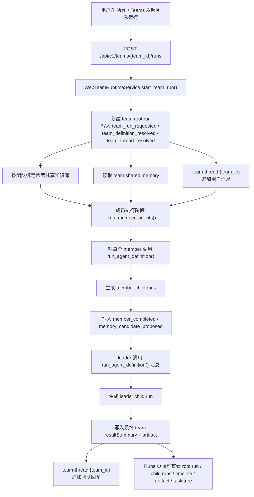
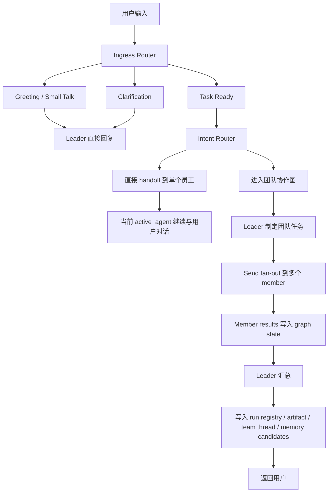
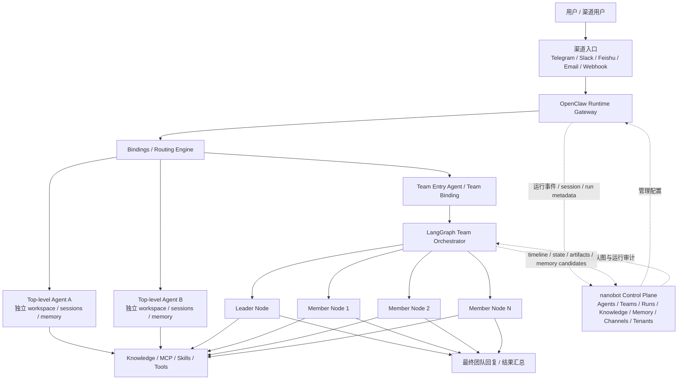
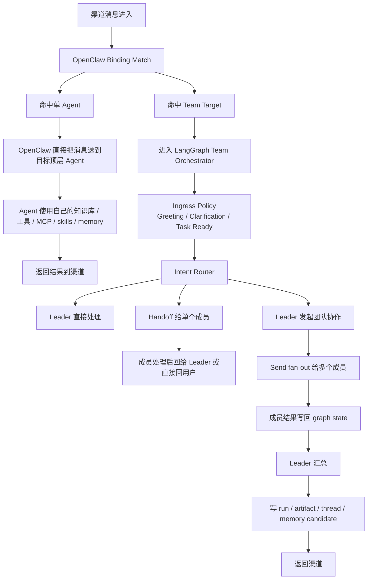
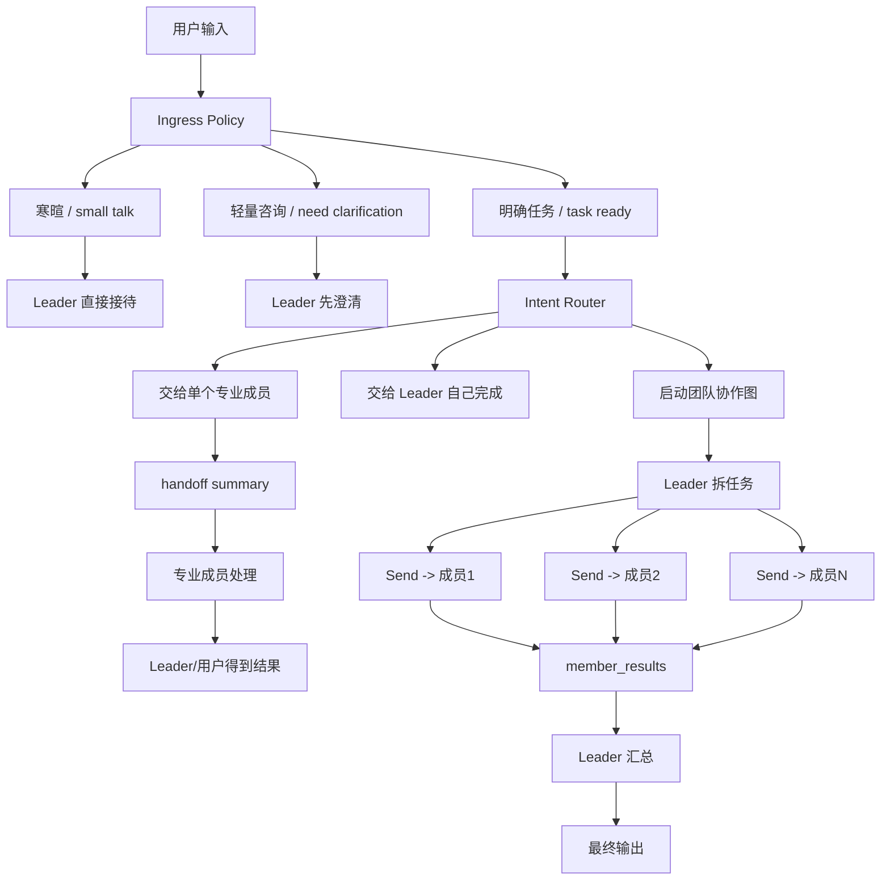
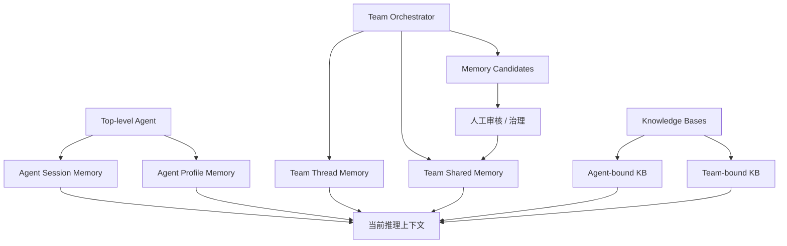
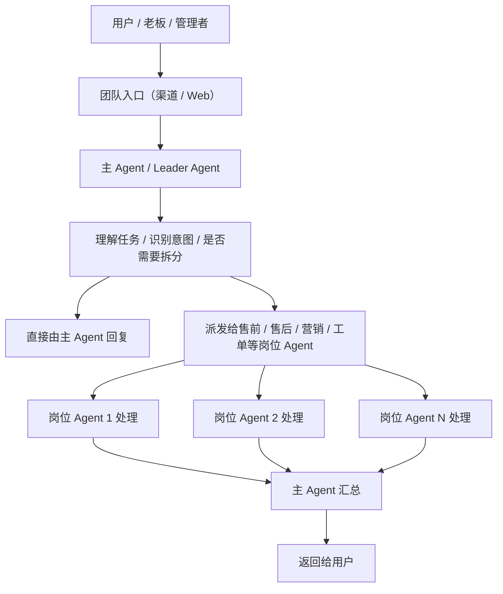

# nanobot Web GUI 平台化重构计划

文档日期：2026-03-13  
文档状态：草案  
当前版本：v0.1

> 2026-03-14 更新：本文件保留的是较早的“单实例 Web GUI 平台化”思路。
>
> 2026-03-14 校对说明：原文提到的 `docs/web-platformization/requirements_task_tracker.md` 当前仓库中并不存在，因此不能作为真实入口使用。当前如需判断“代码已经做到哪一步”，应优先看本文件新增的“状态总览”和第 14 节任务表；如需对照更完整的最终蓝图，请参考外部完整规格文档。
>
> 2026-03-14 补充：技能市场的当前真实行为、兼容性分级和“已安装 != 已适配”约定，统一以 [`docs/skills-marketplace.md`](../skills-marketplace.md) 为准；不要再按早期“市场入口 + 手动上传”这类粗粒度描述继续假设产品行为。
>
> 2026-03-15 补充：关于“把单 agent / team 接入真实渠道，并支持不同渠道选择不同目标”的正式设计与实施计划，见 [`docs/web-platformization/channel-agent-team-routing-plan.md`](./channel-agent-team-routing-plan.md)。

## 1. 文档用途

这份文档用于统一当前项目的 Web GUI 重构方向，目标是：

- 给原版 `nanobot` 适配生产可用的 Web GUI
- 在不破坏原版主链的前提下逐步平台化
- 把原来的 JSON 配置体验改造成适合非技术用户的页面配置体验
- 用一份持续更新的开发任务清单跟踪完成情况

后续每做完一批工作，都需要同步更新本文件中的：

- 任务状态
- 完成说明
- 最近更新记录

## 1.1 2026-03-15 真实需求重申（高优先级覆盖口径）

以下 5 条来自用户对最终产品形态的再次明确说明。  
从这一刻开始，后续多 Agent 相关设计、任务拆分和实现判断，**都必须以这 5 条为最高优先级口径**；若与当前代码状态或早期阶段性实现冲突，以本节为准。

### 1.1.1 最终产品定位

1. 这是一个 **AI 数字员工平台**
2. 用户可以创建 agent（员工），且每个 agent 的：
   - 角色职责
   - 知识库
   - 工具
   - MCP
   - skills
   都可以不同
3. 用户可以从单个 agent 进一步组建团队协作；不同角色的 agent 分工职责明确，但**不能把团队协作简单收敛成固定 workflow**
4. 单 agent 和团队 agent 最终都必须可以接入渠道；并且**不同渠道可以选择不同的 agent 或 team**
5. 最终必须走向 **SaaS 多租户**，不同租户的数据必须完全隔离

### 1.1.2 这 5 条对架构的直接约束

基于以上真实需求，后续架构必须遵守以下约束：

1. 平台主体必须是“员工 / 团队 / 渠道 / 知识 / 执行”的数字员工平台，而不是 workflow 设计器
2. `AgentDefinition` 必须是一等公民业务对象，不能只是 test-run prompt 的包装
3. `TeamDefinition` 不能只等价为固定流程模板；应支持：
   - leader / specialist 分工
   - 动态 handoff
   - 任务级协作
   - 非固定、非死板的协作编排
4. `channel -> target` 绑定必须成为正式主链，而不是页面外的临时约定
5. 多租户不是附属增强，而是最终架构边界；即使当前阶段不立即实现，也必须确保：
   - agents / teams / runs / knowledge / memory / channels 的对象模型都能自然挂上 `tenant_id`
   - 后续不会因为当前实现把租户边界彻底锁死

### 1.1.3 对当前实现的纠偏结论

结合本节真实需求，当前项目后续必须停止这两种倾向：

1. 继续把“页面控制面原型”误判成“多 Agent runtime 已完成”
2. 继续把“固定 team workflow helper”当成最终团队协作模型

更准确的纠偏方向应该是：

- 单 agent：做成真正可复用的数字员工实体
- team：做成动态协作团队，而不是固定工作流
- channel routing：做成正式绑定体系
- tenant boundary：从现在开始持续预留

### 1.1.4 已达成一致的用户使用主链

为避免后续再次把“系统实现层”误当成“用户真实使用链路”，这里把已达成一致的使用主链单独冻结：

1. 用户始终是主角
2. 用户面向的是：
   - 单个 AI 员工
   - 或一个 AI 团队
3. 如果用户面向团队，则：
   - 团队对外只有一个主 Agent / Leader Agent 入口
   - 主 Agent 负责接待、理解任务、判断是否拆分
   - 主 Agent 再把任务路由给对应岗位 Agent
   - 岗位 Agent 默认是对内协作角色，不是对外聊天主入口
   - 最终仍由主 Agent 汇总后回复用户

也就是说，**真实体验应该是“你对团队下命令，团队负责人在后台调度岗位员工，再统一回复你”**，而不是多个岗位 Agent 直接轮番和用户说话。

### 1.1.5 当前阶段架构冻结结论

基于目前讨论结果，当前阶段架构方向先冻结为：

1. `nanobot` 保留产品控制面：
   - Agents
   - Teams
   - Channels
   - Runs
   - Knowledge
   - Memory
   - Tenants（预留）
2. 顶层多 Agent runtime 不再继续手写，优先向 **OpenClaw** 对齐
3. 团队内部动态协作与 handoff，不再继续用手写 helper 扩展，优先向 **LangGraph** 对齐
4. 当前代码中的：
   - `WebAgentRuntimeService`
   - `WebTeamRuntimeService`
   只能继续被视为过渡实现，不能再被表述为最终多 Agent runtime

### 1.1.6 后续开发禁止偏离的点

从这次需求对齐开始，后续涉及多 Agent 的实现，禁止再出现以下偏差：

1. 把页面控制面完成度误判成“多 Agent runtime 已完成”
2. 把固定 `workflowMode` 当成最终团队协作模型
3. 把 `spawn/subagent` 直接等同于顶层 Agent
4. 在没有 `channel -> target(agent/team)` 正式绑定体系前，就宣称渠道已支持数字员工路由
5. 在没有清晰 `tenant_id` 作用域前，就宣称架构已经满足 SaaS 多租户
6. 让岗位 Agent 默认直接对外和用户轮番对话，破坏“主 Agent 对外、岗位 Agent 对内协作”的主链

### 1.1.7 后续实现前的确认机制

为避免再次出现“实现出来的东西不是用户真正想要的”，后续只要进入以下任一范围，就必须先回到文档和用户确认，再进入代码实现：

1. 顶层多 Agent runtime 方案切换
2. 团队协作链路改造
3. 渠道路由绑定模型改造
4. 多租户边界设计
5. 记忆与知识边界的重大改造

确认原则：

- 先给结构图 / 数据模型 / 交互主链
- 用户确认方向后再进入代码
- 不再允许先实现一大段，再事后解释“这是为了以后演进”

### 1.1.8 技术栈冻结结论（避免后续实现互相干扰）

从本节开始，多 Agent 相关技术栈先按以下方案冻结：

#### 一、保留的技术栈

这些层继续保留，不做推翻式重写：

1. `nanobot` 作为 **Control Plane**
   - FastAPI
   - 现有 Web routers / runtime_services / platform stores
   - Agents / Teams / Runs / Knowledge / Memory / Channels / Auth / Setup 页面与 API
2. 前端继续使用：
   - React
   - Vite
   - Ant Design / Ant Design X
3. 当前控制面存储继续使用：
   - SQLite（instance-scoped）
4. 当前产品治理对象继续保留：
   - `AgentDefinition`
   - `TeamDefinition`
   - `RunService`
   - `KnowledgeBaseDefinition`
   - `TeamMemoryService`

#### 二、替换的技术栈

这些层不再继续手写扩展，后续改造优先替换：

1. 顶层多 Agent runtime

- 目标技术栈：**OpenClaw**
- 接管内容：
  - top-level agent identity
  - per-agent workspace / sessions / state
  - agent-aware routing
  - channel/account bindings

2. 团队内部编排层

- 目标技术栈：**LangGraph**
- 接管内容：
  - ingress policy
  - greeting / clarification / task-ready 分流
  - leader -> specialist handoff
  - parallel fan-out / summarize
  - checkpoint / interrupt / resume

#### 三、明确冻结的旧实现

以下实现从现在开始进入“冻结状态”：

1. `WebAgentRuntimeService`
2. `WebTeamRuntimeService`
3. `TeamDefinition.workflowMode` 的当前 3 个固定模式扩展路径

冻结的含义是：

- 允许修 bug
- 允许补必要兼容
- 不再把它们作为最终多 Agent 架构继续演进
- 不再围绕这套 helper 继续堆新能力

### 1.1.9 改造方案（避免新旧方案互相干扰）

后续改造必须分成 4 个清晰阶段，且每阶段都要有“旧链路冻结边界”。

#### 阶段 A：控制面对象收口，不再扩 runtime helper

目标：

- 保持现有 `Agents / Teams / Runs / Knowledge / Memory / Channels` 页面和 API 可用
- 停止继续增强手写 team runtime
- 先把对象模型、字段、术语、路由绑定需求收口

本阶段禁止：

- 再给 `WebTeamRuntimeService` 叠加更多 workflow 分支
- 再把现有 team helper 包装成“完整多 Agent runtime”
- 再新增围绕旧 helper 的复杂交互

#### 阶段 B：接入 OpenClaw 顶层 runtime

目标：

- 建立真正的 top-level agent identity
- 建立 `channel -> target(agent/team)` 正式绑定主链
- 为每个顶层 agent 提供独立 workspace / sessions / state

本阶段产物应包括：

- `AgentRegistry`
- `ChannelTargetBinding`
- `TargetResolver`
- 顶层 agent 与当前 `AgentDefinition` 的映射关系

#### 阶段 C：用 LangGraph 接管团队编排

目标：

- 用 graph/state 替换当前 `leader/member fan-out helper`
- 让团队协作从固定 workflow mode 升级成动态协作
- 保持“主 Agent 对外、岗位 Agent 对内协作”这条主链

本阶段产物应包括：

- `TeamGraphState`
- `IngressPolicy`
- `IntentRouter`
- `LeaderNode`
- `SpecialistNodes`
- `SummarizeNode`
- checkpoint / interrupt / resume 方案

#### 阶段 D：最后再进入 T60 多租户

目标：

- 在新 runtime 和新 team orchestration 稳定后，再补 tenant-aware 隔离

约束：

- 不允许在旧 runtime 未纠偏前，直接往上叠多租户

### 1.1.10 完成情况检查与需求同步机制

从现在开始，后续检查完成情况和同步需求，统一按下面这套方式执行：

#### 一、检查完成情况看哪里

1. **先看文档顶部冻结口径**

- 看 `1.1 真实需求重申`
- 看 `1.1.4 已达成一致的用户使用主链`
- 看 `1.1.5 当前阶段架构冻结结论`
- 看 `1.1.6 后续开发禁止偏离的点`

2. **再看 `2.1 当前状态总览`**

- 判断当前到底是：
  - 已完成
  - 部分完成
  - 未完成

3. **最后看第 14 节任务表**

- 第 14 节只看任务执行流水，不单独代表最终架构是否到位

#### 二、同步需求时怎么确认

以后只要进入以下任一主题，必须先做“文档同步确认”，再做代码：

1. 多 Agent runtime
2. 团队协作逻辑
3. 渠道路由绑定
4. 记忆边界
5. 多租户

同步确认的最小交付物必须是：

1. 一张结构图
2. 一张数据模型或对象关系图
3. 一条用户使用主链
4. 一段“哪些是这次做，哪些这次不做”的边界说明

#### 三、后续文档更新要求

后续每次涉及多 Agent 方向调整时，必须同步更新：

1. `1.1` 需求冻结基线
2. `2.1` 当前状态总览
3. `10.3` 相关架构 / 设计章节
4. `14` 任务表状态
5. `17` 最近更新记录

如果这 5 处没有一起更新，就视为“需求和实现还没真正对齐”。

## 2. 任务状态说明

统一使用以下状态：

- `待开始`
- `未开始`
- `部分完成`
- `进行中`
- `已完成`
- `阻塞`

补充约定：

- `已完成`：当前代码里已经有对应实现，且达到该任务在本文件中的原始范围
- `部分完成`：已经有清晰的代码落点或基础能力，但距离最终目标还差关键对象或关键闭环
- `待开始 / 未开始`：当前仓库中还没有对应实现，或只有文档规划没有代码

## 2.1 当前状态总览

以下整理以 2026-03-16 当前仓库代码与最新需求冻结口径为准，而不是按记忆判断。

### 2.1.1 已完成

| 能力域 | 当前结论 | 代码证据 |
| --- | --- | --- |
| 单实例 Web 控制台骨架 | 已完成单实例 Web 控制台骨架，前端已经收敛到 `对话 / 模型 / 渠道 / 技能 / MCP / 提示词与记忆 / 系统`，后端也已拆成 `app.py + routers/*`。 | `web-ui/src/App.tsx`、`nanobot/web/app.py` |
| 渠道页面化闭环 | 已完成渠道列表、详情、配置、测试，且 WhatsApp 绑定流程已经页面化。 | `nanobot/web/routers/channels.py`、`nanobot/web/whatsapp_binding.py` |
| Skills 市场与上传兜底 | 已完成 SkillHub 远端市场接入、ZIP / 目录上传兜底和已安装技能管理。 | `nanobot/services/skillhub_marketplace.py`、`nanobot/web/runtime_services/workspace.py` |
| MCP 管理主流程 | 已完成 MCP 目录、探测、安装、启停和隔离测试主流程。 | `nanobot/web/routers/mcp.py`、`nanobot/web/mcp_registry.py`、`nanobot/web/mcp_servers.py` |
| Prompt / Memory / 模板工作区化 | 已完成工作区文档编辑、长期记忆文件管理，以及 workspace-scoped `agent_templates`。 | `nanobot/web/runtime.py`、`nanobot/web/runtime_services/workspace.py`、`nanobot/services/agent_templates.py` |
| 聊天 UI 主链 | 已完成基于 `useXChat` 的聊天页重构，仍然走现有 `AgentLoop` 主链。 | `web-ui/src/pages/ChatPage.tsx`、`nanobot/web/runtime_services/chat.py` |
| Web 层职责拆分 | 已完成 `api.py -> app.py / frontend.py / http.py / routers/* / runtime_services/*` 的第一轮拆分。 | `nanobot/web/app.py`、`nanobot/web/runtime.py`、`nanobot/web/runtime_services/*` |
| 渠道绑定路由（Web 端） | 已完成 Web 端渠道绑定路由能力：SQLite 存储 `ChannelBinding`、`ChannelRoutingService` 路由解析（精确匹配 + 通配符回退）、`_RoutingBusProxy` 元数据注入、`ChannelMessageDispatcher` 分发、`WebChannelRuntimeService` 后台线程运行时、agent/team handler 执行、REST API（CRUD + resolve）、前端绑定管理页面、配置热重载，以及 27 个端到端集成测试。详见 `channel-agent-team-routing-plan.md` 第 17 节。 | `nanobot/platform/channel_bindings/*`、`nanobot/web/runtime_services/channel_runtime.py`、`nanobot/web/runtime_services/channel_routing.py`、`nanobot/channels/dispatch.py`、`nanobot/channels/manager.py`、`nanobot/web/routers/channel_bindings.py`、`web-ui/src/pages/ChannelBindingsPage.tsx`、`tests/test_channel_routing_e2e.py` |

### 2.1.2 部分完成

| 能力域 | 当前结论 | 为什么只是部分完成 | 代码证据 |
| --- | --- | --- | --- |
| 平台化实例抽象 | 已有 `PlatformInstance` 和 instance-scoped 路径边界。 | 目前 `create_app()` 仍只绑定一个默认实例，`PlatformInstanceService` 也还不是实例注册中心。 | `nanobot/platform/instances/models.py`、`nanobot/platform/instances/service.py`、`nanobot/web/app.py` |
| Web Auth / 控制平面隔离 | 已有独立的 Web 登录与管理员资料。 | 仍是单管理员模型，不是 tenant-aware 或多账号控制平面。 | `nanobot/web/auth.py` |
| 模板与 agent 抽象 | 已同时具备 workspace-scoped `AgentTemplate`、instance-scoped `AgentDefinition`，以及首版 `Agents` 页面和单 agent test-run。 | 模板素材层和真实 agent definition 已分开，`/studio/agents` 已可用；`TeamDefinition` 也已落到独立对象层，但完整 team runtime 和更深的团队控制仍未落地。 | `nanobot/services/agent_templates.py`、`nanobot/storage/agent_template_repository.py`、`nanobot/platform/agents/*`、`nanobot/platform/teams/*`、`nanobot/web/routers/agents.py`、`web-ui/src/pages/AgentsPage.tsx` |
| `TeamDefinition` 控制面 | 已有 instance-scoped `TeamDefinition` 模型、成员关系字段、基础 workflow mode 校验，以及 `/api/v1/teams*` CRUD / copy / enable / disable API。 | 当前 team definition 的后端和 `协作 / Teams` 页面都已接上，并已支持后台 `team run`、recent runs 自动刷新、统一时间线跳转、取消、直接重跑和追加上下文重跑；但这仍属于控制面原型范围，后续重点已转向 `team ingress policy`、`binding-driven orchestration` 与顶层 runtime 对接。 | `nanobot/platform/teams/*`、`nanobot/web/routers/teams.py`、`nanobot/web/app.py`、`web-ui/src/pages/TeamsPage.tsx` |
| 记忆体系 | 已有 session JSONL、`MEMORY.md / HISTORY.md`、token consolidation，以及 team shared memory / memory candidate 治理。 | 当前已覆盖 workspace memory、team shared memory、team thread transcript 与 unified memory search；但还没有真正独立的 `agent profile memory`，也还没有与未来顶层多 Agent runtime 完全对齐的 agent memory boundary。 | `nanobot/session/manager.py`、`nanobot/agent/memory.py`、`nanobot/agent/loop.py`、`nanobot/platform/memory/*`、`nanobot/web/routers/memory.py`、`nanobot/web/runtime_services/teams.py`、`web-ui/src/pages/TeamsPage.tsx`、`web-ui/src/pages/MemoryAuditPage.tsx` |
| subagent 能力 | 已有 `spawn` 和后台 subagent 执行。 | 当前 subagent 复用同一个 provider / workspace / bus，完成后回灌主 agent；还不是多 Agent registry。 | `nanobot/agent/subagent.py`、`nanobot/agent/tools/spawn.py` |
| 多 Agent runtime registry | 已有 instance-scoped SQLite run registry、`/api/v1/runs*` 查询 / 取消 API、agentId/teamId/threadId 过滤、run tree，以及 artifact 读写 / 下载链路。 | 当前阶段仅在“控制面原型”范围内闭环：`spawn -> subagent` 主链和 `AgentDefinition -> test-run` 已接上 lineage 基础，后台 team root run、leader/member child runs 已带稳定 `threadId`，`Runs` 页面也已补齐 thread audit、artifact、run tree 与 root/thread 跳转；但这仍不等于完整顶层多 Agent runtime。 | `nanobot/platform/runs/*`、`nanobot/web/routers/runs.py`、`nanobot/agent/subagent.py`、`nanobot/web/runtime_services/agents.py`、`nanobot/web/runtime_services/teams.py`、`web-ui/src/pages/RunsPage.tsx` |
| 顶层多 Agent runtime | 已有 `AgentDefinition / TeamDefinition / Runs / Memory / Knowledge` 协作控制面原型，且已完成 Web 端渠道绑定路由（`ChannelRoutingService` + `ChannelMessageDispatcher`）和 LangGraph supervisor 团队编排（`langgraph_supervisor.py`）。 | 渠道路由已落地：`_RoutingBusProxy` 注入路由元数据、`AgentLoop._dispatch()` 分发、`WebChannelRuntimeService` 后台线程运行时；但仍缺少 `per-agent workspace/state boundary`、`team thread conversation-scoped` 隔离、CLI gateway 端复用。 | `nanobot/web/runtime_services/channel_runtime.py`、`nanobot/web/runtime_services/langgraph_supervisor.py`、`nanobot/channels/dispatch.py`、`nanobot/channels/manager.py`、`nanobot/web/runtime_services/agents.py`、`nanobot/web/runtime_services/teams.py` |
| 企业知识库底座 | 已有 instance-scoped `KnowledgeBaseDefinition`、知识库文档 / 任务状态、`/api/v1/knowledge-bases*` API、首版 `协作 / 知识库` 页面，以及 agent test-run 对 `knowledge_binding_ids` 的真实检索接入。 | 当前阶段 scope 已闭环：已完成实例内后台 ingest worker、重建索引 / 失败重试、来源对象 / 手动同步 / 来源编辑与启停治理、文档筛选 / 批量删除 / 批量重建，以及本地可解释的 `keyword / semantic / hybrid` 检索基线；外部连接器与 embedding/rerank 属于后续增强，不再阻塞当前任务完成。 | `nanobot/platform/knowledge/*`、`nanobot/web/routers/knowledge.py`、`nanobot/web/runtime_services/agents.py`、`web-ui/src/pages/KnowledgePage.tsx` |
| `协作` 主域页面骨架 | 已新增顶层 `协作` 主域、`/studio/*` 路由、`StudioLayoutPage`、首版 `Agents / Teams / 记忆 / Runs / 知识库` 页面，并完成首轮用户语义收敛。 | 当前五个页面都已形成真实控制面闭环；首轮已完成 `模板` 默认入口隐藏、`记忆` 默认标签隐藏、`Teams / Knowledge` 分页重排、`Runs` 技术详情折叠和主要术语收口。仍有进一步润色空间，但不再阻塞当前阶段完成。 | `web-ui/src/App.tsx`、`web-ui/src/components/AppShell.tsx`、`web-ui/src/pages/StudioLayoutPage.tsx`、`web-ui/src/pages/AgentsPage.tsx`、`web-ui/src/pages/TeamsPage.tsx`、`web-ui/src/pages/MemoryAuditPage.tsx`、`web-ui/src/pages/RunsPage.tsx`、`web-ui/src/pages/KnowledgePage.tsx` |
| 第二阶段文档治理 | 已有 T23 和多 Agent 设计草图。 | `plan.md` 头部曾引用不存在的 tracker，说明当前文档治理仍需收口到实际存在的文件。 | `docs/web-platformization/plan.md` |

### 2.1.3 未完成

| 能力域 | 当前结论 | 缺失证据 |
| --- | --- | --- |
| 真正的顶层多 Agent runtime | 还没有做到完整规格里的 `Agent Registry + Binding Engine + account-aware routing + per-agent workspace/state/sessions + deterministic bindings`。 | Web 端已完成渠道绑定路由（`ChannelBindingService` + `ChannelRoutingService` + `ChannelMessageDispatcher` + `WebChannelRuntimeService`），agent/team 均可通过渠道执行；但 CLI gateway 端尚未复用，team thread 仍按 `teamId` 全局保存（未改为 conversation-scoped），也没有真正持久的 per-agent 身份边界。详见 `channel-agent-team-routing-plan.md` 第 17 节。 |
| SaaS 多租户 | 还没有 tenant-aware 鉴权、tenant-scoped 数据目录或租户级对象模型。 | 当前 `PlatformInstance` 仍是单实例路径模型，README 也只到多实例层 |

### 2.1.4 规划部分

当前最合理的后续规划已经收敛得更简单：

1. `T53-T59` 当前更准确的定位是：**单实例协作控制面原型**已基本落地，但这**不等价于**完整规格里的“真正多 Agent runtime”。
2. 在进入 `T60` 之前，优先级更高的是：先把多 Agent runtime 纠偏，补上 `per-agent boundary / team thread conversation-scoped / CLI gateway 复用` 这条主链。渠道绑定路由（`ChannelRoutingService` + `ChannelMessageDispatcher`）和 LangGraph supervisor 已在 Web 端落地，`deterministic routing` 基础能力已具备。
3. 当前唯一明确不能误判的点是：`T60` 多租户之前，不能继续把现有 `team run` helper 口径写成“多 Agent 已完成”。
4. 页面语义收敛仍然可以继续做，但必须服务于 runtime 纠偏，不能再用页面完成度掩盖运行时偏差。

这份顺序是基于当前代码现实，不是理想化蓝图：

- 现在已经有单实例 Web 控制台，所以不该先重做壳层
- 现在还没有 agent / team / run 的控制面对象，所以不能先做复杂团队 UI
- 现在还没有知识库对象层，所以不适合一步上“通用 RAG 平台”或“图谱 RAG 平台”式重型设计
- 所有已创建 agent 从第一版开始就要支持 `tools / MCP / skills / RAG` 四类能力绑定，不做“先创建空 agent，后续再补能力”的过渡设计

## 3. 核心约束与已确认结论

### 3.1 保住原版 nanobot 主链

以下目录继续作为运行时核心，不做平台化重写：

- `nanobot/agent/*`
- `nanobot/channels/*`
- `nanobot/providers/*`
- `nanobot/cron/*`
- `nanobot/session/*`

原则是：

> Web 层和平台层负责“配置、编排、管理、接入、展示”，原版 nanobot 负责“运行时主链”。

### 3.2 不再保留“简洁模式 / 高级模式”切换

当前 Web UI 里的 `safeMode / showAdvanced / workbench mode` 不再作为产品方向保留。

替代原则：

- 不靠“模式切换”做复杂度管理
- 直接把页面做小、做聚焦
- 每个页面只保留一个核心任务
- 管理类页面单独归类，不混在高频主路径里

### 3.3 每个页面只突出核心功能

页面设计统一遵守以下规则：

- 一个页面只解决一个核心任务
- 不在同一页面混入无关卡片、无关指标、无关配置
- 不把“模型配置、渠道接入、MCP、提示词、系统状态”堆在一起

### 3.4 聊天渠道接入必须做成页面化闭环

渠道接入不能只是“保存配置”。

每个渠道都应该具备：

- 页面配置
- 参数校验
- 测试连接
- 连接 / 绑定动作
- 当前运行状态
- 最近错误信息

特别说明：

- `WhatsApp` 不是单纯配置项，它在原版 CLI 中就有独立的 `nanobot channels login` 绑定流程，因此 Web 里也必须做成页面化接入流程，而不是只做字段表单。

## 4. 当前项目现状判断

## 4.1 已经具备的基础

当前项目不是从零开始，已经具备这些能力：

- 已有 Web 后端：`nanobot/web/*`
- 已有前端：`web-ui/src/*`
- Web 聊天仍通过原版 `AgentLoop` 和 `process_direct()` 驱动
- Provider 元数据已经集中在 `nanobot/providers/registry.py`
- Setup 向导已经支持 provider、API Key、API Base、model 输入
- MCP 已支持配置、探测、仓库分析、安装、启停、隔离测试
- Skills 已支持工作区扩展，且工作区技能优先于内置技能

## 4.2 仍然存在的问题

- Skills 页面目前还是“上传文件夹”为主，不是技能市场
- Tools 还没有独立市场能力，主要还是代码内置注册
- Channel 接入仍埋在通用配置页里
- Channel 还没有统一的“配置 + 测试 + 连接 + 状态”服务层
- 当前 Web 结构本质上还是单实例控制台
- 当前 Web Auth 还是单管理员模型
- 当前配置加载依赖进程级全局 config path

## 4.3 当前产品定位

当前这套系统更准确的定位是：

> “单实例数字员工平台控制面原型”

更具体地说：

- 已有单实例 Web 控制台
- 已有 `Agents / Teams / Runs / Knowledge / Memory` 这套产品控制面原型
- 但顶层多 Agent runtime 还没有真正切到目标架构

因此，当前不能再把项目理解成：

> “先把单实例 Web 管理台做完，之后再顺着手写 helper 慢慢长成多 Agent 平台”

更准确的理解应是：

1. 当前已具备可继续保留的 Control Plane
2. 顶层多 Agent runtime 需要纠偏到 OpenClaw 方向
3. 团队编排层需要纠偏到 LangGraph 方向
4. 多租户应在新 runtime 稳定后再进入

## 5. 产品阶段划分

本节旧版“单实例产品化 -> 平台底座抽象 -> 基于 `spawn/subagent` 的多 Agent 产品化”口径，已经不再作为当前主线。

为避免歧义，本节后续统一以 `1.1.9 改造方案（避免新旧方案互相干扰）` 为准：

- 阶段 A：控制面对象收口
- 阶段 B：接入 OpenClaw 顶层 runtime
- 阶段 C：用 LangGraph 接管团队编排
- 阶段 D：最后再进入 T60 多租户

## 6. 推荐页面结构

建议把导航收敛成“少量顶层页面 + 协作域 / 系统域二级标签”。

### 6.1 顶层页面

- `对话`
- `协作`
- `模型`
- `渠道`
- `技能`
- `MCP`
- `提示词与记忆`
- `系统`

### 6.2 `协作` 域默认二级标签

- `Agents`
- `Teams`
- `Runs`
- `知识库`

补充约定：

- `记忆` 不作为默认主标签，优先从 `Teams` 或 `Runs` 进入审计视图
- `模板` 不再作为默认主流程入口，只保留为内部高级能力或“从模板创建”次级入口

### 6.3 `系统` 域二级标签

- `健康`
- `验证`
- `自动化`
- `日志与运维动作`
- `管理员`

规则：

- 不再做模式切换
- 不再单独保留 `总览`
- 高频页面保持极简
- `Agents / Teams / Runs / 知识库` 不再视为低频运维功能，而是协作主域
- 低频管理能力继续收进 `系统`

## 7. 页面重构方向

## 7.1 删除总览页

当前结论：

- 不再单独保留 `总览`
- 原本的 readiness 与下一步引导统一收进 `系统 / 验证`
- 用户登录后的默认落点改为 `对话`
- 次要状态卡片
- 与后续动作无关的信息

## 7.2 对话页

只保留：

- 会话列表
- 消息流
- 输入框
- 附件上传入口

移除：

- 无关工作台信息
- 无关运维信息
- 无关统计信息

## 7.3 模型页

从当前 Setup / Config 中拆出专门的模型配置页面。

只保留：

- 厂商选择
- 默认 Base URL
- API Key
- 模型选择 / 输入
- 推理基础参数

目标体验：

- 用户先选厂商
- 系统自动带出默认 `apiBase` 或明确应用默认地址
- 用户填 `apiKey`
- 用户选模型或输入模型

最终仍然要回写到原版兼容的 `Config` 结构。

## 7.4 渠道页

新增独立页面，不再放在通用配置页里。

只保留：

- 渠道列表
- 渠道状态
- 渠道配置
- 测试
- 连接 / 绑定

不混入：

- Provider 配置
- MCP
- 原始工具配置

## 7.5 技能页

只关注：

- 已安装技能
- 技能来源
- 从市场安装
- 手动上传
- 删除工作区技能

不能继续停留在“只支持上传文件夹”的阶段。

## 7.6 MCP 页

只关注：

- MCP 索引
- 安装
- 探测
- 环境变量补全
- 隔离测试

当前 MCP 页面已接近目标，可以在此基础上继续收敛信息。

## 7.7 提示词与记忆页

只管理这些工作区文档：

- `AGENTS.md`
- `SOUL.md`
- `USER.md`
- `TOOLS.md`
- `HEARTBEAT.md`
- `memory/MEMORY.md`
- `memory/HISTORY.md`

这是“工作区引导与记忆页面”，不是通用文档中心。

## 7.8 页面收敛实施方案

这一轮前端重构完成后，下一步不应该继续“加页面”，而应该开始“减页面、减入口、减重复信息”。

页面收敛目标：

- 顶层只保留高频核心页面
- 非协作类的低频管理能力统一收进 `系统`
- 同一类信息只允许有一个主入口
- 兼容页可以短期保留，但不能继续作为正常导航项

建议最终保留的顶层页面：

- `对话`
- `协作`
- `模型`
- `渠道`
- `技能`
- `MCP`
- `提示词与记忆`
- `系统`

建议保留的详情页：

- `渠道详情`
- `MCP 详情`

不再建议继续作为顶层页面暴露的页面：

- `验证中心`
- `运维`
- `日程`
- `定时任务`
- `资料`

## 7.9 `协作` 域与 `系统` 域的承载方式

`协作` 域承载 agent / team / run / 知识库 这类产品主能力；`系统` 域继续承载低频但必要的运维与管理功能。

建议 `协作` 域内保留：

- `Agents`
- `Teams`
- `Runs`
- `知识库`

建议 `系统` 域内只保留：

- `健康`
- `验证`
- `自动化`
- `日志与运维动作`
- `管理员`

各二级功能的职责边界：

- `Agents`：真实 agent definition、测试运行、agent 私有记忆入口，以及工具 / MCP / skills / 知识库绑定
- `Teams`：真实 team definition、成员关系、team 级编排
- `Runs`：agent run / team run 详情、时间线、人工控制
- `知识库`：知识库定义、文档接入、索引状态和 agent / team 绑定
- `模板`：模板素材库，仅用于初始化 agent / team；默认隐藏，不作为主流程入口
- `健康`：只保留实例绑定、运行时健康、环境信息
- `验证`：只保留检查结果和修复入口
- `自动化`：合并 `日程` 与 `定时任务`
- `日志与运维动作`：只保留日志、hook 动作和实例级排障入口
- `管理员`：只保留管理员资料与密码

## 7.10 当前页面到目标页面的迁移关系

建议按下面的关系收敛：

| 当前页面 | 目标去向 | 处理建议 |
| --- | --- | --- |
| `总览` | 删除，能力收进 `系统 / 验证` | 不再保留独立顶层页 |
| `对话` | `对话` | 保留，继续承载会话与消息主流程 |
| `模型` | `模型` | 保留，成为唯一模型配置主入口 |
| `渠道` | `渠道` | 保留，成为唯一渠道配置主入口 |
| `技能` | `技能` | 保留 |
| `MCP` | `MCP` | 保留 |
| `提示词与记忆` | `提示词与记忆` | 保留 |
| `协作` | `协作 / Agents` | 新增协作主域，默认承载 Agents / Teams / Runs / 知识库；模板仍保留但不再作为默认导航入口 |
| `系统` | `系统 / 健康` | 保留，但只负责系统域入口与健康页 |
| `验证中心` | `系统 / 验证` | 从顶层移除，改为系统内二级页 |
| `运维` | `系统 / 日志与运维动作` | 从顶层移除，页面内容同时瘦身 |
| `日程` | `系统 / 自动化` | 与 Cron 合并 |
| `定时任务` | `系统 / 自动化` | 与 Calendar 合并 |
| `模板` | `协作 / 模板` | 从系统域迁出后继续保留，但默认隐藏，仅作为内部高级能力或“从模板创建”次级入口 |
| `资料` | `系统 / 管理员` | 从顶层移除 |
| `兼容配置` | 删除 | 前端页面与路由均已移除，仅保留后端配置 API 供页面化表单读取与保存 |

## 7.11 页面去重原则

### 7.11.1 删除总览后的承接关系

- `验证` 统一承接 readiness、检查结果和修复入口
- `对话` 成为默认进入后的主工作流
- 不再额外维护一个只展示摘要的总览页

### 7.11.2 对话 vs 运维

- `对话` 拥有会话列表、消息流、继续协作
- `日志与运维动作` 不再重复展示历史会话和原始消息
- 原始消息如果仍需保留，应作为对话页内的调试抽屉或详情能力，而不是独立运维主区块

### 7.11.3 模型 vs Setup vs 旧兼容配置

- `模型页` 成为唯一长期模型配置入口
- `Setup` 只保留首次开通所需最少字段
- 原 `兼容配置` 页面已删除，不再重复承载完整模型页与渠道页功能

### 7.11.4 渠道 vs 系统

- `渠道页` 负责接入、测试、启用、绑定、统一投递行为
- `系统 / 健康` 只展示聚合结果，不再重复展示完整渠道配置

### 7.11.5 自动化 vs 健康

- `自动化` 负责事件、提醒、任务的创建和管理
- `系统 / 健康` 最多只显示调度服务状态和任务数量摘要

## 7.12 代码删减优先级

### 第一优先级

- 下线 [ConfigPage.tsx](/Users/pusonglin/PycharmProjects/nanobot/web-ui/src/pages/ConfigPage.tsx) 的可见主入口
- 删除其中与 `模型页`、`渠道页` 重复的 UI 与保存逻辑
- 避免继续维护第二套模型 / 渠道配置系统

### 第二优先级

- 瘦身 [OperationsPage.tsx](/Users/pusonglin/PycharmProjects/nanobot/web-ui/src/pages/OperationsPage.tsx)
- 删除“历史会话”“原始会话消息”“用量概览”等与 `对话`、`系统` 重复的区块
- 只保留日志与运维动作

### 第三优先级

- 收敛 [SystemPage.tsx](/Users/pusonglin/PycharmProjects/nanobot/web-ui/src/pages/SystemPage.tsx)
- 删除与侧边栏、总览、渠道、自动化重复的运行时摘要
- 只保留健康、实例绑定、环境信息

### 第四优先级

- 收敛 [AppShell.tsx](/Users/pusonglin/PycharmProjects/nanobot/web-ui/src/components/AppShell.tsx)
- 头部与侧边栏只保留导航、登录态、基础在线状态
- 移除重复的工作区 / 供应商 / 模型 / 频道数 / 任务数摘要

### 第五优先级

- 提取 `SetupPage` 与 `ModelsPage` 的共享 provider/model 表单逻辑
- 提取 `ValidationPage` 等系统页共享的 readiness 映射逻辑
- 把 `getSystemStatus()` 的前端调用收敛成共享 hook 或 store，避免 `AppShell` 和 `SystemPage` 各自拉一次

## 8. 聊天渠道接入设计

## 8.1 渠道总览页

每个渠道卡片建议只展示：

- 渠道名称
- 当前状态
- 是否已配置
- 是否已启用
- 最近检查时间
- 最近错误摘要

每个渠道卡片建议只保留三个动作：

- `配置`
- `测试`
- `连接` 或 `重连`

统一状态建议：

- `未配置`
- `已配置`
- `待绑定`
- `可用`
- `运行中`
- `异常`

## 8.2 渠道详情页

每个渠道详情页只保留四个区块：

1. 必填凭据
2. 访问控制
3. 测试 / 连接动作
4. 当前状态与错误

## 8.3 各渠道补充说明

### Telegram

- 保存 token
- 做最小 API 校验
- 校验通过后才允许启用

### Discord

- 保存 bot token 和 gateway 相关参数
- 校验 token / intents 的基础可用性

### Slack

- 校验 bot token / app token
- 展示 socket mode 就绪状态

### Feishu / DingTalk / Wecom / QQ

- 校验 app credentials
- 返回可读错误信息

### Email

- 拆分为 IMAP 测试和 SMTP 测试

### Matrix

- 校验 homeserver / token / userId / deviceId

### WhatsApp

必须实现独立连接流程：

- 准备 bridge
- 启动绑定流程
- 展示二维码或绑定状态
- 显示 bridge/auth 运行状态

## 9. Skills、MCP、Tools 扩展策略

## 9.1 Skills

现状：

- Runtime 已支持工作区技能扩展
- 内置技能已支持被工作区技能补充

产品策略：

- Web 优先提供 SkillHub 远端市场搜索与安装
- 手动上传目录和手动上传 ZIP 保留为兜底
- 安装路径必须基于当前实例 / 当前工作区，而不是写死全局目录
- 市场结果必须显式区分“已安装”“已识别”“已适配”几个层级，不能把 UI 上的“已安装”误写成“已完整生效”
- 对 SkillHub 条目要保留兼容性静态分析与证据提示，至少覆盖 `SKILL.md`、hooks、`sessions_*`、平台目录约定这几类关键信号

## 9.2 MCP

现状：

- MCP 是当前项目最成熟的扩展机制
- Web 已支持分析、安装、启停、探测、隔离测试

产品策略：

- 把 MCP 作为主要“外部工具扩展市场”
- 继续强化 MCP 目录、安装、探测和修复体验

## 9.3 Tools

现状：

- 内置 tools 主要还是代码注册
- 模板层能选的工具也仍然是固定 catalog

建议：

- 暂时不要单独立一个 `tool market`
- 优先让外部工具通过 MCP 分发
- 高层任务能力通过 Skills 补齐

## 10. 平台化架构建议

## 10.1 总体原则

把系统逐步拆成两层：

- Runtime Plane
- Control Plane

### Runtime Plane

继续使用原版 nanobot 主链：

- AgentLoop
- Channels
- Providers
- Session
- Cron
- Memory
- Built-in Tools
- MCP Tool Registration

### Control Plane

新增职责：

- 实例抽象
- 配置编译
- 市场目录元数据
- 密钥管理
- 接入流程编排
- 验证和状态汇总

## 10.2 建议新增后端目录

建议逐步新增：

- `nanobot/platform/instances/`
- `nanobot/platform/secrets/`
- `nanobot/platform/catalogs/providers.py`
- `nanobot/platform/catalogs/channels.py`
- `nanobot/platform/catalogs/skills.py`
- `nanobot/platform/catalogs/mcp.py`
- `nanobot/platform/channels/service.py`
- `nanobot/platform/channels/validators.py`
- `nanobot/platform/channels/connectors.py`
- `nanobot/platform/config/compiler.py`

实现原则：

- 不把 runtime 整体搬入 `platform/`
- 由 `platform/` 负责编排已有 runtime 模块
- `nanobot/web/api.py` 逐步变薄

## 10.3 多 Agent 产品化需求（T23）

### 10.3.1 技术方向与借鉴边界

当前阶段的多 Agent 产品化，不再继续沿现有 `spawn / subagent` 主链扩展成最终方案。

新的冻结结论是：

- 顶层多 Agent runtime：优先向 **OpenClaw** 对齐
- 团队编排层：优先向 **LangGraph** 对齐
- 产品层控制面：继续由 `nanobot` 保留和承载
- HiClaw 仅保留为后续分布式 control plane 预研样本

原因：

- 当前 `SpawnTool -> SubagentManager -> MessageBus` 只能证明我们有后台 worker / lineage 基础，不能证明它适合作为最终顶层多 Agent runtime
- OpenClaw 直接覆盖：
  - `Agent Registry`
  - `bindings`
  - per-agent workspace / sessions / state
  - channel/account-aware routing
- LangGraph 直接覆盖：
  - ingress policy
  - dynamic handoff
  - fan-out / summarize
  - checkpoint / interrupt / resume
- `openclaw-digital-workforce` 继续只作为产品层参考，不作为 runtime 内核参考

开发参考链接：

- OpenClaw 总览：[https://docs.openclaw.ai/](https://docs.openclaw.ai/)
- OpenClaw Session Tools（重点看 `sessions_spawn`）：[https://docs.openclaw.ai/session-tool](https://docs.openclaw.ai/session-tool)
- OpenClaw Sub-Agents（重点看 session 隔离、announce、并发 lane、深度限制）：[https://docs.openclaw.ai/tools/subagents](https://docs.openclaw.ai/tools/subagents)
- OpenClaw Session Management（重点看 gateway 是 session source of truth、transcript/store 结构）：[https://docs.openclaw.ai/session](https://docs.openclaw.ai/session)
- OpenClaw Sessions（重点看 gateway session store、transcript 路径和 session key 规则）：[https://docs.openclaw.ai/sessions](https://docs.openclaw.ai/sessions)
- OpenClaw Memory（重点看 Markdown memory + `memory_search` / `memory_get`）：[https://docs.openclaw.ai/concepts/memory](https://docs.openclaw.ai/concepts/memory)
- `openclaw-digital-workforce` 仓库（仅作产品层参考，不作 runtime 内核参考）：[https://github.com/jiangye1314/openclaw-digital-workforce](https://github.com/jiangye1314/openclaw-digital-workforce)
- HiClaw 仓库（仅作后续分布式 control plane 预研）：[https://github.com/alibaba/hiclaw](https://github.com/alibaba/hiclaw)

OpenClaw 多 Agent 重点参考：

- `sessions_spawn`：重点借鉴“新建子 session + 非阻塞返回 + child session key + 运行后 announce 回传”的主流程
- `Sub-Agents`：重点借鉴“`deliver: false`、`subagent` lane、线程 / 会话绑定、follow-up 继续路由到同一子 session”的运行语义
- `Sessions` / `Session Management`：重点借鉴“gateway 持有 session source of truth、session store + transcript 双层状态、session key 命名规则”
- `Memory`：重点借鉴“Markdown 文件仍是事实源，检索工具负责 recall，session transcript 是否纳入检索是可选增强”

多 Agent 任务到参考点的强制映射：

- T53 必须对照 `Session Tools` + `Sub-Agents`，确保 lineage / registry / announce / concurrency 设计不是自行脑补
- T54 / T55 必须对照 `Sessions` + `Session Management`，确保 `AgentDefinition`、agent run 和 session transcript 的关系清晰
- T56 必须对照 `Sub-Agents` + `Session Tools`，确保 `leader -> member -> leader` 的回传语义明确
- T57 必须对照 `Memory` + `Sessions`，确保共享长期记忆、session transcript 和记忆检索的边界清晰
- T58 必须对照 `Sub-Agents` + `Sessions`，确保 team run 时间线、状态展示和人工控制建立在真实 runtime 状态之上
- T59 必须对照 `Memory` + `Sessions`，确保知识库检索层与记忆层分离，并保留检索证据链

仓库源码核对点：

- OpenClaw 仓库主页：[https://github.com/openclaw/openclaw](https://github.com/openclaw/openclaw)
- 当前调研时重点核对的多 Agent 源码文件名包括：`sessions-spawn-tool.ts`、`subagent-spawn.ts`、`subagent-announce.ts`、`subagent-registry.ts`
- 当前调研时重点核对的记忆相关源码文件名包括：`memory-tool.ts`、session transcript store 与 memory index / manager 相关实现；若后续上游路径变动，以官方文档语义为准重新定位

实施约束：

- T53-T60 的开发与完成说明，必须至少显式对照上述 1 条以上 OpenClaw 官方链接；其中 T60 还必须额外对照当前 `PlatformInstance` / README 中的多实例边界
- 若实现选择与 OpenClaw 不同，需要在任务完成说明里写清“为什么不照搬”
- 不允许只写“参考 OpenClaw”而不给出具体能力映射，例如 `sessions_spawn -> agent test-run`、`subagent announce -> member -> leader 回传`

### 10.3.2 产品目标重述

第三阶段的目标不是一开始就做复杂编排画布，也不是继续围绕旧 `spawn/subagent` helper 叠加功能，而是按下面的顺序逐步完成：

1. 先让用户可以创建、编辑、测试、启停可复用的 agent
2. 再让用户可以为 agent 绑定不同的知识库、工具、MCP 与 skills
3. 再让用户可以把不同渠道绑定到不同的单 agent 或 team
4. 再让用户可以从已创建 agent 中组建 team，且团队对外只有主 Agent 入口
5. 最后让 team 可以针对一个任务稳定运行，并且具备观测、干预和记忆治理能力

这里的核心定义需要先统一：

- `agent`：可复用的数字员工定义，承载角色、提示词、工具边界、模型配置、记忆作用域、知识库绑定和运行策略；后续应映射到真正的顶层 agent identity
- `team`：多个 agent 的团队协作定义，承载 leader / specialist 关系、渠道入口、协作策略、共享知识边界和人工介入点；不是固定 workflow 模板
- `team run`：一次具体执行实例，记录任务输入、成员执行轨迹、阶段结果、失败原因和最终汇总
- `knowledge base`：面向数字员工的可检索知识源定义，承载文档来源、索引状态、检索策略和绑定关系；不是长期记忆的同义词

### 10.3.2.1 实施约束：不过度设计

第三阶段按“先跑通、再扩展”的原则推进，明确不做以下过度设计：

- 不在当前阶段引入分布式 Manager-Worker、远程 worker 池或独立 agent daemon
- 不先做复杂拖拽画布、BPMN 类编排器或通用流程 DSL
- 不先做“通用 AI 平台”式大而全对象模型，只落地当前需要的 `AgentDefinition / TeamDefinition / KnowledgeBaseDefinition / Thread / Run`
- 不先做与当前运行时脱节的第二套记忆系统；先在现有 memory 治理对象上收口，再对齐新 runtime
- 不先绑定某一种重量级向量后端；RAG 先围绕“知识库定义 + 文档接入 + 检索 + 证据返回”建立最小闭环

同时明确以下必须从第一版就成立：

- 每个已创建 agent 都必须具备四类可配置能力位点：`tools`、`MCP`、`skills`、`RAG`
- 这里的 `RAG` 具体落点是 `knowledge bindings + retrieval profile`，不是把知识文档直接并入 prompt
- Agent 页面与 test-run 必须能真实验证这四类能力，而不是只保存配置字段

### 10.3.2.2 分阶段实施总览

旧版 `P0-P4` 拆分主要服务于当时的手写 runtime 实现过程。  
为避免把旧拆分继续误当成当前主线，本节后续统一以 `1.1.9 改造方案` 为准：

1. 阶段 A：控制面对象收口
2. 阶段 B：接入 OpenClaw 顶层 runtime
3. 阶段 C：用 LangGraph 接管团队编排
4. 阶段 D：最后再进入 T60 多租户

下面 `10.3.3` 及其后的更细拆分，保留为历史实现记录和代码回溯，不再单独代表当前冻结技术路线。

### 10.3.3 阶段 M1：先支持用户创建 Agent

这一阶段先把“创建 agent”做成独立可用能力，而不是直接上团队。

M1 需要交付的最小产品能力：

- Agent 列表页：展示已创建 agent、状态、角色、默认模型、最近更新时间
- Agent 详情 / 编辑页：支持新建、编辑、复制、启停和删除 agent
- Agent 能力绑定：每个 agent 都可独立配置 `tools / MCP / skills / RAG`，并且这些绑定是第一版就支持的标准能力，不是后补扩展
- Agent 测试运行：用户可对单个 agent 发起一次测试任务，验证 prompt、模型和 `tools / MCP / skills / RAG` 绑定是否真实可用
- Agent 产物回看：至少能看到最近一次测试运行的状态、结果摘要和错误信息

M1 建议沉淀的 agent 定义字段：

- `agent_id`
- `name`
- `description`
- `system_prompt`
- `model` / `provider` 覆盖项
- `tool_allowlist`
- `mcp_server_ids`
- `skill_ids`
- `knowledge_binding_ids`
- `retrieval_profile`
- `workspace_scope`
- `memory_scope`
- `default_timeout`
- `max_iterations`
- `enabled`

M1 必须补齐的运行时基础：

- 子任务 lineage 元数据：明确 parent session、spawn depth、agent id、task label、origin、role、control scope
- 子任务 registry：记录运行中 / 已完成 / 已失败任务，支持查询、超时、取消与回收
- 子任务隔离 session：每个 agent 测试运行都应形成独立 session / transcript，不与主对话历史混写
- 工具和工作区继承：明确 agent 可以使用哪些工具、继承哪个 workspace、允许访问哪些目录
- MCP / Skills / RAG 装配：agent test-run 必须能按 definition 装配对应的 MCP、skills 和知识检索能力，而不是继续无差别复用全局能力集合
- 并发和配额控制：至少具备每个会话的子任务上限、嵌套深度限制、全局并发限制

M1 的记忆策略：

- 短期记忆按 agent run 隔离：每个 agent 测试运行保留自己的 session transcript
- 长期记忆先不新增独立数据库：继续复用当前工作区 `MEMORY.md / HISTORY.md`
- 默认不允许普通 worker agent 直接改写共享长期记忆，只允许产出“候选记忆更新”
- agent 自身的角色设定和稳定事实，优先沉淀在 agent definition，而不是混写进共享长期记忆
- agent 绑定的知识库通过检索接口按需引用，不把知识库文档直接并入长期记忆

M1 验收标准：

- 用户可以在 Web 中创建一个 agent 并保存
- 用户可以为这个 agent 配置 `tools / MCP / skills / RAG`
- 用户可以对这个 agent 发起一次测试任务，并验证上述四类能力至少各有真实生效路径
- 运行结果可以回看，失败时能看到错误摘要
- 不同 agent 的测试运行记录彼此隔离，不污染主对话

### 10.3.4 阶段 M2：再支持用户组建团队

在 M1 稳定后，再进入“从多个 agent 组成 team”的阶段。

M2 需要交付的最小产品能力：

- Team 列表页：展示 team 名称、成员数、默认 leader、最近更新时间
- Team 详情 / 编辑页：支持从现有 agent 中选择成员并配置 team
- 成员角色配置：至少支持 `leader / member` 两类角色
- 基础编排模式：至少支持顺序交接、并行 fan-out / fan-in、leader 派发后汇总三种模式
- Team 绑定策略：允许 team 追加共享知识库与 team policy，但不重复发明成员级 `tools / MCP / skills / RAG` 配置；成员默认沿各自 AgentDefinition 生效
- Team 测试运行：用户可以选一个 team 并提交任务，让 leader 派发给成员执行

M2 需要沉淀的 team 定义字段：

- `team_id`
- `name`
- `description`
- `leader_agent_id`
- `member_agent_ids`
- `workflow_mode`
- `handoff_policy`
- `memory_policy`
- `shared_knowledge_binding_ids`
- `member_access_policy`
- `enabled`

M2 必须补齐的运行时基础：

- team run / agent run 双层记录：既能看整次团队执行，也能看单个成员执行
- 父子回传语义：member 完成后先回传 leader，再由 leader 汇总后对用户发声
- 任务图 / 时间线：能看出谁先执行、谁并行执行、谁失败、谁被取消
- 重试与停止控制：至少支持停止 team run、重试失败成员、补充上下文后重新派发

M2 的记忆策略：

- 每个成员仍保持自己的短期 session 记忆
- team 共享长期记忆仍以工作区 `MEMORY.md / HISTORY.md` 为主，不另起第二套事实源
- 引入检索式 memory 能力：优先做 `memory_search / memory_get` 这一类检索接口，而不是让每个成员把全部长期记忆塞进 prompt
- 共享长期记忆的最终写入权收口到 leader 或主 agent，member 仅能提交候选总结
- team 级知识库通过显式 binding 暴露给 leader 或成员，不默认继承所有成员私有知识库
- team 只增量配置共享知识，而不覆盖 agent 自身已有的 `tools / MCP / skills / RAG` 边界

M2 验收标准：

- 用户可以从 2 个以上已创建 agent 中组建一个 team
- 用户可以让一个 team 执行任务，并看到 leader / member 的执行状态
- 并行与顺序模式至少各跑通一条真实链路
- team run 有独立记录，执行轨迹可回看

### 10.3.5 阶段 M3：团队运行控制、观测与记忆治理

当用户已经能稳定创建 agent 和组建 team 后，再补强团队级控制面。

M3 需要交付的能力：

- Team Run 详情页：显示状态、成员时间线、任务树、阶段摘要和失败原因
- 人工介入：停止、继续、重试、补充上下文、重新分派
- 运行产物归档：保存 team run 的中间结论、最终结论和主要产物链接
- 记忆治理：区分共享长期记忆、成员私有短期记忆、候选记忆更新
- 审计能力：至少能定位是谁写入了什么记忆、基于哪次运行写入

这一阶段仍然不要求先做复杂画布。优先级应是：

1. 团队运行稳定
2. 状态可见
3. 人工可控
4. 记忆可追溯
5. 视觉编排再往后放

### 10.3.6 多轮对话、记忆与知识库设计

这一阶段需要先把 5 个概念分开，否则后续一定会把“多轮对话”“短期记忆”“长期记忆”“知识库”“team run”混成一层：

- `conversation thread`：用户可见的多轮对话容器
- `turn`：一次用户输入及其对应的一次根执行
- `run`：一次执行实例，可能是 `AgentRun` 或 `TeamRun`
- `session`：单个 agent 在单次 run 内部使用的会话 transcript
- `knowledge retrieval`：面向知识库的按需检索层，只负责召回证据，不直接等同于记忆

单 agent 的多轮对话设计：

- 一个 thread 绑定一个目标 `agent_id`
- 每次用户发言形成一个新的 turn
- 每个 turn 生成一个根 `AgentRun`
- 用户可见的 thread 历史由“用户消息 + agent 回复摘要 + artifact 引用”组成

team 的多轮对话设计：

- 一个 thread 绑定一个目标 `team_id`
- 每次用户发言形成一个新的 turn
- 每个 turn 生成一个根 `TeamRun`
- `TeamRun` 内部由 leader 接收用户输入，再派发 member runs
- 用户可见的 thread 历史只保留“用户消息 + leader 汇总回复 + artifact 引用”
- member 的原始 session transcript 默认不直接暴露到用户 thread

短期记忆与长期记忆的区别：

- 短期记忆：当前 thread / session 最近几轮上下文，会直接参与下一轮推理
- 长期记忆：稳定事实、偏好、约定和历史结论，不会把全量内容直接塞进 prompt，而是按需检索和引用

知识库与记忆的区别：

- 知识库：外部文档、规范、案例、FAQ、SOP、项目资料等可检索知识源，重点是“可引用的外部证据”
- 记忆：由 agent / team 在执行过程中沉淀出的事实、偏好、约定和历史结论，重点是“系统自身持续积累的内部上下文”
- 设计上不应把知识库文档直接写入 `MEMORY.md`
- 设计上也不应把记忆系统当成通用文档管理系统来承载 RAG 数据

企业知识库与“最小 RAG demo”的区别：

- 企业知识库面对的不是单一文档，而是 FAQ、制度、SOP、产品文档、客服话术、案例、网页帮助中心、表格数据和后续第三方业务系统同步
- 第一版就应把“知识库对象”和“文档对象”拆开，不能把上传文件直接等同于一个知识库
- 第一版就应有文档状态、导入任务、失败重试、删除重建和检索测试入口
- 第一版就应支持 metadata 过滤和 citation 返回，不只返回一句模型答案
- 第一版应优先围绕企业知识库场景做“可用闭环”，而不是先做图谱抽取或多后端适配矩阵

### 10.3.6.1 T59 参考冻结与借鉴边界

为避免“参考源过多导致需求漂移或实现幻觉”，`T59` 当前阶段只保留 **3 个主参考**，并明确每个参考只借特定能力：

#### 主参考 A：`Yuxi-Know`

只借以下能力：

- 企业知识库的 `上传 -> 解析 -> 入库` 三阶段
- 文档状态机
- 知识库权限控制
- 文档解析与 OCR 链路
- 知识库评估

明确参考地址：

- [Yuxi-Know README](https://github.com/xerrors/Yuxi-Know/blob/main/README.md)
- [知识库文档](https://github.com/xerrors/Yuxi-Know/blob/main/docs/latest/intro/knowledge-base.md)
- [文档处理](https://github.com/xerrors/Yuxi-Know/blob/main/docs/latest/advanced/document-processing.md)

明确不借：

- `Milvus + LightRAG + Neo4j + MinIO` 全家桶部署形态
- 知识图谱能力作为 `T59` 第一版前置

#### 主参考 B：`Dify Knowledge`

只借以下能力：

- 知识库对象化管理
- 检索参数配置
- 检索测试入口
- 知识库与应用绑定的产品交互

明确参考地址：

- [Datasets / Knowledge](https://docs.dify.ai/en/guides/knowledge-base/knowledge-and-documents-maintenance)
- [Retrieval Settings](https://docs.dify.ai/en/guides/knowledge-base/retrieval-test-and-configure)

明确不借：

- Dify 整体应用编排体系
- 将 `T59` 扩展成通用工作流平台

#### 主参考 C：`LightRAG`

只借以下能力：

- 文档状态与异步索引流水线思路
- `workspace`/作用域隔离思路
- citation / references 返回

明确参考地址：

- [LightRAG README](https://github.com/HKUDS/LightRAG/blob/main/README.md)
- [LightRAG Server](https://github.com/HKUDS/LightRAG/blob/main/lightrag/api/README.md)

明确不借：

- 图谱抽取作为第一版主路径
- 多存储后端矩阵
- 独立 `LightRAG Server` 作为我们第一版企业知识库主内核

#### 当前阶段不进入主设计参考的对象

以下对象当前只保留为外围调研，不进入 `T59` 第一版主设计：

- `FastGPT`
- `RAGFlow`
- `MaxKB`
- `Intercom Fin / Zendesk`

原因不是它们没价值，而是当前阶段如果同时参考过多产品，会显著提高设计漂移风险。

#### 当前阶段的最终结论

- `T59` 的第一主参考是 `Yuxi-Know`
- `Dify` 负责补“知识库管理 + 检索测试”产品交互
- `LightRAG` 只负责补“索引流水线与引用返回”工程细节
- 开发说明中不允许再写“综合参考多个知识库产品”，必须写成“本次只对照了哪一个主参考、借了哪一段能力”

建议采用五层记忆：

- `Agent Profile Memory`：agent 级长期设定，属于某个 agent definition
- `Agent Session Memory`：agent 在单次 run 内的短期上下文
- `Team Thread Memory`：team 多轮对话的短期上下文，只保留用户与 leader 可见的 thread 历史
- `Team Shared Memory`：team 级长期记忆，保存团队约定、共识和稳定事实
- `Workspace Shared Memory`：工作区级长期记忆，继续使用 `MEMORY.md / HISTORY.md` 作为全局事实源

在记忆之外，建议额外保留两层知识库作用域：

- `Agent Knowledge Bindings`：agent 私有可读知识库集合，由 agent definition 显式绑定
- `Team Knowledge Bindings`：team 级共享知识库集合，由 team definition 显式绑定

设计上的隔离规则：

- 每个 agent 的 `Agent Session Memory` 默认与其他 agent 隔离
- team 的 `Team Thread Memory` 与各 member 的 `Agent Session Memory` 不共享原始 transcript
- `Team Shared Memory` 与 `Agent Profile Memory` 逻辑隔离，不直接互写
- `Workspace Shared Memory` 是更高一层的共享事实源，不能被任意 member 直接并发写入
- agent 私有知识库默认不对其他 agent 可见
- team 共享知识库只通过 team policy 暴露给 leader 或指定 member
- 知识库访问权限与记忆写权限分开治理，避免“可读知识库”被误当作“可写长期记忆”

建议的读写治理规则：

- member agent 默认只能读取自己的 `Agent Profile Memory`、自己的 `Agent Session Memory`，以及按 team policy 允许读取的 `Team Shared Memory`
- member agent 默认只能读取自己的 `Agent Knowledge Bindings`，以及 team policy 显式开放的 `Team Knowledge Bindings`
- leader agent 可以读取 `Team Thread Memory`、`Team Shared Memory`，并汇总 member 结果
- leader agent 可以读取 team 共享知识库，并按编排需要把检索任务分派给 member
- 主对话 / leader agent 才能把候选结论提升为 `Team Shared Memory` 或 `Workspace Shared Memory`
- team run 的中间结果优先保存为 `RunArtifact`，不直接写入长期记忆
- 未来如果增加检索索引，应把 `MEMORY.md`、`memory/*.md`、team artifacts、team thread 摘要、知识库文档和可选 session transcript 纳入检索层，而不是替换现有文件型长期记忆
- 知识库检索返回的结果应作为 `RunArtifact` 或 citation 参与回答，而不是静默并入会话历史

### 10.3.7 建议新增的数据模型与 API

优先新增的数据模型：

- `ConversationThread`
- `AgentDefinition`
- `AgentRun`
- `TeamDefinition`
- `TeamRun`
- `KnowledgeBaseDefinition`
- `KnowledgeSource`
- `KnowledgeDocument`
- `KnowledgeIngestJob`
- `KnowledgeBinding`
- `RetrievalProfile`
- `RunArtifact`
- `MemoryCandidate`

优先新增的 API：

- `GET /api/v1/threads`
- `POST /api/v1/threads`
- `GET /api/v1/threads/{thread_id}`
- `POST /api/v1/threads/{thread_id}/messages`
- `GET /api/v1/threads/{thread_id}/runs`
- `GET /api/v1/agents`
- `POST /api/v1/agents`
- `GET /api/v1/agents/{agent_id}`
- `PUT /api/v1/agents/{agent_id}`
- `DELETE /api/v1/agents/{agent_id}`
- `POST /api/v1/agents/{agent_id}/test-run`
- `GET /api/v1/agent-runs/{run_id}`
- `POST /api/v1/teams`
- `GET /api/v1/teams`
- `GET /api/v1/teams/{team_id}`
- `PUT /api/v1/teams/{team_id}`
- `DELETE /api/v1/teams/{team_id}`
- `POST /api/v1/teams/{team_id}/runs`
- `GET /api/v1/team-runs/{run_id}`
- `POST /api/v1/team-runs/{run_id}/stop`
- `POST /api/v1/team-runs/{run_id}/retry`
- `POST /api/v1/team-runs/{run_id}/message`
- `GET /api/v1/knowledge-bases`
- `POST /api/v1/knowledge-bases`
- `GET /api/v1/knowledge-bases/{kb_id}`
- `PUT /api/v1/knowledge-bases/{kb_id}`
- `DELETE /api/v1/knowledge-bases/{kb_id}`
- `POST /api/v1/knowledge-bases/{kb_id}/documents`
- `GET /api/v1/knowledge-bases/{kb_id}/documents`
- `DELETE /api/v1/knowledge-bases/{kb_id}/documents/{doc_id}`
- `GET /api/v1/knowledge-bases/{kb_id}/jobs`
- `POST /api/v1/knowledge-bases/{kb_id}/retrieve-test`
- `POST /api/v1/knowledge-bases/{kb_id}/reindex`
- `GET /api/v1/knowledge-bases/{kb_id}/bindings`

建议额外明确的字段边界：

- `AgentDefinition`
  - `tenant_id`
  - `instance_id`
  - `tool_allowlist`
  - `mcp_server_ids`
  - `skill_ids`
  - `knowledge_binding_ids`
  - `retrieval_profile`
- `TeamDefinition`
  - `tenant_id`
  - `instance_id`
  - `leader_agent_id`
  - `member_agent_ids`
  - `shared_knowledge_binding_ids`
  - `member_access_policy`
- `KnowledgeBaseDefinition`
  - `tenant_id`
  - `instance_id`
  - `kb_id`
  - `name`
  - `description`
  - `owner_type` (`workspace` / `agent` / `team`)
  - `owner_id`
  - `kb_type` (`docs` / `faq` / `hybrid`)
  - `default_retrieval_profile_id`
  - `index_backend`
  - `index_status`
  - `enabled`
- `KnowledgeSource`
  - `source_id`
  - `tenant_id`
  - `instance_id`
  - `kb_id`
  - `source_type` (`upload` / `directory` / `url` / `faq_table` / `api_sync`)
  - `sync_mode`
  - `config_json`
  - `enabled`
- `KnowledgeDocument`
  - `doc_id`
  - `tenant_id`
  - `instance_id`
  - `kb_id`
  - `source_id`
  - `title`
  - `mime_type`
  - `file_path`
  - `checksum`
  - `doc_status`
  - `chunk_count`
  - `metadata_json`
- `KnowledgeIngestJob`
  - `job_id`
  - `tenant_id`
  - `instance_id`
  - `kb_id`
  - `source_id`
  - `status`
  - `track_id`
  - `error_summary`
- `KnowledgeBinding`
  - `binding_id`
  - `tenant_id`
  - `instance_id`
  - `target_type` (`agent` / `team`)
  - `target_id`
  - `kb_id`
  - `access_mode`
  - `enabled`
- `RetrievalProfile`
  - `profile_id`
  - `mode` (`keyword` / `semantic` / `hybrid`)
  - `top_k`
  - `chunk_top_k`
  - `chunk_size`
  - `chunk_overlap`
  - `metadata_filters`
  - `rerank_enabled`
  - `citation_required`

### 10.3.7.1 T59 v1 默认实现草案

以下内容作为 `T59` 的 **默认实现口径**，当前不需要用户再逐条补充细节；后续若无新的高优先级约束，就按本草案进入开发。

#### 一、T59 v1 的范围边界

`T59` v1 只做企业知识库底座，不做以下内容：

- 不做知识图谱主路径
- 不做多后端矩阵适配
- 不做第三方帮助中心 / 工单系统的正式双向同步
- 不做复杂权限中心，只做当前平台内可解释的访问控制
- 不把知识库做成独立服务进程，先内嵌在当前 `nanobot` Web / runtime 里

`T59` v1 必须做以下闭环：

- 知识库创建
- 文件 / URL / FAQ 数据接入
- 上传、解析、切片、索引任务状态可见
- 检索测试
- citation / references 返回
- agent / team binding
- agent test-run 真实消费知识库绑定

#### 二、T59 v1 默认支持的数据来源

第一版默认支持以下 4 类来源：

- `upload_file`
  - 用于手工上传文件
- `upload_directory`
  - 前端多文件批量上传，后端按多文件处理，不要求真正保留目录树语义
- `web_url`
  - 只抓取单 URL 页面内容，不做整站爬取
- `faq_table`
  - 前端录入或上传 `csv/json` 的问答对

第一版默认不支持：

- 飞书 / 钉钉 / Confluence / Notion / Zendesk / Intercom 的正式同步连接器
- 网盘、对象存储、数据库直连等复杂企业来源

#### 三、T59 v1 默认支持的文件类型

第一版默认支持：

- `.txt`
- `.md`
- `.html`
- `.pdf`
- `.docx`
- `.csv`
- `.xlsx`
- `.json`
- 常见图片文件：仅在 OCR 能力可用时启用

第一版暂不要求：

- `.pptx`
- `.zip`
- 扫描版复杂 PDF 的高精度版面恢复

这样做是为了先保证主链稳定，而不是一上来把解析链路做得过重。

#### 四、T59 v1 的处理流水线

统一采用 5 段流水线：

1. `uploaded`
   - 文件或 URL 已接入，原始内容已落盘或记录来源
2. `parsing`
   - 正在提取正文，生成标准化 Markdown / 文本
3. `parsed`
   - 标准化文本已就绪，等待切片和索引
4. `indexing`
   - 正在切片、写入检索索引、生成元数据
5. `indexed`
   - 可被检索

失败态：

- `error_parsing`
- `error_indexing`

#### 五、T59 v1 的解析与切片默认规则

第一版默认规则如下：

- 所有来源统一转换成标准化文本，优先转成 Markdown 风格文本
- 文件元数据保留：`title / source / mime_type / created_at / updated_at / tags / locale`
- 默认切片参数：
  - `chunk_size = 800`
  - `chunk_overlap = 120`
- FAQ 数据不走普通长文切片，按“一问一答”生成独立 chunk
- HTML / URL 内容在切片前先做基础清洗，去掉脚本、样式和明显导航噪音
- 解析后的原始标准化文本保留，便于后续重建索引

第一版先不做：

- 多套 parser 策略自动竞赛
- 复杂表格语义重建
- Layout-aware 切片优化

#### 六、T59 v1 的检索默认策略

第一版只保留 3 种检索模式：

- `keyword`
- `semantic`
- `hybrid`

默认值：

- 默认 `mode = hybrid`
- 默认 `top_k = 8`
- 默认 `chunk_top_k = 20`
- 默认开启 citation 返回
- 默认关闭 rerank，后续在条件成熟时作为可选增强项开启

第一版必须支持：

- metadata filter
  - 至少支持 `source_type / locale / tags / doc_id`
- 检索测试接口
  - 返回 chunk 摘要、来源、分数、引用信息
- agent 调用时把检索结果作为证据块注入，而不是把整个知识库并入 prompt

#### 七、T59 v1 的存储与运行方式

第一版默认采用：

- 控制面对象：SQLite
- 原始文件与解析产物：instance / tenant 作用域目录
- 检索索引：先采用本地可嵌入式实现，不强依赖外部向量数据库

这意味着：

- 不把 `Milvus / Neo4j / MinIO` 作为第一版前置依赖
- 先保证本地单实例可完整跑通企业知识库主链
- 索引后端保留接口抽象，后续再扩展

#### 八、T59 v1 与 Agent / Team 的接入方式

第一版接入规则：

- `AgentDefinition.knowledge_binding_ids` 从预留字段变成真实 binding
- 单 agent test-run 如果配置了知识库 binding，就真实装配检索能力
- team 暂时只预留 `shared_knowledge_binding_ids`，不在 `T59` 内直接完成 team run 集成
- 知识库读取权限和记忆写权限分离
- 检索结果进入 run 结果和 citation，不自动写入 `MEMORY.md`

#### 九、T59 v1 页面最小闭环

`协作 / 知识库` 第一版必须有 4 个区块：

- 知识库列表
- 知识库详情
- 文档与任务状态
- 检索测试

知识库详情页至少包含：

- 基础信息
- 来源列表
- 文档列表
- 索引任务列表
- 绑定关系
- 检索测试面板

#### 十、T59 v1 的验收标准

只要满足下面这些条件，就视为 `T59` 第一版完成：

- 用户可以创建一个知识库
- 用户可以上传文件、录入 FAQ 或添加单 URL
- 用户可以看到上传、解析、索引状态
- 用户可以在页面中做检索测试，并看到 citation / references
- 用户可以把知识库绑定到某个 agent
- 该 agent 的 test-run 会真实使用绑定知识库返回结果
- 失败时用户可以看到失败阶段和错误摘要

#### 十一、T59 v1 的默认假设

当前阶段默认采用以下假设，不再额外等待确认：

- 第一版优先服务“企业内部文档问答 / 客服资料问答 / FAQ 检索”场景
- 第一版先做单实例内嵌式知识库，不拆独立 RAG 服务
- 第一版先保证可解释、可追溯、可运维，不追求最强召回算法
- 第一版优先把上传、解析、切片、检索、引用和绑定做稳定

### 10.3.8 页面与路由落位

多 Agent 产品化阶段不应继续挂在 `系统` 域，而应升级为独立的 `协作` 主域。

建议路由落位：

- `/studio`
- `/studio/agents`
- `/studio/agents/:agentId`
- `/studio/teams`
- `/studio/teams/:teamId`
- `/studio/runs/:runId`
- `/studio/knowledge`
- `/studio/knowledge/:kbId`
- `/studio/templates`

页面归属约束：

- `协作 / Agents`：承载 AgentDefinition 列表、编辑、测试运行和单 agent 运行记录
- `协作 / Teams`：承载 TeamDefinition 列表、成员配置、编排模式和 team run 发起入口
- `协作 / Runs`：承载 team run / agent run 的统一详情页和时间线
- `协作 / 知识库`：承载知识库定义、文档接入、索引状态、agent / team 绑定与检索测试
- `协作 / 模板`：继续作为模板素材库存在，用于初始化 agent / team，不等同于 AgentDefinition 或 TeamDefinition；默认隐藏，不作为普通用户主流程入口

这样可以保证：

- Agents / Teams 成为产品主能力，而不是系统管理项
- `系统` 域继续保持运维 / 管理职责纯净
- `对话` 负责交互入口，`协作` 负责定义、编排和运行观测
- 未来从模板创建 agent、从 agent 组 team 的路径也更顺

### 10.3.9 基于当前框架的实现草图

信息架构草图：

```text
协作
├─ Agents
├─ Teams
├─ Runs
├─ 知识库
├─ 对话入口关联
└─ 模板（隐藏入口）
```

页面草图一：`协作 / Agents`

```text
+----------------------------------------------------------------------------------+
| Agent 库                                                          [新建 Agent]   |
| 搜索 | 状态筛选 | 模型筛选 | 记忆范围筛选                                         |
+--------------------------------------+-------------------------------------------+
| Agent 列表                            | Agent 详情 / 编辑                          |
| - Researcher        已启用            | 名称                                      |
| - Developer         已启用            | 描述                                      |
| - Reviewer          已停用            | System Prompt                             |
| - Coordinator       已启用            | 模型 / Provider 覆盖                      |
|                                      | 工具白名单 / MCP / Skills / 知识库绑定    |
|                                      | 工作区范围 / 记忆范围 / 检索策略          |
|                                      | 超时 / max_iterations / 启停              |
|                                      |-------------------------------------------|
|                                      | [测试运行] [复制] [保存] [禁用]           |
|                                      |-------------------------------------------|
|                                      | 最近测试运行                              |
|                                      | - 状态                                    |
|                                      | - 结果摘要                                |
|                                      | - 错误信息                                |
+--------------------------------------+-------------------------------------------+
```

页面草图二：`协作 / Teams`

```text
+----------------------------------------------------------------------------------+
| Team 库                                                           [新建 Team]    |
| 搜索 | workflow mode | leader 筛选 | 状态筛选                                    |
+--------------------------------------+-------------------------------------------+
| Team 列表                             | Team 详情 / 编排                          |
| - 内容生产组        4 agents         | Team 名称                                 |
| - 研发协作组        3 agents         | Leader                                    |
| - 研究评审组        5 agents         | Members                                   |
|                                      | Workflow Mode                             |
|                                      | - 顺序交接                                |
|                                      | - 并行 fan-out / fan-in                   |
|                                      | - leader 汇总                             |
|                                      | Team 共享知识库 / 成员访问策略            |
|                                      |-------------------------------------------|
|                                      | [发起测试运行] [保存] [禁用]             |
|                                      |-------------------------------------------|
|                                      | 最近 team run                             |
|                                      | - 时间线摘要                              |
|                                      | - 最近失败成员                            |
+--------------------------------------+-------------------------------------------+
```

页面草图三：`协作 / Runs`

```text
+----------------------------------------------------------------------------------+
| Team Run #run_20260314_001                        运行中            [停止] [重试] |
| Team: 研究评审组 | Leader: Coordinator | Workflow: fan-out / fan-in              |
+----------------------------------------------------------------------------------+
| 时间线                                                                            |
| 10:00 Leader 接收任务                                                             |
| 10:01 Researcher 启动                                                             |
| 10:01 Developer 启动                                                              |
| 10:03 Researcher 完成并回传                                                       |
| 10:05 Developer 失败：workspace 权限不足                                          |
| 10:06 Leader 等待人工补充上下文                                                   |
+--------------------------------------+-------------------------------------------+
| 成员执行                              | 产物 / 记忆候选                           |
| Researcher  成功  结果摘要            | artifact-1.md                             |
| Developer   失败  错误摘要            | artifact-2.md                             |
| Reviewer    等待中                    | memory-candidate-1                        |
+--------------------------------------+-------------------------------------------+
```

页面草图四：`协作 / 知识库`

```text
+----------------------------------------------------------------------------------+
| Knowledge Base 库                                                   [新建知识库] |
| 搜索 | 类型筛选 | 索引状态 | 绑定对象                                            |
+--------------------------------------+-------------------------------------------+
| 知识库列表                            | 知识库详情 / 绑定                          |
| - 销售 FAQ           已索引           | 名称                                      |
| - 法务规范库         索引中           | 描述                                      |
| - 产品手册           待导入           | 来源类型: 上传 / 目录 / Git / 外部库      |
|                                      | 检索策略: FTS / Embedding / Hybrid        |
|                                      |-------------------------------------------|
|                                      | 文档接入                                  |
|                                      | - 文档列表 / 分块状态 / 最近重建时间      |
|                                      |-------------------------------------------|
|                                      | 绑定对象                                  |
|                                      | - Agent: Sales-Rep                        |
|                                      | - Team: 售前协作组                        |
|                                      |-------------------------------------------|
|                                      | [上传文档] [重建索引] [检索测试] [保存]   |
+--------------------------------------+-------------------------------------------+
```

运行时协作草图：

```mermaid
flowchart LR
    U["User / Web"] --> L["Leader Agent Run"]
    L --> R["Run Registry"]
    L -- "spawn member sessions" --> A["Member Agent A"]
    L -- "spawn member sessions" --> B["Member Agent B"]
    A --> R
    B --> R
    A -- "announce result" --> L
    B -- "announce result" --> L
    L --> F["Run Artifacts"]
    L --> M["Memory Candidate"]
    L --> U
```



后端落位草图：

```text
nanobot/platform/agents/
  models.py
  store.py
  service.py

nanobot/platform/teams/
  models.py
  store.py
  service.py

nanobot/platform/knowledge/
  models.py
  store.py
  service.py
  indexing.py
  bindings.py

nanobot/platform/runs/
  models.py
  store.py
  service.py
  artifacts.py
  memory_candidates.py

nanobot/web/routers/
  agents.py
  knowledge.py
  teams.py
  runs.py
```

这份草图的实现原则是：

- 先做真实 runtime，再做页面
- 页面只消费真实的 run state，不造“假编排”
- agent / team / knowledge base / run 明确分层，不把模板、知识库、记忆、运行记录混成一个对象

### 10.3.10 当前阶段明确不做的事情

为避免范围失控，当前阶段明确不做：

- 不引入 HiClaw 式 Matrix Room + Worker Container + MinIO 共享盘协作模型
- 不新增独立的 Manager Agent 进程去替换当前 `nanobot` Control Plane
- 不为了多 Agent UI 先做一套与当前 runtime 脱节的“假编排”
- 不把跨实例、跨机器、跨渠道分布式调度当作这一阶段的默认目标
- 不让多个 member agent 直接并发改写共享长期记忆
- 不要求在这一阶段就支持所有向量数据库和外部 RAG 引擎，只要求把知识库定义、绑定关系和检索接口预留出来

当前阶段默认目标改为：

> 保留现有 `nanobot` Control Plane，不再继续把 `spawn / subagent` 扩成最终多 Agent runtime；顶层 runtime 向 OpenClaw 对齐，团队编排向 LangGraph 对齐。

### 10.3.11 历史实现拆分顺序（仅回溯，不再作为当前主线）

本节保留的是旧控制面原型阶段的拆分思路，只用于解释 `T53-T59` 为什么按当前形态落地。  
如果和 `1.1.9 改造方案` 冲突，统一以 `1.1.9` 为准，不再把本节当成当前主线。

当时的拆分顺序是：

1. 先补 runtime 侧的 subagent metadata、registry、并发限制和查询接口
2. 再实现 agent definition 数据模型和 CRUD / test-run API
3. 然后补知识库 definition、文档接入、索引状态和 binding API
4. 再补 team definition、成员关系和基础 workflow mode
5. 然后补 team run 记录、时间线、停止 / 重试 / 追加指令能力
6. 最后再做团队模板、编排画布或执行拓扑等产品 UI

这样可以避免页面先行、运行时滞后的空心化实现。

### 10.3.12 T53 历史实现草案（控制面原型阶段，仅回溯）

> 本节记录的是旧控制面原型阶段的 T53 设计与落地思路，用于解释当前代码为什么会形成 `run registry + lineage + artifact` 这套基础设施。  
> 它不是当前冻结技术路线下的最终 runtime 方案；当前多 Agent 主线仍以 `1.1.9` 和 `10.3.24-10.3.27` 为准。

T53 的目标不是立刻把 `AgentDefinition` 和 `TeamDefinition` 做完，而是先把多 Agent 运行时的“可记录、可查询、可取消、可限流”基础打牢。

T53 对应的 OpenClaw 参考点：

- `Session Tools`：参考 `sessions_spawn` 的子 session 创建、非阻塞返回和 child session key 语义
- `Sub-Agents`：参考 child run 完成后 announce 回传、`deliver: false` 和并发 lane
- `Sessions` / `Session Management`：参考 session / transcript 是运行事实源，而不是只靠提示词约定

T53 的实现范围：

- 为 subagent 引入持久化 run registry
- 为 subagent 引入 lineage metadata
- 为 subagent 引入并发 / 深度 / 会话级限流
- 为 Web 和后续 team run 提供统一查询接口

T53 明确不做：

- 不实现完整 `AgentDefinition` CRUD
- 不实现 TeamDefinition 编排
- 不新增可视化页面
- 不把现有聊天主链重写成新的 orchestrator

#### 10.3.12.1 与现有模板体系的边界

当前系统已经有 `agent-templates`：

- 模板是素材和初始化资产
- 模板保存在 workspace 侧的 `agent_templates.db`
- 模板服务当前挂在 `workspace` 域，服务对象是 `AgentTemplateManager`

T53 必须避免把模板直接当成运行时 agent：

- `AgentTemplate` 继续是“创建定义时的输入素材”
- `AgentDefinition` 是后续 T54 才引入的“真实可执行定义”
- `AgentRun` 是运行时记录，不能落到 `agent_templates.db`

推荐规则：

- 未来从模板创建 agent 时，采用“复制快照”而不是“运行时直接引用模板”
- 模板变更不应隐式修改已创建的 agent definition
- T53 期间 `agent_id` 字段允许为空，以便先支持纯运行时 registry

#### 10.3.12.2 存储落位

T53 的 run registry 应该是 instance-scoped，而不是 workspace-scoped。

原因：

- run 状态属于 Web / platform 运行时，不属于工作区素材
- 当前 `PlatformInstance` 已经负责管理 instance data dir、logs、cron、bridge 等运行边界
- 后续 team run、人工控制、审计也更适合放在 instance data dir，而不是混入 workspace 文档目录

建议新增 `PlatformInstance` 路径：

- `agent_runs_db_path()` -> `data_dir / "web-agent-runs.db"`
- `agent_artifacts_dir()` -> `runtime_dir("agent-artifacts")`
- `agent_run_exports_dir()` -> `runtime_dir("agent-run-exports")`

为未来 SaaS 多租户预留，建议同时遵守两个约束：

- 当前单租户部署仍可把 `tenant_id` 固定为 `default`
- 新增的 model / service / API 入参不要把 tenant 语义硬编码丢掉，至少预留 `tenant_id` 和 `instance_id`

建议存储形式：

- run registry 用 SQLite
- artifacts 用文件目录
- 大文本结果不直接塞主表，主表保留摘要和引用路径

这样更贴近当前代码基线：

- 模板仓库已经有 SQLite 先例
- session transcript 继续走现有 session 文件体系
- run registry 负责“可查询状态”，artifact 文件负责“可回看内容”

#### 10.3.12.3 核心数据模型

建议新增 `nanobot/platform/runs/models.py`，先定义这些类型：

- `RunKind`
  - `agent`
  - `subagent`
  - `team`
- `RunStatus`
  - `queued`
  - `running`
  - `succeeded`
  - `failed`
  - `cancel_requested`
  - `cancelled`
  - `timed_out`
- `RunControlScope`
  - `top_level`
  - `child`
  - `leader`
  - `member`
- `RunRecord`
- `RunEvent`
- `RunErrorSummary`
- `RunResultSummary`
- `RunLimits`

`RunRecord` 建议字段：

- `run_id`
- `tenant_id`
- `instance_id`
- `kind`
- `status`
- `label`
- `task_preview`
- `agent_id`
- `team_id`
- `thread_id`
- `parent_run_id`
- `root_run_id`
- `session_key`
- `origin_channel`
- `origin_chat_id`
- `spawn_depth`
- `control_scope`
- `workspace_path`
- `memory_scope`
- `knowledge_scope`
- `created_at`
- `started_at`
- `finished_at`
- `last_error_code`
- `last_error_message`
- `result_summary`
- `artifact_path`

`RunEvent` 建议字段：

- `event_id`
- `run_id`
- `event_type`
- `payload_json`
- `created_at`

事件类型建议先支持：

- `queued`
- `started`
- `tool_call`
- `tool_result`
- `announced`
- `failed`
- `cancel_requested`
- `cancelled`
- `completed`

#### 10.3.12.4 SQLite 表草案

建议新增 `nanobot/platform/runs/store.py`，初始化两张表：

`run_records`

- `run_id TEXT PRIMARY KEY`
- `tenant_id TEXT NOT NULL DEFAULT 'default'`
- `instance_id TEXT NOT NULL`
- `kind TEXT NOT NULL`
- `status TEXT NOT NULL`
- `label TEXT NOT NULL`
- `task_preview TEXT NOT NULL`
- `agent_id TEXT`
- `team_id TEXT`
- `thread_id TEXT`
- `parent_run_id TEXT`
- `root_run_id TEXT NOT NULL`
- `session_key TEXT`
- `origin_channel TEXT`
- `origin_chat_id TEXT`
- `spawn_depth INTEGER NOT NULL DEFAULT 0`
- `control_scope TEXT NOT NULL DEFAULT 'top_level'`
- `workspace_path TEXT`
- `memory_scope TEXT`
- `knowledge_scope TEXT`
- `result_summary_json TEXT`
- `artifact_path TEXT`
- `last_error_code TEXT`
- `last_error_message TEXT`
- `created_at TEXT NOT NULL`
- `started_at TEXT`
- `finished_at TEXT`

索引建议：

- `idx_run_records_tenant_instance`
- `idx_run_records_status`
- `idx_run_records_root_run_id`
- `idx_run_records_parent_run_id`
- `idx_run_records_session_key`
- `idx_run_records_created_at`

`run_events`

- `event_id INTEGER PRIMARY KEY AUTOINCREMENT`
- `run_id TEXT NOT NULL`
- `event_type TEXT NOT NULL`
- `payload_json TEXT`
- `created_at TEXT NOT NULL`

索引建议：

- `idx_run_events_run_id`
- `idx_run_events_created_at`

#### 10.3.12.5 状态机草案

T53 先使用下面这个收敛状态机：

```text
queued -> running -> succeeded
queued -> running -> failed
queued -> running -> timed_out
queued -> running -> cancel_requested -> cancelled
```

状态转换约束：

- 只有 `queued` 可以进入 `running`
- 只有 `running` 可以进入 `succeeded / failed / timed_out / cancel_requested`
- 只有 `cancel_requested` 可以进入 `cancelled`
- 终态不可再变更为其他终态

这套状态机先满足 agent test-run 和后续 team run 的主路径，后面如果引入 HITL，再追加 `waiting_input` 之类状态。

#### 10.3.12.6 Service 边界

建议新增 `nanobot/platform/runs/service.py`，服务职责如下：

- `create_run(...)`
- `start_run(run_id)`
- `complete_run(run_id, summary, artifact_path=None)`
- `fail_run(run_id, error_code, error_message)`
- `request_cancel(run_id)`
- `cancel_run(run_id)`
- `append_event(run_id, event_type, payload=None)`
- `get_run(run_id)`
- `list_runs(...)`
- `list_children(parent_run_id)`
- `get_run_tree(root_run_id)`
- `count_running_global()`
- `count_running_for_session(session_key)`
- `check_limits(...)`

`check_limits(...)` 至少检查：

- 全局运行中子任务上限
- 单 session 运行中子任务上限
- 单父 run 的直接子任务上限
- spawn depth 上限

建议默认限制：

- `max_global_running = 8`
- `max_running_per_session = 4`
- `max_children_per_parent = 8`
- `max_spawn_depth = 1`

这些默认值先写在 service defaults 里，后续再由配置或 AgentDefinition 覆盖。

`create_run(...)` 的输入建议从一开始就包含：

- `tenant_id`
- `instance_id`
- `thread_id`
- `agent_id` / `team_id`
- `knowledge_scope`
- `memory_scope`

#### 10.3.12.7 与现有 `SubagentManager` 的集成草案

T53 不重写 `SubagentManager`，而是给它补 registry 和 metadata。

建议改造点：

1. `SpawnTool`
   - 当前只维护 `origin_channel / origin_chat_id / session_key`
   - T53 增加可选 run context：`parent_run_id`、`root_run_id`、`spawn_depth`

2. `SubagentManager.__init__`
   - 增加可选依赖：`run_registry`、`run_limits`

3. `SubagentManager.spawn(...)`
   - 创建 `run_id`
   - 调 `run_registry.check_limits(...)`
   - 先写入 `queued` 记录
   - 再创建后台 task

4. `SubagentManager._run_subagent(...)`
   - 开始执行前把状态改成 `running`
   - 关键节点追加 event
   - 成功时写 `completed`
   - 失败时写 `failed`
   - 若收到 cancel，写 `cancel_requested / cancelled`

5. `SubagentManager._announce_result(...)`
   - 保留当前通过 `MessageBus` 回传的兼容行为
   - 同时写入 `announced` event
   - 后续 team run 场景下，基于 `parent_run_id` 把 member 结果先回传给 leader

兼容性要求：

- 没有注入 `run_registry` 时，CLI 与现有聊天主链仍可按旧逻辑运行
- 注入 `run_registry` 时，Web agent test-run / team run 走新路径

#### 10.3.12.8 Router 与 API 草案

T53 先补“运行时查询 API”，不必等待 T54/T56 完成。

建议新增 `nanobot/web/routers/runs.py`：

- `GET /api/v1/runs`
- `GET /api/v1/runs/{run_id}`
- `GET /api/v1/runs/{run_id}/children`
- `POST /api/v1/runs/{run_id}/cancel`

查询参数建议：

- `tenant_id`
- `status`
- `kind`
- `thread_id`
- `session_key`
- `parent_run_id`
- `root_run_id`
- `limit`

响应至少包含：

- 基本元数据
- 当前状态
- 时间戳
- 结果摘要 / 错误摘要
- 子 run 数量

这个 router 不应直接操作 `WebAppState` 内部变量，而应走独立的 `request.app.state.runs` service。

#### 10.3.12.9 推荐目录草案

```text
nanobot/platform/runs/
  __init__.py
  models.py
  store.py
  service.py

nanobot/web/routers/
  runs.py
```

`PlatformInstance` 需要追加：

- `agent_runs_db_path()`
- `agent_artifacts_dir()`

`app.state` 需要追加：

- `app.state.runs`

#### 10.3.12.10 T53 开发检查清单

开发完成前，至少核对这些点：

- 是否已经把 run registry 做成 instance-scoped，而不是 workspace-scoped
- 是否已经为未来多租户预留 `tenant_id / instance_id`
- 是否已经把模板和运行记录分开，没有复用 `agent_templates.db`
- 是否已经能查询单个 run、列出 run、取消 run
- 是否已经能记录 `parent_run_id / root_run_id / thread_id / spawn_depth`
- 是否已经能在 `SubagentManager` 成功 / 失败 / 取消时正确落状态
- 是否已经对照 OpenClaw `Session Tools` 和 `Sub-Agents` 写完成说明

T53 完成说明建议格式：

1. 借鉴了 OpenClaw 哪一页 / 哪个能力
2. 当前实现如何映射到 `nanobot`
3. 哪些地方暂时没有照搬，以及为什么

#### 10.3.12.11 T53 当前进展（2026-03-14）

当前按“部分完成”记录，更符合真实状态。

已经落地：

- 新增 `nanobot/platform/runs/{models,store,service}.py`，用 instance-scoped SQLite 持久化 `RunRecord / RunEvent`
- `PlatformInstance` 已补 `agent_runs_db_path()`、`agent_artifacts_dir()`、`agent_run_exports_dir()`
- `create_app()` 已初始化 `app.state.runs`，并新增 `GET /api/v1/runs`、`GET /api/v1/runs/{run_id}`、`GET /api/v1/runs/{run_id}/children`、`GET /api/v1/runs/{run_id}/tree`、`GET /api/v1/runs/{run_id}/artifact`、`POST /api/v1/runs/{run_id}/cancel`
- `AgentLoop -> SubagentManager` 已支持注入 `run_registry`
- 当前 `spawn -> subagent` 主链已支持 `queued / running / completed / failed / cancel_requested / cancelled / announced` 状态和事件
- agent / subagent / team root run 已支持 markdown artifact 写入，`Runs` 页面也已能预览 / 下载 artifact
- 已补最小验证：`tests/test_run_registry.py`、`tests/test_web_api.py`、`tests/test_task_cancel.py`、`tests/test_platform_instances.py`

本轮补齐后，当前阶段 scope 已完成：

- `SpawnTool` 已能在 agent test-run 场景下透传 `parent_run_id / root_run_id / spawn_depth / agent_id`
- `Runs` 已补齐 team-aware run tree、artifact、root run 跳转、`threadId` 过滤和 `Thread Audit` 面板
- leader/member 级 lineage、team root run、稳定 `threadId` 与 thread 审计已经贯通到当前控制面

这意味着：

- T53 的“run registry / query / cancel / limit 基础”已经可用
- T53 的“Agent test-run lineage 基础”已经接入
- T53 在当前计划范围内已经完成；更重的分布式 lineage / cross-instance runtime 不属于本阶段任务

### 10.3.13 T54 历史进展记录（2026-03-14，控制面原型阶段）

> 本节记录的是 T54 在控制面原型阶段的完成范围。  
> 当前仍可视为“已完成”，但它完成的是 `AgentDefinition` 控制面对象，不等于顶层多 Agent runtime 已完成。

T54 本轮按“已完成”记录，但范围只覆盖后端数据模型、存储和 CRUD API，不包含页面和 test-run。

对应的 OpenClaw 参考点：

- `Sessions`
- `Session Management`

当前映射到 `nanobot` 的方式：

- `AgentDefinition` 被设计成“可复用的 agent profile/config 对象”，而不是运行中的 session transcript
- session transcript 继续保留在现有 `SessionManager` / JSONL 体系中，没有把会话历史混写进 agent definition
- 模板与 agent definition 已分层：`AgentTemplate` 继续做 workspace 素材库，`AgentDefinition` 做 instance-scoped 控制面对象

已经落地：

- 新增 `nanobot/platform/agents/{models,store,service}.py`
- `PlatformInstance` 已补 `agent_definitions_db_path()`，AgentDefinition 存储落在 instance data dir 的 `web-agents.db`
- 新增 `/api/v1/agents`、`/api/v1/agents/{agent_id}`、`PUT /api/v1/agents/{agent_id}`、`DELETE /api/v1/agents/{agent_id}`、`POST /api/v1/agents/{agent_id}/copy`、`POST /api/v1/agents/{agent_id}/enable`、`POST /api/v1/agents/{agent_id}/disable`
- 支持从现有 `AgentTemplate` 创建 agent definition，并在创建时做模板快照拷贝，不保留运行时动态引用
- agent definition 已预留 `tool_allowlist`、`mcp_server_ids`、`skill_ids`、`knowledge_binding_ids`、`memory_scope`、`tenant_id`、`instance_id`

当前没有照搬 OpenClaw 的部分：

- 在 T54 范围内，还没有单独的 agent test-run session namespace，也没有把 agent definition 和 runtime session tree 绑定起来；这部分已在后续 T55 首轮中补入
- 还没有把 transcript/session 管理切成“每个 agent 一套独立 session UI”；这一步延后到 T55，再结合 test-run 和 Runs 页面一起做

已验证：

- `tests/test_agent_definitions.py`
- `tests/test_web_api.py -k agent`
- `tests/test_platform_instances.py -k platform_instance`

### 10.3.14 T55 历史进展记录（2026-03-14，控制面原型阶段）

> 本节记录的是 T55 在控制面原型阶段的完成范围。  
> 当前仍可视为“已完成”，但它完成的是 `Agents / Runs` 页面与单 agent test-run 闭环，不代表顶层多 Agent runtime 已完成。

T55 当前按“已完成”记录，更符合实际情况。

已经落地：

- 顶层新增 `协作` 主域，前端已补 `/studio/*` 路由、`StudioLayoutPage` 和新的侧边导航入口
- 已实现首版 `Agents` 页面：列表、详情 / 编辑、复制、删除、启停状态编辑、单 agent test-run 与 recent runs 回看
- 后端已新增 `POST /api/v1/agents/{agent_id}/test-run`
- 单 agent test-run 已形成独立 session key / transcript，并将根 `AgentRun` 写入 instance-scoped run registry
- test-run 目前会真实装配并验证 `system_prompt`、模型覆盖、`tool_allowlist`、`mcp_server_ids`、`skill_ids`
- 在绑定知识库的 agent test-run 场景中，`knowledge_binding_ids` 已从预留字段变成真实检索输入，并会把命中的 citation / evidence 注入 prompt
- `SpawnTool -> SubagentManager` 已在 agent test-run 场景下透传 `parent_run_id / root_run_id / spawn_depth / agent_id`
- `/api/v1/runs` 已支持 `agentId / teamId` 过滤，方便 `Agents` 页面回看 recent runs
- 已补验证：`python3 -m pytest tests/test_web_api.py -k 'runs_list_detail_children_and_cancel or agent_test_run_executes_and_persists_recent_run or agents_crud_copy_and_toggle or agents_creation_persists_in_instance_scoped_store'`、`python3 -m pytest tests/test_run_registry.py tests/test_task_cancel.py`、`cd web-ui && npm run test:smoke`、`cd web-ui && npm run typecheck`

本轮补齐后，当前阶段 scope 已完成：

- `协作 / Runs` 已补齐 team thread 审计面板，可直接在 Runs 内回看 thread 最近消息、跳转 Team / Memory 审计，并核对 lineage 字段
- `协作 / Agents`、`协作 / Runs`、`协作 / Teams`、`协作 / 知识库` 当前都已形成真实可操作闭环
- team 级 `thread / run / memory / artifact` 已在当前控制面范围内接通

这意味着：

- T55 的“Agent 页面 + 单 agent test-run”已经跑通
- T55 的“绑定知识库的单 agent test-run”已经接通，且 `协作 / 知识库`、`协作 / Runs` 和 `协作 / Teams` 页面都已形成真实控制面，因此当前可以记为“已完成”

### 10.3.15 T59 历史进展记录（2026-03-14，控制面原型阶段）

> 本节记录的是 T59 在控制面原型阶段的完成范围。  
> 当前仍可视为“已完成”，但它完成的是企业知识库底座与控制面闭环，不代表渠道绑定、顶层 runtime 或多租户已经到位。

T59 当前按“已完成”记录，更符合实际情况。

已经落地：

- 新增 `nanobot/platform/knowledge/{models,store,service}.py`
- `PlatformInstance` 已补 `knowledge_db_path()`、`knowledge_files_dir()`、`knowledge_parsed_dir()`
- 后端已新增 `/api/v1/knowledge-bases`、`/api/v1/knowledge-bases/{kb_id}`、`/documents`、`/jobs`、`/retrieve-test`
- 第一阶段已支持 `upload_file`、`web_url`、`faq_table` 三类来源
- 已支持文档状态与 ingest job 状态落库，支持 citation / references 形式的检索结果返回
- 当前检索后端采用嵌入式 SQLite / 本地目录方案，并已补齐本地可解释的 `keyword / semantic / hybrid` 检索基线
- 单 agent test-run 已能真实消费 `knowledge_binding_ids`，并把命中的 evidence 注入 prompt，同时将 `knowledge_retrieved` 事件写入 run registry
- 前端已新增 `协作 / 知识库` 首版页面：支持知识库列表、创建 / 编辑 / 删除、文件上传、URL 接入、FAQ 接入、文档列表、ingest job 列表和 retrieve-test
- `Agents` 页面已接入真实知识库列表，`knowledge_binding_ids` 不再只是自由输入占位
- 知识库导入已改成实例内后台 worker 执行，`/documents` 接口现在返回 `queued / uploaded` 初始状态，页面在有运行中任务时会自动刷新
- 已补 `/api/v1/knowledge-bases/{kb_id}/reindex`，支持整库重建索引和单文档重试 / 重建；知识库页面也已接入“重建全部 / 单文档重试”入口
- `协作 / 知识库` 已补文档筛选、失败文档快速重试、当前筛选结果多选，以及选中文档的批量删除 / 批量重建
- 已新增 `KnowledgeSource` 存储、`/api/v1/knowledge-bases/{kb_id}/sources`、`/sources/{source_id}/sync`，并让 URL / FAQ / 上传文件都具备来源对象与手动重新同步入口；`协作 / 知识库` 页面也已新增首版“来源治理”面板
- 已补 `PUT /api/v1/knowledge-bases/{kb_id}/sources/{source_id}`，来源现已支持基础标题编辑、启停治理，以及 URL / FAQ 配置更新；`协作 / 知识库` 页面也已新增 `Source Detail` 编辑区
- 已补验证：`python3 -m pytest tests/test_knowledge_bases.py tests/test_web_api.py -k 'knowledge or agent_test_run_executes_and_persists_recent_run'`、`python3 -m pytest tests/test_agent_definitions.py tests/test_run_registry.py tests/test_platform_instances.py tests/test_web_api.py -k 'agent or run or knowledge or instance'`
- 当前最新全量验证：`python3 -m pytest`（`330 passed, 1 skipped`）、`cd web-ui && npm run test`、`cd web-ui && npm run typecheck`

当前阶段 scope 已完成：

- `T59 v1` 约定的知识库创建、文件 / URL / FAQ 接入、状态可见、检索测试、citation 返回、agent binding 和 agent test-run 真实消费已经全部落地
- 已补来源对象、来源手动同步、来源编辑 / 启停治理、批量文档治理和本地 `keyword / semantic / hybrid` 检索基线
- 外部连接器、增量调度、embedding / rerank、知识库评估页和分布式 worker 继续保留为后续增强项，不再视为当前任务缺口

### 10.3.16 T57 历史进展记录（2026-03-14，控制面原型阶段）

> 本节记录的是 T57 在控制面原型阶段的落地范围。  
> 按 2026-03-15 的冻结口径，`T57` 应以第 14 节任务表中的“部分完成”为准；本节只保留实现回溯，不再作为当前状态判断依据。

在当时的控制面原型范围内，T57 的落地进展如下：

已经落地：

- 新增 `nanobot/platform/memory/{models,store,service}.py`，用 instance-scoped SQLite 记录 `memory candidates`
- `PlatformInstance` 已补 `memory_db_path()`、`team_memory_dir()`
- 后端已新增 `GET /api/v1/teams/{team_id}/memory`、`PUT /api/v1/teams/{team_id}/memory`、`GET /api/v1/memory-candidates`、`POST /api/v1/memory-candidates/{candidate_id}/apply|reject`
- team run 现在会在 member 完成后生成 `memory_candidate_proposed` 事件和候选记忆更新，默认不直接改写 team shared memory
- `AgentLoop / ContextBuilder` 已支持按 run 控制是否注入 workspace shared memory，以及附加的 memory sections
- 在 team run 场景下，member 默认不再自动读取 workspace `MEMORY.md`；team shared memory 仅按 `teamSharedMemory` policy 注入
- leader 会按自己的 `memoryScope` 决定是否读取 workspace shared memory，同时可读取 team shared memory
- 已新增 `POST /api/v1/memory-search`、`POST /api/v1/memory-get`，当前提供本地可解释的 `keyword / semantic / hybrid` 检索，可覆盖 workspace shared memory、team shared memory、待审 memory candidates、team thread transcript 和 run artifacts
- `协作 / Teams` 已补首版 `Team Memory Governance` 面板，支持编辑 team shared memory、审核 memory candidates 和查看检索命中的全文
- team runtime 已补稳定的 `team-thread:{team_id}` 短期记忆 transcript：team root run、leader/member child runs 会携带统一 `threadId`，后续 team run 会自动复用最近的 team thread 上下文
- 已新增 `GET /api/v1/teams/{team_id}/thread`、`GET /api/v1/teams/{team_id}/thread/messages`，`协作 / Teams` 现已可直接回看 team thread 最近消息，`协作 / Runs` 也已支持按 `threadId` 过滤
- 已新增独立的 `协作 / 记忆` 页面，用来做 team shared memory 快照、candidate queue、thread replay、recent runs 和 unified memory search 的独立审计
- 已补验证：`python3 -m pytest tests/test_memory_service.py tests/test_web_api.py -k 'team_memory_scope_and_candidates or team_run_executes_member_and_leader_runs or agent_test_run_executes_and_persists_recent_run or runs_list_detail_children_and_cancel or memory_service'`、`cd web-ui && npm run test:smoke`、`cd web-ui && npm run typecheck`

在当时的控制面原型范围内，已完成：

- `memory-search` 已进入本地可解释的 `keyword / semantic / hybrid` 检索形态
- embedding / rerank 继续保留为后续增强项，不再阻塞当前任务完成

这意味着，在旧控制面原型口径下：

- T57 的“member 不直接污染共享长期记忆”已经有了首版工程边界
- T57 的“team shared memory + candidate memory update”已经从文档设计变成真实实例对象
- T57 已从“只有后端机制”推进到“后端机制 + Teams 页控制面 + team thread 短期记忆 + 统一检索 + 独立审计页”
- 但按当前冻结口径，它仍然缺少 `agent profile memory` 与顶层多 Agent runtime 对齐后的明确 agent memory boundary，因此在第 14 节中继续记为“部分完成”

### 10.3.17 协作域页面用户语义与字段分层结论（2026-03-15）

本节基于当前真实页面代码复核：

- `web-ui/src/pages/AgentsPage.tsx`
- `web-ui/src/pages/TeamsPage.tsx`
- `web-ui/src/pages/MemoryAuditPage.tsx`
- `web-ui/src/pages/RunsPage.tsx`
- `web-ui/src/pages/KnowledgePage.tsx`
- `web-ui/src/index.css`

核心结论：

- 当前 `Agents / Teams / 记忆 / Runs / 知识库` 五个页面功能闭环已经真实存在，但默认暴露给用户的字段和说明仍偏实现视角
- 问题不是“用户不懂中文”，而是界面把运行时内部概念直接当成了产品概念
- 后续页面优化应优先做“用户语义收敛 + 信息分层 + 高级项折叠”，而不是继续在同一页增加更多卡片或参数
- `模板` 能力应保留，但不再作为默认主流程入口

页面优化总原则：

- 默认只展示会影响用户决策和结果的字段
- 与运行时实现直接相关的字段统一收进 `高级设置` 或 `技术详情`
- 页面标题、Hero 文案和字段标签必须使用 AI 员工平台语义，而不是实现语义
- 审计页、治理页和调试页不应与主配置页混在一起

术语分层约定：

- 平台层术语，允许直接展示：`AI员工`、`团队`、`知识库`、`技能`、`工具`、`协作方式`、`执行记录`、`团队记忆`、`结果文档`
- 高级配置术语，默认折叠：`MCP`、`记忆范围`、`检索模式`、`切片参数`
- 内部实现术语，不应默认展示：`Backend`、`Session Key`、`Parent Run`、`Root Run`、`Control Scope`、`Spawn Depth`、`instance-scoped`

字段与文案收敛建议：

- `Agents`
- 默认展示：`名称`、`职责描述`、`模型`、`技能`、`工具`、`知识库`、`启用状态`、`测试运行`
- 折叠到高级设置：`MCP`、`记忆范围`、`Backend`
- 当前 `查看模板` 从主操作区移除，模板只保留为“从模板创建”次级入口

- `Teams`
- 默认展示：`团队名称`、`负责人`、`成员`、`协作方式`、`共享知识库`、`测试运行`
- 折叠到高级设置：`团队知识权限`、`团队记忆权限`
- `Team Thread` 改为 `团队对话`
- `Team Memory Governance` 改为 `团队记忆`
- `Teams` 页不再同时承载完整审计职责，候选记忆和统一检索优先从独立审计页进入

- `记忆`
- `协作 / 记忆` 定位为审计与治理入口，不作为普通用户的默认主流程页面
- 页面文案避免 `audit / candidate / unified search` 这类偏实现表达，统一收敛为 `团队记忆`、`候选记录`、`来源回看`

- `Runs`
- 页面名称对用户展示应优先使用 `执行记录`
- 默认展示：`状态`、`执行对象`、`结果摘要`、`失败原因`、`任务树`、`结果文档`
- `Session Key`、`ThreadId`、`Parent Run`、`Root Run`、`Control Scope`、`Spawn Depth` 收进 `技术详情`
- `Run Tree` 改为 `任务树`
- `Thread Audit` 改为 `对话记录`
- `Run Artifact` 改为 `结果文档`

- `知识库`
- 默认展示：`名称`、`用途说明`、`内容接入`、`来源`、`文档状态`、`检索测试`
- `Top K`、`Chunk Top K`、`Chunk Size`、`Chunk Overlap` 收进 `高级检索设置`
- `FAQ JSON` 不应直接暴露给普通用户，优先改成结构化表单录入
- `keyword / hybrid / semantic` 在 UI 中优先显示为 `标准 / 平衡 / 深度` 一类产品化标签

不建议继续保留的默认入口：

- `协作 / 模板` 不再作为默认导航项
- `协作 / 记忆` 不作为普通用户主流程标签
- 调试 / 审计 / 治理类入口通过 `Teams`、`Runs`、`知识库` 的次级跳转进入

实施约束：

- 这轮页面收敛只调整信息架构、文案和默认可见字段，不改现有 runtime 数据模型
- `模板` 路由和能力可以保留，但前台导航中默认隐藏
- `Runs` 与 `记忆` 仍保留完整审计能力，供内部运营 / 研发 / 管理员使用

### 10.3.18 协作域页面重排草案（用户使用视角）

本节作为 `T53-T59` 完成后的协作域体验收敛草案，目标不是增加功能，而是把现有功能重新分层。

总体结构：

- `Agents`：创建和维护 AI 员工
- `Teams`：组建和运行团队
- `Runs`：查看执行结果与过程
- `知识库`：管理企业知识内容
- `记忆`：作为审计入口保留，但不进入默认主流程
- `模板`：保留路由与能力，但从默认导航和主操作区隐藏

#### 一、页面职责重新分配

- `Agents` 只负责“员工定义 + 能力绑定 + 单员工试运行”
- `Teams` 只负责“团队定义 + 团队试运行 + 最近结果”
- `Runs` 只负责“执行记录查看 + 结果回放 + 技术详情”
- `知识库` 只负责“知识内容管理 + 来源管理 + 检索测试”
- `记忆` 只负责“记忆审计 + 候选处理 + 来源回看”

补充约定：

- 候选记忆、统一检索、thread replay 不再默认堆在 `Teams` 主页面
- `Session Key / Root Run / Spawn Depth` 一类字段不再默认出现在 `Runs` 主信息区
- 检索参数、切片参数和 FAQ 原始结构不再默认出现在 `知识库` 主信息区

#### 二、`Agents` 页面重排

主标题建议：

- 页面名：`AI员工`
- Hero 描述聚焦为“创建员工、配置能力、直接试运行”

默认区块：

- `员工列表`
- `基本信息`
- `能力配置`
- `试运行`
- `最近执行`

默认展示字段：

- `名称`
- `职责说明`
- `模型`
- `工具`
- `技能`
- `知识库`
- `启用状态`

折叠到高级设置：

- `MCP`
- `记忆范围`
- `Backend`
- 其他运行时兼容字段

移出主操作区：

- `查看模板`

#### 三、`Teams` 页面重排

主标题建议：

- 页面名：`团队`
- Hero 描述聚焦为“选成员、定协作方式、跑一次团队任务”

推荐页内标签：

- `团队配置`
- `团队运行`
- `团队记忆`

`团队配置` 默认展示：

- `团队名称`
- `负责人`
- `成员`
- `协作方式`
- `共享知识库`
- `启用状态`

`团队配置` 折叠展示：

- `团队知识权限`
- `团队记忆权限`
- 其他访问策略字段

`团队运行` 默认展示：

- `团队任务`
- `最近结果`
- `最近运行记录`
- `成员摘要`

从 `Teams` 页移出的重型内容：

- 候选记忆完整队列
- 统一检索结果墙
- 长篇 thread replay

这些内容通过跳转进入 `协作 / 记忆` 或 `协作 / Runs`。

#### 四、`Runs` 页面重排

主标题建议：

- 页面名：`执行记录`

推荐双层信息结构：

- 默认层：结果视图
- 折叠层：技术详情

默认层展示：

- `状态`
- `执行对象`
- `团队 / 员工`
- `任务摘要`
- `结果摘要`
- `失败原因`
- `任务树`
- `结果文档`

折叠到技术详情：

- `Session Key`
- `ThreadId`
- `Parent Run`
- `Root Run`
- `Control Scope`
- `Spawn Depth`

命名替换建议：

- `Runs` -> `执行记录`
- `Run Tree` -> `任务树`
- `Thread Audit` -> `对话记录`
- `Run Artifact` -> `结果文档`

#### 五、`知识库` 页面重排

主标题建议：

- 页面名：`知识库`
- Hero 描述聚焦为“接入内容、管理来源、测试能不能答出来”

推荐页内标签：

- `概览`
- `内容接入`
- `来源与文档`
- `检索测试`

`概览` 默认展示：

- `名称`
- `用途说明`
- `启用状态`
- `已接入来源数`
- `已入库文档数`

`内容接入` 默认展示：

- `文件上传`
- `URL 接入`
- `FAQ 录入`

`来源与文档` 默认展示：

- `来源列表`
- `来源状态`
- `文档状态`
- `失败与重试`

`检索测试` 默认展示：

- `测试问题`
- `命中结果`
- `来源引用`

折叠到高级检索设置：

- `Top K`
- `Chunk Top K`
- `Chunk Size`
- `Chunk Overlap`
- 其他检索参数

不再直接暴露给普通用户：

- `FAQ JSON`

应改为结构化表单录入。

#### 六、`记忆` 页面重排

主标题建议：

- 页面名：`团队记忆审计`

定位：

- 这是治理与审计页，不是普通用户高频主流程页

保留的主要区块：

- `团队共享记忆快照`
- `候选记录`
- `对话回放`
- `统一检索`
- `来源全文`

文案收敛建议：

- `Candidate Queue` -> `候选记录`
- `Thread Replay` -> `对话回放`
- `Unified Memory Search` -> `记忆检索`
- `Source Preview` -> `来源全文`

#### 七、模板入口策略

模板能力继续保留，但只允许以下入口：

- `新建员工` 时的“从模板创建”
- `新建团队` 时的内部初始化能力
- 管理员或内部人员可见的高级入口

普通用户默认不看到：

- 顶部导航中的 `模板`
- `Agents` Hero 中的 `查看模板`

#### 八、术语替换清单

建议作为前端统一文案规范：

- `Agent` -> `AI员工`
- `Team` -> `团队`
- `Run` -> `执行记录`
- `Workflow Mode` -> `协作方式`
- `Shared Knowledge Bindings` -> `共享知识库`
- `Memory Scope` -> `记忆范围`
- `Team Thread` -> `团队对话`
- `Team Memory Governance` -> `团队记忆`
- `Run Tree` -> `任务树`
- `Run Artifact` -> `结果文档`
- `Thread Audit` -> `对话记录`

不再作为普通用户默认文案：

- `Backend`
- `Session Key`
- `Parent Run`
- `Root Run`
- `Control Scope`
- `Spawn Depth`
- `FAQ JSON`

#### 九、实施进展（2026-03-15）

本轮已经完成第一批页面收敛实现，范围如下：

- `StudioLayoutPage`：默认可见标签收敛为 `AI员工 / 团队 / 执行记录 / 知识库`，`记忆` 与 `模板` 不再作为默认主流程标签
- `Agents`：隐藏 Hero 中的模板入口，主区块收敛为员工基础信息、能力绑定和试运行；`MCP / 记忆范围 / Backend` 已收进 `高级设置`
- `Teams`：页面已拆分为 `团队配置 / 团队运行 / 团队记忆` 三个标签，团队知识权限与团队记忆权限折叠进 `高级设置`
- `Runs`：页面标题已收敛为 `执行记录`，`Session Key / Parent Run / Root Run / Spawn Depth` 等字段已收进 `技术详情`
- `知识库`：页面已拆分为 `基础设置 / 内容接入 / 来源与文档 / 检索测试` 四个阶段，检索调参项已收进 `高级检索设置`
- `记忆`：页面术语已收敛为 `团队记忆审计 / 候选记录 / 对话回放 / 记忆检索`

本轮实现只调整前端信息架构、字段层级、默认入口和用户可见术语，不改变现有 runtime、数据模型和 API 契约。

### 10.3.19 当前真实多 Agent 架构图与设计细节（2026-03-15）

本节只描述**当前仓库真实已实现**的多 Agent 架构，不按未来愿景补充未落地能力。

关键事实：

- 当前多 Agent 仍是**单实例、单进程内编排**
- 团队运行入口是 `协作 / Teams -> /api/v1/teams/{team_id}/runs`
- 运行时主控是 `nanobot/web/runtime_services/teams.py::WebTeamRuntimeService`
- leader / member 都复用现有 `AgentDefinition -> run_agent_definition(...)` 链路
- 执行状态、事件、artifact、thread、lineage 都统一落到 instance-scoped run registry
- team thread、team shared memory、memory candidates、shared knowledge 都已经接入团队主链

代码锚点：

- 团队运行入口与控制：`nanobot/web/routers/teams.py`
- 团队编排主链：`nanobot/web/runtime_services/teams.py`
- AgentDefinition 执行入口：`nanobot/web/runtime_services/agents.py`
- 运行注册表：`nanobot/platform/runs/*`
- 团队记忆：`nanobot/platform/memory/*`
- 团队知识库：`nanobot/platform/knowledge/*`

当前真实架构图：



当前执行分层：

- `team root run`
  - 作用：代表一次完整团队任务
  - 记录：团队任务输入、事件流、最终汇总、artifact、threadId、teamId
- `member child run`
  - 作用：成员对原任务做子贡献
  - 记录：成员输出、runId、parentRunId、rootRunId、threadId
- `leader child run`
  - 作用：读取成员结果后形成最终对外答复
  - 记录：最终汇总前的 leader transcript 和 run result

当前团队运行顺序：

1. `Teams` 页面提交任务
2. `WebTeamRuntimeService._prepare_team_run(...)` 创建 team root run、写入 team thread 用户消息
3. 按 `sharedKnowledgeBindingIds` 检索团队共享知识库
4. 按 `memberAccessPolicy` 决定成员是否读取 team shared knowledge / team shared memory
5. 执行 `_run_member_agents(...)`
6. 收集成员结果，生成 `memory_candidate_proposed`
7. leader 读取成员贡献并统一汇总
8. team root run 写入 `resultSummary`、artifact、`team_completed`
9. 最终回复写回 `team-thread:{team_id}`

当前设计思路与边界：

- 不是 OpenClaw / HiClaw 式分布式 worker 团队，而是沿现有单实例 runtime 往上搭团队控制面
- 不是让成员直接互聊，而是由 team runtime 统一调度 member，再由 leader 汇总
- 不是把团队记忆和知识库混成一层，而是分开处理：
  - `team thread` 负责短期上下文
  - `team shared memory` 负责团队长期记忆
  - `sharedKnowledgeBindingIds` 负责企业知识库
- 不是每个成员都默认读全局长期记忆；当前 member 默认不自动读 workspace shared memory

当前架构的优点：

- 复用现有 `AgentDefinition` 与 `run registry`，实现成本可控
- 团队运行、单 agent 运行、subagent 运行共享统一观测层
- `Runs / Teams / Memory / Knowledge` 已经形成可追溯闭环
- 便于后续在不推翻现有链路的情况下补入口分流、人工控制和更强的调度策略

当前架构的明确限制：

- 仍然是进程内编排，不是跨进程 / 跨实例执行
- 当前 workflow mode 只有 `parallel_fanout / sequential_handoff / leader_summary`
- 还没有团队入口分流层，任何非空输入都会直接进入正式 team run
- 团队调度目前更像“轻量编排器”，不是成熟的 team operating system

### 10.3.20 当前已识别的团队入口分流缺口（2026-03-15）

这次对真实实例 `销售团队` 的联调暴露出一个明确问题：用户只发送一句 `你好`，系统也会直接全员调度，再由 leader 汇总成长回复。

这不是某个示例团队单独配置错误，而是当前 team runtime 的**通用行为**。

证据：

- 团队运行只要 `content` 非空就会创建 team root run，没有“寒暄 / 轻量咨询 / 明确任务”判断，见 `nanobot/web/runtime_services/teams.py::_prepare_team_run(...)`
- 成员任务构造会直接把原始请求写入 `# Original Request`，见 `nanobot/web/runtime_services/teams.py::_build_member_task(...)`
- leader 汇总任务构造也直接基于原始请求与成员贡献生成最终回复，见 `nanobot/web/runtime_services/teams.py::_build_leader_task(...)`
- `_execute_team_run(...)` 中会先统一调度 member，再调度 leader，不存在“leader 先接待，再决定是否派工”的分支
- 团队定义层当前只支持：
  - `parallel_fanout`
  - `sequential_handoff`
  - `leader_summary`
  没有“轻量接待 / 入口分诊”模式

这意味着：

- `销售团队` 会这样
- `客服团队` 也会这样
- `运维团队` 也会这样
- 用户自己新建的团队也会这样

区别只在于不同团队的 agent prompt 会让回复风格不同，但**不会改变“先全员执行、后统一汇总”这个机制**。

为什么不能只靠提示词：

- 提示词可以让成员在收到寒暄时更克制
- 但提示词不能阻止 runtime 先创建 team run、先调度所有成员、再调度 leader
- 结果仍然会：
  - 多消耗 token
  - 让一句简单寒暄变成长回复
  - 让用户感觉团队“过度反应”

因此，这个问题应被定义为**团队入口策略缺口**，不是某个 prompt 写得不够好。

建议的后续优化方向：

- 增加 `team ingress policy`，放在 team runtime 之前
- 把输入至少分成三类：
  - `寒暄 / small talk`
  - `轻量咨询 / need clarification`
  - `明确任务 / ready for delegation`
- 处理策略建议：
  - `寒暄`：只由 leader 直接接待，不启动 member fan-out
  - `轻量咨询`：leader 先澄清，再决定是否派工
  - `明确任务`：再正式进入团队协作

约束说明：

- 该优化属于 `T53-T59` 之后新增的团队体验增强项
- 它不改变当前 `T53-T59` 已完成状态
- 它也不属于 `T60` 多租户范围
- 当前阶段先以文档记录问题和设计方向为主，待讨论后再单独立项实现

### 10.3.21 LangGraph 作为多 Agent 编排层的改造评估（2026-03-15）

本节只讨论：**是否应该用 LangGraph 接管当前多 Agent 编排层**。  
不讨论把整个 `nanobot` 平台重写成 LangGraph 应用。

#### 一、当前真实基线

当前 `nanobot` 多 Agent 不是基于 LangGraph / AutoGen / CrewAI / OpenClaw 这些现成框架，而是基于内部运行时：

- 单 agent 执行：`AgentLoop`
- subagent：`SubagentManager`
- team orchestration：`WebTeamRuntimeService`
- 运行持久化：`RunService + SQLite`

这意味着当前问题不是“选错了某个现成框架”，而是**团队编排层是自研轻量实现**。

#### 二、如果引入 LangGraph，最值得使用的能力

结合 LangGraph 官方文档和当前代码形态，最值得借的不是“整个 LangGraph 平台”，而是下面这些核心能力：

1. `StateGraph`

- 用途：把当前 team run 的隐式状态流转，改成显式状态机
- 可替代当前 `WebTeamRuntimeService` 里手写的 `prepare -> member fanout -> leader summarize -> complete` 过程

2. `Command`

- 用途：把“更新状态 + 跳转下一步”合成一个明确返回值
- 可用于实现：
  - `leader 先接待`
  - `寒暄直接结束`
  - `需要澄清则转到 clarification 节点`
  - `确认任务后再 fan-out`

3. `Send`

- 用途：实现 member fan-out / fan-in
- 当前 `_run_member_agents(...)` 是手工并发调用；LangGraph 的 `Send` 更适合表达“把任务发给多个成员节点，再统一汇总”

4. `checkpointer + threads`

- 用途：让 team run 从“进程内临时任务”升级成“可恢复的持久执行”
- 可替代当前 `_active_tasks` 只在进程内保活的模式

5. `durable execution`

- 用途：让长团队任务在进程中断后可以恢复，而不是直接丢失

6. `interrupt + Command(resume=...)`

- 用途：补强团队人工控制，不再只有“取消 / 重跑 / 追加上下文”
- 更适合做：
  - 人工批准某一步
  - 人工选择是否继续分派
  - 人工修改中间状态后恢复

7. `subgraphs`

- 用途：把每个成员、leader 汇总、知识检索、澄清分流拆成可复用子图
- 比当前把团队逻辑堆在 `WebTeamRuntimeService` 一个类里更容易维护

#### 三、不建议现在直接依赖的 LangGraph 能力

当前阶段不建议把下面这些作为第一步前置：

- LangGraph 全平台控制面
- LangSmith Deployment 作为当前第一阶段必选依赖
- 用 LangGraph 重写单 agent 主链
- 用 LangGraph 替换知识库、Runs、Memory、Agents、Teams 控制面对象

原因很简单：

- 当前已有 `Runs / Teams / Knowledge / Memory / AgentDefinition` 控制面闭环
- 真正薄弱的是**team orchestration layer**
- 如果一开始就全量切平台，风险会高于收益

#### 四、和当前实现对比的优缺点

优点：

- 当前实现改造后，最直接受益的是**控制流可读性**  
  现在团队主链主要靠 `WebTeamRuntimeService` 手写分支；LangGraph 更适合表达分流、并发、澄清、汇总、人工确认这些流程。

- 当前实现改造后，最直接受益的是**可恢复性**  
  现在 team run 用 `asyncio.create_task(...)` 挂在进程内；LangGraph 的持久化与 durable execution 更适合长任务恢复。

- 当前实现改造后，最直接受益的是**入口策略治理**  
  当前“你好也全员执行”就是典型的入口控制缺失；LangGraph 很适合把 ingress policy 变成显式 graph。

- 当前实现改造后，最直接受益的是**并发 fan-out 表达能力**  
  现在 member fan-out 靠手写 gather；LangGraph 的 `Send` 和 reducer 更贴近这个问题域。

- 当前实现改造后，最直接受益的是**人审与恢复能力**  
  `interrupt` / `resume` 比当前“取消 / 重跑 / 追加上下文”更适合生产协作。

缺点：

- LangGraph 只解决**编排层**，不自动解决整个平台高可用  
  如果只用开源 LangGraph 库，你仍然要自己维护 API 服务、数据库、鉴权、部署、告警和扩缩容。

- 团队运行逻辑会从“普通 Python service”变成“graph + state + checkpointer”  
  学习和维护成本会上升。

- 需要重构当前 team runtime 的观测映射  
  我们现有 `RunService`、event timeline、artifact、thread audit 都得与 graph state 做稳定映射。

- 如果直接上 LangGraph 平台化部署，成本和复杂度会明显增加  
  官方 LangSmith Deployment / control plane / self-hosted platform 已经是平台级方案，不适合当前阶段贸然整套切入。

#### 五、面向“高可用、生产水准”的真实建议

如果目标是**高可用、生产水准**，最稳的路线不是“一步切 LangGraph 平台”，而是分两层判断：

第一层：是否引入 LangGraph 作为编排内核  

- 结论：**建议引入，但只替换 team orchestration layer**
- 也就是：
  - 保留现有 `Agents / Teams / Runs / Knowledge / Memory / Web UI`
  - 用 LangGraph 接管 `WebTeamRuntimeService` 的控制流

第二层：是否直接使用 LangGraph 的平台化部署能力  

- 如果只是单租户 / 单实例 / 内部生产：  
  先用开源 LangGraph + 我们现有 FastAPI 控制面就够了

- 如果目标是更高等级的高可用生产：
  - 需要 checkpointer 持久化到可靠数据库
  - 需要把 team run 从进程内任务升级为外部可恢复执行
  - 需要独立 worker / queue / tracing / metrics
  - 这时才考虑 LangGraph Agent Server / LangSmith Deployment 体系

#### 六、生产化改造方向建议

建议分三步：

1. `P1：只引入 LangGraph 编排层`

- 用 `StateGraph + Command + Send + subgraphs` 重写当前 `team run`
- 先解决：
  - `你好` 这类寒暄被全员 fan-out
  - 入口分流
  - 澄清后再派工
  - leader/member 汇总流程显式化

2. `P2：补持久化与可恢复执行`

- 为 team graph 增加 checkpointer
- 明确 thread_id / run_id / graph state 的映射
- 把当前 `RunService` 保留为产品观测层，而不是被 LangGraph 原生对象直接替代

3. `P3：如果目标升级到高可用生产，再评估 Agent Server / 部署平台`

- 单机内部生产，不必急着上平台
- 真要高可用、多副本、可恢复、强运维时，再评估：
  - standalone Agent Server
  - self-hosted / hybrid deployment
  - tracing / auth / control plane

#### 七、当前结论

结论不是“必须上 LangGraph”，而是：

- 当前多 Agent 架构并没有根本性走错
- 真正薄弱的是**team orchestration layer**
- LangGraph 最适合接管的正是这一层
- 如果目标是“更高生产水准”，推荐的不是全量重写，而是：
  - **保留现有平台层**
  - **逐步把团队编排替换成 LangGraph**
  - **高可用能力再按阶段补，不一步切平台**

### 10.3.22 多 Agent 记忆处理建议（2026-03-15）

本节分成两部分：

- **当前真实已实现的记忆层**
- **面向生产化的推荐记忆分层**

必须先说明清楚：当前代码已经有 `workspace shared memory`、`team shared memory`、`team thread`、`memory candidates` 和统一检索，但**还没有真正独立持久化的 `agent profile memory` 存储**。  
也就是说，`AgentDefinition.memoryScope = agent_profile` 这个概念已经存在，但当前并没有独立的 `agent-memory/{agent_id}.md` 或等价 store 真正落地。

#### 一、当前真实已实现的记忆层

1. 单 agent 短期记忆

- 存在形式：session transcript / JSONL
- 代码入口：`nanobot/session/manager.py`
- 在 prompt 中使用的并不是全量历史，而是 `last_consolidated` 之后的 unconsolidated tail

2. 工作区长期记忆

- 存在形式：
  - `workspace/memory/MEMORY.md`
  - `workspace/memory/HISTORY.md`
- 代码入口：`nanobot/agent/memory.py`
- 当前 `ContextBuilder` 会把 `Workspace Shared Memory` 直接拼进 system prompt

3. 团队短期记忆

- 存在形式：`team-thread:{team_id}` session transcript
- 代码入口：`nanobot/web/runtime_services/teams.py`
- 用途：后续 team run 复用最近团队上下文

4. 团队长期记忆

- 存在形式：`team-memory/{team_id}.md`
- 代码入口：`nanobot/platform/memory/service.py`
- 写入机制：成员结果先生成 `memory_candidate`，再人工 `apply/reject`

5. 统一记忆检索

- 当前 `memory-search / memory-get` 可覆盖：
  - workspace shared memory
  - team shared memory
  - memory candidates
  - team thread transcript
  - run artifacts
- 代码入口：`nanobot/platform/memory/service.py`

#### 二、当前真实边界

当前要诚实说明的几个点：

- `agent_profile` 目前主要还是**概念和读取范围标签**，还不是独立长期记忆实体
- 当前成员默认不自动读取 workspace shared memory，这个方向是对的
- 当前 team shared memory 已经和 workspace shared memory 分开，这个方向也是对的
- 当前知识库和记忆已经分开，这一点必须继续保持

#### 三、生产化推荐的记忆分层

如果目标是更接近生产可用的多 Agent 平台，我建议记忆明确分成 5 层：

1. `Agent Session Memory`

- 定义：某个 agent 当前会话 / 当前 run 的短期上下文
- 作用：只服务当前 agent 当前轮次推理
- 载体：session transcript

2. `Agent Profile Memory`

- 定义：某个 AI 员工长期沉淀的稳定事实、偏好、经验和角色约束
- 作用：体现“这个员工长期知道什么”
- 建议：新增独立存储，而不是继续借 `memoryScope='agent_profile'` 空挂概念

3. `Team Thread Memory`

- 定义：某个团队最近若干轮任务与回复
- 作用：作为团队短期协作上下文
- 载体：`team-thread:{team_id}`

4. `Team Shared Memory`

- 定义：团队长期积累的规则、经验、标准回复、协作约定
- 作用：给 leader 和成员按 policy 共享
- 载体：`team-memory/{team_id}.md`

5. `Workspace Shared Memory`

- 定义：整个 workspace 或实例级的稳定事实
- 作用：提供更高层公共背景
- 载体：`workspace/memory/MEMORY.md` 和 `HISTORY.md`

#### 四、推荐的读写权限

推荐按下面的边界控制：

- 单 agent 默认可读：
  - `Agent Session Memory`
  - `Agent Profile Memory`
- 单 agent 视 `memoryScope` 决定是否可读：
  - `Team Shared Memory`
  - `Workspace Shared Memory`

- team member 默认可读：
  - 自己的 `Agent Session Memory`
  - 自己的 `Agent Profile Memory`
  - `Team Thread Memory`
  - 按 policy 授权的 `Team Shared Memory`

- team leader 默认可读：
  - `Team Thread Memory`
  - `Team Shared Memory`
  - 自己的 `Agent Profile Memory`
  - 视 policy 可读 `Workspace Shared Memory`

- team member 默认不可直接写：
  - `Team Shared Memory`
  - `Workspace Shared Memory`

- team member 只允许：
  - 写自己的 session transcript
  - 产生 `memory candidate`

- 长期记忆写入建议：
  - `Agent Profile Memory`：允许单 agent 在严格范围内写入，或先候选后审核
  - `Team Shared Memory`：成员只能提候选，不能直接写
  - `Workspace Shared Memory`：默认只允许 leader / 管理员 / 审核流写入

#### 五、为什么不能把它们混在一起

如果把单 agent、团队、工作区记忆混成一层，会出现三个问题：

- 角色污染：一个成员的临时判断变成所有人长期事实
- 团队污染：某次任务的阶段性结论误写成全局真相
- 检索污染：后续 agent 检索到大量不该共享的中间产物

所以生产化时必须坚持：

- session / thread 是短期
- shared memory 是长期
- knowledge base 是外部证据
- 三者不能混用

#### 六、和知识库的关系

知识库不是记忆。

- 记忆：系统自己在运行过程中沉淀出的稳定事实
- 知识库：外部导入的企业文档、FAQ、网页、来源数据

推荐规则：

- 回答时先检索知识库和相关记忆
- 引用知识库要保留 citation
- 不允许“因为检索命中了知识库，就自动改写长期记忆”

#### 七、如果后续接入 LangGraph

如果后续用 LangGraph 改造团队编排，记忆层建议这样映射：

- `thread_id`
  - 对应 `Agent Session Memory` 或 `Team Thread Memory`
- `checkpointer`
  - 负责短期状态与可恢复执行
- 平台自己的 memory store
  - 继续负责 `Agent Profile Memory / Team Shared Memory / Workspace Shared Memory`

也就是说：

- LangGraph 负责**短期状态与控制流恢复**
- `nanobot` 自己继续负责**长期记忆治理**

不要把长期记忆完全交给 graph checkpoint，否则后续治理会变得很难。

#### 八、当前最值得补的缺口

如果只补一个点，我建议优先补：

- `Agent Profile Memory` 的独立持久化层

原因：

- 现在单 agent 虽然有 `memoryScope='agent_profile'`，但缺少真正独立的长期记忆实体
- 一旦团队规模变大，这层缺失会让“员工自己的长期经验”无法和 team / workspace 层清晰分开

推荐最小落地方式：

- 新增 `agent-memory/{agent_id}.md`
- 新增 `agent memory candidates`
- `memory-search` 增加 `agent_profile` sourceType
- `Agents` 页新增“员工记忆”次级入口

### 10.3.23 LangGraph 多 Agent 工作原理与推荐流程（2026-03-15）

本节回答 4 个问题：

- LangGraph 的多 Agent 到底是怎么工作的
- agent 和 agent 之间怎么切换
- agent 和 agent 之间怎么交互
- 对 `nanobot` 而言，最合理的整体流程应该是什么

#### 一、LangGraph 的角色定位

LangGraph 不是“现成的 AI 员工平台”，它是**编排层**。

按照官方分层：

- `LangChain`：模型、工具、提示词、RAG 基础构件
- `LangGraph`：状态、节点、边、持久化、并发、人工中断、恢复

所以 LangGraph 负责的是：

- 什么时候该由谁处理
- 哪一步该并行
- 哪一步该暂停等人
- 状态怎么保存
- 出错或中断后怎么继续

它不直接替你提供：

- 现成的 Agents 页面
- 现成的 Teams 页面
- 现成的知识库产品控制面
- 现成的多租户后台

#### 二、LangGraph 多 Agent 的 3 种主模式

根据 LangChain / LangGraph 官方文档，和我们当前问题最相关的有 3 种：

1. `Supervisor / Subagents`

- 一个 supervisor 统一调度多个 specialist
- specialist 一般不直接和用户对话
- 更适合：
  - 并行研究
  - 多角色汇总
  - leader/member 架构

2. `Handoffs`

- 当前 active agent 直接把控制权切给另一个 agent
- 下一个 agent 继续直接和用户对话
- 更适合：
  - 客服
  - 销售
  - 工单流转
  - 多阶段对话

3. `Router`

- 先判断当前请求属于哪类，再进入不同 agent / 子图
- 更适合做入口分流

对我们来说，最实用的不是只选一个，而是组合：

- 入口用 `Router`
- 用户对话切换用 `Handoffs`
- 团队协作用 `Supervisor + Send fan-out`

#### 三、agent 与 agent 怎么切换

LangGraph 里切换控制权，核心不是“两个 agent 私聊”，而是**状态驱动切换**。

官方 handoffs 的核心机制是：

- 在 state 里维护一个变量，比如：
  - `active_agent`
  - `current_step`
- 某个工具或节点返回 `Command(update=..., goto=...)`
- graph 根据这个状态跳到下一个 agent 节点

也就是说，切换本质上是：

1. 更新状态
2. 跳转到下一个节点

不是“agent A 直接把 socket 连给 agent B”。

推荐理解：

- `active_agent = "sales"`
- `active_agent = "support"`
- `active_agent = "ticket"`

谁是当前 active agent，谁就负责下一轮用户对话。

#### 四、agent 与 agent 怎么交互

LangGraph 里 agent 间交互主要有两种方式：

1. **通过共享状态交互**

- 最常见
- 某个 agent 把结果写进 graph state
- 下一个 agent 从 state 里读

例如：

- `intent = "presales"`
- `customer_profile = {...}`
- `member_results = [...]`
- `final_answer = "..." `

2. **通过 handoff 消息交互**

- 官方文档明确建议 handoff 时不要盲目传完整历史
- 更好的方式是只传：
  - 触发 handoff 的 AI message
  - 一个 ToolMessage 或摘要
- 这样上下文更干净、成本更低

也就是说，生产级设计里：

- 不建议 agent 之间互相复制整段原始对话
- 更建议传：
  - 结构化状态
  - 必要摘要
  - 关键证据

#### 五、LangGraph 整体流程是怎么跑的

从 runtime 角度看，一次多 Agent 请求通常是：

1. 进入 graph
2. 读取当前 thread 的 checkpoint state
3. 执行当前节点
4. 节点返回：
   - 状态更新
   - 是否跳转到其他节点
   - 是否并行分发
   - 是否 interrupt
5. runtime 保存 checkpoint
6. 继续下一步，直到结束

如果用了 persistence：

- 每一步都会 checkpoint
- 中断后可以 resume
- 进程挂掉后可以恢复到最近状态

#### 六、对 `nanobot` 最合适的推荐流程

结合我们当前平台，最合理的不是“全图都是 peer-to-peer agent”，而是下面这条主线：



这条流程里每一层职责很清楚：

- `Ingress Router`
  - 判断是不是寒暄、轻咨询、明确任务
- `Intent Router`
  - 判断交给单员工还是整个团队
- `Handoff`
  - 控制当前用户对话由哪个 agent 接手
- `Send fan-out`
  - 控制多个成员并行工作
- `Leader summarize`
  - 负责最终对外输出

#### 七、推荐的状态设计

如果后续接 LangGraph，我建议 state 至少有这些字段：

- `thread_id`
- `run_id`
- `team_id`
- `active_agent`
- `ingress_type`
  - `greeting | clarification | task`
- `intent`
  - `presales | aftersales | marketing | ticket | ops ...`
- `messages`
- `customer_context`
- `knowledge_hits`
- `member_tasks`
- `member_results`
- `leader_summary`
- `memory_candidates`
- `artifacts`
- `human_review_required`

这样切换和协作都能围绕统一 state 做，而不是散在 service 代码里。

#### 八、和当前 `nanobot` 的关系

当前 `nanobot` 已经有：

- `Agents / Teams / Runs / Knowledge / Memory` 控制面
- `run registry`
- `team thread`
- `team shared memory`
- `knowledge retrieval`

所以 LangGraph 最适合替换的是：

- `WebTeamRuntimeService` 这一层的控制流

而不是替换：

- `RunService`
- `KnowledgeBaseService`
- `TeamMemoryService`
- 前端页面

### 10.3.24 当前实现与完整规格的关键偏差（2026-03-15）

这节只做一件事：**诚实说明当前代码哪里已经偏离了完整规格文档中的“真正多 Agent runtime”目标。**

#### 一、当前实现已经具备的部分

当前代码已经具备这些真实能力：

- `AgentDefinition / TeamDefinition / Runs / Memory / Knowledge` 这套 instance-scoped 协作控制面
- 单 agent test-run、team test-run、run registry、artifact、team thread、team shared memory、knowledge retrieval
- `协作` 域页面和基本控制动作

这些能力说明：当前项目不是“没有多 agent 相关代码”，而是已经形成了**协作控制面原型**。

#### 二、当前偏差的本质

当前偏差不在页面，而在运行时内核。

完整规格要求的是：

- `Agent Registry`
- `Binding Engine`
- `per-agent workspace / state / sessions`
- `deterministic bindings`
- `channel/account-aware routing`
- `top-level Agent` 与 `subagent/worker` 的明确分层

而当前真实代码仍然是：

1. `create_app()` 绑定单个默认实例

- `nanobot/web/app.py` 中直接创建一个默认实例，再把 `agents / teams / runs / knowledge / memory` 作为 Web 控制面的 service 挂进 `FastAPI` app。
- 这说明当前首先是一个**单实例 Web 控制面**，还不是带 router / bindings 的 runtime gateway。

2. `AgentDefinition` 还不是真正的顶层持久 agent runtime

- `WebAgentRuntimeService` 的工作方式是：读取 `AgentDefinition`，复制当前 config，临时构造隔离 `AgentLoop`，再执行一次 test-run。
- 这更接近“Web 里可复用的 agent 执行定义”，不是完整规格里的“顶层 Agent 持久身份”。

3. `TeamDefinition` 运行时仍然是手写 fan-out helper

- `WebTeamRuntimeService` 当前是：创建 team root run，调度 member child runs，再调度 leader 汇总。
- 这属于可运行的 team orchestration helper，但还不是完整规格里要求的 `handoff graph`、`deterministic routing`、`ingress policy` 和 `binding-driven orchestration`。

4. 当前还没有通道入口上的 agent-aware routing

- 当前 `team run` 和 `agent test-run` 都是从 `协作` 域页面主动触发。
- 还没有做到：一个真实渠道入口进来后，先根据 `bindings/accountId/session namespace` 决定命中哪个顶层 agent 或哪个 team。

5. 当前 `subagent` 仍然只是后台 worker

- `nanobot/agent/subagent.py` 依旧复用 provider / workspace / bus，并通过内部消息回灌主链。
- 这与完整规格里“不得把 current nanobot 的 `spawn/subagent` 直接代表顶层多 Agent”是一致的，也再次证明当前顶层多 agent runtime 还没真正落地。

#### 三、当前为什么会让人感觉“多 Agent 无法协作”

根因不是“没有 team page”，而是：

- 现在的 team collaboration 仍然是**Web 触发的一次性编排**
- 不是**带持久身份和入口分流的顶层多 Agent runtime**

这会导致几个直接问题：

- 用户打一声“你好”，也会直接建 team run
- 团队成员是被统一 fan-out 调度，不是按真实入口意图逐步 handoff
- 用户自己很难理解“什么时候应该单 agent，什么时候应该 team”
- 页面上能看到很多控制面对象，但运行时协作仍然不像一个真正的数字员工团队

#### 四、纠偏原则

后续纠偏必须遵守：

1. 不推翻现有 `Agents / Teams / Runs / Knowledge / Memory` 控制面
2. 不再把“页面闭环”误判成“runtime 已完成”
3. 先补 runtime：
   - `team ingress policy`
   - `agent-aware routing`
   - `binding/boundary`
   - `top-level agent identity`
4. 再决定是否引入 LangGraph 接管 team orchestration

### 10.3.25 成熟框架接管策略：不再继续手写顶层多 Agent runtime（2026-03-15）

这节只回答一个问题：

> 当前多 Agent 主线，是否还应该继续沿着自研 `WebTeamRuntimeService` / `TeamDefinitionService` 往前补？

结论是：**不应该。**

#### 一、为什么不能继续手写

当前真实代码表明：

- `create_app()` 仍然是单实例 Web app 装配，不是 runtime gateway
- `WebAgentRuntimeService` 仍然是在 Web 中临时构造隔离 `AgentLoop`
- `WebTeamRuntimeService` 仍然是手写 `leader/member` fan-out helper
- `TeamDefinitionService` 当前只内建 3 个固定 workflow mode

这条路继续补下去，会出现一个很明显的问题：

- 页面越来越像“多 Agent 平台”
- 但 runtime 仍然不是完整规格要求的顶层多 Agent 系统

因此，从现在开始，顶层多 Agent runtime 不应再继续以“自研 helper 叠加”的方式演进。

#### 二、如果必须改用成熟框架，应该优先借谁

当前最合理的结论是分两层看：

1. **顶层多 Agent runtime / routing / isolation**

- 优先借 **OpenClaw**

原因：

- 规格文档里最关键的目标是：
  - `Agent Registry`
  - `Binding Engine`
  - `account-aware routing`
  - `per-agent workspace / state / sessions`
  - `deterministic bindings`
- 这些能力，OpenClaw 官方文档本身就直接覆盖
- LangGraph 官方文档覆盖的是 graph/state/orchestration/persistence，不直接覆盖 agent registry、channel accounts、bindings 和 per-agent workspace/session 边界

因此：

- 如果目标是“不要再手写顶层多 Agent runtime”
- 那么**首先该对齐的是 OpenClaw 这一层**

2. **team orchestration / ingress / handoff / fan-out / HITL**

- 优先借 **LangGraph**

原因：

- LangGraph 强项是：
  - graph/state
  - `Command` 跳转
  - `Send` fan-out
  - checkpoint / thread / fault-tolerance
  - interrupt / resume
- 它非常适合接管：
  - `team ingress policy`
  - `Intent Router`
  - `Handoff`
  - `Leader -> Members -> Leader` 这条团队协作图

因此：

- LangGraph 更适合做**编排层**
- 但不适合单独充当完整规格里的“顶层多 Agent runtime”

#### 三、最终建议

如果现在必须做架构纠偏，推荐结论是：

1. **停止继续手写顶层多 Agent runtime**
2. **顶层 runtime 设计优先向 OpenClaw 对齐**
3. **团队编排层优先向 LangGraph 对齐**
4. 现有 `Agents / Teams / Runs / Knowledge / Memory` 页面和控制面对象尽量保留
5. 后续真正需要替换的是：
   - `WebTeamRuntimeService`
   - 顶层 agent routing / binding 入口
   - per-agent boundary 设计

一句话说：

> 当前项目不应该继续用“页面控制面 + 手写 team helper”来冒充完整多 Agent runtime；如果要用成熟框架，应该是 **OpenClaw 管顶层多 Agent runtime，LangGraph 管团队编排层**。

### 10.3.26 `OpenClaw + LangGraph` 分层架构图与运行逻辑图（2026-03-15）

本节给出一版后续讨论应优先采用的目标架构：

- **OpenClaw**：负责顶层多 Agent runtime
- **LangGraph**：负责 team orchestration / handoff / ingress / fan-out
- **nanobot Control Plane**：继续负责产品层对象、页面、运行观测、知识库、记忆治理和租户边界

#### 一、分层职责图



#### 二、每层到底负责什么

1. `nanobot Control Plane`

- 管理 `AgentDefinition`
- 管理 `TeamDefinition`
- 管理 `KnowledgeBaseDefinition`
- 管理 `ChannelTargetBinding`
- 管理 `Runs / Artifacts / Memory Governance`
- 管理未来 `tenant_id` 边界

它不直接负责“真正执行团队协作逻辑”。

2. `OpenClaw Runtime Gateway`

- 持有顶层 `Agent Registry`
- 维护 `agents.list`
- 维护 `channels.accounts`
- 维护 `bindings`
- 负责渠道入口命中哪个顶层 agent / team
- 提供 per-agent：
  - workspace
  - sessions
  - state
  - memory scope

它解决的是“谁接单、谁是持久身份、入口命中谁”。

3. `LangGraph Team Orchestrator`

- 只在“命中 team”后介入
- 负责：
  - ingress policy
  - greeting / clarification / task-ready 分流
  - intent router
  - handoff
  - parallel fan-out
  - leader summarize
  - interrupt / resume
  - checkpoint / recovery

它解决的是“团队内部怎么协作”。

#### 三、单 Agent 与 Team 的总流程图



#### 四、团队内部逻辑图



#### 五、记忆与知识边界图



#### 六、这套方案最关键的设计原则

1. 顶层 agent 的“身份、隔离、入口路由”交给 OpenClaw
2. team 不是固定 workflow，而是由 LangGraph 按 state / intent 动态协作
3. 单 agent 和 team 都能被渠道直接命中
4. 知识库不等于记忆，记忆不等于 graph checkpoint
5. `nanobot` 自己保留产品层和治理层，不再自己发明顶层多 Agent runtime

#### 七、真实使用场景补充：用户始终是主角，团队对外只有主 Agent 入口

这点必须单独强调：

- 在**系统架构分层**上，确实要区分：
  - OpenClaw 顶层 runtime
  - LangGraph 团队编排层
  - nanobot Control Plane
- 但在**真实使用场景**上，用户看到的应该始终是：
  - 我向一个团队发命令
  - 由主 Agent / Leader Agent 负责接待、理解、拆任务
  - 再由主 Agent 把任务路由给对应岗位 agent
  - 最后仍由主 Agent 汇总并回我

也就是说：

- 对用户来说，团队不是一堆 agent 同时跳出来说话
- 团队应该表现为“一个负责人带领多个专业岗位”的协作实体

推荐的用户视角主链是：



这条链路的关键原则是：

1. 用户永远只面向主 Agent / 团队入口
2. 专业岗位 Agent 默认不直接对用户发散输出
3. 岗位 Agent 的主要职责是：
   - 提供专业结果
   - 回传关键证据
   - 暴露风险和待确认项
4. 对用户最终负责的仍然是主 Agent

因此，后续如果引入 LangGraph，也不应该把产品做成“显式 workflow 设计器”或“多个 agent 轮番和用户对话”的体验，而应该做成：

- 用户对一个团队下达任务
- 主 Agent 在幕后调度专业岗位
- 用户拿到的是统一结果

### 10.3.27 53AI《一个人就是一个团队》与目标改造方案的差异（2026-03-15）

参考文章：

- [《一个人就是一个团队——OpenClaw 多 Agent 协作实战指南》](https://www.53ai.com/news/Openclaw/2026031272158.html)

这篇文章很适合帮助理解 OpenClaw 的**原生多 Agent 协作范式**，但它与当前目标改造方案并不相同。

#### 一、文章里我能直接确认的核心方案

从文章内容本身可以直接确认：

1. 它的多 Agent 视角是：
   - 你是管理者 / 审查者
   - 主 Agent 负责派发
   - 子 Agent / 专业 Agent 负责执行

2. 它强调的是：
   - 多个隔离 Agent 各司其职
   - 主 Agent 派发任务
   - 通过 `sessions_spawn` 和 `sessions_send` 做跨 session 协作
   - 通过频道绑定把不同场景路由到不同 Agent

3. 它展示的核心能力包括：
   - 创建隔离 Agent
   - 设置每个 Agent 的身份 / 人设
   - 使用 `sessions_spawn` 动态创建子代理
   - 使用 `sessions_send` 给已有隔离 Agent 发消息
   - 使用 `agents bind` 把不同频道绑定到不同 Agent

#### 二、它和我们的目标方案，哪些相同

相同点主要有 3 个：

1. **都认可顶层 Agent 应该隔离**

- 文章强调每个 Agent 有自己的工作区、记忆、人设
- 这与 OpenClaw 官方文档中“一个 agent 就是一个 fully scoped brain”是一致的
- 也与我们的目标方案一致

2. **都认可渠道应该路由到不同 Agent**

- 文章里明确写了：
  - 微信 -> 生活 Agent
  - 飞书/企微 -> 工作 Agent
  - QQ -> 朋友 Agent
- 这与我们真实需求第 4 条“不同渠道可以选择不同的 agent 或 team”高度一致

3. **都认可多 Agent 不该只是一个 prompt**

- 文章是“创建多个隔离 Agent，再让主 Agent/用户调度”
- 这与我们反对“把 `spawn/subagent` 直接当顶层多 Agent”是同方向的

#### 三、它和我们的目标方案，哪些不同

不同点反而更关键。

1. **文章是“个人管理 Agent 团队”的范式，我们要的是“数字员工平台”**

- 文章的叙事主角始终是“你”
- 你来派任务、审查、确认发布
- 更像个人生产力 / 个人团队管理范式

而我们的目标是：

- 一个平台里有很多数字员工
- 用户可以创建员工和团队
- 员工或团队能被渠道直接命中
- 平台要有 Control Plane、Runs、Knowledge、Memory、Tenants

所以：

- 文章更像 **OpenClaw 原生使用范式**
- 我们更像 **基于 OpenClaw runtime 的数字员工平台**

2. **文章没有引入 Team Orchestrator 层**

- 文章里的协作方式主要是：
  - 主 Agent 派发
  - 子 Agent 执行
  - 结果回报
- 它没有显式提出：
  - ingress policy
  - intent router
  - greeting / clarification / task-ready 分流
  - checkpoint / interrupt / resume 的团队图

而我们改造后明确要：

- 用 LangGraph 处理 team 内部的动态协作
- 把 team 从“主 Agent 手动调度几个子 Agent”升级成“可持久、可中断、可恢复的团队编排层”

3. **文章是“Agent + Channel Bindings”视角，不是“Agent / Team / Tenant 控制面”视角**

- 文章展示了：
  - `agents add`
  - `agents set-identity`
  - `agents bind`
  - `sessions_spawn`
  - `sessions_send`
- 但没有展示：
  - `TeamDefinition`
  - 团队治理页面
  - team memory governance
  - tenant-aware data boundary
  - SaaS 多租户控制面

而这些正是我们产品层必须补的。

4. **文章没有讨论 SaaS 多租户**

- 文中没有看到租户、组织、tenant、RBAC、租户级隔离这条线
- 这说明它适合做 runtime 思想参考，但不能直接覆盖我们的最终平台目标

5. **文章没有把知识库 / MCP / skills / tools 的企业级治理拉到台前**

- 文章更强调 agent 分工、人设、渠道绑定和 session 协作
- 但你的真实需求里明确要求：
  - 每个员工的知识库不同
  - 工具不同
  - MCP 不同
  - skills 不同

这意味着我们的平台层对象模型会比文章里展示的范式更重

#### 四、最重要的工程判断

这篇文章最值得借的，不是“团队管理鸡汤”，而是两件真正有用的东西：

1. **顶层 Agent 隔离 + 原生 channel bindings**
2. **用 OpenClaw 原生 session / sub-agent 机制做跨 Agent 协作**

但它没有替我们解决这些事：

- 数字员工平台的 Control Plane
- 团队编排层
- team ingress policy
- 多租户边界
- 企业知识库 / 记忆治理的产品化

所以一句话总结：

> 这篇文章更接近“OpenClaw 原生多 Agent 使用范式”；而我们改造后的目标，是“以 OpenClaw 为顶层 runtime、再叠加 LangGraph 团队编排和 nanobot 控制面的数字员工平台”。

建议映射关系：

- LangGraph `thread_id`
  -> 继续映射到我们现有 `threadId`
- LangGraph state transition
  -> 写入我们现有 `run events`
- LangGraph checkpoint
  -> 做 graph 恢复
- `RunService`
  -> 继续做产品观测层

#### 九、对“agent 直接切换”的真实建议

生产里不要把“切换”理解成：

- A 把所有聊天记录都甩给 B
- B 再把所有记录甩给 C

更合理的是：

- 用 state 标识当前 active agent
- 用 handoff 摘要传递必要上下文
- 用 shared state 保存结构化任务信息
- 用 thread/checkpoint 维持连续性

这样成本低，也更稳定。

#### 十、当前结论

如果你问：

- LangGraph 多 Agent 是怎么工作的？

答案是：

- 它本质上是**状态机 + 节点跳转 + 并行分发 + checkpoint 恢复**

- agent 怎么切换？

答案是：

- 通过 `Command(update=..., goto=...)` 改 state、切 active agent、跳到下一个节点

- agent 怎么交互？

答案是：

- 主要通过共享 state、handoff 摘要、结构化结果，不是直接互相“聊天”

- 对 `nanobot` 最适合的整体流程是什么？

答案是：

- `Ingress Router -> Intent Router -> Handoff or Team Graph -> Fan-out -> Summarize -> Persist`

这比当前“任何输入都直接 team run”更接近生产可用架构。

## 11. 当前单实例限制与多租户预留

### 11.1 当前限制

当前系统仍然具有明显的单实例特征：

- active config path 是进程级全局状态
- Auth 是单管理员模型
- WebAppState 是单实例状态容器
- Calendar / Template / Session / MCP 安装目录都直接绑定当前工作区

这在第一阶段可以接受。

第二阶段需要把以下能力逐步实例化：

- config path
- workspace path
- auth/profile
- session storage
- calendar/template storage
- MCP install dir
- logs / cron / media runtime dir

### 11.2 未来 SaaS 多租户的边界定义

为后续 SaaS 版本预留时，建议明确采用三层边界：

- `tenant`：最高层业务隔离边界，代表一个独立客户或组织
- `instance`：某个 tenant 下的运行实例，负责配置、运行时目录和部署态边界
- `workspace`：某个 instance 使用的工作区，承载提示词、记忆、模板素材和业务文件

建议默认关系为：

- 一个 `tenant` 可以拥有多个 `instance`
- 一个 `instance` 在同一时刻绑定一个主工作区
- 所有 agent、team、knowledge base、run、memory candidate、artifact 都至少归属于某个 `tenant`

### 11.3 多租户隔离要求

未来多租户必须遵守下面的硬隔离规则：

- 不同 tenant 的 `AgentDefinition`、`TeamDefinition`、`KnowledgeBaseDefinition`、`RunRecord`、`ConversationThread` 不能共享主键空间语义
- 不同 tenant 的会话 transcript、长期记忆、知识库文档、索引文件、artifact 和导出文件必须物理隔离
- 不同 tenant 的 tools / MCP / skills 绑定关系必须独立存储，不能通过全局单例或进程级缓存混用
- API 不应仅依赖 `instance_id` 判断归属，必须保留 `tenant_id`
- 鉴权层最终应从登录态或 token 中解析 tenant 上下文，而不是让前端自由传任意 tenant 标识

### 11.4 存储路径预留

当前实现仍然可以保持单实例目录模型，但新设计应兼容未来扩展到如下结构：

```text
<platform-root>/
  tenants/
    <tenant_id>/
      instances/
        <instance_id>/
          config.json
          logs/
          cron/
          media/
          mcp-installs/
          web-agent-runs.db
          agent-artifacts/
          workspace/
```

这意味着：

- `PlatformInstance.data_dir` 的现有语义仍可保留
- 但后续如果增加 `TenantContext`，`PlatformInstance` 应该能够挂接到 tenant-aware 的根目录
- 新增 repository / service 时，不应默认把“当前配置目录”当作唯一全局根

### 11.5 控制面对象的租户作用域

T23 相关的新对象建议从设计阶段就带上租户作用域：

- `ConversationThread`
- `AgentDefinition`
- `TeamDefinition`
- `KnowledgeBaseDefinition`
- `RunRecord`
- `RunArtifact`
- `MemoryCandidate`

最保守的策略是：

- 单租户本地版默认写 `tenant_id = "default"`
- 数据模型、API、导出格式和审计日志仍保留该字段
- 这样未来升级 SaaS 时，不必重写所有接口与表结构

## 12. API 重构方向

## 12.1 保持原版配置兼容

页面操作尽量编译回现有 `Config` 结构，保证兼容：

- CLI
- `nanobot gateway`
- 现有配置文件
- 现有 runtime 启动逻辑

## 12.2 建议新增的渠道接口

建议新增：

- `GET /api/v1/channels`
- `GET /api/v1/channels/{channel_name}`
- `PUT /api/v1/channels/{channel_name}`
- `POST /api/v1/channels/{channel_name}/test`
- `POST /api/v1/channels/{channel_name}/connect`
- `POST /api/v1/channels/{channel_name}/disconnect`
- `GET /api/v1/channels/{channel_name}/status`

针对 WhatsApp 可额外补充：

- `POST /api/v1/channels/whatsapp/bind/start`
- `GET /api/v1/channels/whatsapp/bind/status`
- `POST /api/v1/channels/whatsapp/bind/stop`

## 12.3 `nanobot/web/api.py` 当前问题判断

当前 `nanobot/web/api.py` 已不只是“路由文件”，而是混合了承担以下职责：

- HTTP 响应封装、异常处理、中间件
- 请求模型定义
- `WebAppState` 运行时总状态容器
- 全部 Web API 路由注册
- 静态资源托管
- Vite dev server / 后台 uvicorn 启停

当前文件体量已经明显过大：

- 文件行数约 `2800+`
- 路由定义约 `80+`
- `WebAppState` 方法约 `80+`

这说明当前问题不是单纯“函数多”，而是传输层、应用层、运行时层、前端托管层耦合在一起。

## 12.4 `api.py` 优化原则

本次优化应遵守以下原则：

- 不重写原版 nanobot runtime 主链
- 先拆职责边界，再考虑进一步重构实现
- 先让 `api.py` 变薄，再继续拆 `WebAppState`
- 优先迁移已经有独立 service 承接的模块
- 保持现有 API 路径、响应 envelope、前端调用方式尽量不变

不建议的做法：

- 直接在 `api.py` 里继续追加更多路由
- 一次性重写全部 Web 层
- 在拆文件时同时大规模修改行为逻辑

## 12.5 `api.py` 目标结构

建议逐步拆成以下结构：

- `nanobot/web/api.py`
- `nanobot/web/app.py`
- `nanobot/web/http.py`
- `nanobot/web/runtime.py`
- `nanobot/web/frontend.py`
- `nanobot/web/routers/auth.py`
- `nanobot/web/routers/setup.py`
- `nanobot/web/routers/mcp.py`
- `nanobot/web/routers/channels.py`
- `nanobot/web/routers/operations.py`
- `nanobot/web/routers/schedule.py`
- `nanobot/web/routers/workspace.py`
- `nanobot/web/routers/chat.py`

各文件职责建议如下：

### `nanobot/web/api.py`

只保留兼容入口：

- 对外导出 `create_app`
- 对外导出 `run_server`
- 过渡期可以做 import 转发

目标是把它收敛成一个薄入口文件。

### `nanobot/web/app.py`

只负责应用装配：

- 创建 `FastAPI`
- 注册 lifespan
- 注入 `app.state`
- 注册 middleware
- 注册 exception handlers
- `include_router(...)`

### `nanobot/web/http.py`

放公共 HTTP 工具：

- `_ok`
- `_err`
- `_json_response`
- `_encode_sse`
- `APIError`
- 通用鉴权 / 响应 helper

### `nanobot/web/runtime.py`

先承接当前 `WebAppState`，初期以“搬迁不改行为”为主。

### `nanobot/web/frontend.py`

只处理前端相关运行逻辑：

- static dir 解析
- frontend source dir 解析
- npm 命令探测
- static file response
- 后台 API server 启停
- Vite dev server 启停

### `nanobot/web/routers/*`

每个路由文件只关心一个业务域：

- `auth.py`：登录、初始化、profile、avatar
- `setup.py`：首次向导
- `mcp.py`：MCP server / repository / probe / repair / test chat
- `channels.py`：渠道列表、详情、保存、测试、连接
- `operations.py`：配置读取、validation、logs、ops actions
- `schedule.py`：cron 与 calendar
- `workspace.py`：skills、templates、documents、main prompt
- `chat.py`：sessions、messages、uploads、workspace、streaming

## 12.6 推荐拆分顺序

建议按“低风险优先、行为尽量不变”的顺序推进：

### 第一批

- 拆 `nanobot/web/http.py`
- 拆 `nanobot/web/frontend.py`

原因：

- 这两块与业务域耦合最弱
- 对现有 API 行为影响最小
- 可以快速降低 `api.py` 体积

### 第二批

- 拆 `routers/auth.py`
- 拆 `routers/setup.py`
- 拆 `routers/mcp.py`
- 拆 `routers/channels.py`
- 拆 `routers/operations.py`

原因：

- 这些域已经有相对独立的 manager / service
- 路由逻辑相对更薄，最适合先抽成 router

### 第三批

- 把 `WebAppState` 移到 `nanobot/web/runtime.py`

要求：

- 初期先搬文件，不改行为
- 先减少 `api.py` 体积和认知负担

### 第四批

- 拆 `routers/chat.py`
- 拆 `routers/schedule.py`
- 拆 `routers/workspace.py`

原因：

- 这些域目前更依赖 `WebAppState`
- 需要在 router 和 runtime 之间重新划清边界

### 第五批

继续细拆 `WebAppState`：

- `ChatService`
- `ScheduleService`
- `WorkspaceAssetsService`
- `ConfigRuntimeService`

这一批才属于真正的内部结构优化，不建议过早开始。

## 12.7 需要避免的新耦合

后续拆分时要特别注意这几件事：

- 不要把新的 `routers/*` 又写成第二个大文件
- 不要把 setup 逻辑继续留在 route handler 里直接改 config
- 不要让 chat 的 SSE 逻辑继续无限增长在单个 handler 中
- 不要让 `request.app.state.xxx` 的访问继续无节制扩散

建议后续逐步引入统一服务容器，例如：

- `WebServices`
- `AppDependencies`

让 route handler 通过统一依赖拿服务，而不是直接到处碰 `app.state`。

## 13. 前端重构方向

## 13.0 当前基线

截至 2026-03-13，前端当前基线已经收敛为：

- 顶层只保留 `对话 / 模型 / 渠道 / 技能 / MCP / 提示词与记忆 / 系统`
- 不再保留 `总览`
- 不再保留前端 `/config` 页面
- 不再保留旧路径 redirect 路由
- 前端不再负责把旧 href 映射成新路径
- `系统` 域承载 `健康 / 验证 / 自动化 / 模板 / 日志与运维动作 / 管理员`

本章后续内容如果与上面冲突，以这里的“当前基线”为准；其余条目主要保留为设计脉络和历史方案。

第三阶段启动后，导航目标会升级为：

- 顶层升级为 `对话 / 协作 / 模型 / 渠道 / 技能 / MCP / 提示词与记忆 / 系统`
- `模板` 路由可保留在 `协作` 域，但默认不再作为普通用户可见导航
- `Agents / Teams / Runs / 知识库` 进入 `协作` 域，而不是挂在 `系统`

## 13.1 路由建议

当前路由结构建议保持为：

- `/chat`
- `/models`
- `/channels`
- `/channels/:channelName`
- `/skills`
- `/mcp`
- `/mcp/:serverName`
- `/prompt`
- `/system`
- `/system/validation`
- `/system/automation`
- `/system/templates`
- `/system/operations`
- `/system/admin`

补充说明：

- 前端不再保留旧路径 redirect 路由
- 后端返回的 href 也已经统一为新路径
- 后续如新增页面，应直接使用新路由结构，不再新增旧路径兼容层

第三阶段预留扩展路由：

- `/studio`
- `/studio/agents`
- `/studio/agents/:agentId`
- `/studio/teams`
- `/studio/teams/:teamId`
- `/studio/runs/:runId`
- `/studio/knowledge`
- `/studio/knowledge/:kbId`
- `/studio/templates`

这些路由用于多 Agent 产品化阶段，属于顶层 `协作` 域，而不是 `系统` 域。

## 13.2 导航原则

主导航：

- 对话
- 模型
- 渠道
- 技能
- MCP
- 提示词与记忆
- 系统

`系统` 内部二级导航：

- 健康
- 验证
- 自动化
- 模板
- 日志与运维动作
- 管理员

第三阶段导航升级后：

- 顶层新增 `协作`

`协作` 域二级导航建议为：

- Agents
- Teams
- Runs
- 知识库

补充约定：

- `模板` 路由可以保留，但不再作为默认二级导航展示
- `记忆` 继续保留独立路由用于审计和治理，但不作为普通用户的主流程标签
- 普通用户的主路径应保持在 `Agents / Teams / Runs / 知识库`

补充约束：

- `模板` 从 `系统` 域迁出后继续承担素材库 / 初始化资产角色，但默认隐藏
- `Agents` / `Teams` / `Runs` / `知识库` 才承载真实定义与运行入口
- `系统` 域继续只保留运维 / 管理职责

## 13.3 明确移除的内容

已完成移除：

- `safeMode`
- `showAdvanced`
- workbench mode 切换 UI
- 顶层导航中的 `总览`
- 顶层导航中的 `验证中心`
- 顶层导航中的 `运维`
- 顶层导航中的 `日程`
- 顶层导航中的 `定时任务`
- 顶层导航中的 `模板`
- 前端 `/config` 页面与旧路径 redirect

当前仍保留但不应误删的兼容层：

- `nanobot/web/api.py`：CLI 与测试仍直接 import 的兼容入口
- `nanobot/web/runtime.py` 中少量 `WebAppState` 兼容 wrapper
- 后端 `config` API：仍供模型页与首次向导读取与保存配置
- 顶层导航中的 `资料`

## 14. 开发任务清单

> 说明：后续每完成一项开发任务，都要同步更新本节状态与“完成说明”。
>
> 补充说明：第 14 节保留的是“任务执行流水”；如果要判断当前系统能力处在什么阶段，请优先看 `2.1 当前状态总览`。

| 编号 | 任务 | 状态 | 完成说明 |
| --- | --- | --- | --- |
| T01 | 移除前端简洁模式 / 高级模式切换能力 | 已完成 | 已移除前端 `safeMode / showAdvanced / workbench mode` Provider、切换入口与相关文案，改为固定页面结构。 |
| T02 | 调整导航结构，形成“主路径 + 管理路径” | 已完成 | 已把侧边导航改为固定“主路径 / 管理路径”分组，管理类页面不再依赖模式切换显示。 |
| T03 | 收敛总览页，只保留 readiness、阻塞项、下一步 | 已完成 | 已移除初始化进度与次要指标卡片，总览页仅保留 readiness、待处理项和下一步动作。 |
| T04 | 收敛对话页，只保留会话、消息、输入、附件 | 已完成 | 已移除右侧运行时面板，把附件上传入口收回主对话区，仅保留会话、消息流、输入框和上传入口。 |
| T05 | 从通用配置中拆出独立 `模型` 页面 | 已完成 | 已新增独立 `模型` 页面并接入主导航与路由，通用配置页暂时保留为兼容入口。 |
| T06 | 优化模型配置交互：厂商、默认 Base URL、API Key、模型 | 已完成 | 已实现按供应商选择、默认 Base URL 引导、API Key 填写、模型建议按钮与基础推理参数配置。 |
| T07 | 从通用配置中拆出独立 `渠道` 页面 | 已完成 | 已新增独立 `渠道` 列表页，承载统一投递行为、渠道状态与进入配置入口，主流程不再依赖通用配置页中的渠道区块。 |
| T08 | 新增 `渠道列表页` 与 `渠道详情页` 路由 | 已完成 | 已接入 `/channels` 与 `/channels/:channelName` 路由，并把 `渠道` 放入主导航，支持从列表进入单渠道详情配置。 |
| T09 | 设计并实现 `/api/v1/channels/*` 基础接口 | 已完成 | 已新增渠道服务与基础接口，支持渠道列表、单渠道详情、单渠道保存和统一投递行为保存，并补充前后端 smoke / pytest 验证。 |
| T10 | 为 Telegram 接入增加页面级配置 + 测试能力 | 已完成 | 已在渠道详情页接入“测试连接”动作，支持用当前页面草稿配置直接校验 Telegram Bot Token。 |
| T11 | 为 Discord 接入增加页面级配置 + 测试能力 | 已完成 | 已支持在渠道详情页直接校验 Discord Bot Token，并返回可读结果。 |
| T12 | 为 Slack 接入增加页面级配置 + 测试能力 | 已完成 | 已支持在渠道详情页直接校验 Slack Bot Token 与 App Token，并返回可读结果。 |
| T13 | 为 Feishu / DingTalk / Wecom / QQ 接入增加页面级配置 + 测试能力 | 已完成 | 已补齐 Feishu / DingTalk / QQ 的最小凭据探测，并为 Wecom 增加 SDK 依赖与字段预检结果，渠道详情页统一支持页面级测试连接。 |
| T14 | 为 Email 接入增加页面级 IMAP / SMTP 测试能力 | 已完成 | 已支持在渠道详情页直接做 IMAP / SMTP 登录与握手测试，不发送真实邮件。 |
| T15 | 为 Matrix 接入增加页面级配置 + 测试能力 | 已完成 | 已支持在渠道详情页校验 homeserver + access token，并返回 whoami 结果。 |
| T16 | 为 WhatsApp 接入增加页面级 bridge / bind / 状态流程 | 已完成 | 已新增 WhatsApp 绑定状态查询、启动绑定、停止绑定接口与页面卡片，支持 bridge 状态、二维码、最近错误与最近日志展示。 |
| T17 | 收敛技能页，补充技能市场入口 | 已完成 | 技能页已改成“SkillHub 市场 + 已安装技能”主结构，支持从官方市场直接搜索、安装和覆盖安装，并为市场条目返回兼容性证据，避免把“已安装”误判成“已适配”。 |
| T18 | 保留技能手动上传作为兜底路径 | 已完成 | 技能页已保留手动上传入口，并明确其为市场外技能的兜底导入路径；当前同时支持上传技能目录和单技能 ZIP。 |
| T19 | 收敛 MCP 页面，只保留目录、安装、探测、测试主流程 | 已完成 | MCP 页已收敛为“从仓库安装 + MCP 目录”两段式，列表页只保留探测和进入测试入口，详细配置继续留在单个 MCP 详情页。 |
| T20 | 把 Prompt / Memory 页面收敛为工作区引导与记忆编辑页 | 已完成 | 已把页面从“文档中心”收敛为“工作区引导 + 长期记忆”编辑页，按文档职责分组管理固定范围文件，并突出每份文件的用途说明。 |
| T21 | 抽离 Web 业务逻辑，逐步引入 `nanobot/platform/*` | 已完成 | 已新增 `nanobot/platform/instances/*`，并让 Web app factory、认证、设置、MCP、运维、WhatsApp 绑定等服务开始通过平台实例对象获取路径和实例上下文。 |
| T22 | 定义实例抽象，为后续平台化做准备 | 已完成 | 已定义默认实例模型，统一承载 config、data dir、workspace、logs、cron、MCP install、bridge 等路径边界，并在 Web 层挂载 `app.state.instance` 作为后续平台化入口。 |
| T23 | 梳理并沉淀多 Agent 产品化需求与分阶段路线 | 已完成 | 已补充 `10.3 多 Agent 产品化需求（T23）`，并在 2026-03-15 完成口径纠偏：当前不再把 `spawn / subagent` 主链视为最终多 Agent runtime；后续冻结为“`nanobot` 保留 Control Plane，顶层 runtime 向 OpenClaw 对齐，团队编排向 LangGraph 对齐，同时预留 SaaS 多租户隔离边界”。 |
| T24 | 从 `nanobot/web/api.py` 中拆出公共 HTTP 工具到 `nanobot/web/http.py` | 已完成 | 已拆出统一响应 envelope、SSE 编码与 `APIError`，`api.py` 改为直接引用公共 HTTP 工具模块。 |
| T25 | 从 `nanobot/web/api.py` 中拆出静态资源与 dev server 逻辑到 `nanobot/web/frontend.py` | 已完成 | 已拆出静态资源解析、Vite dev server 和后台 API 启停逻辑，`api.py` 仅保留兼容转发入口。 |
| T26 | 将 `WebAppState` 迁移到 `nanobot/web/runtime.py`，先搬迁不改行为 | 已完成 | `WebAppState` 与 `DOCUMENT_DEFINITIONS` 已物理迁入 `nanobot/web/runtime.py`，`nanobot/web/app.py` 已改为从运行时层引用并专注于 FastAPI 装配。 |
| T27 | 拆分 `auth/setup/mcp/channels/ops` 路由到 `nanobot/web/routers/*` | 已完成 | 已新增 `nanobot/web/routers/auth.py`、`setup.py`、`mcp.py`、`channels.py`、`operations.py`，并由 `app.py` 统一 `include_router(...)` 接回。 |
| T28 | 拆分 `chat/cron/calendar/workspace` 路由到 `nanobot/web/routers/*` | 已完成 | 已新增 `nanobot/web/routers/chat.py`、`schedule.py`、`workspace.py`，SSE 聊天流、Cron、Calendar、模板、技能、文档等路由均已迁出 `app.py`。 |
| T29 | 将 `nanobot/web/api.py` 收敛为薄入口与兼容导出层 | 已完成 | 当前实现已迁入 `nanobot/web/app.py`，`nanobot/web/api.py` 只保留兼容导出、`run_server` 和前端启动相关 wrapper。 |
| T30 | 继续拆分 `WebAppState`，沉淀 chat/schedule/workspace/config runtime service | 已完成 | 已完成 `nanobot/web/runtime_services/{chat,config,schedule,workspace}.py` 拆分，内部 runtime 逻辑已下沉到各 service；当前 `WebAppState` 主要保留对外 façade 和极少数兼容 wrapper，不再承载大块业务实现。 |
| T31 | 收敛顶层导航，只保留 `对话 / 模型 / 渠道 / 技能 / MCP / 提示词与记忆 / 系统` | 已完成 | 顶层导航已进一步收敛为 7 个入口，`总览` 已在后续阶段删除，其余低频页面继续收进 `系统` 域。 |
| T32 | 将 `验证 / 运维 / 模板 / 资料` 收入 `系统` 域二级导航 | 已完成 | 已新增 `system/*` 子路由和系统域标签导航，验证、模板、日志与运维动作、管理员资料均已迁入系统域。 |
| T33 | 合并 `日程` 与 `定时任务` 为 `系统 / 自动化` 页面 | 已完成 | 已新增 `系统 / 自动化` 聚合入口，通过页内标签统一承载 `Calendar` 与 `Cron` 两个现有工作流，当前前端已不再保留旧路径 redirect。 |
| T34 | 瘦身 `AppShell`，移除重复的工作区 / 模型 / 频道 / 任务摘要 | 已完成 | 已移除壳层中的系统状态拉取、工作区 / 模型 / 频道 / 任务摘要和管理分组，仅保留核心导航、管理员身份和主题切换。 |
| T35 | 收敛 `SystemPage`，只保留健康、实例绑定、环境信息 | 已完成 | 已移除频道、会话、任务等重复摘要，系统页现在只保留实例健康、工作区/模型/配置文件绑定与运行环境信息。 |
| T36 | 收敛 `OperationsPage`，只保留日志与运维动作 | 已完成 | 已删除历史会话、原始消息、用量概览等重复区块，运维页当前仅保留日志尾部与运维动作。 |
| T37 | 下线 `ConfigPage` 的可见主入口，删除与模型页 / 渠道页重复的 UI | 已完成 | 已先完成 `ConfigPage` 可见主入口下线与重复 UI 删除；随后在 T43 中进一步删除前端 `ConfigPage` 与 `/config` 路由。 |
| T38 | 提取 `SetupPage` 与 `ModelsPage` 的共享 provider/model 表单逻辑 | 已完成 | 已抽出共享的 provider/model 配置辅助模块，统一处理供应商排序、默认选择、Base URL 初始化、字段更新与配置归一化。 |
| T39 | 收敛 `DashboardPage` 与 `ValidationPage` 的重复状态映射与摘要逻辑 | 已完成 | 已抽出共享的 readiness / validation 状态映射和跳转解析逻辑；其中总览页相关逻辑已在后续 T41 中一并删除。 |
| T40 | 清理页面收敛后的无用路由、样式、测试夹具和兼容代码 | 已完成 | 已删除前端不再使用的运维历史/用量 API、类型与 smoke 夹具，并清理页面收敛后遗留的一批兼容导航与重复常量。 |
| T41 | 删除 `DashboardPage`，移除总览导航与默认落点 | 已完成 | 已删除总览页与相关前端 API、类型、测试和导航入口，登录与初始化完成后的默认落点已改为 `对话`。 |
| T42 | 清理前端旧版本残留：无用 test id、旧兼容入口文案与遗留引用 | 已完成 | 已删除未使用的 `navProfile / community` test id，并同步清理总览相关的旧前端引用。 |
| T43 | 删除前端 `/config` 页面与旧路径 redirect 兼容路由 | 已完成 | 已删除 `ConfigPage` 与 `/config` 前端路由，同时移除 `/dashboard / validation / calendar / cron / templates / operations / profile` 的前端 redirect 路由。 |
| T44 | 清理 `workbench-*` 等旧前端命名残留 | 已完成 | 已把页面和样式中的 `workbench-card / chat-workbench-card` 统一替换为新的 `surface-card / chat-session-card` 命名。 |
| T45 | 统一后端 validation href 到新页面路径，并删除前端 href 兼容映射 | 已完成 | 已将后端 validation / dangerous options 返回的旧 href 改为 `/models`、`/system/validation`、`/mcp` 等新路径，并删除前端 `resolveConsoleHref` 兼容映射。 |
| T46 | 删除后端未再使用的 `/api/v1/dashboard` 与旧运维摘要接口 | 已完成 | 已删除 `/api/v1/dashboard`、`/api/v1/ops/history*`、`/api/v1/ops/usage` 路由与对应 service 实现，保留当前仍在页面使用的 validation、logs、actions 接口。 |
| T47 | 优化对话页交互与 UI：消息渲染、tool 展示、上传区与 Ant Design X 状态层 | 已完成 | 已完成 `ChatPage` 向 `useXChat + 自定义 Provider` 的重构，并继续收敛为更简洁的两栏聊天布局；消息/tool 语义分层、`Sender.prefix + Attachments` 上传交互与核心上下文入口均已落地，并通过 `npm run typecheck`、`npm run test:smoke` 与定向 `pytest` 验证。 |
| T48 | 纠正文档中的过时结构描述，补齐当前基线与兼容层说明 | 已完成 | 已回写当前前端 7 个顶层入口、系统域结构、当前 Web router 结构和兼容层边界，避免后续按 `config.py`、`ops.py`、旧 redirect、旧 href 映射等历史状态继续迭代。 |
| T49 | 评估并清理未被页面使用的 `main-agent-prompt` Web API 与前端调用 | 已完成 | 已确认提示词与记忆页完全走 `documents*` 工作区接口，随后删除 `/api/v1/main-agent-prompt*` 路由、对应 runtime 实现、前端 dead API / 类型、smoke mock 与专用 pytest。 |
| T50 | 评估并清理未被页面使用的 `/api/v1/chat/workspace` 与 `/api/v1/chat/uploads` 接口 | 已完成 | 已删除未被页面使用的 `GET /api/v1/chat/uploads`；`GET /api/v1/chat/workspace` 曾在收敛阶段移除，但已在 T47 聊天页工作区化重构中恢复，当前用于空态 Welcome 区的 `quickPrompts` 和 `recentUploads`（后端同时提供 `recentToolActivity` 和 `activeMcp`，但前端尚未渲染这两项）。 |
| T51 | 继续收口 `WebAppState` 兼容 wrapper，明确最小保留集合 | 已完成 | 已删除仅供内部转调的 `_make_provider`、cron/calendar/document/template 等大批 `_xxx` wrapper，并让 runtime service 直接依赖对应 service；当前仅保留 `_session_key`、`_default_title`、`_mcp_test_session_key` 这组仍被外部测试真实依赖的最小集合。 |
| T52 | 统一全局浅 / 深色主题与共享页面版式，消除浅色模式深色残留 | 已完成 | 已统一 `PageHero`、登录展示区、表单卡片、Tabs 与 `AppShell` 的主题 token、间距和字体层级，修复浅色模式仍显示深色 hero / showcase 的问题；并继续把 `SkillsPage`、`MainPromptPage`、`ValidationPage`、`ChannelDetailPage`、`CalendarPage`、`TemplatesPage`、`OperationsPage`、`ProfilePage`、`McpServerDetailPage` 收敛为更高密度的双栏 / 主次栏布局，同时移除侧栏品牌冗余说明、压缩顶栏摘要与共享 Hero / 统计卡层级，并补齐全局字号 scale 与标题/正文/辅助信息层级，通过 `npm run typecheck`、`npm run test:smoke` 验证。 |
| T53 | 补齐 subagent lineage / registry / concurrency / query runtime 基础 | 已完成 | 已落地 instance-scoped SQLite run registry、`/api/v1/runs*` 查询 / 取消 API、`/api/v1/runs/{run_id}/tree`、`/api/v1/runs/{run_id}/artifact`、`spawn -> subagent` 状态 / 事件 / 限流，以及 agent test-run 场景下的 `parent_run_id / root_run_id / spawn_depth / agent_id` 透传；但这仍属于运行审计与 lineage 基础，不应误判为“真正多 Agent runtime 已完成”。 |
| T54 | 设计并实现 `AgentDefinition` 数据模型、存储与 CRUD API | 已完成 | 已新增 instance-scoped `web-agents.db`、`nanobot/platform/agents/*` 和 `/api/v1/agents*` CRUD / copy / enable / disable API，并支持从模板创建快照；agent test-run 与页面仍属于 T55。 |
| T55 | 实现 Agent 页面：列表、详情、编辑与测试运行 | 已完成 | 已新增 `协作` 主域、`/studio/*` 路由、`Agents` 页面、`Runs` 页面和 `/api/v1/agents/{agent_id}/test-run`，并真实验证 prompt、模型、`tools / MCP / skills / RAG` 绑定；`Runs` 现已支持 team-aware run tree、活动中的时间线自动刷新、artifact 预览 / 下载、取消动作，以及 `Thread Audit`。 |
| T56 | 设计并实现 `TeamDefinition` 数据模型、成员关系与基础编排模式 | 部分完成 | 已新增 instance-scoped `web-teams.db`、`nanobot/platform/teams/*`、`/api/v1/teams*` CRUD / copy / enable / disable API，并校验 leader / member agent 引用、基础 workflow mode 与 team 共享知识策略字段；2026-03-16 新增 LangGraph supervisor 编排模式（`nanobot/web/runtime_services/langgraph_supervisor.py`），通过 `create_react_agent` + 动态 member tools 实现 supervisor → member 委派，取代原有的纯 fan-out；但完整规格里的 `handoff graph + binding-driven orchestration` 仍未到位。 |
| T57 | 实现多 Agent 记忆分层与作用域控制 | 部分完成 | 已落地 instance-scoped `team memory` / `memory candidates`、`/api/v1/teams/{team_id}/memory`、`/api/v1/memory-candidates*`、`/api/v1/memory-search`、`/api/v1/memory-get`、`/api/v1/teams/{team_id}/thread*`，并在 `协作 / Teams` 页面接入记忆治理面板，同时新增独立的 `协作 / 记忆` 审计页；但目前仍缺真正独立的 `agent profile memory` 与顶层多 agent runtime 下的明确 agent memory boundary。 |
| T58 | 实现 Team 页面与 `team run` 观测 / 控制 API | 部分完成 | 已新增 `协作 / Teams` 页面，可基于真实 `/api/v1/teams*` 完成 team definition 的列表、详情、编辑、复制和删除，并已接通后台 `/api/v1/teams/{team_id}/runs`、leader/member 编排、shared knowledge 命中、recent runs 自动刷新、统一 Runs 时间线跳转，以及取消 / 直接重跑 / 追加上下文重跑等控制动作；2026-03-16 新增渠道 team 执行路径（`WebChannelRuntimeService._team_handler`），team 可通过渠道绑定接收消息并由 LangGraph supervisor 执行；但 team thread 仍按 `teamId` 全局保存，未改为 conversation-scoped，多群共用一个 team 时存在上下文串台风险。 |
| T59 | 设计并实现企业知识库底座：`KnowledgeBaseDefinition`、多来源文档接入、绑定与检索 API | 已完成 | 已新增 `KnowledgeBaseDefinition`、文档 / ingest job / chunk / `KnowledgeSource` 存储、`/api/v1/knowledge-bases*` 与 `/sources*` API、文件 / URL / FAQ 接入、retrieve-test、实例内后台 ingest worker、`/reindex`、来源手动同步 / 编辑 / 启停，以及 `协作 / 知识库` 页面中的文档治理、来源治理和检索测试，并已接通 agent test-run 对 `knowledge_binding_ids` 的真实消费；当前阶段也已补齐本地可解释的 `keyword / semantic / hybrid` 检索基线。 |
| T60 | 设计并实现 tenant-aware 控制面边界与租户隔离基础 | 待开始 | 在保持当前单实例可运行的前提下，为 agents / teams / knowledge bases / runs / threads 预留 `tenant_id` 作用域和未来 SaaS 隔离边界。 |

## 15. 当前阶段建议的实施顺序

本节旧版顺序已经不再适合作为当前主线。  
当前阶段的实施顺序，统一以 `1.1.9 改造方案（避免新旧方案互相干扰）` 为准：

1. 阶段 A：控制面对象收口，不再继续增强旧 runtime helper
2. 阶段 B：接入 OpenClaw 顶层 runtime，优先建立：
   - `AgentRegistry`
   - `ChannelTargetBinding`
   - `TargetResolver`
3. 阶段 C：用 LangGraph 接管团队编排，优先建立：
   - `IngressPolicy`
   - `IntentRouter`
   - `LeaderNode / SpecialistNodes`
   - `SummarizeNode`
4. 阶段 D：最后再进入 `T60` 多租户

如果后续排期、开发顺序或任务拆分与本节冲突，以 `1.1.9` 为准，不再沿旧 `P0-P4` 顺序继续推进。

## 16. 验收标准

第一阶段完成标准：

- 用户无需编辑原始 JSON 即可完成模型配置
- 渠道接入不再埋在通用配置页中
- 各核心页面只承担一个主要任务
- Web UI 不再依赖简洁 / 高级模式切换
- CLI 与 Web 仍然共享同一套 runtime 主链

第二阶段完成标准：

- 主要渠道都可以页面化配置、测试、启用
- WhatsApp 可以从 Web 发起绑定流程
- 渠道错误信息对非技术用户可理解
- Skills / MCP 的扩展路径对用户可见、可操作

第三阶段完成标准：

- 用户可以在 Web 中创建、编辑、启停和测试单个 agent
- 每个已创建 agent 都支持配置并实际使用 `tools / MCP / skills / RAG`
- 不同 agent 可以绑定不同的工具、MCP、skills、知识库和检索策略
- 用户可以从多个已创建 agent 中组建一个 team 并发起 team run
- team run 具备可见的成员执行状态、时间线和失败原因
- 用户可以对 team run 执行停止、重试或补充上下文等人工控制
- 短期记忆按 agent run / team run 隔离，共享长期记忆写入具备明确治理边界
- 知识库与记忆边界清晰，检索结果可追溯到知识源
- 新增的多 Agent 控制面对象已预留 `tenant_id` 作用域，未来 SaaS 多租户不需要推倒重来

## 17. 最近更新记录

> 说明：2026-03-15 之前的历史记录保留的是阶段性讨论过程，其中部分关于“沿 `spawn/subagent` 主链继续演进”的描述，已被 `1.1` 和 `10.3.24-10.3.27` 的冻结结论覆盖；后续判断当前方向时，不再以旧历史记录作为主依据。若历史记录、阶段记录与 `1.1 / 2.1 / 14` 三处状态冲突，统一以 `1.1 / 2.1 / 14` 为准。

### 2026-03-16

- 完成 Web 端渠道绑定路由能力的完整实现，详见 `channel-agent-team-routing-plan.md` 第 17 节
- 新增 `nanobot/platform/channel_bindings/`（models、service、store），实现渠道绑定 SQLite 存储
- 新增 `nanobot/web/runtime_services/channel_routing.py`，实现 `ChannelRoutingService` 路由解析（精确匹配 + 通配符 `*` 回退）
- 新增 `nanobot/channels/dispatch.py`，实现 `ChannelMessageDispatcher`（agent_handler / team_handler 回调分发）
- 修改 `nanobot/channels/manager.py`，新增 `_RoutingBusProxy`：在 `publish_inbound` 时注入 `_routing_target_type / _routing_target_id / _routing_binding_id` 元数据
- 新增 `nanobot/web/runtime_services/channel_runtime.py`，实现 `WebChannelRuntimeService`：独立线程 + asyncio event-loop，管理完整渠道路由管道（MessageBus、AgentLoop、ChannelManager、ChannelMessageDispatcher）
- `_agent_handler()` 为每条路由消息创建隔离 `AgentLoop`，使用 target-scoped session key `agent:{agent_id}:{channel}:{chat_id}`
- `_team_handler()` 使用 LangGraph `create_react_agent` + supervisor 模式，为每个 team member 创建动态 tool
- 新增 `nanobot/web/routers/channel_bindings.py`，实现渠道绑定 REST API：`GET/POST /api/v1/channel-bindings`、`GET/PUT/DELETE /api/v1/channel-bindings/{id}`、`POST /api/v1/channel-bindings/resolve`
- 新增 `web-ui/src/pages/ChannelBindingsPage.tsx` 和 `ChannelsLayoutPage.tsx`，实现渠道绑定前端管理页面
- 修改 `nanobot/web/runtime.py`，注册 `WebChannelRuntimeService` 到 `WebAppState`
- 修改 `nanobot/web/app.py` lifespan，注入 `channel_bindings_service` 并启动 `channel_runtime.start()`
- 修改 `nanobot/web/runtime_services/config.py`，配置变更时调用 `channel_runtime.restart()` 实现热重载
- 修改 `nanobot/agent/loop.py`，在 `_dispatch()` 中集成 `channel_dispatcher`：有路由元数据时分发，无元数据时走默认 agent 处理
- 新增 `tests/test_channel_routing_e2e.py`（27 个测试），覆盖：ChannelBindingService CRUD、ChannelRoutingService resolve、_RoutingBusProxy 元数据注入、完整管道 E2E（agent/team 路由、无绑定回退、精确优先、多渠道隔离、异常处理、禁用绑定）、Web API 实时测试
- 更新 `2.1.1 已完成` 表，新增"渠道绑定路由（Web 端）"条目
- 更新 `2.1.2 部分完成` 表中"顶层多 Agent runtime"条目，补充渠道路由和 LangGraph supervisor 已落地的说明
- 更新 `2.1.3 未完成` 表中"真正的顶层多 Agent runtime"条目，修正为 Web 端渠道路由已完成但 CLI gateway 未复用、team thread 未改为 conversation-scoped
- 更新 T56 状态说明，补充 LangGraph supervisor 编排模式已新增
- 更新 T58 状态说明，补充渠道 team 执行路径已可用但 team thread conversation-scoped 未实现
- 更新 `channel-agent-team-routing-plan.md`：版本从 v0.1 升至 v0.2，状态从"提案"改为"实施中"，新增第 17 节完整实施记录

### 2026-03-15

- 在文档顶部新增“真实需求重申 / 用户使用主链 / 架构冻结结论 / 禁止偏离点 / 后续确认机制”，把本轮关于数字员工平台、主 Agent 对外、岗位 Agent 对内协作、渠道绑定和多租户边界的统一口径正式冻结
- 继续补齐文档顶部的“技术栈冻结结论 / 四阶段改造方案 / 完成情况检查与需求同步机制”，明确：`nanobot` 保留 Control Plane，顶层多 Agent runtime 优先向 OpenClaw 对齐，团队编排层优先向 LangGraph 对齐，旧的 `WebAgentRuntimeService / WebTeamRuntimeService` 进入冻结状态
- 新增 `1.1 真实需求重申（高优先级覆盖口径）`，把“AI 数字员工平台、agent 员工能力差异化、团队不是固定 workflow、渠道可按 agent/team 绑定、最终走向 SaaS 多租户隔离”这 5 条真实需求写成最高优先级口径
- 基于真实页面代码重新复核 `Agents / Teams / 记忆 / Runs / 知识库` 五个协作域页面的字段排版与信息层级，确认当前问题主要不是功能缺失，而是实现术语暴露过多、配置页与审计页职责混杂
- 新增 `10.3.17 协作域页面用户语义与字段分层结论`，明确“用户语义收敛 + 高级项折叠 + 模板隐藏”的页面优化原则
- 调整协作域导航规划：`模板` 不再作为默认主流程标签，`记忆` 保留为审计入口但不再作为普通用户默认主路径
- 明确后续页面收敛不改 runtime 数据模型，只调整文案、字段层级、默认可见范围和导航入口
- 新增 `10.3.18 协作域页面重排草案（用户使用视角）`，把 `Agents / Teams / Runs / 知识库 / 记忆` 的推荐区块、默认字段、折叠项、术语替换和模板隐藏策略写成可执行草案
- 新增 `10.3.19 当前真实多 Agent 架构图与设计细节`，把当前 `team root run -> member child runs -> leader child run -> team thread / team memory / shared knowledge / run registry` 的真实主链、边界和优缺点收敛成文档化架构说明
- 新增 `10.3.20 当前已识别的团队入口分流缺口`，明确记录“用户只发一句寒暄也会直接触发全员 team run”是当前通用 runtime 行为，不是某个示例团队单独配置错误，并给出后续 `team ingress policy` 优化方向
- 新增 `10.3.21 LangGraph 作为多 Agent 编排层的改造评估`，明确当前最值得引入的是 `StateGraph / Command / Send / checkpointer / durable execution / interrupt / subgraphs` 这组编排能力，并给出“保留现有平台层、逐步替换 team orchestration、按阶段补高可用”的改造路线
- 新增 `10.3.22 多 Agent 记忆处理建议`，明确区分当前真实已实现的 `workspace shared memory / team shared memory / team thread / memory candidates` 与未来建议新增的 `agent profile memory`，并把单 agent、team、workspace 三层长期记忆及其读写边界写成生产化分层方案
- 新增 `10.3.23 LangGraph 多 Agent 工作原理与推荐流程`，把 `Router / Handoffs / Supervisor / Send fan-out / Command 跳转 / checkpoint` 与 `nanobot` 当前 `run registry / thread / memory / knowledge` 的映射关系写成完整流程说明，明确推荐主线为 `Ingress Router -> Intent Router -> Handoff or Team Graph -> Fan-out -> Summarize -> Persist`
- 新增 `10.3.24 当前实现与完整规格的关键偏差`，明确指出当前问题不在页面，而在运行时内核：现状更接近“单实例协作控制面原型”，还不是 `Agent Registry + Binding Engine + per-agent boundary` 的完整多 Agent runtime
- 新增 `10.3.25 成熟框架接管策略`，明确写死：不要继续手写顶层多 Agent runtime；顶层多 Agent runtime 优先向 OpenClaw 对齐，团队编排层优先向 LangGraph 对齐
- 新增 `10.3.26 OpenClaw + LangGraph 分层架构图与运行逻辑图`，把“OpenClaw 负责顶层多 Agent runtime，LangGraph 负责团队编排层，nanobot 保留 Control Plane”的职责拆分、请求总流程、团队内部逻辑和记忆边界全部画成正式架构图
- 补充 `10.3.26` 的真实使用链路说明：明确用户始终是主角，团队对外只有主 Agent 入口，真实体验应是“用户下命令 -> 主 Agent 理解并派发 -> 专业岗位 Agent 处理 -> 主 Agent 汇总返回”
- 新增 `10.3.27 53AI 文章与目标改造方案的差异`，明确区分“OpenClaw 原生多 Agent 使用范式”和“基于 OpenClaw + LangGraph + nanobot Control Plane 的数字员工平台方案”
- 回调任务状态口径：保留 `T53 / T54 / T55 / T59` 已完成，但将 `T56 / T57 / T58` 改回“部分完成”，防止继续把当前 `team run` helper 和记忆治理误判成最终多 Agent runtime 已完成
- 按上述草案完成首轮前端实现：`StudioLayoutPage` 隐藏 `记忆 / 模板` 默认标签，`Agents / Teams / Runs / 知识库 / 记忆` 五个页面已完成首轮用户语义收敛和字段分层
- `Teams` 页面已拆为 `团队配置 / 团队运行 / 团队记忆`，`Runs` 已补 `技术详情` 折叠层，`知识库` 已拆为 `基础设置 / 内容接入 / 来源与文档 / 检索测试`
- 完成前端回归验证：`cd web-ui && npm run typecheck` 通过，`cd web-ui && npm run test` 通过
- 再次执行后端全量回归确认当前页面收敛未影响 Python 主链：`python3 -m pytest` 通过，结果 `330 passed, 1 skipped`

### 2026-03-14

- 完成 T23，补充 `10.3 多 Agent 产品化需求（T23）`
- 明确当前阶段多 Agent 仍以单实例 `spawn / subagent` 主链演进，不引入 HiClaw 式分布式 Manager-Worker 作为主线
- 明确运行时内核优先借鉴 OpenClaw 官方原生 subagent/session 能力，产品层再选择性吸收 `openclaw-digital-workforce` 的团队模板与可视化思路
- 继续完善 T23，补充“先创建 agent，再组建 team，最后补齐 team run 控制与记忆治理”的阶段化需求
- 修正第三阶段基线描述：当前仓库已经有 instance-scoped run registry 与 `/api/v1/runs*`，后续重点改为补 child session / lineage / AgentDefinition 贯通
- 补充“不过度设计”约束，明确当前阶段不引入分布式 worker、复杂画布和通用 RAG 平台
- 明确所有已创建 agent 从第一版开始就支持 `tools / MCP / skills / RAG` 四类能力绑定，并按 `P0-P4` 分阶段实施
- 新增 T53-T60，作为第三阶段多 Agent 产品化、知识库能力与多租户预留的后续实施任务
- 补充 OpenClaw 多 Agent 专项参考链接、任务到参考点的强制映射，以及基于当前框架的页面 / 路由 / runtime 实现草图
- 将 Agents / Teams / Runs 从 `系统` 域中拆出，重设计为顶层 `协作` 主域，并补充多轮对话、thread / turn / run 关系及记忆隔离规则
- 继续完善 T23，补充 `知识库 / RAG` 作为数字员工独立能力的预留设计，并明确知识库不等同于记忆
- 为未来 SaaS 版本补充 `tenant > instance > workspace` 的隔离边界，预留多租户控制面设计与存储路径规则
- 新增“当前状态总览”，按已完成 / 部分完成 / 未完成 / 规划部分重新整理当前系统真实进度
- 校对文档入口说明，明确原文提到的 `requirements_task_tracker.md` 当前仓库中并不存在
- 启动 T53 实际开发，已落地 instance-scoped run registry、`/api/v1/runs*` API 和 subagent 状态落库，并将 T53 状态更新为“部分完成”
- 完成验证：`python3 -m pytest tests/test_platform_instances.py tests/test_run_registry.py tests/test_web_api.py -k 'run or platform_instance'`、`python3 -m pytest tests/test_task_cancel.py`
- 完成 T54 后端闭环：新增 `AgentDefinition` 的 instance-scoped 存储、CRUD / copy / enable / disable API，以及从模板创建快照的最小能力
- 完成验证：`python3 -m pytest tests/test_agent_definitions.py tests/test_platform_instances.py tests/test_web_api.py -k 'agent or platform_instance'`
- 完成 T55 第一轮闭环：新增顶层 `协作` 主域、`/studio/*` 路由、首版 `Agents` 页面，以及 `/api/v1/agents/{agent_id}/test-run`
- T55 当前按“部分完成”记录：已真实接通 prompt、模型、`tools / MCP / skills` test-run，知识库绑定的单 agent test-run 也已开始生效，且知识库页面和 Runs 页面首版已可用；但 Teams 聚合页和更完整的 runs tree / artifact 观测仍未完成
- 同步补齐 T53 一部分 lineage：`SpawnTool -> SubagentManager` 已在 agent test-run 场景下透传 `parent_run_id / root_run_id / spawn_depth / agent_id`，`/api/v1/runs` 已支持 `agentId / teamId` 过滤
- 完成验证：`python3 -m pytest tests/test_web_api.py -k 'runs_list_detail_children_and_cancel or agent_test_run_executes_and_persists_recent_run or agents_crud_copy_and_toggle or agents_creation_persists_in_instance_scoped_store'`、`python3 -m pytest tests/test_run_registry.py tests/test_task_cancel.py`、`cd web-ui && npm run test:smoke`、`cd web-ui && npm run typecheck`
- 启动 T59 第一阶段开发，已落地 instance-scoped 知识库存储、`/api/v1/knowledge-bases*` API、文件 / URL / FAQ 入库、retrieve-test，以及 agent test-run 对 `knowledge_binding_ids` 的真实消费
- 完成验证：`python3 -m pytest tests/test_knowledge_bases.py tests/test_web_api.py -k 'knowledge or agent_test_run_executes_and_persists_recent_run'`、`python3 -m pytest tests/test_agent_definitions.py tests/test_run_registry.py tests/test_platform_instances.py tests/test_web_api.py -k 'agent or run or knowledge or instance'`
- 推进 T59 前端第一轮：新增 `协作 / 知识库` 页面，支持知识库创建 / 编辑 / 删除、文件上传、URL / FAQ 接入、文档与 ingest job 查看、retrieve-test，并让 `Agents` 页面改为使用真实知识库列表
- 完成验证：`cd web-ui && npm run test:smoke`、`cd web-ui && npm run typecheck`
- 推进 T59 第二轮：把知识库导入改成实例内后台 worker，`/documents` 接口改为返回 `queued / uploaded` 初始状态，并让知识库页面在检测到运行中任务时自动刷新
- 完成验证：`python3 -m pytest tests/test_knowledge_bases.py tests/test_web_api.py -k 'knowledge or agent_test_run_executes_and_persists_recent_run'`、`cd web-ui && npm run test:smoke`、`cd web-ui && npm run typecheck`
- 推进 T59 第三轮：新增 `/api/v1/knowledge-bases/{kb_id}/reindex`，支持整库重建索引和单文档重试 / 重建，并把知识库页面补到“重建全部 + 单文档重试”
- 完成验证：`python3 -m pytest tests/test_knowledge_bases.py tests/test_web_api.py -k 'knowledge or agent_test_run_executes_and_persists_recent_run'`、`cd web-ui && npm run test:smoke`、`cd web-ui && npm run typecheck`
- 推进 T55 第二轮：新增 `协作 / Runs` 首版页面，支持运行列表筛选、单 run 详情、children / root family 查看、事件时间线和取消运行动作
- 完成验证：`cd web-ui && npm run test:smoke`、`cd web-ui && npm run typecheck`
- 推进 T56 第一轮：新增 instance-scoped `TeamDefinition` 存储、`/api/v1/teams*` CRUD / copy / enable / disable API，并补上 leader / member agent 引用校验、基础 workflow mode 与 team 共享知识策略字段
- 完成验证：`python3 -m pytest tests/test_team_definitions.py tests/test_web_api.py -k 'team'`、`python3 -m pytest tests/test_agent_definitions.py tests/test_platform_instances.py -k 'agent or platform_instance'`
- 推进 T58 第一轮：新增 `协作 / Teams` 首版页面，基于真实 `/api/v1/teams*` 完成 team definition 的目录、详情编辑、leader/member 选择和共享知识策略配置
- 完成验证：`cd web-ui && npm run typecheck`、`cd web-ui && npm run test:smoke`
- 推进 T58 第二轮：新增 `/api/v1/teams/{team_id}/runs`、`WebTeamRuntimeService` 和 Teams 页面内的 team test-run 入口，首版接通 team root run、leader/member child runs、team shared knowledge 命中与 recent runs 回看
- 完成验证：`python3 -m pytest tests/test_web_api.py -k 'team'`、`cd web-ui && npm run typecheck`、`cd web-ui && npm run test:smoke`
- 推进 T58 第三轮：将 `team run` 切换为实例内后台异步执行，补齐 `/api/v1/runs/{run_id}/tree`、Teams 最近运行自动刷新 / 取消入口，以及 Runs 页的 team-aware run tree、活动时间线自动刷新和 root/Team 跳转
- 完成验证：`python3 -m pytest tests/test_web_api.py -k 'team or runs_list_detail_children_and_cancel'`、`cd web-ui && npm run typecheck`、`cd web-ui && npm run test:smoke`
- 推进 T58 第四轮：补齐 `/api/v1/teams/{team_id}/runs/{run_id}/retry`，支持直接重跑与追加上下文重跑，并让 Teams 页把“任务摘要回填 + 历史 run 重跑”接成闭环
- 完成验证：`python3 -m pytest tests/test_web_api.py -k 'team or runs_list_detail_children_and_cancel'`、`cd web-ui && npm run typecheck`、`cd web-ui && npm run test:smoke`
- 推进 T55 第三轮：为 agent / subagent / team root run 增加 markdown artifact 写入，补齐 `/api/v1/runs/{run_id}/artifact`、Runs 页的 artifact 预览 / 下载，以及对应 smoke / API 断言
- 修正测试基线：Vitest 现在只扫描 `web-ui/src` 下的前端测试并排除 `e2e` 与 `node_modules`，`tests/test_matrix_channel.py` 在缺少 Matrix 可选依赖时会优雅跳过
- 完成全量验证：`python3 -m pytest`（`318 passed, 1 skipped`）、`cd web-ui && npm run test`、`cd web-ui && npm run typecheck`
- 推进 T57 第一轮：新增 instance-scoped `team memory` / `memory candidates` 存储与 API，并让 team member 默认不再自动读取 workspace shared memory、改为按 `teamSharedMemory` policy 注入 team shared memory
- 完成验证：`python3 -m pytest tests/test_memory_service.py tests/test_web_api.py -k 'team_memory_scope_and_candidates or team_run_executes_member_and_leader_runs or agent_test_run_executes_and_persists_recent_run or runs_list_detail_children_and_cancel or memory_service'`
- 推进 T57 第二轮：补齐 `POST /api/v1/memory-search`、`POST /api/v1/memory-get`，并在 `协作 / Teams` 内接入首版 `Team Memory Governance` 面板，支持 team shared memory 编辑、候选记忆审核和轻量全文查看
- 完成全量验证：`python3 -m pytest`（`320 passed, 1 skipped`）、`cd web-ui && npm run test`、`cd web-ui && npm run typecheck`
- 推进 T57 第三轮：新增稳定的 `team-thread:{team_id}` 短期记忆 transcript，让 team root run、leader/member child runs 统一携带 `threadId`，并补齐 `/api/v1/teams/{team_id}/thread`、`/thread/messages`、Teams 页的 `Team Thread` 回看和 Runs 页的 `threadId` 过滤
- 推进 T59 第四轮：在 `协作 / 知识库` 页面补齐文档筛选、多选、批量删除、批量重建和失败文档快速重试，继续收口第一阶段的文档治理闭环
- 完成全量验证：`python3 -m pytest`（`321 passed, 1 skipped`）、`cd web-ui && npm run test`、`cd web-ui && npm run typecheck`
- 推进 T57 第四轮：把 `team thread transcript` 和 `run artifacts` 纳入 `memory-search / memory-get` 统一轻量检索层，Teams 页的 `Memory Search` 文案也同步改为真实覆盖范围
- 完成全量验证：`python3 -m pytest`（`324 passed, 1 skipped`）、`cd web-ui && npm run test`、`cd web-ui && npm run typecheck`
- 推进 T57 第五轮：新增独立的 `协作 / 记忆` 审计页，把 team shared memory 快照、candidate queue、thread replay、recent runs 和 unified memory search 从 `Teams` 详情里独立出来，形成首版记忆历史回看入口
- 完成全量验证：`python3 -m pytest`（`324 passed, 1 skipped`）、`cd web-ui && npm run test`、`cd web-ui && npm run typecheck`
- 推进 T59 第五轮：新增 `KnowledgeSource` 存储与 `/api/v1/knowledge-bases/{kb_id}/sources*` API，把 URL / FAQ / 上传文件沉淀成来源对象，并在 `协作 / 知识库` 页面新增首版“来源治理”与手动重新同步入口
- 完成全量验证：`python3 -m pytest`（`326 passed, 1 skipped`）、`cd web-ui && npm run test`、`cd web-ui && npm run typecheck`
- 推进 T59 第六轮：补齐来源编辑与启停治理，新增 `PUT /api/v1/knowledge-bases/{kb_id}/sources/{source_id}`，并在 `协作 / 知识库` 页面新增 `Source Detail` 编辑区，支持 URL / FAQ 配置更新与来源启停
- 完成全量验证：`python3 -m pytest`（`326 passed, 1 skipped`）、`cd web-ui && npm run test`、`cd web-ui && npm run typecheck`
- 推进 T53 / T55 / T56 收尾：`协作 / Runs` 新增 `Thread Audit` 面板，并在 Run Detail 中补齐 `threadId / parentRunId / rootRunId / spawnDepth` 等 lineage 字段回看，当前阶段的 team thread 审计已收口
- 推进 T57 / T59 收尾：`memory-search` 与知识库 `retrieve-test` 均补齐本地可解释的 `keyword / semantic / hybrid` 检索基线；`协作 / Teams`、`协作 / 记忆` 与 `协作 / 知识库` 页面也已接上对应模式与文案
- 文档状态收口：曾将 `T53-T59` 统一记成“已完成”，但 2026-03-15 进一步校对后，已明确修正为“协作控制面原型大体到位，不等于真正多 Agent runtime 已完成”；其中 `T56 / T57 / T58` 已回调为“部分完成”
- 补充《当前实现与完整规格的关键偏差》：明确指出当前偏差不在页面，而在运行时内核；现状更接近 Web 控制面原型，而不是 `Agent Registry + Binding Engine + per-agent boundary` 的完整多 Agent runtime
- 兼容修复：已修复旧版 `web-knowledge.db` 在启动时因缺少 `knowledge_documents.source_id` 而导致的知识库迁移失败，并新增旧库迁移测试
- 兼容修复：已补齐 `message / spawn` 运行时工具在 Agent 定义合法工具目录中的兼容映射，修复真实实例里旧 agent 在 `/api/v1/agents/{agent_id}/test-run` 上被误判为 `invalid tools` 的问题，并同步移除登录页 `antd Card bordered` 弃用写法
- 当前最新全量验证：`python3 -m pytest`（`330 passed, 1 skipped`）、`cd web-ui && npm run test`、`cd web-ui && npm run typecheck`

### 2026-03-13

- 新建中文重构计划文档
- 明确取消简洁模式 / 高级模式
- 明确页面“只保留核心功能”的设计原则
- 明确渠道接入页需要独立化
- 补充可持续更新的开发任务清单
- 启动 T01 / T02，开始移除模式切换依赖并重构导航分组
- 完成 T01 / T02，前端已移除模式切换并落地主路径 / 管理路径导航
- 完成 T03 / T04，收敛总览页与聊天页，只保留核心工作流
- 完成 T05 / T06，新增独立模型页并优化供应商与模型配置交互
- 完成 T07 / T08，新增独立渠道列表页与渠道详情页，并接入主导航与路由
- 完成 T09，新增 `/api/v1/channels/*` 基础接口，支持渠道列表、详情与保存
- 完成验证：`npm run typecheck`、`npm run test:smoke`、`python3 -m pytest tests/test_web_api.py -k channels`
- 新增 `nanobot/web/api.py` 优化方案，明确拆分目标结构、拆分顺序与新增开发任务清单
- 完成 T24 / T25，已把公共 HTTP 工具与前端托管/dev server 逻辑从 `nanobot/web/api.py` 中拆出
- 完成 T10 / T11 / T12 / T14 / T15，渠道详情页已支持页面级“测试连接”，并打通 Telegram / Discord / Slack / Email / Matrix 最小探测
- 完成 T13 / T16，已补齐 QQ / Wecom 自动测试与 WhatsApp 绑定状态、启动、停止和二维码展示流程
- 完成验证：`python3 -m pytest tests/test_web_api.py tests/test_web_services.py`、`npm run typecheck`、`npm run test:smoke`
- 完成 T17 / T18 / T19，技能页已突出 SkillHub 远端市场、目录/ZIP 手动上传兜底和兼容性提示，MCP 页已收敛为安装、目录、探测、测试主流程
- 完成验证：`npm run typecheck`、`npm run test:smoke`、`python3 -m pytest tests/test_web_api.py -k validation`
- 完成 T20，提示词与记忆页已改为工作区引导与长期记忆分组编辑，不再作为通用文档中心呈现
- 完成验证：`npm run typecheck`、`npm run test:smoke`
- 完成 T21 / T22，已引入 `nanobot/platform/instances/*` 默认实例抽象，并让 Web 层核心服务开始通过实例对象获取路径和上下文
- 完成验证：`python3 -m pytest tests/test_platform_instances.py tests/test_web_api.py tests/test_web_services.py tests/test_config_paths.py`
- 推进 T26 / T29，已把主 Web 实现迁入 `nanobot/web/app.py`，`api.py` 收敛为兼容入口，并新增 `nanobot/web/runtime.py` 作为后续 `WebAppState` 搬迁桥接层
- 完成验证：`python3 -m pytest tests/test_web_api.py tests/test_web_services.py`、`python3 -m pytest tests/test_commands.py -k "test_web_ui_forwards_frontend_mode or test_web_ui_handles_runtime_errors"`
- 完成 T27 / T28，已新增 `nanobot/web/routers/*` 路由模块并完成 `auth/setup/mcp/channels/ops/chat/cron/calendar/workspace` 拆分，`nanobot/web/app.py` 进一步收敛为应用装配层
- 当前 `nanobot/web/app.py` 已降至约 1666 行，`nanobot/web/api.py` 维持 79 行兼容入口；下一步继续收口 `WebAppState -> runtime.py`
- 完成验证：`python3 -m pytest tests/test_web_api.py tests/test_web_services.py`、`python3 -m pytest tests/test_commands.py -k "test_web_ui_forwards_frontend_mode or test_web_ui_handles_runtime_errors"`
- 完成 T26，`WebAppState` 与文档定义已物理搬迁到 `nanobot/web/runtime.py`，`nanobot/web/app.py` 已重写为真正的应用装配层
- 当前 `nanobot/web/app.py` 已降至约 209 行，`nanobot/web/runtime.py` 约 1346 行，`nanobot/web/api.py` 维持 79 行兼容入口
- 完成验证：`python3 -m pytest tests/test_web_api.py tests/test_web_services.py`、`python3 -m pytest tests/test_commands.py -k "test_web_ui_forwards_frontend_mode or test_web_ui_handles_runtime_errors"`
- 推进 T30，已新增 `nanobot/web/runtime_services/` 目录并抽出 `chat / config / schedule / workspace` 四个 runtime service，`WebAppState` 目前主要承担运行时编排与兼容方法
- 当前 `nanobot/web/runtime.py` 约 563 行，四个 runtime service 合计约 1137 行；下一步继续把可复用逻辑往 service 内部下沉，并收缩兼容 wrapper
- 完成验证：`python3 -m pytest tests/test_web_api.py tests/test_web_services.py`、`python3 -m pytest tests/test_commands.py -k "test_web_ui_forwards_frontend_mode or test_web_ui_handles_runtime_errors"`
- 继续推进 T30，已将 `provider/rebuild` 逻辑下沉到 `config runtime service`，并将 `cron loop / cron callback` 下沉到 `schedule runtime service`
- 当前 `nanobot/web/runtime.py` 已降至约 389 行，runtime services 合计约 1339 行；下一步继续评估哪些兼容 wrapper 可以保留最小集合，哪些可以进一步内聚到 service
- 完成验证：`python3 -m pytest tests/test_web_api.py tests/test_web_services.py`、`python3 -m pytest tests/test_commands.py -k "test_web_ui_forwards_frontend_mode or test_web_ui_handles_runtime_errors"`
- 新增“页面收敛实施方案”，明确顶层只保留 `总览 / 对话 / 模型 / 渠道 / 技能 / MCP / 提示词与记忆 / 系统`
- 明确将 `验证 / 运维 / 日程 / 定时任务 / 模板 / 资料` 收敛进 `系统` 域，并给出当前页面到目标页面的迁移关系
- 补充 T31-T40，覆盖导航收敛、系统域整合、自动化合并、ConfigPage 下线和重复代码删除
- 修正文档中过时的模式切换遗留描述，区分“已完成移除”和“后续仍需移除的顶层入口”
- 完成 T31 / T32 / T33 / T34，已收敛顶层导航，新增 `system/*` 子路由与系统域标签导航，并新增 `系统 / 自动化` 聚合入口
- 推进 T35，`SystemPage` 已先移除与渠道页重复的“频道状态”区块
- 完成验证：`npm run typecheck`、`npm run test:smoke`
- 完成 T35 / T36 / T37，`SystemPage` 已只保留健康、实例绑定与环境信息，`OperationsPage` 已收敛为日志尾部与运维动作，`ConfigPage` 已退化为原始 JSON 兼容入口
- 完成验证：`npm run typecheck`、`npm run test:smoke`
- 完成 T38 / T39 / T40，已抽出共享的 provider/model 配置逻辑与 readiness / validation 状态映射，并删除前端不再使用的运维历史/用量 API、类型和 smoke 夹具
- 总览页和验证页现在会优先跳转到新的系统域与模型页入口，避免继续把用户带回旧的兼容配置路径
- 完成验证：`npm run typecheck`、`npm run test:smoke`
- 完成 T41 / T42，已删除 `DashboardPage`、总览导航与默认落点，并清理一批旧版前端 test id 与总览相关残留引用
- 完成 T43 / T44，已删除前端 `ConfigPage`、`/config` 路由与旧路径 redirect，并清理 `workbench-*` 命名残留
- 完成 T45，已统一后端 validation href 到新页面路径，并删除前端旧 href 兼容映射
- 完成 T46，已删除后端未再使用的 `/api/v1/dashboard`、`/api/v1/ops/history*`、`/api/v1/ops/usage` 接口与对应实现
- 当前登录与初始化完成后的默认进入页为 `对话`；前后端都已不再依赖旧页面路径
- 完成验证：`npm run typecheck`、`npm run test:smoke`、`python3 -m pytest tests/test_web_api.py -k "validation or ops_logs_and_actions"`
- 完成 T48，已纠正文档中 `config.py`、`ops.py`、旧 redirect、旧 href 映射等过时结构描述，并补充“当前基线”与兼容层说明，避免后续按历史状态继续迭代
- 完成 T49，已删除未被页面使用的 `/api/v1/main-agent-prompt*`、对应 runtime 实现、前端 dead API / 类型、smoke mock 与专用 pytest，提示词主流程统一收敛到 `documents*` 接口
- 完成 T50，已删除未被页面使用的 `GET /api/v1/chat/uploads`；`GET /api/v1/chat/workspace` 在当时被移除，但已在后续 T47 聊天页工作区化重构中按真实页面依赖恢复
- 完成 T51，已把 `WebAppState` 收敛到最小兼容集合：内部 runtime service 不再绕 `_make_provider`、cron/calendar/document/template 等 `_xxx` wrapper，当前仅保留 `_session_key`、`_default_title`、`_mcp_test_session_key` 这组外部测试仍依赖的方法
- T30 已回写为完成态：`WebAppState` 当前主要承担 façade 与最小兼容层职责，chat/schedule/workspace/config 运行时逻辑已沉淀到独立 runtime service
- 完成 T47，已完成 `ChatPage` 的 Ant Design X workspace chat 重构：接入 `useXChat + 自定义 Provider`、消息/tool 分层渲染、上传区整合，并同步恢复 `/api/v1/chat/workspace`；当前为两栏布局（会话中心 + 主聊天区），`quickPrompts` 和 `recentUploads` 在空态 Welcome 区展示，后端提供的 `recentToolActivity` 和 `activeMcp` 尚未在前端渲染
- 完成验证：`npm run typecheck`、`npm run test:smoke`、`python3 -m pytest tests/test_web_api.py -k "chat_upload_and_dispatch or chat_workspace_snapshot or health_and_session_crud"`
- 完成 T52，已统一全局浅 / 深色主题和共享页面版式：`PageHero`、登录展示区、共享卡片、Tabs 与 AppShell 都已改为同一套 token 和密度体系，浅色模式下不再保留深色 hero / showcase 残留
- 继续精修 T52，已把 `SkillsPage` 重排为“市场 / 上传”与“已安装列表”双栏结构，并把 `MainPromptPage` 重排为“文件导航”与“文档编辑器”双栏结构，减少无效纵向滚动并统一页面节奏
- 继续精修 T52，已把 `ValidationPage`、`ChannelDetailPage`、`CalendarPage`、`TemplatesPage`、`OperationsPage`、`ProfilePage`、`McpServerDetailPage` 纳入同一套系统域版式：补齐双栏 / 主次栏结构、列表卡片化、滚动壳层、详情表单密度与头像上传等高感知交互优化
- 继续精修 T52，已移除侧栏品牌区“围绕当前实例的核心工作流构建的中文控制台”文案，并进一步压缩 `AppShell` 顶栏、`PageHero`、统计卡与系统 Tabs 的共享层级，减少每个页面首屏被说明性壳层占用的空间
- 继续精修 T52，已补齐全局字号 scale：将页面主标题、区块标题、正文、辅助说明、导航摘要、聊天正文、表单标签与代码/工具结果统一到同一套共享字号层级，避免各页在 11/12/13/14/15/18/20px 间无序漂移
- 继续精修 T52，已将系统、提示词与记忆、MCP、验证、管理员、日程、模板、定时任务等页面的 Hero 标题与描述统一收短为产品化命名，避免首页文案过长导致标题像说明句而不是页面名
- 继续精修 T52，已把渠道、模型、对话、提示词与记忆、MCP、管理员、日程、模板、定时任务、运维等页面的区块副标题、Alert 说明和空态文案继续收短，减少“说明书式”句子，统一为更接近商业产品的短句文案
- 继续精修 T52，已统一高频操作词：将 `刷新列表 / 刷新页面 / 刷新资料 / 刷新索引 / 重新加载` 等收敛为统一的 `刷新` 体系，按语义保留少量 `重新检查 / 刷新状态 / 同步索引` 特例，并收掉如渠道详情 Hero 中与内容区重复的测试按钮
- 完成验证：`npm run typecheck`、`npm run test:smoke`
